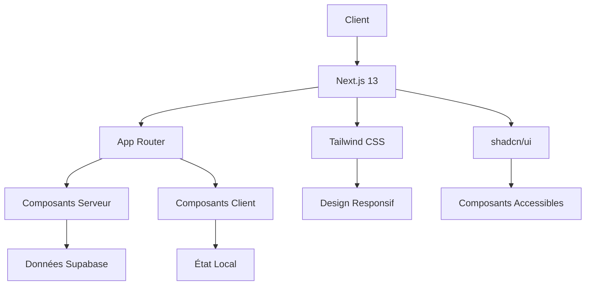
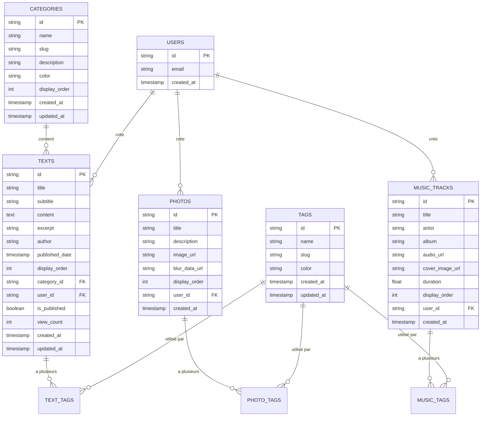
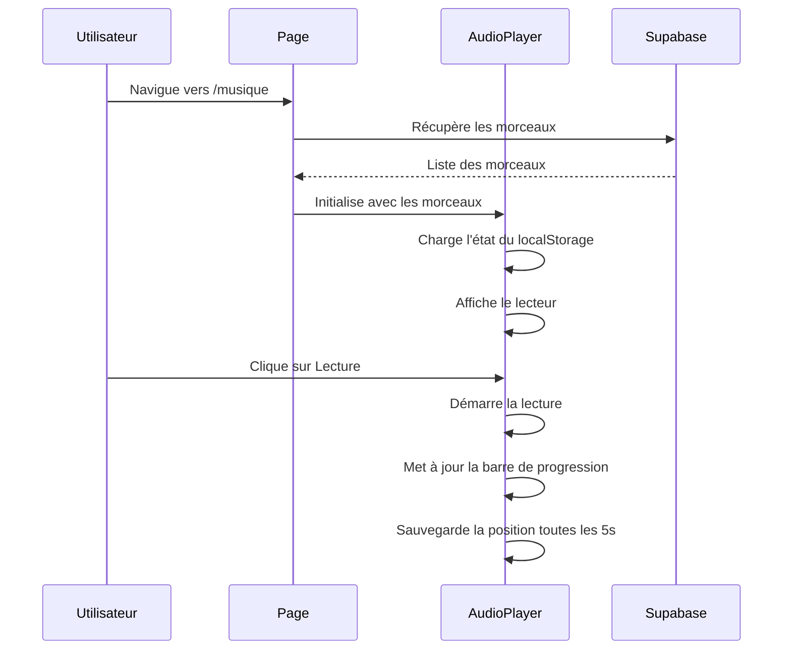
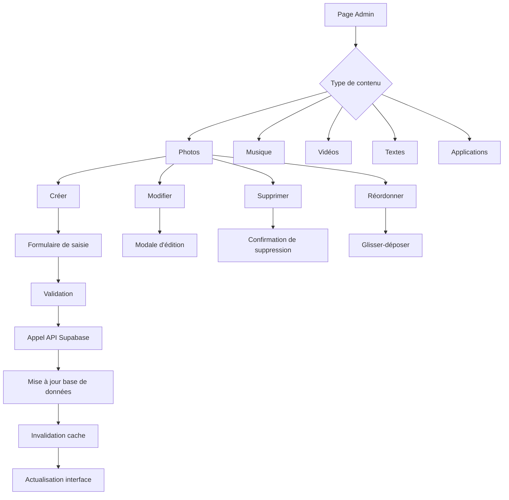

# Aperçu du Projet

<cite>
**Fichiers référencés dans ce document**  
- [README.md](file://README.md)
- [package.json](file://package.json)
- [app/layout.tsx](file://app/layout.tsx)
- [next.config.js](file://next.config.js)
- [tailwind.config.ts](file://tailwind.config.ts)
- [lib/supabaseClient.ts](file://lib/supabaseClient.ts)
- [contexts/ThemeContext.tsx](file://contexts/ThemeContext.tsx)
- [contexts/ColorThemeContext.tsx](file://contexts/ColorThemeContext.tsx)
- [contexts/AuthContext.tsx](file://contexts/AuthContext.tsx)
- [components/AppLayout.tsx](file://components/AppLayout.tsx)
- [components/music/AudioPlayer.tsx](file://components/music/AudioPlayer.tsx)
- [components/photos/PhotoGrid.tsx](file://components/photos/PhotoGrid.tsx)
- [components/videos/VideoGrid.tsx](file://components/videos/VideoGrid.tsx)
- [components/texts/TextListAdmin.tsx](file://components/texts/TextListAdmin.tsx)
- [services/photoService.ts](file://services/photoService.ts)
</cite>

## Table des matières
1. [Introduction](#introduction)
2. [Architecture Globale](#architecture-globale)
3. [Gestion des Thèmes](#gestion-des-thèmes)
4. [Intégration Supabase](#intégration-supabase)
5. [Fonctionnalités Multimédia](#fonctionnalités-multimédia)
6. [Interface d'Administration](#interface-dadministration)
7. [Déploiement et Performances](#déploiement-et-performances)
8. [Dépendances Principales](#dépendances-principales)

## Introduction

Le projet Portfolio est une application web interactive conçue pour présenter des créations artistiques et professionnelles à travers un portfolio multimédia complet. L'application permet de gérer et d'afficher divers types de contenus tels que des photos, de la musique, des vidéos, des textes et des applications, le tout dans une interface moderne et personnalisable. L'objectif principal est de fournir une vitrine élégante et fonctionnelle pour exposer des œuvres créatives tout en offrant une expérience utilisateur fluide et accessible.

**Section sources**
- [README.md](file://README.md)

## Architecture Globale

L'architecture du projet repose sur Next.js 13 avec App Router, qui permet une structure de routage moderne et performante. L'application utilise un modèle hybride combinant des composants serveur et client pour optimiser les performances et l'interactivité. Le layout racine, défini dans `layout.tsx`, encapsule les contextes principaux de l'application, notamment pour la gestion des thèmes, de l'authentification et de la mise en page.

La structure des pages suit une organisation claire basée sur les types de contenus : chaque section (photos, musique, vidéos, textes, applications) dispose de son propre espace dans le répertoire `app/`. L'approche App Router permet un chargement efficace des données et une navigation fluide entre les différentes sections du portfolio.



**Diagram sources**
- [app/layout.tsx](file://app/layout.tsx)
- [components/AppLayout.tsx](file://components/AppLayout.tsx)

**Section sources**
- [app/layout.tsx](file://app/layout.tsx)
- [next.config.js](file://next.config.js)

## Gestion des Thèmes

Le système de thèmes est l'un des aspects clés de l'application, offrant aux utilisateurs une personnalisation approfondie de l'apparence. Deux niveaux de thématisation sont disponibles : un thème clair/sombre basé sur les préférences système, et un système de couleurs personnalisables avec quatre thèmes prédéfinis (océan, forêt, soleil, rose) plus un mode personnalisé.

L'implémentation repose sur deux contextes React : `ThemeContext` pour gérer le mode clair/sombre, et `ColorThemeContext` pour gérer les palettes de couleurs. Les préférences sont persistées dans le localStorage, permettant de conserver les choix de l'utilisateur entre les sessions. Les variables CSS sont utilisées pour appliquer dynamiquement les couleurs, intégrées avec Tailwind CSS via des classes personnalisées.

```mermaid
classDiagram
class ThemeContext {
+theme : 'light' | 'dark' | 'system'
+setTheme(theme)
+cycleTheme()
+resolvedTheme : 'light' | 'dark'
}
class ColorThemeContext {
+colorTheme : 'ocean' | 'forest' | 'sun' | 'rose' | 'custom'
+setColorTheme(theme)
+customColors : {primary, secondary, accent}
+setCustomColors(colors)
}
ThemeContext --> ColorThemeContext : "utilisé dans"
ThemeContext --> "localStorage" : "persiste"
ColorThemeContext --> "localStorage" : "persiste"
```

**Diagram sources**
- [contexts/ThemeContext.tsx](file://contexts/ThemeContext.tsx)
- [contexts/ColorThemeContext.tsx](file://contexts/ColorThemeContext.tsx)

**Section sources**
- [contexts/ThemeContext.tsx](file://contexts/ThemeContext.tsx)
- [contexts/ColorThemeContext.tsx](file://contexts/ColorThemeContext.tsx)
- [tailwind.config.ts](file://tailwind.config.ts)

## Intégration Supabase

Supabase joue un rôle central dans l'architecture du projet, fournissant une solution complète pour l'authentification, la base de données et le stockage. L'application utilise le client Supabase pour interagir avec ces services, avec une couche d'abstraction via des services dédiés dans le répertoire `services/`.

L'authentification est gérée par le contexte `AuthContext`, qui surveille l'état de session et expose les fonctions de connexion et de déconnexion. La base de données contient plusieurs tables pour gérer les différents types de contenus (photos, musique, vidéos, textes, etc.), avec des relations appropriées pour les métadonnées comme les catégories et les tags. Le stockage est utilisé pour héberger les fichiers multimédias, avec des URLs signées pour un accès sécurisé.



**Diagram sources**
- [lib/supabaseClient.ts](file://lib/supabaseClient.ts)
- [services/photoService.ts](file://services/photoService.ts)

**Section sources**
- [lib/supabaseClient.ts](file://lib/supabaseClient.ts)
- [contexts/AuthContext.tsx](file://contexts/AuthContext.tsx)

## Fonctionnalités Multimédia

Le portfolio offre une gestion complète des différents types de contenus multimédias, chacun avec une interface adaptée à son format. La galerie photos utilise un maillage responsive avec des cartes interactives, tandis que le lecteur de musique propose une expérience riche avec visualisation audio, gestion de playlist et contrôles avancés.

Le lecteur audio, implémenté dans `AudioPlayer.tsx`, inclut des fonctionnalités comme la lecture aléatoire, la répétition, la sauvegarde de l'état de lecture, et plusieurs types de visualisations (barres, onde, cercle, points, ligne). L'état du lecteur est persisté dans le localStorage, permettant de reprendre la lecture là où l'utilisateur s'était arrêté. La galerie de vidéos utilise un système de modale pour la lecture, avec un affichage en grille responsive.



**Diagram sources**
- [components/music/AudioPlayer.tsx](file://components/music/AudioPlayer.tsx)
- [components/photos/PhotoGrid.tsx](file://components/photos/PhotoGrid.tsx)
- [components/videos/VideoGrid.tsx](file://components/videos/VideoGrid.tsx)

**Section sources**
- [components/music/AudioPlayer.tsx](file://components/music/AudioPlayer.tsx)
- [components/photos/PhotoGrid.tsx](file://components/photos/PhotoGrid.tsx)
- [components/videos/VideoGrid.tsx](file://components/videos/VideoGrid.tsx)

## Interface d'Administration

L'interface d'administration, accessible via le chemin `/admin`, permet aux créateurs de gérer leur contenu de manière efficace. Chaque type de contenu dispose d'une page d'administration dédiée avec des fonctionnalités de création, modification, suppression et réorganisation. L'interface est conçue pour être intuitive, avec des listes interactives, des formulaires de saisie et des confirmations de suppression.

Les composants d'administration utilisent des modales pour les opérations de modification, permettant de rester dans le contexte de la liste tout en éditant un élément. Le réordonnancement des éléments est possible par glisser-déposer, avec une mise à jour automatique de l'ordre d'affichage dans la base de données. La gestion des métadonnées comme les catégories et les tags est intégrée directement dans les formulaires d'édition.



**Diagram sources**
- [components/texts/TextListAdmin.tsx](file://components/texts/TextListAdmin.tsx)
- [app/admin/photos/page.tsx](file://app/admin/photos/page.tsx)

**Section sources**
- [components/texts/TextListAdmin.tsx](file://components/texts/TextListAdmin.tsx)
- [app/admin/photos/page.tsx](file://app/admin/photos/page.tsx)

## Déploiement et Performances

Le projet est configuré pour un export statique, permettant un déploiement universel sur n'importe quel hébergeur de fichiers statiques. Cette approche offre d'excellentes performances, une sécurité renforcée et une disponibilité hors ligne. La configuration dans `next.config.js` inclut l'option `output: 'export'` qui génère un site statique dans le dossier `out/`.

Plusieurs optimisations de performance sont implémentées, notamment la séparation des chunks pour charger uniquement le code nécessaire, le lazy loading des composants non essentiels, et la mise en cache côté client. Le bundle analyzer est configuré pour identifier les opportunités d'optimisation, et les images sont déchargées du traitement Next.js pour améliorer les temps de build.

**Section sources**
- [next.config.js](file://next.config.js)
- [package.json](file://package.json)

## Dépendances Principales

Le projet s'appuie sur un écosystème de dépendances modernes et bien intégrées. Next.js 13 fournit le cadre principal avec App Router, tandis que React 18 permet une interface utilisateur dynamique. Tailwind CSS, combiné avec shadcn/ui, offre un design élégant et cohérent, basé sur Radix UI pour des composants accessibles.

Supabase est la pierre angulaire du backend, fournissant authentification, base de données PostgreSQL et stockage d'objets. D'autres dépendances notables incluent Lucide React pour les icônes, Sonner pour les notifications, et React Hook Form pour la gestion des formulaires. Le typage TypeScript strict assure la robustesse du code, et ESLint garantit la qualité du code.

**Section sources**
- [package.json](file://package.json)
- [README.md](file://README.md)