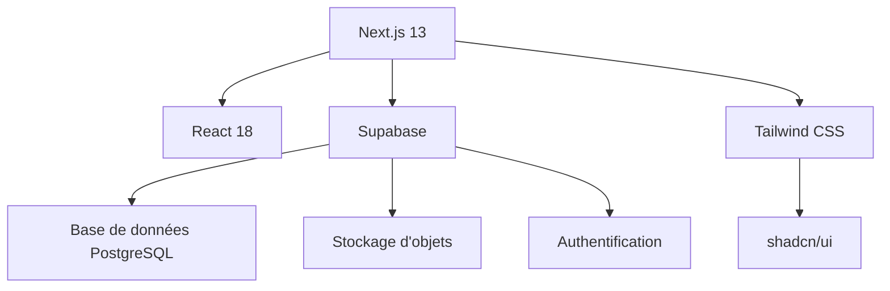
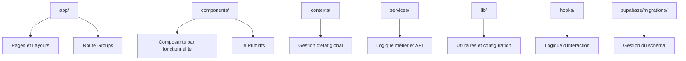
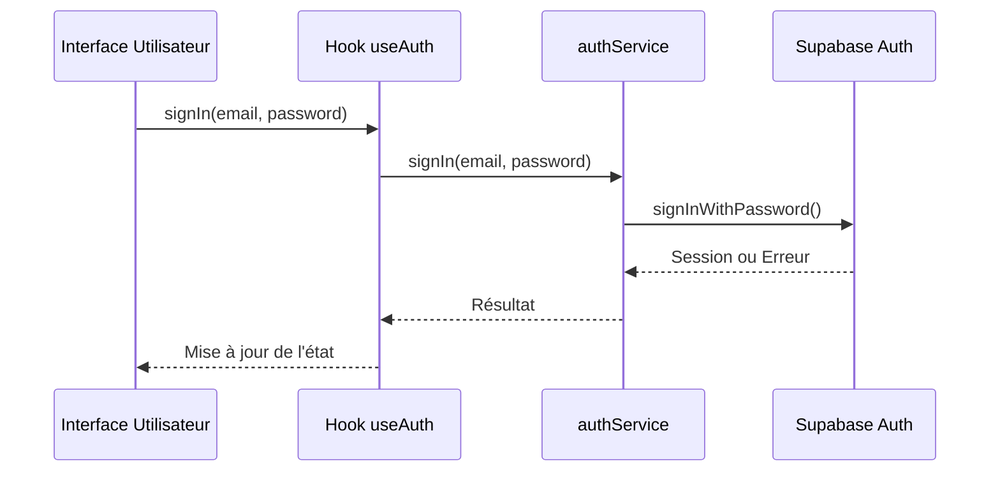
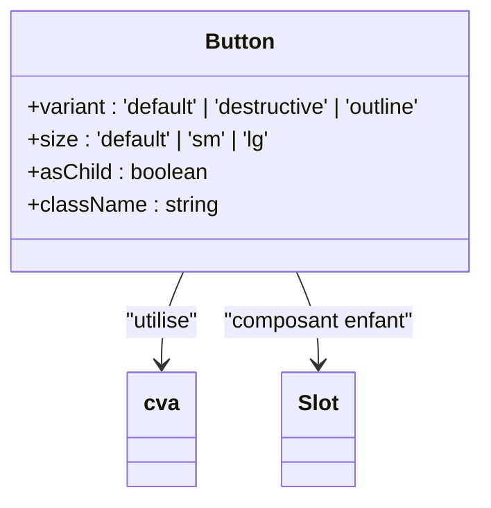
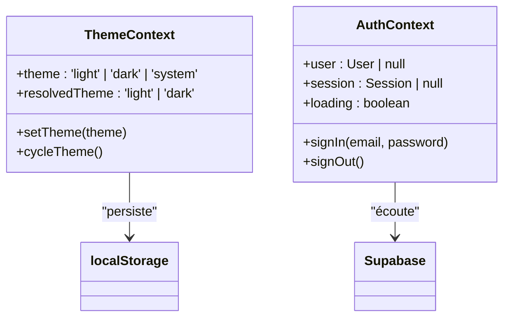

# Architecture Technique

<cite>
**Fichiers référencés dans ce document**  
- [package.json](file://package.json)
- [next.config.js](file://next.config.js)
- [tailwind.config.ts](file://tailwind.config.ts)
- [app/layout.tsx](file://app/layout.tsx)
- [contexts/ThemeContext.tsx](file://contexts/ThemeContext.tsx)
- [contexts/AuthContext.tsx](file://contexts/AuthContext.tsx)
- [components/AppLayout.tsx](file://components/AppLayout.tsx)
- [lib/supabaseClient.ts](file://lib/supabaseClient.ts)
- [services/authService.ts](file://services/authService.ts)
- [services/photoService.ts](file://services/photoService.ts)
- [lib/cache.ts](file://lib/cache.ts)
- [components/photos/PhotoCard.tsx](file://components/photos/PhotoCard.tsx)
- [components/ui/button.tsx](file://components/ui/button.tsx)
</cite>

## Table des matières
1. [Introduction](#introduction)
2. [Stack Technique](#stack-technique)
3. [Structure du Projet](#structure-du-projet)
4. [Modèles de Conception](#modèles-de-conception)
5. [Flux de Données et Interactions](#flux-de-données-et-interactions)
6. [Architecture des Composants](#architecture-des-composants)
7. [Gestion d'État Global](#gestion-détat-global)
8. [Conclusion](#conclusion)

## Introduction

Ce document présente l'architecture technique du projet Portfolio, une application web moderne utilisant la stack Next.js 13 avec App Router, React 18, Supabase, Tailwind CSS et shadcn/ui. L'architecture repose sur des principes de modularité, de performance et d'expérience utilisateur optimale, en exploitant pleinement les fonctionnalités de rendu côté serveur (SSR) et les composants React. Le projet est structuré pour favoriser la maintenabilité, la scalabilité et la séparation des préoccupations.

**Section sources**
- [package.json](file://package.json)
- [next.config.js](file://next.config.js)

## Stack Technique

Le projet s'appuie sur une stack technologique moderne et cohérente :

- **Next.js 13 (App Router)** : Utilisé pour le routage, le rendu côté serveur (SSR), la génération statique (SSG) et l'optimisation des performances. L'App Router permet une organisation hiérarchique des routes et des layouts.
- **React 18** : Bibliothèque fondamentale pour la création d'interfaces utilisateur, avec prise en charge des hooks, du rendu concurrent et des composants asynchrones.
- **Supabase** : Plateforme backend open source utilisée pour l'authentification, le stockage d'objets (images, audio, vidéos) et la gestion de la base de données PostgreSQL. Elle fournit une API REST et WebSocket pour la synchronisation en temps réel.
- **Tailwind CSS** : Framework CSS utilitaire permettant un style rapide et cohérent directement dans les classes JSX, avec prise en charge du dark mode via les classes conditionnelles.
- **shadcn/ui** : Collection de composants UI réutilisables basés sur Radix UI et Tailwind CSS, assurant une accessibilité, une personnalisation facile et une intégration fluide avec le design système.

La configuration de Tailwind est étendue pour supporter les thèmes personnalisés via des variables CSS, et le dark mode est activé par la classe `dark` sur l'élément racine.

**Diagram sources**
- [package.json](file://package.json)
- [tailwind.config.ts](file://tailwind.config.ts)

## Structure du Projet

La structure du projet suit une organisation fonctionnelle et thématique, facilitant la navigation et la maintenance :

- **app/** : Répertoire principal utilisant l'App Router de Next.js. Contient les pages, les layouts et les composants spécifiques aux routes. Chaque sous-répertoire correspond à une section du site (ex: `photos/`, `musique/`, `admin/`).
- **components/** : Stocke tous les composants React réutilisables, organisés par fonctionnalité (gists, music, photos, etc.) et par type (ui pour les composants basiques, utilitaires comme AppLayout).
- **contexts/** : Gestion de l'état global via React Context, incluant les thèmes (clair/sombre), l'authentification et les préférences utilisateur.
- **services/** : Couche métier qui encapsule la logique d'accès aux données, communique avec Supabase et gère le cache. Chaque service correspond à une entité (photoService, musicService, etc.).
- **lib/** : Fonctions utilitaires, bibliothèques partagées, configuration (supabaseClient, cache, validation, etc.).
- **hooks/** : Hooks React personnalisés pour encapsuler la logique d'interaction (useAuth, useGlobalSearch, etc.).
- **supabase/migrations/** : Scripts SQL pour la gestion du schéma de la base de données Supabase.
- **database/schema.sql** : Schéma de base de données relationnelle définissant les tables et leurs relations.

Cette structure favorise la séparation des préoccupations, où chaque répertoire a un rôle bien défini et limité.

**Diagram sources**
- [app/layout.tsx](file://app/layout.tsx)
- [contexts/ThemeContext.tsx](file://contexts/ThemeContext.tsx)
- [services/photoService.ts](file://services/photoService.ts)
- [lib/supabaseClient.ts](file://lib/supabaseClient.ts)

## Modèles de Conception

Le projet implémente plusieurs modèles de conception clés pour assurer une architecture robuste et maintenable.

### Pattern de Double Layout

Le projet utilise un pattern de double layout : le layout racine dans `app/layout.tsx` est un Server Component, tandis que les composants interactifs sont des Client Components. Cela permet de charger le squelette de l'application côté serveur pour un rendu rapide, tout en activant l'interactivité côté client uniquement là où nécessaire.

Le layout racine importe des fournisseurs de contexte (ThemeProvider, AuthProvider) qui doivent être des Client Components, mais sont encapsulés dans des composants racine qui peuvent être rendus côté serveur.

### Pattern de Service avec Gestion de Cache et d'Erreurs

Chaque service (ex: photoService) suit un pattern cohérent :
- **Abstraction de l'API** : Encapsule les appels à Supabase.
- **Gestion de cache** : Utilise un système de cache en mémoire et dans sessionStorage via `lib/cache.ts` pour éviter les appels redondants.
- **Validation et sécurité** : Valide les entrées (URL, permissions) et applique un rate limiting.
- **Invalidation du cache** : Après une mutation (create, update, delete), le cache est invalidé pour les clés pertinentes.

Par exemple, `photoService.getAllPhotosWithTags()` vérifie d'abord le cache, effectue une requête Supabase si nécessaire, et stocke le résultat avec une durée de vie (TTL).

### Approche Atomic Design

Les composants suivent une approche similaire à Atomic Design :
- **Atomiques** : Composants basiques comme `Button`, `Input` dans `components/ui/`.
- **Moléculaires** : Composants composés comme `PhotoCard`, `TrackList`.
- **Organismes** : Composants complexes comme `AppLayout`, `Sidebar`.
- **Templates** : Les layouts dans `app/` définissent la structure globale.
- **Pages** : Les fichiers `page.tsx` combinent tous les éléments pour une vue spécifique.

## Flux de Données et Interactions

Le flux de données suit un modèle unidirectionnel typique de React, avec des interactions asynchrones via les services Supabase.

### Exemple : Affichage d'une Photo

1. **Page** (`app/photos/page.tsx`) appelle un hook personnalisé ou un service.
2. **Service** (`photoService.getAllPhotosWithTags()`) :
   - Vérifie le cache pour la clé `photos:all-with-tags`.
   - Si absent, effectue une requête Supabase avec un `SELECT` incluant les tags via une jointure.
   - Formate les données et les met en cache.
3. **Composant** (`PhotoList`) reçoit les données et rend des `PhotoCard`.
4. **Interaction utilisateur** : Clic sur une photo ouvre un modal via `PhotoViewerModal`.

### Exemple : Authentification

1. **Formulaire de login** (`login/page.tsx`) appelle `useAuth().signIn()`.
2. **Hook** `useAuth` délègue à `authService.signIn()`.
3. **Service** `authService` appelle `supabaseClient.auth.signInWithPassword()`.
4. **Supabase** renvoie une session, qui est propagée via `AuthProvider` et stockée localement.

**Diagram sources**
- [contexts/AuthContext.tsx](file://contexts/AuthContext.tsx)
- [services/authService.ts](file://services/authService.ts)
- [lib/supabaseClient.ts](file://lib/supabaseClient.ts)

## Architecture des Composants

L'architecture des composants est centrée sur la réutilisabilité, la performance et l'accessibilité.

### Composants UI (shadcn/ui)

Les composants dans `components/ui/` sont des wrappers autour de Radix UI, stylisés avec Tailwind. Par exemple, `Button` utilise `cva` pour définir des variantes (default, destructive, outline) et des tailles.

**Diagram sources**
- [components/ui/button.tsx](file://components/ui/button.tsx)

### Composants Métier

Les composants métier comme `PhotoCard` sont optimisés avec `React.memo` pour éviter les rendus inutiles. Ils utilisent `OptimizedImage` pour le chargement paresseux et le placeholder LQIP (Low Quality Image Placeholder).

## Gestion d'État Global

La gestion d'état global repose sur React Context pour deux domaines principaux :

### Thème (clair/sombre)

Le `ThemeContext` gère le thème utilisateur (light, dark, system). Il synchronise l'état avec `localStorage` et écoute les préférences système via `window.matchMedia`. Le `ColorThemeContext` pourrait gérer des palettes de couleurs avancées.

### Authentification

Le `AuthProvider` gère l'état d'authentification (utilisateur, session) en s'abonnant aux changements d'état Supabase via `onAuthStateChange`. Il expose un hook `useAuth` pour accéder à l'état depuis n'importe quel composant.

**Diagram sources**
- [contexts/ThemeContext.tsx](file://contexts/ThemeContext.tsx)
- [contexts/AuthContext.tsx](file://contexts/AuthContext.tsx)

## Conclusion

L'architecture du projet Portfolio est bien structurée, moderne et conforme aux meilleures pratiques de développement React. L'utilisation de Next.js 13 avec App Router, combinée à une séparation claire des préoccupations (composants, services, contextes), permet une application performante, maintenable et évolutive. Les modèles de conception comme le pattern de service avec cache, l'approche Atomic Design et la gestion d'état via Context assurent une expérience utilisateur fluide et une base solide pour de futures extensions.