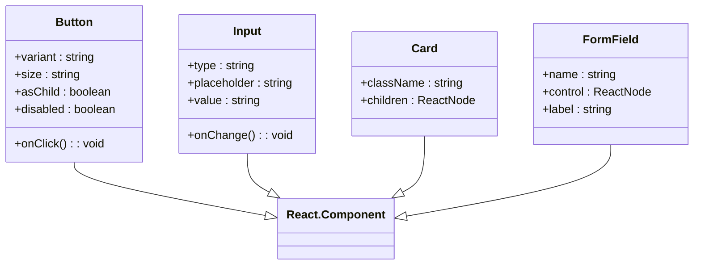
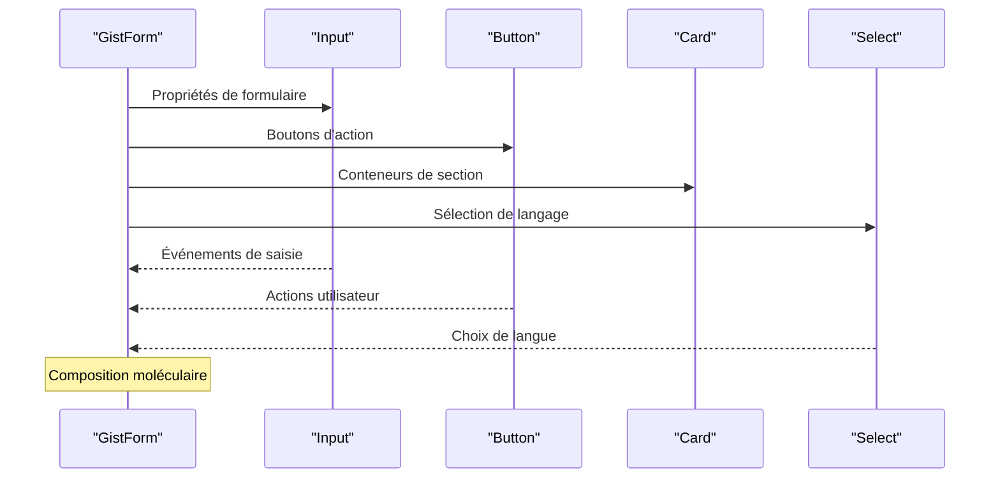
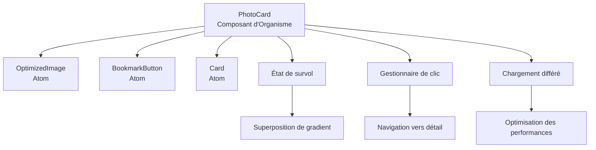
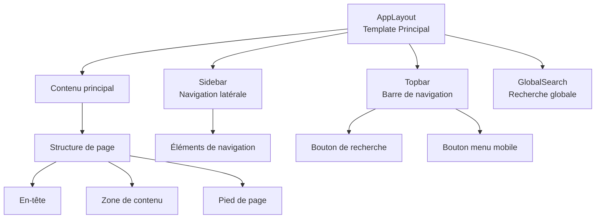
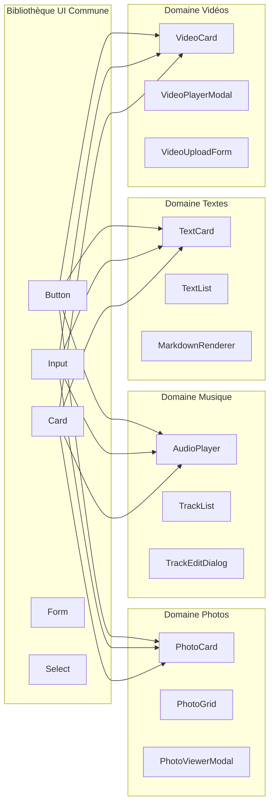
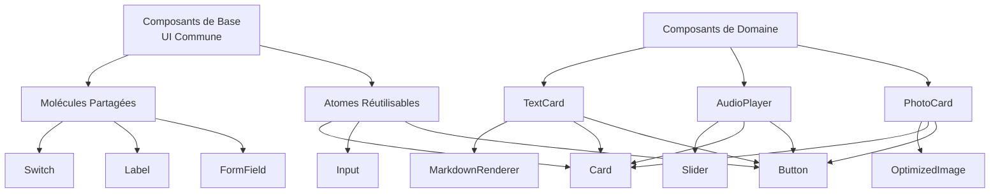
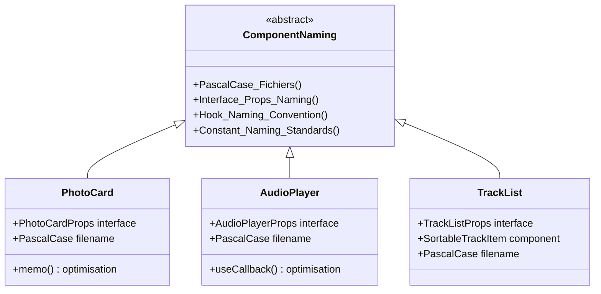
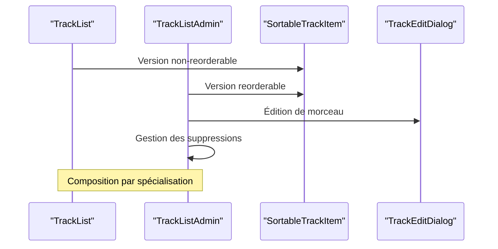
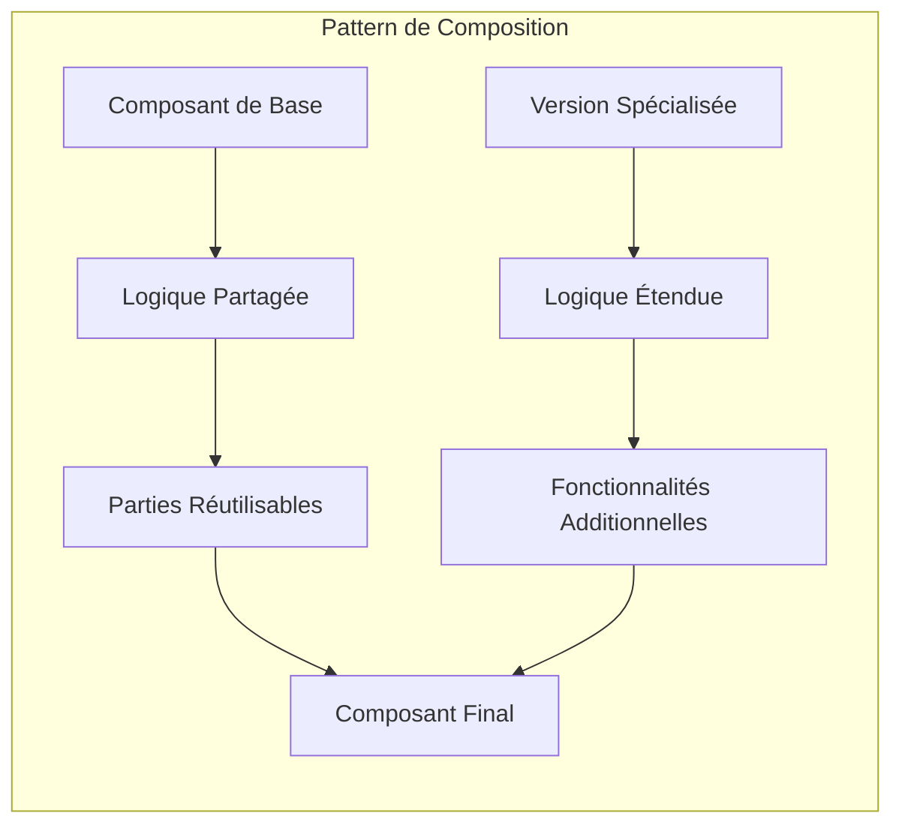
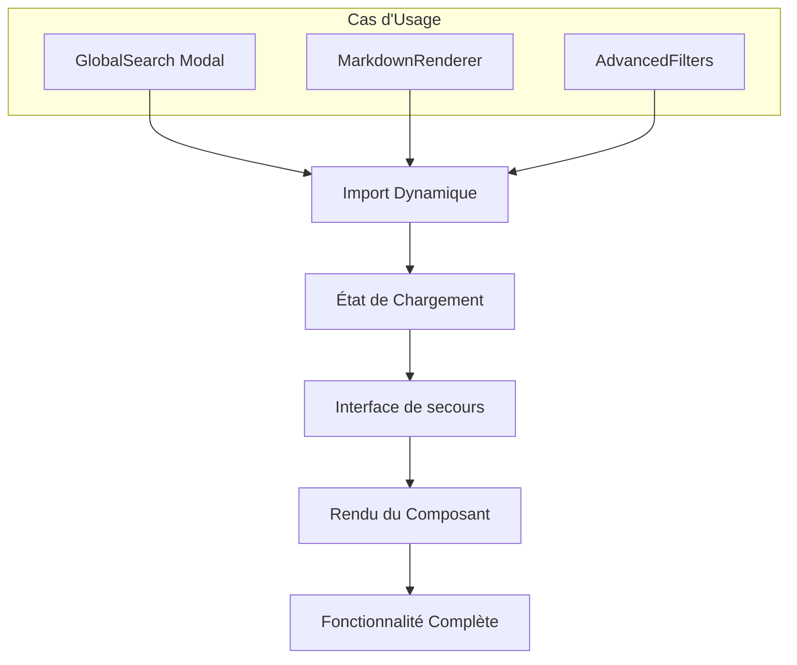

# Architecture Atomic Design

<cite>
**Fichiers Référencés dans ce Document**
- [components/ui/button.tsx](file://components/ui/button.tsx)
- [components/ui/input.tsx](file://components/ui/input.tsx)
- [components/ui/card.tsx](file://components/ui/card.tsx)
- [components/ui/form.tsx](file://components/ui/form.tsx)
- [components/gists/GistForm.tsx](file://components/gists/GistForm.tsx)
- [components/photos/PhotoCard.tsx](file://components/photos/PhotoCard.tsx)
- [components/music/AudioPlayer.tsx](file://components/music/AudioPlayer.tsx)
- [components/music/TrackList.tsx](file://components/music/TrackList.tsx)
- [components/music/TrackListAdmin.tsx](file://components/music/TrackListAdmin.tsx)
- [components/AppLayout.tsx](file://components/AppLayout.tsx)
- [components/texts/TextCard.tsx](file://components/texts/TextCard.tsx)
- [components/videos/VideoCard.tsx](file://components/videos/VideoCard.tsx)
- [AGENTS.md](file://AGENTS.md)
</cite>

## Table des Matières
1. [Introduction](#introduction)
2. [Hiérarchie des Composants](#hiérarchie-des-composants)
3. [Organisation par Domaine](#organisation-par-domaine)
4. [Architecture de Réutilisabilité](#architecture-de-réutilisabilité)
5. [Conventions de Nommage](#conventions-de-nommage)
6. [Documentation JSDoc Intégrée](#documentation-jsdoc-intégrée)
7. [Exemples de Composition](#exemples-de-composition)
8. [Patterns d'Utilisation](#patterns-dutilisation)
9. [Avantages de l'Architecture](#avantages-de-larchitecture)
10. [Conclusion](#conclusion)

## Introduction

Cette documentation présente l'implémentation de l'architecture Atomic Design dans le projet portfolio, une approche méthodologique de conception d'interfaces utilisateur basée sur la création de systèmes modulaires et réutilisables. L'architecture suit les principes fondamentaux de l'Atomic Design : Atomes, Molécules, Organismes, Templates et Pages.

L'implémentation adopte une structure modulaire où les composants sont organisés selon leur niveau de complexité et leur réutilisabilité, favorisant ainsi la maintenabilité, la cohérence visuelle et la facilité de développement.

## Hiérarchie des Composants

### Atomes (Atoms)

Les Atomes constituent les éléments fondamentaux de l'interface utilisateur, représentés par des composants de base sans état ou comportement complexe.



**Sources du Diagramme**
- [components/ui/button.tsx](file://components/ui/button.tsx#L37-L58)
- [components/ui/input.tsx](file://components/ui/input.tsx#L5-L26)
- [components/ui/card.tsx](file://components/ui/card.tsx#L5-L87)
- [components/ui/form.tsx](file://components/ui/form.tsx#L31-L180)

**Sources de Section**
- [components/ui/button.tsx](file://components/ui/button.tsx#L1-L58)
- [components/ui/input.tsx](file://components/ui/input.tsx#L1-L26)
- [components/ui/card.tsx](file://components/ui/card.tsx#L1-L87)

### Molécules (Molecules)

Les Molécules combinent plusieurs Atomes pour former des unités fonctionnelles plus complexes, souvent représentant des formulaires ou des composants interactifs.



**Sources du Diagramme**
- [components/gists/GistForm.tsx](file://components/gists/GistForm.tsx#L1-L429)

**Sources de Section**
- [components/gists/GistForm.tsx](file://components/gists/GistForm.tsx#L1-L429)

### Organismes (Organisms)

Les Organismes regroupent des Molécules et des Atomes pour créer des sections fonctionnelles de l'interface, souvent représentant des cartes ou des listes complexes.



**Sources du Diagramme**
- [components/photos/PhotoCard.tsx](file://components/photos/PhotoCard.tsx#L1-L60)

**Sources de Section**
- [components/photos/PhotoCard.tsx](file://components/photos/PhotoCard.tsx#L1-L60)
- [components/texts/TextCard.tsx](file://components/texts/TextCard.tsx#L1-L83)
- [components/videos/VideoCard.tsx](file://components/videos/VideoCard.tsx#L1-L76)

### Templates (Templates)

Les Templates structurent la disposition des Organismes et Molécules sur une page, définissant la grille et les espacements.



**Sources du Diagramme**
- [components/AppLayout.tsx](file://components/AppLayout.tsx#L1-L73)

**Sources de Section**
- [components/AppLayout.tsx](file://components/AppLayout.tsx#L1-L73)

## Organisation par Domaine

L'architecture organise les composants par domaine fonctionnel tout en partageant une bibliothèque d'UI commune.

### Structure des Domaines



**Sources du Diagramme**
- [components/photos/PhotoCard.tsx](file://components/photos/PhotoCard.tsx#L1-L60)
- [components/music/AudioPlayer.tsx](file://components/music/AudioPlayer.tsx#L1-L849)
- [components/texts/TextCard.tsx](file://components/texts/TextCard.tsx#L1-L83)
- [components/videos/VideoCard.tsx](file://components/videos/VideoCard.tsx#L1-L76)

### Partage de Bibliothèque Commune

La bibliothèque `components/ui/` fournit une base cohérente pour tous les domaines :

| Composant | Type | Responsabilité |
|-----------|------|----------------|
| `button.tsx` | Atom | Boutons avec variantes et tailles |
| `input.tsx` | Atom | Champs de saisie standard |
| `card.tsx` | Atom | Conteneurs avec en-têtes et pieds |
| `form.tsx` | Molecule | Système de formulaires complet |
| `select.tsx` | Atom | Sélections avec menu déroulant |

**Sources de Section**
- [components/ui/button.tsx](file://components/ui/button.tsx#L1-L58)
- [components/ui/input.tsx](file://components/ui/input.tsx#L1-L26)
- [components/ui/card.tsx](file://components/ui/card.tsx#L1-L87)
- [components/ui/form.tsx](file://components/ui/form.tsx#L1-L180)

## Architecture de Réutilisabilité

### Patterns de Composition

L'architecture favorise la réutilisabilité grâce à des patterns de composition bien établis :



**Sources du Diagramme**
- [components/music/AudioPlayer.tsx](file://components/music/AudioPlayer.tsx#L1-L849)
- [components/music/TrackList.tsx](file://components/music/TrackList.tsx#L1-L294)
- [components/texts/TextCard.tsx](file://components/texts/TextCard.tsx#L1-L83)

### Système de Props Typées

Chaque composant utilise des interfaces TypeScript strictes pour garantir la cohérence :

**Sources de Section**
- [components/music/AudioPlayer.tsx](file://components/music/AudioPlayer.tsx#L48-L52)
- [components/music/TrackList.tsx](file://components/music/TrackList.tsx#L28-L35)
- [components/texts/TextCard.tsx](file://components/texts/TextCard.tsx#L12-L16)

## Conventions de Nommage

### Standards de Nommage

L'architecture suit des conventions strictes pour faciliter la compréhension et la maintenance :

| Type | Convention | Exemple | Raison |
|------|------------|---------|--------|
| Fichiers Composants | `PascalCase.tsx` | `PhotoCard.tsx`, `AudioPlayer.tsx` | Distinction claire des composants React |
| Interfaces Props | `ComponentNameProps` | `PhotoCardProps`, `AudioPlayerProps` | Clarté des propriétés typées |
| Hooks Personnalisés | `useCamelCase` | `useAuth`, `useTheme` | Cohérence avec les conventions React |
| Constantes | `UPPER_SNAKE_CASE` | `DEFAULT_VOLUME`, `MAX_TRACKS` | Visibilité des valeurs constantes |

### Implémentation dans les Composants



**Sources du Diagramme**
- [AGENTS.md](file://AGENTS.md#L28-L100)

**Sources de Section**
- [AGENTS.md](file://AGENTS.md#L1-L26)

## Documentation JSDoc Intégrée

### Structure de Documentation

Chaque composant inclut une documentation JSDoc complète intégrée :

```typescript
/**
 * Composant PhotoCard - Carte d'affichage d'une photo
 * 
 * @param photo - Objet photo contenant les métadonnées
 * @param onClick - Fonction de callback appelée lors du clic
 * @param className - Classes CSS additionnelles
 * 
 * @description
 * Composant d'organisme qui affiche une carte de photo avec
 * image optimisée, bouton de favoris et informations contextuelles.
 * 
 * @example
 * ```tsx
 * <PhotoCard
 *   photo={photoData}
 *   onClick={() => navigate(`/photos/${photoData.id}`)}
 * />
 * ```
 */
```

### Exemples de Documentation Complète

**Sources de Section**
- [components/photos/PhotoCard.tsx](file://components/photos/PhotoCard.tsx#L1-L60)
- [components/music/AudioPlayer.tsx](file://components/music/AudioPlayer.tsx#L48-L52)
- [components/texts/TextCard.tsx](file://components/texts/TextCard.tsx#L12-L16)

## Exemples de Composition

### Construction de TrackList à partir de TrackListAdmin

L'exemple suivant illustre la composition entre deux composants similaires mais spécialisés :



**Sources du Diagramme**
- [components/music/TrackList.tsx](file://components/music/TrackList.tsx#L1-L294)
- [components/music/TrackListAdmin.tsx](file://components/music/TrackListAdmin.tsx#L1-L264)

### Pattern de Composition Récurrent



**Sources du Diagramme**
- [components/music/TrackList.tsx](file://components/music/TrackList.tsx#L194-L294)
- [components/music/TrackListAdmin.tsx](file://components/music/TrackListAdmin.tsx#L29-L264)

**Sources de Section**
- [components/music/TrackList.tsx](file://components/music/TrackList.tsx#L1-L294)
- [components/music/TrackListAdmin.tsx](file://components/music/TrackListAdmin.tsx#L1-L264)

## Patterns d'Utilisation

### Lazy Loading et Optimisation

L'architecture implémente des patterns de lazy loading pour optimiser les performances :



### Gestion d'État et Contextes

L'architecture utilise des contextes pour partager l'état entre composants :

```mermaid
classDiagram
class AuthContext {
+user : User | null
+login() : void
+logout() : void
+loading : boolean
}
class ThemeContext {
+theme : string
+toggleTheme() : void
+setTheme() : void
}
class ColorThemeContext {
+colorScheme : string
+setColorScheme() : void
}
AuthContext --> ProtectedRoute["Composants protégés"]
ThemeContext --> AllComponents["Tous les composants"]
ColorThemeContext --> UI_Components["Composants UI"]
```

**Sources de Section**
- [components/AppLayout.tsx](file://components/AppLayout.tsx#L11-L15)

## Avantages de l'Architecture

### Maintenabilité

L'architecture Atomic Design offre plusieurs avantages en termes de maintenabilité :

1. **Modularité** : Chaque composant a une responsabilité claire et limitée
2. **Réutilisabilité** : Les Atomes et Molécules peuvent être réutilisés dans différents contextes
3. **Testabilité** : Les composants sont facilement testables individuellement
4. **Évolutive** : Nouveaux composants peuvent être ajoutés sans perturber l'existant

### Cohérence Visuelle

La bibliothèque UI commune garantit une cohérence visuelle globale :

| Aspect | Avantage | Implémentation |
|--------|----------|----------------|
| Couleurs | Palette cohérente | Variables CSS partagées |
| Typographie | Hiérarchie claire | Système de tailles défini |
| Espacement | Grille uniforme | Spacing scale standardisé |
| Interactions | Comportements prévisibles | Patterns d'interaction réplicables |

### Performance

L'architecture optimise les performances grâce à :

1. **Lazy Loading** : Chargement paresseux des composants lourds
2. **Memoization** : Optimisation des re-rendus avec `React.memo`
3. **Code Splitting** : Division du bundle par domaine
4. **Optimisation des images** : Composants d'image optimisés

## Conclusion

L'implémentation d'Atomic Design dans ce projet portfolio démontre une approche mature et structurée de développement d'interfaces utilisateur. L'organisation hiérarchique des composants, combinée à une bibliothèque UI commune et des conventions de nommage strictes, crée un système robuste et maintenable.

Les patterns de composition permettent une évolution flexible de l'application, tandis que les conventions de documentation et de nommage assurent la lisibilité et la compréhension du code. L'architecture favorise également les bonnes pratiques de performance et d'accessibilité, positionnant le projet comme une base solide pour des développements futurs.

Cette approche démontre comment l'Atomic Design peut être adaptée à des projets React modernes, offrant une solution scalable et maintenable pour la création d'interfaces utilisateur complexes.