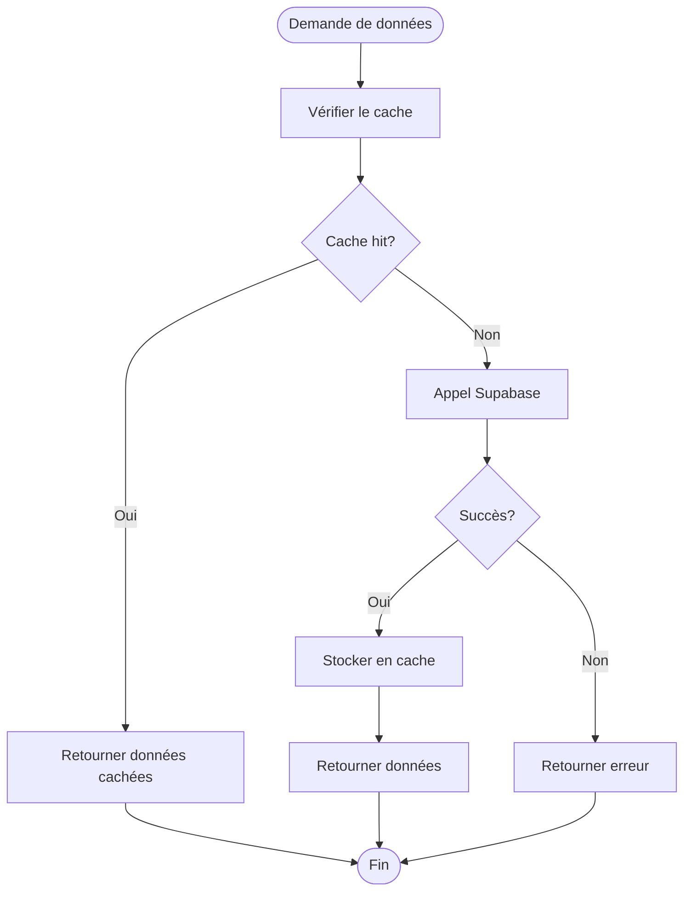
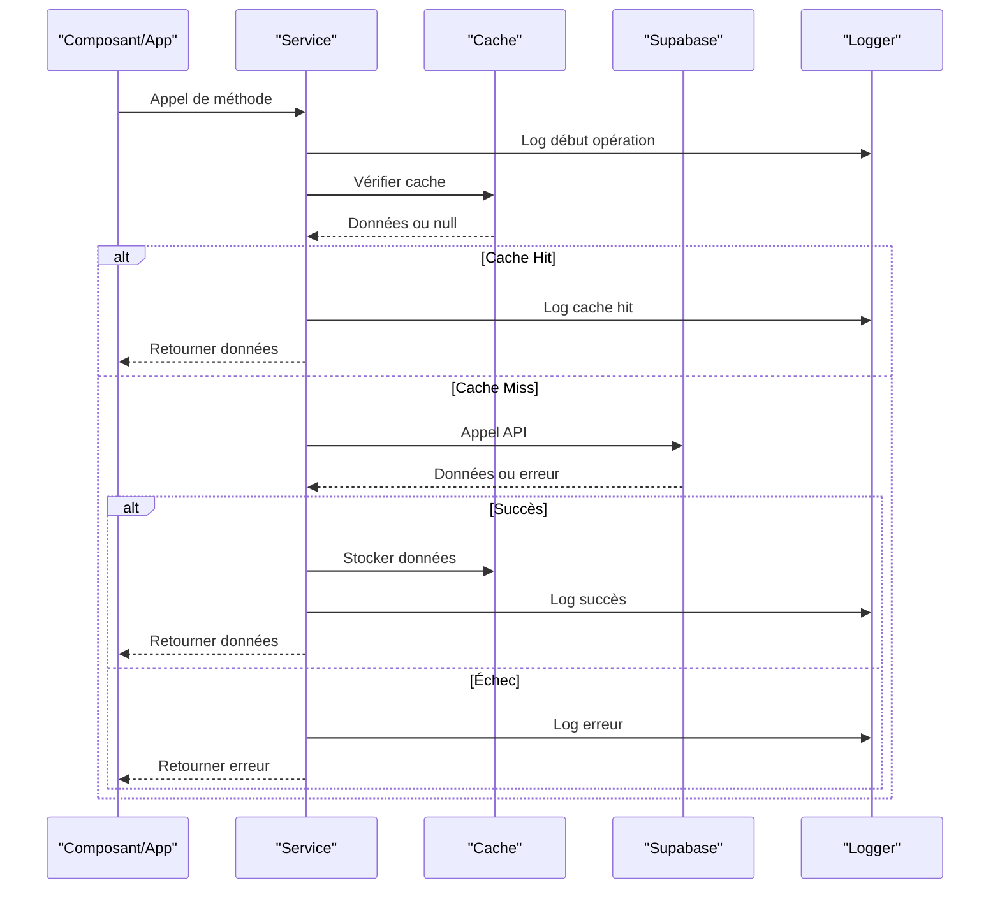
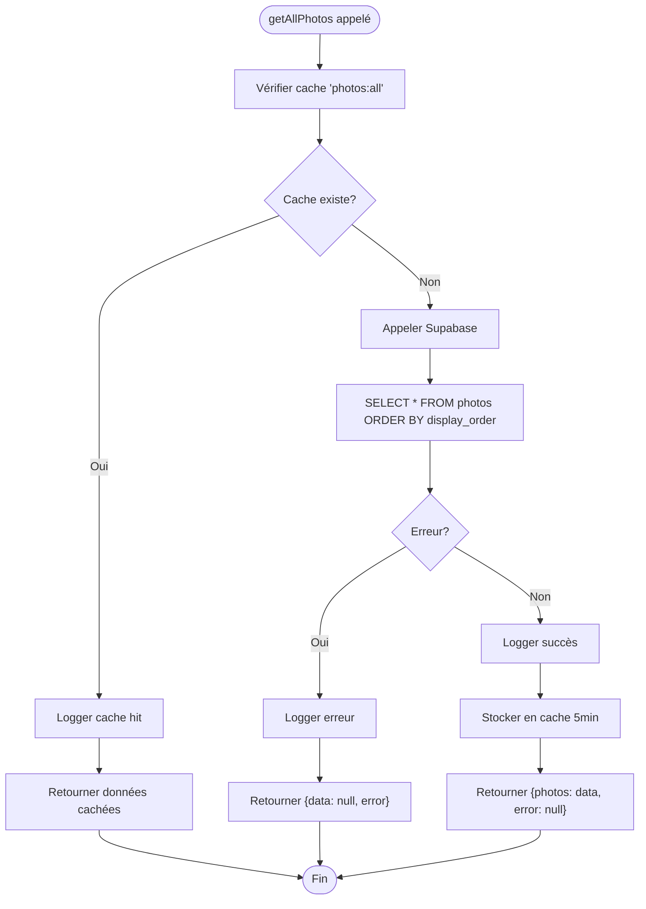

# Couche de Service

<cite>
**Fichiers Référencés dans ce Document**
- [photoService.ts](file://services/photoService.ts)
- [musicService.ts](file://services/musicService.ts)
- [textService.ts](file://services/textService.ts)
- [videoService.ts](file://services/videoService.ts)
- [gistService.ts](file://services/gistService.ts)
- [cache.ts](file://lib/cache.ts)
- [logger.ts](file://lib/logger.ts)
</cite>

## Table des Matières
1. [Introduction](#introduction)
2. [Structure de la Couche de Service](#structure-de-la-couche-de-service)
3. [Pattern Uniforme `{data, error}`](#pattern-uniforme-data-error)
4. [Intégration du Cache](#intégration-du-cache)
5. [Système de Logging](#système-de-logging)
6. [Flux Typique d'une Requête](#flux-typique-dune-requête)
7. [Bonnes Pratiques](#bonnes-pratiques)
8. [Exemples Concrets](#exemples-concrets)
9. [Avantages de l'Abstraction](#avantages-de-labstraction)
10. [Conclusion](#conclusion)

## Introduction

La couche de service constitue l'épine dorsale de l'architecture du projet, fournissant une interface unifiée pour interagir avec la base de données Supabase tout en implémentant des patterns de gestion d'erreur cohérents, de cache intelligent et de logging structuré. Cette couche abstrait la complexité des opérations CRUD et assure une expérience développeur optimale.

## Structure de la Couche de Service

Chaque service suit un pattern strict basé sur l'export d'un objet contenant des méthodes asynchrones qui retournent toujours un tuple `{data, error}`. Cette structure permet une gestion d'erreur prévisible et une séparation claire des responsabilités.

```mermaid
classDiagram
class ServiceBase {
+async getAll() Promise~{data, error}~
+async getById(id) Promise~{data, error}~
+async create(data) Promise~{data, error}~
+async update(id, updates) Promise~{data, error}~
+async delete(id) Promise~{error}~
}
class PhotoService {
+async getAllPhotos() Promise~{photos, error}~
+async getAllPhotosWithTags() Promise~{photos, error}~
+async getPhotoById(id) Promise~{photo, error}~
+async createPhoto(photoData) Promise~{photo, error}~
+async updatePhoto(id, updates) Promise~{photo, error}~
+async deletePhoto(id) Promise~{error}~
+async createPhotoWithTags(photoData, tagIds) Promise~{photo, error}~
}
class MusicService {
+async getAllTracks() Promise~{tracks, error}~
+async getAllTracksWithTags() Promise~{tracks, error}~
+async getTrackById(id) Promise~{track, error}~
+async createTrack(trackData) Promise~{track, error}~
+async updateTrack(id, updates) Promise~{track, error}~
+async deleteTrack(id) Promise~{error}~
+async createTrackWithTags(trackData, tagIds) Promise~{track, error}~
}
class TextService {
+async getAllTexts() Promise~{texts, error}~
+async getTextById(id) Promise~{text, error}~
+async createText(textData) Promise~{text, error}~
+async updateText(id, updates) Promise~{text, error}~
+async deleteText(id) Promise~{error}~
+async getTextsWithMetadata() Promise~{texts, error}~
+async createTextWithTags(textData, tagIds) Promise~{text, error}~
}
ServiceBase <|-- PhotoService
ServiceBase <|-- MusicService
ServiceBase <|-- TextService
```

**Sources du Diagramme**
- [photoService.ts](file://services/photoService.ts#L7-L221)
- [musicService.ts](file://services/musicService.ts#L7-L301)
- [textService.ts](file://services/textService.ts#L8-L385)

**Sources de Section**
- [photoService.ts](file://services/photoService.ts#L7-L221)
- [musicService.ts](file://services/musicService.ts#L7-L301)
- [textService.ts](file://services/textService.ts#L8-L385)

## Pattern Uniforme `{data, error}`

Le pattern `{data, error}` constitue le fondement de la couche de service. Chaque méthode retourne systématiquement un objet contenant deux propriétés :

### Structure Standard
```typescript
{
  data: T | null,      // Données requises ou null en cas d'erreur
  error: Error | null  // Objet d'erreur ou null si succès
}
```

### Avantages du Pattern
1. **Prédictibilité** : Toutes les méthodes suivent le même contrat
2. **Simplicité** : Une seule condition pour vérifier le succès
3. **Richesse** : Accès direct aux données et informations d'erreur
4. **Type Safety** : Contrôle de type automatique

### Exemple d'Implémentation
```typescript
// Pattern uniforme dans tous les services
async getAllPhotos() {
  const { data, error } = await supabaseClient
    .from('photos')
    .select('*')
    .order('display_order', { ascending: true });

  return { photos: data as Photo[] | null, error };
}
```

**Sources de Section**
- [photoService.ts](file://services/photoService.ts#L8-L14)
- [musicService.ts](file://services/musicService.ts#L8-L14)
- [textService.ts](file://services/textService.ts#L9-L15)

## Intégration du Cache

Le système de cache utilise la classe `SimpleCache` pour optimiser les performances et réduire les appels redondants vers Supabase.

### Structure des Clés de Cache
Les clés de cache suivent un pattern hiérarchique structuré :
- `resource:operation:id` : Pour les opérations spécifiques
- `resource:all` : Pour les listes complètes
- `resource:all-with-tags` : Pour les listes avec métadonnées
- `resource:search:term` : Pour les recherches

### Exemples de Clés
- `photos:all` : Toutes les photos
- `photos:single:123` : Photo spécifique avec ID 123
- `music:all-with-tags` : Tous les morceaux avec tags
- `texts:search:react` : Recherche de textes contenant "react"

### Mécanisme d'Invalidation par Pattern
```typescript
// Invalidation complète d'un domaine
cache.invalidatePattern('photos:'); // Invalide toutes les clés photos

// Invalidation partielle
cache.invalidatePattern('texts:search:'); // Invalide toutes les recherches
```

### Flux de Cache Typique


**Sources du Diagramme**
- [photoService.ts](file://services/photoService.ts#L17-L49)
- [cache.ts](file://lib/cache.ts#L35-L53)

**Sources de Section**
- [cache.ts](file://lib/cache.ts#L17-L211)
- [photoService.ts](file://services/photoService.ts#L17-L49)

## Système de Logging

Le système de logging utilise `serviceLogger.child('service-name')` pour créer des loggers spécialisés avec hiérarchie de namespaces.

### Hiérarchie des Namespaces
```
service:photo-service
service:music-service
service:text-service
service:video-service
service:gist-service
```

### Types de Logs Disponibles
- `debug()` : Informations de débogage détaillées
- `info()` : Événements informatifs
- `warn()` : Avertissements potentiels
- `error()` : Erreurs avec contexte et stack trace

### Exemple d'Utilisation
```typescript
const logger = serviceLogger.child('photo-service');

// Log d'information
logger.info('Fetching photos from database');

// Log de débogage avec contexte
logger.debug('Photos loaded from cache', { count: data.length });

// Log d'erreur avec contexte détaillé
logger.error('Failed to fetch photos', error, {
  code: error.code,
  message: error.message
});
```

### Séparation des Responsabilités
- **Services** : Logique métier et gestion d'erreur
- **Contextes** : Logique de gestion d'état et effets de bord
- **Composants** : Interface utilisateur et interactions

**Sources de Section**
- [logger.ts](file://lib/logger.ts#L272-L285)
- [photoService.ts](file://services/photoService.ts#L1-L7)

## Flux Typique d'une Requête

Le flux standard d'une requête dans la couche de service suit un pattern cohérent :



**Sources du Diagramme**
- [photoService.ts](file://services/photoService.ts#L17-L49)
- [logger.ts](file://lib/logger.ts#L174-L231)

### Étapes Détaillées
1. **Vérification du Cache** : Vérification rapide des données mises en cache
2. **Appel Supabase** : Requête vers la base de données si cache manquant
3. **Gestion d'Erreur** : Traitement des erreurs avec logging approprié
4. **Mise en Cache** : Stockage des données pour futures requêtes
5. **Retour des Résultats** : Retour du tuple `{data, error}`

**Sources de Section**
- [photoService.ts](file://services/photoService.ts#L17-L49)
- [musicService.ts](file://services/musicService.ts#L17-L49)

## Bonnes Pratiques

### 1. Gestion Cohérente des Erreurs
```typescript
// Pattern recommandé pour la gestion d'erreur
try {
  const { data, error } = await supabaseClient.table(operation);
  
  if (error) {
    logger.error('Operation failed', error);
    return { data: null, error };
  }
  
  return { data, error: null };
} catch (error) {
  logger.error('Unexpected error', error as Error);
  return { data: null, error: error as Error };
}
```

### 2. Invalidation de Cache Appropriée
```typescript
// Invalidation après modification
if (!error) {
  cache.invalidatePattern('photos:');
}
```

### 3. Logging Structuré
```typescript
// Logs avec contexte pertinent
logger.info('Creating photo', { 
  title: photoData.title,
  userId: user.id 
});
```

### 4. Validation Précoce
```typescript
// Validation avant appel API
const urlValidation = validateMediaUrl(photoData.imageUrl, 'image_url');
if (!urlValidation.valid) {
  return {
    photo: null,
    error: {
      message: urlValidation.error || 'URL invalide',
      code: 'INVALID_URL'
    }
  };
}
```

**Sources de Section**
- [photoService.ts](file://services/photoService.ts#L81-L124)
- [musicService.ts](file://services/musicService.ts#L82-L180)
- [textService.ts](file://services/textService.ts#L50-L107)

## Exemples Concrets

### Méthode `getAllPhotos()` Détaillée

Voici l'implémentation complète de la méthode `getAllPhotos()` du service photo :



**Sources du Diagramme**
- [photoService.ts](file://services/photoService.ts#L8-L14)

### Caractéristiques de l'Implémentation
1. **Clé de Cache** : `'photos:all'` pour identifier la ressource
2. **TTL** : 5 minutes pour équilibrer performance et cohérence
3. **Ordre** : Tri par `display_order` ascendant
4. **Type Safety** : Contrainte de type explicite `Photo[] | null`

### Autres Exemples Notables

#### Service Music avec Tags
```typescript
// Récupération avec jointures complexes
const { data, error } = await supabaseClient
  .from('music_tracks')
  .select(`
    *,
    music_tags(tag:tags(*))
  `)
  .order('display_order', { ascending: true });
```

#### Service Text avec Métadonnées
```typescript
// Récupération avec catégories et tags
const { data, error } = await supabaseClient
  .from('texts')
  .select(`
    *,
    category:categories(*),
    text_tags(tag:tags(*))
  `);
```

**Sources de Section**
- [photoService.ts](file://services/photoService.ts#L17-L49)
- [musicService.ts](file://services/musicService.ts#L17-L49)
- [textService.ts](file://services/textService.ts#L160-L196)

## Avantages de l'Abstraction

### Maintenabilité
1. **Unification** : Pattern cohérent dans tous les services
2. **Modularité** : Séparation claire des responsabilités
3. **Réutilisabilité** : Cache et logging partagés
4. **Évolutivité** : Facilité d'ajout de nouvelles fonctionnalités

### Tests
1. **Mocking facile** : Interface prévisible pour les tests
2. **Isolation** : Tests unitaires indépendants
3. **Coverage** : Couverture complète du code métier

### Observabilité
1. **Tracing** : Corrélation des logs par service
2. **Monitoring** : Métriques de performance disponibles
3. **Debugging** : Logs structurés pour le diagnostic

### Performance
1. **Cache intelligent** : Réduction des appels API
2. **Lazy Loading** : Chargement à la demande
3. **TTL** : Gestion automatique de la péremption

**Sources de Section**
- [cache.ts](file://lib/cache.ts#L17-L211)
- [logger.ts](file://lib/logger.ts#L272-L285)

## Conclusion

La couche de service représente une architecture robuste et maintenable qui centralise la logique métier tout en offrant des abstractions puissantes pour la gestion d'erreur, le cache et le logging. Le pattern `{data, error}` garantit une expérience développeur cohérente, tandis que l'intégration du cache optimise les performances et l'intégration du logging améliore l'observabilité.

Cette architecture facilite le développement, les tests et la maintenance tout en maintenant des performances optimales et une expérience utilisateur fluide. L'utilisation de namespaces de logging et de clés de cache structurées assure une traçabilité et une cohérence excellentes à travers l'ensemble de l'application.