# Système de Gestion d'État Global basé sur React Context

<cite>
**Fichiers Référencés dans ce Document**
- [AuthContext.tsx](file://contexts/AuthContext.tsx)
- [ThemeContext.tsx](file://contexts/ThemeContext.tsx)
- [ColorThemeContext.tsx](file://contexts/ColorThemeContext.tsx)
- [useAuth.ts](file://hooks/useAuth.ts)
- [authService.ts](file://services/authService.ts)
- [layout.tsx](file://app/layout.tsx)
- [ThemeToggle.tsx](file://components/ThemeToggle.tsx)
- [LoginPage.tsx](file://app/login/page.tsx)
- [ProtectedRoute.tsx](file://components/ProtectedRoute.tsx)
</cite>

## Table des Matières
1. [Introduction](#introduction)
2. [Architecture du Système](#architecture-du-système)
3. [AuthContext : Gestion de l'Authentification](#authcontext-gestion-de-lauthentification)
4. [ThemeContext : Gestion du Mode Clair/Sombre](#themectexture-gestion-du-mode-clairsombre)
5. [ColorThemeContext : Gestion des Thèmes de Couleurs](#colorthemectexture-gestion-des-thèmes-de-couleurs)
6. [Pattern Provider/Consumer](#pattern-providerconsumer)
7. [Persistance dans localStorage](#persistance-dans-localstorage)
8. [Utilisation dans les Composants](#utilisation-dans-les-composants)
9. [Erreurs Courantes](#erreurs-courantes)
10. [Bonnes Pratiques](#bonnes-pratiques)
11. [Conclusion](#conclusion)

## Introduction

Le système de gestion d'état global de cette application Next.js utilise React Context pour maintenir et synchroniser l'état entre différents composants. Le projet implémente trois contextes principaux qui gèrent respectivement l'authentification utilisateur, le thème visuel (clair/sombre), et les thèmes de couleurs personnalisés. Chaque contexte suit un pattern bien défini avec persistance dans localStorage et gestion des effets de bord.

## Architecture du Système

Le système est organisé autour de trois contextes spécialisés qui fonctionnent indépendamment mais peuvent interagir :

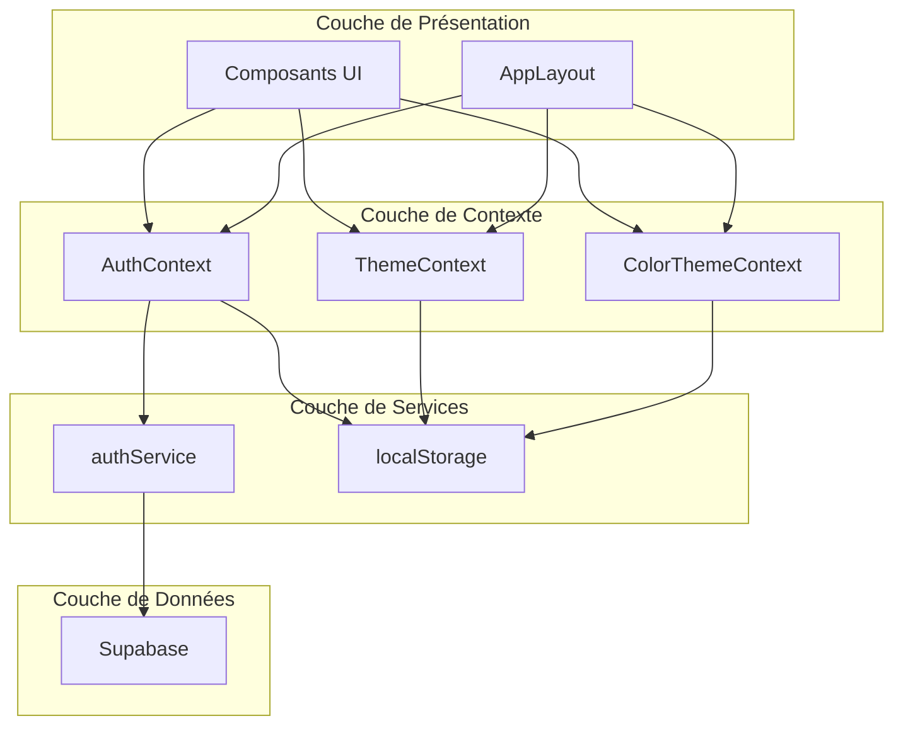

**Sources du Diagramme**
- [layout.tsx](file://app/layout.tsx#L30-L40)
- [AuthContext.tsx](file://contexts/AuthContext.tsx#L17-L61)
- [ThemeContext.tsx](file://contexts/ThemeContext.tsx#L16-L86)
- [ColorThemeContext.tsx](file://contexts/ColorThemeContext.tsx#L45-L109)

## AuthContext : Gestion de l'Authentification

### Rôle et Responsabilités

Le `AuthContext` gère l'état d'authentification de l'utilisateur avec les propriétés suivantes :
- **user** : Objet utilisateur ou null
- **session** : Session active ou null
- **loading** : Indicateur de chargement initial
- **signIn** : Fonction d'authentification
- **signOut** : Fonction de déconnexion

### Structure du Contexte

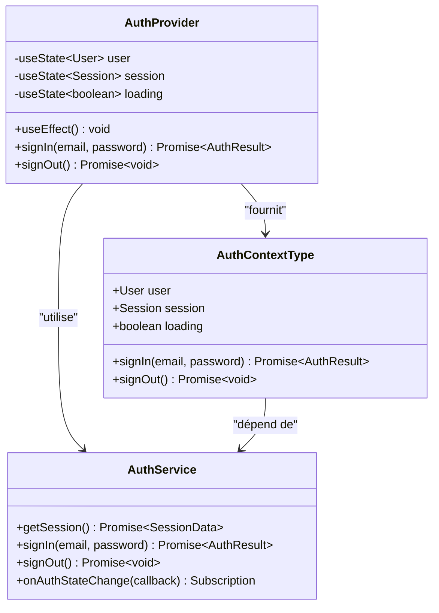

**Sources du Diagramme**
- [AuthContext.tsx](file://contexts/AuthContext.tsx#L7-L13)
- [AuthService.ts](file://services/authService.ts#L4-L31)

### Initialisation Asynchrone

Le contexte initialise l'état de manière asynchrone lors du montage :

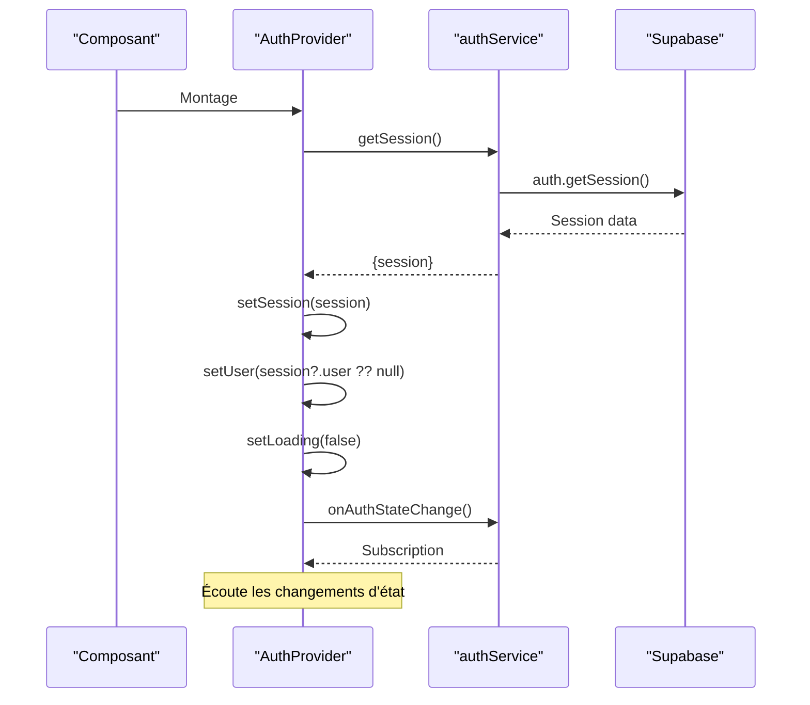

**Sources du Diagramme**
- [AuthContext.tsx](file://contexts/AuthContext.tsx#L22-L37)
- [authService.ts](file://services/authService.ts#L5-L31)

### Gestion des Effets de Bord

Le contexte gère plusieurs effets de bord critiques :

1. **Récupération initiale de la session** : Chargement de l'état depuis Supabase
2. **Écoute des changements d'état** : Synchronisation en temps réel
3. **Nettoyage des abonnements** : Évite les fuites mémoire

**Sources de la Section**
- [AuthContext.tsx](file://contexts/AuthContext.tsx#L22-L37)

## ThemeContext : Gestion du Mode Clair/Sombre

### Fonctionnalités Avancées

Le `ThemeContext` offre un système de thématisation sophistiqué avec trois modes :
- **light** : Thème clair
- **dark** : Thème sombre
- **system** : Suivi des préférences système

### Architecture du Système de Thème

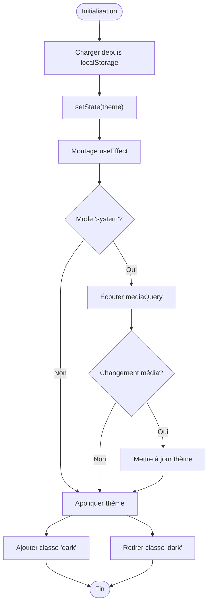

**Sources du Diagramme**
- [ThemeContext.tsx](file://contexts/ThemeContext.tsx#L21-L63)

### Cycle de Vie des Thèmes

Le système gère automatiquement la synchronisation entre le thème sélectionné et les préférences système :

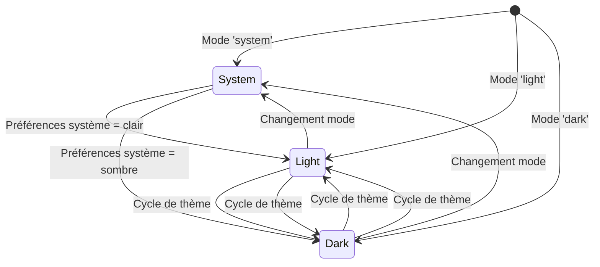

**Sources du Diagramme**
- [ThemeContext.tsx](file://contexts/ThemeContext.tsx#L35-L58)

**Sources de la Section**
- [ThemeContext.tsx](file://contexts/ThemeContext.tsx#L1-L96)
- [ThemeToggle.tsx](file://components/ThemeToggle.tsx#L1-L27)

## ColorThemeContext : Gestion des Thèmes de Couleurs

### Système de Couleurs Personnalisées

Le `ColorThemeContext` permet une personnalisation avancée des couleurs avec support des thèmes prédéfinis et personnalisés :

#### Thèmes Prédéfinis
- **ocean** : Bleu océan
- **forest** : Vert forêt
- **sun** : Jaune soleil  
- **rose** : Rose pâle

#### Couleurs CSS Variables
Le système utilise des variables CSS pour appliquer les couleurs :
- `--theme-primary` : Couleur principale
- `--theme-secondary` : Couleur secondaire
- `--theme-accent` : Couleur d'accentuation

### Architecture des Thèmes de Couleurs

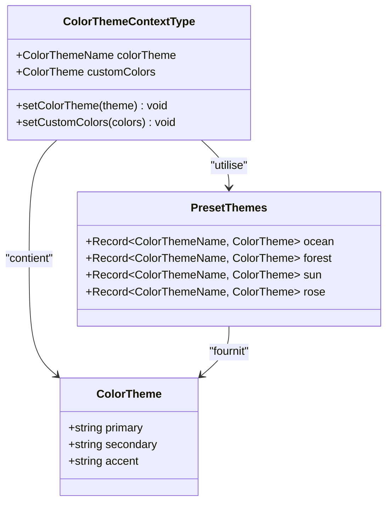

**Sources du Diagramme**
- [ColorThemeContext.tsx](file://contexts/ColorThemeContext.tsx#L5-L34)
- [ColorThemeContext.tsx](file://contexts/ColorThemeContext.tsx#L36-L42)

### Gestion des Couleurs Personnalisées

Le système permet aux utilisateurs de créer leurs propres thèmes de couleurs :

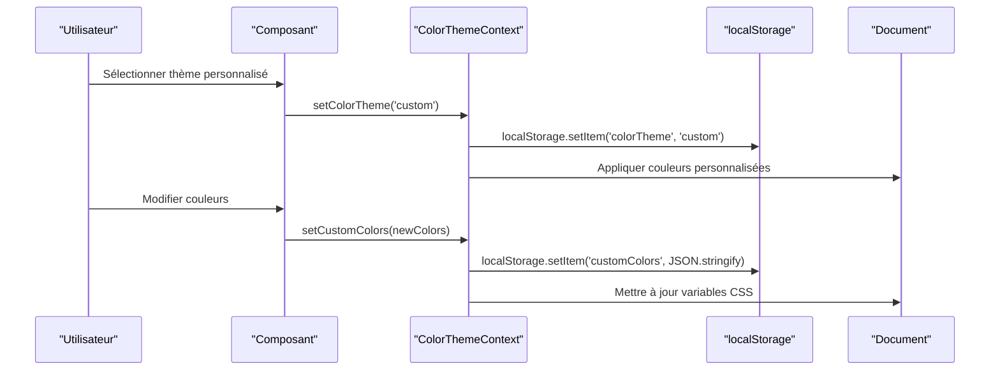

**Sources du Diagramme**
- [ColorThemeContext.tsx](file://contexts/ColorThemeContext.tsx#L84-L98)

**Sources de la Section**
- [ColorThemeContext.tsx](file://contexts/ColorThemeContext.tsx#L1-L119)

## Pattern Provider/Consumer

### Hiérarchie des Providers

Le système utilise une hiérarchie de providers imbriqués pour organiser l'accès aux contextes :

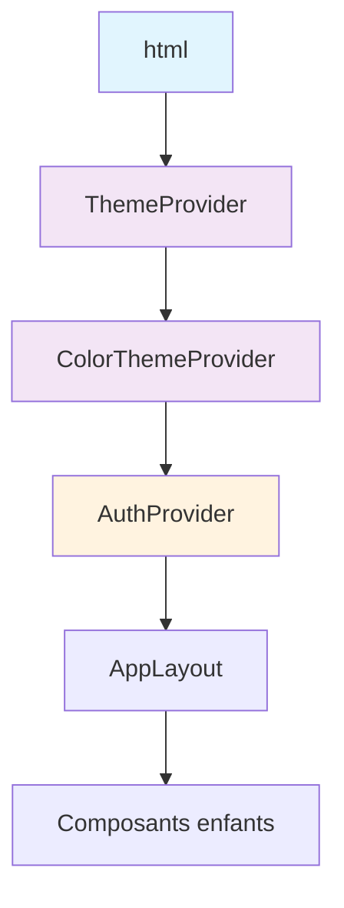

**Sources du Diagramme**
- [layout.tsx](file://app/layout.tsx#L30-L40)

### Implémentation du Pattern

Chaque contexte suit le même pattern structuré :

1. **Création du Contexte** : `createContext<ContextType>()`
2. **Provider personnalisé** : `function ContextProvider()`
3. **Hook d'accès** : `function useContextHook()`
4. **Gestion d'erreur** : Vérification de l'environnement

**Sources de la Section**
- [layout.tsx](file://app/layout.tsx#L1-L45)

## Persistance dans localStorage

### Stratégies de Persistance

Chaque contexte implémente sa propre stratégie de persistance :

| Contexte | Clé localStorage | Type de données | Durée |
|----------|------------------|-----------------|-------|
| ThemeContext | `'theme'` | `'light' \| 'dark' \| 'system'` | Session |
| ColorThemeContext | `'colorTheme'` | `'ocean' \| 'forest' \| 'sun' \| 'rose' \| 'custom'` | Session |
| ColorThemeContext | `'customColors'` | `JSON.stringify(ColorTheme)` | Session |

### Mécanisme de Synchronisation

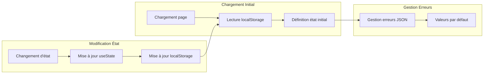

**Sources du Diagramme**
- [ThemeContext.tsx](file://contexts/ThemeContext.tsx#L22-L26)
- [ColorThemeContext.tsx](file://contexts/ColorThemeContext.tsx#L54-L70)

**Sources de la Section**
- [ThemeContext.tsx](file://contexts/ThemeContext.tsx#L22-L26)
- [ColorThemeContext.tsx](file://contexts/ColorThemeContext.tsx#L54-L70)

## Utilisation dans les Composants

### Hook useAuth : Encapsulation de la Logique

Le hook `useAuth` fournit une interface simplifiée pour interagir avec l'authentification :

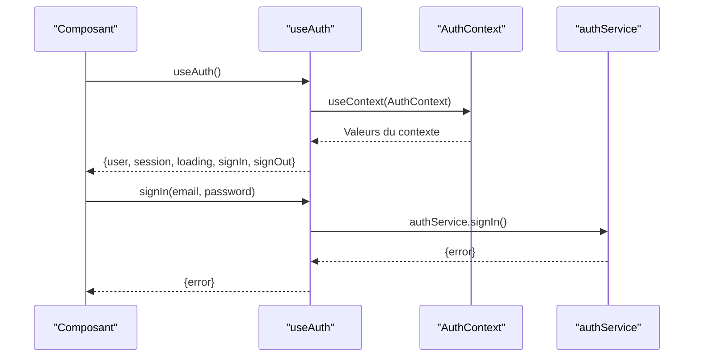

**Sources du Diagramme**
- [useAuth.ts](file://hooks/useAuth.ts#L1-L2)
- [AuthContext.tsx](file://contexts/AuthContext.tsx#L64-L70)

### Exemple d'Utilisation dans un Composant

Voici comment utiliser les contextes dans un composant typique :

```typescript
// Exemple d'utilisation dans un composant de profil
export function UserProfile() {
  const { user, loading, signIn, signOut } = useAuth();
  const { theme, setTheme } = useTheme();
  const { colorTheme, setColorTheme } = useColorTheme();
  
  if (loading) return <LoadingSpinner />;
  
  return (
    <div className="profile-container">
      {user ? (
        <div className="user-info">
          <h2>Bienvenue, {user.email}</h2>
          <button onClick={signOut}>Se déconnecter</button>
        </div>
      ) : (
        <div className="auth-options">
          <button onClick={() => signIn('email', 'password')}>
            Se connecter
          </button>
        </div>
      )}
      
      {/* Contrôles de thème */}
      <div className="theme-controls">
        <button onClick={() => setTheme('light')}>
          Thème clair
        </button>
        <button onClick={() => setColorTheme('ocean')}>
          Thème océan
        </button>
      </div>
    </div>
  );
}
```

### Composant de Protection d'Accès

Le `ProtectedRoute` illustre l'utilisation du contexte d'authentification pour protéger les routes :

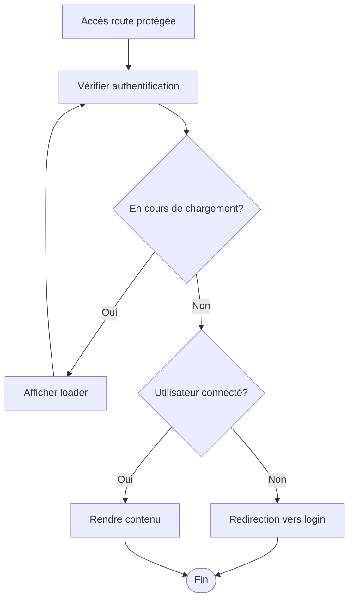

**Sources du Diagramme**
- [ProtectedRoute.tsx](file://components/ProtectedRoute.tsx#L1-L34)

**Sources de la Section**
- [useAuth.ts](file://hooks/useAuth.ts#L1-L2)
- [LoginPage.tsx](file://app/login/page.tsx#L1-L97)
- [ProtectedRoute.tsx](file://components/ProtectedRoute.tsx#L1-L34)

## Erreurs Courantes

### 1. Oubli d'Envelopper avec le Provider

**Problème** : Utilisation de `useContext` sans le Provider correspondant

**Solution** : Toujours envelopper l'application avec les providers nécessaires

```typescript
// ❌ Incorrect
function App() {
  const { user } = useAuth(); // Erreur !
  return <div>{user?.email}</div>;
}

// ✅ Correct
function App() {
  return (
    <AuthProvider>
      <ThemeProvider>
        <ColorThemeProvider>
          <ProtectedRoute>
            <MainApp />
          </ProtectedRoute>
        </ColorThemeProvider>
      </ThemeProvider>
    </AuthProvider>
  );
}
```

### 2. Accès à un Contexte Non Initialisé

**Problème** : Tentative d'accès à un contexte avant son initialisation

**Solution** : Vérifier l'état de chargement approprié

```typescript
// ❌ Incorrect
function UserProfile() {
  const { user } = useAuth();
  return <div>{user.email}</div>; // user peut être null
}

// ✅ Correct
function UserProfile() {
  const { user, loading } = useAuth();
  
  if (loading) return <Loading />;
  if (!user) return <SignInPrompt />;
  
  return <div>{user.email}</div>;
}
```

### 3. Gestion Inadéquate des Erreurs

**Problème** : Ignorer les erreurs retournées par les fonctions de contexte

**Solution** : Traiter systématiquement les erreurs

```typescript
// ❌ Incorrect
const { signIn } = useAuth();
await signIn(email, password); // Erreur non gérée

// ✅ Correct
const { signIn } = useAuth();
const { error } = await signIn(email, password);
if (error) {
  console.error('Erreur de connexion:', error.message);
  // Afficher message à l'utilisateur
}
```

### 4. Fuites Mémoire

**Problème** : Ne pas nettoyer les abonnements aux événements

**Solution** : Retourner une fonction de nettoyage dans `useEffect`

```typescript
// ✅ Correct
useEffect(() => {
  const subscription = authService.onAuthStateChange(handleAuthChange);
  return () => subscription.unsubscribe(); // Nettoyage
}, []);
```

## Bonnes Pratiques

### 1. Organisation des Fichiers

- **Separation des responsabilités** : Chaque contexte dans son propre fichier
- **Export unifié** : Hooks dans des fichiers dédiés pour simplifier l'import
- **Types explicites** : Interfaces TypeScript bien définies

### 2. Gestion des Performances

- **Mémorisation** : Utilisation de `useMemo` et `useCallback` pour optimiser les re-rendus
- **Lazy loading** : Chargement différé des providers lorsque possible
- **Évitement des re-rendus inutiles** : Structuration appropriée des valeurs fournies

### 3. Accessibilité

- **Attributs ARIA** : Utilisation appropriée des attributs pour l'accessibilité
- **Focus management** : Gestion du focus lors des changements d'état
- **Feedback utilisateur** : Messages d'état et feedback visuel

### 4. Tests et Maintenance

- **Tests unitaires** : Tests des logiques de contexte
- **Documentation** : Commentaires explicites sur les responsabilités
- **Monitoring** : Surveillance des performances et erreurs

## Conclusion

Le système de gestion d'état global basé sur React Context proposé dans ce projet représente une approche robuste et scalable pour gérer l'état partagé dans une application Next.js. L'architecture modulaire avec trois contextes spécialisés permet une séparation claire des responsabilités tout en maintenant une cohérence globale.

Les points forts du système incluent :

- **Séparation des préoccupations** : Chaque contexte gère un domaine spécifique
- **Persistance intelligente** : Utilisation de localStorage pour la persistance
- **Gestion d'erreurs robuste** : Vérifications appropriées et gestion des cas d'erreur
- **Performance optimisée** : Mémorisation et optimisations React
- **Accessibilité** : Respect des bonnes pratiques d'accessibilité

Cette architecture constitue une base solide pour le développement d'applications React complexes tout en maintenant la lisibilité et la maintenabilité du code.