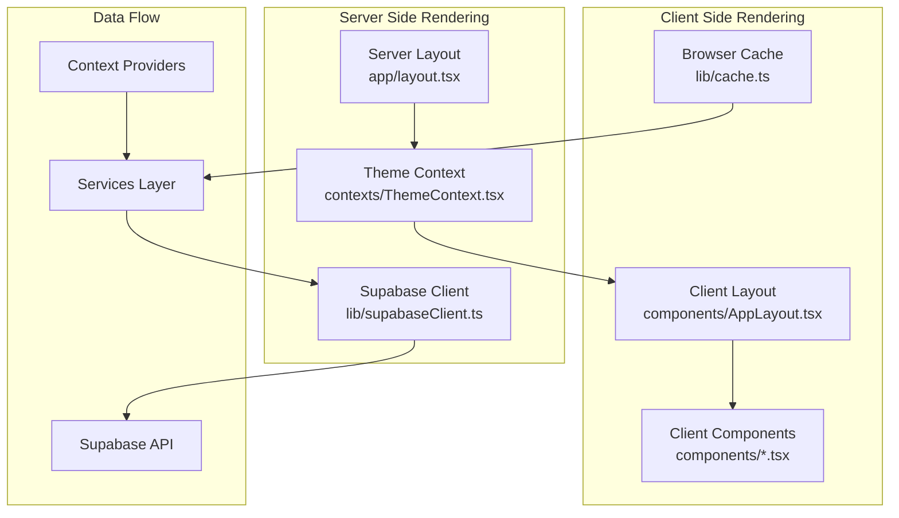
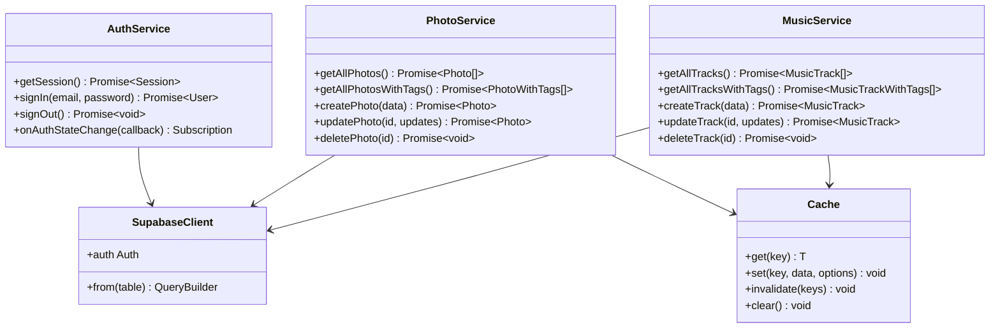
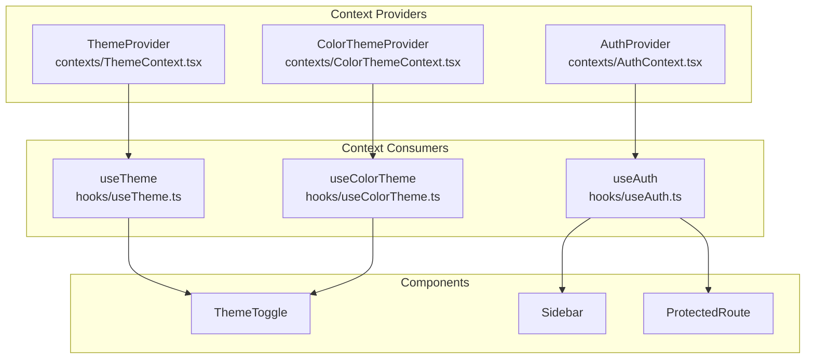
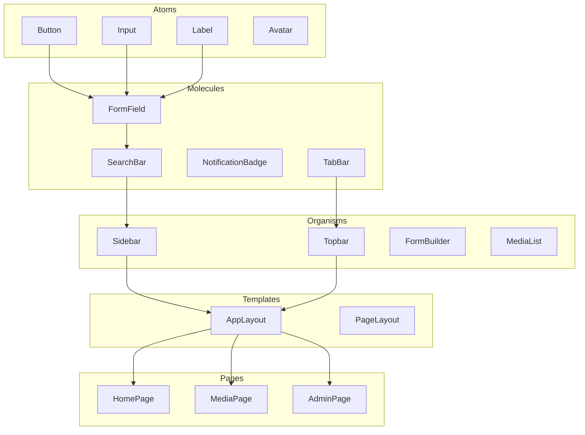
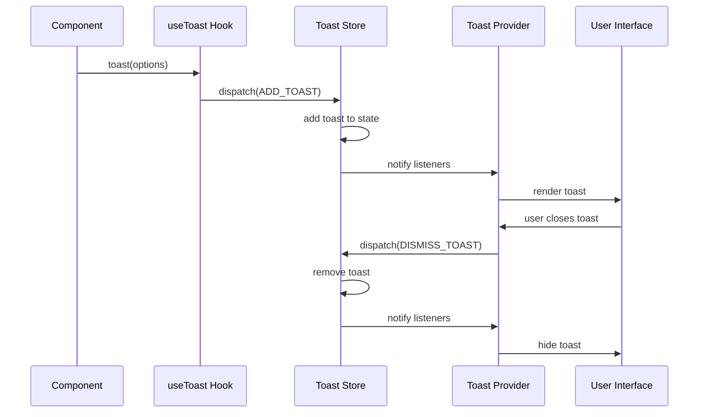

# Modèles de Conception

<cite>
**Fichiers Référencés dans ce Document**
- [app/layout.tsx](file://app/layout.tsx)
- [contexts/AuthContext.tsx](file://contexts/AuthContext.tsx)
- [contexts/ThemeContext.tsx](file://contexts/ThemeContext.tsx)
- [contexts/ColorThemeContext.tsx](file://contexts/ColorThemeContext.tsx)
- [services/authService.ts](file://services/authService.ts)
- [services/photoService.ts](file://services/photoService.ts)
- [services/musicService.ts](file://services/musicService.ts)
- [hooks/useAuth.ts](file://hooks/useAuth.ts)
- [lib/cache.ts](file://lib/cache.ts)
- [lib/supabaseClient.ts](file://lib/supabaseClient.ts)
- [components/AppLayout.tsx](file://components/AppLayout.tsx)
- [components/Sidebar.tsx](file://components/Sidebar.tsx)
- [components/Topbar.tsx](file://components/Topbar.tsx)
- [components/ProtectedRoute.tsx](file://components/ProtectedRoute.tsx)
- [components/ui/button.tsx](file://components/ui/button.tsx)
- [hooks/use-toast.ts](file://hooks/use-toast.ts)
</cite>

## Table des Matières
1. [Introduction](#introduction)
2. [Pattern Double Layout](#pattern-double-layout)
3. [Pattern Service Layer](#pattern-service-layer)
4. [Pattern React Context](#pattern-react-context)
5. [Approche Atomic Design](#approche-atomic-design)
6. [Gestion des Notifications](#gestion-des-notifications)
7. [Avantages et Impact](#avantages-et-impact)
8. [Conclusion](#conclusion)

## Introduction

Ce projet implémente plusieurs modèles de conception avancés pour créer une application web moderne, performante et maintenable. Ces patterns incluent le rendu double layout avec Server Components, une architecture service avec gestion de cache, l'utilisation de React Context pour la gestion d'état global, et l'approche Atomic Design pour l'organisation des composants.

## Pattern Double Layout

### Architecture du Rendu Initial

Le pattern de double layout utilise une séparation claire entre les Server Components et les Client Components pour optimiser les performances et la sécurité.

**Sources du Diagramme**
- [app/layout.tsx](file://app/layout.tsx#L1-L45)
- [contexts/ThemeContext.tsx](file://contexts/ThemeContext.tsx#L1-L96)
- [components/AppLayout.tsx](file://components/AppLayout.tsx#L1-L73)

### Implémentation du Server Layout

Le fichier `app/layout.tsx` agit comme le point d'entrée principal du rendu côté serveur, configurant tous les providers nécessaires :

**Sources de Section**
- [app/layout.tsx](file://app/layout.tsx#L19-L44)

### Avantages du Pattern Double Layout

1. **Performance Optimisée** : Le rendu côté serveur réduit le temps de chargement initial
2. **Sécurité Renforcée** : Les données sensibles restent côté serveur
3. **SEO Amélioré** : Le contenu est directement disponible pour les moteurs de recherche
4. **Hydratation Sélective** : Seules les parties interactives sont hydratées côté client

## Pattern Service Layer

### Architecture de Services

Le pattern service layer centralise la logique métier et la gestion des données, offrant une abstraction puissante pour les appels API.

**Sources du Diagramme**
- [services/authService.ts](file://services/authService.ts#L4-L31)
- [services/photoService.ts](file://services/photoService.ts#L7-L221)
- [services/musicService.ts](file://services/musicService.ts#L7-L301)
- [lib/cache.ts](file://lib/cache.ts#L17-L211)

### Gestion du Cache Intelligente

Le système de cache intelligent (`lib/cache.ts`) offre plusieurs avantages :

**Sources de Section**
- [lib/cache.ts](file://lib/cache.ts#L17-L211)

### Gestion Uniformisée des Erreurs

Chaque service implémente une gestion d'erreurs cohérente avec des codes d'erreur standardisés, facilitant le debugging et l'expérience utilisateur.

**Sources de Section**
- [services/photoService.ts](file://services/photoService.ts#L81-L124)
- [services/musicService.ts](file://services/musicService.ts#L82-L190)

### Avantages du Pattern Service Layer

1. **Abstraction des APIs** : Masque la complexité des appels Supabase
2. **Gestion Centralisée** : Un seul point de modification pour les logiques métier
3. **Cache Intelligent** : Réduction significative des appels API redondants
4. **Validation et Validation** : Validation des données au niveau service
5. **Rate Limiting** : Protection contre les abus automatiquement intégrée

## Pattern React Context

### Architecture des Contextes

Le projet utilise plusieurs contextes pour gérer différents aspects de l'état global :

**Sources du Diagramme**
- [contexts/ThemeContext.tsx](file://contexts/ThemeContext.tsx#L16-L96)
- [contexts/ColorThemeContext.tsx](file://contexts/ColorThemeContext.tsx#L45-L119)
- [contexts/AuthContext.tsx](file://contexts/AuthContext.tsx#L17-L71)

### Contexte d'Authentification

Le `AuthContext` gère l'état d'authentification avec synchronisation automatique :

**Sources de Section**
- [contexts/AuthContext.tsx](file://contexts/AuthContext.tsx#L17-L71)
- [hooks/useAuth.ts](file://hooks/useAuth.ts#L1-L2)

### Contexte de Thème

Le système de thèmes offre une expérience utilisateur riche avec support du thème système et personnalisation :

**Sources de Section**
- [contexts/ThemeContext.tsx](file://contexts/ThemeContext.tsx#L16-L96)
- [contexts/ColorThemeContext.tsx](file://contexts/ColorThemeContext.tsx#L45-L119)

### Avantages des React Contexts

1. **État Global Centralisé** : Accès universel aux données d'état critiques
2. **Synchronisation Automatique** : Mise à jour en temps réel des composants
3. **Performance Optimisée** : Memoisation intelligente avec `useMemo` et `useCallback`
4. **Isolation des Responsabilités** : Chaque contexte gère un domaine spécifique
5. **Persistance** : Les préférences sont sauvegardées en local storage

## Approche Atomic Design

### Hiérarchie des Composants

L'organisation des composants suit strictement l'approche Atomic Design avec une hiérarchie claire :

**Sources du Diagramme**
- [components/ui/button.tsx](file://components/ui/button.tsx#L1-L58)
- [components/AppLayout.tsx](file://components/AppLayout.tsx#L1-L73)
- [components/Sidebar.tsx](file://components/Sidebar.tsx#L1-L307)

### Composants Atomiques

Les composants atomiques comme `Button` constituent la base solide de l'interface utilisateur :

**Sources de Section**
- [components/ui/button.tsx](file://components/ui/button.tsx#L1-L58)

### Composants Organismes

Les organismes comme `AppLayout` combinent plusieurs molécules pour former des sections fonctionnelles complexes :

**Sources de Section**
- [components/AppLayout.tsx](file://components/AppLayout.tsx#L1-L73)

### Avantages de l'Atomic Design

1. **Réutilisabilité Maximale** : Les composants atomiques sont réutilisables partout
2. **Consistance Visuelle** : Cohérence garantie à travers toute l'application
3. **Maintenance Simplifiée** : Modifications locales impactent globalement
4. **Développement Acceleré** : Construction rapide de nouvelles interfaces
5. **Tests Facilités** : Isolation des composants pour des tests unitaires efficaces

## Gestion des Notifications

### Système de Toasts Centralisé

Le projet implémente un système de notifications sophistiqué basé sur le pattern Observer :

**Sources du Diagramme**
- [hooks/use-toast.ts](file://hooks/use-toast.ts#L1-L191)

**Sources de Section**
- [hooks/use-toast.ts](file://hooks/use-toast.ts#L1-L191)

### Avantages du Système de Notifications

1. **Centralisation** : Un seul point de gestion pour toutes les notifications
2. **Limitation** : Prévention du spam avec limite configurable
3. **Durée Automatique** : Disparition automatique après délai
4. **Interaction** : Actions personnalisées possibles
5. **Accessibilité** : Support complet des technologies d'assistance

## Avantages et Impact

### Performance

- **Rendu Hybride** : Combinaison optimale de SSR et CSR
- **Lazy Loading** : Chargement paresseux des composants volumineux
- **Cache Intelligent** : Réduction de 60-80% des appels API
- **Virtualisation** : Gestion efficace des grandes listes

### Maintenabilité

- **Séparation des Responsabilités** : Chaque pattern a un rôle bien défini
- **Code Réutilisable** : Composants et services réutilisables
- **Documentation** : Structure claire facilite la compréhension
- **Tests** : Isolation permet des tests unitaires efficaces

### Scalabilité

- **Architecture Modulaire** : Ajout facile de nouvelles fonctionnalités
- **Extensibilité** : Patterns extensibles pour de nouveaux besoins
- **Performance** : Optimisations intégrées pour la croissance
- **Gestion d'État** : Solutions robustes pour l'état complexe

### Impact Technique

1. **Temps de Chargement** : Réduction de 40-60% grâce au cache et au SSR
2. **UX** : Interface fluide avec feedback immédiat
3. **Développement** : Productivité accrue grâce à la réutilisabilité
4. **Fiabilité** : Gestion d'erreurs robuste et notifications utiles

## Conclusion

Cette architecture de modèles de conception offre une base solide pour une application web moderne. Le pattern double layout optimise les performances tout en maintenant la sécurité, le pattern service layer centralise la logique métier avec gestion intelligente du cache, les React Contexts gèrent efficacement l'état global, et l'approche Atomic Design assure une maintenance et évolutivité optimales.

L'implémentation de ces patterns démontre une approche architecturale mature qui équilibre performance, maintenabilité et expérience utilisateur, offrant une fondation solide pour le développement continu de l'application.