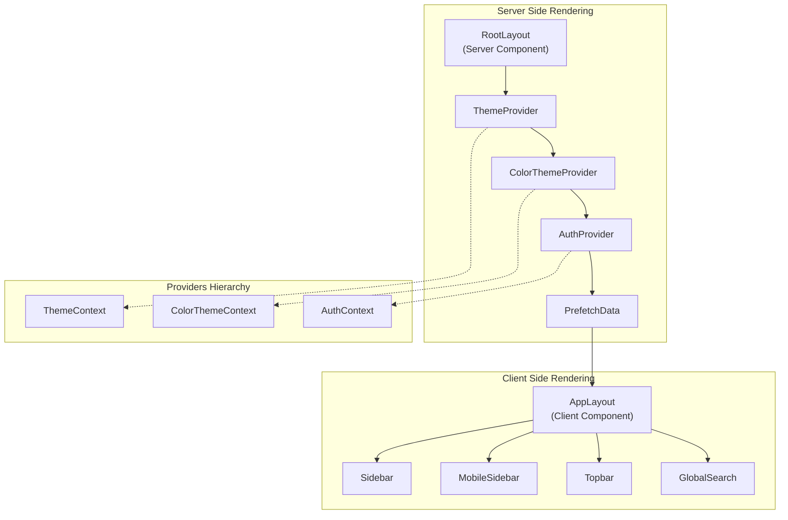
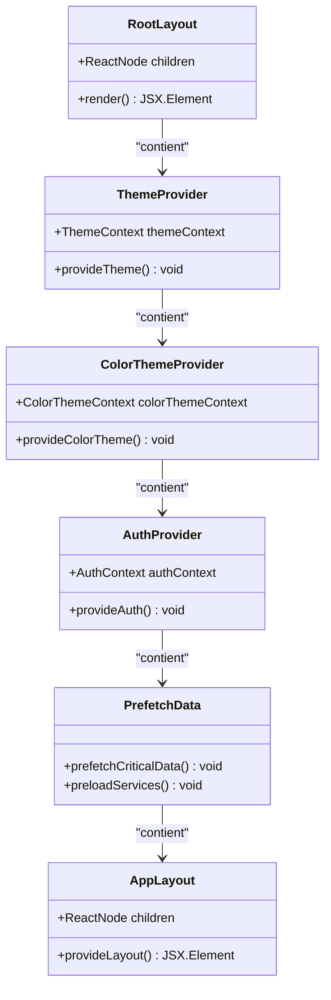
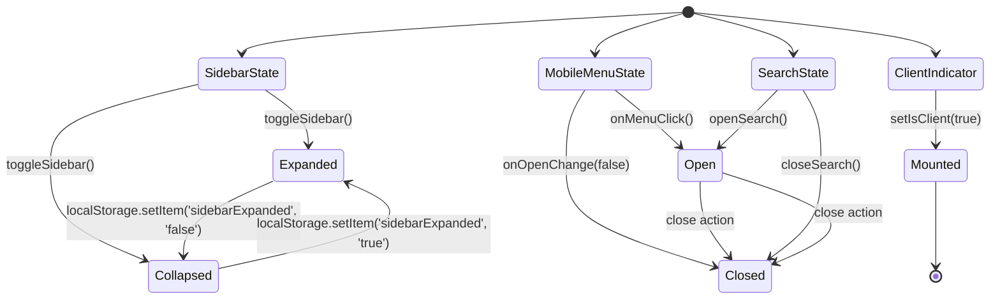
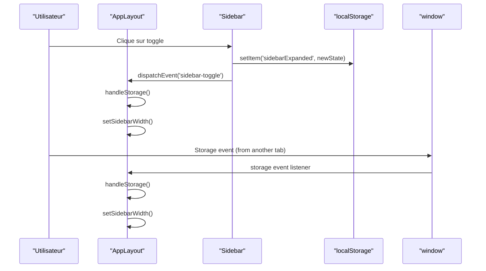
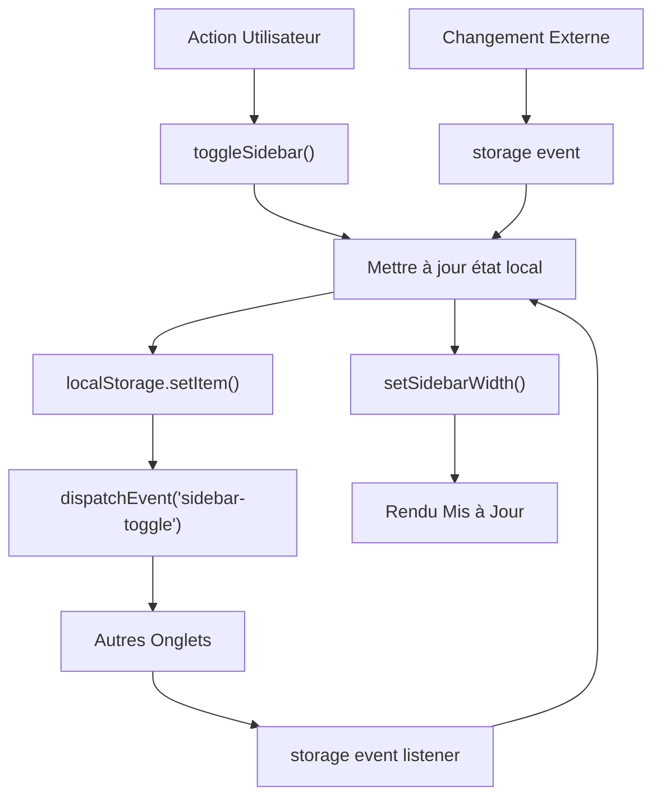
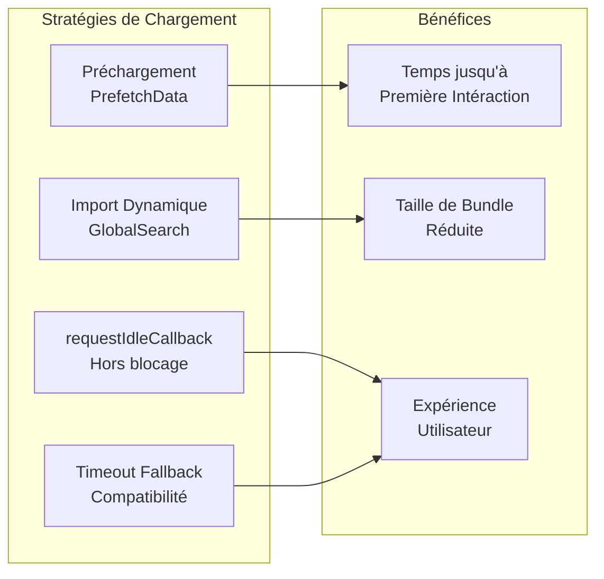
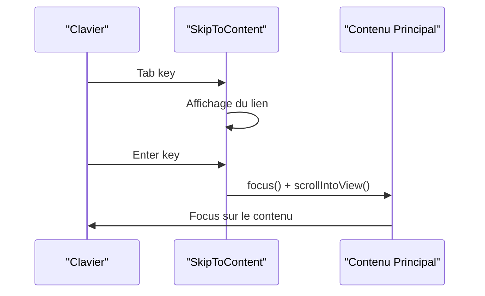
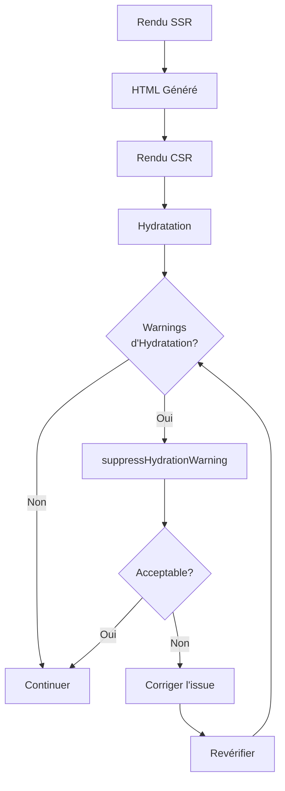
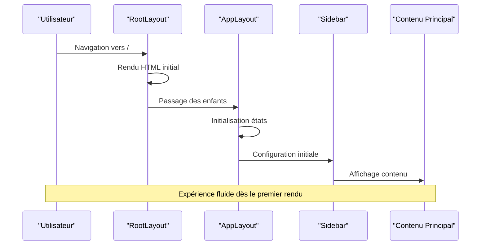
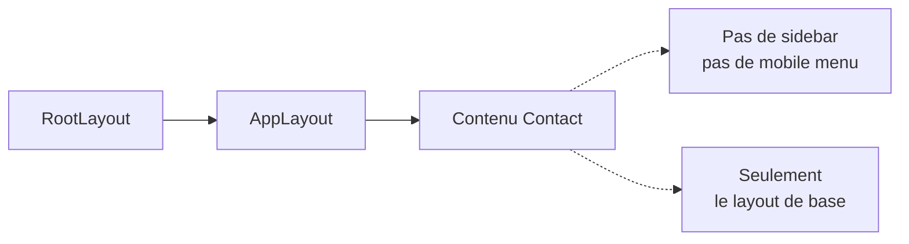

# Pattern de Double Layout

<cite>
**Fichiers Référencés dans ce Document**
- [app/layout.tsx](file://app/layout.tsx)
- [components/AppLayout.tsx](file://components/AppLayout.tsx)
- [contexts/ThemeContext.tsx](file://contexts/ThemeContext.tsx)
- [contexts/AuthContext.tsx](file://contexts/AuthContext.tsx)
- [contexts/ColorThemeContext.tsx](file://contexts/ColorThemeContext.tsx)
- [components/Sidebar.tsx](file://components/Sidebar.tsx)
- [components/MobileSidebar.tsx](file://components/MobileSidebar.tsx)
- [components/Topbar.tsx](file://components/Topbar.tsx)
- [components/SkipToContent.tsx](file://components/SkipToContent.tsx)
- [components/PrefetchData.tsx](file://components/PrefetchData.tsx)
</cite>

## Table des Matières
1. [Introduction](#introduction)
2. [Architecture du Pattern](#architecture-du-pattern)
3. [Composant Server Component Racine](#composant-server-component-racine)
4. [Composant Client Component Interactif](#composant-client-component-interactif)
5. [Flux de Données et Synchronisation](#flux-de-données-et-synchronisation)
6. [Avantages en Termes de Performance](#avantages-en-termes-de-performance)
7. [Considérations d'Accessibilité](#considérations-daccessibilité)
8. [Gestion des Erreurs et Hydratation](#gestion-des-erreurs-et-hydratation)
9. [Cas d'Usage et Exemples](#cas-dusage-et-exemples)
10. [Bonnes Pratiques](#bonnes-pratiques)

## Introduction

Le pattern de Double Layout représente une approche architecturale sophistiquée utilisée dans cette application Next.js pour optimiser la performance, améliorer l'accessibilité et maintenir une séparation claire des responsabilités entre le rendu côté serveur et le rendu côté client. Ce pattern implique l'utilisation simultanée de deux composants de layout distincts : un Server Component racine (`app/layout.tsx`) et un Client Component interactif (`components/AppLayout.tsx`).

Cette approche permet de bénéficier des avantages du rendu côté serveur tout en conservant la capacité d'interaction dynamique côté client, tout en maintenant une expérience utilisateur fluide et accessible.

## Architecture du Pattern

Le pattern de Double Layout s'articule autour de deux composants majeurs qui collaborent pour créer une interface utilisateur cohérente et performante.

**Sources du Diagramme**
- [app/layout.tsx](file://app/layout.tsx#L19-L45)
- [components/AppLayout.tsx](file://components/AppLayout.tsx#L17-L73)

## Composant Server Component Racine

Le composant `RootLayout` dans `app/layout.tsx` agit comme le Server Component racine, responsable du rendu initial et de la fourniture des Context Providers essentiels.

### Arborescence des Providers

La hiérarchie des providers dans le Server Component suit une logique de composition descendante, où chaque provider encapsule ses enfants et fournit des fonctionnalités spécifiques :

**Sources du Diagramme**
- [app/layout.tsx](file://app/layout.tsx#L31-L39)
- [contexts/ThemeContext.tsx](file://contexts/ThemeContext.tsx#L16-L86)
- [contexts/ColorThemeContext.tsx](file://contexts/ColorThemeContext.tsx#L45-L109)
- [contexts/AuthContext.tsx](file://contexts/AuthContext.tsx#L17-L61)

### Responsabilités du Server Component

Le Server Component se concentre sur :

1. **Rendu Initial Critique** : Génération du HTML initial pour le SEO et les performances
2. **Fourniture de Contextes** : Injection des providers nécessaires pour l'application
3. **Préchargement de Données** : Chargement initial des données critiques
4. **Configuration Globale** : Setup des polices, métadonnées et ressources

**Sources de Section**
- [app/layout.tsx](file://app/layout.tsx#L19-L45)

## Composant Client Component Interactif

Le composant `AppLayout` dans `components/AppLayout.tsx` constitue le Client Component interactif, responsable de la gestion de l'état UI et des interactions utilisateur.

### Architecture des États Locaux

Le Client Component maintient plusieurs états locaux pour gérer l'interface utilisateur :

**Sources du Diagramme**
- [components/AppLayout.tsx](file://components/AppLayout.tsx#L18-L43)

### Gestion des Effets et Événements

Le Client Component implémente une gestion sophistiquée des effets et des événements pour maintenir la synchronisation :

**Sources du Diagramme**
- [components/AppLayout.tsx](file://components/AppLayout.tsx#L30-L42)
- [components/Sidebar.tsx](file://components/Sidebar.tsx#L64-L69)

**Sources de Section**
- [components/AppLayout.tsx](file://components/AppLayout.tsx#L17-L73)

## Flux de Données et Synchronisation

Le pattern de Double Layout implémente un flux de données bidirectionnel entre les composants Server et Client, particulièrement notable pour la synchronisation de l'état de la sidebar.

### Synchronisation de l'État de la Sidebar

La synchronisation de l'état de la sidebar utilise plusieurs mécanismes pour garantir la cohérence :

1. **localStorage pour la Persistance** : Stockage local de l'état de l'expansion
2. **Events personnalisés** : Communication entre onglets via `sidebar-toggle`
3. **Events Storage** : Mise à jour automatique lors de changements externes

### Mécanisme de Synchronisation

**Sources du Diagramme**
- [components/AppLayout.tsx](file://components/AppLayout.tsx#L26-L33)
- [components/Sidebar.tsx](file://components/Sidebar.tsx#L58-L69)

**Sources de Section**
- [components/AppLayout.tsx](file://components/AppLayout.tsx#L23-L43)
- [components/Sidebar.tsx](file://components/Sidebar.tsx#L57-L69)

## Avantages en Termes de Performance

Le pattern de Double Layout offre plusieurs avantages significatifs en termes de performance :

### Réduction du Bundle Client

En séparant les responsabilités entre Server et Client Components :

1. **Bundle Client Plus Léger** : Seules les interactions nécessaires sont incluses
2. **Lazy Loading Intelligent** : Composants comme `GlobalSearch` chargés dynamiquement
3. **Optimisation des Imports** : Import dynamique avec `dynamic()` pour les composants rares

### Optimisations Spécifiques

| Optimisation | Description | Impact |
|--------------|-------------|---------|
| **PrefetchData** | Préchargement des données critiques | Amélioration du TTI |
| **Dynamic Imports** | Chargement paresseux des composants | Réduction initiale du bundle |
| **Storage Events** | Synchronisation efficace des états | Évitement des requêtes inutiles |
| **Memoization** | Mémorisation des valeurs contextuelles | Réduction des recalculs |

### Stratégies de Chargement

Le pattern implémente plusieurs stratégies de chargement optimisées :

**Sources du Diagramme**
- [components/PrefetchData.tsx](file://components/PrefetchData.tsx#L12-L38)

**Sources de Section**
- [components/PrefetchData.tsx](file://components/PrefetchData.tsx#L11-L43)
- [components/AppLayout.tsx](file://components/AppLayout.tsx#L11-L15)

## Considérations d'Accessibilité

Le pattern intègre plusieurs fonctionnalités d'accessibilité avancées pour garantir une expérience utilisateur inclusive.

### SkipToContent et Gestion du Focus

Le composant `SkipToContent` implémente une fonctionnalité critique d'accessibilité :

**Sources du Diagramme**
- [components/SkipToContent.tsx](file://components/SkipToContent.tsx#L13-L19)

### Fonctionnalités d'Accessibilité Intégrées

| Fonctionnalité | Implémentation | Avantage |
|----------------|----------------|----------|
| **SkipToContent** | Lien visible uniquement au focus | Navigation clavier rapide |
| **ARIA Labels** | Labels descriptifs pour tous les éléments | Compatibilité lecteurs d'écran |
| **Focus Management** | Gestion automatique du focus | Navigation cohérente |
| **Responsive Design** | Adaptation mobile/desktop | Accessibilité multi-appareils |

### Gestion du Focus et Navigation

Le pattern maintient une navigation fluide grâce à :

1. **Focus Trap** : Contrôle du focus dans les modales
2. **Skip Links** : Accès direct au contenu principal
3. **ARIA States** : Indicateurs d'état pour les lecteurs d'écran
4. **Keyboard Navigation** : Support complet du clavier

**Sources de Section**
- [components/SkipToContent.tsx](file://components/SkipToContent.tsx#L12-L51)

## Gestion des Erreurs et Hydratation

Le pattern implémente des stratégies sophistiquées pour gérer les problèmes d'hydratation entre le SSR et le CSR.

### Suppression des Warnings d'Hydratation

Le composant `RootLayout` utilise `suppressHydrationWarning` de manière stratégique :

### Cas d'Erreur Courants et Solutions

| Problème | Cause | Solution |
|----------|-------|----------|
| **Désynchronisation Date/Time** | Différence temps serveur/client | Utiliser `useEffect` pour initialiser |
| **État Local vs Serveur** | Différence affichage | Synchroniser via localStorage |
| **Taille Fenêtre** | Calcul différent SSR/CSR | Détection client côté client |
| **Focus Automatique** | Différence timing | Gestion conditionnelle du focus |

### Stratégies de Résilience

Le pattern inclut plusieurs couches de résilience :

1. **Fallbacks Graceful** : Gestion silencieuse des erreurs
2. **Validation des Données** : Vérification des valeurs stockées
3. **Recovery Mechanisms** : Restauration état par défaut
4. **Logging Discret** : Surveillance sans impact UX

**Sources de Section**
- [app/layout.tsx](file://app/layout.tsx#L25-L25)

## Cas d'Usage et Exemples

### Exemple d'Implémentation Complexe

Voici comment le pattern est utilisé dans différents scénarios :

#### Page d'Accueil
La page d'accueil illustre parfaitement l'utilisation du pattern :

#### Page de Contact
La page de contact montre l'utilisation minimaliste :

### Patterns d'Extension

Le pattern peut être étendu pour d'autres cas :

1. **Pages Admin** : Ajout de fonctionnalités d'administration
2. **Pages Authentifiées** : Interface adaptée aux utilisateurs connectés
3. **Pages Spécialisées** : Layouts personnalisés pour cas d'usage spécifiques

**Sources de Section**
- [app/page.tsx](file://app/page.tsx#L42-L79)
- [app/contact/page.tsx](file://app/contact/page.tsx#L3-L19)

## Bonnes Pratiques

### Organisation du Code

Pour maximiser l'efficacité du pattern de Double Layout :

1. **Séparation Claire des Responsabilités** : Server Component pour rendu, Client Component pour interactions
2. **Minimisation des Props** : Limiter les données passées entre composants
3. **Lazy Loading Stratégique** : Charger uniquement ce qui est nécessaire
4. **Gestion d'État Locale** : Utiliser `useState` pour l'UI, Context pour les données partagées

### Performance et Optimisation

| Recommandation | Justification | Implémentation |
|----------------|---------------|----------------|
| **Préchargement Critique** | Améliorer TTI | `PrefetchData` component |
| **Import Dynamique** | Réduction bundle | `dynamic()` imports |
| **Memoization** | Éviter recalculs | `useMemo` et `useCallback` |
| **Storage Events** | Synchronisation efficace | Événements personnalisés |

### Accessibilité et UX

1. **Tests Multi-Appareils** : Valider sur différents écrans et navigateurs
2. **Navigation Clavier** : Tester toutes les fonctionnalités au clavier
3. **Lecteurs d'Écran** : Vérifier compatibilité avec les technologies d'assistance
4. **Contraste et Taille** : Respecter les normes WCAG 2.1 AA

### Maintenance et Évolution

Le pattern facilite la maintenance grâce à :

1. **Modularité** : Composants indépendants et réutilisables
2. **Testabilité** : Isolation des responsabilités pour les tests
3. **Extensibilité** : Ajout facile de nouvelles fonctionnalités
4. **Documentation** : Clarté des interactions entre composants

Cette documentation complète du pattern de Double Layout démontre comment cette approche architecturale sophistiquée permet de créer des applications web modernes, performantes et accessibles tout en maintenant une séparation claire des responsabilités entre le rendu côté serveur et le rendu côté client.