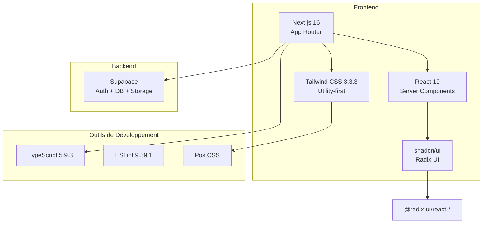
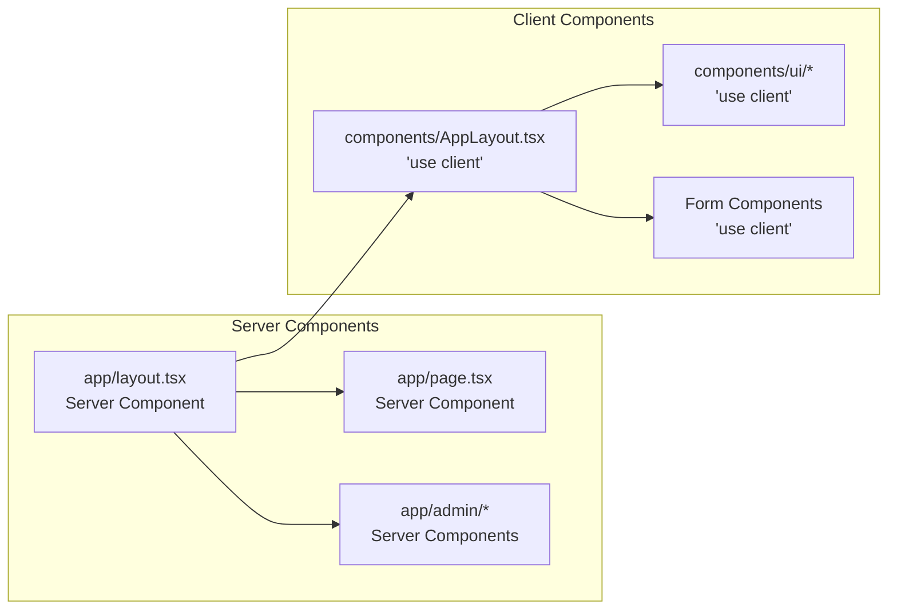
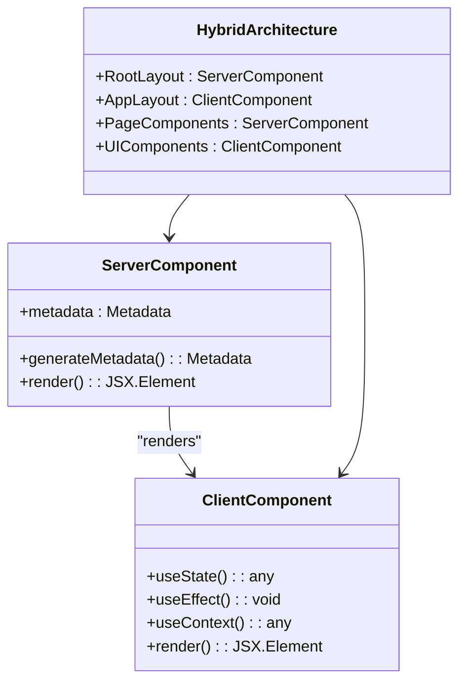
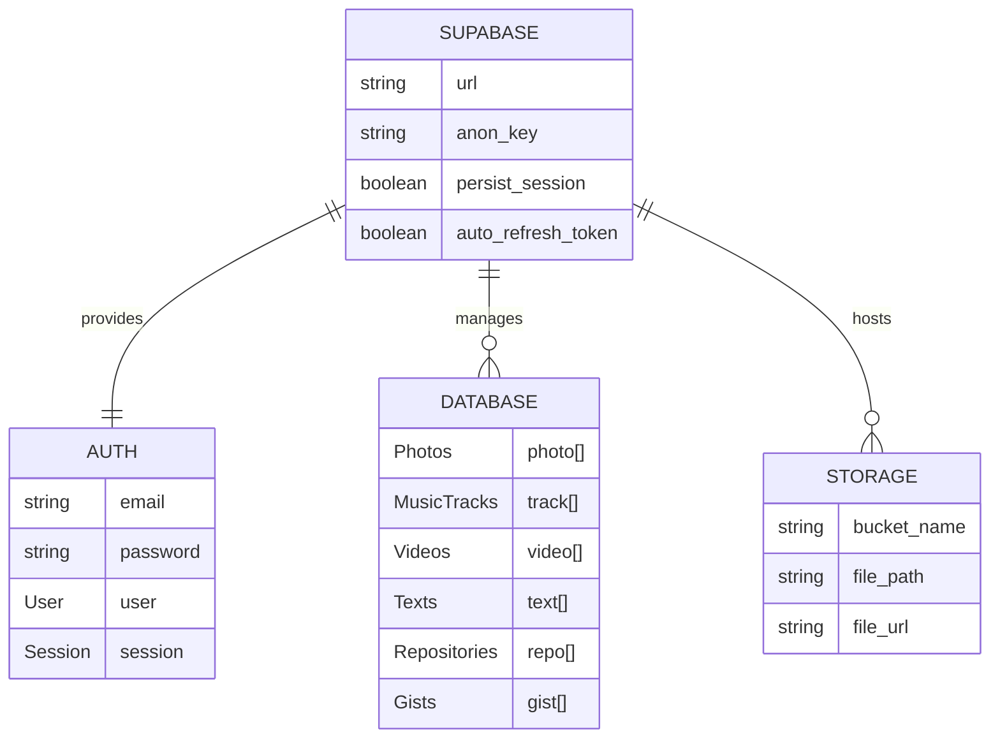
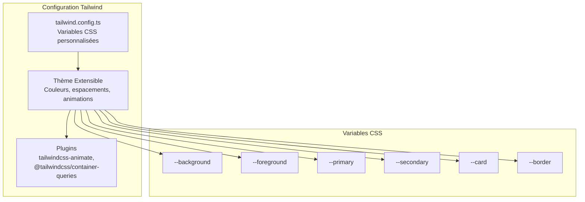
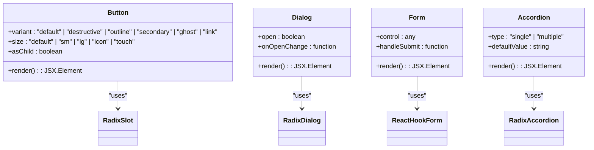
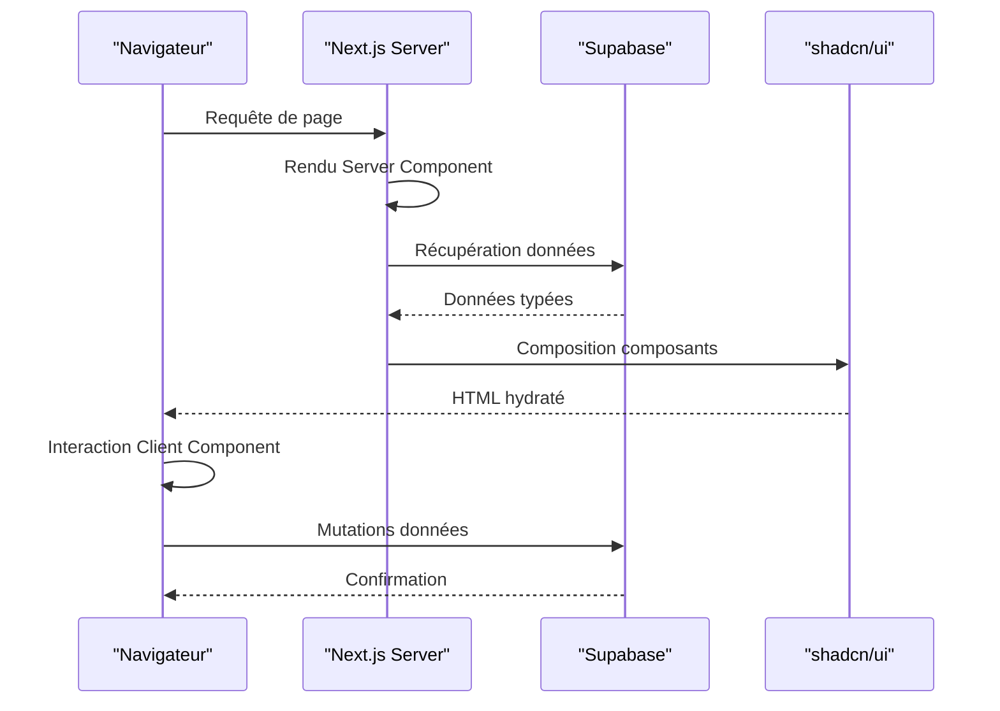

# Stack Technique

<cite>
**Fichiers Référencés dans ce Document**
- [package.json](file://package.json)
- [next.config.js](file://next.config.js)
- [tailwind.config.ts](file://tailwind.config.ts)
- [app/layout.tsx](file://app/layout.tsx)
- [components.json](file://components.json)
- [components/ui/button.tsx](file://components/ui/button.tsx)
- [lib/supabaseClient.ts](file://lib/supabaseClient.ts)
- [contexts/AuthContext.tsx](file://contexts/AuthContext.tsx)
- [app/page.tsx](file://app/page.tsx)
- [tsconfig.json](file://tsconfig.json)
- [postcss.config.js](file://postcss.config.js)
- [components/AppLayout.tsx](file://components/AppLayout.tsx)
- [services/authService.ts](file://services/authService.ts)
</cite>

## Table des Matières
1. [Introduction](#introduction)
2. [Vue d'Ensemble de la Stack](#vue-densemble-de-la-stack)
3. [Next.js 13 avec App Router](#nextjs-13-avec-app-router)
4. [React 18](#react-18)
5. [Supabase](#supabase)
6. [Tailwind CSS](#tailwind-css)
7. [shadcn/ui (Radix UI)](#shadcnui-radix-ui)
8. [Intégration et Architecture](#intégration-et-architecture)
9. [Configuration et Optimisation](#configuration-et-optimisation)
10. [Dépendances Critiques](#dépendances-critiques)
11. [Conclusion](#conclusion)

## Introduction

Le projet Portfolio utilise une stack technique moderne et performante conçue pour offrir une expérience utilisateur optimale tout en maintenant une architecture maintenable. Cette documentation détaille chaque composant clé de la stack, leurs versions respectives, leurs intégrations et les raisons architecturales de leur choix.

La stack combine les dernières innovations du développement web avec des technologies éprouvées, offrant ainsi un équilibre optimal entre performance, maintenabilité et expérience développeur.

## Vue d'Ensemble de la Stack

**Sources du Diagramme**
- [package.json](file://package.json#L68-L82)
- [next.config.js](file://next.config.js#L1-L63)
- [tailwind.config.ts](file://tailwind.config.ts#L1-L97)

## Next.js 16 avec App Router

### Architecture Server Components

Next.js 16 représente une évolution majeure avec l'introduction de l'App Router, qui permet une meilleure gestion des Server Components et une architecture plus modulaire.

**Sources du Diagramme**
- [app/layout.tsx](file://app/layout.tsx#L19-L44)
- [components/AppLayout.tsx](file://components/AppLayout.tsx#L1-L73)

### Configuration Export Statique

Le projet utilise le mode export statique pour une déploiement simplifié et une performance optimale :

**Caractéristiques principales :**
- `output: 'export'` dans next.config.js
- Images non optimisées (`images.unoptimized: true`)
- Pas d'API routes (`app/api/` désactivées)
- Variables d'environnement avec préfixe `NEXT_PUBLIC_`

### Optimisations Avancées

Le système d'optimisation inclut plusieurs techniques avancées :

- **Optimisation des imports** : `optimizePackageImports` pour les packages critiques
- **Splitting des chunks** : Configuration personnalisée pour React et ses dépendances
- **Bundle Analyzer** : Intégré pour surveiller la taille des bundles
- **Remove Console** : Suppression des logs en production (sauf erreurs/warnings)

**Sources de Section**
- [next.config.js](file://next.config.js#L1-L63)
- [app/layout.tsx](file://app/layout.tsx#L1-L45)

## React 19

### Architecture des Composants

React 19 apporte des améliorations significatives dans la gestion des états et des performances, particulièrement avec les Server Components.

**Sources du Diagramme**
- [app/layout.tsx](file://app/layout.tsx#L19-L44)
- [components/AppLayout.tsx](file://components/AppLayout.tsx#L1-L73)

### Gestion d'État Hybride

L'architecture utilise une approche hybride pour la gestion d'état :

- **Server Components** : Pour les données statiques et les layouts
- **Client Components** : Pour les interactions utilisateur et les états locaux
- **React Context** : Pour l'état global (thème, authentification)
- **Custom Hooks** : Pour la logique métier réutilisable

**Sources de Section**
- [contexts/AuthContext.tsx](file://contexts/AuthContext.tsx#L1-L71)
- [components/AppLayout.tsx](file://components/AppLayout.tsx#L1-L73)

## Supabase

### Architecture Backend Complète

Supabase fournit une solution backend complète intégrée dans le projet :

**Sources du Diagramme**
- [lib/supabaseClient.ts](file://lib/supabaseClient.ts#L1-L344)
- [services/authService.ts](file://services/authService.ts#L1-L32)

### Types de Données Typées

Le système utilise TypeScript strictement pour garantir la cohérence des données :

**Types principaux supportés :**
- **Photos** : Galerie photographique avec métadonnées et tags
- **Musique** : Bibliothèque musicale avec playlists et tags
- **Vidéos** : Galerie vidéo avec métadonnées
- **Textes** : Créations littéraires avec catégories et tags
- **Applications** : Portfolio de projets de développement
- **Gists** : Snippets de code publics

### Authentification et Sécurité

L'authentification est gérée entièrement par Supabase avec des fonctionnalités avancées :

- **Persistence des sessions** : `persistSession: true`
- **Auto-refresh des tokens** : `autoRefreshToken: true`
- **Détection automatique** : `detectSessionInUrl: true`
- **Gestion d'état en temps réel** : Événements d'authentification en temps réel

**Sources de Section**
- [lib/supabaseClient.ts](file://lib/supabaseClient.ts#L1-L344)
- [contexts/AuthContext.tsx](file://contexts/AuthContext.tsx#L1-L71)
- [services/authService.ts](file://services/authService.ts#L1-L32)

## Tailwind CSS

### Configuration Utility-First

Tailwind CSS 3.3.3 est configuré pour une utilisation maximale des classes utility :

**Sources du Diagramme**
- [tailwind.config.ts](file://tailwind.config.ts#L1-L97)

### Variables CSS Personnalisées

La configuration utilise des variables CSS pour une personnalisation profonde :

**Couleurs principales :**
- `--background`, `--foreground` : Couleurs de base
- `--primary`, `--secondary` : Couleurs primaires et secondaires
- `--card`, `--popover` : Couleurs des composants
- `--border`, `--input` : Couleurs d'interface

**Animations et Transitions :**
- `--radix-accordion-content-height` : Hauteur d'animation
- `accordion-down`, `accordion-up` : Animations de menu dépliant

### Intégration shadcn/ui

Le projet utilise shadcn/ui comme base pour les composants UI, intégré avec Tailwind CSS :

**Configuration shadcn/ui :**
- `rsc: true` : Support des Server Components
- `tsx: true` : Support TypeScript
- `cssVariables: true` : Utilisation des variables CSS
- `baseColor: "neutral"` : Couleur de base neutre

**Sources de Section**
- [tailwind.config.ts](file://tailwind.config.ts#L1-L97)
- [components.json](file://components.json#L1-L21)

## shadcn/ui (Radix UI)

### Architecture des Composants Accessibles

shadcn/ui fournit une collection de composants UI accessibles construits sur Radix UI :

**Sources du Diagramme**
- [components/ui/button.tsx](file://components/ui/button.tsx#L1-L58)

### Design System Modulaire

Chaque composant suit un pattern modulaire avec des variantes configurables :

**Pattern de composants :**
- **Variants** : `default`, `destructive`, `outline`, `secondary`, `ghost`, `link`
- **Tailles** : `default`, `sm`, `lg`, `icon`, `touch`
- **AsChild** : Support de composition flexible
- **Accessibility** : Conformité WCAG intégrée

### Intégration avec Radix UI

Les composants utilisent directement Radix UI pour garantir l'accessibilité :

**Packages Radix UI utilisés :**
- `@radix-ui/react-dialog` : Boîtes de dialogue
- `@radix-ui/react-dropdown-menu` : Menus déroulants
- `@radix-ui/react-accordion` : Accordeons
- `@radix-ui/react-tabs` : Onglets
- `@radix-ui/react-select` : Sélecteurs
- `@radix-ui/react-switch` : Interrupteurs

**Sources de Section**
- [components/ui/button.tsx](file://components/ui/button.tsx#L1-L58)
- [components.json](file://components.json#L1-L21)

## Intégration et Architecture

### Flux de Données Hybride

L'architecture du projet suit un pattern hybride pour optimiser la performance :

**Sources du Diagramme**
- [app/layout.tsx](file://app/layout.tsx#L19-L44)
- [lib/supabaseClient.ts](file://lib/supabaseClient.ts#L1-L344)

### Patterns de Conception

**Double Layout Pattern :**
1. **`app/layout.tsx`** (Server Component) : Fournit les providers globaux
2. **`components/AppLayout.tsx`** (Client Component) : Gère la structure UI interactive

**Gestion d'État :**
- **Providers globaux** : Thème, authentification, couleur
- **Hooks personnalisés** : Logique métier réutilisable
- **Persistance locale** : `localStorage` pour l'état UI persistant

### Optimisations de Performance

**Stratégies de chargement :**
- **Lazy loading** : Composants dynamiques pour les modales
- **Virtualisation** : Scroll virtuel pour les grandes listes
- **Préchargement** : Données préchargées pour les transitions
- **Compression** : Images compressées et placeholders LQIP

**Sources de Section**
- [app/layout.tsx](file://app/layout.tsx#L1-L45)
- [components/AppLayout.tsx](file://components/AppLayout.tsx#L1-L73)

## Configuration et Optimisation

### Configuration TypeScript

Le projet utilise une configuration TypeScript stricte pour la sécurité des types :

**Paramètres clés :**
- `strict: true` : Activation de tous les modes stricts
- `noEmit: true` : Compilation sans émission de fichiers
- `jsx: "react-jsx"` : Support JSX moderne
- `moduleResolution: "bundler"` : Résolution de modules moderne

### Configuration PostCSS

PostCSS est configuré pour traiter les feuilles de style Tailwind :

**Plugins utilisés :**
- **Tailwind CSS** : Génération des classes utility
- **Autoprefixer** : Préfixes CSS automatiques

### Optimisations Webpack

La configuration Webpack est optimisée pour le mode export statique :

**Techniques d'optimisation :**
- **Splitting des chunks** : Séparation des bibliothèques critiques
- **Framework chunk** : Gardage de React et React DOM
- **Optimisation des imports** : Imports optimisés pour les packages populaires

**Sources de Section**
- [tsconfig.json](file://tsconfig.json#L1-L42)
- [postcss.config.js](file://postcss.config.js#L1-L7)
- [next.config.js](file://next.config.js#L33-L58)

## Dépendances Critiques

### Packages Principaux

Voici les dépendances critiques et leurs rôles :

| Package | Version | Rôle | Impact |
|---------|---------|------|--------|
| `next` | ^16.0.1 | Framework principal | App Router, Server Components |
| `react` | ^19.2.0 | Bibliothèque UI | Components, hooks, rendering |
| `@supabase/supabase-js` | ^2.58.0 | Backend complet | Auth, database, storage |
| `tailwindcss` | 3.3.3 | CSS utility-first | Styling, design system |
| `@radix-ui/react-*` | ^1.1.x | Composants accessibles | UI primitives |
| `lucide-react` | ^0.446.0 | Icônes vectorielles | Interface utilisateur |

### Dépendances de Développement

**Outils de développement essentiels :**
- `@next/bundle-analyzer` : Analyse des bundles
- `eslint` : Linting du code
- `typescript` : Typage statique
- `@tailwindcss/container-queries` : Media queries avancées

### Optimisations Spécialisées

**Packages spécialisés :**
- `@dnd-kit/core` : Drag & drop
- `@tanstack/react-virtual` : Virtualisation
- `react-hook-form` : Formulaires
- `zod` : Validation de schémas
- `react-markdown` : Contenu enrichi

**Sources de Section**
- [package.json](file://package.json#L17-L82)

## Conclusion

La stack technique du projet Portfolio représente une approche moderne et holistique du développement web. L'architecture hybride combinant Next.js 16, React 19, Supabase, Tailwind CSS et shadcn/ui offre :

**Avantages clés :**
- **Performance** : Server Components et export statique
- **Accessibilité** : Composants Radix UI et shadcn/ui
- **Maintenabilité** : Architecture modulaire et TypeScript strict
- **Expérience développeur** : Tooling moderne et optimisations
- **Scalabilité** : Backend Supabase complet et design system

Cette stack technique positionne le projet comme une référence pour les portfolios modernes, combinant performance, accessibilité et expérience utilisateur de haut niveau.