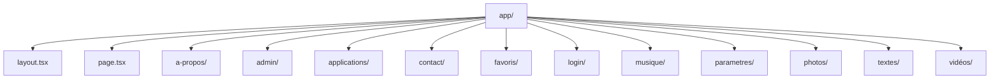
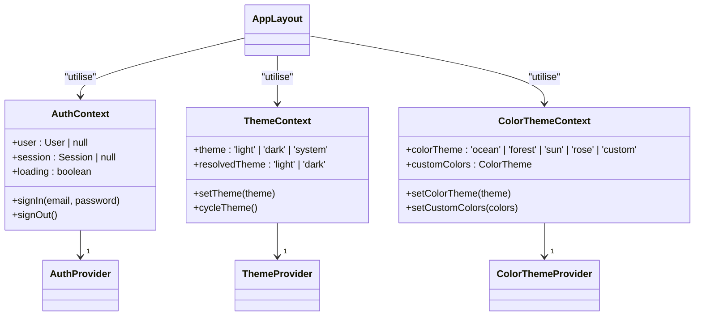
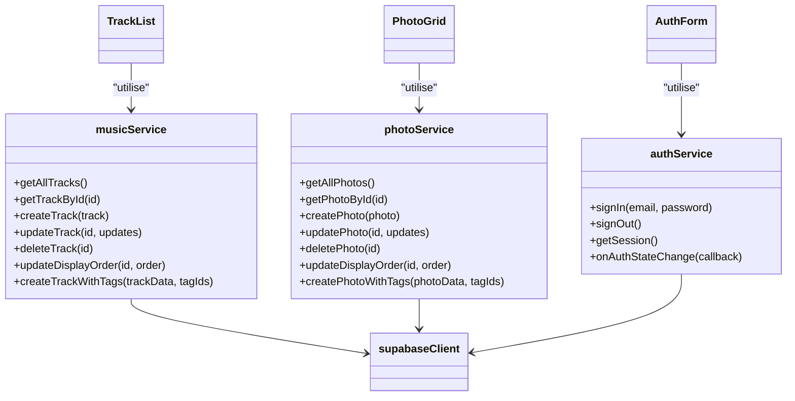
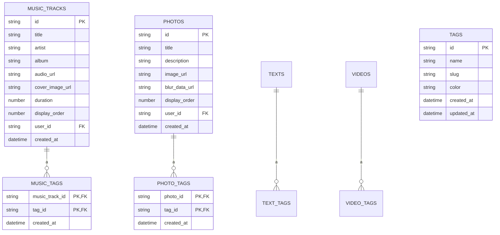
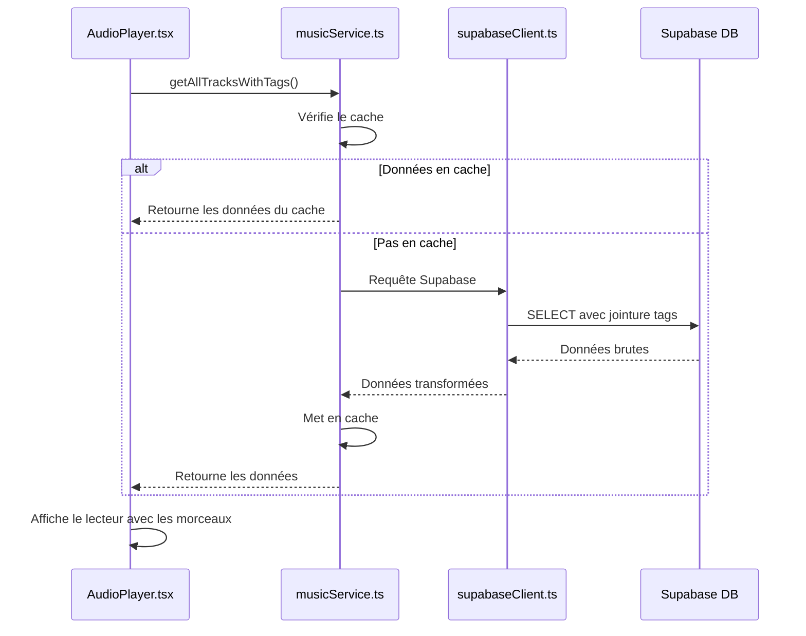
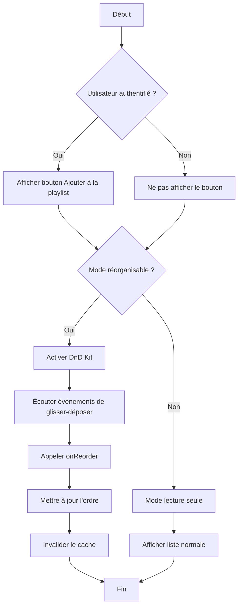
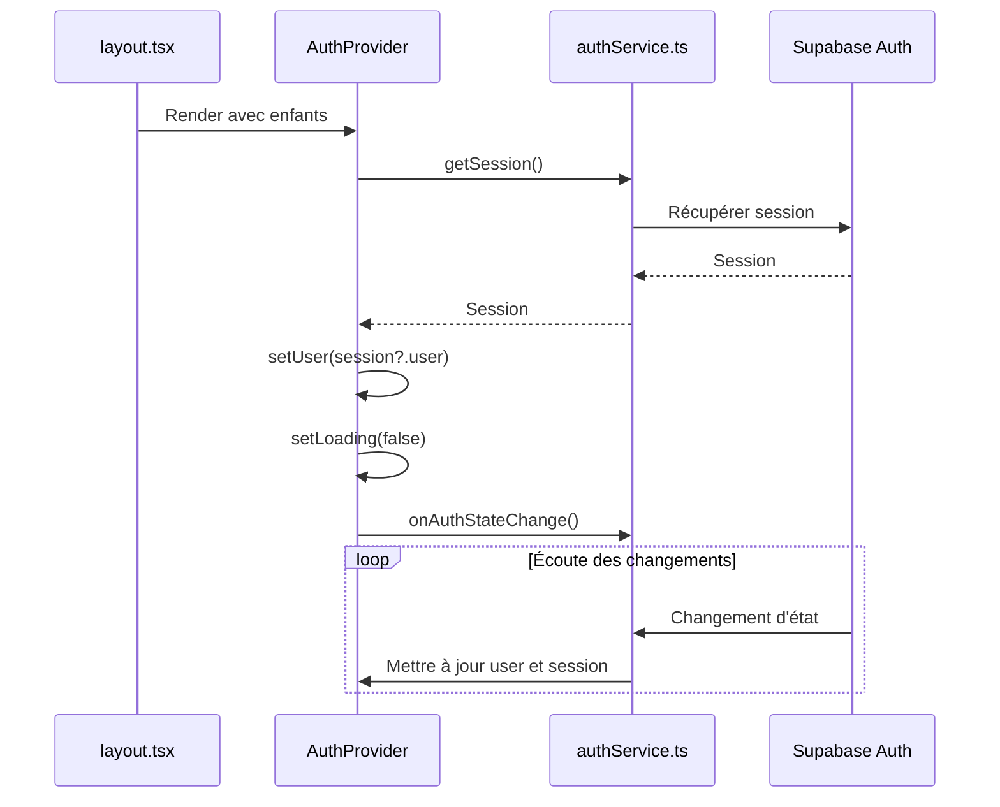

# Structure du Projet

<cite>
**Fichiers référencés dans ce document**  
- [app/layout.tsx](file://app/layout.tsx)
- [components/AppLayout.tsx](file://components/AppLayout.tsx)
- [contexts/AuthContext.tsx](file://contexts/AuthContext.tsx)
- [contexts/ThemeContext.tsx](file://contexts/ThemeContext.tsx)
- [contexts/ColorThemeContext.tsx](file://contexts/ColorThemeContext.tsx)
- [hooks/useAuth.ts](file://hooks/useAuth.ts)
- [lib/supabaseClient.ts](file://lib/supabaseClient.ts)
- [services/musicService.ts](file://services/musicService.ts)
- [services/photoService.ts](file://services/photoService.ts)
- [components/music/AudioPlayer.tsx](file://components/music/AudioPlayer.tsx)
- [components/music/TrackList.tsx](file://components/music/TrackList.tsx)
- [components/photos/PhotoGrid.tsx](file://components/photos/PhotoGrid.tsx)
- [supabase/migrations/20251106095111_create_music_tracks_table.sql](file://supabase/migrations/20251106095111_create_music_tracks_table.sql)
- [supabase/migrations/20251105115814_create_photos_table.sql](file://supabase/migrations/20251105115814_create_photos_table.sql)
</cite>

## Table des matières
1. [Introduction](#introduction)
2. [Structure organisationnelle du projet](#structure-organisationnelle-du-projet)
3. [Interactions entre les composants](#interactions-entre-les-composants)
4. [Gestion de l'état global](#gestion-de-létat-global)
5. [Architecture des données](#architecture-des-données)
6. [Conclusion](#conclusion)

## Introduction

Ce document présente la structure organisationnelle du projet Portfolio, une application Next.js 13 conçue pour présenter des créations artistiques et professionnelles. Le projet met en œuvre un système de thèmes double (clair/sombre et couleurs personnalisables) et utilise Supabase comme backend pour l'authentification, la base de données et le stockage. L'architecture suit les meilleures pratiques de séparation des préoccupations, avec des dossiers clairement définis pour le routage, les composants, la gestion d'état, la logique métier et les utilitaires.

**Section sources**
- [README.md](file://README.md#L1-L172)

## Structure organisationnelle du projet

La structure du projet Portfolio suit une architecture modulaire qui favorise la réutilisabilité, la maintenabilité et la scalabilité. Chaque répertoire principal a un rôle bien défini, permettant une séparation claire des responsabilités.

### Répertoire `app/` : Base du routage Next.js

Le répertoire `app/` est le cœur du routage de l'application, utilisant le système App Router de Next.js. Chaque sous-répertoire correspond à une route de l'application, et les fichiers `page.tsx` définissent les pages associées. Le fichier `layout.tsx` racine fournit une structure commune à toutes les pages, en incluant les providers de contexte et la mise en page principale.

Le répertoire contient des pages pour différentes catégories de contenu (musique, photos, vidéos, textes, applications) ainsi que des pages fonctionnelles (connexion, paramètres, administration). Cette organisation permet une navigation hiérarchique intuitive et une séparation claire des différentes sections du portfolio.

**Diagram sources**
- [app/layout.tsx](file://app/layout.tsx#L1-L45)
- [app/page.tsx](file://app/page.tsx#L1-L79)

**Section sources**
- [app/layout.tsx](file://app/layout.tsx#L1-L45)
- [app/page.tsx](file://app/page.tsx#L1-L79)

### Répertoire `components/` : Composants React réutilisables

Le répertoire `components/` contient tous les composants React réutilisables, organisés par domaine (musique, photos, vidéos, textes, etc.). Cette organisation par domaine permet de regrouper les composants fonctionnellement liés, facilitant la maintenance et la découverte.

Les composants sont conçus pour être indépendants et réutilisables, avec une attention particulière portée à l'accessibilité et à l'expérience utilisateur. Le sous-répertoire `ui/` contient les composants de base de shadcn/ui, construits sur Radix UI et stylisés avec Tailwind CSS, assurant une cohérence visuelle et un comportement accessible.

```mermaid
graph TD
A[components/] --> B[gists/]
A --> C[music/]
A --> D[photos/]
A --> E[repositories/]
A --> F[texts/]
A --> G[ui/]
A --> H[videos/]
A --> I[AppLayout.tsx]
A --> J[BookmarkButton.tsx]
A --> K[GlobalSearch.tsx]
A --> L[MobileSidebar.tsx]
A --> M[OptimizedImage.tsx]
A --> N[PrefetchData.tsx]
A --> O[ProtectedRoute.tsx]
A --> P[RefreshButton.tsx]
A --> Q[ShareButton.tsx]
A --> R[Sidebar.tsx]
A --> S[SkipToContent.tsx]
A --> T[ThemeToggle.tsx]
A --> U[Topbar.tsx]
A --> V[WebVitals.tsx]
```

**Diagram sources**
- [components/AppLayout.tsx](file://components/AppLayout.tsx#L1-L73)

**Section sources**
- [components/AppLayout.tsx](file://components/AppLayout.tsx#L1-L73)

### Répertoire `contexts/` : Gestion d'état global

Le répertoire `contexts/` contient les contextes React utilisés pour la gestion d'état global. Trois contextes principaux sont implémentés : `AuthContext` pour l'authentification, `ThemeContext` pour le mode clair/sombre, et `ColorThemeContext` pour les thèmes de couleurs personnalisables.

Ces contextes permettent de partager l'état entre différents composants sans avoir à le passer explicitement à travers les props, réduisant ainsi la prop drilling. Ils sont fournis au niveau racine de l'application via le fichier `layout.tsx`, rendant leur état accessible à tous les composants enfants.

**Diagram sources**
- [contexts/AuthContext.tsx](file://contexts/AuthContext.tsx#L1-L71)
- [contexts/ThemeContext.tsx](file://contexts/ThemeContext.tsx#L1-L96)
- [contexts/ColorThemeContext.tsx](file://contexts/ColorThemeContext.tsx#L1-L119)

**Section sources**
- [contexts/AuthContext.tsx](file://contexts/AuthContext.tsx#L1-L71)
- [contexts/ThemeContext.tsx](file://contexts/ThemeContext.tsx#L1-L96)
- [contexts/ColorThemeContext.tsx](file://contexts/ColorThemeContext.tsx#L1-L119)

### Répertoire `services/` : Couche métier et accès aux données

Le répertoire `services/` contient la logique métier de l'application et l'accès aux données via Supabase. Chaque service correspond à une entité du domaine (musique, photos, vidéos, etc.) et expose des méthodes pour les opérations CRUD.

Les services encapsulent la complexité de l'interaction avec Supabase, fournissant une interface propre et cohérente aux composants. Ils incluent également des fonctionnalités comme la mise en cache, la validation des données et la gestion des erreurs, assurant une expérience utilisateur fluide et fiable.

**Diagram sources**
- [services/musicService.ts](file://services/musicService.ts#L1-L301)
- [services/photoService.ts](file://services/photoService.ts#L1-L221)

**Section sources**
- [services/musicService.ts](file://services/musicService.ts#L1-L301)
- [services/photoService.ts](file://services/photoService.ts#L1-L221)

### Répertoire `lib/` : Utilitaires partagés

Le répertoire `lib/` contient des fonctions utilitaires partagées par l'ensemble de l'application. Ces utilitaires incluent le client Supabase, des fonctions de validation, de formatage, de gestion du cache et d'autres outils transversaux.

Cette centralisation des utilitaires évite la duplication de code et assure une cohérence dans l'implémentation des fonctionnalités communes. Le fichier `supabaseClient.ts` est particulièrement important, car il configure et exporte le client Supabase utilisé par tous les services.

**Section sources**
- [lib/supabaseClient.ts](file://lib/supabaseClient.ts#L1-L344)

### Répertoire `supabase/migrations/` : Gestion du schéma de base de données

Le répertoire `supabase/migrations/` contient les scripts SQL pour la gestion du schéma de la base de données Supabase. Chaque fichier de migration correspond à une modification du schéma, permettant de versionner et de reproduire l'état de la base de données.

Les migrations sont exécutées dans l'ordre chronologique, assurant que la base de données est toujours dans un état cohérent. Cette approche permet une collaboration efficace entre les développeurs et un déploiement fiable des modifications de schéma.

**Diagram sources**
- [supabase/migrations/20251106095111_create_music_tracks_table.sql](file://supabase/migrations/20251106095111_create_music_tracks_table.sql)
- [supabase/migrations/20251105115814_create_photos_table.sql](file://supabase/migrations/20251105115814_create_photos_table.sql)

**Section sources**
- [supabase/migrations/20251106095111_create_music_tracks_table.sql](file://supabase/migrations/20251106095111_create_music_tracks_table.sql)
- [supabase/migrations/20251105115814_create_photos_table.sql](file://supabase/migrations/20251105115814_create_photos_table.sql)

## Interactions entre les composants

Les différents dossiers du projet interagissent de manière cohérente pour fournir une expérience utilisateur fluide. Cette section illustre comment un composant utilise un service via un hook personnalisé, mettant en évidence la séparation des responsabilités et la réutilisabilité du code.

### Exemple d'interaction : Lecteur audio

Le composant `AudioPlayer` dans `components/music/AudioPlayer.tsx` illustre parfaitement l'interaction entre les différents dossiers. Il utilise le service `musicService` pour récupérer les morceaux de musique, le contexte `AuthContext` pour vérifier l'état d'authentification, et des hooks personnalisés pour la gestion de l'état local.

Le composant affiche une liste de morceaux et permet à l'utilisateur de les lire, de contrôler le volume et de naviguer entre les morceaux. Il utilise également le service `musicService` pour récupérer les données des morceaux, démontrant comment la couche de présentation interagit avec la couche métier.

**Diagram sources**
- [components/music/AudioPlayer.tsx](file://components/music/AudioPlayer.tsx#L1-L800)
- [services/musicService.ts](file://services/musicService.ts#L1-L301)
- [lib/supabaseClient.ts](file://lib/supabaseClient.ts#L1-L344)

**Section sources**
- [components/music/AudioPlayer.tsx](file://components/music/AudioPlayer.tsx#L1-L800)
- [services/musicService.ts](file://services/musicService.ts#L1-L301)

### Exemple d'interaction : Liste de morceaux

Le composant `TrackList` dans `components/music/TrackList.tsx` montre comment un composant peut être à la fois réutilisable et personnalisable. Il utilise le service `musicService` pour accéder aux données des morceaux et le contexte `AuthContext` pour afficher des fonctionnalités conditionnelles (comme l'ajout à une playlist) uniquement pour les utilisateurs authentifiés.

Le composant supporte deux modes : un mode normal pour afficher la liste des morceaux, et un mode réorganisable pour permettre à l'utilisateur de réorganiser l'ordre des morceaux via un glisser-déposer. Cette flexibilité est rendue possible par la séparation claire entre la logique de présentation et la logique métier.

**Diagram sources**
- [components/music/TrackList.tsx](file://components/music/TrackList.tsx#L1-L294)
- [services/musicService.ts](file://services/musicService.ts#L1-L301)

**Section sources**
- [components/music/TrackList.tsx](file://components/music/TrackList.tsx#L1-L294)

## Gestion de l'état global

La gestion de l'état global dans le projet Portfolio repose sur le pattern Context API de React, permettant de partager l'état entre différents composants sans prop drilling. Cette section détaille comment les différents contextes interagissent avec les composants et les services.

### Authentification et contexte utilisateur

Le contexte `AuthContext` gère l'état d'authentification de l'utilisateur, en s'appuyant sur Supabase Auth pour la gestion des sessions. Il expose un hook `useAuth` qui permet à n'importe quel composant d'accéder à l'état d'authentification et d'effectuer des opérations comme la connexion et la déconnexion.

Le contexte s'abonne aux changements d'état d'authentification via `onAuthStateChange`, assurant que l'interface utilisateur est mise à jour en temps réel lorsque l'utilisateur se connecte ou se déconnecte. Cette approche permet une expérience utilisateur fluide, sans nécessiter de rechargement de page.

**Diagram sources**
- [contexts/AuthContext.tsx](file://contexts/AuthContext.tsx#L1-L71)
- [services/authService.ts](file://services/authService.ts)
- [app/layout.tsx](file://app/layout.tsx#L1-L45)

**Section sources**
- [contexts/AuthContext.tsx](file://contexts/AuthContext.tsx#L1-L71)

### Thèmes et personnalisation

Les contextes `ThemeContext` et `ColorThemeContext` permettent à l'utilisateur de personnaliser l'apparence de l'application. `ThemeContext` gère le mode clair/sombre, en respectant les préférences du système ou en permettant à l'utilisateur de choisir un mode spécifique.

`ColorThemeContext` va plus loin en permettant à l'utilisateur de choisir parmi plusieurs thèmes de couleurs prédéfinis ou de créer un thème personnalisé. Les deux contextes persistent leurs préférences dans le localStorage, assurant que les choix de l'utilisateur sont conservés entre les sessions.

**Section sources**
- [contexts/ThemeContext.tsx](file://contexts/ThemeContext.tsx#L1-L96)
- [contexts/ColorThemeContext.tsx](file://contexts/ColorThemeContext.tsx#L1-L119)

## Architecture des données

L'architecture des données du projet Portfolio repose sur Supabase, une plateforme open source qui fournit une base de données PostgreSQL, une API REST, une authentification et un stockage d'objets. Cette section décrit comment les données sont structurées et accédées.

### Modèle de données

Le modèle de données est conçu pour être flexible et évolutif, avec des entités principales (musique, photos, vidéos, textes) qui partagent des fonctionnalités communes comme les tags, les permissions et l'ordre d'affichage. Chaque entité a une table correspondante dans la base de données, avec des relations appropriées pour les fonctionnalités avancées.

Les migrations SQL dans `supabase/migrations/` définissent la structure de la base de données de manière déclarative, permettant de versionner les changements de schéma et de les appliquer de manière contrôlée. Cette approche assure que la base de données est toujours dans un état cohérent, même lors de déploiements multiples.

**Section sources**
- [supabase/migrations/](file://supabase/migrations/)

### Accès aux données

L'accès aux données est centralisé dans le répertoire `services/`, qui fournit une couche d'abstraction sur Supabase. Cette couche encapsule la complexité des requêtes, de la mise en cache et de la gestion des erreurs, offrant une interface simple et cohérente aux composants.

La mise en cache est implémentée pour améliorer les performances, en stockant les données fréquemment accédées dans le sessionStorage. Le cache est invalidé de manière appropriée lorsque les données sont modifiées, assurant que l'interface utilisateur affiche toujours des données à jour.

**Section sources**
- [services/musicService.ts](file://services/musicService.ts#L1-L301)
- [services/photoService.ts](file://services/photoService.ts#L1-L221)
- [lib/cache.ts](file://lib/cache.ts)

## Conclusion

La structure organisationnelle du projet Portfolio illustre une architecture bien conçue qui favorise la maintenabilité, la réutilisabilité et l'extensibilité. La séparation claire des responsabilités entre les différents dossiers permet à l'équipe de développement de travailler efficacement, chaque membre pouvant se concentrer sur un domaine spécifique sans perturber les autres parties du système.

L'utilisation de Next.js App Router pour le routage, de React Context pour la gestion d'état global, et de Supabase pour le backend crée une pile technologique cohérente et puissante. La documentation détaillée des interactions entre les composants et des flux de données fournit une base solide pour le développement futur et la maintenance du projet.