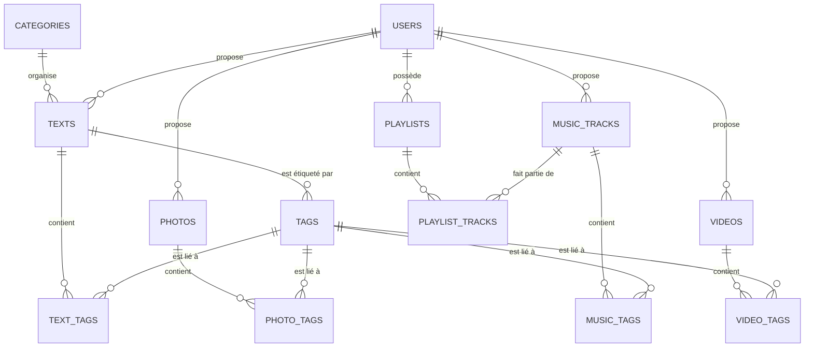
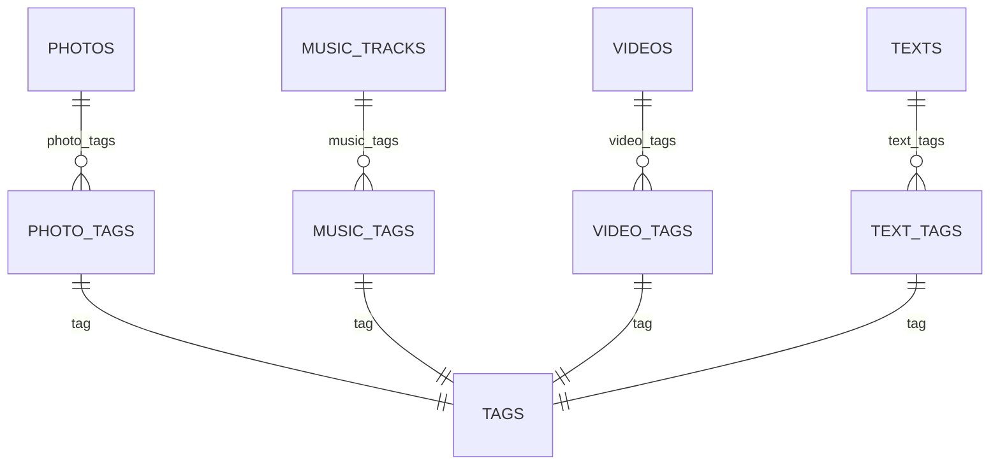
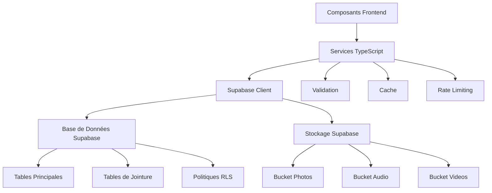

# Base de Données

<cite>
**Fichiers Référencés dans ce Document**
- [20251105115814_create_photos_table.sql](file://supabase/migrations/20251105115814_create_photos_table.sql)
- [20251106095111_create_music_tracks_table.sql](file://supabase/migrations/20251106095111_create_music_tracks_table.sql)
- [20251108071024_create_videos_system.sql](file://supabase/migrations/20251108071024_create_videos_system.sql)
- [20250107_create_texts_system.sql](file://supabase/migrations/20250107_create_texts_system.sql)
- [20251111050910_create_playlists_system.sql](file://supabase/migrations/20251111050910_create_playlists_system.sql)
- [002_add_media_tags.sql](file://supabase/migrations/002_add_media_tags.sql)
- [20251106122742_create_audio_storage_bucket.sql](file://supabase/migrations/20251106122742_create_audio_storage_bucket.sql)
- [20251106122804_create_photo_storage_bucket.sql](file://supabase/migrations/20251106122804_create_photo_storage_bucket.sql)
- [20250111_add_security_constraints.sql](file://supabase/migrations/20250111_add_security_constraints.sql)
- [supabaseClient.ts](file://lib/supabaseClient.ts)
- [photoService.ts](file://services/photoService.ts)
- [musicService.ts](file://services/musicService.ts)
- [textService.ts](file://services/textService.ts)
- [videoService.ts](file://services/videoService.ts)
</cite>

## Table des Matières
1. [Introduction](#introduction)
2. [Architecture du Modèle de Données](#architecture-du-modèle-de-données)
3. [Tables Principales](#tables-principales)
4. [Relations et Tables de Jointure](#relations-et-tables-de-jointure)
5. [Politiques de Sécurité RLS](#politiques-de-sécurité-rls)
6. [Client Supabase](#client-supabase)
7. [Services et Utilisation](#services-et-utilisation)
8. [Optimisations et Index](#optimisations-et-index)
9. [Conclusion](#conclusion)

## Introduction

Le projet Portfolio utilise Supabase comme solution de base de données PostgreSQL avec une couche d'authentification intégrée. Le modèle de données est conçu pour gérer plusieurs types de médias (photos, musiques, vidéos, textes) ainsi que des fonctionnalités avancées comme les playlists, les tags, les catégories et les gists. Cette documentation présente en détail le schéma de base de données, les relations entre entités, les politiques de sécurité et l'utilisation du client Supabase.

## Architecture du Modèle de Données

Le modèle de données suit une architecture modulaire organisée autour de quatre catégories principales :



**Sources du Diagramme**
- [20251105115814_create_photos_table.sql](file://supabase/migrations/20251105115814_create_photos_table.sql#L25-L32)
- [20251106095111_create_music_tracks_table.sql](file://supabase/migrations/20251106095111_create_music_tracks_table.sql#L34-L44)
- [20251108071024_create_videos_system.sql](file://supabase/migrations/20251108071024_create_videos_system.sql#L36-L45)
- [20250107_create_texts_system.sql](file://supabase/migrations/20250107_create_texts_system.sql#L61-L75)
- [20251111050910_create_playlists_system.sql](file://supabase/migrations/20251111050910_create_playlists_system.sql#L41-L59)

## Tables Principales

### Photos

La table `photos` gère la galerie d'images avec support des tags et ordonnancement personnalisé.

| Colonne | Type | Contraintes | Description |
|---------|------|-------------|-------------|
| `id` | UUID | PRIMARY KEY, AUTO | Identifiant unique de la photo |
| `title` | TEXT | NOT NULL | Titre de la photo |
| `description` | TEXT | NULLABLE | Description optionnelle |
| `image_url` | TEXT | NOT NULL | URL publique de l'image |
| `blur_data_url` | TEXT | NULLABLE | URL de l'image floutée (pour LQIP) |
| `display_order` | INTEGER | NOT NULL, DEFAULT 0 | Ordre d'affichage personnalisé |
| `user_id` | UUID | FOREIGN KEY | Propriétaire de la photo |
| `created_at` | TIMESTAMPTZ | DEFAULT now() | Date de création |

**Sources de Section**
- [20251105115814_create_photos_table.sql](file://supabase/migrations/20251105115814_create_photos_table.sql#L25-L32)

### Musique

La table `music_tracks` stocke les informations sur les morceaux musicaux avec gestion des playlists.

| Colonne | Type | Contraintes | Description |
|---------|------|-------------|-------------|
| `id` | UUID | PRIMARY KEY, AUTO | Identifiant unique du morceau |
| `title` | TEXT | NOT NULL | Titre du morceau |
| `artist` | TEXT | NULLABLE, DEFAULT '' | Nom de l'artiste |
| `album` | TEXT | NULLABLE, DEFAULT '' | Nom de l'album |
| `audio_url` | TEXT | NOT NULL | URL du fichier audio |
| `cover_image_url` | TEXT | NULLABLE, DEFAULT '' | URL de l'image de couverture |
| `duration` | INTEGER | NULLABLE, DEFAULT 0 | Durée en secondes |
| `display_order` | INTEGER | NOT NULL, DEFAULT 0 | Ordre d'affichage |
| `user_id` | UUID | FOREIGN KEY, NULLABLE | Propriétaire |
| `created_at` | TIMESTAMPTZ | DEFAULT now() | Date de création |

**Sources de Section**
- [20251106095111_create_music_tracks_table.sql](file://supabase/migrations/20251106095111_create_music_tracks_table.sql#L34-L44)

### Vidéos

La table `videos` gère la bibliothèque vidéo avec support des miniatures et durées.

| Colonne | Type | Contraintes | Description |
|---------|------|-------------|-------------|
| `id` | UUID | PRIMARY KEY, AUTO | Identifiant unique de la vidéo |
| `title` | TEXT | NOT NULL | Titre de la vidéo |
| `description` | TEXT | NULLABLE | Description optionnelle |
| `video_url` | TEXT | NOT NULL | URL du fichier vidéo |
| `thumbnail_url` | TEXT | NULLABLE | URL de la miniature |
| `duration` | INTEGER | NULLABLE | Durée en secondes |
| `display_order` | INTEGER | NOT NULL, DEFAULT 0 | Ordre d'affichage |
| `user_id` | UUID | FOREIGN KEY, NULLABLE | Propriétaire |
| `created_at` | TIMESTAMPTZ | DEFAULT now() | Date de création |

**Sources de Section**
- [20251108071024_create_videos_system.sql](file://supabase/migrations/20251108071024_create_videos_system.sql#L36-L45)

### Textes

La table `texts` constitue le système de contenu avec catégories et tags.

| Colonne | Type | Contraintes | Description |
|---------|------|-------------|-------------|
| `id` | UUID | PRIMARY KEY, AUTO | Identifiant unique du texte |
| `title` | TEXT | NOT NULL | Titre du texte |
| `subtitle` | TEXT | NULLABLE | Sous-titre optionnel |
| `content` | TEXT | NOT NULL | Contenu principal |
| `excerpt` | TEXT | NULLABLE | Extrait pour les listes |
| `author` | TEXT | NULLABLE | Auteur du texte |
| `published_date` | DATE | NULLABLE | Date de publication |
| `display_order` | INTEGER | NOT NULL, DEFAULT 0 | Ordre d'affichage |
| `category_id` | UUID | FOREIGN KEY, NULLABLE | Catégorie associée |
| `user_id` | UUID | FOREIGN KEY, CASCADE | Propriétaire |
| `is_published` | BOOLEAN | DEFAULT false | Statut de publication |
| `view_count` | INTEGER | DEFAULT 0 | Nombre de vues |
| `created_at` | TIMESTAMPTZ | DEFAULT now() | Date de création |
| `updated_at` | TIMESTAMPTZ | DEFAULT now() | Date de modification |

**Sources de Section**
- [20250107_create_texts_system.sql](file://supabase/migrations/20250107_create_texts_system.sql#L61-L75)

### Playlists

La table `playlists` gère les collections de morceaux musicaux.

| Colonne | Type | Contraintes | Description |
|---------|------|-------------|-------------|
| `id` | UUID | PRIMARY KEY, AUTO | Identifiant unique de la playlist |
| `name` | TEXT | NOT NULL | Nom de la playlist |
| `description` | TEXT | NULLABLE | Description optionnelle |
| `user_id` | UUID | NOT NULL, FOREIGN KEY | Propriétaire |
| `is_public` | BOOLEAN | DEFAULT false | Visibilité publique |
| `display_order` | INTEGER | NOT NULL, DEFAULT 0 | Ordre d'affichage |
| `created_at` | TIMESTAMPTZ | DEFAULT now() | Date de création |
| `updated_at` | TIMESTAMPTZ | DEFAULT now() | Date de modification |

**Sources de Section**
- [20251111050910_create_playlists_system.sql](file://supabase/migrations/20251111050910_create_playlists_system.sql#L41-L49)

### Catégories et Tags

Les tables `categories` et `tags` fournissent la taxonomie du contenu.

#### Categories
- `id`: UUID, PRIMARY KEY
- `name`: TEXT, NOT NULL, UNIQUE
- `slug`: TEXT, NOT NULL, UNIQUE
- `description`: TEXT, NULLABLE
- `color`: TEXT, DEFAULT '#3b82f6'
- `display_order`: INTEGER, NOT NULL, DEFAULT 0
- `created_at`: TIMESTAMPTZ, DEFAULT now()
- `updated_at`: TIMESTAMPTZ, DEFAULT now()

#### Tags
- `id`: UUID, PRIMARY KEY
- `name`: TEXT, NOT NULL, UNIQUE
- `slug`: TEXT, NOT NULL, UNIQUE
- `color`: TEXT, NULLABLE
- `created_at`: TIMESTAMPTZ, DEFAULT now()
- `updated_at`: TIMESTAMPTZ, DEFAULT now()

**Sources de Section**
- [20250107_create_texts_system.sql](file://supabase/migrations/20250107_create_texts_system.sql#L8-L56)

## Relations et Tables de Jointure

### Relations Many-to-Many

Le système utilise des tables de jointure pour gérer les relations many-to-many entre les médias et les tags.



**Sources du Diagramme**
- [002_add_media_tags.sql](file://supabase/migrations/002_add_media_tags.sql#L7-L45)

#### Photo Tags
- `photo_id`: UUID, FOREIGN KEY, NOT NULL
- `tag_id`: UUID, FOREIGN KEY, NOT NULL
- `created_at`: TIMESTAMPTZ, DEFAULT NOW()
- **Clé primaire composite**: (photo_id, tag_id)

#### Music Tags
- `music_track_id`: UUID, FOREIGN KEY, NOT NULL
- `tag_id`: UUID, FOREIGN KEY, NOT NULL
- `created_at`: TIMESTAMPTZ, DEFAULT NOW()
- **Clé primaire composite**: (music_track_id, tag_id)

#### Video Tags
- `video_id`: UUID, FOREIGN KEY, NOT NULL
- `tag_id`: UUID, FOREIGN KEY, NOT NULL
- `created_at`: TIMESTAMPTZ, DEFAULT NOW()
- **Clé primaire composite**: (video_id, tag_id)

#### Text Tags
- `text_id`: UUID, FOREIGN KEY, NOT NULL
- `tag_id`: UUID, FOREIGN KEY, NOT NULL
- `created_at`: TIMESTAMPTZ, DEFAULT NOW()
- **Clé primaire composite**: (text_id, tag_id)

**Sources de Section**
- [002_add_media_tags.sql](file://supabase/migrations/002_add_media_tags.sql#L7-L45)

### Relations avec la Table Users

Chaque type de média et contenu est lié à la table `auth.users` via la colonne `user_id` :

- **Photos**: `user_id` nullable (permet la migration)
- **Musique**: `user_id` nullable (permet la migration)
- **Vidéos**: `user_id` nullable (permet la migration)
- **Textes**: `user_id` NOT NULL, CASCADE DELETE
- **Playlists**: `user_id` NOT NULL, CASCADE DELETE

## Politiques de Sécurité RLS

### Activation de RLS

RLS (Row Level Security) est activé sur toutes les tables principales :

```sql
ALTER TABLE photos ENABLE ROW LEVEL SECURITY;
ALTER TABLE music_tracks ENABLE ROW LEVEL SECURITY;
ALTER TABLE videos ENABLE ROW LEVEL SECURITY;
ALTER TABLE texts ENABLE ROW_LEVEL_SECURITY;
ALTER TABLE playlists ENABLE ROW_LEVEL_SECURITY;
```

### Politiques pour les Médias

#### Photos
- **SELECT**: Accès public (`USING (true)`)
- **INSERT**: Authentifié uniquement (`TO authenticated`)
- **UPDATE**: Propriétaire uniquement (`USING (auth.uid() = user_id)`)
- **DELETE**: Propriétaire uniquement (`USING (auth.uid() = user_id)`)

#### Musique
- **SELECT**: Accès public (`USING (true)`)
- **INSERT**: Authentifié uniquement (`TO authenticated`)
- **UPDATE**: Propriétaire uniquement (`USING (auth.uid() = user_id)`)
- **DELETE**: Propriétaire uniquement (`USING (auth.uid() = user_id)`)

#### Vidéos
- **SELECT**: Accès public (`USING (true)`)
- **INSERT**: Authentifié uniquement (`TO authenticated`)
- **UPDATE**: Propriétaire uniquement (`USING (auth.uid() = user_id)`)
- **DELETE**: Propriétaire uniquement (`USING (auth.uid() = user_id)`)

**Sources de Section**
- [20251105115814_create_photos_table.sql](file://supabase/migrations/20251105115814_create_photos_table.sql#L34-L59)
- [20251106095111_create_music_tracks_table.sql](file://supabase/migrations/20251106095111_create_music_tracks_table.sql#L50-L75)
- [20251108071024_create_videos_system.sql](file://supabase/migrations/20251108071024_create_videos_system.sql#L48-L74)

### Politiques pour les Textes

#### Sécurité Avancée des Textes
- **SELECT**: Publique pour les textes publiés (`USING (is_published = true)`) + Propres textes (`USING (auth.uid() = user_id)`)
- **INSERT**: Authentifié uniquement (`TO authenticated`)
- **UPDATE**: Propriétaire uniquement (`USING (auth.uid() = user_id)`)
- **DELETE**: Propriétaire uniquement (`USING (auth.uid() = user_id)`)

#### Sécurité des Tags et Catégories
- **SELECT**: Accès public (`USING (true)`)
- **INSERT**: Administrateur uniquement (`WITH CHECK (auth.role() = 'authenticated')`)
- **UPDATE**: Administrateur uniquement (`USING (auth.role() = 'authenticated')`)
- **DELETE**: Administrateur uniquement (`USING (auth.role() = 'authenticated')`)

**Sources de Section**
- [20250107_create_texts_system.sql](file://supabase/migrations/20250107_create_texts_system.sql#L114-L222)

### Politiques de Stockage

#### Bucket Audio Files
- **Public**: Accessible en lecture publique
- **Upload**: Authentifié uniquement
- **Update**: Authentifié uniquement
- **Delete**: Authentifié uniquement
- **Taille**: 10MB maximum
- **Types MIME**: audio/mpeg, audio/mp3, audio/wav, audio/ogg

#### Bucket Photo Files
- **Public**: Accessible en lecture publique
- **Upload**: Authentifié uniquement
- **Update**: Authentifié uniquement
- **Delete**: Authentifié uniquement
- **Taille**: 5MB maximum
- **Types MIME**: image/jpeg, image/png, image/webp, image/gif

**Sources de Section**
- [20251106122742_create_audio_storage_bucket.sql](file://supabase/migrations/20251106122742_create_audio_storage_bucket.sql#L22-L55)
- [20251106122804_create_photo_storage_bucket.sql](file://supabase/migrations/20251106122804_create_photo_storage_bucket.sql#L22-L55)

## Client Supabase

### Configuration et Initialisation

Le client Supabase est configuré dans `lib/supabaseClient.ts` avec gestion des sessions persistées et rafraîchissement automatique.

```typescript
const supabaseUrl = process.env.NEXT_PUBLIC_SUPABASE_URL!;
const supabaseAnonKey = process.env.NEXT_PUBLIC_SUPABASE_ANON_KEY!;
```

### Types TypeScript

Le client exporte des types TypeScript pour chaque entité :

#### Types de Base
- `Photo`: Informations de photo avec métadonnées
- `MusicTrack`: Informations de morceau musical
- `Video`: Informations de vidéo
- `Text`: Informations de texte avec métadonnées
- `Category`: Catégorie de contenu
- `Tag`: Étiquette de contenu

#### Types Avancés
- `PhotoWithTags`: Photo avec ses tags associés
- `MusicTrackWithTags`: Morceau avec ses tags
- `VideoWithTags`: Vidéo avec ses tags
- `TextWithMetadata`: Texte avec catégorie et tags
- `PlaylistWithTracks`: Playlist avec ses morceaux

**Sources de Section**
- [supabaseClient.ts](file://lib/supabaseClient.ts#L1-L344)

### Services de Données

Les services encapsulent les opérations CRUD avec validation, cache et gestion d'erreurs :

#### Photo Service
- `getAllPhotos()`: Récupération de toutes les photos
- `createPhoto()`: Création avec validation d'URL
- `updatePhoto()`: Mise à jour avec cache invalidation
- `deletePhoto()`: Suppression avec cache invalidation

#### Music Service
- `getAllTracks()`: Récupération de tous les morceaux
- `createTrack()`: Création avec validation d'URL audio
- `updateTrack()`: Mise à jour avec validation
- `createTrackWithTags()`: Création avec tags associés

#### Text Service
- `getTextsWithMetadata()`: Récupération avec catégories et tags
- `createTextWithTags()`: Création avec tags et métadonnées
- `searchTexts()`: Recherche full-text
- `getTextsByCategory()` et `getTextsByTag()`: Filtrage

#### Video Service
- `getAllVideosWithTags()`: Récupération avec tags
- `createVideo()`: Création avec validation d'URL
- `createVideoWithTags()`: Création avec tags

**Sources de Section**
- [photoService.ts](file://services/photoService.ts#L1-L221)
- [musicService.ts](file://services/musicService.ts#L1-L301)
- [textService.ts](file://services/textService.ts#L1-L385)
- [videoService.ts](file://services/videoService.ts#L1-L268)

## Services et Utilisation

### Architecture des Services



**Sources du Diagramme**
- [supabaseClient.ts](file://lib/supabaseClient.ts#L10-L16)
- [photoService.ts](file://services/photoService.ts#L1-L10)

### Patterns d'Utilisation

#### Opérations CRUD Standard
1. **Validation**: Vérification des données avant insertion
2. **Authentification**: Récupération du token utilisateur
3. **Opération**: Appel au client Supabase
4. **Cache**: Mise à jour ou invalidation du cache
5. **Gestion d'Erreurs**: Traitement des erreurs avec messages détaillés

#### Opérations avec Métadonnées
1. **Jointures**: Utilisation de `select()` avec relations imbriquées
2. **Transformation**: Conversion des données pour le frontend
3. **Caching**: Stratégie de cache adaptative

#### Gestion des Erreurs
- **Rate Limiting**: Prévention des abus avec limitation temporelle
- **Validation**: Vérification des formats et contraintes
- **RLS**: Gestion des permissions automatiques
- **Logging**: Traçage des erreurs pour le debugging

**Sources de Section**
- [photoService.ts](file://services/photoService.ts#L73-L124)
- [musicService.ts](file://services/musicService.ts#L73-L180)
- [textService.ts](file://services/textService.ts#L39-L107)

## Optimisations et Index

### Index Clés

#### Photos
- `idx_photos_display_order`: Ordre d'affichage
- `idx_photos_created_at`: Tri chronologique
- `idx_photos_user_id`: Recherche par utilisateur

#### Musique
- `idx_music_tracks_display_order`: Ordre d'affichage
- `idx_music_tracks_user_id`: Recherche par utilisateur

#### Vidéos
- `idx_videos_display_order`: Ordre d'affichage
- `idx_videos_user_id`: Recherche par utilisateur
- `idx_videos_created_at`: Tri chronologique

#### Textes
- `idx_texts_category_id`: Filtrage par catégorie
- `idx_texts_user_id`: Recherche par utilisateur
- `idx_texts_display_order`: Ordre d'affichage
- `idx_texts_published_date`: Tri par date
- `idx_texts_is_published`: Filtrage par statut
- `idx_texts_created_at`: Tri chronologique
- `idx_texts_search`: Recherche full-text

#### Playlists
- `idx_playlist_tracks_playlist_id`: Recherche par playlist
- `idx_playlist_tracks_track_id`: Recherche par morceau
- `idx_playlist_tracks_display_order`: Ordre d'affichage

**Sources de Section**
- [20251105115814_create_photos_table.sql](file://supabase/migrations/20251105115814_create_photos_table.sql#L61-L62)
- [20251106095111_create_music_tracks_table.sql](file://supabase/migrations/20251106095111_create_music_tracks_table.sql#L47-L48)
- [20251108071024_create_videos_system.sql](file://supabase/migrations/20251108071024_create_videos_system.sql#L76-L82)
- [20250107_create_texts_system.sql](file://supabase/migrations/20250107_create_texts_system.sql#L78-L89)

### Stratégies de Cache

#### Cache Session
- **Durée**: 5 minutes
- **Scope**: Session utilisateur
- **Invalidation**: Automatique lors des modifications
- **Clés**: `photos:all-with-tags`, `music:all-with-tags`, `texts:all-with-metadata`

#### Cache Adaptatif
- **Textes**: Cache avec TTL configurable
- **Médias**: Cache court pour les données dynamiques
- **Recherches**: Cache pour les requêtes fréquentes

**Sources de Section**
- [photoService.ts](file://services/photoService.ts#L18-L48)
- [musicService.ts](file://services/musicService.ts#L17-L49)

## Conclusion

Le modèle de données du Portfolio présente une architecture robuste et sécurisée conçue pour gérer efficacement divers types de contenu multimédia. Les points forts incluent :

### Forces Architecturales
- **Séparation claire** entre types de contenu
- **Système de tags flexible** avec relations many-to-many
- **Politiques de sécurité RLS** granulaires
- **Cache intelligent** pour les performances
- **Validation côté serveur** et client
- **Gestion des permissions** fine-grain

### Optimisations Implémentées
- **Index stratégiques** pour les requêtes fréquentes
- **Cache session** pour les données utilisateur
- **Validation préventive** des uploads
- **Limitation de taux** pour la protection
- **Jointures optimisées** avec sélection de champs

### Sécurité et Conformité
- **RLS automatique** sur toutes les tables
- **Validation des URLs** pour les médias
- **Contraintes CHECK** sur les formats
- **Politiques de stockage** publiques avec contrôle
- **Audit des permissions** automatique

Cette architecture permet une évolutivité future tout en maintenant des performances optimales et une sécurité robuste, répondant aux besoins d'un portfolio professionnel moderne.