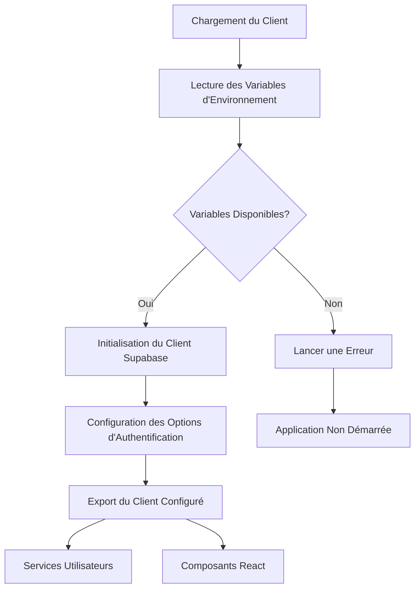
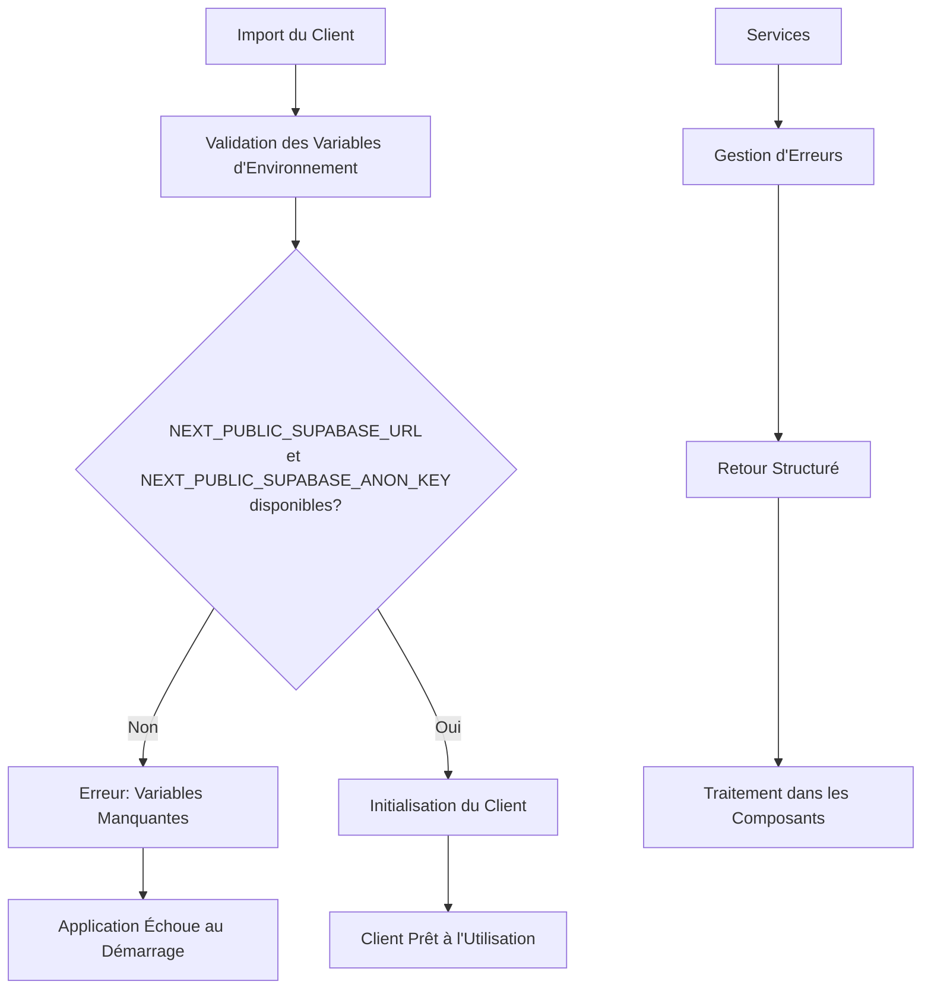
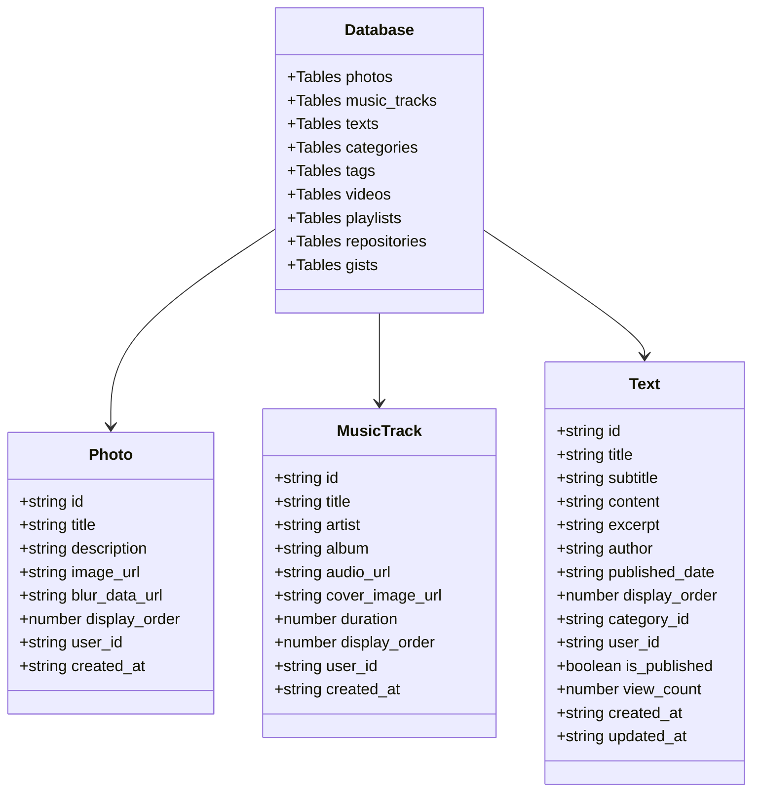
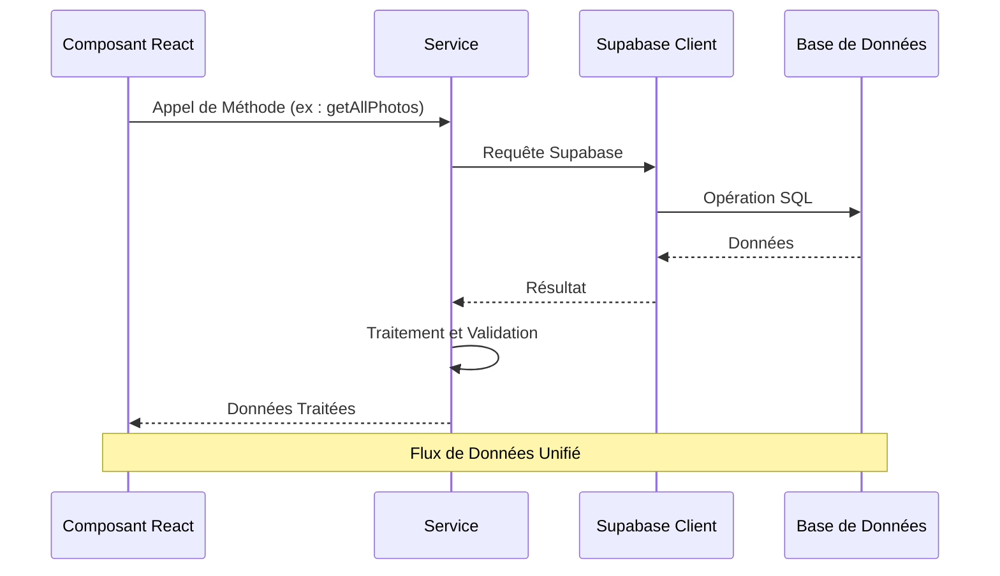
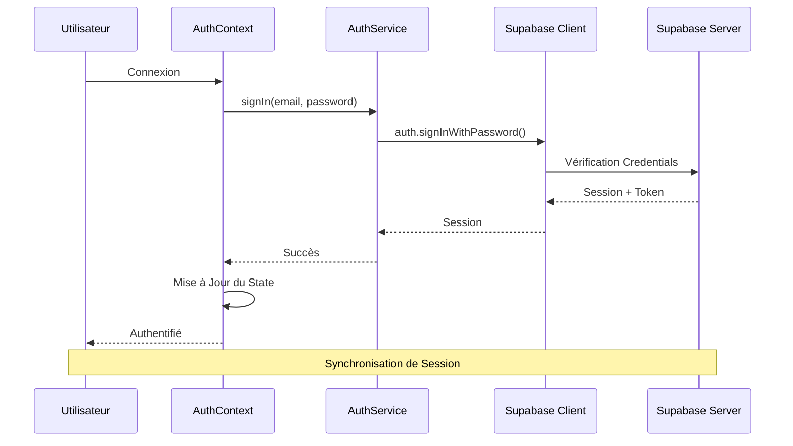
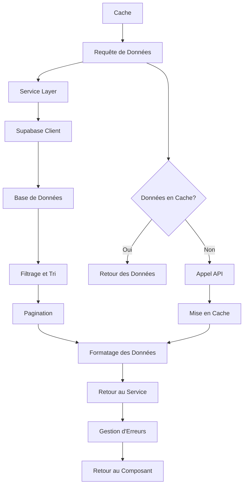
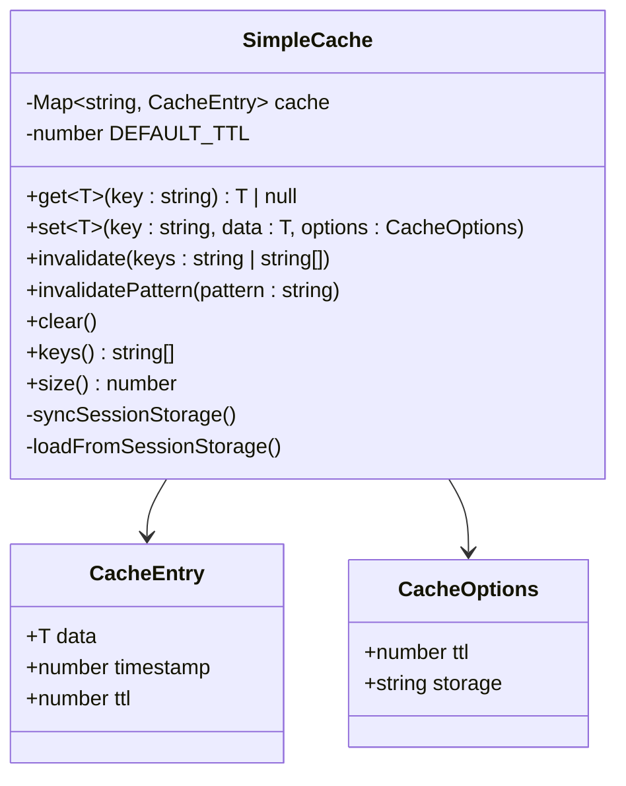
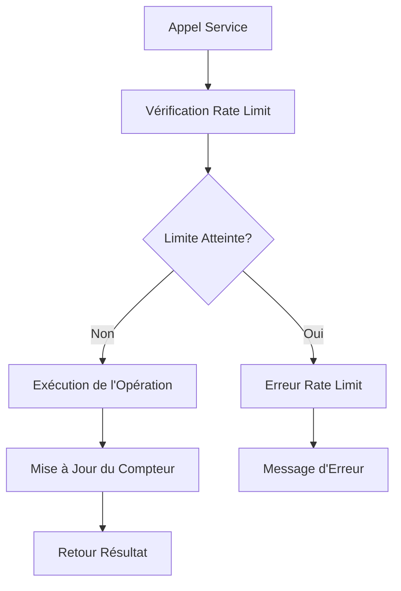

# Client Supabase

<cite>
**Fichiers Référencés dans ce Document**
- [lib/supabaseClient.ts](file://lib/supabaseClient.ts)
- [contexts/AuthContext.tsx](file://contexts/AuthContext.tsx)
- [services/authService.ts](file://services/authService.ts)
- [services/photoService.ts](file://services/photoService.ts)
- [services/musicService.ts](file://services/musicService.ts)
- [services/storageService.ts](file://services/storageService.ts)
- [lib/cache.ts](file://lib/cache.ts)
- [hooks/useAuth.ts](file://hooks/useAuth.ts)
- [components/photos/PhotoList.tsx](file://components/photos/PhotoList.tsx)
- [components/music/TrackList.tsx](file://components/music/TrackList.tsx)
</cite>

## Table des Matières
1. [Introduction](#introduction)
2. [Initialisation du Client](#initialisation-du-client)
3. [Configuration et Options](#configuration-et-options)
4. [Gestion des Erreurs](#gestion-des-erreurs)
5. [Structure des Types de Données](#structure-des-types-de-données)
6. [Pattern de Services](#pattern-de-services)
7. [Intégration avec l'Authentification](#intégration-avec-lauthentification)
8. [Opérations CRUD](#opérations-crud)
9. [Gestion du Cache](#gestion-du-cache)
10. [Optimisations de Performance](#optimisations-de-performance)
11. [Bonnes Pratiques](#bonnes-pratiques)
12. [Conclusion](#conclusion)

## Introduction

Le client Supabase dans ce projet constitue le cœur de l'interaction avec la base de données et le système de stockage. Il fournit une interface unifiée pour toutes les opérations de données, intégrant l'authentification, la gestion des médias, et les services métier. Cette implémentation suit des patterns robustes pour garantir la fiabilité, la performance et une expérience utilisateur optimale.

## Initialisation du Client

Le client Supabase est initialisé de manière centralisée dans le fichier [`lib/supabaseClient.ts`](file://lib/supabaseClient.ts#L1-L16), utilisant les variables d'environnement Next.js pour la sécurité.

**Sources du Diagramme**
- [lib/supabaseClient.ts](file://lib/supabaseClient.ts#L3-L16)

**Sources de Section**
- [lib/supabaseClient.ts](file://lib/supabaseClient.ts#L1-L16)

## Configuration et Options

Le client Supabase est configuré avec trois options critiques qui affectent l'expérience utilisateur :

### Options de Configuration Principales

| Option | Valeur | Impact |
|--------|--------|---------|
| `persistSession` | `true` | Maintient la session utilisateur même après fermeture du navigateur |
| `autoRefreshToken` | `true` | Actualise automatiquement les tokens expirés |
| `detectSessionInUrl` | `true` | Détecte les sessions dans les URLs de redirection |

Ces options assurent une expérience utilisateur transparente avec une authentification persistante et sécurisée.

**Sources de Section**
- [lib/supabaseClient.ts](file://lib/supabaseClient.ts#L10-L16)

## Gestion des Erreurs

Le système de gestion d'erreurs s'articule autour de la validation précoce des variables d'environnement et de la propagation des erreurs dans les services.

**Sources du Diagramme**
- [lib/supabaseClient.ts](file://lib/supabaseClient.ts#L6-L8)

**Sources de Section**
- [lib/supabaseClient.ts](file://lib/supabaseClient.ts#L6-L8)

## Structure des Types de Données

Le client définit une structure complète de types TypeScript pour garantir la cohérence des données à travers l'application.

### Types de Base

**Sources du Diagramme**
- [lib/supabaseClient.ts](file://lib/supabaseClient.ts#L18-L343)

**Sources de Section**
- [lib/supabaseClient.ts](file://lib/supabaseClient.ts#L18-L343)

## Pattern de Services

L'architecture utilise un pattern de services pour encapsuler les appels au client Supabase, offrant une séparation claire entre la logique métier et l'accès aux données.

**Sources du Diagramme**
- [services/photoService.ts](file://services/photoService.ts#L1-L221)
- [services/musicService.ts](file://services/musicService.ts#L1-L301)

### Exemple d'Implémentation de Service

Les services comme [`photoService.ts`](file://services/photoService.ts#L7-L221) et [`musicService.ts`](file://services/musicService.ts#L7-L301) suivent un pattern cohérent :

1. **Import du Client** : Accès au client Supabase configuré
2. **Validation des Données** : Contrôle des entrées utilisateur
3. **Appels API** : Interactions avec la base de données
4. **Gestion d'Erreurs** : Propagation structurée des erreurs
5. **Optimisations** : Cache et validations supplémentaires

**Sources de Section**
- [services/photoService.ts](file://services/photoService.ts#L7-L221)
- [services/musicService.ts](file://services/musicService.ts#L7-L301)

## Intégration avec l'Authentification

Le système d'authentification s'intègre profondément avec le client Supabase via [`AuthContext`](file://contexts/AuthContext.tsx#L1-L71) et [`authService`](file://services/authService.ts#L1-L32).

**Sources du Diagramme**
- [contexts/AuthContext.tsx](file://contexts/AuthContext.tsx#L18-L61)
- [services/authService.ts](file://services/authService.ts#L10-L15)

### Synchronisation de Session

L'AuthContext maintient la synchronisation entre le client Supabase et l'état de l'application :

- **Initialisation** : Chargement de la session au montage
- **Observation** : Surveillance des changements d'état
- **Mise à Jour** : Synchronisation automatique des données

**Sources de Section**
- [contexts/AuthContext.tsx](file://contexts/AuthContext.tsx#L18-L61)
- [services/authService.ts](file://services/authService.ts#L1-L32)

## Opérations CRUD

Le client Supabase permet d'effectuer toutes les opérations CRUD avec une syntaxe intuitive et une gestion d'erreurs robuste.

### Opérations de Lecture

**Sources du Diagramme**
- [services/photoService.ts](file://services/photoService.ts#L8-L15)
- [services/musicService.ts](file://services/musicService.ts#L8-L15)

### Exemples d'Opérations

#### Lecture de Données
- [`getAllPhotos()`](file://services/photoService.ts#L8-L15) : Récupération complète des photos
- [`getTrackById()`](file://services/musicService.ts#L52-L59) : Récupération d'un morceau spécifique

#### Création de Données
- [`createPhoto()`](file://services/photoService.ts#L73-L124) : Création d'une nouvelle photo avec validation
- [`createTrack()`](file://services/musicService.ts#L73-L190) : Création d'un morceau musical avec authentification

#### Mise à Jour de Données
- [`updatePhoto()`](file://services/photoService.ts#L127-L167) : Modification d'une photo existante
- [`updateTrack()`](file://services/musicService.ts#L193-L246) : Mise à jour d'un morceau

#### Suppression de Données
- [`deletePhoto()`](file://services/photoService.ts#L170-L181) : Suppression d'une photo
- [`deleteTrack()`](file://services/musicService.ts#L249-L260) : Suppression d'un morceau

**Sources de Section**
- [services/photoService.ts](file://services/photoService.ts#L8-L221)
- [services/musicService.ts](file://services/musicService.ts#L8-L301)

## Gestion du Cache

Le système de cache [`SimpleCache`](file://lib/cache.ts#L17-L211) optimise les performances en évitant les appels API redondants.

**Sources du Diagramme**
- [lib/cache.ts](file://lib/cache.ts#L17-L211)

### Stratégies de Cache

| Type de Cache | TTL | Scope | Exemple |
|---------------|-----|-------|---------|
| Session | 5 minutes | Session utilisateur | Données de photos |
| Persistance | Variable | Navigation | Configuration utilisateur |
| Mémoire | 1 minute | Page active | Données temporaires |

**Sources de Section**
- [lib/cache.ts](file://lib/cache.ts#L17-L211)

## Optimisations de Performance

Plusieurs techniques sont employées pour optimiser les performances du client Supabase :

### Compression des Images
Le [`storageService`](file://services/storageService.ts#L14-L35) implémente une compression intelligente des images avant l'upload :

- **Taille Maximale** : 1MB
- **Résolution** : 1920px max
- **Qualité** : 85%
- **Web Worker** : Traitement en arrière-plan

### Gestion des Rate Limits
Les services incluent une protection contre les appels excessifs :

**Sources du Diagramme**
- [services/photoService.ts](file://services/photoService.ts#L81-L92)
- [services/musicService.ts](file://services/musicService.ts#L82-L93)

**Sources de Section**
- [services/storageService.ts](file://services/storageService.ts#L14-L35)
- [services/photoService.ts](file://services/photoService.ts#L81-L92)

## Bonnes Pratiques

### Gestion d'Erreurs
1. **Validation Précoce** : Vérification des données avant les appels API
2. **Gestion Structurée** : Retour d'objets d'erreur cohérents
3. **Logging** : Surveillance des erreurs dans la console
4. **Feedback Utilisateur** : Messages d'erreur significatifs

### Performance
1. **Cache Intelligent** : Utilisation de TTL appropriés
2. **Compression** : Optimisation des uploads média
3. **Lazy Loading** : Chargement progressif des données
4. **Rate Limiting** : Protection contre les appels excessifs

### Sécurité
1. **Variables d'Environnement** : Stockage sécurisé des clés API
2. **Authentification** : Validation des permissions utilisateur
3. **Validation** : Contrôle des entrées utilisateur
4. **HTTPS** : Communication sécurisée

### Maintenabilité
1. **Pattern Services** : Séparation claire des responsabilités
2. **Types TypeScript** : Typage strict des données
3. **Documentation** : Commentaires explicites
4. **Tests** : Couverture des cas d'erreur

## Conclusion

Le client Supabase dans ce projet représente une implémentation robuste et bien architecturée qui répond aux besoins d'une application moderne. L'ensemble des patterns utilisés - services, cache, authentification, et gestion d'erreurs - forme une base solide pour le développement d'applications web interactives.

Les points forts incluent :
- **Sécurité** : Validation des variables d'environnement et authentification robuste
- **Performance** : Cache intelligent et optimisations de chargement
- **Maintenabilité** : Architecture modulaire et typage strict
- **Expérience Utilisateur** : Sessions persistantes et gestion d'erreurs transparente

Cette implémentation peut servir de référence pour d'autres projets nécessitant une intégration Supabase, offrant un équilibre optimal entre simplicité d'utilisation et fonctionnalités avancées.