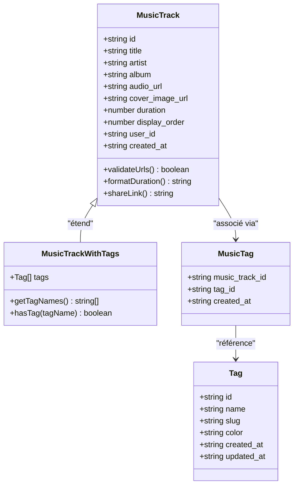
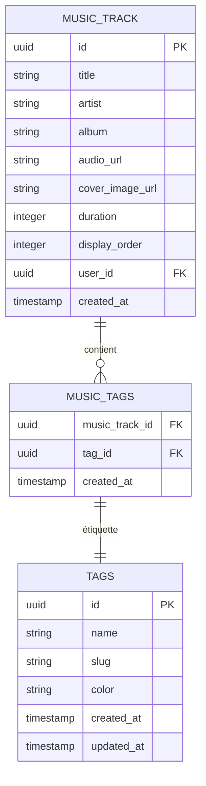
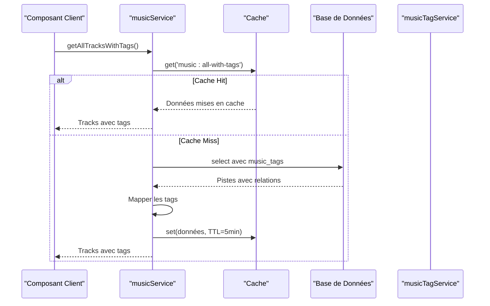

# Modèle MusicTrack

<cite>
**Fichiers Référencés dans ce Document**
- [supabaseClient.ts](file://lib/supabaseClient.ts)
- [musicService.ts](file://services/musicService.ts)
- [musicTagService.ts](file://services/musicTagService.ts)
- [playlistService.ts](file://services/playlistService.ts)
- [AudioPlayer.tsx](file://components/music/AudioPlayer.tsx)
- [TrackList.tsx](file://components/music/TrackList.tsx)
- [audioPlayerStorage.ts](file://lib/audioPlayerStorage.ts)
- [20251106122742_create_audio_storage_bucket.sql](file://supabase/migrations/20251106122742_create_audio_storage_bucket.sql)
- [20251111050910_create_playlists_system.sql](file://supabase/migrations/20251111050910_create_playlists_system.sql)
</cite>

## Table des Matières
1. [Introduction](#introduction)
2. [Structure du Modèle MusicTrack](#structure-du-modèle-musictrack)
3. [Intégration avec le Système de Tags](#intégration-avec-le-système-de-tags)
4. [Modèle Composé MusicTrackWithTags](#modèle-composé-musictrackwithtags)
5. [Services et Patterns d'Utilisation](#services-et-patterns-dutilisation)
6. [Gestion des Performances](#gestion-des-performances)
7. [Patterns d'Insertion et de Mise à Jour](#patterns-dinsertion-et-de-mise-à-jour)
8. [Exemples de Requêtes Supabase](#exemples-de-requêtes-supabase)
9. [Considérations de Stockage Audio](#considérations-de-stockage-audio)
10. [Conclusion](#conclusion)

## Introduction

Le modèle `MusicTrack` constitue le cœur du système de gestion musicale de l'application. Il représente une piste audio avec toutes ses métadonnées essentielles et intègre profondément avec le système de tags et les playlists. Ce modèle est conçu pour supporter une expérience utilisateur fluide tout en maintenant des performances optimales pour le streaming audio et la gestion des collections musicales.

## Structure du Modèle MusicTrack

Le modèle `MusicTrack` définit une structure complète pour représenter une piste audio dans le système :



**Sources du Diagramme**
- [supabaseClient.ts](file://lib/supabaseClient.ts#L28-L39)
- [supabaseClient.ts](file://lib/supabaseClient.ts#L107-L109)

### Propriétés Détaillées

| Propriété | Type | Obligatoire | Description |
|-----------|------|-------------|-------------|
| `id` | string | Oui | Identifiant unique UUID de la piste |
| `title` | string | Oui | Titre de la piste musicale |
| `artist` | string \| null | Non | Nom de l'artiste ou null si inconnu |
| `album` | string \| null | Non | Nom de l'album ou null si inconnu |
| `audio_url` | string | Oui | URL publique vers le fichier audio |
| `cover_image_url` | string \| null | Non | URL de l'image de couverture |
| `duration` | number \| null | Non | Durée en secondes ou null si inconnue |
| `display_order` | number | Oui | Ordre d'affichage dans les listes |
| `user_id` | string \| null | Non | ID de l'utilisateur propriétaire |
| `created_at` | string | Oui | Timestamp de création |

**Sources de Section**
- [supabaseClient.ts](file://lib/supabaseClient.ts#L28-L39)

## Intégration avec le Système de Tags

Le système de tags permet une classification flexible et polyvalente des pistes musicales. Le modèle `MusicTrack` s'intègre étroitement avec le système de tags via la table `music_tags`.



**Sources du Diagramme**
- [supabaseClient.ts](file://lib/supabaseClient.ts#L85-L89)
- [supabaseClient.ts](file://lib/supabaseClient.ts#L53-L60)

### Services de Gestion des Tags

Le service `musicTagService` fournit des fonctionnalités complètes pour gérer les relations entre pistes et tags :

- **Récupération** : Obtenir tous les tags d'une piste spécifique
- **Ajout** : Associer un nouveau tag à une piste
- **Suppression** : Retirer un tag existant
- **Remplacement** : Définir l'ensemble complet de tags pour une piste

**Sources de Section**
- [musicTagService.ts](file://services/musicTagService.ts#L7-L16)
- [musicTagService.ts](file://services/musicTagService.ts#L22-L27)

## Modèle Composé MusicTrackWithTags

Le modèle `MusicTrackWithTags` étend `MusicTrack` en ajoutant une propriété optionnelle `tags` qui contient les informations complètes des tags associés :

```typescript
export type MusicTrackWithTags = MusicTrack & {
  tags?: Tag[];
};
```

Cette structure composite permet :
- **Récupération efficace** : Obtenir une piste avec tous ses tags en une seule requête
- **Navigation enrichie** : Accès direct aux informations de tags sans requêtes supplémentaires
- **Optimisation des performances** : Réduction du nombre de requêtes nécessaires

**Sources de Section**
- [supabaseClient.ts](file://lib/supabaseClient.ts#L107-L109)

## Services et Patterns d'Utilisation

### Pattern de Récupération avec Tags

Le service `musicService` implémente un pattern sophistiqué pour récupérer les pistes avec leurs tags associés :



**Sources du Diagramme**
- [musicService.ts](file://services/musicService.ts#L16-L49)

### Pattern CRUD pour les Pistes

Le service `musicService` implémente des patterns robustes pour les opérations CRUD :

#### Création avec Validation
- **Validation des URLs** : Vérification de la validité des URLs audio et de couverture
- **Authentification** : Vérification de l'utilisateur connecté
- **Rate Limiting** : Prévention des abus
- **Cache Invalidation** : Mise à jour automatique du cache

#### Mise à Jour Sélective
- **Validation conditionnelle** : Validation uniquement des champs modifiés
- **Cache Invalidation** : Automatisation de la synchronisation
- **Gestion d'erreurs** : Retours d'erreur détaillés

**Sources de Section**
- [musicService.ts](file://services/musicService.ts#L72-L190)

## Gestion des Performances

### Stratégies de Cache

Le système implémente plusieurs niveaux de cache pour optimiser les performances :

| Niveau | Type | TTL | Scope |
|--------|------|-----|-------|
| Session | JavaScript | 5 minutes | Données utilisateur |
| Local | localStorage | 30 jours | État du lecteur |
| Base de données | Index | Permanent | Requêtes fréquentes |

### Optimisations de Requête

Les requêtes utilisent des stratégies d'optimisation avancées :

- **Jointures Eager Loading** : Récupération des tags en une seule requête
- **Indexation** : Clés primaires et index secondaires optimisés
- **Pagination** : Gestion efficace des grandes collections

**Sources de Section**
- [musicService.ts](file://services/musicService.ts#L17-L19)
- [audioPlayerStorage.ts](file://lib/audioPlayerStorage.ts#L1-L20)

## Patterns d'Insertion et de Mise à Jour

### Gestion Optionnelle de l'ID

Le modèle supporte deux modes d'utilisation selon le contexte :

#### Mode Création (ID généré)
```typescript
// Lors de la création, l'ID est généré automatiquement
const track: Omit<MusicTrack, 'id' | 'created_at'> = {
  title: 'Titre',
  audio_url: '/storage/path',
  display_order: 0
};
```

#### Mode Mise à Jour (ID fourni)
```typescript
// Lors de la mise à jour, l'ID est obligatoire
const updates: Partial<MusicTrack> = {
  title: 'Nouveau titre',
  duration: 180
};
```

### Gestion du Timestamp

Le champ `created_at` est automatiquement géré :
- **Création** : Timestamp automatique à la création
- **Mise à jour** : Pas de modification automatique
- **Audit** : Traçabilité complète des modifications

**Sources de Section**
- [supabaseClient.ts](file://lib/supabaseClient.ts#L227-L232)

## Exemples de Requêtes Supabase

### Récupération de Toutes les Pistes avec Tags

```sql
SELECT *, 
       music_tags(tag:tags(*))
FROM music_tracks
ORDER BY display_order ASC;
```

**Sources de Section**
- [musicService.ts](file://services/musicService.ts#L27-L32)

### Requête de Création avec Validation

```typescript
const trackWithUser = {
  ...track,
  user_id: user.id
};

const { data, error } = await supabaseClient
  .from('music_tracks')
  .insert(trackWithUser)
  .select()
  .single();
```

**Sources de Section**
- [musicService.ts](file://services/musicService.ts#L128-L131)
- [musicService.ts](file://services/musicService.ts#L160-L164)

### Requête de Mise à Jour Sélective

```typescript
const { data, error } = await supabaseClient
  .from('music_tracks')
  .update(updates)
  .eq('id', id)
  .select()
  .single();
```

**Sources de Section**
- [musicService.ts](file://services/musicService.ts#L233-L239)

## Considérations de Stockage Audio

### Configuration du Bucket Storage

Le système utilise un bucket spécialisé pour les fichiers audio avec des contraintes strictes :

| Paramètre | Valeur | Rôle |
|-----------|--------|------|
| Public | Oui | Accès direct aux fichiers |
| Taille Max | 10MB | Limitation des coûts |
| Types MIME | audio/* | Validation des formats |
| Authentification | Upload/Update/Delete uniquement pour authentifiés | Protection des données |

### Stratégies de Préchargement

Le lecteur audio implémente des stratégies de préchargement intelligentes :

- **Préchargement anticipé** : Chargement des prochaines pistes
- **Cache local** : Stockage temporaire des métadonnées
- **Gestion de la mémoire** : Libération automatique des ressources

**Sources de Section**
- [20251106122742_create_audio_storage_bucket.sql](file://supabase/migrations/20251106122742_create_audio_storage_bucket.sql#L22-L30)
- [AudioPlayer.tsx](file://components/music/AudioPlayer.tsx#L260-L275)

## Conclusion

Le modèle `MusicTrack` représente une solution complète et robuste pour la gestion des pistes musicales dans l'application. Son intégration avec le système de tags offre une flexibilité exceptionnelle pour la classification, tandis que les patterns d'utilisation optimisés garantissent des performances élevées même avec de grandes collections musicales.

Les caractéristiques clés incluent :
- **Flexibilité** : Support de multiples formats et métadonnées
- **Performance** : Cache intelligent et optimisations de requête
- **Sécurité** : Contrôles d'accès et validation des données
- **Extensibilité** : Architecture modulaire pour futurs développements

Cette structure solide forme la fondation technique pour une expérience utilisateur immersive dans la gestion et la découverte musicale.