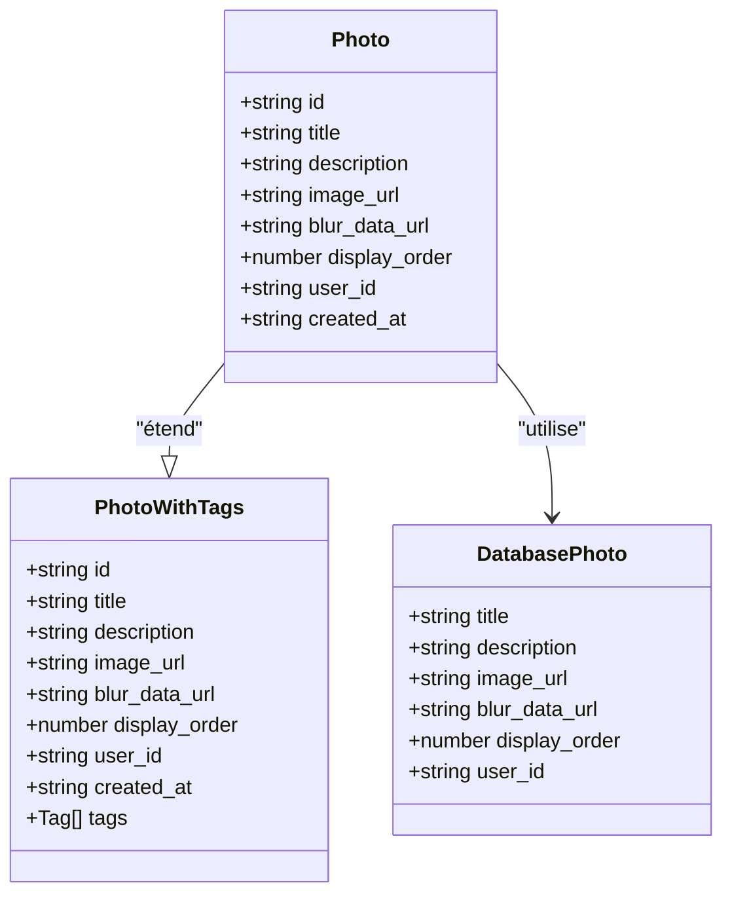
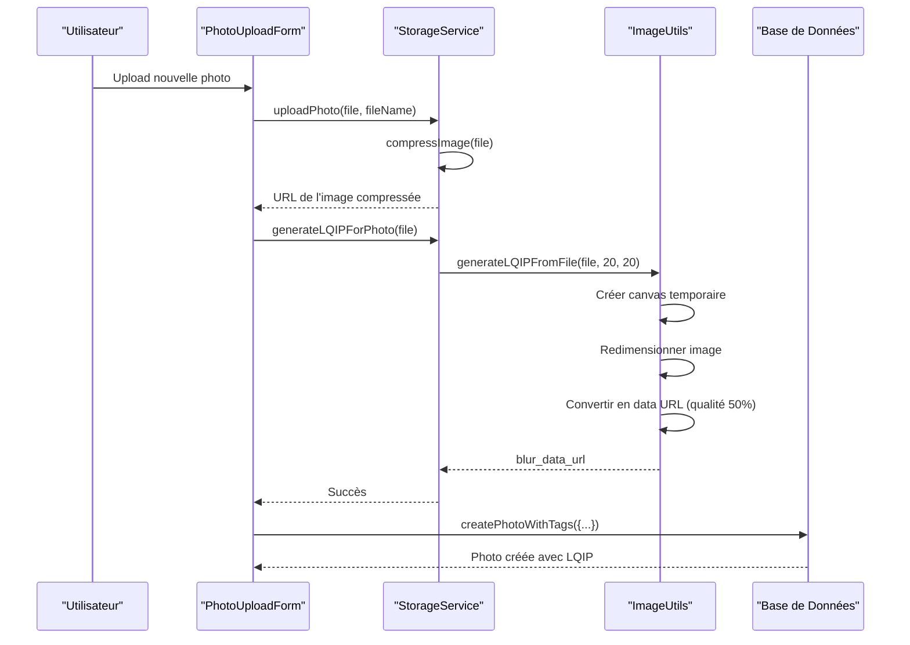
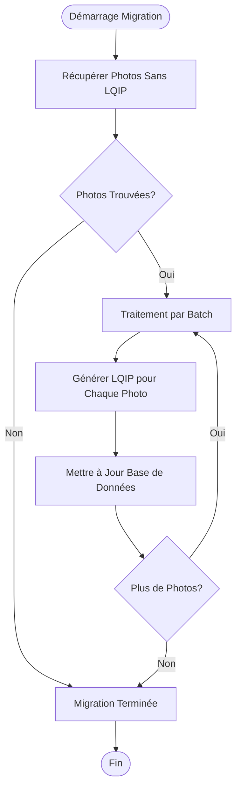
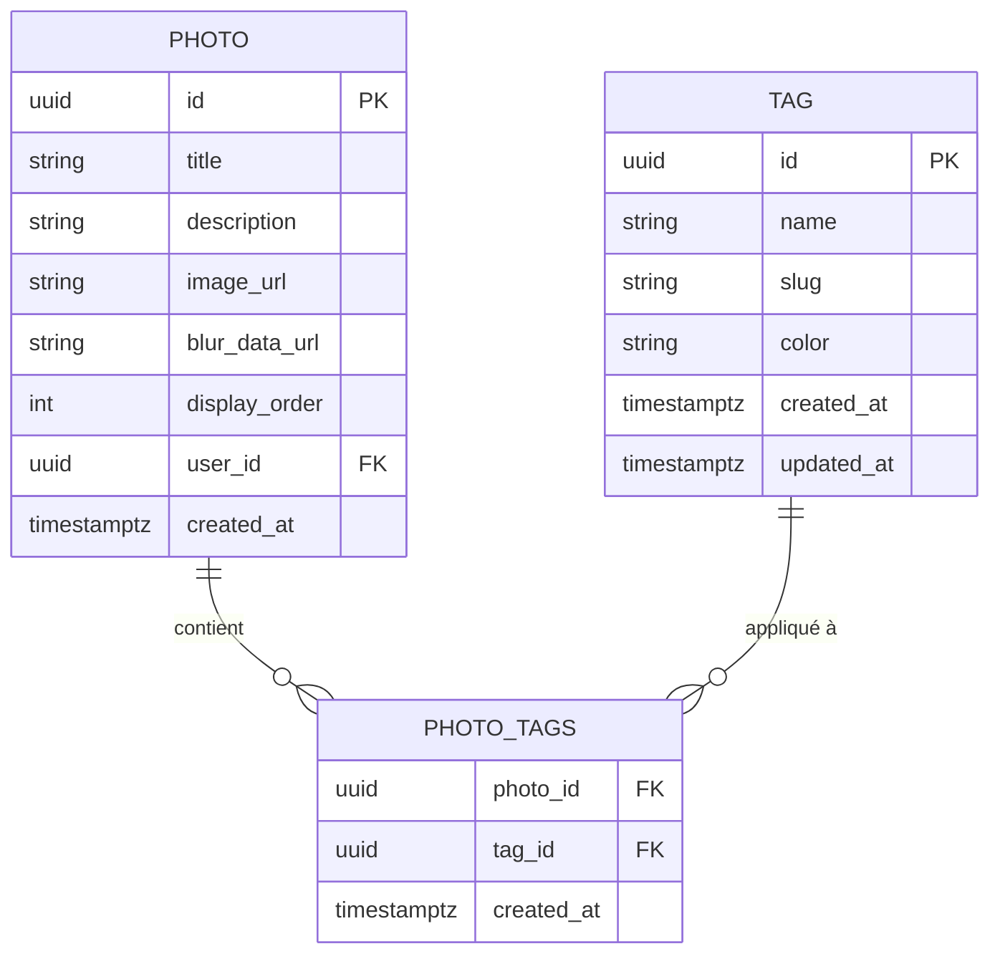

# Modèle de Données Photo

<cite>
**Fichiers Référencés dans ce Document**
- [photoService.ts](file://services/photoService.ts)
- [storageService.ts](file://services/storageService.ts)
- [imageUtils.ts](file://lib/imageUtils.ts)
- [supabaseClient.ts](file://lib/supabaseClient.ts)
- [create_photos_table.sql](file://supabase/migrations/20251105115814_create_photos_table.sql)
- [generate-lqip-for-existing.ts](file://scripts/generate-lqip-for-existing.ts)
- [PhotoUploadForm.tsx](file://components/photos/PhotoUploadForm.tsx)
- [PhotoEditDialog.tsx](file://components/photos/PhotoEditDialog.tsx)
- [OptimizedImage.tsx](file://components/OptimizedImage.tsx)
- [PhotoTagService.ts](file://services/photoTagService.ts)
</cite>

## Table des Matières
1. [Introduction](#introduction)
2. [Structure du Modèle Photo](#structure-du-modèle-photo)
3. [Propriétés du Modèle Photo](#propriétés-du-modèle-photo)
4. [Système LQIP (Low-Quality Image Placeholder)](#système-lqip-low-quality-image-placeholder)
5. [Relations avec les Tags](#relations-avec-les-tags)
6. [Services et Utilisation](#services-et-utilisation)
7. [Contraintes de Base de Données](#contraintes-de-base-de-données)
8. [Bonnes Pratiques](#bonnes-pratiques)
9. [Exemples d'Utilisation](#exemples-dutilisation)
10. [Conclusion](#conclusion)

## Introduction

Le modèle de données Photo constitue le cœur du système de gestion des galeries photographiques dans cette application Next.js. Il implémente une architecture robuste basée sur Supabase avec des fonctionnalités avancées comme le Lazy Loading, le système LQIP (Low-Quality Image Placeholder), et une gestion sophistiquée des tags. Ce modèle est conçu pour optimiser les performances tout en offrant une expérience utilisateur fluide et réactive.

## Structure du Modèle Photo

Le modèle Photo suit une approche modulaire avec séparation claire entre les types TypeScript et les entités de base de données. La structure comprend trois couches principales :



**Sources du Diagramme**
- [supabaseClient.ts](file://lib/supabaseClient.ts#L18-L26)
- [supabaseClient.ts](file://lib/supabaseClient.ts#L116-L118)

**Sources de Section**
- [supabaseClient.ts](file://lib/supabaseClient.ts#L18-L26)
- [supabaseClient.ts](file://lib/supabaseClient.ts#L116-L118)

## Propriétés du Modèle Photo

### 1. id (string)
- **Type TypeScript** : `string`
- **Signification métier** : Identifiant unique UUID de la photo
- **Contraintes** : Clé primaire auto-générée, obligatoire
- **Implémentation** : Utilise `gen_random_uuid()` dans PostgreSQL

### 2. title (string)
- **Type TypeScript** : `string`
- **Signification métier** : Titre de la photo visible par les utilisateurs
- **Contraintes** : Non-null, obligatoire
- **Utilisation** : Utilisé comme texte alternatif pour l'accessibilité

### 3. description (string | null)
- **Type TypeScript** : `string | null`
- **Signification métier** : Description détaillée de la photo
- **Contraintes** : Optionnel, nullable
- **Utilisation** : Informations supplémentaires pour les métadonnées SEO

### 4. image_url (string)
- **Type TypeScript** : `string`
- **Signification métier** : URL publique de l'image dans le bucket Supabase Storage
- **Contraintes** : Non-null, obligatoire
- **Format** : `{SUPABASE_URL}/storage/v1/object/public/photo-files/{filename}`
- **Validation** : Vérifiée par `validateMediaUrl` avant insertion

### 5. blur_data_url (string | null)
- **Type TypeScript** : `string | null`
- **Signification métier** : Data URL du placeholder flou (LQIP) pour le Lazy Loading
- **Contraintes** : Optionnel, nullable
- **Rôle** : Améliore l'expérience utilisateur en fournissant un placeholder immédiat

### 6. display_order (number)
- **Type TypeScript** : `number`
- **Significance métier** : Ordre d'affichage personnalisé dans la galerie
- **Contraintes** : Non-null, obligatoire, valeur par défaut = 0
- **Indexation** : Indexé pour optimiser les requêtes de tri

### 7. user_id (string | null)
- **Type TypeScript** : `string | null`
- **Signification métier** : Identifiant de l'utilisateur ayant uploadé la photo
- **Contraintes** : Optionnel, nullable
- **Sécurité** : Contrôlée par les politiques RLS de Supabase

### 8. created_at (string)
- **Type TypeScript** : `string`
- **Signification métier** : Timestamp de création de l'enregistrement
- **Contraintes** : Auto-généré, non-modifiable
- **Format** : ISO 8601 (timestamptz)

**Sources de Section**
- [supabaseClient.ts](file://lib/supabaseClient.ts#L18-L26)
- [create_photos_table.sql](file://supabase\migrations\20251105115814_create_photos_table.sql#L25-L32)

## Système LQIP (Low-Quality Image Placeholder)

Le système LQIP représente une innovation majeure dans l'optimisation des performances de chargement des images. Il transforme l'expérience utilisateur en fournissant un placeholder visuellement attrayant pendant le chargement des images haute résolution.

### Fonctionnement Technique



**Sources du Diagramme**
- [PhotoUploadForm.tsx](file://components/photos/PhotoUploadForm.tsx#L156-L158)
- [storageService.ts](file://services/storageService.ts#L57-L65)
- [imageUtils.ts](file://lib/imageUtils.ts#L62-L112)

### Génération du LQIP

La génération du LQIP utilise l'API Canvas pour créer un placeholder optimisé :

#### Caractéristiques Techniques :
- **Dimensions** : 20x20 pixels (réglable)
- **Qualité** : 50% (compromis optimal entre taille et qualité)
- **Format** : JPEG avec compression légère
- **Taille** : ~1-2KB environ

#### Avantages du LQIP :
1. **Amélioration UX** : Placeholder visuellement cohérent
2. **Réduction du FOUC** : Évite le flash blanc/d'absence
3. **Optimisation bande passante** : Très faible poids
4. **Compatibilité** : Fonctionne sur tous les navigateurs modernes

### Migration LQIP Existante

Un script de migration automatisé permet de générer des LQIP pour les images existantes :



**Sources du Diagramme**
- [generate-lqip-for-existing.ts](file://scripts/generate-lqip-for-existing.ts#L34-L71)

**Sources de Section**
- [imageUtils.ts](file://lib/imageUtils.ts#L1-L112)
- [storageService.ts](file://services/storageService.ts#L57-L65)
- [generate-lqip-for-existing.ts](file://scripts/generate-lqip-for-existing.ts#L1-L104)

## Relations avec les Tags

Le système de tags permet une classification flexible et une recherche avancée des photos. Il s'agit d'un modèle Many-to-Many implémenté via une table pivot.

### Architecture des Tags



**Sources du Diagramme**
- [supabaseClient.ts](file://lib/supabaseClient.ts#L97-L101)
- [supabaseClient.ts](file://lib/supabaseClient.ts#L116-L118)

### Modèle PhotoWithTags

Le type `PhotoWithTags` étend le modèle Photo de base pour inclure les tags associés :

```typescript
export type PhotoWithTags = Photo & {
  tags?: Tag[];
};
```

### Services de Gestion des Tags

Le service `photoTagService` fournit des méthodes CRUD pour la gestion des relations photo-tags :

#### Opérations Disponibles :
- **getTagsForPhoto** : Récupère tous les tags d'une photo
- **addTagToPhoto** : Ajoute un tag à une photo
- **removeTagFromPhoto** : Retire un tag d'une photo
- **setTagsForPhoto** : Définit l'ensemble des tags (remplacement complet)

**Sources de Section**
- [PhotoTagService.ts](file://services/photoTagService.ts#L1-L105)
- [supabaseClient.ts](file://lib/supabaseClient.ts#L97-L101)
- [supabaseClient.ts](file://lib/supabaseClient.ts#L116-L118)

## Services et Utilisation

### PhotoService

Le service principal `photoService` orchestre toutes les opérations CRUD sur les photos avec validation et cache.

#### Méthodes Principales :

##### 1. Création de Photos
```typescript
async createPhoto(photo: {
  title: string;
  description: string | null;
  image_url: string;
  blur_data_url?: string | null;
  display_order: number;
  user_id?: string | null;
})
```

##### 2. Lecture de Photos
- `getAllPhotos()` : Récupère toutes les photos triées par ordre d'affichage
- `getAllPhotosWithTags()` : Photos avec leurs tags associés (avec cache)
- `getPhotoById(id: string)` : Récupère une photo spécifique

##### 3. Mise à Jour
- `updatePhoto(id: string, updates: Partial<Photo>)` : Met à jour partiellement une photo
- `updateDisplayOrder(id: string, display_order: number)` : Modifie l'ordre d'affichage

##### 4. Suppression
- `deletePhoto(id: string)` : Supprime une photo

##### 5. Création Avancée
- `createPhotoWithTags(photoData, tagIds)` : Crée une photo avec ses tags associés

### StorageService

Le service `storageService` gère l'upload et la manipulation des fichiers images avec compression automatique.

#### Fonctionnalités :
- **Compression** : Réduction automatique de la taille des images
- **Génération LQIP** : Création de placeholders pour optimisation
- **Gestion des URLs** : Construction et validation des URLs publiques

**Sources de Section**
- [photoService.ts](file://services/photoService.ts#L7-L221)
- [storageService.ts](file://services/storageService.ts#L37-L310)

## Contraintes de Base de Données

### Structure SQL de la Table Photos

La table `photos` suit une conception optimisée pour les performances et la sécurité :

```sql
CREATE TABLE IF NOT EXISTS photos (
  id uuid PRIMARY KEY DEFAULT gen_random_uuid(),
  title text NOT NULL,
  description text,
  image_url text NOT NULL,
  display_order integer NOT NULL DEFAULT 0,
  created_at timestamptz DEFAULT now()
);
```

### Contraintes et Index

#### Contraintes de Base de Données :
- **id** : UUID auto-généré, clé primaire
- **title** : Texte non-nul, obligatoire
- **description** : Texte nullable
- **image_url** : Texte non-nul, URL valide requise
- **display_order** : Entier non-nul, valeur par défaut = 0
- **created_at** : Timestamp auto-généré

#### Index Optimisés :
- `photos_display_order_idx` : Sur `display_order` pour les requêtes de tri
- `photos_created_at_idx` : Sur `created_at` pour les requêtes chronologiques

### Politiques de Sécurité (RLS)

```sql
-- Lecture publique pour tous les utilisateurs
CREATE POLICY "Lecture publique des photos"
  ON photos FOR SELECT
  TO anon, authenticated
  USING (true);

-- Insertion réservée aux utilisateurs authentifiés
CREATE POLICY "Insertion réservée aux authentifiés"
  ON photos FOR INSERT
  TO authenticated
  WITH CHECK (true);

-- Mise à jour et suppression réservées aux utilisateurs authentifiés
CREATE POLICY "Mise à jour réservée aux authentifiés"
  ON photos FOR UPDATE
  TO authenticated
  USING (true)
  WITH CHECK (true);
```

### Différences avec Database Type

Le type `Database` dans Supabase exclut certaines propriétés pour des raisons de sécurité et de performance :

#### Propriétés Exclues :
- **id** : Auto-généré, ne peut pas être spécifié lors de l'insertion
- **created_at** : Auto-généré, ne peut pas être modifié
- **user_id** : Géré automatiquement par l'authentification

#### Implications :
```typescript
// Dans Database, on ne spécifie que :
interface DatabasePhoto {
  title: string;
  description: string | null;
  image_url: string;
  blur_data_url: string | null;
  display_order: number;
  // user_id est géré automatiquement
}
```

**Sources de Section**
- [create_photos_table.sql](file://supabase\migrations\20251105115814_create_photos_table.sql#L25-L63)
- [photoService.ts](file://services/photoService.ts#L73-L124)

## Bonnes Pratiques

### Upload d'Images

#### Compression Automatique
Le système implémente une compression intelligente avec les paramètres optimisés :

```typescript
const compressionOptions = {
  maxSizeMB: 1,           // Taille maximale recommandée
  maxWidthOrHeight: 1920, // Maintien de la qualité
  useWebWorker: true,     // Thread principal non-bloqué
  fileType: 'image/jpeg', // Format optimisé
  initialQuality: 0.85    // Qualité équilibrée
};
```

#### Validation Multi-niveaux
1. **Taille** : Limite à 5MB
2. **Type MIME** : Vérification des signatures de fichiers
3. **URL** : Validation par `validateMediaUrl`

### Génération LQIP

#### Optimisations Recommandées :
- **Dimensions** : 20x20 pixels suffisant pour la plupart des cas
- **Qualité** : 50% offre le meilleur compromis taille/performance
- **Format** : JPEG pour les meilleures performances de compression

#### Gestion d'Erreurs :
```typescript
try {
  const blurDataUrl = await generateLQIPForPhoto(file);
  // Utiliser blurDataUrl ou fallback
} catch (error) {
  console.warn('LQIP generation failed, using fallback');
  // Continuer sans LQIP
}
```

### Performance et Cache

#### Stratégies de Cache :
- **Cache Session** : 5 minutes pour les données fréquemment consultées
- **Invalidation** : Automatique après modification
- **Clés** : `'photos:all-with-tags'` pour les requêtes complexes

#### Optimisations Frontend :
- **Lazy Loading** : Images chargées uniquement lors de l'intersection
- **Placeholder Flou** : Amélioration de l'expérience utilisateur
- **Progressive Enhancement** : Fallbacks appropriés

**Sources de Section**
- [storageService.ts](file://services/storageService.ts#L14-L35)
- [PhotoUploadForm.tsx](file://components/photos/PhotoUploadForm.tsx#L62-L76)
- [photoService.ts](file://services/photoService.ts#L18-L25)

## Exemples d'Utilisation

### Création d'une Photo avec Tags

```typescript
// Exemple d'utilisation dans PhotoUploadForm
const handleSubmit = async (e: React.FormEvent) => {
  e.preventDefault();
  
  try {
    // Génération du LQIP
    const blurDataUrl = await storageService.generateLQIPForPhoto(file);
    
    // Création de la photo avec tags
    const { photo, error } = await photoService.createPhotoWithTags({
      title: title.trim(),
      description: description.trim() || null,
      image_url: publicUrl,
      blur_data_url: blurDataUrl,
      display_order: nextOrder,
    }, selectedTagIds);
    
    if (error) throw error;
    
    // Succès
    toast.success('Photo ajoutée');
  } catch (error) {
    // Gestion d'erreur
    toast.error('Erreur lors de l\'upload');
  }
};
```

### Mise à Jour d'une Photo

```typescript
// Exemple d'utilisation dans PhotoEditDialog
const handleSubmit = async (e: React.FormEvent) => {
  e.preventDefault();
  
  try {
    // Mise à jour des informations de base
    const { error: updateError } = await photoService.updatePhoto(photo.id, {
      title: title.trim(),
      description: description.trim() || null,
    });
    
    if (updateError) throw updateError;
    
    // Mise à jour des tags (optionnel)
    const { error: tagsError } = await photoTagService.setTagsForPhoto(
      photo.id,
      selectedTagIds
    );
    
    if (tagsError) {
      // Gestion d'erreur optionnelle
      console.warn('Tags non mis à jour');
    }
    
    toast.success('Photo modifiée');
  } catch (error) {
    // Gestion d'erreur
  }
};
```

### Récupération de Photos avec Tags

```typescript
// Exemple d'utilisation dans PhotoGrid
const loadPhotos = async () => {
  const { photos, error } = await photoService.getAllPhotosWithTags();
  
  if (error) {
    console.error('Erreur lors du chargement:', error);
    return;
  }
  
  // Les photos incluent maintenant leurs tags
  setPhotoGrid(photos);
};
```

**Sources de Section**
- [PhotoUploadForm.tsx](file://components/photos/PhotoUploadForm.tsx#L159-L170)
- [PhotoEditDialog.tsx](file://components/photos/PhotoEditDialog.tsx#L110-L129)
- [photoService.ts](file://services/photoService.ts#L17-L49)

## Conclusion

Le modèle de données Photo représente une solution complète et optimisée pour la gestion des galeries photographiques dans une application moderne. Ses caractéristiques principales incluent :

### Points Forts :
1. **Architecture Modulaire** : Séparation claire entre types TypeScript et base de données
2. **Optimisation des Performances** : Système LQIP améliorant significativement l'UX
3. **Flexibilité** : Système de tags permettant une classification avancée
4. **Sécurité** : Politiques RLS robustes et validation multi-niveaux
5. **Scalabilité** : Index optimisés et cache intelligent

### Recommandations Futures :
- **Intégration IA** : Possibilité d'ajouter des métadonnées générées par IA
- **Formats Avancés** : Support des formats WebP et AVIF
- **Analytics** : Suivi des performances de chargement des images
- **Compression Adaptive** : Ajustement automatique de la qualité selon le réseau

Cette architecture solide constitue une base solide pour l'évolution future de la fonctionnalité de galerie photographique, tout en maintenant les standards de performance et d'expérience utilisateur élevés.