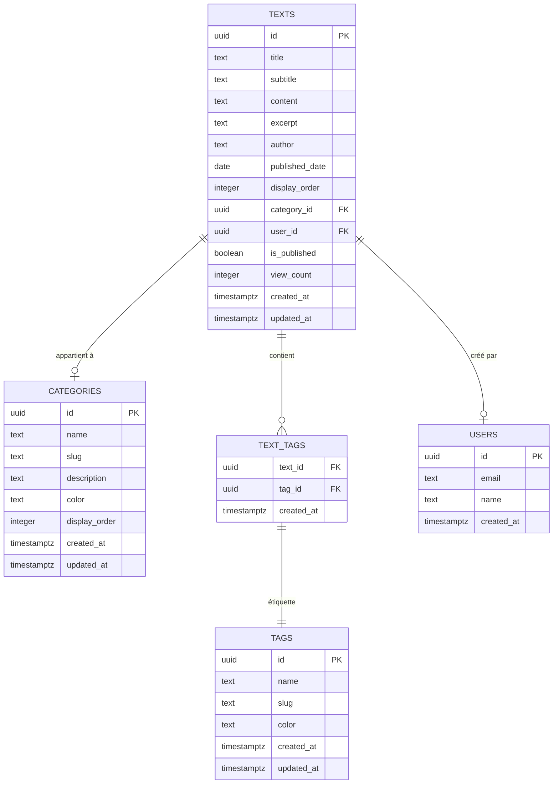
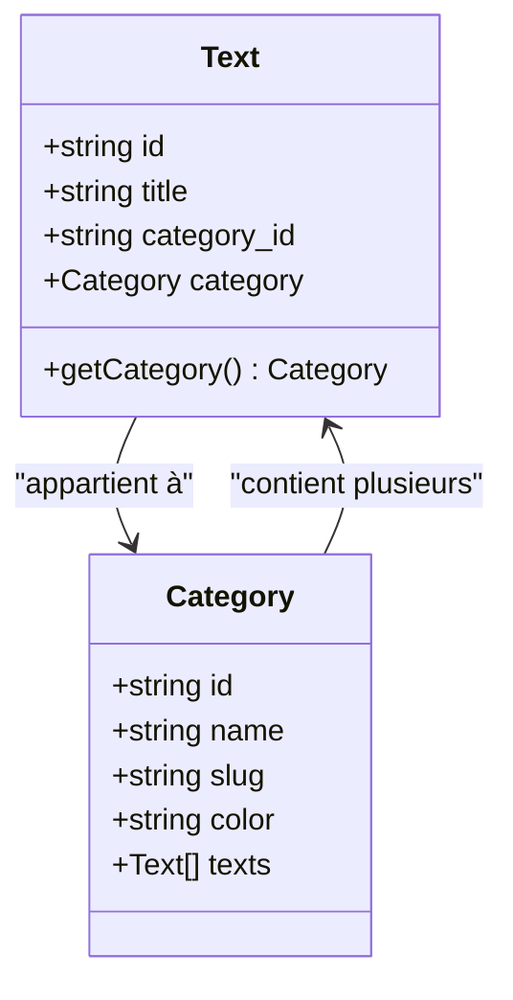
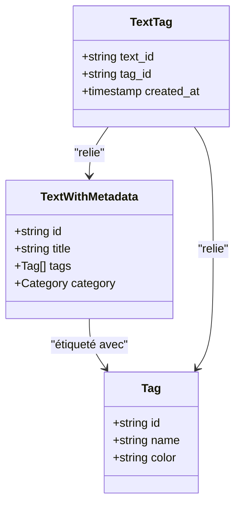
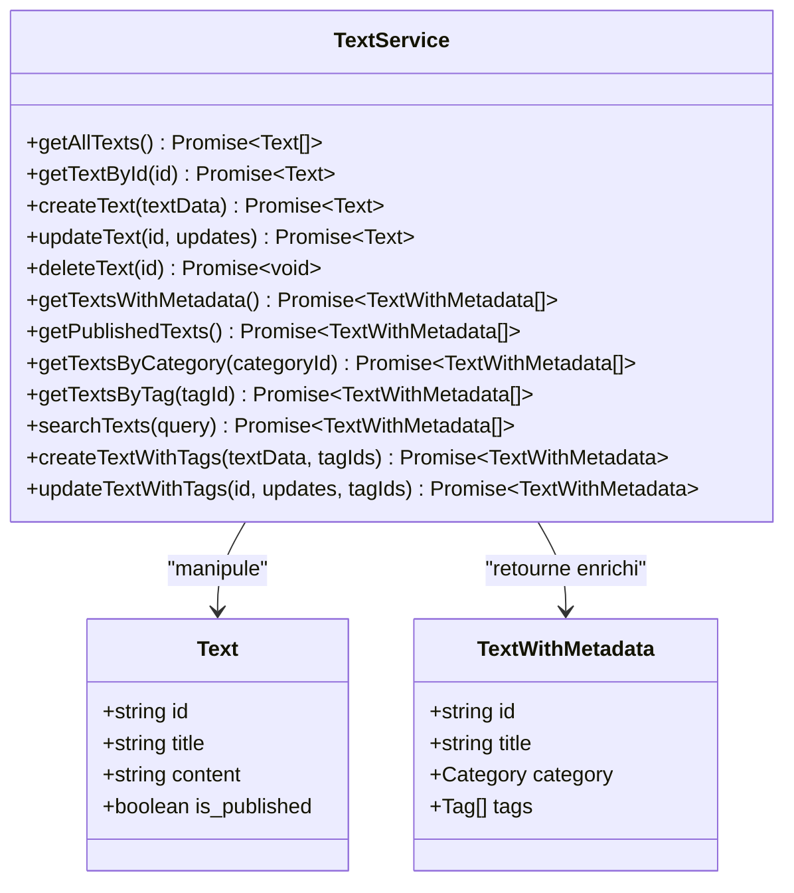
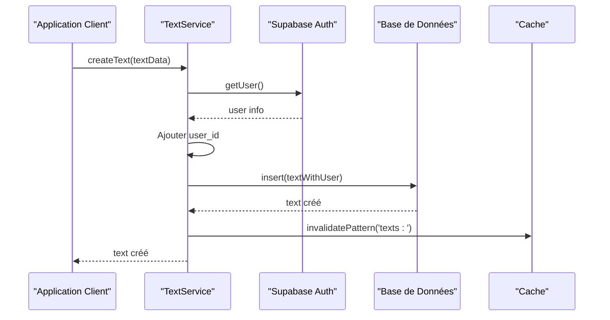
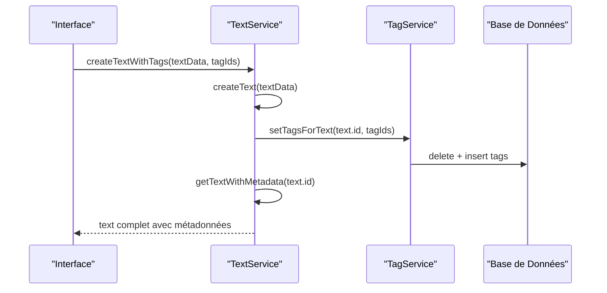
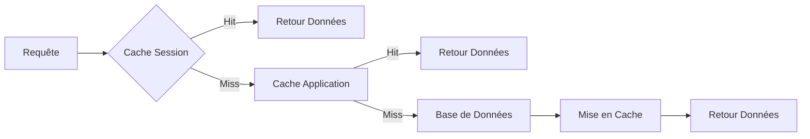

# Modèle Text

<cite>
**Fichiers Référencés dans ce Document**
- [textService.ts](file://services/textService.ts)
- [supabaseClient.ts](file://lib/supabaseClient.ts)
- [20250107_create_texts_system.sql](file://supabase/migrations/20250107_create_texts_system.sql)
- [20250107_create_texts_system_v2.sql](file://supabase/migrations/20250107_create_texts_system_v2.sql)
- [TextUploadForm.tsx](file://components/texts/TextUploadForm.tsx)
- [TextEditModal.tsx](file://components/texts/TextEditModal.tsx)
- [tagService.ts](file://services/tagService.ts)
- [TextListAdmin.tsx](file://components/texts/TextListAdmin.tsx)
</cite>

## Table des Matières
1. [Introduction](#introduction)
2. [Structure du Modèle Text](#structure-du-modèle-text)
3. [Propriétés Détaillées](#propriétés-détaillées)
4. [Relations avec les Autres Modèles](#relations-avec-les-autres-modèles)
5. [Services et Patterns d'Utilisation](#services-et-patterns-dutilisation)
6. [Gestion des Timestamps Automatiques](#gestion-des-timestamps-automatiques)
7. [Sécurité et Contraintes RLS](#sécurité-et-contraintes-rls)
8. [Exemples de Requêtes Complexes](#exemples-de-requêtes-complexes)
9. [Considérations de Sécurité](#considérations-de-sécurité)
10. [Optimisations et Performance](#optimisations-et-performance)

## Introduction

Le modèle Text constitue le cœur du système de contenu de cette application portfolio. Il permet la gestion de publications textuelles structurées avec support Markdown, intégrant des fonctionnalités avancées de catégorisation, tagging, et recherche full-text. Le modèle est conçu pour supporter un système de blog moderne avec des contrôles d'accès robustes et des optimisations de performance.

## Structure du Modèle Text

Le modèle Text est défini dans la base de données comme suit :



**Sources du diagramme**
- [20250107_create_texts_system.sql](file://supabase/migrations/20250107_create_texts_system.sql#L61-L76)
- [supabaseClient.ts](file://lib/supabaseClient.ts#L62-L76)

**Sources de section**
- [20250107_create_texts_system.sql](file://supabase/migrations/20250107_create_texts_system.sql#L61-L76)
- [supabaseClient.ts](file://lib/supabaseClient.ts#L62-L76)

## Propriétés Détaillées

### Identifiant et Métadonnées Fondamentales

#### `id` (UUID)
- **Type** : UUID
- **Contrainte** : Clé primaire, auto-généré
- **Importance** : Point d'identification unique pour chaque texte
- **Utilisation** : Référence dans les relations avec les tags et les catégories

#### `title` (Texte)
- **Type** : Texte
- **Contrainte** : Non-null
- **Longueur** : Maximum 255 caractères
- **Importance** : Titre principal du contenu, utilisé dans les listes et les métadonnées SEO
- **Validation** : Requis pour toute création de texte

#### `subtitle` (Texte)
- **Type** : Texte
- **Contrainte** : Nullable
- **Longueur** : Maximum 300 caractères
- **Importance** : Sous-titre optionnel pour enrichir la présentation
- **Utilisation** : Affichage dans les cartes de texte et les résumés

#### `content` (Texte)
- **Type** : Texte
- **Contrainte** : Non-null
- **Longueur** : Maximum 50 000 caractères
- **Importance** : Contenu principal au format Markdown
- **Traitement** : Rendu dynamique avec composant MarkdownRenderer
- **Validation** : Requis pour toute publication

### Informations de Publication

#### `excerpt` (Texte)
- **Type** : Texte
- **Contrainte** : Nullable
- **Longueur** : Maximum 500 caractères
- **Importance** : Résumé court pour les listes et les métadonnées
- **Utilisation** : Prévisualisation dans les cartes de texte

#### `author` (Texte)
- **Type** : Texte
- **Contrainte** : Nullable
- **Longueur** : Maximum 100 caractères
- **Importance** : Attribution de l'auteur
- **Utilisation** : Affichage dans les métadonnées du texte

#### `published_date` (Date)
- **Type** : Date
- **Contrainte** : Nullable
- **Importance** : Date de publication officielle
- **Utilisation** : Tri chronologique et archivage

### Organisation et Visibilité

#### `display_order` (Entier)
- **Type** : Entier
- **Contrainte** : Non-null, valeur par défaut 0
- **Importance** : Ordre de présentation personnalisable
- **Utilisation** : Contrôle de l'ordre d'affichage dans les listes
- **Gestion** : Automatique lors de la création (max + 1)

#### `category_id` (UUID)
- **Type** : UUID
- **Contrainte** : Nullable, référence vers categories.id
- **Importance** : Classification hiérarchique
- **Relation** : Many-to-One avec la table categories
- **Effet** : SET NULL en cas de suppression de catégorie

#### `is_published` (Booléen)
- **Type** : Booléen
- **Contrainte** : Valeur par défaut false
- **Importance** : Contrôle de visibilité publique
- **Utilisation** : Filtrage des contenus publics vs privés
- **Sécurité** : RLS empêche l'accès aux contenus non publiés sauf au propriétaire

#### `view_count` (Entier)
- **Type** : Entier
- **Contrainte** : Valeur par défaut 0
- **Importance** : Statistique de popularité
- **Utilisation** : Analytics et recommandations

### Métadonnées de Gestion

#### `user_id` (UUID)
- **Type** : UUID
- **Contrainte** : Non-null, référence vers auth.users(id)
- **Importance** : Attribution propriétaire
- **Sécurité** : Utilisé pour les politiques RLS
- **Relation** : CASCADE en cas de suppression d'utilisateur

#### `created_at` (Timestamp)
- **Type** : TimestampTZ
- **Contrainte** : Auto-généré
- **Importance** : Audit et tri chronologique
- **Gestion** : Automatique via trigger

#### `updated_at` (Timestamp)
- **Type** : TimestampTZ
- **Contrainte** : Auto-généré
- **Importance** : Suivi des modifications
- **Gestion** : Automatique via trigger

**Sources de section**
- [20250107_create_texts_system.sql](file://supabase/migrations/20250107_create_texts_system.sql#L61-L76)
- [supabaseClient.ts](file://lib/supabaseClient.ts#L62-L76)

## Relations avec les Autres Modèles

### Relation avec Category

La relation entre Text et Category est une association many-to-one :



**Sources du diagramme**
- [20250107_create_texts_system.sql](file://supabase/migrations/20250107_create_texts_system.sql#L70-L71)
- [supabaseClient.ts](file://lib/supabaseClient.ts#L42-L51)

#### Caractéristiques de la Relation
- **Type** : Many-to-One (un texte peut avoir une catégorie, une catégorie peut avoir plusieurs textes)
- **Contrainte** : FOREIGN KEY avec ON DELETE SET NULL
- **Index** : idx_texts_category_id pour les performances
- **Nullable** : La catégorie est optionnelle

### Relation avec Tag via TextWithMetadata

La relation avec Tag se fait via la table de jointure text_tags :



**Sources du diagramme**
- [supabaseClient.ts](file://lib/supabaseClient.ts#L103-L106)
- [20250107_create_texts_system.sql](file://supabase/migrations/20250107_create_texts_system.sql#L99-L104)

#### Structure de la Table de Jointure
- **text_id** : UUID, clé étrangère vers texts.id, CASCADE ON DELETE
- **tag_id** : UUID, clé étrangère vers tags.id, CASCADE ON DELETE
- **created_at** : TimestampTZ, auto-généré
- **Clé primaire** : Composite (text_id, tag_id)

**Sources de section**
- [20250107_create_texts_system.sql](file://supabase/migrations/20250107_create_texts_system.sql#L70-L71)
- [20250107_create_texts_system.sql](file://supabase/migrations/20250107_create_texts_system.sql#L99-L104)
- [supabaseClient.ts](file://lib/supabaseClient.ts#L103-L106)

## Services et Patterns d'Utilisation

### TextService - Interface Principale

Le service TextService fournit une API complète pour la gestion des textes :



**Sources du diagramme**
- [textService.ts](file://services/textService.ts#L8-L385)

### Patterns d'Insertion et de Mise à Jour

#### Pattern d'Insertion Standard
Le service implémente un pattern sécurisé pour l'ajout de textes :



**Sources du diagramme**
- [textService.ts](file://services/textService.ts#L39-L117)

#### Pattern de Mise à Jour avec Tags
Pour les opérations complexes incluant les tags :



**Sources du diagramme**
- [textService.ts](file://services/textService.ts#L328-L383)

### Gestion des Erreurs et Validation

Le service implémente une gestion robuste des erreurs :

- **Validation côté client** : Via Zod schemas
- **Validation côté serveur** : Via Supabase RLS
- **Gestion d'erreurs** : Logging complet avec codes d'erreur
- **Rollback automatique** : Transactions en cas d'échec

**Sources de section**
- [textService.ts](file://services/textService.ts#L8-L385)
- [TextUploadForm.tsx](file://components/texts/TextUploadForm.tsx#L90-L145)
- [TextEditModal.tsx](file://components/texts/TextEditModal.tsx#L100-L150)

## Gestion des Timestamps Automatiques

### Trigger de Mise à Jour Automatique

Le système utilise un trigger PostgreSQL pour gérer automatiquement les timestamps :

```sql
-- Trigger pour texts
CREATE TRIGGER update_texts_updated_at
  BEFORE UPDATE ON texts
  FOR EACH ROW
  EXECUTE FUNCTION update_updated_at_column();

-- Fonction de mise à jour
CREATE OR REPLACE FUNCTION update_updated_at_column()
RETURNS TRIGGER AS $$
BEGIN
  NEW.updated_at = now();
  RETURN NEW;
END;
$$ LANGUAGE plpgsql;
```

### Comportements de Timestamp

#### created_at
- **Génération automatique** : DEFAULT now()
- **Moment** : Lors de l'insertion initiale
- **Format** : TIMESTAMPTZ (timezone-aware)
- **Usage** : Tri chronologique, statistiques

#### updated_at
- **Génération automatique** : Avant chaque UPDATE
- **Moment** : Juste avant la modification
- **Format** : TIMESTAMPTZ
- **Usage** : Suivi des modifications, cache invalidation

### Impact sur les Performances

Les triggers sont optimisés pour minimiser l'impact :
- **Compilation** : PL/pgSQL native
- **Index** : idx_texts_created_at pour les performances
- **Cache** : Invalidation sélective basée sur les timestamps

**Sources de section**
- [20250107_create_texts_system.sql](file://supabase/migrations/20250107_create_texts_system.sql#L91-L95)
- [20250107_create_texts_system_v2.sql](file://supabase/migrations/20250107_create_texts_system_v2.sql#L178-L182)

## Sécurité et Contraintes RLS

### Politiques Row Level Security (RLS)

Le système implémente des politiques RLS strictes :

```mermaid
flowchart TD
A[Requête SQL] --> B{Politique SELECT}
B --> |is_published = true| C[Lecture Publique]
B --> |auth.uid() = user_id| D[Lecture Privée]
B --> |Non autorisé| E[Accès Refusé]
F[Requête INSERT] --> G{Authentification}
G --> |Authenticated| H{Contrôle Owner}
H --> |user_id = auth.uid()| I[Autorisé]
H --> |Non Owner| J[Refusé]
G --> |Anonyme| K[Refusé]
L[Requête UPDATE/DELETE] --> M{Contrôle Owner}
M --> |user_id = auth.uid()| N[Autorisé]
M --> |Autre| O[Refusé]
```

**Sources du diagramme**
- [20250107_create_texts_system.sql](file://supabase/migrations/20250107_create_texts_system.sql#L168-L191)

### Politiques de Sécurité Détaillées

#### Politiques de Lecture
- **Textes publiés** : Tout le monde peut lire (`is_published = true`)
- **Textes privés** : Seul le propriétaire peut lire (`auth.uid() = user_id`)
- **Catégories** : Lecture publique pour tous
- **Tags** : Lecture publique pour tous

#### Politiques d'Écriture
- **Création** : Utilisateurs authentifiés uniquement
- **Modification** : Seul le propriétaire
- **Suppression** : Seul le propriétaire
- **Gestion des tags** : Contrôle par policy complexe

### Contraintes de Base de Données

#### Contraintes Intégrité
- **Clés primaires** : UUID auto-générés
- **Clés étrangères** : CASCADE et SET NULL appropriés
- **Unicité** : Slugs uniques pour categories et tags
- **Validation** : Longueurs et formats contraints

#### Indexation pour Performance
- **idx_texts_category_id** : Pour les filtres par catégorie
- **idx_texts_user_id** : Pour les requêtes propriétaires
- **idx_texts_is_published** : Pour les lectures publiques
- **idx_texts_search** : Pour la recherche full-text

**Sources de section**
- [20250107_create_texts_system.sql](file://supabase/migrations/20250107_create_texts_system.sql#L168-L191)
- [20250107_create_texts_system.sql](file://supabase/migrations/20250107_create_texts_system.sql#L79-L85)

## Exemples de Requêtes Complexes

### Requête de Base avec Métadonnées

```sql
SELECT 
    t.id,
    t.title,
    t.subtitle,
    t.content,
    t.excerpt,
    t.author,
    t.published_date,
    t.display_order,
    t.is_published,
    t.view_count,
    t.created_at,
    t.updated_at,
    c.id AS category_id,
    c.name AS category_name,
    c.slug AS category_slug,
    c.color AS category_color,
    COALESCE(
        json_agg(
            json_build_object(
                'id', tg.id,
                'name', tg.name,
                'slug', tg.slug,
                'color', tg.color
            )
        ) FILTER (WHERE tg.id IS NOT NULL),
        '[]'
    ) AS tags
FROM texts t
LEFT JOIN categories c ON t.category_id = c.id
LEFT JOIN text_tags tt ON t.id = tt.text_id
LEFT JOIN tags tg ON tt.tag_id = tg.id
GROUP BY t.id, c.id, c.name, c.slug, c.color
ORDER BY t.display_order ASC;
```

### Requête de Recherche Full-Text

```sql
SELECT *
FROM texts
WHERE is_published = true
AND to_tsvector('french', coalesce(title, '') || ' ' || coalesce(content, ''))
    @@ to_tsquery('french', 'programmation & react')
ORDER BY ts_rank(
    to_tsvector('french', coalesce(title, '') || ' ' || coalesce(content, '')),
    to_tsquery('french', 'programmation & react')
) DESC;
```

### Requête de Catégorie avec Pagination

```sql
WITH paginated_texts AS (
    SELECT 
        t.*,
        ROW_NUMBER() OVER (ORDER BY display_order ASC) as row_num
    FROM texts t
    WHERE category_id = 'uuid-categorie'
    AND is_published = true
)
SELECT *
FROM paginated_texts
WHERE row_num BETWEEN 1 AND 10;
```

### Requête de Tags Multiples

```sql
SELECT DISTINCT t.*
FROM texts t
JOIN text_tags tt ON t.id = tt.text_id
JOIN tags tg ON tt.tag_id = tg.id
WHERE tg.id IN ('tag1', 'tag2', 'tag3')
AND t.is_published = true
ORDER BY t.display_order ASC;
```

**Sources de section**
- [20250107_create_texts_system.sql](file://supabase/migrations/20250107_create_texts_system.sql#L284-L319)
- [textService.ts](file://services/textService.ts#L301-L326)

## Considérations de Sécurité

### Protection contre les Attaques

#### Injection SQL
- **Pratique** : Utilisation de Supabase ORM avec paramètres nommés
- **Éviter** : Concaténation de chaînes SQL
- **Validation** : Types stricts via TypeScript

#### Cross-Site Scripting (XSS)
- **Protection** : Rendu Markdown avec composant sécurisé
- **Sanitisation** : Parsing et validation du contenu Markdown
- **Escape** : Échappement automatique des données

#### Accès Non Autorisé
- **RLS** : Politiques de sécurité au niveau de la base
- **Authentification** : Vérification des tokens JWT
- **Autorisation** : Contrôle des permissions par utilisateur

### Validation des Données

#### Frontend
- **Typescript** : Typage strict pour toutes les interfaces
- **Zod** : Validation des schémas de données
- **React Hook Form** : Gestion des formulaires avec validation

#### Backend
- **Supabase RLS** : Contraintes au niveau de la base
- **Triggers** : Validation automatique des données
- **Logging** : Audit des modifications

### Gestion des Sessions

#### Authentification
- **Supabase Auth** : Système d'authentification complet
- **Tokens JWT** : Validation des sessions
- **Refresh automatique** : Maintenance des sessions actives

#### Autorisation
- **Contrôle par utilisateur** : Toutes les opérations liées à user_id
- **Politiques RLS** : Sécurité au niveau de la base
- **Audit** : Traçabilité des actions

**Sources de section**
- [textService.ts](file://services/textService.ts#L39-L117)
- [TextEditModal.tsx](file://components/texts/TextEditModal.tsx#L100-L150)

## Optimisations et Performance

### Stratégies de Cache

#### Cache Multi-Niveaux


**Sources du diagramme**
- [textService.ts](file://services/textService.ts#L160-L196)

#### Stratégies de Cache Spécifiques
- **Textes avec métadonnées** : Cache de 5 minutes
- **Tags** : Cache de 10 minutes
- **Invalidation** : Cache invalidé lors de modifications

### Optimisations de Base de Données

#### Indexation
- **Full-text search** : Index GIN sur title + content
- **Filtres fréquents** : Index sur is_published, category_id
- **Tri** : Index sur display_order, created_at
- **Jointures** : Index sur foreign keys

#### Requêtes Optimisées
- **Selections limitées** : SELECT * uniquement quand nécessaire
- **Pagination** : LIMIT et OFFSET pour les grandes listes
- **Group by** : Agrégation efficace avec GROUP BY
- **JSON aggregation** : Utilisation de JSON_AGG pour les tags

### Performance des Opérations CRUD

#### Insertion
- **Batch inserts** : Insertion groupée quand possible
- **Validation** : Validation côté client pour éviter les erreurs
- **Cache** : Invalidation immédiate après modification

#### Lecture
- **Lazy loading** : Chargement différé des composants
- **Pagination** : Chargement par lots pour les grandes listes
- **Cache** : Réutilisation des données mises en cache

#### Recherche
- **Full-text search** : Index GIN optimisé pour français
- **Filtrage** : Utilisation d'index pour les filtres
- **Ranking** : Relevance scoring pour les résultats

**Sources de section**
- [textService.ts](file://services/textService.ts#L160-L196)
- [20250107_create_texts_system.sql](file://supabase/migrations/20250107_create_texts_system.sql#L86-L90)
- [20250107_create_texts_system.sql](file://supabase/migrations/20250107_create_texts_system.sql#L79-L85)