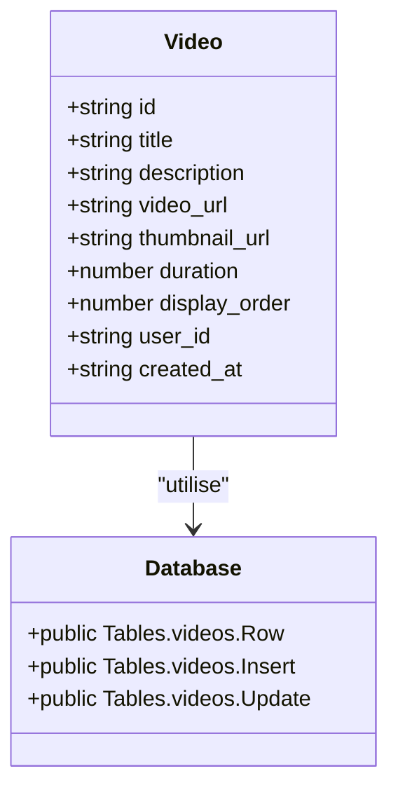
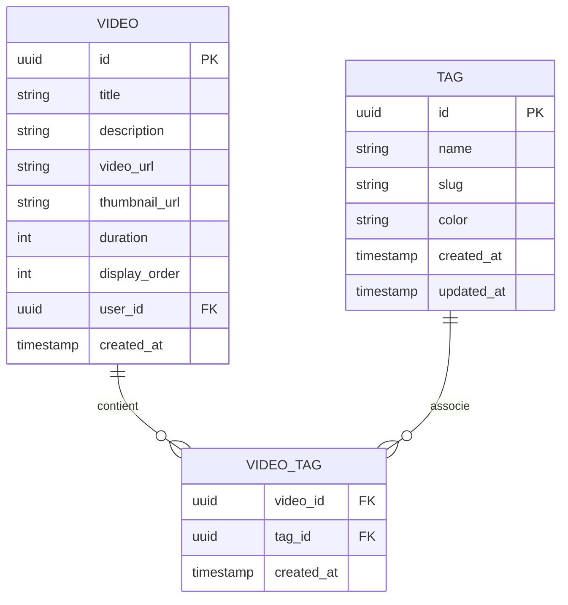
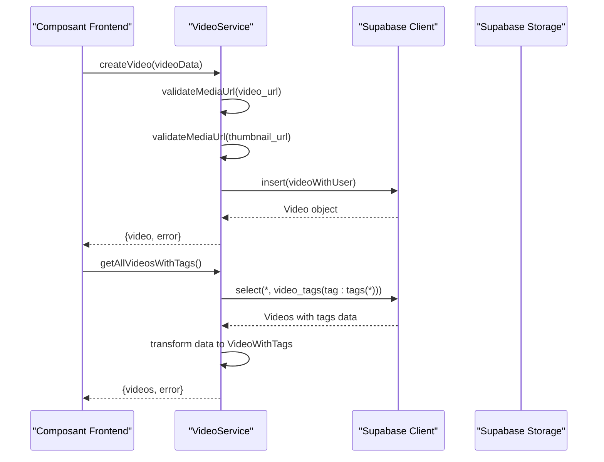
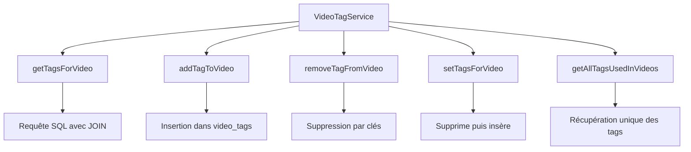
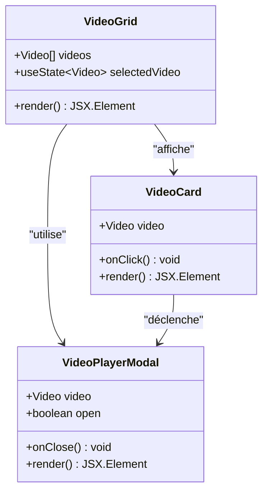
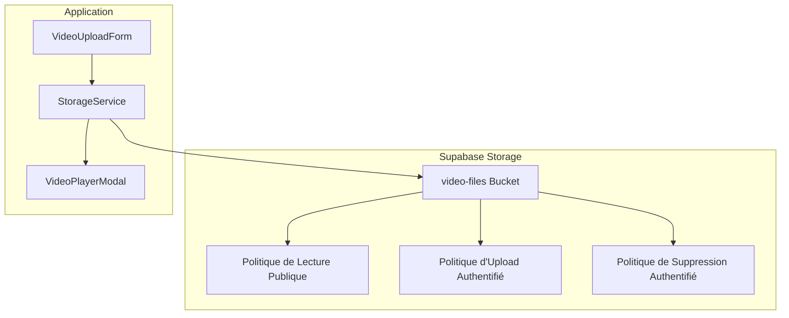

# Modèle Video

<cite>
**Fichiers Référencés dans ce Document**
- [supabaseClient.ts](file://lib/supabaseClient.ts)
- [videoService.ts](file://services/videoService.ts)
- [videoTagService.ts](file://services/videoTagService.ts)
- [VideoGrid.tsx](file://components/videos/VideoGrid.tsx)
- [VideoPlayerModal.tsx](file://components/videos/VideoPlayerModal.tsx)
- [VideoCard.tsx](file://components/videos/VideoCard.tsx)
- [VideoUploadForm.tsx](file://components/videos/VideoUploadForm.tsx)
- [storageService.ts](file://services/storageService.ts)
- [20251108071024_create_videos_system.sql](file://supabase/migrations/20251108071024_create_videos_system.sql)
</cite>

## Table des Matières
1. [Introduction](#introduction)
2. [Structure du Modèle Video](#structure-du-modèle-video)
3. [Relations avec les Tags](#relations-avec-les-tags)
4. [Services et Utilisation](#services-et-utilisation)
5. [Interface Utilisateur](#interface-utilisateur)
6. [Stockage et Gestion des Fichiers](#stockage-et-gestion-des-fichiers)
7. [Contraintes et Validation](#contraintes-et-validation)
8. [Bonnes Pratiques](#bonnes-pratiques)
9. [Conclusion](#conclusion)

## Introduction

Le modèle Video constitue le cœur du système de gestion des vidéos dans cette application Next.js. Il permet la gestion complète du cycle de vie des médias vidéo, depuis l'upload jusqu'à la diffusion, en passant par la gestion des métadonnées, des tags et des permissions utilisateur.

Le système utilise Supabase comme backend, combinant une base de données PostgreSQL pour les métadonnées et Supabase Storage pour le stockage des fichiers vidéo et des miniatures. Cette architecture permet une scalabilité efficace tout en maintenant la sécurité et la performance.

## Structure du Modèle Video

### Définition TypeScript

Le modèle Video est défini dans le fichier [`supabaseClient.ts`](file://lib/supabaseClient.ts#L204-L214) avec les propriétés suivantes :



**Sources du Diagramme**
- [supabaseClient.ts](file://lib/supabaseClient.ts#L204-L214)
- [supabaseClient.ts](file://lib/supabaseClient.ts#L282-L289)

### Détail des Champs

| Champ | Type | Contraintes | Description |
|-------|------|-------------|-------------|
| `id` | UUID | Clé primaire, auto-généré | Identifiant unique de la vidéo |
| `title` | Text | NOT NULL | Titre affiché de la vidéo |
| `description` | Text | Nullable | Description détaillée de la vidéo |
| `video_url` | Text | NOT NULL | URL publique du fichier vidéo dans Supabase Storage |
| `thumbnail_url` | Text | Nullable | URL de la miniature associée |
| `duration` | Integer | Nullable | Durée en secondes pour l'affichage |
| `display_order` | Integer | NOT NULL, DEFAULT 0 | Ordre de tri dans les listes |
| `user_id` | UUID | Nullable, référence auth.users | ID de l'utilisateur ayant ajouté la vidéo |
| `created_at` | TimestampTZ | Auto-généré | Date et heure de création |

**Sources de Section**
- [supabaseClient.ts](file://lib/supabaseClient.ts#L204-L214)
- [20251108071024_create_videos_system.sql](file://supabase/migrations/20251108071024_create_videos_system.sql#L36-L46)

### Interface Database

Le modèle Video est intégré dans l'interface Database de Supabase avec des contraintes spécifiques :

```mermaid
classDiagram
class DatabaseVideos {
+Row : Video
+Insert : Omit~Video, id, created_at~ & {id?, created_at?}
+Update : Partial~Omit~Video, id, created_at~~
}
class VideoConstraints {
+id : UUID PRIMARY KEY
+title : TEXT NOT NULL
+video_url : TEXT NOT NULL
+display_order : INTEGER NOT NULL DEFAULT 0
+user_id : UUID REFERENCES auth.users
+created_at : TIMESTAMPTZ DEFAULT now()
}
DatabaseVideos --> VideoConstraints : "implémente"
```

**Sources du Diagramme**
- [supabaseClient.ts](file://lib/supabaseClient.ts#L282-L289)

## Relations avec les Tags

### Modèle VideoTag

Le système utilise une table de relation many-to-many pour gérer les tags associés aux vidéos :



**Sources du Diagramme**
- [supabaseClient.ts](file://lib/supabaseClient.ts#L91-L95)
- [videoTagService.ts](file://services/videoTagService.ts#L1-L106)

### Modèle VideoWithTags

Pour faciliter l'utilisation, un type composite `VideoWithTags` est défini :

```typescript
export type VideoWithTags = Video & {
  tags?: Tag[];
};
```

Cette interface permet d'accéder directement aux tags associés à chaque vidéo lors des requêtes.

**Sources de Section**
- [supabaseClient.ts](file://lib/supabaseClient.ts#L112-L114)
- [videoTagService.ts](file://services/videoTagService.ts#L1-L106)

## Services et Utilisation

### Service VideoService

Le service [`videoService.ts`](file://services/videoService.ts#L1-L268) fournit toutes les opérations CRUD pour le modèle Video :



**Sources du Diagramme**
- [videoService.ts](file://services/videoService.ts#L58-L171)
- [videoService.ts](file://services/videoService.ts#L16-L35)

### Opérations Principales

#### Chargement des Vidéos

Le service propose plusieurs méthodes de chargement :

1. **Toutes les vidéos** : [`getAllVideos()`](file://services/videoService.ts#L6-L14)
2. **Vidéos avec tags** : [`getAllVideosWithTags()`](file://services/videoService.ts#L16-L35)
3. **Par ID** : [`getVideoById()`](file://services/videoService.ts#L37-L45)
4. **Ordre maximal** : [`getMaxDisplayOrder()`](file://services/videoService.ts#L47-L56)

#### Création et Mise à Jour

Les opérations incluent :
- [`createVideo()`](file://services/videoService.ts#L58-L171) avec validation automatique
- [`updateVideo()`](file://services/videoService.ts#L171-L219) avec validation des URLs
- [`deleteVideo()`](file://services/videoService.ts#L222-L229)
- [`updateDisplayOrder()`](file://services/videoService.ts#L231-L238)

#### Création avec Tags

La méthode [`createVideoWithTags()`](file://services/videoService.ts#L240-L267) combine la création de vidéo et l'attribution de tags.

**Sources de Section**
- [videoService.ts](file://services/videoService.ts#L1-L268)

### Service VideoTagService

Le service [`videoTagService.ts`](file://services/videoTagService.ts#L1-L106) gère les relations avec les tags :



**Sources du Diagramme**
- [videoTagService.ts](file://services/videoTagService.ts#L1-L106)

**Sources de Section**
- [videoTagService.ts](file://services/videoTagService.ts#L1-L106)

## Interface Utilisateur

### VideoGrid

Le composant [`VideoGrid`](file://components/videos/VideoGrid.tsx#L1-L43) affiche les vidéos en grille :



**Sources du Diagramme**
- [VideoGrid.tsx](file://components/videos/VideoGrid.tsx#L1-L43)
- [VideoCard.tsx](file://components/videos/VideoCard.tsx#L1-L76)
- [VideoPlayerModal.tsx](file://components/videos/VideoPlayerModal.tsx#L1-L44)

### VideoCard

Le composant [`VideoCard`](file://components/videos/VideoCard.tsx#L1-L76) affiche chaque vidéo avec :
- Miniature optimisée avec [`OptimizedImage`](file://components/OptimizedImage.tsx)
- Bouton de lecture avec icône Play
- Bouton de favori
- Durée formatée
- Titre et description

### VideoPlayerModal

Le [`VideoPlayerModal`](file://components/videos/VideoPlayerModal.tsx#L1-L44) fournit un lecteur vidéo intégré avec :
- Contrôles natifs HTML5
- Lecture automatique
- Support des formats vidéo courants

**Sources de Section**
- [VideoGrid.tsx](file://components/videos/VideoGrid.tsx#L1-L43)
- [VideoCard.tsx](file://components/videos/VideoCard.tsx#L1-L76)
- [VideoPlayerModal.tsx](file://components/videos/VideoPlayerModal.tsx#L1-L44)

## Stockage et Gestion des Fichiers

### Configuration Supabase Storage

Le système utilise un bucket spécifique [`video-files`](file://supabase/migrations/20251108071024_create_videos_system.sql#L85-L89) pour les vidéos :



**Sources du Diagramme**
- [20251108071024_create_videos_system.sql](file://supabase/migrations/20251108071024_create_videos_system.sql#L85-L154)
- [storageService.ts](file://services/storageService.ts#L123-L153)

### Service StorageService

Le [`storageService.ts`](file://services/storageService.ts#L123-L153) gère le stockage des vidéos :

#### Fonctionnalités
- **Upload** : [`uploadVideo()`](file://services/storageService.ts#L123-L145) avec logging détaillé
- **URL Publique** : [`getVideoPublicUrl()`](file://services/storageService.ts#L147-L153) pour accès direct
- **Suppression** : [`deleteVideo()`](file://services/storageService.ts#L155-L161)
- **Extraction** : [`extractFileNameFromUrl()`](file://services/storageService.ts#L163-L166) pour manipulation

#### Bonnes Pratiques
- **Nommage** : Utilisation de timestamps et UUID pour éviter les conflits
- **Validation** : Contrôle de la taille (max 100MB) et du format
- **Compression** : Optimisation automatique côté client

**Sources de Section**
- [storageService.ts](file://services/storageService.ts#L123-L153)
- [VideoUploadForm.tsx](file://components/videos/VideoUploadForm.tsx#L1-L498)

### Gestion des Thumbnails

Le formulaire d'upload [`VideoUploadForm.tsx`](file://components/videos/VideoUploadForm.tsx#L1-L498) gère également les miniatures :

#### Contraintes
- **Formats acceptés** : JPEG, PNG, WebP
- **Taille maximale** : 2MB
- **Validation** : Contrôle de type MIME et signature de fichier

#### Processus
1. **Upload séparé** : Miniature optionnelle
2. **Prévisualisation** : Affichage en temps réel
3. **Nettoyage** : Suppression automatique en cas d'erreur

**Sources de Section**
- [VideoUploadForm.tsx](file://components/videos/VideoUploadForm.tsx#L1-L498)

## Contraintes et Validation

### Contraintes de Base de Données

Le schéma SQL définit plusieurs contraintes importantes :

```mermaid
erDiagram
VIDEOS {
uuid id PK
text title NOT NULL
text description
text video_url NOT NULL
text thumbnail_url
integer duration
integer display_order NOT NULL DEFAULT 0
uuid user_id FK
timestamptz created_at DEFAULT now()
}
AUTH_USERS {
uuid id PK
}
VIDEOS ||--o{ AUTH_USERS : "user_id"
```

**Sources du Diagramme**
- [20251108071024_create_videos_system.sql](file://supabase/migrations/20251108071024_create_videos_system.sql#L36-L46)

### Contraintes d'Insertion et de Mise à Jour

#### Database Interface

Le type [`Database`](file://lib/supabaseClient.ts#L216-L343) définit les contraintes :

```typescript
// Insertion
Insert: Omit<Video, 'id' | 'created_at'> & {
  id?: string;
  created_at?: string;
};

// Mise à jour
Update: Partial<Omit<Video, 'id' | 'created_at'>>;
```

#### Validation côté Application

Le [`videoService.ts`](file://services/videoService.ts#L58-L171) implémente une validation complète :

1. **Authentification** : Vérification que l'utilisateur est connecté
2. **Rate Limiting** : Protection contre les uploads excessifs
3. **Validation des URLs** : [`validateMediaUrl()`](file://services/videoService.ts#L117-L139)
4. **Permissions** : Vérification des droits d'accès

### Contraintes Optionnelles

Les champs suivants sont optionnels selon le contexte :

- `description` : Peut être omis
- `thumbnail_url` : Non obligatoire
- `duration` : Calculé automatiquement
- `user_id` : Nullable pour compatibilité

**Sources de Section**
- [supabaseClient.ts](file://lib/supabaseClient.ts#L282-L289)
- [videoService.ts](file://services/videoService.ts#L58-L171)

## Bonnes Pratiques

### Stockage Vidéo dans Supabase Storage

#### Nommage des Fichiers
- **Format recommandé** : `{timestamp}-{random}.{extension}`
- **Exemple** : `1698745632-abc123.mp4`
- **Avantages** : Unicité garantie, tri chronologique

#### Gestion des Permissions
- **Lecture publique** : Activée pour le bucket `video-files`
- **Upload** : Restreint aux utilisateurs authentifiés
- **Suppression** : Contrôlée par l'utilisateur propriétaire

#### Optimisation des Performances
- **Cache Control** : 3600 secondes (1 heure)
- **Compression** : Traitement côté client recommandé
- **Indexation** : [`idx_videos_display_order`](file://supabase/migrations/20251108071024_create_videos_system.sql#L76-L77) pour les requêtes de tri

### Gestion des Thumbnails

#### Optimisation
- **Taille maximale** : 2MB recommandée
- **Formats** : WebP pour meilleure compression
- **Dimensions** : Aspect ratio 16:9 optimal

#### Gestion d'Erreur
- **Fallback** : Icône de vidéo par défaut
- **Validation** : Contrôle côté client et serveur
- **Nettoyage** : Suppression automatique en cas d'erreur

### Performance et Scalabilité

#### Indexation
- [`idx_videos_display_order`](file://supabase/migrations/20251108071024_create_videos_system.sql#L76-L77) : Tri rapide
- [`idx_videos_user_id`](file://supabase/migrations/20251108071024_create_videos_system.sql#L79-L80) : Requêtes par utilisateur
- [`idx_videos_created_at`](file://supabase/migrations/20251108071024_create_videos_system.sql#L82-L83) : Historique

#### Sécurité
- **RLS** : Row Level Security activée
- **Politiques** : Séparation des droits de lecture/écriture
- **Validation** : Double vérification des URLs

### Gestion des Erreurs

#### Stratégies
- **Retry automatique** : Pour les erreurs temporaires
- **Rollback** : Suppression des fichiers en cas d'erreur
- **Logging détaillé** : Traces complètes pour le debugging

#### Messages d'Erreur
- **Format standardisé** : `{code}: {message}`
- **Détails techniques** : Disponibles en mode debug
- **Messages utilisateur** : Clairs et actionnables

## Conclusion

Le modèle Video représente un système complet et robuste pour la gestion des médias vidéo dans une application Next.js moderne. Son architecture modulaire, basée sur Supabase, offre :

### Avantages Clés
- **Scalabilité** : Architecture distribuée avec Supabase Storage
- **Sécurité** : Contrôles d'accès granulaires et validation complète
- **Flexibilité** : Support des tags et des métadonnées enrichies
- **Performance** : Indexation optimisée et cache intelligent

### Évolutions Possibles
- **Streaming** : Intégration de solutions de streaming adaptatif
- **Transcodage** : Automatisation du traitement des vidéos
- **Analytics** : Suivi des statistiques de visionnage
- **Recommandations** : Système de suggestions basé sur les tags

Ce modèle constitue une base solide pour toute application nécessitant une gestion avancée des médias vidéo, tout en maintenant la simplicité d'utilisation pour les développeurs et les utilisateurs finaux.