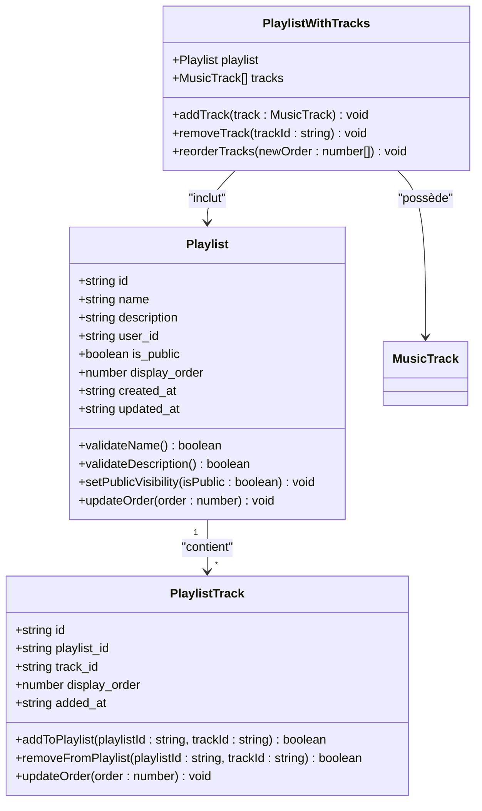
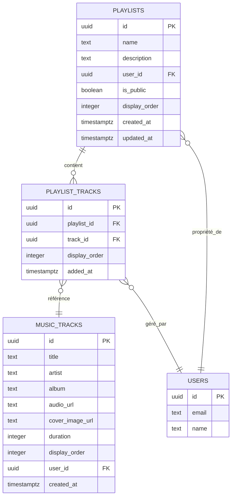
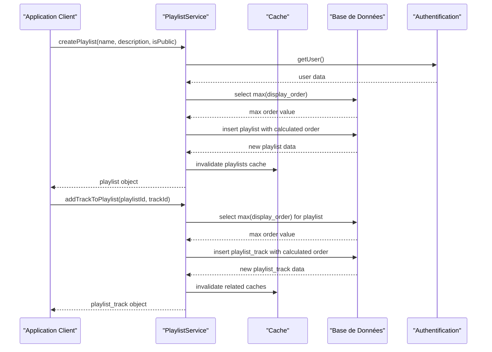
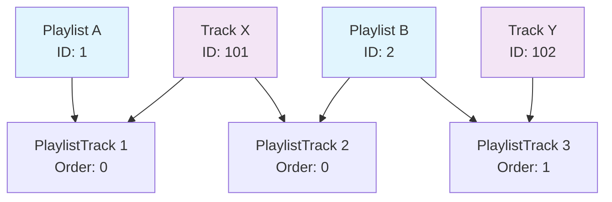
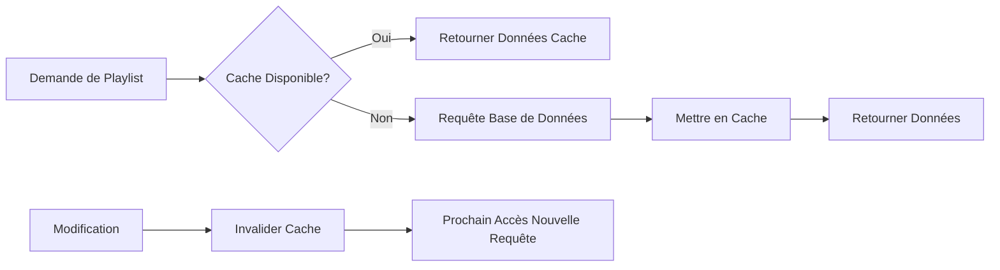

# Modèles Playlist

<cite>
**Fichiers Référencés dans ce Document**
- [playlistService.ts](file://services/playlistService.ts)
- [20251111050910_create_playlists_system.sql](file://supabase/migrations/20251111050910_create_playlists_system.sql)
- [supabaseClient.ts](file://lib/supabaseClient.ts)
- [CreatePlaylistDialog.tsx](file://components/music/CreatePlaylistDialog.tsx)
- [AddToPlaylistMenu.tsx](file://components/music/AddToPlaylistMenu.tsx)
- [validators.ts](file://lib/validators.ts)
- [page.tsx](file://app/musique/page.tsx)
</cite>

## Table des Matières
1. [Introduction](#introduction)
2. [Structure des Modèles](#structure-des-modèles)
3. [Architecture du Système](#architecture-du-système)
4. [Services et Contrôleurs](#services-et-contrôleurs)
5. [Gestion des Relations](#gestion-des-relations)
6. [Contraintes et Sécurité](#contraintes-et-sécurité)
7. [Optimisations de Performance](#optimisations-de-performance)
8. [Exemples d'Utilisation](#exemples-dutilisation)
9. [Considérations de Développement](#considérations-de-développement)
10. [Conclusion](#conclusion)

## Introduction

Le système de playlists constitue un composant central de l'application de gestion musicale, permettant aux utilisateurs de créer, organiser et partager des collections de morceaux musicaux. Ce système repose sur une architecture robuste basée sur PostgreSQL avec Supabase, offrant des fonctionnalités avancées de gestion des données, de sécurité et d'optimisation des performances.

## Structure des Modèles

### Modèle Playlist

Le modèle `Playlist` représente une collection de morceaux musicaux créée par un utilisateur. Il contient les attributs suivants :



**Sources du Diagramme**
- [supabaseClient.ts](file://lib/supabaseClient.ts#L181-L199)
- [playlistService.ts](file://services/playlistService.ts#L394-L445)

**Sources de Section**
- [supabaseClient.ts](file://lib/supabaseClient.ts#L181-L199)
- [20251111050910_create_playlists_system.sql](file://supabase/migrations/20251111050910_create_playlists_system.sql#L40-L59)

### Modèle PlaylistTrack

Le modèle `PlaylistTrack` représente la relation entre une playlist et un morceau musical, incluant l'ordre d'affichage et la date d'ajout :

- **id** : Identifiant unique UUID de la relation
- **playlist_id** : Référence vers la playlist parente (clé étrangère)
- **track_id** : Référence vers le morceau musical (clé étrangère)
- **display_order** : Ordre d'affichage dans la playlist (entier)
- **added_at** : Date et heure d'ajout du morceau (timestamp)

### Modèle PlaylistWithTracks

Le modèle composite `PlaylistWithTracks` combine les informations d'une playlist avec ses morceaux associés :

- **playlist** : Objet Playlist complet
- **tracks** : Tableau de morceaux musicaux avec métadonnées complètes

**Sources de Section**
- [supabaseClient.ts](file://lib/supabaseClient.ts#L200-L202)
- [playlistService.ts](file://services/playlistService.ts#L420-L445)

## Architecture du Système

### Schéma de Base de Données

Le système utilise une architecture en trois tables interconnectées :



**Sources du Diagramme**
- [20251111050910_create_playlists_system.sql](file://supabase/migrations/20251111050910_create_playlists_system.sql#L40-L59)

### Index et Optimisations

Le système implémente plusieurs index pour optimiser les performances :

- **idx_playlist_tracks_playlist_id** : Optimise les requêtes de récupération par playlist
- **idx_playlist_tracks_track_id** : Optimise les requêtes de recherche par morceau
- **idx_playlist_tracks_display_order** : Optimise le tri et l'ordonnancement

**Sources de Section**
- [20251111050910_create_playlists_system.sql](file://supabase/migrations/20251111050910_create_playlists_system.sql#L63-L65)

## Services et Contrôleurs

### Service PlaylistService

Le `playlistService` fournit une API complète pour la gestion des playlists :



**Sources du Diagramme**
- [playlistService.ts](file://services/playlistService.ts#L16-L89)
- [playlistService.ts](file://services/playlistService.ts#L189-L253)

### Gestion des Opérations CRUD

Le service implémente toutes les opérations CRUD avec gestion d'erreurs et invalidation de cache :

#### Création de Playlist
- Validation des paramètres d'entrée
- Calcul automatique de l'ordre d'affichage
- Authentification de l'utilisateur
- Gestion des erreurs de validation

#### Gestion des Tracks
- Ajout unique par playlist (contrainte UNIQUE)
- Ordonnancement automatique
- Gestion des doublons
- Mise à jour de l'ordre

#### Mise à Jour et Suppression
- Validation des permissions utilisateur
- Cascade de suppression automatique
- Invalidation intelligente du cache

**Sources de Section**
- [playlistService.ts](file://services/playlistService.ts#L16-L89)
- [playlistService.ts](file://services/playlistService.ts#L189-L253)
- [playlistService.ts](file://services/playlistService.ts#L250-L294)
- [playlistService.ts](file://services/playlistService.ts#L295-L335)
- [playlistService.ts](file://services/playlistService.ts#L336-L381)
- [playlistService.ts](file://services/playlistService.ts#L382-L422)

## Gestion des Relations

### Relations Many-to-Many

Le système utilise une table de liaison `playlist_tracks` pour gérer la relation many-to-many entre playlists et morceaux :



**Sources du Diagramme**
- [20251111050910_create_playlists_system.sql](file://supabase/migrations/20251111050910_create_playlists_system.sql#L53-L59)

### Gestion de l'Ordre d'Affichage

L'ordre d'affichage est géré automatiquement lors des opérations :

#### Création de Playlist
- L'ordre est calculé comme `max_order + 1`
- Garantit l'unicité et l'ordre séquentiel

#### Ajout de Track
- L'ordre est calculé comme `max_order + 1`
- Maintient l'ordre chronologique d'ajout

#### Réorganisation
- Permet la modification manuelle de l'ordre
- Valide chaque position avant mise à jour

**Sources de Section**
- [playlistService.ts](file://services/playlistService.ts#L40-L47)
- [playlistService.ts](file://services/playlistService.ts#L193-L202)
- [playlistService.ts](file://services/playlistService.ts#L292-L306)

## Contraintes et Sécurité

### Contraintes de Base de Données

Le système implémente plusieurs contraintes pour assurer l'intégrité des données :

#### Contraintes SQL
- **UNIQUE(playlist_id, track_id)** : Empêche les doublons dans une playlist
- **CASCADE DELETE** : Supprime automatiquement les tracks associés lors de la suppression d'une playlist
- **REFERENCES** : Maintient l'intégrité référentielle entre tables

#### Contraintes de Validation
- Longueur maximale : 100 caractères pour le nom, 500 pour la description
- Type de données : Validation stricte des types
- Valeurs par défaut : Gestion automatique des champs optionnels

### Sécurité et RLS

Le système utilise la sécurité au niveau des lignes (Row Level Security) :

#### Politiques de Sécurité
- **SELECT** : Accès aux playlists publiques + propriétés personnelles
- **INSERT** : Seuls les utilisateurs authentifiés
- **UPDATE/DELETE** : Propriétaires uniquement
- **Relations** : Vérification via EXISTS sur la table parente

#### Authentification
- Intégration avec Supabase Auth
- Validation automatique des sessions
- Protection contre les accès non autorisés

**Sources de Section**
- [20251111050910_create_playlists_system.sql](file://supabase/migrations/20251111050910_create_playlists_system.sql#L59-L60)
- [20251111050910_create_playlists_system.sql](file://supabase/migrations/20251111050910_create_playlists_system.sql#L72-L147)

## Optimisations de Performance

### Stratégie de Cache

Le système implémente une stratégie de cache intelligente :



**Sources du Diagramme**
- [playlistService.ts](file://services/playlistService.ts#L8-L9)
- [playlistService.ts](file://services/playlistService.ts#L66-L67)

### Optimisations Spécifiques

#### Cache TTL
- Durée de vie : 5 minutes
- Invalidation automatique lors des modifications
- Pattern matching pour la cohérence

#### Requêtes Optimisées
- Jointures efficaces avec sélection de colonnes spécifiques
- Tri par index sur `display_order`
- Limitation des résultats pour les listes

#### Gestion des Grandes Playlists
- Pagination automatique pour les listes
- Chargement différé des morceaux
- Cache hiérarchique pour les données fréquentes

**Sources de Section**
- [playlistService.ts](file://services/playlistService.ts#L8-L9)
- [playlistService.ts](file://services/playlistService.ts#L138-L173)
- [playlistService.ts](file://services/playlistService.ts#L394-L445)

## Exemples d'Utilisation

### Création d'une Playlist

```typescript
// Exemple d'utilisation du service de playlists
const { playlist, error } = await playlistService.createPlaylist(
  "Ma Playlist Favoris",
  "Mes morceaux préférés de jazz",
  false
);

if (error) {
  console.error("Erreur lors de la création:", error);
} else {
  console.log("Playlist créée:", playlist.name);
}
```

### Ajout de Morceaux

```typescript
// Ajouter un morceau à une playlist existante
const { playlistTrack, error } = await playlistService.addTrackToPlaylist(
  "playlist-id-uuid",
  "track-id-uuid"
);

if (error) {
  if (error.code === "DUPLICATE_TRACK") {
    console.log("Morceau déjà dans la playlist");
  } else {
    console.error("Erreur:", error);
  }
}
```

### Récupération avec Morceaux

```typescript
// Récupérer une playlist complète avec ses morceaux
const { playlist, error } = await playlistService.getPlaylistWithTracks(
  "playlist-id-uuid"
);

if (playlist) {
  console.log(`Playlist: ${playlist.name}`);
  console.log(`Nombre de morceaux: ${playlist.tracks.length}`);
  playlist.tracks.forEach((track, index) => {
    console.log(`${index + 1}. ${track.title} - ${track.artist}`);
  });
}
```

### Réorganisation

```typescript
// Réorganiser les morceaux d'une playlist
const newOrder = [
  { trackId: "track-id-1", order: 0 },
  { trackId: "track-id-2", order: 1 },
  { trackId: "track-id-3", order: 2 }
];

const { error } = await playlistService.updatePlaylistOrder(
  "playlist-id-uuid",
  newOrder
);
```

**Sources de Section**
- [CreatePlaylistDialog.tsx](file://components/music/CreatePlaylistDialog.tsx#L56-L76)
- [AddToPlaylistMenu.tsx](file://components/music/AddToPlaylistMenu.tsx#L74-L98)
- [playlistService.ts](file://services/playlistService.ts#L394-L445)

## Considérations de Développement

### Gestion d'Erreurs

Le système implémente une gestion d'erreurs robuste :

#### Types d'Erreurs
- **NOT_AUTHENTICATED** : Utilisateur non connecté
- **DUPLICATE_TRACK** : Tentative d'ajout d'un morceau déjà présent
- **VALIDATION_ERROR** : Erreurs de validation des données
- **DATABASE_ERROR** : Erreurs de base de données

#### Stratégies de Récupération
- Retry automatique pour les erreurs temporaires
- Fallback vers les données en cache
- Notification utilisateur appropriée

### Extensibilité

Le système est conçu pour l'extensibilité :

#### Ajout de Fonctionnalités
- Architecture modulaire permettant l'ajout de nouvelles méthodes
- Interface TypeScript garantissant la cohérence
- Tests automatisés pour chaque nouvelle fonctionnalité

#### Performance Future
- Cache distribué possible pour les grandes installations
- Index additionnels selon les besoins d'usage
- Optimisations de requêtes basées sur les métriques

**Sources de Section**
- [playlistService.ts](file://services/playlistService.ts#L28-L35)
- [playlistService.ts](file://services/playlistService.ts#L215-L224)
- [validators.ts](file://lib/validators.ts#L179-L214)

## Conclusion

Le système de playlists offre une solution complète et robuste pour la gestion des collections musicales. Avec sa conception modulaire, ses optimisations de performance et sa sécurité intégrée, il constitue une base solide pour les fonctionnalités musicales de l'application.

Les points forts incluent :
- Architecture claire et bien structurée
- Gestion intelligente du cache pour les performances
- Sécurité au niveau des lignes pour la protection des données
- Interface utilisateur intuitive pour l'interaction
- Extensibilité pour les futures fonctionnalités

Cette implémentation démontre une approche moderne de développement d'applications web, combinant efficacité technique et expérience utilisateur optimale.