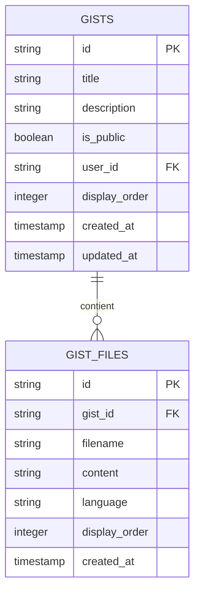
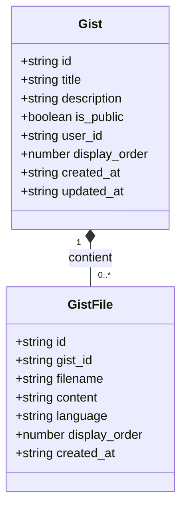
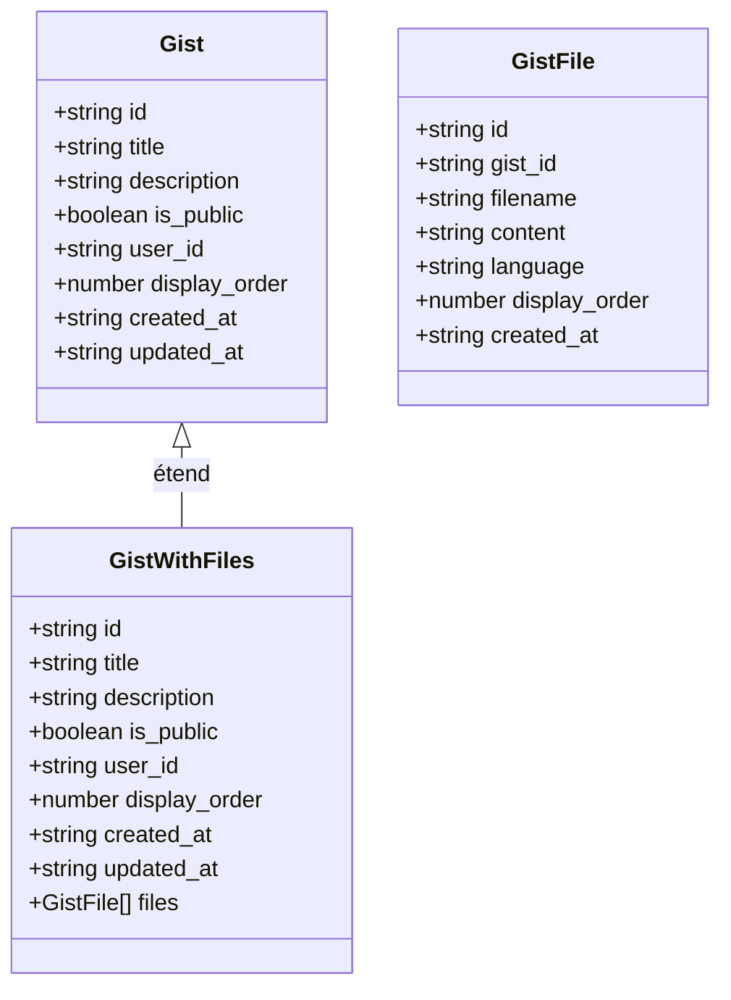
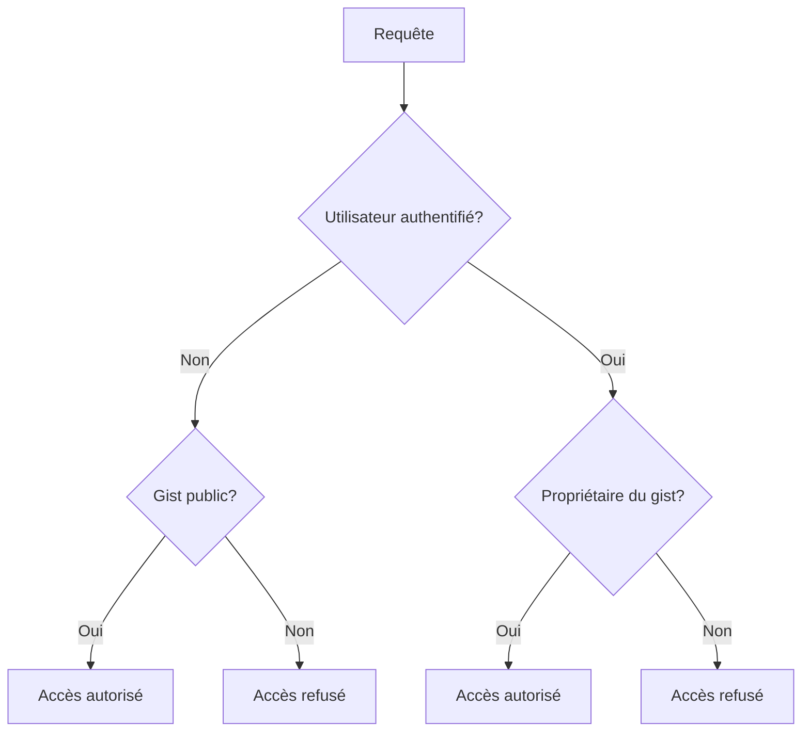
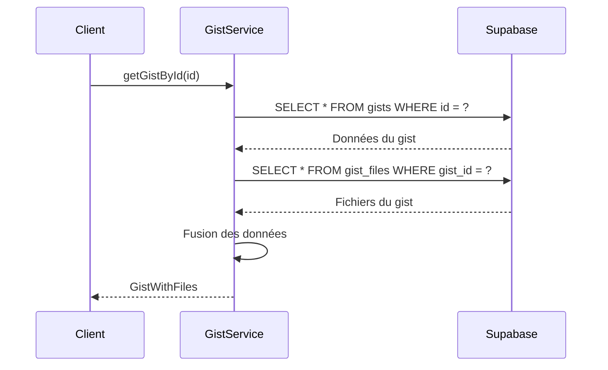
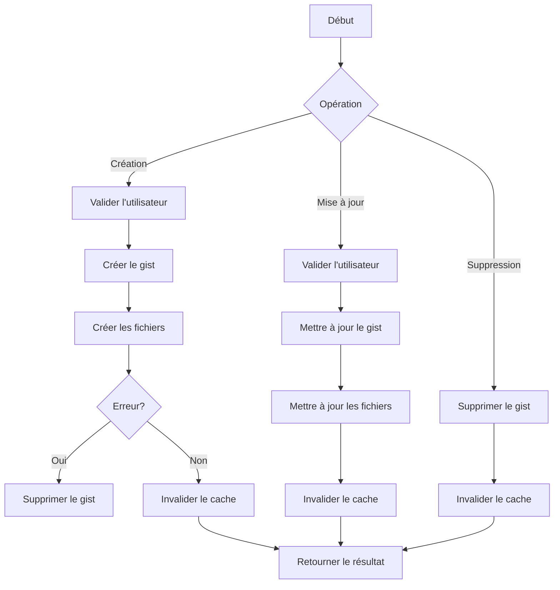

# Modèle Gist

<cite>
**Fichiers référencés dans ce document**  
- [gistService.ts](file://services/gistService.ts)
- [supabaseClient.ts](file://lib/supabaseClient.ts)
- [GistList.tsx](file://components/gists/GistList.tsx)
- [GistDetail.tsx](file://components/gists/GistDetail.tsx)
- [GistForm.tsx](file://components/gists/GistForm.tsx)
- [schema.sql](file://database/schema.sql)
</cite>

## Table des matières
1. [Introduction](#introduction)
2. [Structure du modèle Gist](#structure-du-modèle-gist)
3. [Champs du modèle Gist](#champs-du-modèle-gist)
4. [Relation avec GistFile](#relation-avec-gistfile)
5. [Modèle GistWithFiles pour la récupération groupée](#modèle-gistwithfiles-pour-la-récupération-groupée)
6. [Sécurité avec Supabase RLS](#sécurité-avec-supabase-rls)
7. [Exemples de requêtes](#exemples-de-requêtes)
8. [Implémentation dans gistService.ts](#implémentation-dans-gistservicets)
9. [Bonnes pratiques de sécurité](#bonnes-pratiques-de-sécurité)
10. [Optimisations de performance](#optimisations-de-performance)
11. [Conclusion](#conclusion)

## Introduction
Le modèle Gist est conçu pour représenter des extraits de code dans le portfolio, permettant aux utilisateurs de créer, gérer et partager des fragments de code. Ce modèle supporte à la fois les gists publics et privés, avec une structure relationnelle qui permet de stocker plusieurs fichiers par gist. L'implémentation repose sur Supabase comme base de données backend, avec des fonctionnalités avancées comme le Row Level Security (RLS) pour la protection des données privées.

**Section sources**
- [gistService.ts](file://services/gistService.ts#L1-L376)
- [supabaseClient.ts](file://lib/supabaseClient.ts#L156-L179)

## Structure du modèle Gist
Le modèle Gist est composé de deux tables principales dans la base de données Supabase : `gists` et `gist_files`. La table `gists` contient les métadonnées du gist (titre, description, visibilité, etc.), tandis que la table `gist_files` stocke les fichiers individuels associés à chaque gist. Cette structure en deux tables permet une gestion flexible des fichiers, avec la possibilité d'avoir plusieurs fichiers par gist.

**Diagram sources**
- [supabaseClient.ts](file://lib/supabaseClient.ts#L156-L175)
- [supabaseClient.ts](file://lib/supabaseClient.ts#L167-L175)

**Section sources**
- [supabaseClient.ts](file://lib/supabaseClient.ts#L156-L179)

## Champs du modèle Gist
Le modèle Gist contient plusieurs champs qui définissent ses propriétés et comportements :

- **id** : Identifiant unique du gist (UUID), généré automatiquement
- **title** : Titre optionnel du gist, pouvant être null
- **description** : Description optionnelle du gist, pouvant être null
- **is_public** : Booléen indiquant si le gist est public ou privé
- **user_id** : Référence à l'utilisateur propriétaire du gist
- **display_order** : Ordre d'affichage personnalisé pour le tri
- **created_at** : Horodatage de création, généré automatiquement
- **updated_at** : Horodatage de dernière mise à jour, mis à jour automatiquement

Ces champs permettent de gérer complètement le cycle de vie d'un gist, de sa création à son affichage, en passant par sa mise à jour et sa suppression.

**Section sources**
- [supabaseClient.ts](file://lib/supabaseClient.ts#L156-L165)

## Relation avec GistFile
La relation entre Gist et GistFile est une relation de type "un-à-plusieurs", où un gist peut contenir plusieurs fichiers. Cette relation est implémentée via une clé étrangère `gist_id` dans la table `gist_files` qui référence l'identifiant du gist parent. Lorsqu'un gist est supprimé, tous ses fichiers associés sont automatiquement supprimés grâce à la contrainte ON DELETE CASCADE.

**Diagram sources**
- [supabaseClient.ts](file://lib/supabaseClient.ts#L156-L175)
- [supabaseClient.ts](file://lib/supabaseClient.ts#L167-L175)

**Section sources**
- [gistService.ts](file://services/gistService.ts#L106-L122)
- [supabaseClient.ts](file://lib/supabaseClient.ts#L167-L175)

## Modèle GistWithFiles pour la récupération groupée
Le modèle GistWithFiles est une extension du modèle Gist qui inclut les fichiers associés. Il est utilisé pour la récupération groupée des données d'un gist et de ses fichiers en une seule opération. Ce modèle combine les propriétés du gist avec un tableau de fichiers, permettant un accès efficace à toutes les données nécessaires pour afficher un gist complet.

**Diagram sources**
- [supabaseClient.ts](file://lib/supabaseClient.ts#L177-L179)
- [gistService.ts](file://services/gistService.ts#L119-L122)

**Section sources**
- [supabaseClient.ts](file://lib/supabaseClient.ts#L177-L179)
- [gistService.ts](file://services/gistService.ts#L119-L122)

## Sécurité avec Supabase RLS
Le modèle Gist utilise le Row Level Security (RLS) de Supabase pour protéger les données sensibles. Les politiques de sécurité sont configurées pour permettre un accès différencié selon le statut d'authentification de l'utilisateur et la visibilité du gist. Les gists publics sont accessibles à tous, tandis que les gists privés ne sont accessibles qu'à leur propriétaire.

**Diagram sources**
- [gistService.ts](file://services/gistService.ts#L153-L165)
- [gistService.ts](file://services/gistService.ts#L91-L95)

**Section sources**
- [gistService.ts](file://services/gistService.ts#L153-L165)
- [gistService.ts](file://services/gistService.ts#L91-L95)

## Exemples de requêtes
Voici des exemples de requêtes pour lister les gists d'un utilisateur avec leurs fichiers :

La récupération des gists d'un utilisateur se fait via la méthode `getAllGists()` qui applique un filtre sur le champ `is_public` pour n'inclure que les gists publics, ou via `getAllGistsAdmin()` pour les utilisateurs administrateurs qui peuvent voir tous les gists.

**Diagram sources**
- [gistService.ts](file://services/gistService.ts#L11-L29)
- [gistService.ts](file://services/gistService.ts#L77-L122)

**Section sources**
- [gistService.ts](file://services/gistService.ts#L11-L29)
- [gistService.ts](file://services/gistService.ts#L77-L122)

## Implémentation dans gistService.ts
Le service gistService.ts implémente toutes les opérations CRUD pour les gists. Il gère la création, la mise à jour, la suppression et la récupération des gists, avec une gestion intégrée du cache pour améliorer les performances. Le service utilise le client Supabase pour interagir avec la base de données et applique des validations appropriées à chaque opération.

**Diagram sources**
- [gistService.ts](file://services/gistService.ts#L137-L221)
- [gistService.ts](file://services/gistService.ts#L227-L253)
- [gistService.ts](file://services/gistService.ts#L311-L336)

**Section sources**
- [gistService.ts](file://services/gistService.ts#L137-L221)
- [gistService.ts](file://services/gistService.ts#L227-L253)
- [gistService.ts](file://services/gistService.ts#L311-L336)

## Bonnes pratiques de sécurité
Le modèle Gist met en œuvre plusieurs bonnes pratiques de sécurité pour protéger les données des utilisateurs :

1. **Authentification requise** : Toutes les opérations de modification nécessitent une authentification
2. **Vérification du propriétaire** : Seul le propriétaire d'un gist peut le modifier ou le supprimer
3. **Gestion des gists privés** : Les gists privés ne sont accessibles qu'à leur propriétaire
4. **Nettoyage en cas d'erreur** : En cas d'erreur lors de la création, le gist est automatiquement supprimé
5. **Invalidation du cache** : Le cache est invalidé après chaque modification pour garantir la cohérence des données

Ces mesures assurent que les données des utilisateurs sont protégées contre les accès non autorisés et les modifications malveillantes.

**Section sources**
- [gistService.ts](file://services/gistService.ts#L153-L165)
- [gistService.ts](file://services/gistService.ts#L208-L210)
- [gistService.ts](file://services/gistService.ts#L246-L247)

## Optimisations de performance
Plusieurs optimisations de performance sont mises en œuvre dans le modèle Gist :

1. **Mise en cache** : Les données des gists sont mises en cache pendant 5 minutes pour réduire les accès à la base de données
2. **Invalidation sélective** : Le cache est invalidé de manière ciblée après les modifications
3. **Requêtes groupées** : Les données du gist et de ses fichiers sont récupérées en deux requêtes distinctes mais séquentielles
4. **Tri optimisé** : Les gists sont triés par ordre d'affichage puis par date de création
5. **Chargement différé** : Les métadonnées des fichiers sont chargées uniquement lorsque nécessaire

Ces optimisations garantissent une expérience utilisateur fluide même avec un grand nombre de gists.

**Section sources**
- [gistService.ts](file://services/gistService.ts#L15-L19)
- [gistService.ts](file://services/gistService.ts#L36-L38)
- [gistService.ts](file://services/gistService.ts#L124-L126)
- [gistService.ts](file://services/gistService.ts#L213-L215)
- [GistList.tsx](file://components/gists/GistList.tsx#L35-L62)

## Conclusion
Le modèle Gist est une solution complète pour la gestion des extraits de code dans le portfolio. Il combine une structure de données bien conçue avec des fonctionnalités avancées de sécurité et de performance. L'utilisation de Supabase RLS permet de protéger efficacement les gists privés, tandis que la mise en cache et les requêtes optimisées assurent de bonnes performances. L'implémentation dans gistService.ts fournit une interface propre et cohérente pour toutes les opérations CRUD, facilitant l'intégration avec les composants frontend.