# Modèle Repository

<cite>
**Fichiers Référencés dans ce Document**
- [repositoryService.ts](file://services/repositoryService.ts)
- [supabaseClient.ts](file://lib/supabaseClient.ts)
- [githubService.ts](file://services/githubService.ts)
- [storageService.ts](file://services/storageService.ts)
- [RepositoryList.tsx](file://components/repositories/RepositoryList.tsx)
- [RepositoryDetail.tsx](file://components/repositories/RepositoryDetail.tsx)
- [FileExplorer.tsx](file://components/repositories/FileExplorer.tsx)
- [CodeViewer.tsx](file://components/repositories/CodeViewer.tsx)
- [RepositoryUploadForm.tsx](file://components/repositories/RepositoryUploadForm.tsx)
- [RepositoryEditDialog.tsx](file://components/repositories/RepositoryEditDialog.tsx)
- [schema.sql](file://database/schema.sql)
</cite>

## Table des Matières
1. [Introduction](#introduction)
2. [Structure du Modèle Repository](#structure-du-modèle-repository)
3. [Types de Données Associés](#types-de-données-associés)
4. [Architecture du Système](#architecture-du-système)
5. [Opérations CRUD avec repositoryService](#opérations-crud-avec-repositoryservice)
6. [Intégration avec GitHub](#intégration-avec-github)
7. [Gestion des Dépôts Locaux](#gestion-des-dépôts-locaux)
8. [Optimisations de Performance](#optimisations-de-performance)
9. [Considérations de Sécurité](#considérations-de-sécurité)
10. [Exemples d'Utilisation](#exemples-dutilisation)
11. [Conclusion](#conclusion)

## Introduction

Le modèle Repository constitue le cœur du système de gestion des dépôts d'applications dans le portfolio. Il permet de représenter et d'interagir avec deux types de dépôts : ceux hébergés sur GitHub et ceux stockés localement dans le système de fichiers. Cette architecture flexible permet aux utilisateurs de gérer leur code source de manière centralisée tout en offrant une expérience utilisateur cohérente quel que soit le type de dépôt.

Le système repose sur une architecture basée sur Supabase pour la persistance des données, avec une couche de service qui orchestre les interactions avec GitHub et le stockage local. Cette approche garantit la scalabilité, la sécurité et les performances nécessaires pour une application moderne.

## Structure du Modèle Repository

Le modèle Repository définit une entité complète représentant un dépôt de code avec toutes ses caractéristiques essentielles.

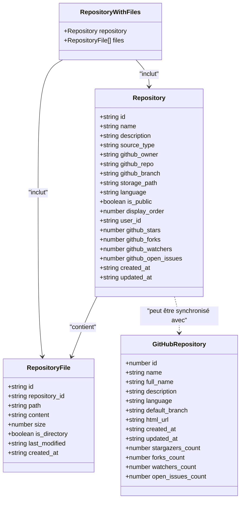

**Sources du Diagramme**
- [supabaseClient.ts](file://lib/supabaseClient.ts#L120-L139)
- [supabaseClient.ts](file://lib/supabaseClient.ts#L141-L150)

### Description des Champs

Chaque champ du modèle Repository joue un rôle spécifique dans la gestion et l'intégration des dépôts :

#### Champs Principaux
- **id** : Identifiant unique UUID du dépôt dans la base de données
- **name** : Nom du dépôt affiché aux utilisateurs
- **description** : Description textuelle optionnelle du projet
- **source_type** : Type de source ('local' ou 'github') déterminant la méthode d'accès

#### Métadonnées GitHub
- **github_owner** : Propriétaire du dépôt GitHub (username ou organisation)
- **github_repo** : Nom du dépôt GitHub
- **github_branch** : Branche par défaut (généralement 'main' ou 'master')
- **language** : Langage de programmation détecté automatiquement
- **is_public** : Indicateur de visibilité publique

#### Métriques GitHub
- **github_stars** : Nombre d'étoiles du dépôt
- **github_forks** : Nombre de forks
- **github_watchers** : Nombre de personnes surveillant le dépôt
- **github_open_issues** : Nombre d'issues ouvertes

#### Configuration de Stockage
- **storage_path** : Chemin de stockage local pour les dépôts locaux
- **display_order** : Ordre de tri personnalisé pour l'affichage
- **user_id** : Identifiant de l'utilisateur propriétaire

**Sources de la Section**
- [supabaseClient.ts](file://lib/supabaseClient.ts#L120-L139)

## Types de Données Associés

Le système utilise plusieurs types de données spécialisés pour gérer les différentes facettes des dépôts.

### RepositoryFile

La structure RepositoryFile représente les fichiers individuels dans un dépôt, qu'ils soient locaux ou provenant de GitHub.

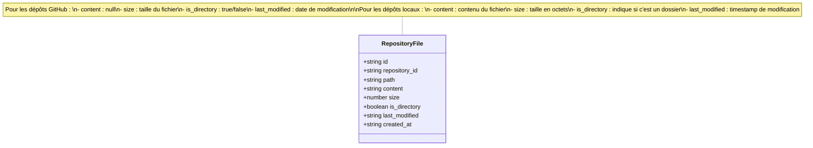

**Sources du Diagramme**
- [supabaseClient.ts](file://lib/supabaseClient.ts#L141-L150)

### RepositoryWithFiles

Ce type composite combine un dépôt avec ses fichiers associés pour faciliter le chargement imbriqué.

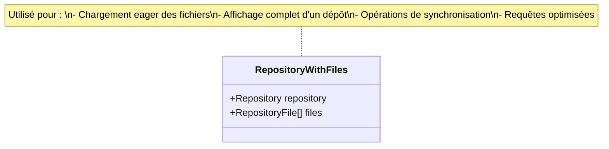

**Sources du Diagramme**
- [supabaseClient.ts](file://lib/supabaseClient.ts#L152-L154)

**Sources de la Section**
- [supabaseClient.ts](file://lib/supabaseClient.ts#L141-L154)

## Architecture du Système

L'architecture du système Repository suit un pattern de service avec séparation des responsabilités claire.

```mermaid
graph TB
subgraph "Interface Utilisateur"
UI[Composants React]
Forms[Formulaires]
List[Listes]
end
subgraph "Couche Service"
RS[repositoryService]
GS[githubService]
SS[storageService]
end
subgraph "Persistance"
DB[(Base de données<br/>Supabase)]
GH[(API GitHub)]
FS[(Stockage<br/>Supabase)]
end
subgraph "Cache"
Cache[Cache Redis]
end
UI --> RS
Forms --> RS
List --> RS
RS --> GS
RS --> SS
RS --> DB
RS --> Cache
GS --> GH
SS --> FS
Cache --> DB
```

**Sources du Diagramme**
- [repositoryService.ts](file://services/repositoryService.ts#L1-L10)
- [githubService.ts](file://services/githubService.ts#L45-L46)
- [storageService.ts](file://services/storageService.ts#L37-L38)

### Flux de Données

Le flux de données suit un pattern de lecture-écriture optimisé avec mise en cache.

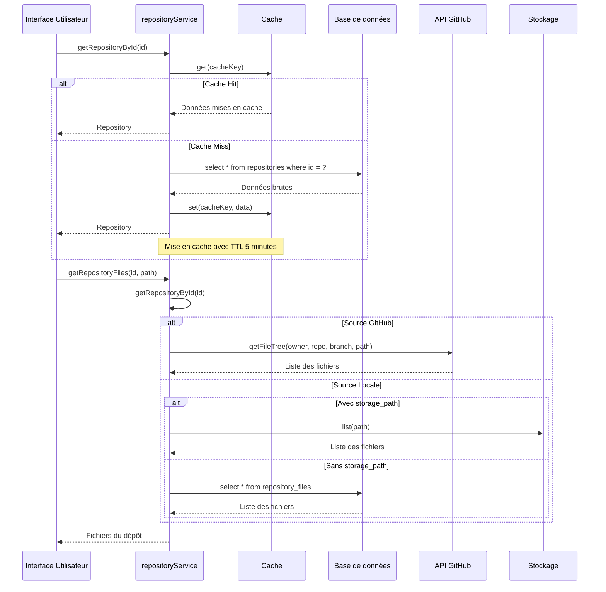

**Sources du Diagramme**
- [repositoryService.ts](file://services/repositoryService.ts#L47-L78)
- [repositoryService.ts](file://services/repositoryService.ts#L209-L266)

**Sources de la Section**
- [repositoryService.ts](file://services/repositoryService.ts#L1-L460)

## Opérations CRUD avec repositoryService

Le repositoryService implémente un ensemble complet d'opérations CRUD avec gestion d'erreurs et optimisations de performance.

### Opérations de Lecture

#### Récupération de tous les dépôts
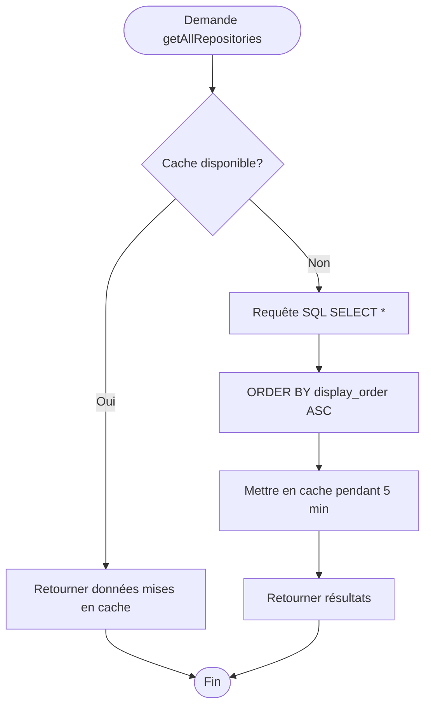

**Sources du Diagramme**
- [repositoryService.ts](file://services/repositoryService.ts#L13-L40)

#### Récupération d'un dépôt par ID
L'opération inclut une vérification de cache et une invalidation automatique lors des modifications.

### Opérations d'Écriture

#### Création d'un dépôt
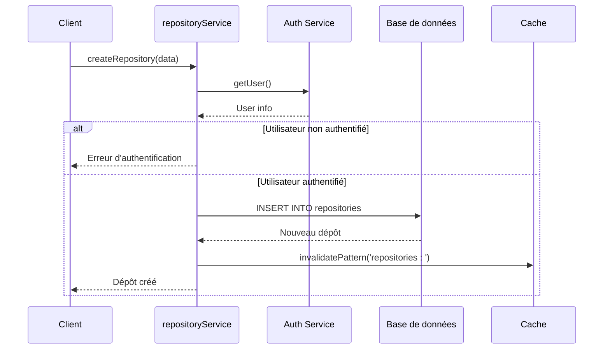

**Sources du Diagramme**
- [repositoryService.ts](file://services/repositoryService.ts#L87-L142)

#### Mise à jour et suppression
Les opérations de mise à jour et suppression incluent une invalidation automatique du cache pour maintenir la cohérence des données.

**Sources de la Section**
- [repositoryService.ts](file://services/repositoryService.ts#L87-L204)

## Intégration avec GitHub

L'intégration avec GitHub se fait principalement via l'API REST officielle, avec gestion des tokens et optimisations de performance.

### Vérification des Métadonnées GitHub

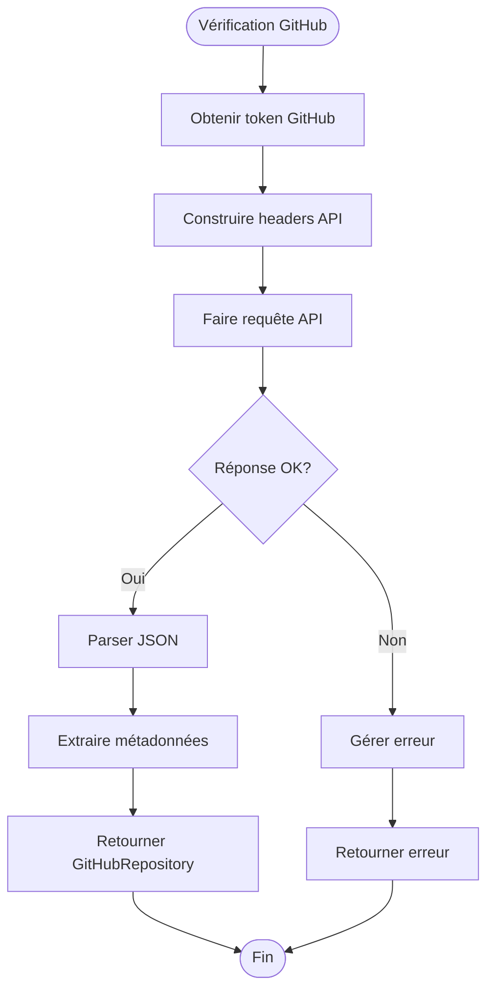

**Sources du Diagramme**
- [githubService.ts](file://services/githubService.ts#L49-L78)

### Récupération de l'Arbre de Fichiers

Le service GitHub fournit une méthode pour récupérer la structure d'un dépôt GitHub :

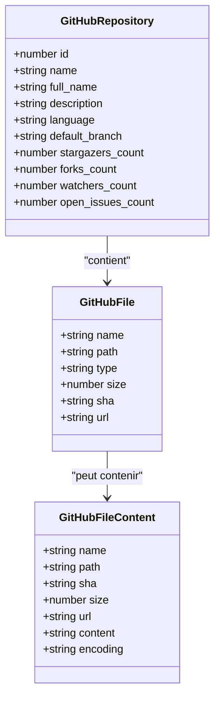

**Sources du Diagramme**
- [githubService.ts](file://services/githubService.ts#L5-L38)

### Gestion des Contenus

Le service GitHub gère également le téléchargement et l'affichage des contenus de fichiers, avec décodage automatique des fichiers encodés en base64.

**Sources de la Section**
- [githubService.ts](file://services/githubService.ts#L49-L236)

## Gestion des Dépôts Locaux

Pour les dépôts stockés localement, le système utilise deux approches principales : Supabase Storage et une table dédiée repository_files.

### Approche Storage

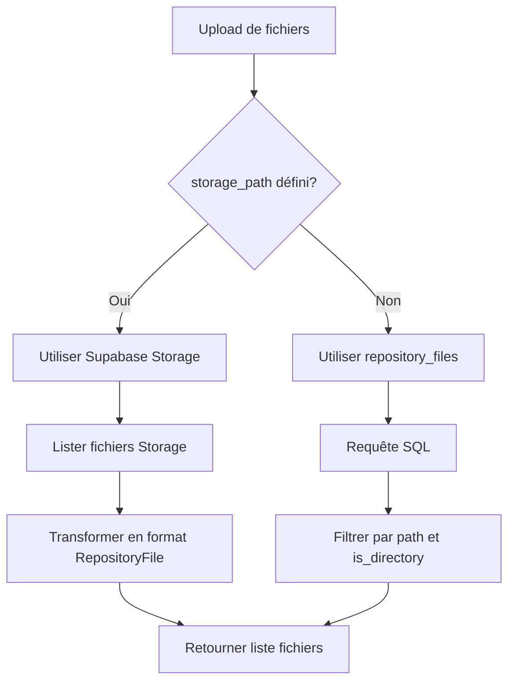

**Sources du Diagramme**
- [repositoryService.ts](file://services/repositoryService.ts#L239-L261)

### Approche Table

Pour les dépôts sans storage_path, le système utilise une table dédiée pour stocker les métadonnées des fichiers.

### Upload de Dépôts Locaux

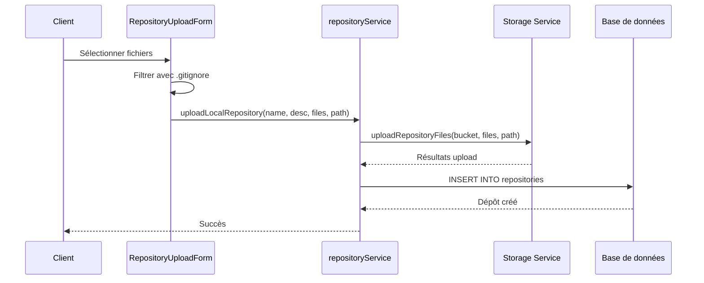

**Sources du Diagramme**
- [repositoryService.ts](file://services/repositoryService.ts#L361-L418)

**Sources de la Section**
- [repositoryService.ts](file://services/repositoryService.ts#L239-L266)
- [storageService.ts](file://services/storageService.ts#L232-L308)

## Optimisations de Performance

Le système implémente plusieurs stratégies d'optimisation pour garantir des performances optimales.

### Mise en Cache

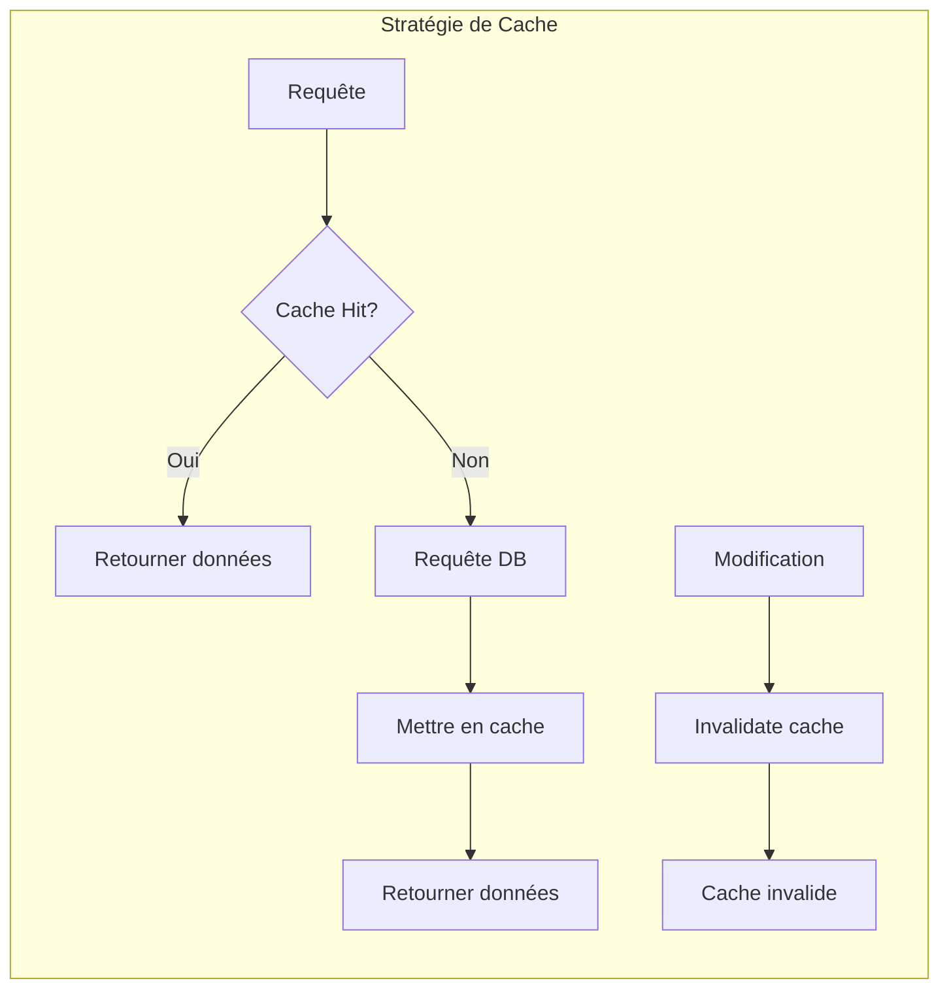

**Sources du Diagramme**
- [repositoryService.ts](file://services/repositoryService.ts#L17-L38)

### Optimisations Spécifiques

1. **Cache par durée limitée** : 5 minutes pour les données de dépôts
2. **Cache par clé** : Cache spécifique par ID de dépôt
3. **Invalidation automatique** : Cache invalide après modification
4. **Chargement différé** : Fichiers chargés uniquement quand demandés

### Gestion des Erreurs

Le système implémente une gestion robuste des erreurs avec logging et fallbacks appropriés.

**Sources de la Section**
- [repositoryService.ts](file://services/repositoryService.ts#L17-L38)

## Considérations de Sécurité

Le système implémente plusieurs couches de sécurité pour protéger les données et contrôler l'accès.

### Contraintes RLS (Row Level Security)

Le schéma de base de données utilise des politiques RLS pour contrôler l'accès aux dépôts :

```sql
-- Politiques pour la table repositories
CREATE POLICY "Accès public en lecture"
  ON repositories
  FOR SELECT
  TO authenticated
  USING (is_public OR user_id = current_user_id());

CREATE POLICY "Accès en écriture pour propriétaires"
  ON repositories
  FOR UPDATE, DELETE
  TO authenticated
  USING (user_id = current_user_id());
```

### Authentification et Autorisation

1. **Authentification obligatoire** : Toutes les opérations d'écriture requièrent authentification
2. **Contrôle d'accès par utilisateur** : Seuls les propriétaires peuvent modifier leurs dépôts
3. **Validation des entrées** : Validation côté client et serveur
4. **Protection CSRF** : Protection contre les attaques CSRF

### Sécurité des Fichiers

Pour les dépôts locaux :
- Validation des types de fichiers
- Limitation de taille
- Nettoyage des chemins
- Prévention des injections

**Sources de la Section**
- [repositoryService.ts](file://services/repositoryService.ts#L107-L120)

## Exemples d'Utilisation

### Récupération d'un Dépôt avec Ses Fichiers

```typescript
// Exemple de requête pour récupérer un dépôt avec ses fichiers
const { repository, error } = await repositoryService.getRepositoryById('uuid-du-depot');
const { files, error } = await repositoryService.getRepositoryFiles('uuid-du-depot');
```

### Création d'un Nouveau Dépôt GitHub

```typescript
// Exemple de création d'un dépôt GitHub
const { repository, error } = await repositoryService.createRepository({
  name: 'mon-projet',
  description: 'Description du projet',
  source_type: 'github',
  github_owner: 'utilisateur',
  github_repo: 'mon-projet',
  github_branch: 'main',
  is_public: true
});
```

### Upload de Dépôt Local

```typescript
// Exemple d'upload de dépôt local
const { repository, error } = await repositoryService.uploadLocalRepository(
  'Mon Projet',
  'Description du projet',
  fichiersSelectionnes,
  'repos/mon-projet-unique'
);
```

### Gestion des Fichiers

```typescript
// Navigation dans les fichiers
const { files, error } = await repositoryService.getRepositoryFiles(repositoryId, 'src/components');
const { content, error } = await repositoryService.getFileContent(repositoryId, 'src/components/Button.tsx');
```

**Sources de la Section**
- [RepositoryDetail.tsx](file://components/repositories/RepositoryDetail.tsx#L47-L56)
- [RepositoryUploadForm.tsx](file://components/repositories/RepositoryUploadForm.tsx#L95-L108)

## Conclusion

Le modèle Repository offre une solution complète et flexible pour la gestion des dépôts d'applications dans le portfolio. Son architecture modulaire, ses optimisations de performance et ses considérations de sécurité en font un système robuste capable de gérer efficacement à la fois les dépôts GitHub et locaux.

Les points forts du système incluent :

- **Flexibilité** : Support des deux types de dépôts (GitHub et local)
- **Performance** : Stratégies de cache intelligentes et chargement différé
- **Sécurité** : Couches multiples de protection et contrôle d'accès
- **Extensibilité** : Architecture modulaire facilitant l'ajout de nouvelles fonctionnalités
- **Expérience utilisateur** : Interface cohérente quelle que soit la source

Cette implémentation constitue une base solide pour l'évolution future du système, permettant d'ajouter facilement de nouvelles fonctionnalités tout en maintenant les performances et la sécurité.