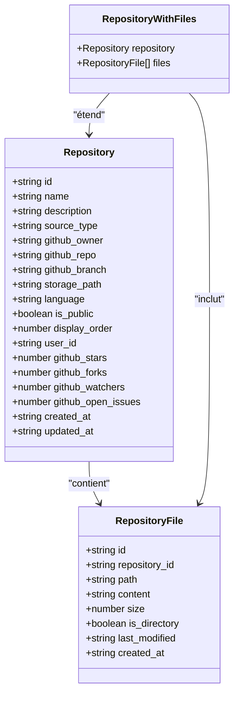
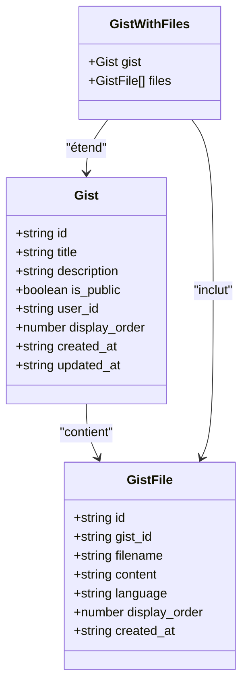
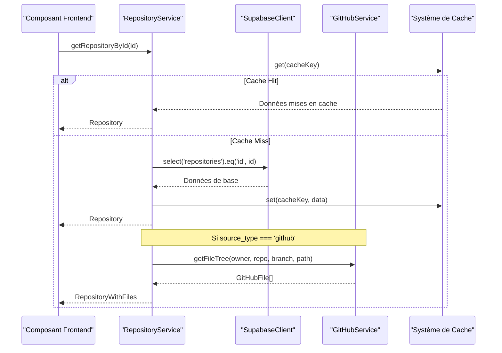
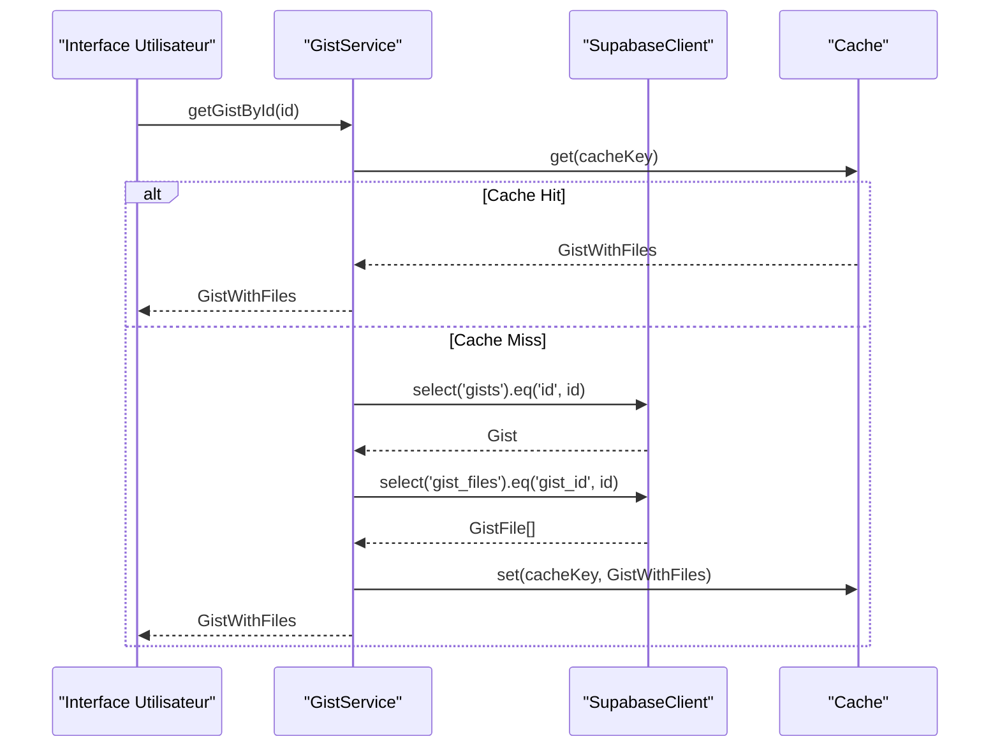
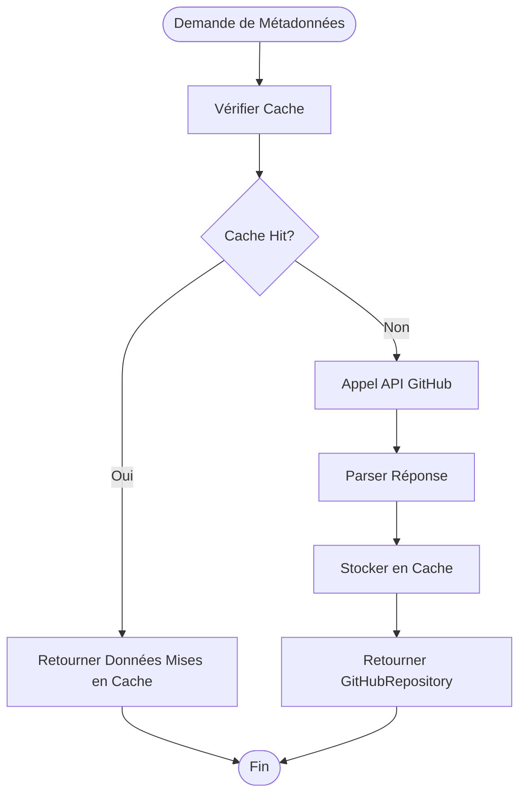
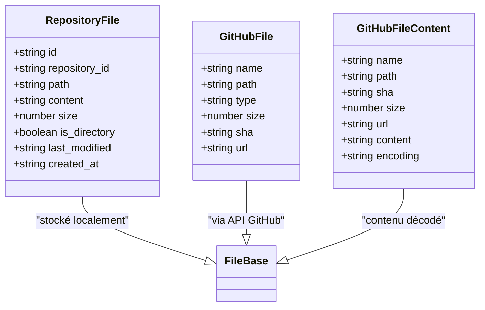
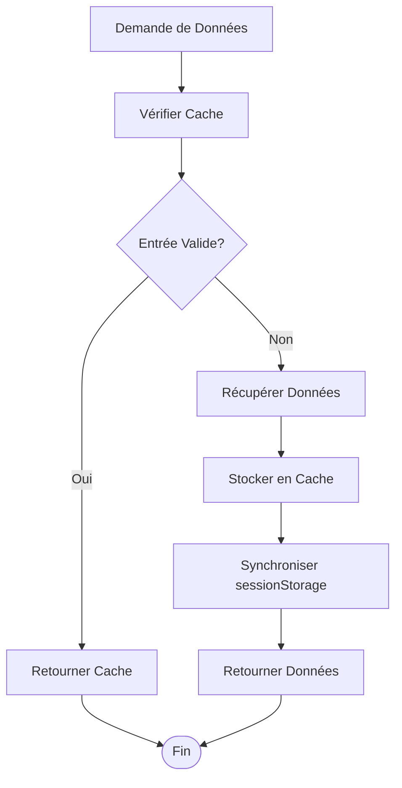

# Modèles Repository et Gist

<cite>
**Fichiers Référencés dans ce Document**
- [repositoryService.ts](file://services/repositoryService.ts)
- [gistService.ts](file://services/gistService.ts)
- [supabaseClient.ts](file://lib/supabaseClient.ts)
- [githubService.ts](file://services/githubService.ts)
- [cache.ts](file://lib/cache.ts)
- [rateLimiter.ts](file://lib/rateLimiter.ts)
- [RepositoryList.tsx](file://components/repositories\RepositoryList.tsx)
- [GistList.tsx](file://components/gists\GistList.tsx)
- [RepositoryDetail.tsx](file://components/repositories\RepositoryDetail.tsx)
- [GistDetail.tsx](file://components/gists\GistDetail.tsx)
</cite>

## Table des Matières
1. [Introduction](#introduction)
2. [Structure des Modèles](#structure-des-modèles)
3. [Architecture des Services](#architecture-des-services)
4. [Intégration GitHub](#intégration-github)
5. [Gestion des Fichiers](#gestion-des-fichiers)
6. [Optimisation et Performance](#optimisation-et-performance)
7. [Considérations de Sécurité](#considérations-de-sécurité)
8. [Exemples d'Utilisation](#exemples-dutilisation)
9. [Guide de Dépannage](#guide-de-dépannage)
10. [Conclusion](#conclusion)

## Introduction

Le système de modèles Repository et Gist constitue le cœur de la gestion des applications dans le portfolio. Ces modèles permettent de représenter et d'interagir avec différents types de projets : les dépôts de code hébergés sur GitHub ou localement, et les Gists (extraits de code) partagés publiquement ou privés.

Le système implémente une architecture robuste basée sur Supabase pour la persistance des données, avec une couche de cache intelligente et une intégration native avec l'API GitHub pour la synchronisation des dépôts externes.

## Structure des Modèles

### Modèle Repository

Le modèle Repository représente un dépôt de code dans le portfolio. Il supporte deux types de sources : locales et GitHub.



**Sources du Diagramme**
- [supabaseClient.ts](file://lib/supabaseClient.ts#L120-L139)
- [supabaseClient.ts](file://lib/supabaseClient.ts#L141-L154)

#### Champs du Modèle Repository

| Champ | Type | Description | Rôle dans l'Intégration GitHub |
|-------|------|-------------|--------------------------------|
| `id` | string | Identifiant unique du dépôt | Clé primaire pour l'association avec les fichiers |
| `name` | string | Nom du dépôt | Affichage et recherche |
| `description` | string \| null | Description du projet | Métadonnées visuelles |
| `source_type` | 'local' \| 'github' | Type de source | Détermine la méthode de récupération des fichiers |
| `github_owner` | string \| null | Propriétaire GitHub | URL de l'API GitHub |
| `github_repo` | string \| null | Nom du dépôt GitHub | URL de l'API GitHub |
| `github_branch` | string \| null | Branche par défaut | Spécification de la version |
| `storage_path` | string \| null | Chemin de stockage local | Accès aux fichiers locaux |
| `language` | string \| null | Langage principal | Classification et filtrage |
| `is_public` | boolean | Visibilité publique | Contrôle d'accès |
| `display_order` | number | Ordre d'affichage | Organisation de l'interface |
| `user_id` | string \| null | Propriétaire | Authentification et autorisation |
| `github_stars` | number \| null | Nombre d'étoiles GitHub | Métriques de popularité |
| `github_forks` | number \| null | Nombre de forks GitHub | Métriques de popularité |
| `github_watchers` | number \| null | Nombre de watchers GitHub | Métriques de popularité |
| `github_open_issues` | number \| null | Nombre d'issues ouvertes | Métriques de maintenance |

**Sources de la Section**
- [supabaseClient.ts](file://lib/supabaseClient.ts#L120-L139)

### Modèle Gist

Le modèle Gist représente un extrait de code partagé, similaire aux Gists GitHub mais avec une gestion personnalisée.



**Sources du Diagramme**
- [supabaseClient.ts](file://lib/supabaseClient.ts#L156-L179)

#### Propriétés du Modèle Gist

| Champ | Type | Description | Cas d'Usage |
|-------|------|-------------|-------------|
| `id` | string | Identifiant unique du Gist | Clé primaire et routage |
| `title` | string \| null | Titre du Gist | Affichage et recherche |
| `description` | string \| null | Description du contenu | Métadonnées |
| `is_public` | boolean | Visibilité publique | Contrôle d'accès |
| `user_id` | string \| null | Propriétaire | Authentification |
| `display_order` | number | Ordre d'affichage | Organisation |
| `created_at` | string | Date de création | Tri chronologique |
| `updated_at` | string | Date de modification | Cache et invalidation |

**Sources de la Section**
- [supabaseClient.ts](file://lib/supabaseClient.ts#L156-L179)

## Architecture des Services

### RepositoryService

Le RepositoryService gère toutes les opérations CRUD pour les dépôts et fournit une abstraction pour l'accès aux fichiers.



**Sources du Diagramme**
- [repositoryService.ts](file://services/repositoryService.ts#L47-L79)
- [repositoryService.ts](file://services/repositoryService.ts#L208-L266)

#### Fonctionnalités Principales

1. **Récupération de dépôts** : Support des caches avec TTL de 5 minutes
2. **Gestion des fichiers** : Accès aux fichiers locaux ou via API GitHub
3. **Validation GitHub** : Vérification de l'existence des dépôts
4. **Upload local** : Import de code depuis des fichiers locaux
5. **Ordre d'affichage** : Gestion dynamique de l'organisation

**Sources de la Section**
- [repositoryService.ts](file://services/repositoryService.ts#L9-L460)

### GistService

Le GistService gère les Gists avec une logique de cache optimisée et une gestion des fichiers associés.



**Sources du Diagramme**
- [gistService.ts](file://services/gistService.ts#L74-L132)

#### Opérations Gist

1. **Création avec fichiers** : Insertion atomique des Gists et fichiers
2. **Mise à jour** : Gestion des fichiers avec suppression puis recréation
3. **Suppression** : Cascade automatique des fichiers liés
4. **Ordre d'affichage** : Mise à jour par lots optimisée

**Sources de la Section**
- [gistService.ts](file://services/gistService.ts#L74-L376)

## Intégration GitHub

### Configuration et Authentification

L'intégration GitHub utilise un token d'API configuré via les variables d'environnement :

```typescript
// Configuration de l'API GitHub
const token = process.env.NEXT_PUBLIC_GITHUB_TOKEN;
const headers: HeadersInit = {
  Accept: 'application/vnd.github.v3+json',
};

if (token) {
  headers.Authorization = `token ${token}`;
}
```

### Récupération des Métadonnées

Le service GitHub fournit des informations enrichies sur les dépôts :



**Sources du Diagramme**
- [githubService.ts](file://services/githubService.ts#L45-L90)

### Gestion des Arborescences de Fichiers

Pour les dépôts GitHub, le système construit une arborescence de fichiers dynamique :

```typescript
// Récupération de l'arborescence des fichiers
const { files, error } = await githubService.getFileTree(
  repository.github_owner,
  repository.github_repo,
  repository.github_branch || 'main',
  path
);
```

**Sources de la Section**
- [repositoryService.ts](file://services/repositoryService.ts#L225-L238)
- [githubService.ts](file://services/githubService.ts#L92-L126)

## Gestion des Fichiers

### RepositoryFile vs GitHubFile

Le système utilise deux types de fichiers selon la source :



**Sources du Diagramme**
- [supabaseClient.ts](file://lib/supabaseClient.ts#L141-L154)
- [githubService.ts](file://services/githubService.ts#L5-L25)

### Stratégies de Stockage

1. **Dépôts Locaux** : Stockage dans Supabase Storage ou table repository_files
2. **Dépôts GitHub** : Accès direct via API avec cache intelligent
3. **Gists** : Stockage dans la base de données avec gestion des métadonnées

**Sources de la Section**
- [repositoryService.ts](file://services/repositoryService.ts#L240-L262)
- [repositoryService.ts](file://services/repositoryService.ts#L306-L326)

## Optimisation et Performance

### Système de Cache

Le cache utilise une approche TTL (Time To Live) avec synchronisation sessionStorage :



**Sources du Diagramme**
- [cache.ts](file://lib/cache.ts#L30-L57)

#### Configuration du Cache

- **TTL par défaut** : 5 minutes
- **Clés de cache** : Structurées avec namespace (`repositories:all`, `gists:123`)
- **Invalidation** : Par pattern ou clé spécifique
- **Stockage** : SessionStorage pour la persistance entre sessions

**Sources de la Section**
- [cache.ts](file://lib/cache.ts#L1-L210)

### Rate Limiting

Le système implémente un rate limiting côté client pour prévenir les abus :

```typescript
// Configuration par défaut
rateLimiter.configure('create', {
  maxRequests: 10,
  windowMs: 60 * 1000, // 1 minute
});

rateLimiter.configure('update', {
  maxRequests: 20,
  windowMs: 60 * 1000, // 1 minute
});
```

**Sources de la Section**
- [rateLimiter.ts](file://lib/rateLimiter.ts#L160-L172)

### Optimisations Frontend

1. **Lazy Loading** : Composants chargés dynamiquement
2. **Skeleton Loading** : Interfaces réactives pendant le chargement
3. **Recherche et Filtrage** : Traitement côté client pour la réactivité
4. **Pagination** : Chargement progressif des données

**Sources de la Section**
- [RepositoryList.tsx](file://components/repositories\RepositoryList.tsx#L12-L18)
- [GistList.tsx](file://components/gists\GistList.tsx#L12-L18)

## Considérations de Sécurité

### Contrôle d'Accès

1. **Authentification** : Requiert connexion pour les opérations CRUD
2. **Autorisation** : Vérification des permissions utilisateur
3. **Validation** : Validation côté serveur des données d'entrée

```typescript
// Exemple de vérification d'authentification
const { data: { user }, error: authError } = await supabaseClient.auth.getUser();
if (authError || !user) {
  return {
    repository: null,
    error: {
      message: 'Vous devez être connecté pour créer un dépôt',
      code: 'NOT_AUTHENTICATED',
      hint: 'Connectez-vous depuis la page /login'
    }
  };
}
```

**Sources de la Section**
- [repositoryService.ts](file://services/repositoryService.ts#L107-L120)
- [gistService.ts](file://services/gistService.ts#L152-L165)

### Validation des Entrées

1. **TypeScript** : Typage strict pour la sécurité
2. **Validation côté serveur** : Protection contre les attaques
3. **Nettoyage des données** : Prévention XSS et injection

### Sécurité des Fichiers

1. **Validation des extensions** : Limitation des types de fichiers
2. **Taille des fichiers** : Limites pour éviter les attaques par déni
3. **Contenu des fichiers** : Scan potentiel pour malwares

**Sources de la Section**
- [repositoryService.ts](file://services/repositoryService.ts#L366-L391)

## Exemples d'Utilisation

### Récupération d'un Dépôt avec Fichiers

```typescript
// Exemple d'utilisation du RepositoryService
const { repository, error } = await repositoryService.getRepositoryById('depot-id');

if (repository && repository.source_type === 'github') {
  // Récupérer les fichiers depuis GitHub
  const { files, error: filesError } = await repositoryService.getRepositoryFiles(
    repository.id,
    'src/components'
  );
  
  if (!filesError && files) {
    // Traiter les fichiers récupérés
    console.log('Fichiers trouvés:', files.length);
  }
}
```

### Création d'un Gist

```typescript
// Exemple de création de Gist
const { gist, error } = await gistService.createGist({
  title: 'Exemple de Gist',
  description: 'Un exemple de code partagé',
  is_public: true,
  files: [
    {
      filename: 'script.js',
      content: '// Code JavaScript',
      language: 'javascript'
    }
  ],
  display_order: 0
});
```

### Requête pour Récupérer des Dépôts avec Fichiers

```typescript
// Récupération complète avec cache
const { repositories, error } = await repositoryService.getAllRepositories();

if (repositories) {
  // Pour chaque dépôt, récupérer les fichiers
  const reposWithFiles = await Promise.all(
    repositories.map(async (repo) => {
      const { files, error: filesError } = await repositoryService.getRepositoryFiles(repo.id);
      if (!filesError && files) {
        return { ...repo, files };
      }
      return repo;
    })
  );
  
  console.log('Dépôts avec fichiers:', reposWithFiles);
}
```

**Sources de la Section**
- [repositoryService.ts](file://services/repositoryService.ts#L13-L460)
- [gistService.ts](file://services/gistService.ts#L134-L221)

## Guide de Dépannage

### Problèmes Courants

#### 1. Erreur d'Authentification GitHub

**Symptôme** : `GitHub repository information missing`
**Solution** : Vérifier la configuration des variables d'environnement et les permissions du token

#### 2. Cache Invalide

**Symptôme** : Données obsolètes
**Solution** : Utiliser le bouton de rafraîchissement ou invalider manuellement le cache

#### 3. Rate Limiting

**Symptôme** : Erreurs 429 (Too Many Requests)
**Solution** : Attendre la période de refroidissement ou augmenter les limites

### Diagnostic et Monitoring

```typescript
// Exemple de logging pour le diagnostic
logger.error('Failed to fetch repository', error, { id });
logger.debug('Repositories cached', { count: data.length });
```

**Sources de la Section**
- [repositoryService.ts](file://services/repositoryService.ts#L227-L229)
- [cache.ts](file://lib/cache.ts#L101-L161)

## Conclusion

Les modèles Repository et Gist constituent un système robuste et performant pour la gestion des applications dans le portfolio. Leur conception modulaire, combinée avec le système de cache intelligent et les optimisations de performance, garantit une expérience utilisateur fluide tout en maintenant la sécurité et la fiabilité.

Les points forts incluent :

- **Flexibilité** : Support des dépôts locaux et GitHub
- **Performance** : Cache intelligent avec TTL et invalidation automatique
- **Sécurité** : Contrôle d'accès et validation des données
- **Extensibilité** : Architecture modulaire pour les futures améliorations

Cette architecture permet de gérer efficacement une collection variée de projets tout en offrant une interface utilisateur réactive et performante.