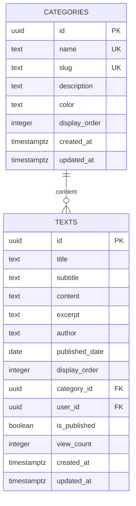
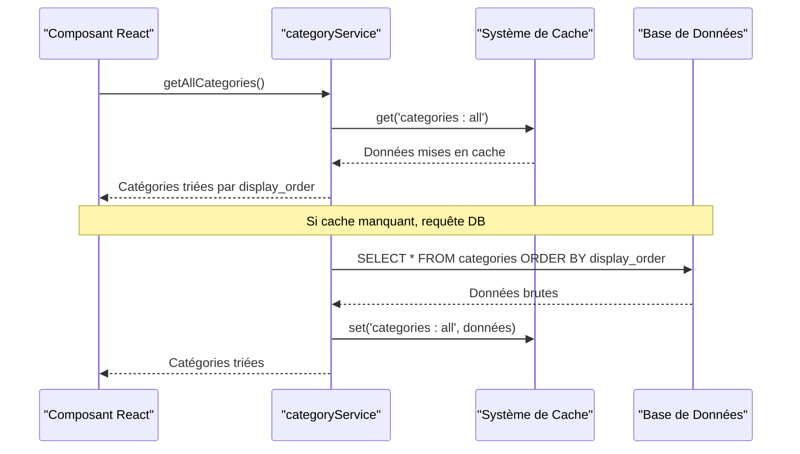
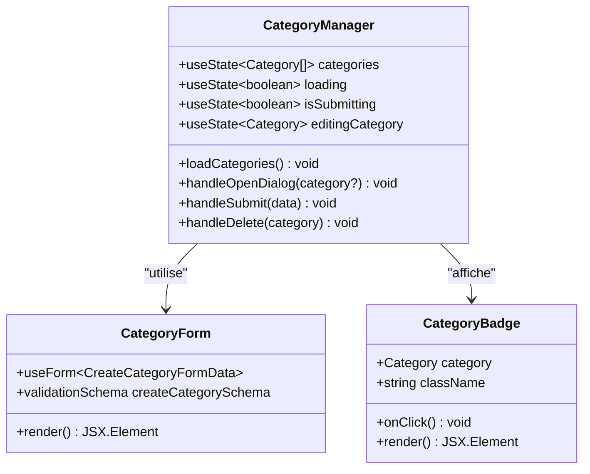
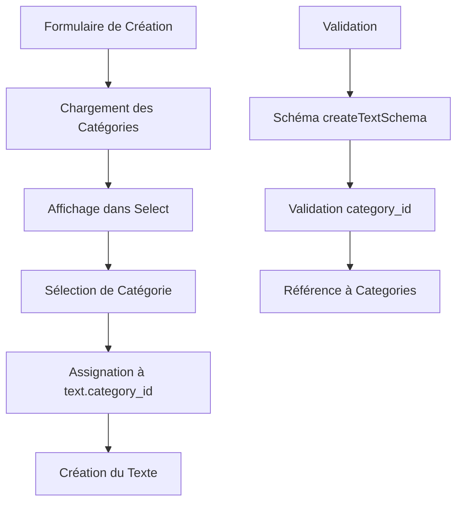
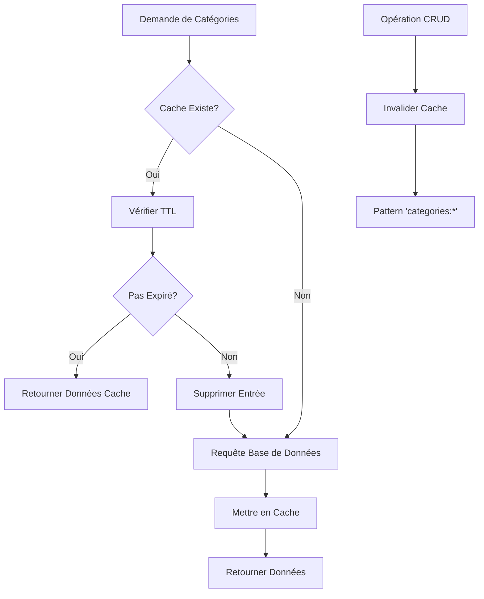

# Modèle Category

<cite>
**Fichiers Référencés dans ce Document**
- [categoryService.ts](file://services/categoryService.ts)
- [CategoryManager.tsx](file://components/texts/CategoryManager.tsx)
- [TextUploadForm.tsx](file://components/texts/TextUploadForm.tsx)
- [CategoryBadge.tsx](file://components/texts/CategoryBadge.tsx)
- [supabaseClient.ts](file://lib/supabaseClient.ts)
- [validators.ts](file://lib/validators.ts)
- [cache.ts](file://lib/cache.ts)
- [20250107_create_texts_system.sql](file://supabase/migrations/20250107_create_texts_system.sql)
- [20250107_create_texts_system_v2.sql](file://supabase/migrations/20250107_create_texts_system_v2.sql)
</cite>

## Table des Matières
1. [Introduction](#introduction)
2. [Structure du Modèle](#structure-du-modèle)
3. [Architecture de la Base de Données](#architecture-de-la-base-de-données)
4. [Service Category](#service-category)
5. [Composants React](#composants-react)
6. [Gestion du Cache](#gestion-du-cache)
7. [Sécurité et Contraintes](#sécurité-et-contraintes)
8. [Exemples d'Utilisation](#exemples-dutilisation)
9. [Bonnes Pratiques](#bonnes-pratiques)
10. [Conclusion](#conclusion)

## Introduction

Le modèle Category constitue le cœur de la classification hiérarchique des textes dans cette application. Contrairement au système de tagging généralisé basé sur des tags, les catégories offrent une organisation structurée et hiérarchique des contenus textuels, permettant une navigation et une recherche plus intuitive.

Le système de catégories implémente une approche de classification unique où chaque texte ne peut être associé qu'à une seule catégorie à la fois, contrairement aux tags multiples. Cette distinction fondamentale permet une organisation plus stricte et une meilleure expérience utilisateur pour la navigation dans le contenu.

## Structure du Modèle

Le modèle Category définit une entité de classification avec les champs suivants :

### Champs Principaux

| Champ | Type | Contraintes | Description |
|-------|------|-------------|-------------|
| `id` | UUID | Clé primaire, auto-généré | Identifiant unique de la catégorie |
| `name` | TEXT | Non-null, unique | Nom affiché de la catégorie |
| `slug` | TEXT | Non-null, unique | URL-friendly identifiant pour les liens directs |
| `description` | TEXT | Optionnel | Description détaillée de la catégorie |
| `color` | TEXT | Défaut : '#3b82f6' | Couleur hexadécimale pour l'interface utilisateur |
| `display_order` | INTEGER | Non-null, défaut : 0 | Ordre de tri personnalisé pour l'affichage |

### Champs de Métadonnées

| Champ | Type | Description |
|-------|------|-------------|
| `created_at` | TIMESTAMPTZ | Timestamp de création automatique |
| `updated_at` | TIMESTAMPTZ | Timestamp de mise à jour automatique |

**Sources de section**
- [supabaseClient.ts](file://lib/supabaseClient.ts#L42-L50)
- [20250107_create_texts_system.sql](file://supabase/migrations/20250107_create_texts_system.sql#L8-L17)

## Architecture de la Base de Données

### Schéma Relationnel



**Sources de diagramme**
- [20250107_create_texts_system.sql](file://supabase/migrations/20250107_create_texts_system.sql#L8-L76)

### Index et Performances

Le système utilise plusieurs index pour optimiser les performances :

- **Index sur `slug`** : Accès rapide par identifiant URL
- **Index sur `display_order`** : Tri efficace des catégories
- **Index sur `name`** : Recherche par nom (pour les tags)

### Fonctions Utilitaires

Le système inclut des fonctions PostgreSQL pour la génération automatique des slugs :

```sql
-- Fonction de génération de slug améliorée
CREATE OR REPLACE FUNCTION generate_slug(input_name TEXT)
RETURNS TEXT AS $$
DECLARE
  slug TEXT;
BEGIN
  -- Logique de normalisation avec gestion des caractères spéciaux
  -- Retourne un slug valide ou un identifiant aléatoire si échec
END;
$$ LANGUAGE plpgsql IMMUTABLE;
```

**Sources de section**
- [20250107_create_texts_system.sql](file://supabase/migrations/20250107_create_texts_system.sql#L228-L262)
- [20250107_create_texts_system_v2.sql](file://supabase/migrations/20250107_create_texts_system_v2.sql#L21-L54)

## Service Category

Le service `categoryService` fournit une interface TypeScript pour interagir avec les catégories via Supabase.

### Opérations CRUD

#### Récupération des Données



**Sources de diagramme**
- [categoryService.ts](file://services/categoryService.ts#L5-L27)

#### Méthodes Principales

| Méthode | Paramètres | Description |
|---------|------------|-------------|
| `getAllCategories()` | Aucun | Récupère toutes les catégories triées par ordre d'affichage |
| `getCategoryById(id)` | id: string | Récupère une catégorie spécifique par son identifiant |
| `getCategoryBySlug(slug)` | slug: string | Récupère une catégorie par son identifiant URL |
| `createCategory(data)` | data: Category | Crée une nouvelle catégorie avec gestion du display_order |
| `updateCategory(id, updates)` | id: string, updates: Partial<Category> | Met à jour une catégorie existante |
| `deleteCategory(id)` | id: string | Supprime une catégorie (liaisons textes maintenues) |
| `getMaxDisplayOrder()` | Aucun | Récupère l'ordre maximal pour l'insertion nouvelle catégorie |

### Gestion du Display Order

La méthode `getMaxDisplayOrder()` assure l'insertion ordonnée des nouvelles catégories :

```typescript
async getMaxDisplayOrder() {
  const { data, error } = await supabaseClient
    .from('categories')
    .select('display_order')
    .order('display_order', { ascending: false })
    .limit(1)
    .maybeSingle();
  
  return { maxOrder: data?.display_order ?? -1, error };
}
```

Cette approche garantit que chaque nouvelle catégorie reçoit un `display_order` unique et ordonné.

**Sources de section**
- [categoryService.ts](file://services/categoryService.ts#L1-L115)

## Composants React

### CategoryManager

Le composant `CategoryManager` constitue l'interface d'administration des catégories :



**Sources de diagramme**
- [CategoryManager.tsx](file://components/texts/CategoryManager.tsx#L32-L342)

#### Fonctionnalités Principales

- **Interface de gestion** : Création, modification et suppression de catégories
- **Validation** : Schémas Zod pour la validation côté client
- **Gestion des couleurs** : Sélecteur de couleur HSL avec prévisualisation
- **Ordre d'affichage** : Gestion automatique du `display_order`

### TextUploadForm

Le formulaire d'upload de texte intègre les catégories dans le processus de création :



**Sources de diagramme**
- [TextUploadForm.tsx](file://components/texts/TextUploadForm.tsx#L246-L268)

### CategoryBadge

Le composant `CategoryBadge` affiche visuellement une catégorie :

```typescript
export function CategoryBadge({ category, className = '', onClick }: CategoryBadgeProps) {
  const style = {
    backgroundColor: `hsl(${category.color})`,
    borderColor: `hsl(${category.color})`,
  };

  return (
    <Badge variant="outline" style={style} onClick={onClick}>
      {category.name}
    </Badge>
  );
}
```

**Sources de section**
- [CategoryManager.tsx](file://components/texts/CategoryManager.tsx#L32-L342)
- [TextUploadForm.tsx](file://components/texts/TextUploadForm.tsx#L246-L268)
- [CategoryBadge.tsx](file://components/texts/CategoryBadge.tsx#L12-L28)

## Gestion du Cache

Le système de cache optimise les performances en évitant les requêtes répétées vers la base de données.

### Stratégie de Cache



**Sources de diagramme**
- [cache.ts](file://lib/cache.ts#L1-L211)

### Configuration du Cache

- **TTL** : 10 minutes pour les catégories
- **Stockage** : Session storage pour la persistance
- **Invalidation** : Pattern matching pour la cohérence

### Mécanisme d'Invalidation

Lors des opérations CRUD, le cache est invalidé pour maintenir la cohérence :

```typescript
// Dans categoryService
if (!error) {
  // Invalidation du cache des catégories et des textes
  cache.invalidatePattern('categories:');
  cache.invalidatePattern('texts:');
}
```

**Sources de section**
- [categoryService.ts](file://services/categoryService.ts#L63-L67)
- [cache.ts](file://lib/cache.ts#L82-L106)

## Sécurité et Contraintes

### Row Level Security (RLS)

Le système implémente des politiques de sécurité au niveau de la base de données :

#### Politiques pour Categories

| Opération | Politique | Description |
|-----------|-----------|-------------|
| SELECT | `USING (true)` | Lecture publique pour tous |
| INSERT | `WITH CHECK (auth.role() = 'authenticated')` | Création réservée aux authentifiés |
| UPDATE | `USING (auth.role() = 'authenticated')` | Modification réservée aux authentifiés |
| DELETE | `USING (auth.role() = 'authenticated')` | Suppression réservée aux authentifiés |

#### Contraintes de Base de Données

- **Unicité** : `name` et `slug` doivent être uniques
- **Validation** : `display_order` doit être non-négatif
- **Couleur** : Format hexadécimal valide
- **Intégrité référentielle** : `ON DELETE SET NULL` pour les liaisons textes

### Validation Côté Client

Le système utilise Zod pour la validation côté client :

```typescript
export const categorySchema = z.object({
  name: z.string()
    .min(1, 'Le nom est requis')
    .max(100, 'Le nom ne peut pas dépasser 100 caractères')
    .trim(),
  description: z.string().max(500, 'La description trop longue').optional(),
  color: hexColorSchema.default('#3b82f6'),
  display_order: z.number().int().nonnegative().default(0),
});
```

**Sources de section**
- [20250107_create_texts_system.sql](file://supabase/migrations/20250107_create_texts_system.sql#L124-L140)
- [validators.ts](file://lib/validators.ts#L105-L124)

## Exemples d'Utilisation

### Récupération des Catégories Triées

```typescript
// Dans categoryService
const { categories, error } = await categoryService.getAllCategories();
// Retourne : [{id, name, slug, description, color, display_order}, ...]
// Trié par display_order ASC
```

### Recherche par Slug

```typescript
// Dans TextUploadForm
const { category } = await categoryService.getCategoryBySlug('developpement');
// Utilisé pour pré-sélectionner la catégorie dans le formulaire
```

### Création d'une Nouvelle Catégorie

```typescript
// Dans CategoryManager
const { maxOrder } = await categoryService.getMaxDisplayOrder();
const { category, error } = await categoryService.createCategory({
  name: 'Nouvelle Catégorie',
  description: 'Description de la catégorie',
  color: '#3b82f6',
  display_order: (maxOrder ?? -1) + 1,
});
```

### Mise à Jour de l'Ordre d'Affichage

```typescript
// Pour réorganiser les catégories
const { category, error } = await categoryService.updateCategory(
  categoryId, 
  { display_order: newOrder }
);
```

### Validation des Couleurs

Le système valide les couleurs selon différents formats :

- **Pour les catégories** : Format HSL (`"210 100% 50%"`)
- **Pour les tags** : Format hexadécimal (`"#3b82f6"`)

**Sources de section**
- [categoryService.ts](file://services/categoryService.ts#L5-L115)
- [validators.ts](file://lib/validators.ts#L8-L32)

## Bonnes Pratiques

### Gestion des Slugs Uniques

1. **Génération Automatique** : Le système génère automatiquement les slugs à partir du nom
2. **Fallback Aléatoire** : En cas d'échec, un identifiant aléatoire est généré
3. **Validation** : Vérification de l'unicité avant insertion

### Validation des Couleurs

1. **Formats Spécifiques** : Différents formats selon le contexte (HSL pour catégories, hex pour tags)
2. **Prévalidation** : Validation côté client avant envoi
3. **Rétrocompatibilité** : Valeurs par défaut pour les nouveaux champs

### Cohérence du Cache

1. **Invalidation Systématique** : Toujours invalider le cache après modification
2. **Pattern Matching** : Utiliser des patterns pour l'invalidation groupée
3. **TTL Approprié** : Équilibrer performance et fraîcheur des données

### Sécurité des Opérations

1. **RLS Activé** : Toutes les tables ont des politiques de sécurité
2. **Validation Multi-niveaux** : Client + Serveur + Base de Données
3. **Contrôle d'accès** : Limité aux utilisateurs authentifiés pour les opérations CRUD

### Optimisation des Performances

1. **Index Appropriés** : Index sur les champs fréquemment consultés
2. **Cache Intelligent** : TTL adaptatif selon la fréquence de changement
3. **Lazy Loading** : Chargement différé des données non critiques

## Conclusion

Le modèle Category représente une solution robuste et bien architecturée pour la classification hiérarchique des textes. Son design équilibre efficacement les besoins fonctionnels, la performance et la sécurité.

### Points Forts

- **Organisation Structurée** : Classification unique et hiérarchique
- **Performance Optimisée** : Cache intelligent et index appropriés
- **Sécurité Robuste** : RLS complète et validation multi-niveaux
- **Expérience Utilisateur** : Interface intuitive et feedback immédiat

### Évolutions Potentielles

- **Sous-catégories** : Extension vers une hiérarchie multi-niveaux
- **Import/Export** : Fonctionnalités d'exportation des catégories
- **Recommandations** : Système de recommandation basé sur les catégories

Cette implémentation démontre une approche mature de la gestion de contenu structuré, prête à évoluer avec les besoins futurs de l'application.