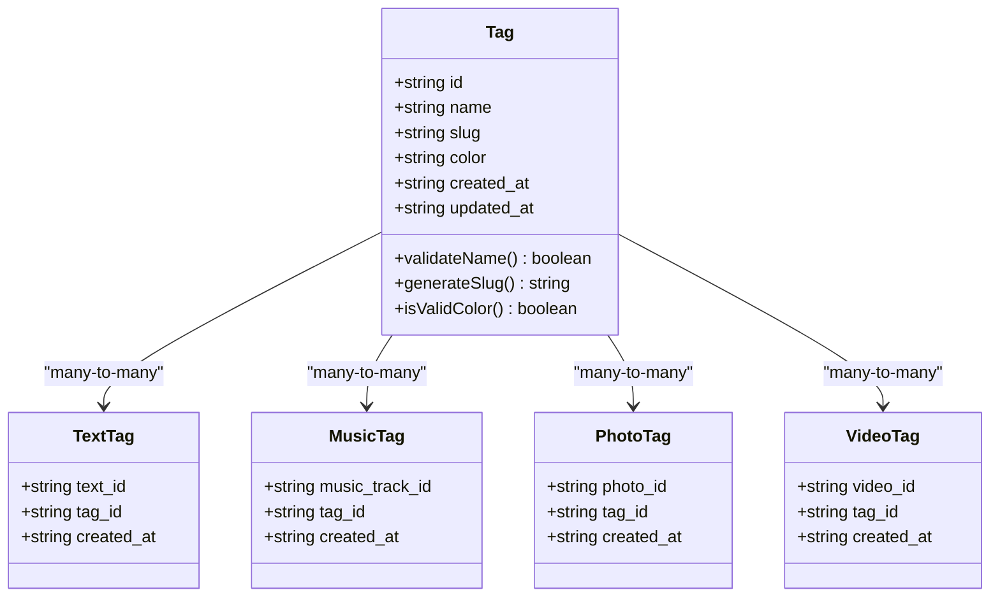
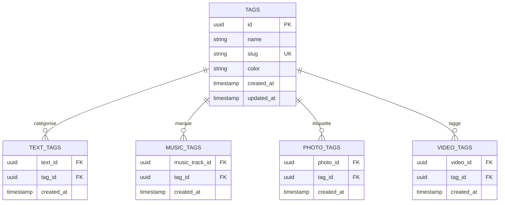
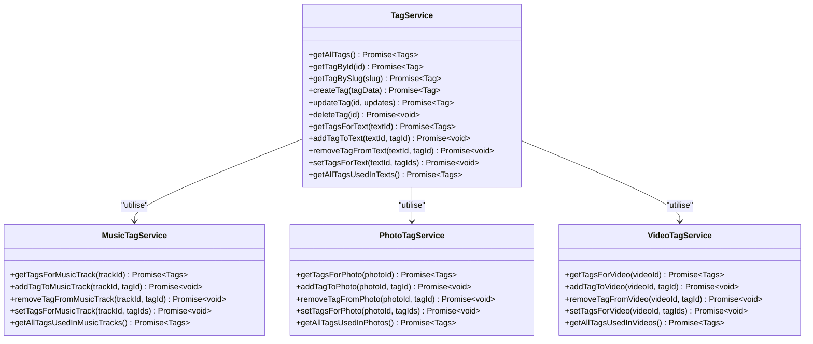
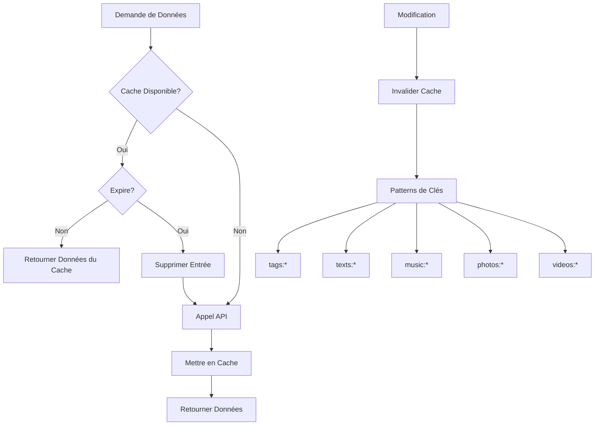
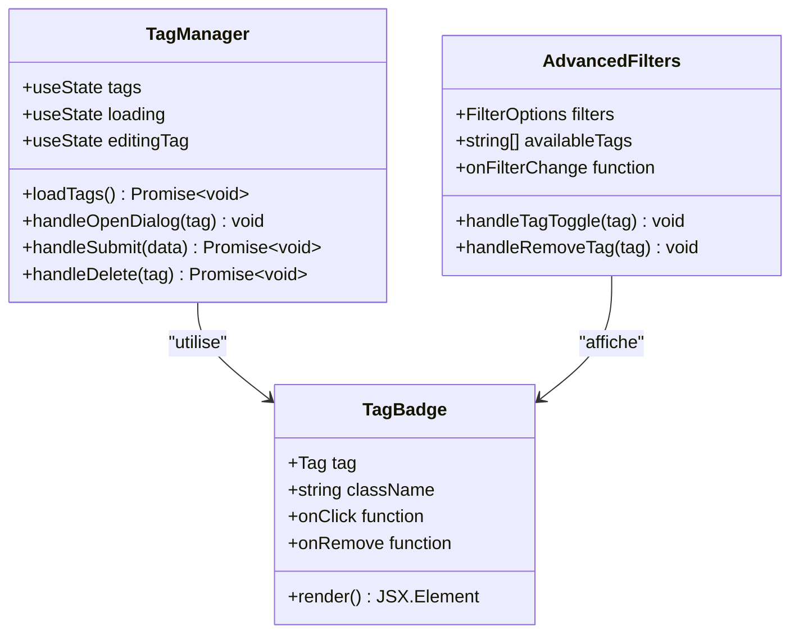

# Modèle Tag

<cite>
**Fichiers Référencés dans ce Document**
- [services/tagService.ts](file://services/tagService.ts)
- [services/musicTagService.ts](file://services/musicTagService.ts)
- [services/photoTagService.ts](file://services/photoTagService.ts)
- [services/videoTagService.ts](file://services/videoTagService.ts)
- [lib/supabaseClient.ts](file://lib/supabaseClient.ts)
- [lib/validators.ts](file://lib/validators.ts)
- [lib/cache.ts](file://lib/cache.ts)
- [components/texts/TagManager.tsx](file://components/texts/TagManager.tsx)
- [components/texts/TagBadge.tsx](file://components/texts/TagBadge.tsx)
- [components/AdvancedFilters.tsx](file://components/AdvancedFilters.tsx)
- [components/texts/TextCard.tsx](file://components/texts/TextCard.tsx)
- [supabase/migrations/002_add_media_tags.sql](file://supabase/migrations/002_add_media_tags.sql)
</cite>

## Table des Matières
1. [Introduction](#introduction)
2. [Structure du Modèle Tag](#structure-du-modèle-tag)
3. [Architecture Polymorphique](#architecture-polymorphique)
4. [Services de Gestion des Tags](#services-de-gestion-des-tags)
5. [Implémentation du Cache](#implémentation-du-cache)
6. [Composants React](#composants-react)
7. [Bonnes Pratiques](#bonnes-pratiques)
8. [Cas d'Usage Concrets](#cas-dusage-concrets)
9. [Optimisations de Performance](#optimisations-de-performance)
10. [Conclusion](#conclusion)

## Introduction

Le système de tags dans cette application permet une organisation flexible et polymorphique du contenu multimédia. Le modèle Tag constitue le cœur de cette fonctionnalité, offrant une approche unifiée pour catégoriser et filtrer différents types de médias : textes, musiques, photos et vidéos. Cette architecture polymorphe facilite la gestion centralisée des classifications tout en maintenant la spécialisation nécessaire pour chaque type de contenu.

## Structure du Modèle Tag

Le modèle Tag est défini dans le client Supabase avec les champs suivants :



**Sources du Diagramme**
- [lib/supabaseClient.ts](file://lib/supabaseClient.ts#L53-L60)
- [supabase/migrations/002_add_media_tags.sql](file://supabase/migrations/002_add_media_tags.sql#L1-L46)

### Détails des Champs

| Champ | Type | Contraintes | Description |
|-------|------|-------------|-------------|
| `id` | UUID | Clé primaire, auto-généré | Identifiant unique du tag |
| `name` | Texte | Requis, max 50 caractères | Nom affichable du tag |
| `slug` | Texte | Unique, auto-généré | Identifiant URL-friendly |
| `color` | Texte | Hexadécimal valide | Couleur d'affichage du tag |
| `created_at` | Timestamp | Auto-généré | Date de création |
| `updated_at` | Timestamp | Auto-mis à jour | Date de dernière modification |

**Sources de Section**
- [lib/supabaseClient.ts](file://lib/supabaseClient.ts#L53-L60)
- [lib/validators.ts](file://lib/validators.ts#L138-L148)

## Architecture Polymorphique

L'architecture polymorphique du système de tags repose sur des tables de jointure spécialisées pour chaque type de contenu. Cette approche permet une flexibilité maximale tout en maintenant l'intégrité référentielle.



**Sources du Diagramme**
- [supabase/migrations/002_add_media_tags.sql](file://supabase/migrations/002_add_media_tags.sql#L7-L46)

### Avantages de l'Architecture Polymorphique

1. **Spécialisation par Type** : Chaque type de contenu peut avoir ses propres règles et métadonnées
2. **Intégrité Référentielle** : Garantit la cohérence des données via les contraintes de clé étrangère
3. **Évolutivité** : Facilite l'ajout de nouvelles catégories sans modifier la structure existante
4. **Performance** : Requêtes optimisées grâce aux index appropriés

**Sources de Section**
- [supabase/migrations/002_add_media_tags.sql](file://supabase/migrations/002_add_media_tags.sql#L1-L46)

## Services de Gestion des Tags

Le système utilise plusieurs services spécialisés pour gérer les tags de manière cohérente et performante.

### Service Principal : tagService.ts

Le service principal fournit des opérations CRUD universelles et des méthodes spécialisées :



**Sources du Diagramme**
- [services/tagService.ts](file://services/tagService.ts#L4-L197)
- [services/musicTagService.ts](file://services/musicTagService.ts#L3-L106)
- [services/photoTagService.ts](file://services/photoTagService.ts#L3-L106)
- [services/videoTagService.ts](file://services/videoTagService.ts#L3-L106)

### Opérations CRUD Principales

#### Création de Tags
- Validation des données via Zod
- Génération automatique du slug
- Vérification de l'unicité des noms et slugs

#### Mise à Jour
- Invalidation intelligente du cache
- Maintien de la cohérence des données
- Tracking des modifications

#### Suppression
- Cascade automatique via les contraintes ON DELETE CASCADE
- Invalidation des caches concernés

**Sources de Section**
- [services/tagService.ts](file://services/tagService.ts#L50-L98)

### Méthodes Spécialisées

#### Récupération de Tags Associés
Chaque service spécialisé fournit des méthodes pour récupérer les tags associés à un élément spécifique :

```typescript
// Exemple de requête pour récupérer les tags d'un texte
const { data, error } = await supabaseClient
  .from('text_tags')
  .select('tag_id, tags(*)')
  .eq('text_id', textId);
```

#### Gestion des Relations Multiples
Les méthodes `setTagsFor*` permettent de définir l'ensemble complet des tags pour un élément, en remplaçant automatiquement les tags existants.

**Sources de Section**
- [services/tagService.ts](file://services/tagService.ts#L102-L159)
- [services/musicTagService.ts](file://services/musicTagService.ts#L7-L71)
- [services/photoTagService.ts](file://services/photoTagService.ts#L7-L71)
- [services/videoTagService.ts](file://services/videoTagService.ts#L7-L71)

## Implémentation du Cache

Le système utilise un cache intelligent avec invalidation automatique pour optimiser les performances.

### Architecture du Cache



**Sources du Diagramme**
- [lib/cache.ts](file://lib/cache.ts#L17-L211)

### Stratégies d'Invalidation

Le cache utilise plusieurs stratégies d'invalidation :

1. **Invalidation par Clé Exacte** : Suppression d'une entrée spécifique
2. **Invalidation par Pattern** : Suppression de toutes les clés contenant un motif
3. **Invalidation Intelligente** : Ciblage précis selon le type d'opération

### Configuration du Cache

| Paramètre | Valeur | Description |
|-----------|--------|-------------|
| TTL par défaut | 10 minutes | Temps de vie des entrées |
| Stockage | Session | Persistance entre sessions |
| Synchronisation | Automatique | Sync avec sessionStorage |

**Sources de Section**
- [lib/cache.ts](file://lib/cache.ts#L17-L211)
- [services/tagService.ts](file://services/tagService.ts#L5-L27)

## Composants React

Les composants React implémentent l'interface utilisateur pour la gestion des tags.

### TagManager

Le composant TagManager fournit une interface d'administration complète pour les tags :



**Sources du Diagramme**
- [components/texts/TagManager.tsx](file://components/texts/TagManager.tsx#L42-L339)
- [components/texts/TagBadge.tsx](file://components/texts/TagBadge.tsx#L15-L53)
- [components/AdvancedFilters.tsx](file://components/AdvancedFilters.tsx#L64-L301)

### Fonctionnalités du TagManager

1. **Interface de Création/Mise à Jour** : Formulaire complet avec validation
2. **Gestion des Couleurs** : Sélecteur de couleur avec préréglages
3. **Validation en Temps Réel** : Feedback immédiat des erreurs
4. **Gestion des Erreurs** : Affichage clair des problèmes
5. **Interface de Suppression** : Confirmation avant suppression

### TagBadge

Le composant TagBadge affiche un tag avec sa couleur et options de suppression :

```typescript
// Exemple d'utilisation du TagBadge
<TagBadge
  tag={tag}
  variant="secondary"
  onClick={() => handleTagClick(tag)}
  onRemove={() => handleRemoveTag(tag)}
/>
```

### AdvancedFilters

Le composant AdvancedFilters intègre les tags dans le système de filtres avancés :

- **Sélection Multi-tags** : Possibilité de filtrer par plusieurs tags
- **Affichage des Tags Actifs** : Tags sélectionnés visibles en haut
- **Interface Pliable** : Interface utilisateur optimisée

**Sources de Section**
- [components/texts/TagManager.tsx](file://components/texts/TagManager.tsx#L42-L339)
- [components/texts/TagBadge.tsx](file://components/texts/TagBadge.tsx#L15-L53)
- [components/AdvancedFilters.tsx](file://components/AdvancedFilters.tsx#L64-L301)

## Bonnes Pratiques

### Génération des Slugs

La génération des slugs suit ces principes :

1. **Normalisation** : Conversion en minuscules, suppression des accents
2. **Nettoyage** : Suppression des caractères spéciaux non autorisés
3. **Unicité** : Vérification et ajout de suffixes si nécessaire
4. **Longueur** : Limitation à 50 caractères maximum

### Validation des Couleurs

La validation des couleurs utilise des expressions régulières strictes :

```typescript
// Format hexadécimal valide
const hexColorSchema = z.string().refine(
  (val) => /^#([A-Fa-f0-9]{6}|[A-Fa-f0-9]{3})$/.test(val),
  { message: 'Couleur hexadécimale invalide' }
);
```

### Optimisation des Performances

1. **Cache Intelligent** : TTL configurable et invalidation par pattern
2. **Lazy Loading** : Chargement différé des données non critiques
3. **Pagination** : Limitation du nombre d'éléments retournés
4. **Indexation** : Utilisation d'index appropriés dans la base de données

**Sources de Section**
- [lib/validators.ts](file://lib/validators.ts#L27-L32)
- [lib/cache.ts](file://lib/cache.ts#L17-L211)

## Cas d'Usage Concrets

### 1. Organisation des Textes Publiés

Pour récupérer tous les tags utilisés dans les textes publiés :

```typescript
// Service tagService.ts
async getAllTagsUsedInTexts() {
  const { data, error } = await supabaseClient
    .from('texts')
    .select(`
      text_tags(tag:tags(*))
    `)
    .eq('is_published', true);
  
  // Traitement et tri des tags uniques
  const tagMap = new Map<string, Tag>();
  data.forEach((text: any) => {
    if (text.text_tags) {
      text.text_tags.forEach((tt: any) => {
        if (tt.tag && !tagMap.has(tt.tag.id)) {
          tagMap.set(tt.tag.id, tt.tag);
        }
      });
    }
  });
  
  return Array.from(tagMap.values())
    .sort((a, b) => a.name.localeCompare(b.name));
}
```

### 2. Filtrage par Tags dans AdvancedFilters

Le composant AdvancedFilters utilise les tags pour créer des filtres avancés :

```typescript
// Gestion de la sélection de tags
const handleTagToggle = (tag: string) => {
  const newTags = filters.tags.includes(tag)
    ? filters.tags.filter((t) => t !== tag)
    : [...filters.tags, tag];
  onFilterChange('tags', newTags);
};

// Affichage des tags disponibles
<div className="flex flex-wrap gap-2">
  {availableTags.map((tag) => (
    <Badge
      key={tag}
      variant={filters.tags.includes(tag) ? 'default' : 'outline'}
      onClick={() => handleTagToggle(tag)}
    >
      {tag}
    </Badge>
  ))}
</div>
```

### 3. Gestion des Tags dans TextCard

Les cartes de texte affichent les tags associés :

```typescript
// Affichage des tags dans TextCard
<CardContent className="space-y-3">
  {text.tags && text.tags.length > 0 && (
    <div className="flex flex-wrap gap-2">
      {text.tags.map((tag) => (
        <TagBadge key={tag.id} tag={tag} variant="secondary" />
      ))}
    </div>
  )}
</CardContent>
```

**Sources de Section**
- [services/tagService.ts](file://services/tagService.ts#L165-L195)
- [components/AdvancedFilters.tsx](file://components/AdvancedFilters.tsx#L66-L78)
- [components/texts/TextCard.tsx](file://components/texts/TextCard.tsx#L56-L83)

## Optimisations de Performance

### Stratégies de Cache

1. **TTL Optimisé** : 10 minutes pour les tags (fréquemment consultés)
2. **Invalidation Ciblée** : Invalidation par pattern plutôt que globale
3. **Stockage Session** : Persistance entre rechargements de page
4. **Synchronisation Asynchrone** : Écriture en arrière-plan

### Optimisations Base de Données

1. **Index Appropriés** : Index sur les colonnes de jointure
2. **Jointures Optimisées** : Utilisation de selects explicites
3. **Limitation des Colonnes** : Sélection seulement des colonnes nécessaires
4. **Pagination** : Limitation des résultats pour les grandes collections

### Optimisations Réseau

1. **Compression** : Utilisation de gzip pour les réponses
2. **CORS Optimisé** : Configuration appropriée pour les requêtes
3. **Retry Logic** : Gestion automatique des erreurs réseau
4. **Timeouts** : Limitation des temps d'attente

**Sources de Section**
- [lib/cache.ts](file://lib/cache.ts#L17-L211)
- [services/tagService.ts](file://services/tagService.ts#L5-L27)

## Conclusion

Le système de tags polymorphique offre une solution robuste et extensible pour l'organisation du contenu multimédia. Son architecture bien conçue combine :

- **Flexibilité** : Support de multiples types de contenu
- **Performance** : Cache intelligent et optimisations de base de données
- **Maintenabilité** : Code organisé et services spécialisés
- **Expérience Utilisateur** : Interfaces intuitives et feedback en temps réel

Cette approche unifiée permet une gestion centralisée des tags tout en conservant la spécialisation nécessaire pour chaque type de média, garantissant ainsi une expérience utilisateur cohérente et performante.