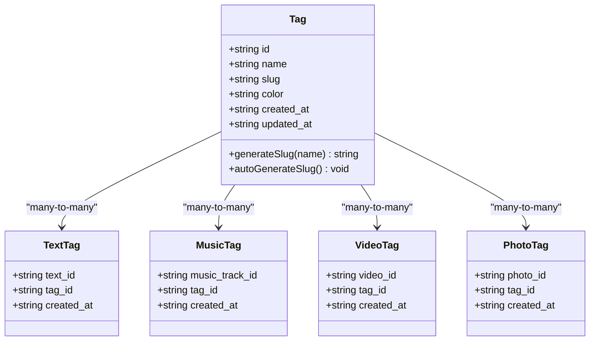
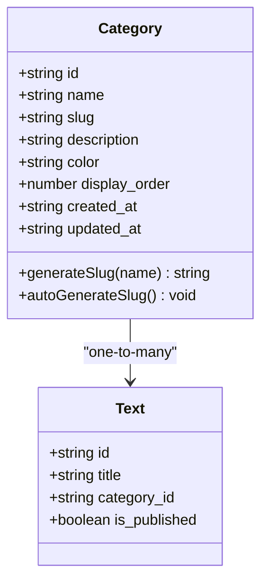
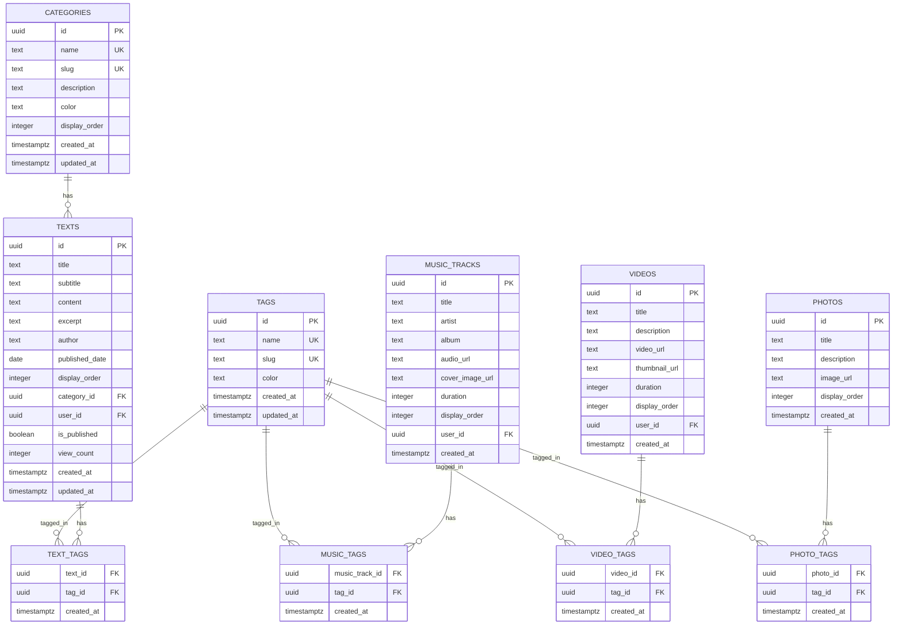
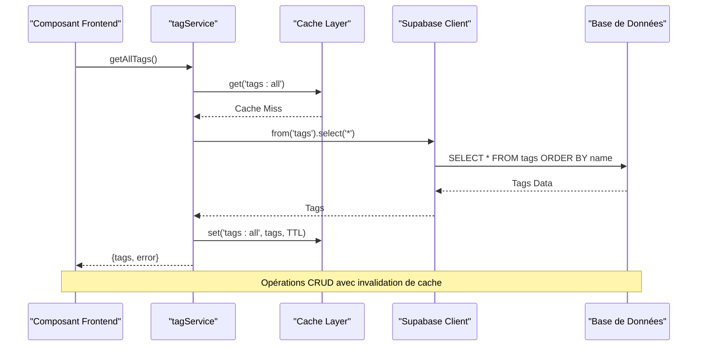
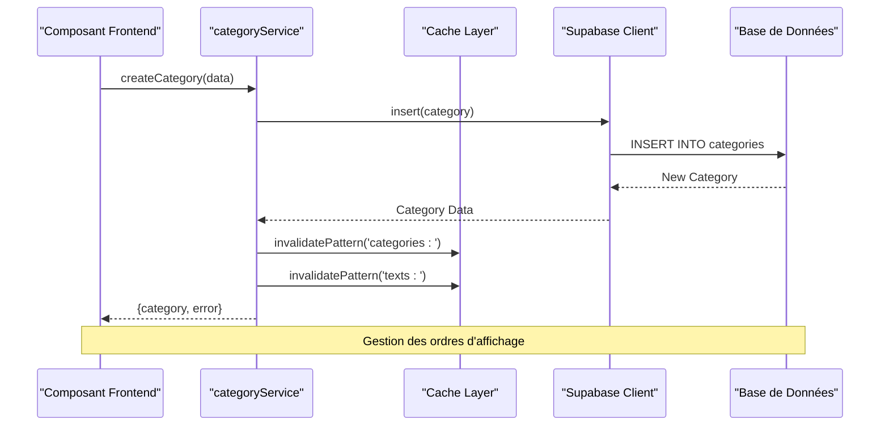
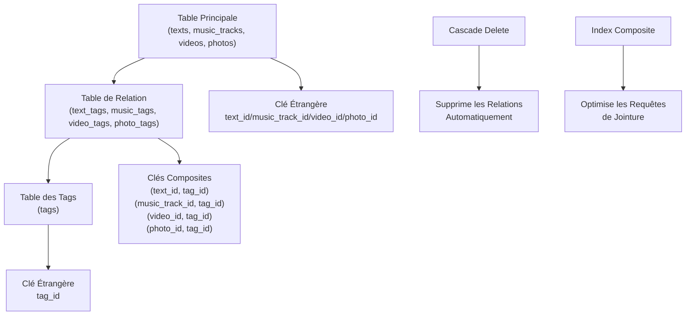
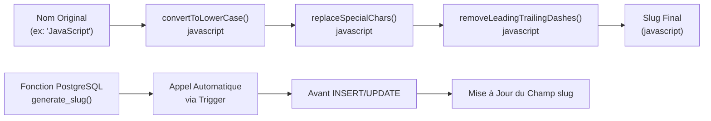
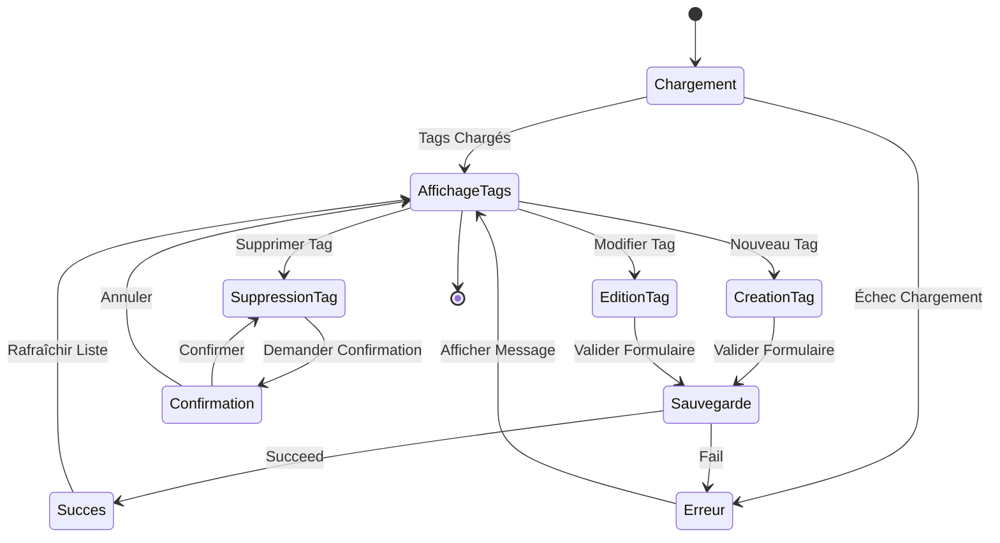
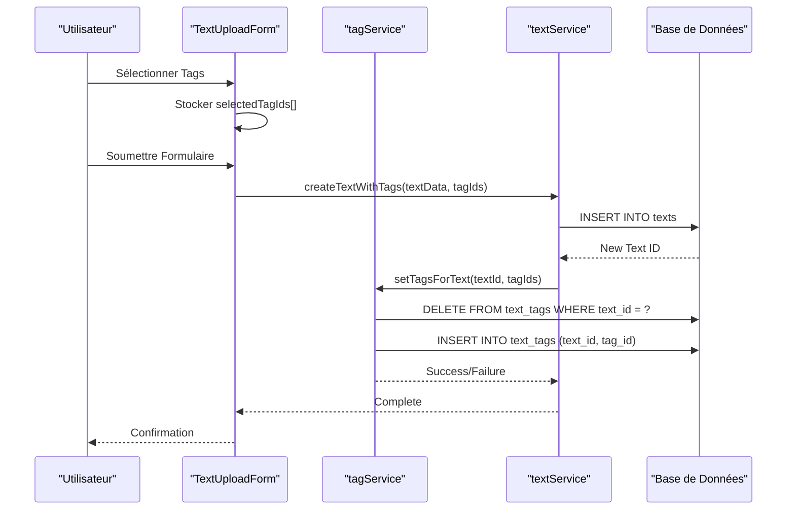

# Modèles Tag et Category

<cite>
**Fichiers Référencés dans ce Document**
- [services/tagService.ts](file://services/tagService.ts)
- [services/categoryService.ts](file://services/categoryService.ts)
- [lib/supabaseClient.ts](file://lib/supabaseClient.ts)
- [supabase/migrations/20250107_create_texts_system.sql](file://supabase/migrations/20250107_create_texts_system.sql)
- [supabase/migrations/002_add_media_tags.sql](file://supabase/migrations/002_add_media_tags.sql)
- [components/texts/TagManager.tsx](file://components/texts/TagManager.tsx)
- [components/texts/CategoryManager.tsx](file://components/texts/CategoryManager.tsx)
- [components/texts/TextUploadForm.tsx](file://components/texts/TextUploadForm.tsx)
</cite>

## Table des Matières
1. [Introduction](#introduction)
2. [Structure des Modèles](#structure-des-modèles)
3. [Architecture des Tables](#architecture-des-tables)
4. [Services et Contrôleurs](#services-et-contrôleurs)
5. [Relations Many-to-Many](#relations-many-to-many)
6. [Gestion des Slugs et Couleurs](#gestion-des-slugs-et-couleurs)
7. [Utilisation Pratique](#utilisation-pratique)
8. [Bonnes Pratiques](#bonnes-pratiques)
9. [Exemples de Requêtes](#exemples-de-requêtes)
10. [Conclusion](#conclusion)

## Introduction

Les modèles Tag et Category constituent le système central d'organisation et de classification du contenu dans cette application. Ces modèles permettent une structuration flexible du contenu textuel tout en offrant des fonctionnalités avancées de tagging polymorphique pour les médias (musique, vidéos, photos).

Le système implémente une architecture robuste basée sur PostgreSQL avec Supabase, incluant des triggers automatiques pour la génération de slugs, des politiques de sécurité au niveau des lignes (RLS), et des vues matérialisées pour optimiser les performances.

## Structure des Modèles

### Modèle Tag

Le modèle Tag représente les étiquettes utilisées pour classifier et organiser le contenu textuel. Il possède les propriétés suivantes :



**Sources du Diagramme**
- [lib/supabaseClient.ts](file://lib/supabaseClient.ts#L53-L60)
- [supabase/migrations/20250107_create_texts_system.sql](file://supabase/migrations/20250107_create_texts_system.sql#L38-L56)

### Modèle Category

Le modèle Category représente les catégories hiérarchiques utilisées pour organiser les textes principalement. Ses propriétés incluent :



**Sources du Diagramme**
- [lib/supabaseClient.ts](file://lib/supabaseClient.ts#L42-L51)
- [supabase/migrations/20250107_create_texts_system.sql](file://supabase/migrations/20250107_create_texts_system.sql#L8-L22)

**Sources de Section**
- [lib/supabaseClient.ts](file://lib/supabaseClient.ts#L42-L60)

## Architecture des Tables

### Structure des Tables PostgreSQL

Le schéma de base de données utilise une approche de normalisation avec des tables spécialisées pour chaque type de contenu :



**Sources du Diagramme**
- [supabase/migrations/20250107_create_texts_system.sql](file://supabase/migrations/20250107_create_texts_system.sql#L8-L104)
- [supabase/migrations/002_add_media_tags.sql](file://supabase/migrations/002_add_media_tags.sql#L7-L46)

### Index et Performances

Le système utilise plusieurs index pour optimiser les performances :

| Table | Index | But |
|-------|-------|-----|
| tags | idx_tags_slug | Recherche rapide par slug |
| tags | idx_tags_name | Recherche par nom |
| categories | idx_categories_slug | Recherche par slug |
| categories | idx_categories_display_order | Tri par ordre d'affichage |
| text_tags | idx_text_tags_text_id | Jointure efficace |
| text_tags | idx_text_tags_tag_id | Recherche de tags |

**Sources de Section**
- [supabase/migrations/20250107_create_texts_system.sql](file://supabase/migrations/20250107_create_texts_system.sql#L19-L22)
- [supabase/migrations/002_add_media_tags.sql](file://supabase/migrations/002_add_media_tags.sql#L15-L40)

## Services et Contrôleurs

### Service Tag

Le service Tag fournit une API complète pour la gestion des tags avec gestion du cache et validation des données :



**Sources du Diagramme**
- [services/tagService.ts](file://services/tagService.ts#L5-L27)

### Service Category

Le service Category offre des fonctionnalités similaires pour la gestion des catégories :



**Sources du Diagramme**
- [services/categoryService.ts](file://services/categoryService.ts#L50-L69)

**Sources de Section**
- [services/tagService.ts](file://services/tagService.ts#L1-L197)
- [services/categoryService.ts](file://services/categoryService.ts#L1-L115)

## Relations Many-to-Many

### Pattern de Relation

Le système implémente un pattern de relation many-to-many polymorphique qui permet aux tags d'être associés à différents types de contenu :



**Sources du Diagramme**
- [supabase/migrations/002_add_media_tags.sql](file://supabase/migrations/002_add_media_tags.sql#L7-L46)

### Implémentation des Tables de Jointure

Chaque type de contenu dispose de sa propre table de relation :

| Table de Jointure | Contenu Associé | Clés Primaires |
|-------------------|-----------------|----------------|
| text_tags | Textes | (text_id, tag_id) |
| music_tags | Musique | (music_track_id, tag_id) |
| video_tags | Vidéos | (video_id, tag_id) |
| photo_tags | Photos | (photo_id, tag_id) |

**Sources de Section**
- [supabase/migrations/002_add_media_tags.sql](file://supabase/migrations/002_add_media_tags.sql#L7-L46)

## Gestion des Slugs et Couleurs

### Génération Automatique de Slugs

Le système utilise des fonctions PostgreSQL pour générer automatiquement les slugs à partir des noms :



**Sources du Diagramme**
- [supabase/migrations/20250107_create_texts_system.sql](file://supabase/migrations/20250107_create_texts_system.sql#L228-L246)

### Validation des Couleurs

Le système valide et normalise les codes couleur hexadécimaux :

| Format Accepté | Exemple | Validation |
|---------------|---------|------------|
| #RRGGBB | #3b82f6 | 6 caractères hex + # |
| #RGB | #38f | Étendu à #3388ff |
| Sans # | 3b82f6 | Préfixé automatiquement |

**Sources de Section**
- [supabase/migrations/20250107_create_texts_system.sql](file://supabase/migrations/20250107_create_texts_system.sql#L228-L278)

## Utilisation Pratique

### Gestion des Tags dans les Textes

Le composant TagManager fournit une interface utilisateur complète pour la gestion des tags :



**Sources du Diagramme**
- [components/texts/TagManager.tsx](file://components/texts/TagManager.tsx#L42-L339)

### Association de Tags aux Textes

Le processus d'association de tags aux textes suit un workflow standard :



**Sources du Diagramme**
- [components/texts/TextUploadForm.tsx](file://components/texts/TextUploadForm.tsx#L90-L136)

**Sources de Section**
- [components/texts/TagManager.tsx](file://components/texts/TagManager.tsx#L1-L339)
- [components/texts/TextUploadForm.tsx](file://components/texts/TextUploadForm.tsx#L1-L200)

## Bonnes Pratiques

### Gestion des Performances

1. **Cache Intelligent** : Utilisation de mécanismes de cache avec invalidation automatique
2. **Index Stratégiques** : Index sur les colonnes fréquemment utilisées pour les recherches
3. **Requêtes Optimisées** : Utilisation de jointures efficaces et de vues matérialisées

### Sécurité et Validation

1. **Row Level Security** : Politiques de sécurité au niveau des lignes
2. **Validation côté Client** : Validation Zod pour les formulaires React
3. **Contraintes d'Intégrité** : Clés étrangères et contraintes de unicité

### Gestion des Conflits

1. **Slug Unique** : Génération automatique avec résolution de conflits
2. **Cascade Delete** : Suppression automatique des relations lors de la suppression
3. **Transactions** : Opérations atomiques pour maintenir l'intégrité

## Exemples de Requêtes

### Récupération de Tags par Texte

```sql
-- Requête pour obtenir tous les tags d'un texte spécifique
SELECT 
    t.id as tag_id,
    t.name,
    t.slug,
    t.color
FROM 
    text_tags tt
JOIN 
    tags t ON tt.tag_id = t.id
WHERE 
    tt.text_id = 'specific-text-id'
ORDER BY 
    t.name ASC;
```

### Requête de Recherche Avancée

```sql
-- Recherche de textes par tags multiples avec pagination
SELECT 
    t.*,
    json_agg(tags.*) as associated_tags
FROM 
    texts t
JOIN 
    text_tags tt ON t.id = tt.text_id
JOIN 
    tags tg ON tt.tag_id = tg.id
WHERE 
    tg.id IN ('tag-id-1', 'tag-id-2', 'tag-id-3')
    AND t.is_published = true
GROUP BY 
    t.id
ORDER BY 
    t.created_at DESC
LIMIT 20 OFFSET 0;
```

### Statistiques de Tags

```sql
-- Nombre d'utilisation de chaque tag dans les textes publiés
SELECT 
    tg.id,
    tg.name,
    tg.slug,
    COUNT(tt.text_id) as usage_count
FROM 
    tags tg
LEFT JOIN 
    text_tags tt ON tg.id = tt.tag_id
LEFT JOIN 
    texts t ON tt.text_id = t.id
WHERE 
    t.is_published = true
GROUP BY 
    tg.id
ORDER BY 
    usage_count DESC;
```

## Conclusion

Les modèles Tag et Category constituent un système d'organisation sophistiqué et extensible qui permet une classification flexible du contenu. Leur conception polymorphe garantit la réutilisabilité tout en maintenant la performance et la sécurité.

Les points forts du système incluent :
- Architecture modulaire et extensible
- Gestion automatique des slugs et des couleurs
- Sécurité au niveau des lignes (RLS)
- Optimisations de performance avec cache et index
- Interface utilisateur intuitive pour la gestion

Ce système forme la base solide d'une application de contenu riche, capable de s'adapter aux besoins évolutifs tout en maintenant des performances optimales.