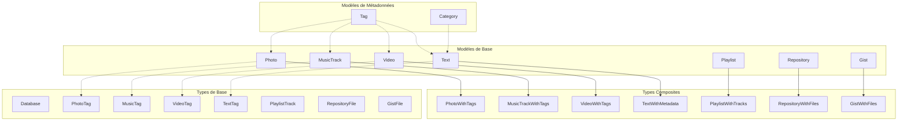
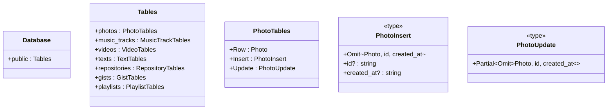
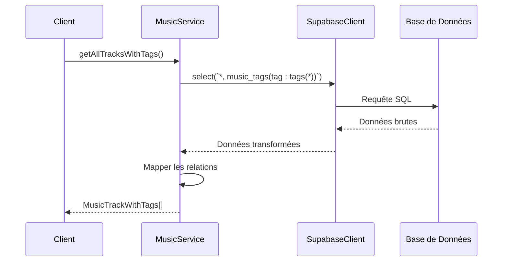

# Modèles de Données

<cite>
**Fichiers Référencés dans ce Document**
- [lib/supabaseClient.ts](file://lib/supabaseClient.ts)
- [services/musicService.ts](file://services/musicService.ts)
- [services/photoService.ts](file://services/photoService.ts)
- [services/textService.ts](file://services/textService.ts)
- [services/videoService.ts](file://services/videoService.ts)
- [services/repositoryService.ts](file://services/repositoryService.ts)
- [services/gistService.ts](file://services/gistService.ts)
- [services/playlistService.ts](file://services/playlistService.ts)
- [components/music/TrackList.tsx](file://components/music/TrackList.tsx)
- [components/texts/TextListAdmin.tsx](file://components/texts/TextListAdmin.tsx)
- [components/photos/PhotoList.tsx](file://components/photos/PhotoList.tsx)
</cite>

## Table des Matières
1. [Introduction](#introduction)
2. [Structure des Modèles de Données](#structure-des-modèles-de-données)
3. [Modèles Principaux](#modèles-principaux)
4. [Types Composites et Relations](#types-composites-et-relations)
5. [Pattern d'Insertion et de Mise à Jour](#pattern-dinsertion-et-de-mise-à-jour)
6. [Utilisation dans les Services](#utilisation-dans-les-services)
7. [Bonnes Pratiques](#bonnes-pratiques)
8. [Extensions et Modifications](#extensions-et-modifications)

## Introduction

Le système de modèles de données TypeScript dans ce projet représente une couche d'abstraction côté client pour la base de données Supabase. Ces modèles définissent strictement les structures de données utilisées dans l'application, permettant une validation de type stricte et une meilleure maintenabilité du code.

Les modèles sont organisés autour de plusieurs catégories principales : médias (photos, musiques, vidéos), contenus (textes, articles), systèmes (dépôts, gists, playlists), et métadonnées (catégories, tags). Chaque modèle est conçu pour représenter une entité spécifique de la base de données avec ses propriétés et relations associées.

## Structure des Modèles de Données

### Architecture Générale



**Sources du Diagramme**
- [lib/supabaseClient.ts](file://lib/supabaseClient.ts#L18-L343)

## Modèles Principaux

### Photo

Le modèle `Photo` représente une image dans la galerie de l'application.

```typescript
export type Photo = {
  id: string;                    // Identifiant unique UUID
  title: string;                 // Titre de la photo
  description: string | null;    // Description optionnelle
  image_url: string;             // URL de l'image principale
  blur_data_url: string | null;  // URL de l'image floutée pour le LQIP
  display_order: number;         // Ordre d'affichage
  user_id: string | null;        // ID de l'utilisateur propriétaire
  created_at: string;            // Timestamp de création
};
```

**Propriétés Métier :**
- `id` : Identifiant unique généré automatiquement
- `image_url` : URL vers l'image stockée dans Supabase Storage
- `blur_data_url` : Image floutée pour l'effet LQIP (Low Quality Image Placeholder)
- `display_order` : Contrôle l'ordre d'affichage dans les galeries

**Sources de Section**
- [lib/supabaseClient.ts](file://lib/supabaseClient.ts#L18-L27)

### MusicTrack

Le modèle `MusicTrack` représente une piste musicale avec ses métadonnées.

```typescript
export type MusicTrack = {
  id: string;                    // Identifiant unique
  title: string;                 // Titre de la piste
  artist: string | null;         // Artiste (nullable)
  album: string | null;          // Album (nullable)
  audio_url: string;             // URL du fichier audio
  cover_image_url: string | null;// URL de la pochette
  duration: number | null;       // Durée en secondes (nullable)
  display_order: number;         // Ordre d'affichage
  user_id: string | null;        // Propriétaire
  created_at: string;            // Timestamp
};
```

**Propriétés Métier :**
- `audio_url` : Fichier audio stocké dans Supabase Storage
- `cover_image_url` : Image de couverture optionnelle
- `duration` : Permet l'affichage du temps total de lecture

**Sources de Section**
- [lib/supabaseClient.ts](file://lib/supabaseClient.ts#L29-L40)

### Video

Le modèle `Video` représente une vidéo hébergée dans l'application.

```typescript
export type Video = {
  id: string;                    // Identifiant unique
  title: string;                 // Titre de la vidéo
  description: string | null;    // Description optionnelle
  video_url: string;             // URL de la vidéo
  thumbnail_url: string | null;  // URL de la vignette
  duration: number | null;       // Durée en secondes
  display_order: number;         // Ordre d'affichage
  user_id: string | null;        // Propriétaire
  created_at: string;            // Timestamp
};
```

**Propriétés Métier :**
- `video_url` : Vidéo stockée dans Supabase Storage
- `thumbnail_url` : Image de vignette générée automatiquement
- `duration` : Utilisé pour afficher la durée totale

**Sources de Section**
- [lib/supabaseClient.ts](file://lib/supabaseClient.ts#L204-L214)

### Text

Le modèle `Text` représente un article ou contenu textuel.

```typescript
export type Text = {
  id: string;                    // Identifiant unique
  title: string;                 // Titre de l'article
  subtitle: string | null;       // Sous-titre optionnel
  content: string;               // Contenu principal (Markdown)
  excerpt: string | null;        // Extrait pour les listes
  author: string | null;         // Auteur (nullable)
  published_date: string | null; // Date de publication
  display_order: number;         // Ordre d'affichage
  category_id: string | null;    // ID de catégorie
  user_id: string | null;        // Propriétaire
  is_published: boolean;         // Statut de publication
  view_count: number;            // Nombre de vues
  created_at: string;            // Timestamp de création
  updated_at: string;            // Timestamp de dernière modification
};
```

**Propriétés Métier :**
- `content` : Stocké en format Markdown pour la flexibilité
- `is_published` : Contrôle la visibilité publique
- `view_count` : Compteur de vues pour les statistiques
- `category_id` : Relation vers la catégorie parente

**Sources de Section**
- [lib/supabaseClient.ts](file://lib/supabaseClient.ts#L62-L77)

### Repository

Le modèle `Repository` représente un dépôt de code source.

```typescript
export type Repository = {
  id: string;                    // Identifiant unique
  name: string;                  // Nom du dépôt
  description: string | null;    // Description optionnelle
  source_type: 'local' | 'github'; // Type de source
  github_owner: string | null;   // Propriétaire GitHub
  github_repo: string | null;    // Nom du dépôt GitHub
  github_branch: string | null;  // Branche GitHub
  storage_path: string | null;   // Chemin de stockage local
  language: string | null;       // Langage de programmation
  is_public: boolean;            // Visibilité publique
  display_order: number;         // Ordre d'affichage
  user_id: string | null;        // Propriétaire
  github_stars: number | null;   // Nombre d'étoiles GitHub
  github_forks: number | null;   // Nombre de forks GitHub
  github_watchers: number | null;// Nombre de watchers GitHub
  github_open_issues: number | null; // Issues ouvertes
  created_at: string;            // Timestamp de création
  updated_at: string;            // Timestamp de mise à jour
};
```

**Propriétés Métier :**
- `source_type` : Contrôle si le dépôt est local ou GitHub
- `github_*` : Métadonnées GitHub pour les dépôts externes
- `language` : Détection automatique du langage

**Sources de Section**
- [lib/supabaseClient.ts](file://lib/supabaseClient.ts#L120-L139)

### Gist

Le modèle `Gist` représente un snippet de code ou note personnelle.

```typescript
export type Gist = {
  id: string;                    // Identifiant unique
  title: string | null;          // Titre optionnel
  description: string | null;    // Description optionnelle
  is_public: boolean;            // Visibilité publique
  user_id: string | null;        // Propriétaire
  display_order: number;         // Ordre d'affichage
  created_at: string;            // Timestamp de création
  updated_at: string;            // Timestamp de mise à jour
};
```

**Propriétés Métier :**
- `is_public` : Contrôle la visibilité publique
- `title` et `description` : Informations de découverte

**Sources de Section**
- [lib/supabaseClient.ts](file://lib/supabaseClient.ts#L156-L165)

### Playlist

Le modèle `Playlist` représente une liste de lecture musicale.

```typescript
export type Playlist = {
  id: string;                    // Identifiant unique
  name: string;                  // Nom de la playlist
  description: string | null;    // Description optionnelle
  user_id: string;               // Propriétaire
  is_public: boolean;            // Visibilité publique
  display_order: number;         // Ordre d'affichage
  created_at: string;            // Timestamp de création
  updated_at: string;            // Timestamp de mise à jour
};
```

**Propriétés Métier :**
- `name` : Nom unique pour la playlist
- `is_public` : Partage public ou privé

**Sources de Section**
- [lib/supabaseClient.ts](file://lib/supabaseClient.ts#L181-L190)

## Types Composites et Relations

### Types avec Métadonnées

Les types composites ajoutent des relations pré-chargées aux modèles de base, permettant d'accéder aux données liées sans requêtes supplémentaires.

#### TextWithMetadata

```typescript
export type TextWithMetadata = Text & {
  category?: Category | null;     // Catégorie associée
  tags?: Tag[];                  // Tags associés
};
```

**Utilisation :** Permet d'afficher un texte avec sa catégorie et ses tags dans une seule requête.

**Sources de Section**
- [lib/supabaseClient.ts](file://lib/supabaseClient.ts#L103-L106)

#### MusicTrackWithTags

```typescript
export type MusicTrackWithTags = MusicTrack & {
  tags?: Tag[];                  // Tags associés
};
```

**Utilisation :** Affiche les pistes musicales avec leurs tags pour la recherche et filtrage.

**Sources de Section**
- [lib/supabaseClient.ts](file://lib/supabaseClient.ts#L108-L110)

#### PhotoWithTags, VideoWithTags

Similaires à `MusicTrackWithTags`, ces types ajoutent les tags associés aux photos et vidéos.

**Sources de Section**
- [lib/supabaseClient.ts](file://lib/supabaseClient.ts#L116-L118)

#### PlaylistWithTracks

```typescript
export type PlaylistWithTracks = Playlist & {
  tracks?: MusicTrack[];         // Pistes de la playlist
};
```

**Utilisation :** Charge une playlist avec toutes ses pistes pour la lecture.

**Sources de Section**
- [lib/supabaseClient.ts](file://lib/supabaseClient.ts#L200-L202)

#### RepositoryWithFiles

```typescript
export type RepositoryWithFiles = Repository & {
  files?: RepositoryFile[];      // Fichiers du dépôt
};
```

**Utilisation :** Affiche la structure complète d'un dépôt avec ses fichiers.

**Sources de Section**
- [lib/supabaseClient.ts](file://lib/supabaseClient.ts#L152-L154)

#### GistWithFiles

```typescript
export type GistWithFiles = Gist & {
  files: GistFile[];             // Fichiers du Gist
};
```

**Utilisation :** Affiche un Gist avec tous ses fichiers associés.

**Sources de Section**
- [lib/supabaseClient.ts](file://lib/supabaseClient.ts#L177-L179)

### Types de Relations

#### Category

```typescript
export type Category = {
  id: string;                    // Identifiant unique
  name: string;                  // Nom de la catégorie
  slug: string;                  // Slug URL
  description: string | null;    // Description optionnelle
  color: string;                 // Couleur hexadécimale
  display_order: number;         // Ordre d'affichage
  created_at: string;            // Timestamp de création
  updated_at: string;            // Timestamp de mise à jour
};
```

**Utilisation :** Organise les textes par catégories thématiques.

**Sources de Section**
- [lib/supabaseClient.ts](file://lib/supabaseClient.ts#L42-L51)

#### Tag

```typescript
export type Tag = {
  id: string;                    // Identifiant unique
  name: string;                  // Nom du tag
  slug: string;                  // Slug URL
  color: string;                 // Couleur hexadécimale
  created_at: string;            // Timestamp de création
  updated_at: string;            // Timestamp de mise à jour
};
```

**Utilisation :** Marque les éléments avec des labels multiples pour la recherche.

**Sources de Section**
- [lib/supabaseClient.ts](file://lib/supabaseClient.ts#L53-L60)

## Pattern d'Insertion et de Mise à Jour

### Structure Database

Le type `Database` définit les patterns d'insertion et de mise à jour pour chaque table.



**Sources du Diagramme**
- [lib/supabaseClient.ts](file://lib/supabaseClient.ts#L216-L343)

### Pattern d'Insertion

Pour chaque modèle, le pattern d'insertion exclut automatiquement les champs générés :

```typescript
// Exemple pour Photo
Insert: Omit<Photo, 'id' | 'created_at'> & {
  id?: string;                   // Optionnel, généré automatiquement
  created_at?: string;           // Optionnel, généré automatiquement
};
```

**Avantages :**
- Évite l'erreur de fournir des valeurs pour les champs auto-générés
- Permet la création de modèles partiellement remplis
- Maintient la cohérence entre les services

**Sources de Section**
- [lib/supabaseClient.ts](file://lib/supabaseClient.ts#L219-L224)

### Pattern de Mise à Jour

```typescript
// Exemple pour Photo
Update: Partial<Omit<Photo, 'id' | 'created_at'>>;
```

**Avantages :**
- Permet de mettre à jour seulement certains champs
- Maintient la sécurité des champs critiques
- Facilite les opérations de patch

**Sources de Section**
- [lib/supabaseClient.ts](file://lib/supabaseClient.ts#L225-L226)

### Autres Types de Relations

#### TextTag, MusicTag, VideoTag, PhotoTag

```typescript
export type TextTag = {
  text_id: string;               // ID du texte
  tag_id: string;                // ID du tag
  created_at: string;            // Timestamp
};
```

**Utilisation :** Représentent les relations many-to-many entre les contenus et les tags.

**Sources de Section**
- [lib/supabaseClient.ts](file://lib/supabaseClient.ts#L79-L89)

#### PlaylistTrack

```typescript
export type PlaylistTrack = {
  id: string;                    // Identifiant unique
  playlist_id: string;           // ID de la playlist
  track_id: string;              // ID de la piste
  display_order: number;         // Ordre dans la playlist
  added_at: string;              // Timestamp d'ajout
};
```

**Utilisation :** Ordonne les pistes dans une playlist.

**Sources de Section**
- [lib/supabaseClient.ts](file://lib/supabaseClient.ts#L192-L198)

## Utilisation dans les Services

### Exemple avec MusicService

Le service `musicService` illustre l'utilisation typique des modèles :



**Sources du Diagramme**
- [services/musicService.ts](file://services/musicService.ts#L17-L50)

#### Récupération avec Métadonnées

```typescript
// Dans musicService.ts
async getAllTracksWithTags() {
  const { data, error } = await supabaseClient
    .from('music_tracks')
    .select(`
      *,
      music_tags(tag:tags(*))
    `)
    .order('display_order', { ascending: true });

  if (error) return { tracks: null, error };

  const tracks = data.map((track: any) => ({
    ...track,
    tags: track.music_tags?.map((mt: any) => mt.tag).filter(Boolean) || [],
  }));

  tracks.forEach((track: any) => delete track.music_tags);
  
  return { tracks: tracks as MusicTrackWithTags[], error: null };
}
```

**Sources de Section**
- [services/musicService.ts](file://services/musicService.ts#L17-L50)

#### Création avec Validation

```typescript
// Dans musicService.ts
async createTrack(track: {
  title: string;
  artist: string | null;
  album: string | null;
  audio_url: string;
  cover_image_url: string | null;
  duration: number | null;
  display_order: number;
}) {
  // Validation des URLs
  const audioUrlValidation = validateMediaUrl(track.audio_url, 'audio_url');
  if (!audioUrlValidation.valid) {
    return { track: null, error: { /* ... */ } };
  }

  // Ajout de l'user_id
  const trackWithUser = {
    ...track,
    user_id: user.id
  };

  // Insertion
  const { data, error } = await supabaseClient
    .from('music_tracks')
    .insert(trackWithUser)
    .select()
    .single();

  return { track: data as MusicTrack | null, error: null };
}
```

**Sources de Section**
- [services/musicService.ts](file://services/musicService.ts#L73-L180)

### Exemple avec TextService

Le service `textService` montre l'utilisation des types avec métadonnées :

```typescript
// Récupération avec catégories et tags
const { data, error } = await supabaseClient
  .from('texts')
  .select(`
    *,
    category:categories(*),
    text_tags(tag:tags(*))
  `);

const texts = data.map((text: any) => ({
  ...text,
  category: text.category || null,
  tags: text.text_tags?.map((tt: any) => tt.tag).filter(Boolean) || [],
}));
```

**Sources de Section**
- [services/textService.ts](file://services/textService.ts#L170-L191)

### Exemple avec PhotoService

Le service `photoService` illustre la gestion des images :

```typescript
// Validation et création
const urlValidation = validateMediaUrl(photo.image_url, 'image_url');
if (!urlValidation.valid) {
  return { photo: null, error: { /* ... */ } };
}

const { data, error } = await supabaseClient
  .from('photos')
  .insert({
    ...photo,
    user_id: userId,
  })
  .select()
  .single();
```

**Sources de Section**
- [services/photoService.ts](file://services/photoService.ts#L95-L124)

## Bonnes Pratiques

### 1. Utilisation des Types Composites

```typescript
// ✅ Bon : Utiliser TextWithMetadata pour éviter les requêtes supplémentaires
const { texts } = await textService.getTextsWithMetadata();

// ❌ Éviter : Requêtes séparées pour chaque relation
const texts = await textService.getAllTexts();
const categories = await categoryService.getAllCategories();
const tags = await tagService.getAllTags();
```

### 2. Validation des Données

```typescript
// ✅ Bon : Validation avant insertion
const urlValidation = validateMediaUrl(track.audio_url, 'audio_url');
if (!urlValidation.valid) {
  return { track: null, error: { /* ... */ } };
}

// ✅ Bon : Utilisation des types Database pour la cohérence
const insertData: Database['public']['Tables']['music_tracks']['Insert'] = {
  title: track.title,
  audio_url: track.audio_url,
  user_id: user.id,
};
```

### 3. Gestion des Erreurs

```typescript
// ✅ Bon : Traitement structuré des erreurs
try {
  const { data, error } = await supabaseClient
    .from('music_tracks')
    .insert(trackData);
  
  if (error) {
    logger.error('Insertion échouée', error);
    return { track: null, error };
  }
  
  return { track: data as MusicTrack, error: null };
} catch (err) {
  logger.error('Erreur inattendue', err);
  return { track: null, error: { /* ... */ } };
}
```

### 4. Optimisation des Requêtes

```typescript
// ✅ Bon : Chargement différé avec cache
const CACHE_KEY = 'music:all-with-tags';
const TTL = 5 * 60 * 1000; // 5 minutes

const cached = cache.get<{ tracks: MusicTrackWithTags[]; error: null }>(CACHE_KEY);
if (cached) {
  return cached;
}

// ✅ Bon : Sélection optimisée des champs
const { data, error } = await supabaseClient
  .from('music_tracks')
  .select(`
    *,
    music_tags(tag:tags(name, color))
  `)
  .order('display_order', { ascending: true });
```

### 5. Respect du Pattern CRUD

```typescript
// ✅ Bon : Opérations CRUD standardisées
export const musicService = {
  async getAllTracks() { /* ... */ },
  async getTrackById(id: string) { /* ... */ },
  async createTrack(track: Partial<MusicTrack>) { /* ... */ },
  async updateTrack(id: string, updates: Partial<MusicTrack>) { /* ... */ },
  async deleteTrack(id: string) { /* ... */ },
};
```

## Extensions et Modifications

### Ajout d'un Nouveau Modèle

Pour ajouter un nouveau modèle, suivez ces étapes :

1. **Définir le modèle de base :**

```typescript
export type NewModel = {
  id: string;
  name: string;
  description: string | null;
  created_at: string;
  updated_at: string;
};
```

2. **Ajouter aux types Database :**

```typescript
export type Database = {
  public: {
    Tables: {
      // ...
      new_models: {
        Row: NewModel;
        Insert: Omit<NewModel, 'id' | 'created_at' | 'updated_at'> & {
          id?: string;
          created_at?: string;
          updated_at?: string;
        };
        Update: Partial<Omit<NewModel, 'id' | 'created_at' | 'updated_at'>>;
      };
    };
  };
};
```

3. **Créer les types de relations si nécessaire :**

```typescript
export type NewModelTag = {
  new_model_id: string;
  tag_id: string;
  created_at: string;
};

export type NewModelWithTags = NewModel & {
  tags?: Tag[];
};
```

### Modification d'un Modèle Exist

Pour modifier un modèle existant :

1. **Modifier le type directement :**

```typescript
// Avant
export type Photo = {
  id: string;
  title: string;
  description: string | null;
  image_url: string;
  blur_data_url: string | null;
  display_order: number;
  user_id: string | null;
  created_at: string;
};

// Après
export type Photo = {
  id: string;
  title: string;
  description: string | null;
  image_url: string;
  blur_data_url: string | null;
  thumbnail_url: string | null;  // Nouveau champ
  display_order: number;
  user_id: string | null;
  created_at: string;
};
```

2. **Mettre à jour les types Database :**

```typescript
// Avant
Insert: Omit<Photo, 'id' | 'created_at'> & {
  id?: string;
  created_at?: string;
};

// Après
Insert: Omit<Photo, 'id' | 'created_at'> & {
  id?: string;
  created_at?: string;
  thumbnail_url?: string | null;  // Champ optionnel
};
```

3. **Adapter les services concernés :**

```typescript
// Dans photoService.ts
async createPhoto(photo: {
  title: string;
  description: string | null;
  image_url: string;
  blur_data_url?: string | null;
  thumbnail_url?: string | null;  // Nouveau champ
  display_order: number;
  user_id?: string | null;
}) {
  // Logique de création...
}
```

### Migration des Données

Pour les modifications nécessitant une migration :

1. **Créer une migration Supabase :**

```sql
-- Ajouter le nouveau champ
ALTER TABLE photos ADD COLUMN thumbnail_url TEXT;

-- Peupler avec des valeurs par défaut si nécessaire
UPDATE photos SET thumbnail_url = CONCAT(SUBSTRING(image_url FROM 1 FOR LENGTH(image_url) - 4), '_thumb.jpg')
WHERE thumbnail_url IS NULL;
```

2. **Mettre à jour les services :**

```typescript
// Adapter les fonctions de création/mise à jour
async createPhoto(photo: {
  title: string;
  description: string | null;
  image_url: string;
  blur_data_url?: string | null;
  thumbnail_url?: string | null;  // Nouveau champ
  display_order: number;
  user_id?: string | null;
}) {
  const { data, error } = await supabaseClient
    .from('photos')
    .insert({
      ...photo,
      user_id: photo.user_id ?? user?.id ?? null,
    })
    .select()
    .single();
}
```

### Extension des Types Composites

Pour ajouter des relations à un type composite :

```typescript
// Avant
export type TextWithMetadata = Text & {
  category?: Category | null;
  tags?: Tag[];
};

// Après
export type TextWithMetadata = Text & {
  category?: Category | null;
  tags?: Tag[];
  author?: User | null;  // Nouvelle relation
  comments?: Comment[]; // Nouvelle relation
};
```

Cette approche garantit que toutes les parties de l'application restent typées correctement lors des extensions du modèle de données.