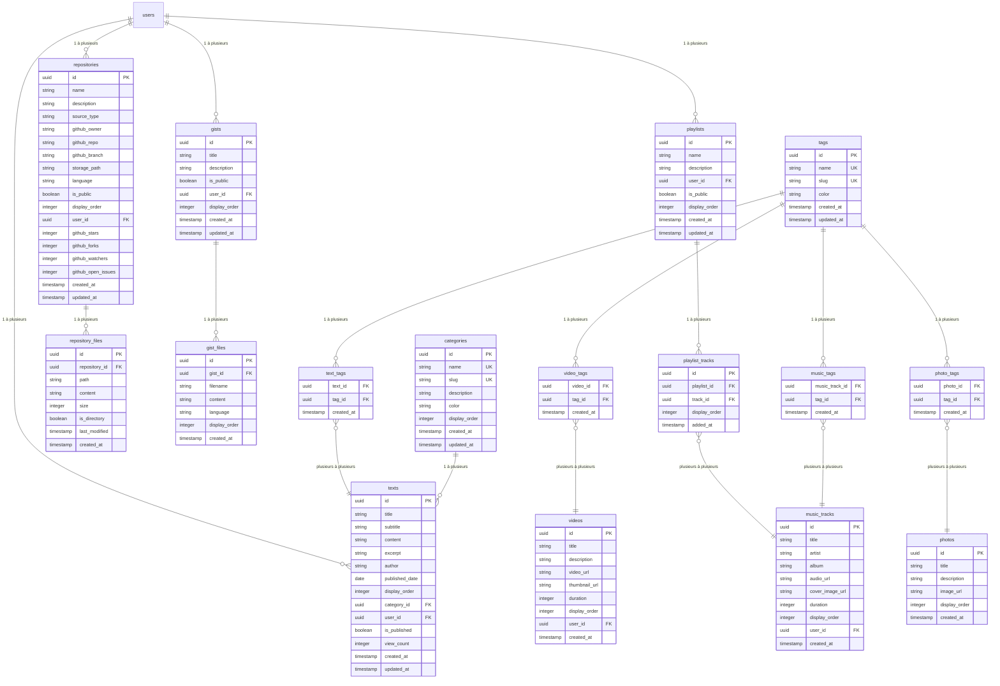

# Schéma de Base de Données

<cite>
**Fichiers Référencés dans Ce Document**   
- [20251105115814_create_photos_table.sql](file://supabase/migrations/20251105115814_create_photos_table.sql)
- [20251106095111_create_music_tracks_table.sql](file://supabase/migrations/20251106095111_create_music_tracks_table.sql)
- [20251108071024_create_videos_system.sql](file://supabase/migrations/20251108071024_create_videos_system.sql)
- [20251111050910_create_playlists_system.sql](file://supabase/migrations/20251111050910_create_playlists_system.sql)
- [20250107_create_texts_system.sql](file://supabase/migrations/20250107_create_texts_system.sql)
- [002_add_media_tags.sql](file://supabase/migrations/002_add_media_tags.sql)
- [supabaseClient.ts](file://lib/supabaseClient.ts)
- [repositoryService.ts](file://services/repositoryService.ts)
</cite>

## Table des Matières
1. [Introduction](#introduction)
2. [Tables de Contenu Principal](#tables-de-contenu-principal)
   - [Photos](#photos)
   - [Morceaux de Musique](#morceaux-de-musique)
   - [Vidéos](#vidéos)
   - [Textes](#textes)
3. [Tables de Métadonnées](#tables-de-métadonnées)
   - [Catégories](#catégories)
   - [Tags](#tags)
4. [Tables de Relation](#tables-de-relation)
   - [Relations Plusieurs-à-Plusieurs avec les Tags](#relations-plusieurs-à-plusieurs-avec-les-tags)
   - [Playlists et Morceaux Associés](#playlists-et-morceaux-associés)
5. [Tables de Fichiers Associés](#tables-de-fichiers-associés)
   - [Fichiers de Dépôts](#fichiers-de-dépôts)
   - [Fichiers de Gists](#fichiers-de-gists)
6. [Relations entre Entités](#relations-entre-entités)
7. [Exemples de Requêtes Courantes](#exemples-de-requêtes-courantes)
8. [Diagramme de Schéma Conceptuel](#diagramme-de-schéma-conceptuel)

## Introduction
Ce document présente une analyse détaillée du schéma de base de données du projet Portfolio, basée sur les fichiers de migration SQL situés dans le répertoire `supabase/migrations`. Le schéma est conçu pour gérer divers types de contenus (photos, musique, vidéos, textes, dépôts, gists) ainsi que leurs métadonnées (catégories, tags). Le système utilise PostgreSQL avec Supabase, implémentant des fonctionnalités avancées comme la sécurité au niveau des lignes (RLS), des vues matérialisées, des déclencheurs et des fonctions personnalisées pour assurer l'intégrité des données et une bonne expérience utilisateur.

**Section sources**
- [20251105115814_create_photos_table.sql](file://supabase/migrations/20251105115814_create_photos_table.sql)
- [20251106095111_create_music_tracks_table.sql](file://supabase/migrations/20251106095111_create_music_tracks_table.sql)
- [20251108071024_create_videos_system.sql](file://supabase/migrations/20251108071024_create_videos_system.sql)
- [20250107_create_texts_system.sql](file://supabase/migrations/20250107_create_texts_system.sql)

## Tables de Contenu Principal

### Photos
La table `photos` stocke les informations relatives aux images du portfolio.

**Attributs**
- `id` (uuid) : Identifiant unique de la photo, clé primaire, généré automatiquement.
- `title` (text) : Titre de la photo, requis.
- `description` (text) : Description optionnelle de la photo.
- `image_url` (text) : URL publique de l'image stockée dans le bucket Supabase "photo-files", requis.
- `display_order` (integer) : Ordre d'affichage personnalisé, requis, valeur par défaut 0.
- `created_at` (timestamptz) : Date de création, valeur par défaut `now()`.

**Contraintes**
- Clé primaire sur `id`.
- Contraintes `NOT NULL` sur `title`, `image_url`, et `display_order`.

**Index**
- `photos_display_order_idx` sur `display_order` pour optimiser le tri.
- `photos_created_at_idx` sur `created_at DESC` pour les requêtes récentes.

**Sécurité (RLS)**
- Lecture publique pour tous les utilisateurs.
- Insertion, mise à jour et suppression réservées aux utilisateurs authentifiés.

**Section sources**
- [20251105115814_create_photos_table.sql](file://supabase/migrations/20251105115814_create_photos_table.sql)

### Morceaux de Musique
La table `music_tracks` gère les fichiers audio du portfolio.

**Attributs**
- `id` (uuid) : Identifiant unique du morceau, clé primaire, généré automatiquement.
- `title` (text) : Titre du morceau, requis.
- `artist` (text) : Nom de l'artiste, optionnel, valeur par défaut ''.
- `album` (text) : Nom de l'album, optionnel, valeur par défaut ''.
- `audio_url` (text) : URL du fichier audio dans le bucket "audio-files", requis.
- `cover_image_url` (text) : URL de l'image de couverture, optionnel, valeur par défaut ''.
- `duration` (integer) : Durée du morceau en secondes, optionnel, valeur par défaut 0.
- `display_order` (integer) : Ordre d'affichage, requis, valeur par défaut 0.
- `user_id` (uuid) : Référence à l'utilisateur qui a uploadé le morceau, optionnel, avec `ON DELETE SET NULL`.
- `created_at` (timestamptz) : Date de création, valeur par défaut `now()`.

**Contraintes**
- Clé primaire sur `id`.
- Contraintes `NOT NULL` sur `title`, `audio_url`, et `display_order`.
- Clé étrangère sur `user_id` référençant `auth.users(id)`.

**Index**
- `idx_music_tracks_display_order` sur `display_order` pour le tri.

**Sécurité (RLS)**
- Lecture publique pour tous les utilisateurs.
- Insertion, mise à jour et suppression réservées aux utilisateurs authentifiés.

**Section sources**
- [20251106095111_create_music_tracks_table.sql](file://supabase/migrations/20251106095111_create_music_tracks_table.sql)

### Vidéos
La table `videos` contient les informations sur les vidéos du portfolio.

**Attributs**
- `id` (uuid) : Identifiant unique de la vidéo, clé primaire, généré automatiquement.
- `title` (text) : Titre de la vidéo, requis.
- `description` (text) : Description optionnelle.
- `video_url` (text) : URL du fichier vidéo dans le bucket "video-files", requis.
- `thumbnail_url` (text) : URL de la miniature, optionnel.
- `duration` (integer) : Durée en secondes, optionnel.
- `display_order` (integer) : Ordre d'affichage, requis, valeur par défaut 0.
- `user_id` (uuid) : Référence à l'utilisateur, optionnel, avec `ON DELETE SET NULL`.
- `created_at` (timestamptz) : Date de création, valeur par défaut `now()`.

**Contraintes**
- Clé primaire sur `id`.
- Contraintes `NOT NULL` sur `title`, `video_url`, et `display_order`.
- Clé étrangère sur `user_id` référençant `auth.users(id)`.

**Index**
- `idx_videos_display_order` sur `display_order`.
- `idx_videos_user_id` sur `user_id`.
- `idx_videos_created_at` sur `created_at DESC`.

**Sécurité (RLS)**
- Lecture publique pour tous.
- Insertion, mise à jour et suppression réservées aux utilisateurs authentifiés, avec vérification que `auth.uid() = user_id`.

**Section sources**
- [20251108071024_create_videos_system.sql](file://supabase/migrations/20251108071024_create_videos_system.sql)

### Textes
La table `texts` stocke les articles et contenus textuels du portfolio.

**Attributs**
- `id` (uuid) : Identifiant unique, clé primaire, généré automatiquement.
- `title` (text) : Titre du texte, requis.
- `subtitle` (text) : Sous-titre optionnel.
- `content` (text) : Contenu principal, requis.
- `excerpt` (text) : Extrait ou résumé.
- `author` (text) : Auteur du texte.
- `published_date` (date) : Date de publication.
- `display_order` (integer) : Ordre d'affichage, requis, valeur par défaut 0.
- `category_id` (uuid) : Référence à la catégorie, optionnel, avec `ON DELETE SET NULL`.
- `user_id` (uuid) : Référence à l'utilisateur créateur, requis, avec `ON DELETE CASCADE`.
- `is_published` (boolean) : Statut de publication, valeur par défaut `false`.
- `view_count` (integer) : Compteur de vues, valeur par défaut 0.
- `created_at` (timestamptz) : Date de création, valeur par défaut `now()`.
- `updated_at` (timestamptz) : Date de mise à jour, valeur par défaut `now()`.

**Contraintes**
- Clé primaire sur `id`.
- Contraintes `NOT NULL` sur `title`, `content`, `display_order`, et `user_id`.
- Clés étrangères sur `category_id` et `user_id`.

**Index**
- Index sur `category_id`, `user_id`, `display_order`, `published_date`, `is_published`, et `created_at DESC`.
- Index GIN pour la recherche plein texte sur `title` et `content` en français.

**Déclencheur**
- `update_texts_updated_at` met à jour automatiquement `updated_at` avant chaque modification.

**Sécurité (RLS)**
- Lecture publique uniquement pour les textes publiés (`is_published = true`).
- Les utilisateurs peuvent lire, modifier et supprimer leurs propres textes.
- Création réservée aux utilisateurs authentifiés.

**Section sources**
- [20250107_create_texts_system.sql](file://supabase/migrations/20250107_create_texts_system.sql)

## Tables de Métadonnées

### Catégories
La table `categories` permet de classer les textes en différentes catégories.

**Attributs**
- `id` (uuid) : Identifiant unique, clé primaire, généré automatiquement.
- `name` (text) : Nom de la catégorie, requis et unique.
- `slug` (text) : Identifiant URL-friendly, requis et unique.
- `description` (text) : Description optionnelle.
- `color` (text) : Couleur hexadécimale pour l'interface, valeur par défaut `#3b82f6`.
- `display_order` (integer) : Ordre d'affichage, requis, valeur par défaut 0.
- `created_at` (timestamptz) : Date de création.
- `updated_at` (timestamptz) : Date de mise à jour.

**Contraintes**
- Clé primaire sur `id`.
- Contraintes `NOT NULL` et `UNIQUE` sur `name` et `slug`.

**Index**
- `idx_categories_slug` sur `slug`.
- `idx_categories_display_order` sur `display_order`.

**Déclencheurs**
- `update_categories_updated_at` met à jour `updated_at`.
- `set_category_slug` génère automatiquement le `slug` à partir du `name` si non fourni.

**Sécurité (RLS)**
- Lecture publique.
- Création, modification et suppression réservées aux utilisateurs authentifiés.

**Section sources**
- [20250107_create_texts_system.sql](file://supabase/migrations/20250107_create_texts_system.sql)

### Tags
La table `tags` permet d'ajouter des étiquettes aux différents types de contenus.

**Attributs**
- `id` (uuid) : Identifiant unique, clé primaire, généré automatiquement.
- `name` (text) : Nom du tag, requis et unique.
- `slug` (text) : Identifiant URL-friendly, requis et unique.
- `color` (text) : Couleur hexadécimale, valeur par défaut `#6366f1`.
- `created_at` (timestamptz) : Date de création.
- `updated_at` (timestamptz) : Date de mise à jour.

**Contraintes**
- Clé primaire sur `id`.
- Contraintes `NOT NULL` et `UNIQUE` sur `name` et `slug`.

**Index**
- `idx_tags_slug` sur `slug`.
- `idx_tags_name` sur `name`.

**Déclencheurs**
- `update_tags_updated_at` met à jour `updated_at`.
- `set_tag_slug` génère automatiquement le `slug`.

**Sécurité (RLS)**
- Lecture publique.
- Création, modification et suppression réservées aux utilisateurs authentifiés.

**Section sources**
- [20250107_create_texts_system.sql](file://supabase/migrations/20250107_create_texts_system.sql)

## Tables de Relation

### Relations Plusieurs-à-Plusieurs avec les Tags
Des tables de jointure permettent d'associer des tags à différents types de contenus.

**Table `text_tags`**
- `text_id` (uuid) : Référence au texte, clé étrangère avec `ON DELETE CASCADE`.
- `tag_id` (uuid) : Référence au tag, clé étrangère avec `ON DELETE CASCADE`.
- `created_at` (timestamptz) : Date de création.
- Clé primaire composite sur `(text_id, tag_id)`.

**Table `music_tags`**
- Structure identique à `text_tags` mais pour les morceaux de musique.
- `music_track_id` référence `music_tracks(id)`.

**Table `video_tags`**
- Structure identique, avec `video_id` référençant `videos(id)`.

**Table `photo_tags`**
- Structure identique, avec `photo_id` référençant `photos(id)`.

**Index**
- Index sur les colonnes de référence pour optimiser les jointures.

**Sécurité (RLS)**
- Lecture publique.
- Insertion et suppression réservées aux utilisateurs authentifiés, avec vérification qu'ils sont propriétaires du contenu associé.

**Section sources**
- [20250107_create_texts_system.sql](file://supabase/migrations/20250107_create_texts_system.sql)
- [002_add_media_tags.sql](file://supabase/migrations/002_add_media_tags.sql)

### Playlists et Morceaux Associés
Le système de playlists permet aux utilisateurs de créer des listes de lecture personnalisées.

**Table `playlists`**
- `id` (uuid) : Identifiant unique, clé primaire.
- `name` (text) : Nom de la playlist, requis.
- `description` (text) : Description optionnelle.
- `user_id` (uuid) : Référence au propriétaire, requis, avec `ON DELETE CASCADE`.
- `is_public` (boolean) : Visibilité publique, valeur par défaut `false`.
- `display_order` (integer) : Ordre d'affichage, requis, valeur par défaut 0.
- `created_at` (timestamptz) : Date de création.
- `updated_at` (timestamptz) : Date de mise à jour.

**Table `playlist_tracks`**
- `id` (uuid) : Identifiant unique, clé primaire.
- `playlist_id` (uuid) : Référence à la playlist, requis, avec `ON DELETE CASCADE`.
- `track_id` (uuid) : Référence au morceau, requis, avec `ON DELETE CASCADE`.
- `display_order` (integer) : Ordre dans la playlist, requis, valeur par défaut 0.
- `added_at` (timestamptz) : Date d'ajout.
- Contrainte `UNIQUE(playlist_id, track_id)` pour éviter les doublons.

**Index**
- Index sur `playlist_id`, `track_id`, et `(playlist_id, display_order)`.

**Déclencheurs**
- Fonction `update_playlist_updated_at` et déclencheur pour mettre à jour `updated_at` automatiquement.

**Sécurité (RLS)**
- Lecture : tous peuvent voir les playlists publiques et leurs propres playlists.
- Modification et suppression : uniquement par le propriétaire.

**Section sources**
- [20251111050910_create_playlists_system.sql](file://supabase/migrations/20251111050910_create_playlists_system.sql)

## Tables de Fichiers Associés

### Fichiers de Dépôts
La table `repository_files` stocke les fichiers associés aux dépôts de code.

**Attributs**
- `id` (uuid) : Identifiant unique, clé primaire.
- `repository_id` (uuid) : Référence au dépôt, requis.
- `path` (text) : Chemin du fichier dans l'arborescence, requis.
- `content` (text) : Contenu du fichier, optionnel.
- `size` (integer) : Taille en octets, optionnel.
- `is_directory` (boolean) : Indique si c'est un répertoire.
- `last_modified` (timestamptz) : Date de dernière modification.
- `created_at` (timestamptz) : Date de création.

**Contraintes**
- Clé primaire sur `id`.
- Contrainte `NOT NULL` sur `repository_id` et `path`.

**Utilisation**
- Utilisée pour les dépôts de type "local" où les fichiers sont stockés directement dans la base de données.
- Pour les dépôts GitHub, les fichiers sont récupérés via l'API GitHub.

**Section sources**
- [supabaseClient.ts](file://lib/supabaseClient.ts)
- [repositoryService.ts](file://services/repositoryService.ts)

### Fichiers de Gists
La table `gist_files` gère les fichiers associés aux gists.

**Attributs**
- `id` (uuid) : Identifiant unique, clé primaire.
- `gist_id` (uuid) : Référence au gist, requis.
- `filename` (text) : Nom du fichier, requis.
- `content` (text) : Contenu du fichier, requis.
- `language` (text) : Langage de programmation, optionnel.
- `display_order` (integer) : Ordre d'affichage, requis.
- `created_at` (timestamptz) : Date de création.

**Contraintes**
- Clé primaire sur `id`.
- Contrainte `NOT NULL` sur `gist_id`, `filename`, `content`, et `display_order`.

**Relation**
- Relation un-à-plusieurs avec `gists` (un gist peut avoir plusieurs fichiers).

**Section sources**
- [supabaseClient.ts](file://lib/supabaseClient.ts)

## Relations entre Entités
Le schéma de base de données établit plusieurs relations clés entre les entités :

- **Un-à-Plusieurs** : Une `category` peut être associée à plusieurs `texts`, mais un `text` n'a qu'une seule `category` (ou aucune).
- **Plusieurs-à-Plusieurs** : Un `text` peut avoir plusieurs `tags`, et un `tag` peut être associé à plusieurs `texts`, via la table de jointure `text_tags`. La même relation existe pour `photos`, `music_tracks`, et `videos` avec leurs tables de jointure respectives.
- **Un-à-Plusieurs** : Un `user` peut créer plusieurs `playlists`, mais une `playlist` n'a qu'un seul `user` propriétaire.
- **Un-à-Plusieurs** : Une `playlist` peut contenir plusieurs `music_tracks`, et un `music_track` peut être dans plusieurs `playlists`, via la table `playlist_tracks`.
- **Un-à-Plusieurs** : Un `repository` peut contenir plusieurs `repository_files`, et un `gist` peut contenir plusieurs `gist_files`.

Ces relations permettent une grande flexibilité dans l'organisation et la catégorisation du contenu tout en maintenant l'intégrité des données grâce aux clés étrangères et aux contraintes.

**Section sources**
- [20250107_create_texts_system.sql](file://supabase/migrations/20250107_create_texts_system.sql)
- [002_add_media_tags.sql](file://supabase/migrations/002_add_media_tags.sql)
- [20251111050910_create_playlists_system.sql](file://supabase/migrations/20251111050910_create_playlists_system.sql)

## Exemples de Requêtes Courantes
Voici quelques exemples de requêtes SQL illustrant les jointures typiques :

**Récupérer un texte avec sa catégorie et ses tags**
```sql
SELECT * FROM texts_with_metadata WHERE id = 'uuid-du-texte';
```

**Trouver tous les morceaux ayant un tag spécifique**
```sql
SELECT mt.* FROM music_tracks mt
JOIN music_tags mgt ON mt.id = mgt.music_track_id
JOIN tags t ON mgt.tag_id = t.id
WHERE t.name = 'JavaScript';
```

**Lister toutes les photos avec leurs tags**
```sql
SELECT p.*, t.name as tag_name FROM photos p
LEFT JOIN photo_tags pt ON p.id = pt.photo_id
LEFT JOIN tags t ON pt.tag_id = t.id
ORDER BY p.display_order;
```

**Obtenir une playlist avec ses morceaux**
```sql
SELECT pl.name, mt.title, mt.artist FROM playlists pl
JOIN playlist_tracks plt ON pl.id = plt.playlist_id
JOIN music_tracks mt ON plt.track_id = mt.id
WHERE pl.id = 'uuid-de-la-playlist'
ORDER BY plt.display_order;
```

**Rechercher des textes par mot-clé**
```sql
SELECT * FROM texts WHERE to_tsvector('french', title || ' ' || content) @@ to_tsquery('french', 'mot-clé');
```

**Section sources**
- [20250107_create_texts_system.sql](file://supabase/migrations/20250107_create_texts_system.sql)
- [002_add_media_tags.sql](file://supabase/migrations/002_add_media_tags.sql)
- [20251111050910_create_playlists_system.sql](file://supabase/migrations/20251111050910_create_playlists_system.sql)

## Diagramme de Schéma Conceptuel


**Diagram sources**
- [20250107_create_texts_system.sql](file://supabase/migrations/20250107_create_texts_system.sql)
- [002_add_media_tags.sql](file://supabase/migrations/002_add_media_tags.sql)
- [20251111050910_create_playlists_system.sql](file://supabase/migrations/20251111050910_create_playlists_system.sql)
- [supabaseClient.ts](file://lib/supabaseClient.ts)