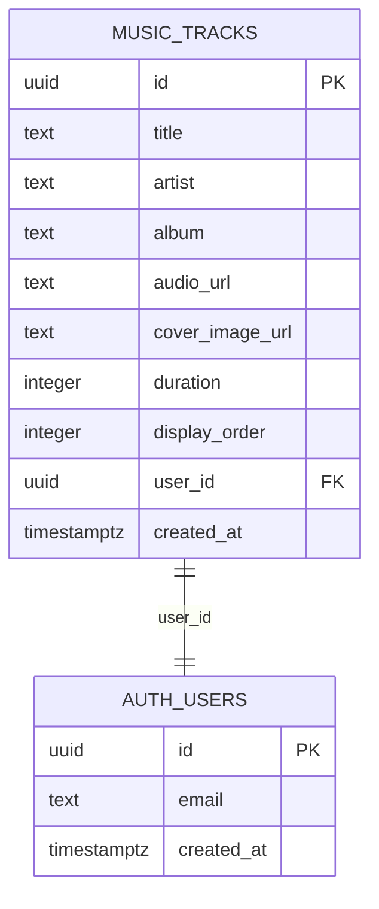
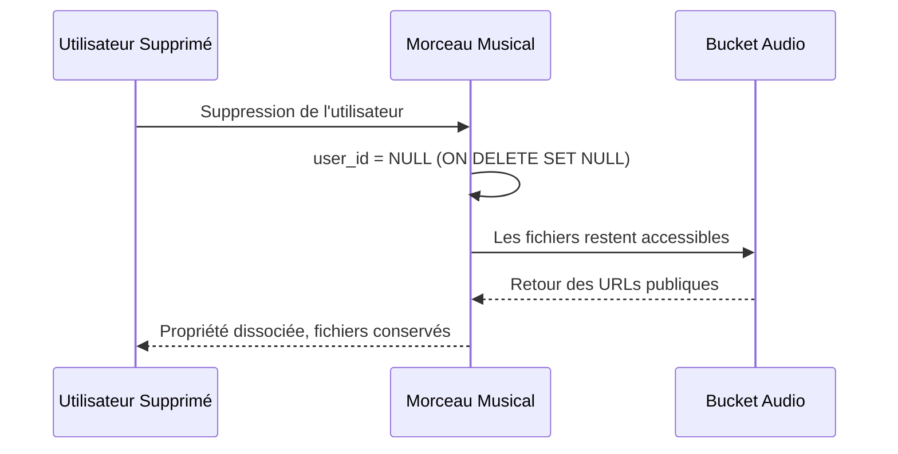
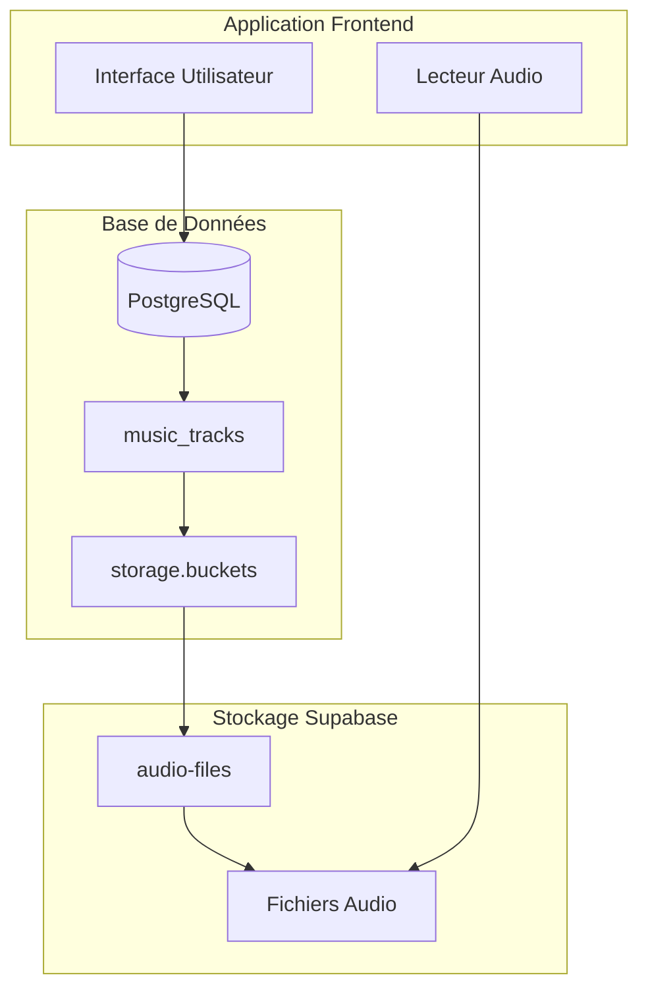
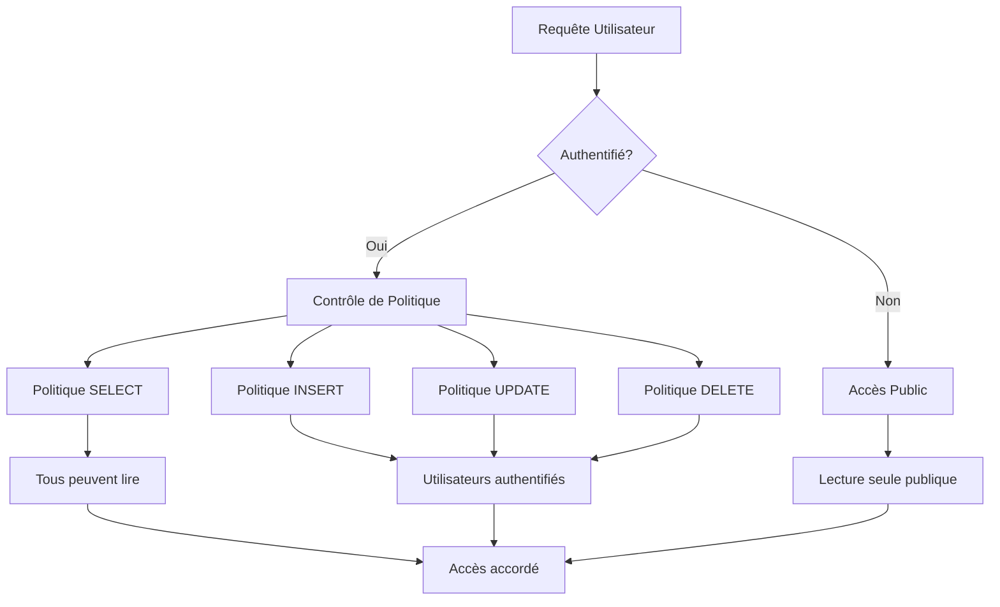
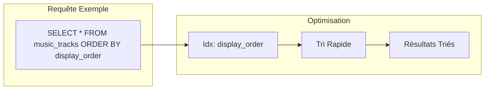
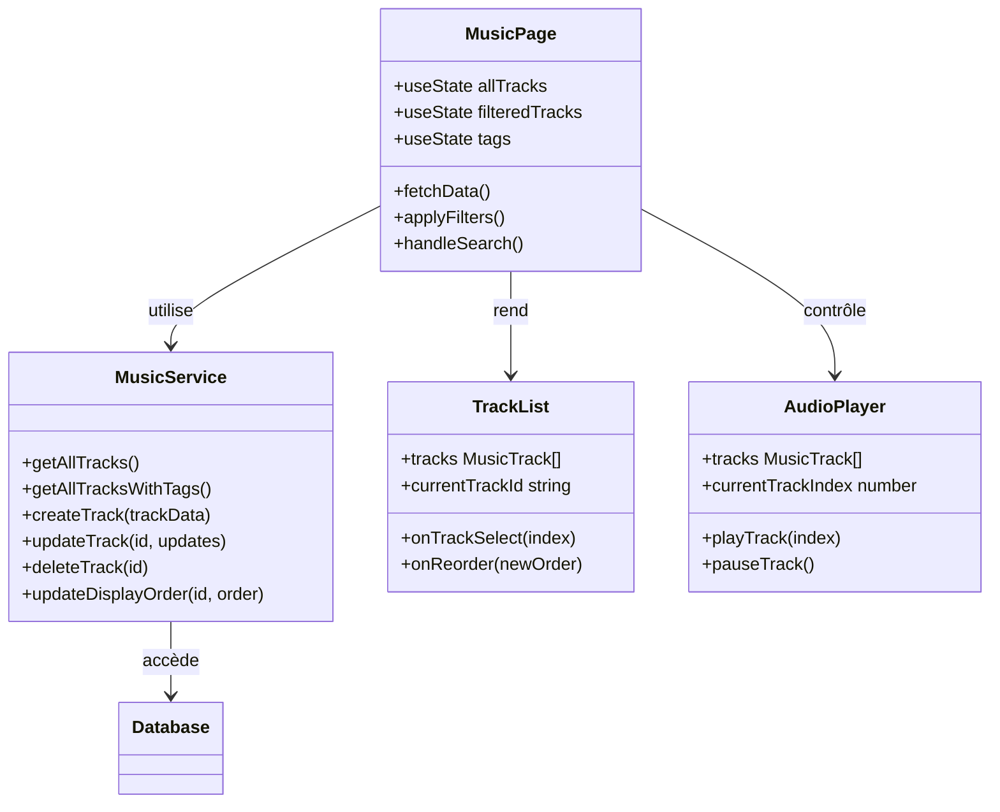

# Schéma de la Musique

<cite>
**Fichiers Référencés dans ce Document**
- [20251106095111_create_music_tracks_table.sql](file://supabase/migrations/20251106095111_create_music_tracks_table.sql)
- [20251106122742_create_audio_storage_bucket.sql](file://supabase/migrations/20251106122742_create_audio_storage_bucket.sql)
- [supabaseClient.ts](file://lib/supabaseClient.ts)
- [musicService.ts](file://services/musicService.ts)
- [page.tsx](file://app/musique/page.tsx)
- [TrackList.tsx](file://components/music/TrackList.tsx)
- [storageService.ts](file://services/storageService.ts)
- [schema.sql](file://database/schema.sql)
</cite>

## Table des Matières
1. [Introduction](#introduction)
2. [Structure de la Table music_tracks](#structure-de-la-table-music_tracks)
3. [Architecture de Stockage](#architecture-de-stockage)
4. [Politiques de Sécurité RLS](#politiques-de-sécurité-rls)
5. [Index et Performance](#index-et-performance)
6. [Intégration avec l'Interface](#intégration-avec-linterface)
7. [Exemples de Requêtes](#exemples-de-requêtes)
8. [Conclusion](#conclusion)

## Introduction

Le système de gestion musicale de cette application utilise une architecture basée sur PostgreSQL avec Supabase pour la gestion des données et du stockage. La table `music_tracks` constitue le cœur du système, stockant toutes les informations relatives aux morceaux de musique, tandis que le bucket Supabase Storage 'audio-files' gère le stockage des fichiers audio.

Cette architecture permet une gestion flexible des contenus musicaux avec des politiques de sécurité robustes et des fonctionnalités de tri optimisées pour l'interface utilisateur.

## Structure de la Table music_tracks

La table `music_tracks` est conçue pour stocker toutes les métadonnées associées aux morceaux de musique avec une structure optimisée pour la recherche et le tri.

### Schéma Détaillé des Champs



**Sources du Diagramme**
- [20251106095111_create_music_tracks_table.sql](file://supabase/migrations/20251106095111_create_music_tracks_table.sql#L34-L44)
- [supabaseClient.ts](file://lib/supabaseClient.ts#L29-L39)

### Description des Champs

| Champ | Type | Contraintes | Valeur par Défaut | Description |
|-------|------|-------------|-------------------|-------------|
| `id` | UUID | Clé primaire, NOT NULL | `gen_random_uuid()` | Identifiant unique généré automatiquement pour chaque morceau |
| `title` | TEXT | NOT NULL | - | Titre principal du morceau musical |
| `artist` | TEXT | NULLABLE | `''` (chaîne vide) | Nom de l'artiste ou du groupe |
| `album` | TEXT | NULLABLE | `''` (chaîne vide) | Nom de l'album auquel appartient le morceau |
| `audio_url` | TEXT | NOT NULL | - | URL du fichier audio dans le bucket Supabase Storage |
| `cover_image_url` | TEXT | NULLABLE | `''` (chaîne vide) | URL de l'image de couverture du morceau |
| `duration` | INTEGER | NULLABLE | `0` | Durée du morceau en secondes |
| `display_order` | INTEGER | NOT NULL | `0` | Ordre d'affichage dans les listes triées |
| `user_id` | UUID | FOREIGN KEY | NULL | Référence à l'utilisateur ayant uploadé le morceau |
| `created_at` | TIMESTAMPTZ | DEFAULT `now()` | - | Date et heure de création du morceau |

**Sources de Section**
- [20251106095111_create_music_tracks_table.sql](file://supabase/migrations/20251106095111_create_music_tracks_table.sql#L34-L44)

### Clé Étrangère et Gestion des Relations

La clé étrangère `user_id` référence la table `auth.users` avec la contrainte `ON DELETE SET NULL`. Cette configuration garantit que lorsque l'utilisateur associé est supprimé, les morceaux restent disponibles mais leur propriété est dissociée.



**Sources du Diagramme**
- [20251106095111_create_music_tracks_table.sql](file://supabase/migrations/20251106095111_create_music_tracks_table.sql#L43)

## Architecture de Stockage

### Intégration avec Supabase Storage

Le système utilise le bucket `audio-files` dans Supabase Storage pour le stockage des fichiers audio. Cette architecture sépare la gestion des métadonnées des données binaires, optimisant les performances et la scalabilité.



**Sources du Diagramme**
- [20251106122742_create_audio_storage_bucket.sql](file://supabase\migrations\20251106122742_create_audio_storage_bucket.sql#L23-L30)
- [storageService.ts](file://services\storageService.ts#L83-L104)

### Configuration du Bucket Audio

Le bucket `audio-files` est configuré avec les paramètres suivants :
- **Accès Public** : Activé pour permettre la lecture publique des fichiers audio
- **Limite de Taille** : 10MB par fichier audio
- **Types MIME Autorisés** : audio/mpeg, audio/mp3, audio/wav, audio/ogg, audio/x-m4a, audio/mp4

**Sources de Section**
- [20251106122742_create_audio_storage_bucket.sql](file://supabase\migrations\20251106122742_create_audio_storage_bucket.sql#L23-L30)

## Politiques de Sécurité RLS

### Sécurité au Niveau des Données

Le système implémente des politiques Row Level Security (RLS) strictes pour contrôler l'accès aux données de musique.



**Sources du Diagramme**
- [20251106095111_create_music_tracks_table.sql](file://supabase\migrations\20251106095111_create_music_tracks_table.sql#L53-L74)

### Politiques de Lecture Publique

**Politique SELECT** : Tous les utilisateurs, authentifiés ou non, peuvent lire les morceaux de musique.

```sql
CREATE POLICY "Tous peuvent voir les morceaux"
ON music_tracks FOR SELECT
USING (true);
```

Cette politique permet aux visiteurs anonymes de consulter la bibliothèque musicale complète, essentielle pour une expérience utilisateur fluide.

### Politiques d'Écriture Restreinte

**Politique INSERT** : Seuls les utilisateurs authentifiés peuvent ajouter de nouveaux morceaux.

**Politique UPDATE** : Seuls les utilisateurs authentifiés peuvent modifier les morceaux existants.

**Politique DELETE** : Seuls les utilisateurs authentifiés peuvent supprimer des morceaux.

Ces politiques garantissent que seuls les utilisateurs autorisés peuvent modifier le contenu, tout en maintenant l'accès public pour la consultation.

**Sources de Section**
- [20251106095111_create_music_tracks_table.sql](file://supabase\migrations\20251106095111_create_music_tracks_table.sql#L58-L74)

## Index et Performance

### Index sur display_order

Un index est créé sur le champ `display_order` pour optimiser les requêtes de tri et de pagination.

```sql
CREATE INDEX IF NOT EXISTS idx_music_tracks_display_order 
ON music_tracks(display_order);
```

### Importance de l'Index

L'index sur `display_order` est crucial pour plusieurs raisons :

1. **Tri des Listes** : Permet un tri efficace lors de l'affichage des morceaux dans l'ordre défini par l'utilisateur
2. **Pagination** : Optimise les requêtes de pagination pour les grandes bibliothèques
3. **Recherche** : Améliore les performances des requêtes filtrées par ordre d'affichage



**Sources du Diagramme**
- [20251106095111_create_music_tracks_table.sql](file://supabase\migrations\20251106095111_create_music_tracks_table.sql#L47-L48)

**Sources de Section**
- [20251106095111_create_music_tracks_table.sql](file://supabase\migrations\20251106095111_create_music_tracks_table.sql#L47-L48)

## Intégration avec l'Interface

### Architecture de l'Interface Musicale

L'interface utilisateur est construite autour de composants React modulaires qui interagissent avec la base de données via le service `musicService`.



**Sources du Diagramme**
- [page.tsx](file://app\musique\page.tsx#L22-L577)
- [musicService.ts](file://services\musicService.ts#L7-L301)
- [TrackList.tsx](file://components\music\TrackList.tsx#L28-L294)

### Fonctionnalités de Tri et Filtrage

L'interface propose plusieurs mécanismes de tri et de filtrage :

1. **Tri par Ordre d'Affichage** : Utilise l'index pour trier rapidement les morceaux
2. **Filtrage par Tags** : Permet de segmenter la bibliothèque par catégories
3. **Recherche Fuzzy** : Recherche avancée avec suggestion de résultats
4. **Playlist Personnalisées** : Gestion d'ordres d'affichage spécifiques

**Sources de Section**
- [page.tsx](file://app\musique\page.tsx#L169-L201)
- [TrackList.tsx](file://components\music\TrackList.tsx#L194-L294)

## Exemples de Requêtes

### Requêtes de Base

#### Récupération de tous les morceaux triés par ordre d'affichage

```sql
SELECT * 
FROM music_tracks 
ORDER BY display_order ASC;
```

Cette requête utilise l'index sur `display_order` pour fournir des résultats rapidement, même avec de grandes collections de morceaux.

#### Requête avec jointure pour obtenir les tags

```sql
SELECT 
    mt.*,
    array_agg(t.name) as tags
FROM music_tracks mt
LEFT JOIN music_tags mtg ON mt.id = mtg.music_track_id
LEFT JOIN tags t ON mtg.tag_id = t.id
GROUP BY mt.id
ORDER BY mt.display_order ASC;
```

### Requêtes Avancées

#### Recherche par artiste avec tri par pertinence

```sql
SELECT *
FROM music_tracks
WHERE artist ILIKE '%nom_artiste%'
ORDER BY 
    CASE 
        WHEN artist ILIKE 'nom_artiste%' THEN 1
        WHEN artist ILIKE '%nom_artiste%' THEN 2
        ELSE 3
    END,
    display_order ASC;
```

#### Gestion de l'ordre d'affichage dynamique

```sql
-- Augmenter l'ordre d'affichage pour tous les morceaux >= nouvel_ordre
UPDATE music_tracks
SET display_order = display_order + 1
WHERE display_order >= :nouvel_ordre;

-- Insérer un nouveau morceau à l'ordre désiré
INSERT INTO music_tracks (title, artist, display_order, ...)
VALUES (:titre, :artiste, :nouvel_ordre, ...);
```

### Requêtes TypeScript

Les services TypeScript offrent des abstractions pour ces requêtes complexes :

```typescript
// Récupération avec cache
const { tracks, error } = await musicService.getAllTracksWithTags();

// Création avec validation
const { track, error } = await musicService.createTrack({
  title: "Titre du Morceau",
  artist: "Artiste",
  audio_url: "/storage/v1/object/public/audio-files/fichier.mp3",
  display_order: 0
});
```

**Sources de Section**
- [musicService.ts](file://services\musicService.ts#L8-L301)

## Conclusion

Le schéma de la musique présente une architecture robuste et bien conçue qui répond aux besoins d'une application musicale moderne. Les caractéristiques principales incluent :

### Forces du Système

1. **Séparation des Responsabilités** : Les métadonnées sont stockées dans PostgreSQL tandis que les fichiers audio sont gérés par Supabase Storage
2. **Sécurité RLS** : Politiques de sécurité granulaires permettant un contrôle précis des accès
3. **Performance Optimisée** : Index stratégiques et cache intégré pour une expérience utilisateur fluide
4. **Flexibilité** : Support de multiples formats audio et possibilités de personnalisation

### Recommandations d'Évolution

1. **Monitoring des Performances** : Surveiller l'utilisation de l'index et optimiser selon les patterns d'accès
2. **Compression Automatique** : Implémenter une compression automatique des fichiers audio
3. **Cache Intelligent** : Améliorer la stratégie de cache pour les requêtes fréquentes
4. **Analytics** : Ajouter des métriques d'utilisation pour optimiser l'expérience utilisateur

Cette architecture constitue une base solide pour une application musicale évolutive, capable de gérer efficacement de grandes collections de morceaux tout en maintenant une interface utilisateur réactive et sécurisée.