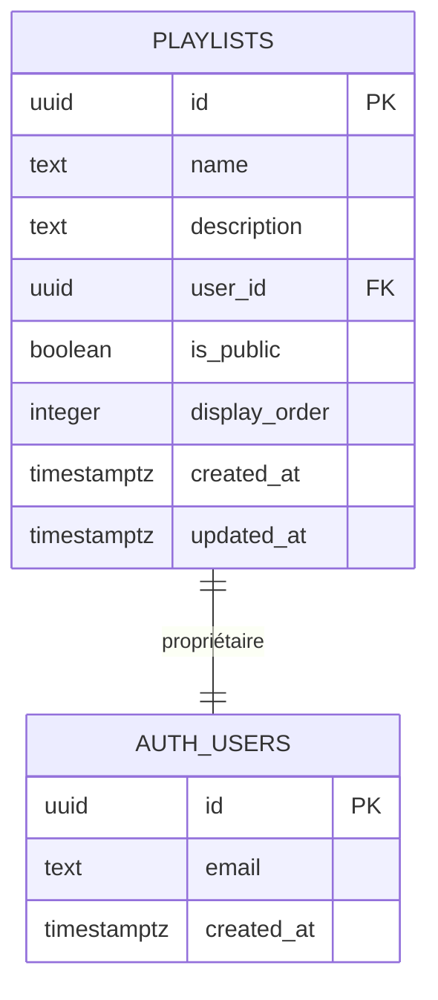
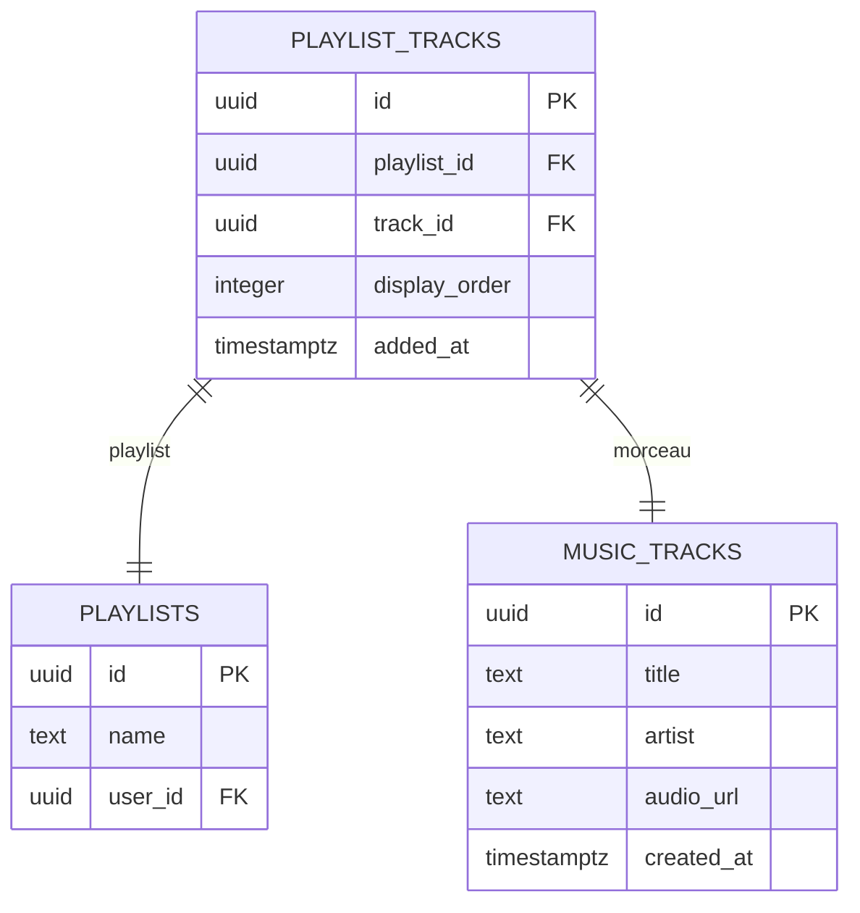
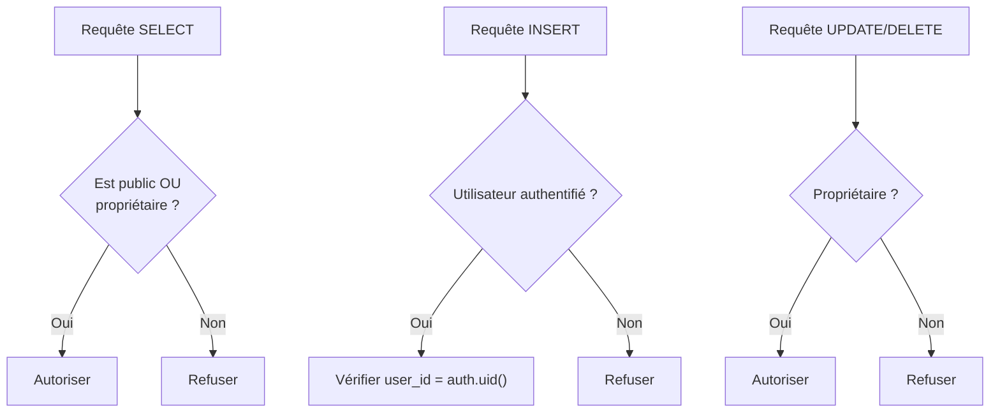
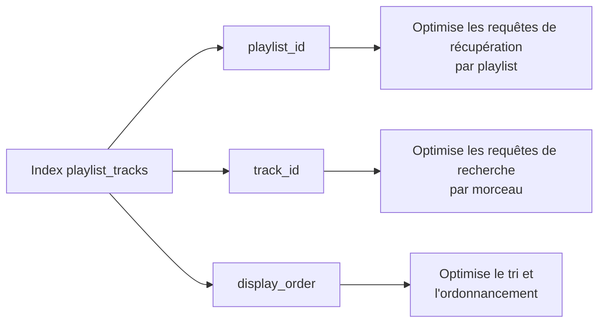
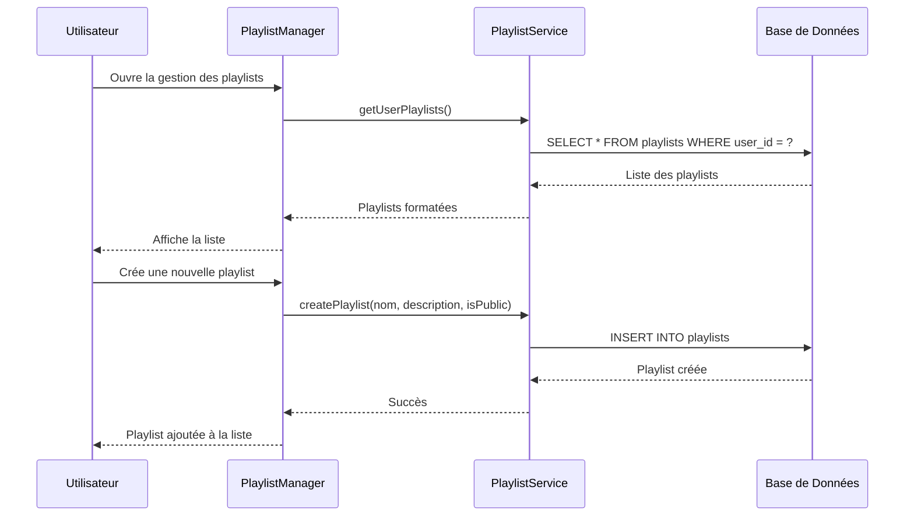
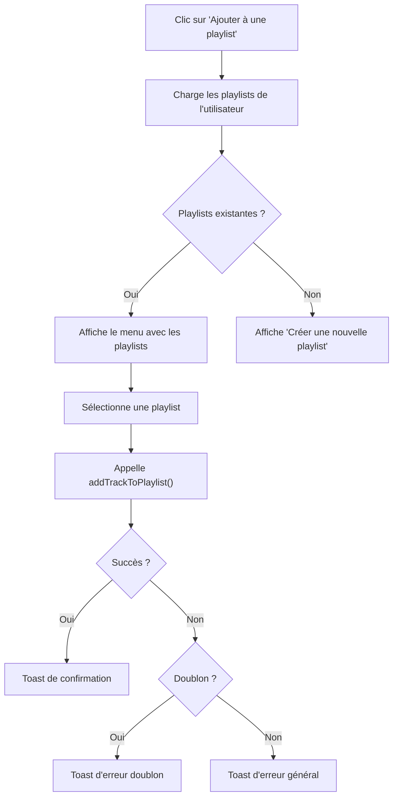
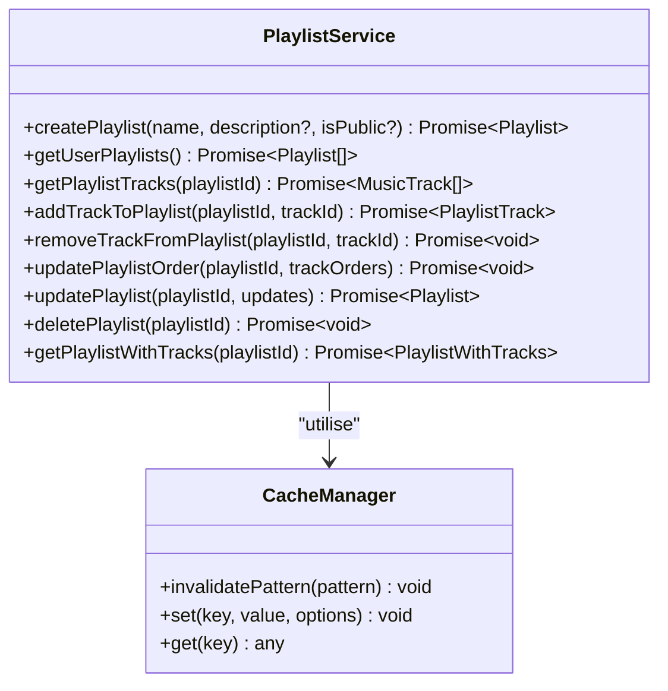
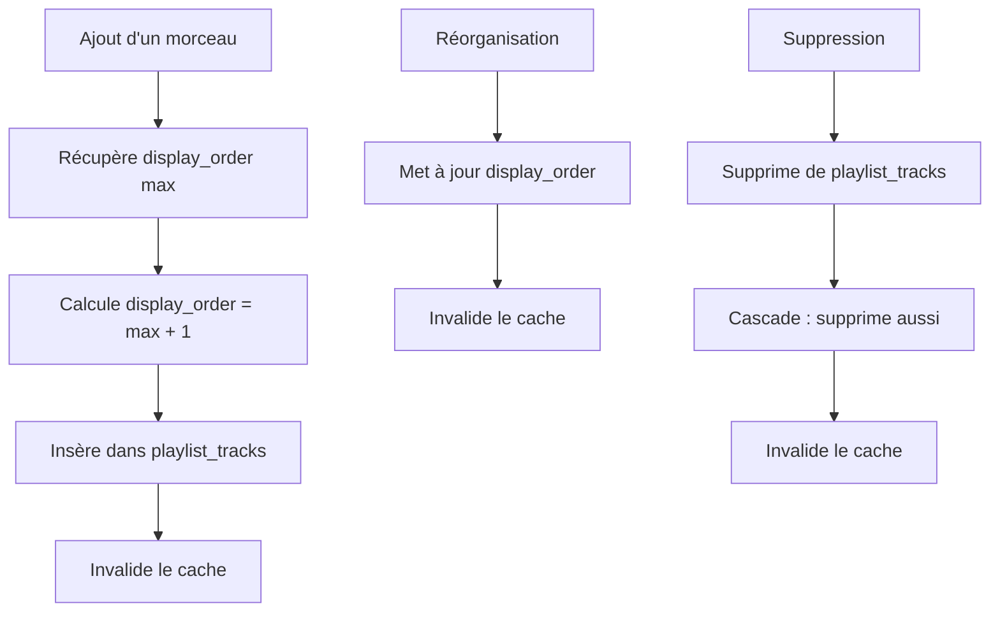

# Schéma des Playlists

<cite>
**Fichiers Référencés dans ce Document**
- [20251111050910_create_playlists_system.sql](file://supabase/migrations/20251111050910_create_playlists_system.sql)
- [playlistService.ts](file://services/playlistService.ts)
- [supabaseClient.ts](file://lib/supabaseClient.ts)
- [PlaylistManager.tsx](file://components/music/PlaylistManager.tsx)
- [AddToPlaylistMenu.tsx](file://components/music/AddToPlaylistMenu.tsx)
- [CreatePlaylistDialog.tsx](file://components/music/CreatePlaylistDialog.tsx)
- [validators.ts](file://lib/validators.ts)
</cite>

## Table des Matières
1. [Introduction](#introduction)
2. [Structure des Tables](#structure-des-tables)
3. [Modèles de Données TypeScript](#modèles-de-données-typescript)
4. [Politiques de Sécurité RLS](#politiques-de-sécurité-rls)
5. [Indexation pour Optimisation](#indexation-pour-optimisation)
6. [Interface Utilisateur](#interface-utilisateur)
7. [Services et API](#services-et-api)
8. [Exemples de Requêtes](#exemples-de-requêtes)
9. [Mécanisme de Gestion des Playlists](#mécanisme-de-gestion-des-playlists)
10. [Conclusion](#conclusion)

## Introduction

Le système de playlists du portfolio permet aux utilisateurs authentifiés de créer, gérer et organiser leurs morceaux musicaux préférés. Ce système repose sur deux tables principales : `playlists` et `playlist_tracks`, avec des politiques de sécurité Row Level Security (RLS) pour garantir la confidentialité des données personnelles.

## Structure des Tables

### Table `playlists`

La table `playlists` stocke les informations principales des playlists utilisateur.



**Sources du diagramme**
- [20251111050910_create_playlists_system.sql](file://supabase/migrations/20251111050910_create_playlists_system.sql#L41-L49)

#### Champs de la Table `playlists`

| Champ | Type | Contraintes | Description |
|-------|------|-------------|-------------|
| `id` | UUID | PRIMARY KEY, DEFAULT: gen_random_uuid() | Identifiant unique de la playlist |
| `name` | TEXT | NOT NULL | Nom de la playlist (max 100 caractères) |
| `description` | TEXT | NULLABLE | Description optionnelle de la playlist (max 500 caractères) |
| `user_id` | UUID | NOT NULL, FK: auth.users(id), ON DELETE: CASCADE | ID de l'utilisateur propriétaire |
| `is_public` | BOOLEAN | DEFAULT: false | Indicateur de visibilité publique |
| `display_order` | INTEGER | DEFAULT: 0 | Ordre d'affichage numérique |
| `created_at` | TIMESTAMPTZ | DEFAULT: now() | Timestamp de création |
| `updated_at` | TIMESTAMPTZ | DEFAULT: now() | Timestamp de dernière modification |

### Table `playlist_tracks`

La table `playlist_tracks` constitue la table de jointure entre playlists et morceaux musicaux.



**Sources du diagramme**
- [20251111050910_create_playlists_system.sql](file://supabase/migrations/20251111050910_create_playlists_system.sql#L53-L59)

#### Champs de la Table `playlist_tracks`

| Champ | Type | Contraintes | Description |
|-------|------|-------------|-------------|
| `id` | UUID | PRIMARY KEY, DEFAULT: gen_random_uuid() | Identifiant unique de la relation |
| `playlist_id` | UUID | NOT NULL, FK: playlists(id), ON DELETE: CASCADE | ID de la playlist parent |
| `track_id` | UUID | NOT NULL, FK: music_tracks(id), ON DELETE: CASCADE | ID du morceau musical |
| `display_order` | INTEGER | DEFAULT: 0 | Ordre d'affichage dans la playlist |
| `added_at` | TIMESTAMPTZ | DEFAULT: now() | Timestamp d'ajout au moment de l'insertion |

**Sources de la section**
- [20251111050910_create_playlists_system.sql](file://supabase/migrations/20251111050910_create_playlists_system.sql#L41-L59)

## Modèles de Données TypeScript

### Interface `Playlist`

```typescript
export type Playlist = {
  id: string;
  name: string;
  description: string | null;
  user_id: string;
  is_public: boolean;
  display_order: number;
  created_at: string;
  updated_at: string;
};
```

### Interface `PlaylistTrack`

```typescript
export type PlaylistTrack = {
  id: string;
  playlist_id: string;
  track_id: string;
  display_order: number;
  added_at: string;
};
```

### Interface `PlaylistWithTracks`

```typescript
export type PlaylistWithTracks = Playlist & {
  tracks?: MusicTrack[];
};
```

**Sources de la section**
- [supabaseClient.ts](file://lib/supabaseClient.ts#L181-L199)

## Politiques de Sécurité RLS

Le système implémente des politiques RLS strictes pour contrôler l'accès aux données.

### Politiques pour `playlists`



**Sources du diagramme**
- [20251111050910_create_playlists_system.sql](file://supabase/migrations/20251111050910_create_playlists_system.sql#L72-L94)

#### Politiques de Lecture (`SELECT`)
- **Tous peuvent voir les playlists publiques** : `is_public = true`
- **Tous peuvent voir leurs propres playlists** : `user_id = auth.uid()`

#### Politiques d'Écriture (`INSERT/UPDATE/DELETE`)
- **Seuls les utilisateurs authentifiés** peuvent créer des playlists
- **Seuls les propriétaires** peuvent modifier ou supprimer leurs playlists

### Politiques pour `playlist_tracks`

#### Politiques de Lecture (`SELECT`)
- **Tous peuvent voir les tracks des playlists publiques** : `playlists.is_public = true`
- **Tous peuvent voir les tracks de leurs propres playlists** : `playlists.user_id = auth.uid()`

#### Politiques d'Écriture (`INSERT/UPDATE/DELETE`)
- **Seuls les propriétaires** peuvent ajouter, modifier ou retirer des tracks
- **Vérification EXISTS** sur la table playlists pour chaque opération

**Sources de la section**
- [20251111050910_create_playlists_system.sql](file://supabase/migrations/20251111050910_create_playlists_system.sql#L72-L148)

## Indexation pour Optimisation

Le système utilise trois index clés pour optimiser les performances des requêtes courantes :

### Index sur `playlist_tracks`



**Sources du diagramme**
- [20251111050910_create_playlists_system.sql](file://supabase/migrations/20251111050910_create_playlists_system.sql#L63-L65)

### Types d'Index

| Index | Colonne(s) | But |
|-------|------------|-----|
| `idx_playlist_tracks_playlist_id` | `playlist_id` | Optimise les requêtes de récupération par playlist |
| `idx_playlist_tracks_track_id` | `track_id` | Optimise les requêtes de recherche par morceau |
| `idx_playlist_tracks_display_order` | `playlist_id, display_order` | Optimise le tri et l'ordonnancement |

**Sources de la section**
- [20251111050910_create_playlists_system.sql](file://supabase/migrations/20251111050910_create_playlists_system.sql#L63-L65)

## Interface Utilisateur

### Composant PlaylistManager

Le composant `PlaylistManager` fournit une interface complète pour gérer les playlists utilisateur.



**Sources du diagramme**
- [PlaylistManager.tsx](file://components/music/PlaylistManager.tsx#L45-L72)
- [playlistService.ts](file://services/playlistService.ts#L16-L89)

### Composant AddToPlaylistMenu

Permet d'ajouter des morceaux à une playlist existante ou de créer une nouvelle playlist.



**Sources du diagramme**
- [AddToPlaylistMenu.tsx](file://components/music/AddToPlaylistMenu.tsx#L74-L107)

**Sources de la section**
- [PlaylistManager.tsx](file://components/music/PlaylistManager.tsx#L34-L300)
- [AddToPlaylistMenu.tsx](file://components/music/AddToPlaylistMenu.tsx#L31-L220)

## Services et API

### Service PlaylistService

Le service `playlistService` expose une API complète pour manipuler les playlists.



**Sources du diagramme**
- [playlistService.ts](file://services/playlistService.ts#L9-L446)

### Fonctionnalités Principales

| Fonction | Description | Paramètres |
|----------|-------------|------------|
| `createPlaylist` | Crée une nouvelle playlist | name, description, isPublic |
| `getUserPlaylists` | Récupère toutes les playlists de l'utilisateur | - |
| `getPlaylistTracks` | Récupère les morceaux d'une playlist | playlistId |
| `addTrackToPlaylist` | Ajoute un morceau à une playlist | playlistId, trackId |
| `removeTrackFromPlaylist` | Retire un morceau d'une playlist | playlistId, trackId |
| `updatePlaylistOrder` | Réorganise les morceaux d'une playlist | playlistId, trackOrders |
| `updatePlaylist` | Modifie les métadonnées d'une playlist | playlistId, updates |
| `deletePlaylist` | Supprime une playlist | playlistId |
| `getPlaylistWithTracks` | Récupère une playlist avec ses morceaux | playlistId |

**Sources de la section**
- [playlistService.ts](file://services/playlistService.ts#L9-L446)

## Exemples de Requêtes

### Requêtes SQL

#### 1. Listage des playlists d'un utilisateur
```sql
SELECT * 
FROM playlists 
WHERE user_id = 'user-id-here'
ORDER BY display_order ASC;
```

#### 2. Récupération des morceaux d'une playlist spécifique
```sql
SELECT pt.*, mt.*
FROM playlist_tracks pt
JOIN music_tracks mt ON pt.track_id = mt.id
WHERE pt.playlist_id = 'playlist-id-here'
ORDER BY pt.display_order ASC;
```

#### 3. Vérification des permissions d'accès
```sql
-- Vérifier si l'utilisateur peut voir une playlist
SELECT COUNT(*) 
FROM playlists 
WHERE id = 'playlist-id-here' 
AND (is_public = true OR user_id = auth.uid());
```

### Requêtes TypeScript

#### 1. Récupération des playlists utilisateur
```typescript
const { playlists, error } = await playlistService.getUserPlaylists();
```

#### 2. Ajout d'un morceau à une playlist
```typescript
const { playlistTrack, error } = await playlistService.addTrackToPlaylist(
  playlistId, 
  trackId
);
```

#### 3. Récupération d'une playlist complète
```typescript
const { playlist, error } = await playlistService.getPlaylistWithTracks(playlistId);
```

**Sources de la section**
- [playlistService.ts](file://services/playlistService.ts#L80-L173)
- [playlistService.ts](file://services/playlistService.ts#L138-L173)

## Mécanisme de Gestion des Playlists

### Ajout et Réorganisation des Morceaux

Le système permet aux utilisateurs de gérer dynamiquement le contenu de leurs playlists :



**Sources du diagramme**
- [playlistService.ts](file://services/playlistService.ts#L189-L242)
- [playlistService.ts](file://services/playlistService.ts#L245-L270)

### Validation des Données

Le système utilise des schémas de validation pour garantir l'intégrité des données :

```typescript
// Schéma de validation pour la création de playlists
export const createPlaylistSchema = playlistSchema.omit({ 
  display_order: true 
});
```

**Sources de la section**
- [validators.ts](file://lib/validators.ts#L202-L202)
- [playlistService.ts](file://services/playlistService.ts#L189-L242)

## Conclusion

Le système de playlists offre une solution complète et sécurisée pour la gestion des collections musicales des utilisateurs. Avec sa structure de tables bien conçue, ses politiques de sécurité robustes, et son interface utilisateur intuitive, il permet aux utilisateurs de créer, organiser et partager leurs playlists musicales de manière efficace et sécurisée.

Les fonctionnalités clés incluent :
- Création et gestion de playlists personnelles
- Partage public configurable
- Organisation flexible des morceaux
- Interface utilisateur réactive
- Cache intelligent pour les performances
- Sécurité Row Level Security complète

Cette architecture permet une scalabilité future tout en maintenant la simplicité d'utilisation et la sécurité des données utilisateur.