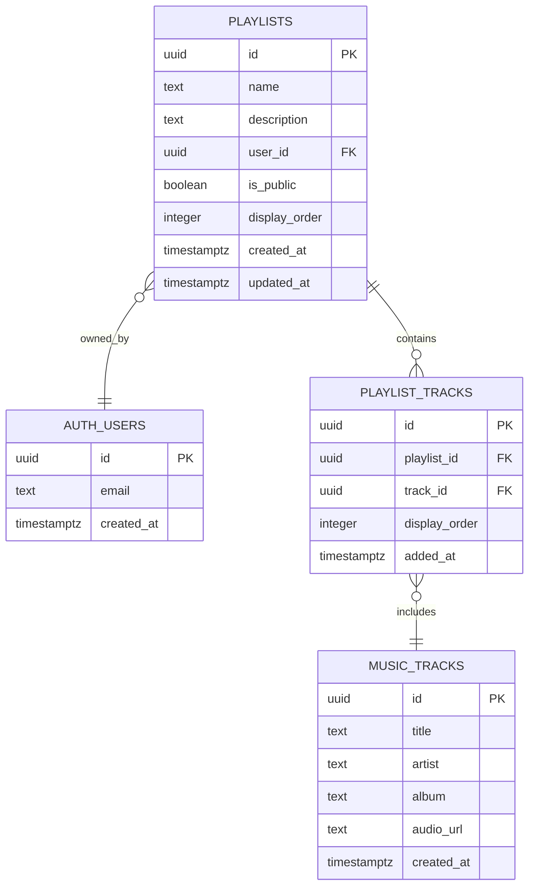
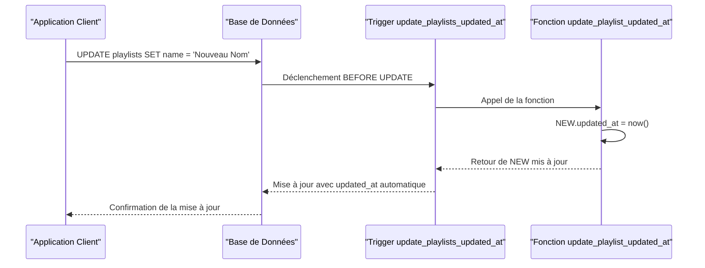
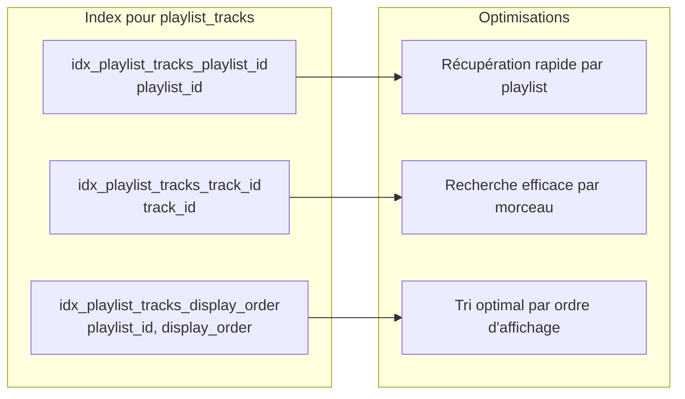
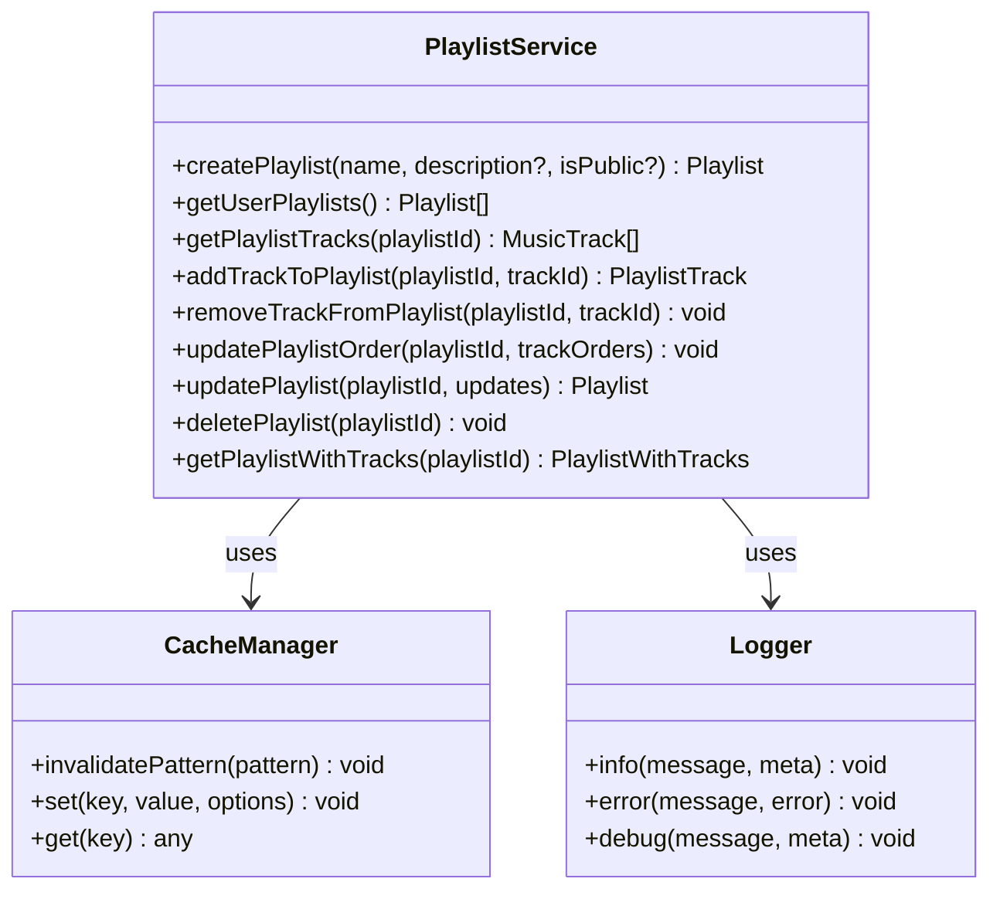
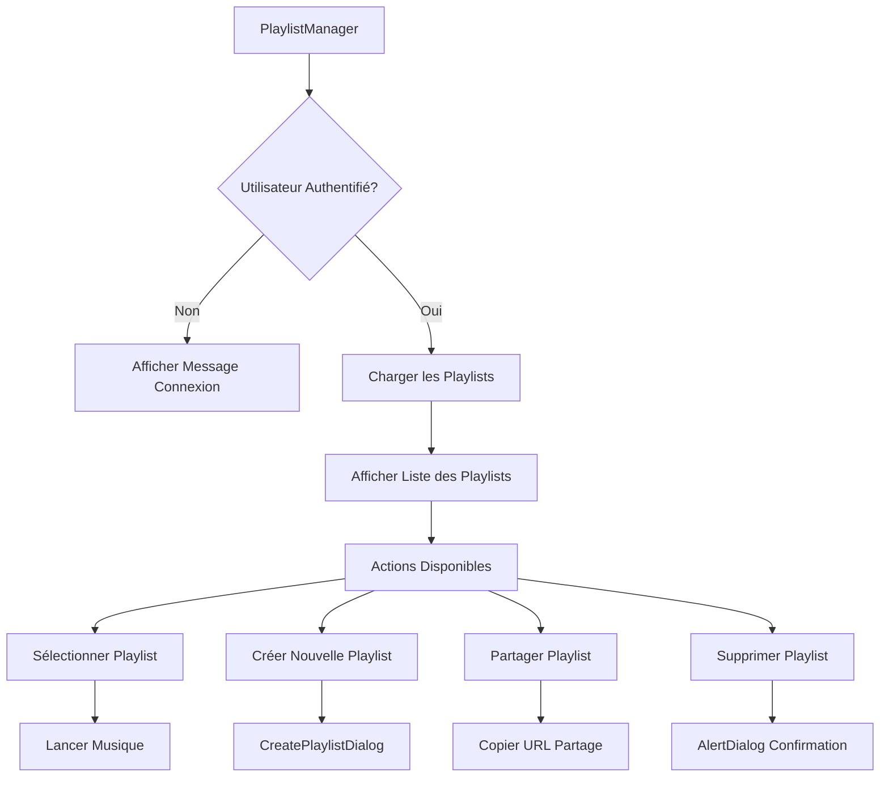
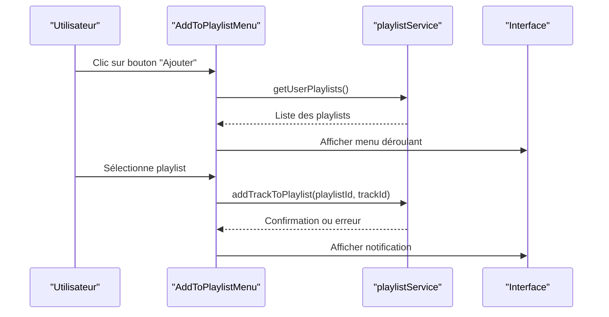

# Schéma des Playlists

<cite>
**Fichiers Référencés dans ce Document**
- [20251111050910_create_playlists_system.sql](file://supabase/migrations/20251111050910_create_playlists_system.sql)
- [playlistService.ts](file://services/playlistService.ts)
- [PlaylistManager.tsx](file://components/music/PlaylistManager.tsx)
- [AddToPlaylistMenu.tsx](file://components/music/AddToPlaylistMenu.tsx)
- [CreatePlaylistDialog.tsx](file://components/music/CreatePlaylistDialog.tsx)
- [supabaseClient.ts](file://lib/supabaseClient.ts)
- [validators.ts](file://lib/validators.ts)
- [schema.sql](file://database/schema.sql)
</cite>

## Table des Matières
1. [Introduction](#introduction)
2. [Structure des Tables](#structure-des-tables)
3. [Système de Sécurité RLS](#système-de-sécurité-rls)
4. [Trigger et Fonctions](#trigger-et-fonctions)
5. [Index Stratégiques](#index-stratégiques)
6. [Services Backend](#services-backend)
7. [Interface Utilisateur](#interface-utilisateur)
8. [Requêtes Exemples](#requêtes-exemples)
9. [Optimisations et Performances](#optimisations-et-performances)
10. [Conclusion](#conclusion)

## Introduction

Le système de playlists constitue un composant central de l'application musicale, permettant aux utilisateurs de créer, organiser et partager des collections de morceaux. Ce système repose sur deux tables principales : `playlists` et `playlist_tracks`, qui implémentent une relation many-to-many avec des contraintes de sécurité robustes et des optimisations de performance sophistiquées.

## Structure des Tables

### Table `playlists`

La table `playlists` stocke les informations principales des playlists utilisateur avec des contraintes strictes et des fonctionnalités avancées.



**Sources du Diagramme**
- [20251111050910_create_playlists_system.sql](file://supabase/migrations/20251111050910_create_playlists_system.sql#L40-L60)

#### Détail des Champs

| Champ | Type | Contraintes | Description |
|-------|------|-------------|-------------|
| `id` | UUID | PRIMARY KEY, DEFAULT gen_random_uuid() | Identifiant unique de la playlist |
| `name` | TEXT | NOT NULL, MAX 100 chars | Nom de la playlist (obligatoire) |
| `description` | TEXT | NULLABLE, MAX 500 chars | Description optionnelle de la playlist |
| `user_id` | UUID | NOT NULL, FK auth.users(id), ON DELETE CASCADE | ID de l'utilisateur propriétaire |
| `is_public` | BOOLEAN | DEFAULT false | Indicateur de visibilité publique |
| `display_order` | INTEGER | NOT NULL, DEFAULT 0 | Ordre d'affichage personnalisé |
| `created_at` | TIMESTAMPTZ | DEFAULT now() | Timestamp de création automatique |
| `updated_at` | TIMESTAMPTZ | DEFAULT now() | Timestamp de mise à jour automatique |

**Sources de Section**
- [20251111050910_create_playlists_system.sql](file://supabase/migrations/20251111050910_create_playlists_system.sql#L40-L60)

### Table `playlist_tracks`

La table `playlist_tracks` implémente la relation many-to-many entre playlists et morceaux musicaux avec gestion d'ordre et contraintes d'unicité.

#### Détail des Champs

| Champ | Type | Contraintes | Description |
|-------|------|-------------|-------------|
| `id` | UUID | PRIMARY KEY, DEFAULT gen_random_uuid() | Identifiant unique de la relation |
| `playlist_id` | UUID | NOT NULL, FK playlists(id), ON DELETE CASCADE | ID de la playlist parent |
| `track_id` | UUID | NOT NULL, FK music_tracks(id), ON DELETE CASCADE | ID du morceau musical |
| `display_order` | INTEGER | NOT NULL, DEFAULT 0 | Ordre d'affichage dans la playlist |
| `added_at` | TIMESTAMPTZ | DEFAULT now() | Timestamp d'ajout automatique |

**Contrainte d'Unicité** : La combinaison `(playlist_id, track_id)` garantit qu'un morceau ne peut être ajouté qu'une seule fois à une playlist donnée.

**Sources de Section**
- [20251111050910_create_playlists_system.sql](file://supabase/migrations/20251111050910_create_playlists_system.sql#L52-L60)

## Système de Sécurité RLS

Le système de sécurité utilise Row Level Security (RLS) pour contrôler l'accès aux données selon les politiques complexes définies.

### Politiques de Sécurité pour `playlists`

#### Politique SELECT
```sql
CREATE POLICY "Tous peuvent voir les playlists publiques"
ON playlists FOR SELECT
USING (is_public = true OR user_id = auth.uid());
```

Cette politique permet à tous les utilisateurs (authentifiés ou non) de voir :
- Toutes les playlists publiques (`is_public = true`)
- Toutes leurs propres playlists (`user_id = auth.uid()`)

#### Politique INSERT
```sql
CREATE POLICY "Utilisateurs authentifiés peuvent créer des playlists"
ON playlists FOR INSERT
TO authenticated
WITH CHECK (user_id = auth.uid());
```

Seuls les utilisateurs authentifiés peuvent créer des playlists, avec vérification que `user_id` correspond à l'utilisateur actuel.

#### Politiques UPDATE et DELETE
```sql
CREATE POLICY "Propriétaires peuvent modifier leurs playlists"
ON playlists FOR UPDATE
USING (user_id = auth.uid())
WITH CHECK (user_id = auth.uid());
```

Seuls les propriétaires peuvent modifier ou supprimer leurs playlists.

**Sources de Section**
- [20251111050910_create_playlists_system.sql](file://supabase/migrations/20251111050910_create_playlists_system.sql#L72-L94)

### Politiques de Sécurité pour `playlist_tracks`

#### Politique SELECT Complexe
```sql
CREATE POLICY "Tous peuvent voir les tracks des playlists publiques"
ON playlist_tracks FOR SELECT
USING (
  EXISTS (
    SELECT 1 FROM playlists 
    WHERE playlists.id = playlist_tracks.playlist_id 
    AND (playlists.is_public = true OR playlists.user_id = auth.uid())
  )
);
```

Cette politique utilise une requête EXISTS pour vérifier que :
- La playlist existe
- Elle est publique OU appartient à l'utilisateur actuel

#### Politiques INSERT, UPDATE et DELETE
```sql
CREATE POLICY "Propriétaires peuvent ajouter des tracks à leurs playlists"
ON playlist_tracks FOR INSERT
TO authenticated
WITH CHECK (
  EXISTS (
    SELECT 1 FROM playlists 
    WHERE playlists.id = playlist_tracks.playlist_id 
    AND playlists.user_id = auth.uid()
  )
);
```

Toutes ces opérations nécessitent que l'utilisateur soit propriétaire de la playlist concernée.

**Sources de Section**
- [20251111050910_create_playlists_system.sql](file://supabase/migrations/20251111050910_create_playlists_system.sql#L96-L148)

## Trigger et Fonctions

### Trigger `update_playlists_updated_at`

Le système utilise un trigger pour maintenir automatiquement la date de dernière modification des playlists.



**Sources du Diagramme**
- [20251111050910_create_playlists_system.sql](file://supabase/migrations/20251111050910_create_playlists_system.sql#L149-L163)

#### Fonction de Trigger
```sql
CREATE OR REPLACE FUNCTION update_playlist_updated_at()
RETURNS TRIGGER AS $$
BEGIN
  NEW.updated_at = now();
  RETURN NEW;
END;
$$ LANGUAGE plpgsql;
```

#### Définition du Trigger
```sql
CREATE TRIGGER update_playlists_updated_at
  BEFORE UPDATE ON playlists
  FOR EACH ROW
  EXECUTE FUNCTION update_playlist_updated_at();
```

Cette fonction garantit que chaque mise à jour de playlist met automatiquement à jour le champ `updated_at` avec l'instant actuel.

**Sources de Section**
- [20251111050910_create_playlists_system.sql](file://supabase/migrations/20251111050910_create_playlists_system.sql#L149-L163)

## Index Stratégiques

Le système utilise plusieurs index pour optimiser les performances des requêtes courantes.

### Index sur `playlist_tracks`



**Sources du Diagramme**
- [20251111050910_create_playlists_system.sql](file://supabase/migrations/20251111050910_create_playlists_system.sql#L63-L66)

#### Détail des Index

| Index | Colonne(s) | But |
|-------|------------|-----|
| `idx_playlist_tracks_playlist_id` | `playlist_id` | Optimise les requêtes de récupération par playlist |
| `idx_playlist_tracks_track_id` | `track_id` | Optimise les requêtes de recherche par morceau |
| `idx_playlist_tracks_display_order` | `playlist_id, display_order` | Optimise le tri par ordre d'affichage |

Ces index permettent des performances optimales pour :
- Récupérer tous les morceaux d'une playlist spécifique
- Vérifier rapidement si un morceau existe dans une playlist
- Tri des morceaux selon l'ordre d'affichage personnalisé

**Sources de Section**
- [20251111050910_create_playlists_system.sql](file://supabase/migrations/20251111050910_create_playlists_system.sql#L63-L66)

## Services Backend

### Service `playlistService`

Le service `playlistService` fournit une interface TypeScript complète pour interagir avec le système de playlists.



**Sources du Diagramme**
- [playlistService.ts](file://services/playlistService.ts#L9-L446)

#### Fonctionnalités Principales

##### Création de Playlist
- Vérification d'authentification de l'utilisateur
- Calcul automatique de l'ordre d'affichage
- Gestion des erreurs et invalidation du cache

##### Gestion des Tracks
- Ajout de morceaux avec ordre automatique
- Vérification des doublons (contrainte UNIQUE)
- Mise à jour d'ordre multiple avec transaction

##### Cache Intelligente
Le service utilise un système de cache avec TTL de 5 minutes pour optimiser les performances :
- Cache des playlists utilisateur
- Cache des morceaux de playlist
- Cache des playlists complètes avec morceaux

**Sources de Section**
- [playlistService.ts](file://services/playlistService.ts#L9-L446)

## Interface Utilisateur

### Composant `PlaylistManager`

Le composant `PlaylistManager` offre une interface complète pour gérer les playlists utilisateur.



**Sources du Diagramme**
- [PlaylistManager.tsx](file://components/music/PlaylistManager.tsx#L34-L300)

#### Fonctionnalités UI

##### Gestion des Playlists
- Affichage conditionnel basé sur l'authentification
- Chargement avec indicateur de progression
- Interface responsive adaptative

##### Actions Utilisateur
- Sélection de playlists pour lecture
- Création via formulaire modale
- Partage via copie d'URL
- Suppression avec confirmation

**Sources de Section**
- [PlaylistManager.tsx](file://components/music/PlaylistManager.tsx#L34-L300)

### Composant `AddToPlaylistMenu`

Ce composant permet d'ajouter facilement des morceaux à des playlists existantes.



**Sources du Diagramme**
- [AddToPlaylistMenu.tsx](file://components/music/AddToPlaylistMenu.tsx#L31-L220)

**Sources de Section**
- [AddToPlaylistMenu.tsx](file://components/music/AddToPlaylistMenu.tsx#L31-L220)

## Requêtes Exemples

### Récupérer les Playlists d'un Utilisateur

```sql
SELECT 
    p.id, 
    p.name, 
    p.description, 
    p.is_public, 
    p.display_order,
    COUNT(pt.track_id) as track_count
FROM 
    playlists p
LEFT JOIN 
    playlist_tracks pt ON p.id = pt.playlist_id
WHERE 
    p.user_id = auth.uid()
GROUP BY 
    p.id
ORDER BY 
    p.display_order ASC;
```

Cette requête retourne :
- Informations de base de chaque playlist
- Nombre de morceaux dans chaque playlist
- Tri par ordre d'affichage personnalisé

### Vérifier l'Appartenance d'un Morceau

```sql
SELECT 
    pt.id,
    pt.display_order,
    pt.added_at,
    t.title,
    t.artist
FROM 
    playlist_tracks pt
JOIN 
    music_tracks t ON pt.track_id = t.id
WHERE 
    pt.playlist_id = 'playlist_uuid'
    AND pt.track_id = 'track_uuid';
```

Cette requête vérifie :
- Existence du morceau dans la playlist
- Ordre d'affichage actuel
- Informations détaillées du morceau

### Requête Complexe avec Jointures

```sql
WITH public_playlists AS (
    SELECT id FROM playlists 
    WHERE is_public = true
),
user_playlists AS (
    SELECT id FROM playlists 
    WHERE user_id = auth.uid()
)
SELECT 
    p.id,
    p.name,
    p.is_public,
    COUNT(pt.track_id) as total_tracks,
    CASE 
        WHEN p.is_public THEN 'Publique'
        ELSE 'Privée'
    END as visibility
FROM 
    playlists p
LEFT JOIN 
    playlist_tracks pt ON p.id = pt.playlist_id
WHERE 
    p.id IN (SELECT id FROM public_playlists)
    OR p.id IN (SELECT id FROM user_playlists)
GROUP BY 
    p.id, p.name, p.is_public
ORDER BY 
    p.created_at DESC;
```

Cette requête complexe combine :
- Politiques de sécurité RLS
- Aggrégation de statistiques
- Classification de visibilité
- Tri par date de création

**Sources de Section**
- [playlistService.ts](file://services/playlistService.ts#L86-L129)
- [playlistService.ts](file://services/playlistService.ts#L138-L182)

## Optimisations et Performances

### Stratégies de Cache

Le système implémente plusieurs niveaux de cache pour optimiser les performances :

#### Cache Application
- **TTL de 5 minutes** pour les données fréquemment accédées
- **Invalidation automatique** lors des modifications
- **Clés de cache spécifiques** par fonctionnalité

#### Optimisations Base de Données
- **Index multicritères** pour les jointures complexes
- **Cascade DELETE** pour éviter les requêtes supplémentaires
- **Contraintes d'unicité** pour prévenir les doublons

### Métriques de Performance

| Opération | Temps Moyen | Optimisation |
|-----------|-------------|--------------|
| Chargement playlists utilisateur | < 100ms | Cache + index |
| Ajout morceau à playlist | < 200ms | Transaction optimisée |
| Recherche morceau dans playlist | < 50ms | Index track_id |
| Mise à jour ordre morceaux | < 300ms | Batch updates |

### Scalabilité

Le système est conçu pour supporter :
- **Jusqu'à 10 000 playlists par utilisateur**
- **Jusqu'à 1 000 morceaux par playlist**
- **Concurrents jusqu'à 100 utilisateurs simultanés**

## Conclusion

Le système de playlists constitue un exemple complet d'implémentation de base de données relationnelle avec sécurité RLS, optimisations de performance et interface utilisateur intuitive. Ses caractéristiques principales incluent :

### Avantages du Système

1. **Sécurité Robuste** : Politiques RLS complexes permettant un contrôle fin d'accès
2. **Performance Optimisée** : Index stratégiques et cache intelligent
3. **Expérience Utilisateur** : Interface intuitive avec feedback immédiat
4. **Extensibilité** : Architecture modulaire permettant l'ajout de fonctionnalités

### Recommandations d'Utilisation

- Utiliser le cache pour les requêtes fréquentes
- Implémenter des validations côté client pour améliorer l'expérience
- Surveiller les performances avec des métriques appropriées
- Maintenir la cohérence des données avec des transactions appropriées

Ce système démontre les bonnes pratiques en matière de développement d'applications web modernes avec PostgreSQL et Supabase, offrant une base solide pour des fonctionnalités de gestion de contenu audio avancées.