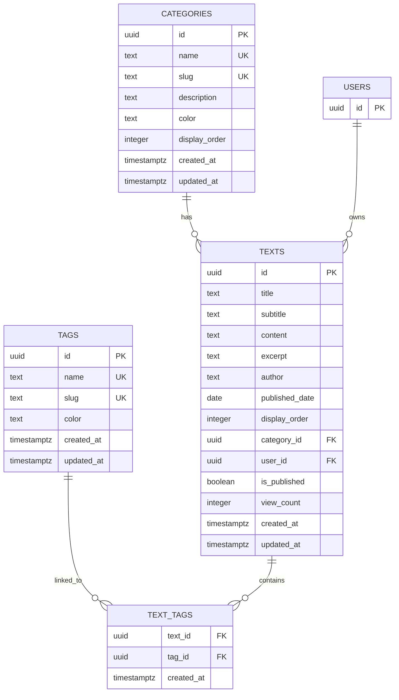
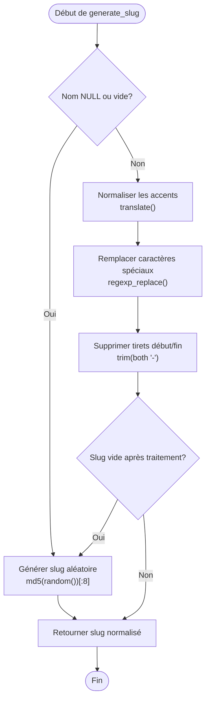
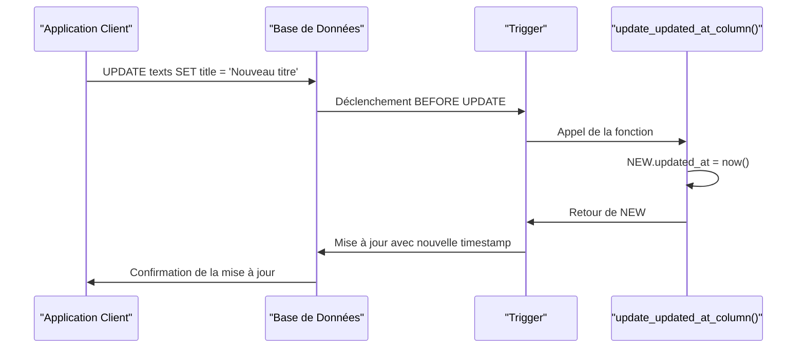
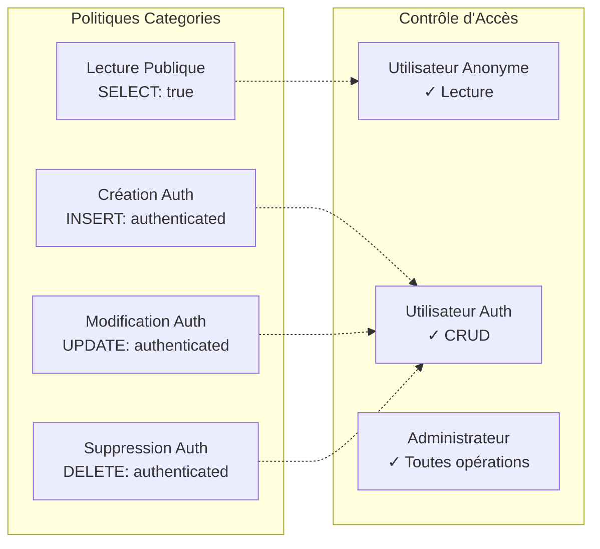
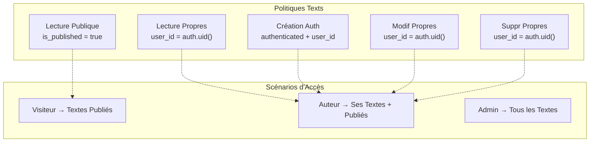
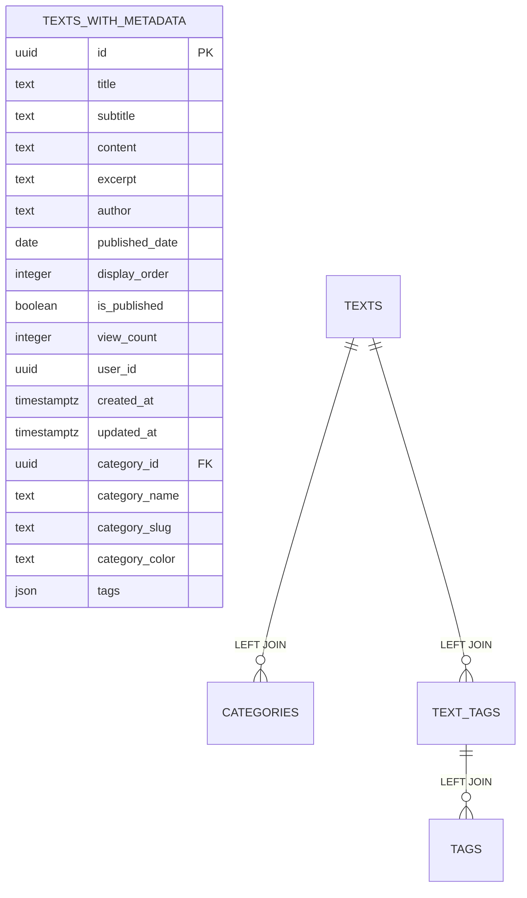
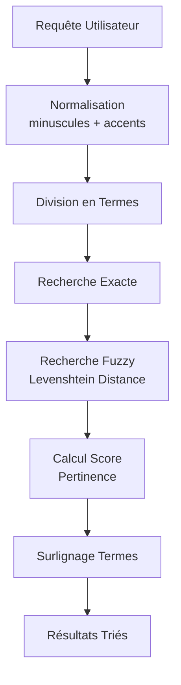
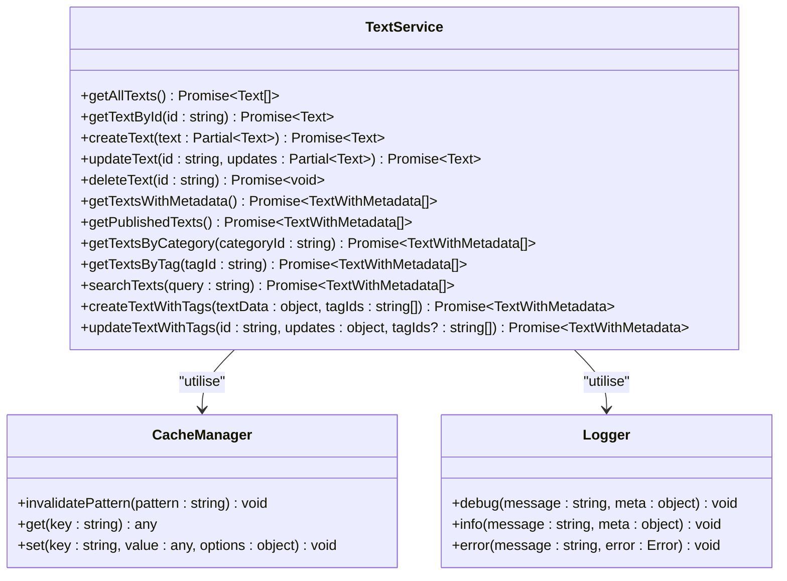
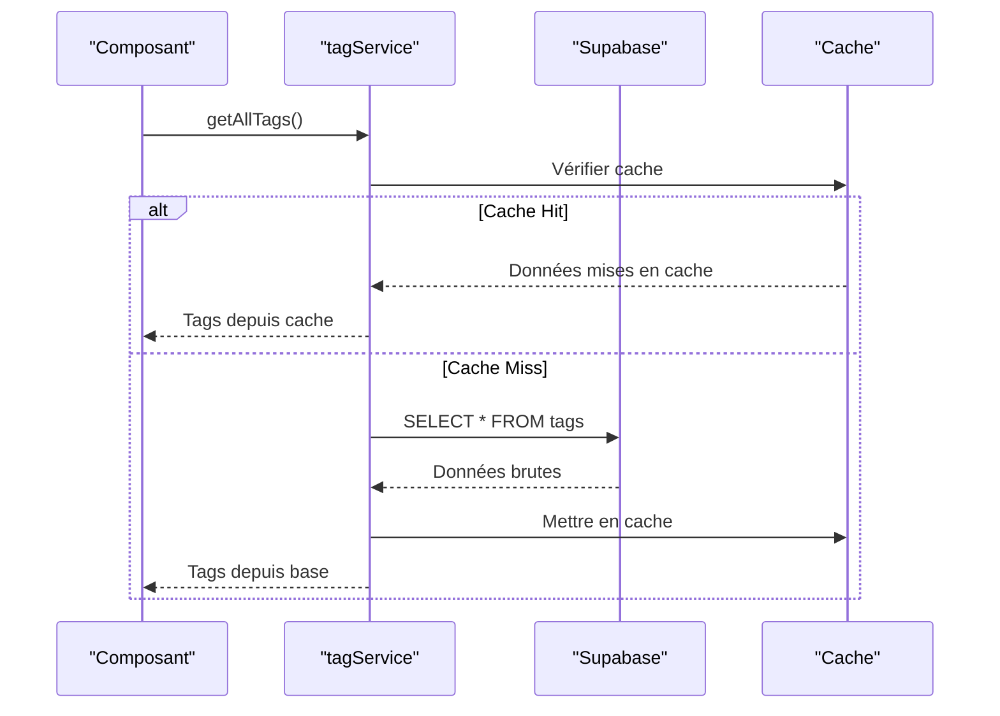
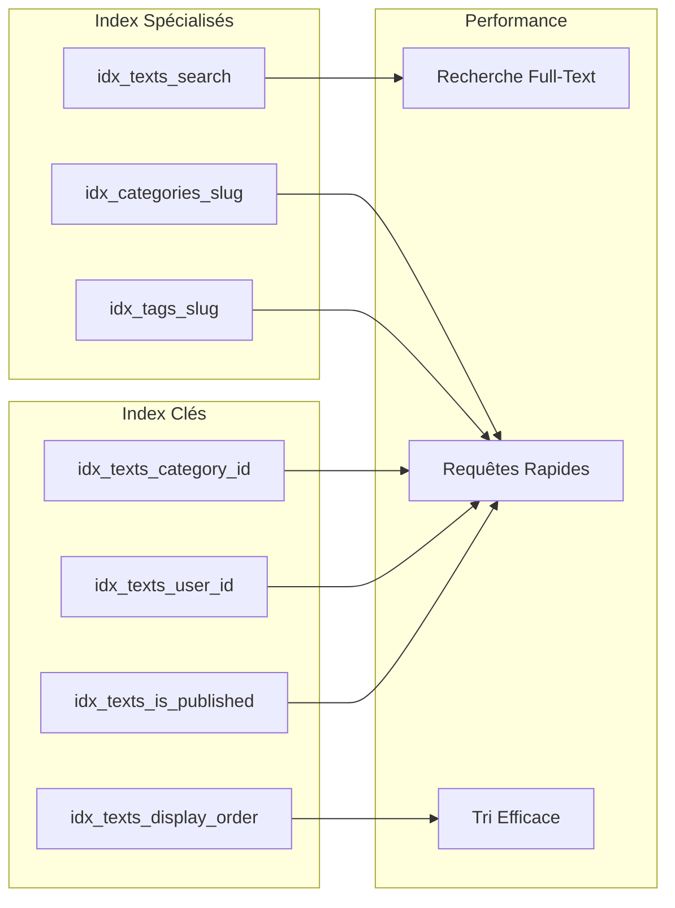

# Schéma des Textes

<cite>
**Fichiers Référencés dans ce Document**
- [20250107_create_texts_system.sql](file://supabase/migrations/20250107_create_texts_system.sql)
- [20250107_create_texts_system_v2.sql](file://supabase/migrations/20250107_create_texts_system_v2.sql)
- [textService.ts](file://services/textService.ts)
- [tagService.ts](file://services/tagService.ts)
- [supabaseClient.ts](file://lib/supabaseClient.ts)
- [TextListAdmin.tsx](file://components/texts/TextListAdmin.tsx)
- [TextDetailModal.tsx](file://components/texts/TextDetailModal.tsx)
- [search.ts](file://lib/search.ts)
- [useGlobalSearch.ts](file://hooks/useGlobalSearch.ts)
- [SearchSuggestions.tsx](file://components/texts/SearchSuggestions.tsx)
</cite>

## Table des Matières
1. [Introduction](#introduction)
2. [Structure du Schéma](#structure-du-schéma)
3. [Tables Principales](#tables-principales)
4. [Fonctions Personnalisées](#fonctions-personnalisées)
5. [Politiques de Sécurité par Niveau Ligne (RLS)](#politiques-de-sécurité-par-niveau-ligne-rls)
6. [Vue Matérialisée](#vue-matérialisée)
7. [Système de Recherche Full-Text](#système-de-recherche-full-text)
8. [Services et Composants](#services-et-composants)
9. [Exemples de Requêtes](#exemples-de-requêtes)
10. [Optimisations et Performance](#optimisations-et-performance)
11. [Conclusion](#conclusion)

## Introduction

Le système de gestion des textes constitue un composant central de l'application portfolio, offrant une architecture robuste pour la création, gestion et consultation de contenu structuré. Ce système implémente une approche sophistiquée combinant PostgreSQL avec Supabase pour fournir des fonctionnalités avancées comme la recherche full-text, la sécurité fine-grainée et des performances optimisées.

L'architecture repose sur quatre tables principales : `texts`, `categories`, `tags` et `text_tags`, formant un modèle de données relationnel qui permet une organisation flexible du contenu tout en maintenant l'intégrité référentielle.

## Structure du Schéma

Le schéma des textes suit une architecture normalisée avec des relations clairement définies :



**Sources de Diagramme**
- [20250107_create_texts_system.sql](file://supabase/migrations/20250107_create_texts_system.sql#L8-L104)
- [supabaseClient.ts](file://lib/supabaseClient.ts#L42-L106)

## Tables Principales

### Table `categories`

La table `categories` organise les textes selon des thèmes ou sujets définis :

| Colonne | Type | Contraintes | Description |
|---------|------|-------------|-------------|
| `id` | UUID | PRIMARY KEY, DEFAULT gen_random_uuid() | Identifiant unique de la catégorie |
| `name` | TEXT | NOT NULL, UNIQUE | Nom lisible de la catégorie |
| `slug` | TEXT | NOT NULL, UNIQUE | URL-friendly identifiant |
| `description` | TEXT | NULLABLE | Description optionnelle |
| `color` | TEXT | DEFAULT '#3b82f6' | Couleur hex pour l'interface |
| `display_order` | INTEGER | NOT NULL, DEFAULT 0 | Ordre d'affichage |
| `created_at` | TIMESTAMPTZ | DEFAULT now() | Timestamp de création |
| `updated_at` | TIMESTAMPTZ | DEFAULT now() | Timestamp de mise à jour |

**Indices** :
- `idx_categories_slug` : Améliore les performances des recherches par slug
- `idx_categories_display_order` : Optimise le tri par ordre d'affichage

**Sources de Section**
- [20250107_create_texts_system.sql](file://supabase/migrations/20250107_create_texts_system.sql#L8-L17)

### Table `tags`

La table `tags` permet une classification fine du contenu :

| Colonne | Type | Contraintes | Description |
|---------|------|-------------|-------------|
| `id` | UUID | PRIMARY KEY, DEFAULT gen_random_uuid() | Identifiant unique du tag |
| `name` | TEXT | NOT NULL, UNIQUE | Nom du tag |
| `slug` | TEXT | NOT NULL, UNIQUE | Identifiant URL-friendly |
| `color` | TEXT | DEFAULT '#6366f1' | Couleur pour l'affichage |
| `created_at` | TIMESTAMPTZ | DEFAULT now() | Timestamp de création |
| `updated_at` | TIMESTAMPTZ | DEFAULT now() | Timestamp de mise à jour |

**Indices** :
- `idx_tags_slug` : Accélération des recherches par slug
- `idx_tags_name` : Optimisation des requêtes par nom

**Sources de Section**
- [20250107_create_texts_system.sql](file://supabase/migrations/20250107_create_texts_system.sql#L39-L47)

### Table `texts`

La table principale contenant le contenu des articles :

| Colonne | Type | Contraintes | Description |
|---------|------|-------------|-------------|
| `id` | UUID | PRIMARY KEY, DEFAULT gen_random_uuid() | Identifiant unique du texte |
| `title` | TEXT | NOT NULL | Titre du texte |
| `subtitle` | TEXT | NULLABLE | Sous-titre optionnel |
| `content` | TEXT | NOT NULL | Contenu principal en Markdown |
| `excerpt` | TEXT | NULLABLE | Extrait pour l'affichage |
| `author` | TEXT | NULLABLE | Auteur du texte |
| `published_date` | DATE | NULLABLE | Date de publication |
| `display_order` | INTEGER | NOT NULL, DEFAULT 0 | Ordre d'affichage |
| `category_id` | UUID | FOREIGN KEY, NULLABLE | Référence à la catégorie |
| `user_id` | UUID | FOREIGN KEY, NOT NULL | Propriétaire du texte |
| `is_published` | BOOLEAN | DEFAULT false | Statut de publication |
| `view_count` | INTEGER | DEFAULT 0 | Nombre de vues |
| `created_at` | TIMESTAMPTZ | DEFAULT now() | Timestamp de création |
| `updated_at` | TIMESTAMPTZ | DEFAULT now() | Timestamp de mise à jour |

**Indices Clés** :
- `idx_texts_category_id` : Jointure efficace avec categories
- `idx_texts_user_id` : Filtrage par utilisateur
- `idx_texts_display_order` : Tri par ordre d'affichage
- `idx_texts_published_date` : Recherche par date
- `idx_texts_is_published` : Filtrage des publications
- `idx_texts_created_at` : Tri chronologique inverse

**Sources de Section**
- [20250107_create_texts_system.sql](file://supabase/migrations/20250107_create_texts_system.sql#L61-L85)

### Table `text_tags` (Relation Many-to-Many)

Cette table gère la relation entre textes et tags :

| Colonne | Type | Contraintes | Description |
|---------|------|-------------|-------------|
| `text_id` | UUID | NOT NULL, FOREIGN KEY | ID du texte |
| `tag_id` | UUID | NOT NULL, FOREIGN KEY | ID du tag |
| `created_at` | TIMESTAMPTZ | DEFAULT now() | Timestamp de création |

**Clé Primaire** : Composite (`text_id`, `tag_id`)

**Indices** :
- `idx_text_tags_text_id` : Optimisation des jointures vers texts
- `idx_text_tags_tag_id` : Accélération des requêtes par tag

**Sources de Section**
- [20250107_create_texts_system.sql](file://supabase/migrations/20250107_create_texts_system.sql#L99-L104)

## Fonctions Personnalisées

### Fonction `generate_slug`

La fonction `generate_slug` transforme les noms en identifiants URL-friendly :



**Caractéristiques** :
- **Immutabilité** : Fonction immutable pour l'optimisation
- **Gestion des accents** : Traduction des caractères accentués
- **Génération aléatoire** : Slug unique en cas d'échec
- **Validation** : Évite les slugs vides

**Sources de Section**
- [20250107_create_texts_system.sql](file://supabase/migrations/20250107_create_texts_system.sql#L228-L246)
- [20250107_create_texts_system_v2.sql](file://supabase/migrations/20250107_create_texts_system_v2.sql#L22-L54)

### Fonction `update_updated_at_column`

Cette fonction trigger maintient la date de dernière modification :



**Avantages** :
- **Automatisation** : Pas de gestion manuelle des timestamps
- **Consistance** : Garantit toujours la date actuelle
- **Performance** : Trigger avant mise à jour évite les lectures supplémentaires

**Sources de Section**
- [20250107_create_texts_system.sql](file://supabase/migrations/20250107_create_texts_system.sql#L24-L30)

## Politiques de Sécurité par Niveau Ligne (RLS)

Le système implémente une sécurité fine-grainée avec des politiques RLS complexes :

### Politiques pour `categories`



**Sources de Section**
- [20250107_create_texts_system.sql](file://supabase/migrations/20250107_create_texts_system.sql#L124-L140)

### Politiques pour `tags`

Les tags suivent le même modèle de sécurité que les catégories, permettant la lecture publique mais restreignant les modifications aux utilisateurs authentifiés.

### Politiques pour `texts`

Les politiques de `texts` constituent le cœur de la sécurité :

| Opération | Utilisateurs Anonymes | Utilisateurs Authentifiés | Administrateurs |
|-----------|----------------------|--------------------------|-----------------|
| **LECTURE** | Textes publiés (`is_published = true`) | Ses propres textes (`user_id = auth.uid()`) | Tous les textes |
| **CRÉATION** | Refusé | ✅ Avec vérification d'authentification | ✅ |
| **MODIFICATION** | Refusé | ✅ Sur ses propres textes | ✅ |
| **SUPPRESSION** | Refusé | ✅ Sur ses propres textes | ✅ |



**Sources de Section**
- [20250107_create_texts_system.sql](file://supabase/migrations/20250107_create_texts_system.sql#L168-L191)

### Politiques pour `text_tags`

La gestion des tags sur les textes implémente une sécurité contextuelle :

- **Lecture Publique** : Toutes les relations sont visibles
- **Création** : Restreinte aux propriétaires de textes
- **Suppression** : Limitée aux propriétaires de textes

**Sources de Section**
- [20250107_create_texts_system.sql](file://supabase/migrations/20250107_create_texts_system.sql#L197-L222)

## Vue Matérialisée `texts_with_metadata`

La vue `texts_with_metadata` constitue le cœur de la récupération optimisée des données :



**Caractéristiques Techniques** :

1. **Jointures Efficaces** : LEFT JOIN pour préserver tous les textes
2. **Aggrégation JSON** : `json_agg()` pour les tags
3. **Gestion des NULL** : `COALESCE()` pour les tags vides
4. **Group By** : Agrégation par texte avec métadonnées de catégorie

**Structure des Données Résultantes** :

```json
{
  "id": "uuid",
  "title": "Titre du texte",
  "subtitle": "Sous-titre",
  "content": "Contenu...",
  "excerpt": "Extrait...",
  "author": "Auteur",
  "published_date": "2025-01-07",
  "display_order": 0,
  "is_published": true,
  "view_count": 42,
  "user_id": "uuid",
  "created_at": "2025-01-07T10:00:00Z",
  "updated_at": "2025-01-07T10:30:00Z",
  "category_id": "uuid",
  "category_name": "Développement",
  "category_slug": "developpement",
  "category_color": "#3b82f6",
  "tags": [
    {
      "id": "uuid",
      "name": "React",
      "slug": "react",
      "color": "#61dafb"
    }
  ]
}
```

**Sources de Section**
- [20250107_create_texts_system.sql](file://supabase/migrations/20250107_create_texts_system.sql#L284-L319)

## Système de Recherche Full-Text

### Configuration PostgreSQL

Le système utilise l'index GIN avec le langage français pour la recherche full-text :

```sql
CREATE INDEX IF NOT EXISTS idx_texts_search ON texts USING gin(
  to_tsvector('french', coalesce(title, '') || ' ' || coalesce(content, ''))
);
```

**Caractéristiques** :
- **Langage Français** : Optimisé pour la langue française
- **Combinaison Titre/Contenu** : Recherche sur le contenu complet
- **Gestion des NULL** : `coalesce()` pour éviter les valeurs nulles
- **Index GIN** : Performances optimales pour les recherches complexes

### Algorithme de Recherche Avancée

Le système implémente une recherche hybride combinant :

1. **Recherche Exacte** : Correspondance directe des termes
2. **Recherche Fuzzy** : Similarité de Levenshtein avec seuil configurable
3. **Surlignage** : Balises `<mark>` pour les termes trouvés
4. **Tri par Pertinence** : Score basé sur la fréquence et la position



**Sources de Section**
- [20250107_create_texts_system.sql](file://supabase/migrations/20250107_create_texts_system.sql#L87-L88)
- [search.ts](file://lib/search.ts#L30-L122)

## Services et Composants

### Service `textService`

Le service `textService` fournit une API TypeScript complète pour interagir avec les textes :



**Fonctionnalités Clés** :
- **Cache Intelligent** : Invalidation automatique des données
- **Gestion d'Erreurs** : Logging détaillé et gestion robuste
- **Authentification** : Vérification des droits utilisateur
- **Transactions** : Opérations atomiques

**Sources de Section**
- [textService.ts](file://services/textService.ts#L8-L385)

### Service `tagService`

Le service `tagService` gère la manipulation des tags :



**Optimisations** :
- **Cache Session** : Durée de vie configurable (10 minutes)
- **Invalidation Automatique** : Nettoyage lors des modifications
- **Tri par Nom** : Organisation alphabétique

**Sources de Section**
- [tagService.ts](file://services/tagService.ts#L4-L197)

### Composants React

#### TextListAdmin

Interface d'administration pour la gestion des textes :

- **Drag & Drop** : Réorganisation par glisser-déposer
- **Édition Inline** : Modifications directes dans la liste
- **Suppression Sécurisée** : Confirmation avant suppression
- **Statuts Visuels** : Indicateurs de publication et d'auteur

#### TextDetailModal

Affichage détaillé avec fonctionnalités avancées :

- **Partage Social** : Intégration des réseaux sociaux
- **Navigation Rapide** : Liens directs vers le contenu
- **Formatage Markdown** : Rendu sécurisé du contenu
- **Lazy Loading** : Chargement progressif des composants

**Sources de Section**
- [TextListAdmin.tsx](file://components/texts/TextListAdmin.tsx#L39-L226)
- [TextDetailModal.tsx](file://components/texts/TextDetailModal.tsx#L31-L82)

## Exemples de Requêtes

### Récupération de Textes avec Métadonnées

```sql
-- Requête optimisée avec jointures
SELECT 
    t.id,
    t.title,
    t.subtitle,
    t.content,
    t.excerpt,
    c.name AS category_name,
    c.slug AS category_slug,
    c.color AS category_color,
    COALESCE(
        json_agg(
            json_build_object(
                'id', tg.id,
                'name', tg.name,
                'slug', tg.slug,
                'color', tg.color
            )
        ) FILTER (WHERE tg.id IS NOT NULL),
        '[]'
    ) AS tags
FROM texts t
LEFT JOIN categories c ON t.category_id = c.id
LEFT JOIN text_tags tt ON t.id = tt.text_id
LEFT JOIN tags tg ON tt.tag_id = tg.id
WHERE t.is_published = true
GROUP BY t.id, c.id, c.name, c.slug, c.color
ORDER BY t.display_order ASC;
```

### Recherche Full-Text en Français

```sql
-- Recherche avec suggestion de pertinence
SELECT 
    id, 
    title, 
    content,
    ts_rank(to_tsvector('french', title || ' ' || content), 
             to_tsquery('french', 'programmation & react')) AS rank
FROM texts
WHERE to_tsvector('french', title || ' ' || content) @@ 
      to_tsquery('french', 'programmation & react')
AND is_published = true
ORDER BY rank DESC
LIMIT 10;
```

### Requêtes TypeScript avec Services

```typescript
// Récupération des textes publiés avec métadonnées
const { texts, error } = await textService.getPublishedTexts();
if (error) {
    console.error('Erreur lors de la récupération:', error);
    return;
}

// Recherche de textes par contenu
const { texts: searchResults, error: searchError } = 
    await textService.searchTexts('programmation react');
if (searchError) {
    console.error('Erreur de recherche:', searchError);
    return;
}

// Création d'un texte avec tags associés
const { text, error: createError } = 
    await textService.createTextWithTags({
        title: 'Nouvel article',
        content: '# Contenu\nTexte...',
        is_published: false,
        display_order: 0
    }, ['uuid-tag-react', 'uuid-tag-nextjs']);
```

**Sources de Section**
- [textService.ts](file://services/textService.ts#L160-L385)

## Optimisations et Performance

### Stratégies de Cache

Le système implémente plusieurs niveaux de cache :

1. **Cache Session** : Données fréquemment accédées
2. **Cache Application** : Résultats de recherche
3. **Cache Navigateur** : Données statiques

### Indexation Optimale



### Requêtes Optimisées

**Pour la liste des textes** :
```sql
-- Utilisation des indices appropriés
EXPLAIN ANALYZE
SELECT * FROM texts_with_metadata
WHERE is_published = true
ORDER BY display_order ASC, created_at DESC
LIMIT 50;
```

**Pour la recherche** :
```sql
-- Index full-text utilisé automatiquement
EXPLAIN ANALYZE
SELECT * FROM texts
WHERE to_tsvector('french', title || ' ' || content) @@
      to_tsquery('french', 'react & nextjs')
AND is_published = true;
```

## Conclusion

Le système de gestion des textes représente une solution complète et robuste pour la gestion de contenu structuré. Ses caractéristiques principales incluent :

### Forces du Système

1. **Architecture Robuste** : Modèle de données normalisé avec relations claires
2. **Sécurité Fine-Grainée** : Politiques RLS adaptées aux différents rôles
3. **Performance Optimisée** : Indexation stratégique et cache intelligent
4. **Expérience Utilisateur** : Interface intuitive avec fonctionnalités avancées
5. **Extensibilité** : Architecture modulaire permettant l'ajout de fonctionnalités

### Fonctionnalités Avancées

- **Recherche Intelligente** : Full-text avec suggestions et surlignage
- **Organisation Flexible** : Catégories et tags multiples
- **Gestion de Versions** : Tracking des modifications
- **Cache Intelligent** : Optimisation des performances
- **Interface Moderne** : Composants React réactifs

### Perspectives d'Amélioration

Le système est conçu pour évoluer avec les besoins futurs, permettant facilement l'ajout de nouvelles fonctionnalités comme les commentaires, les notes, ou l'intégration avec des systèmes externes.

Cette architecture démontre une approche moderne de développement d'applications web, combinant efficacité technique et expérience utilisateur optimale.