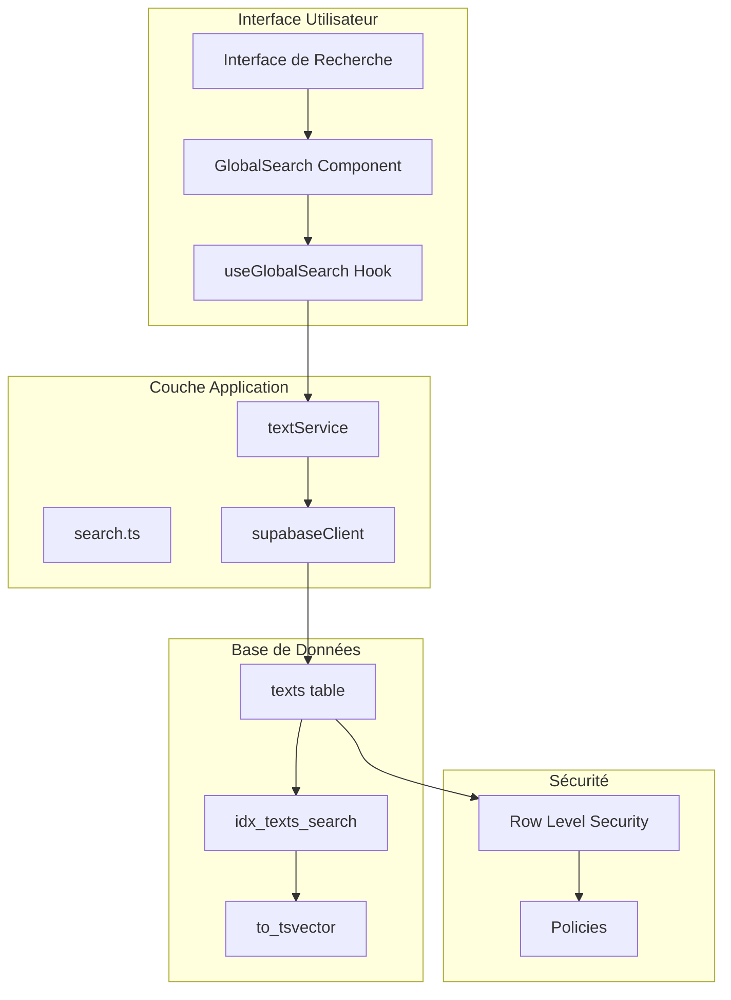
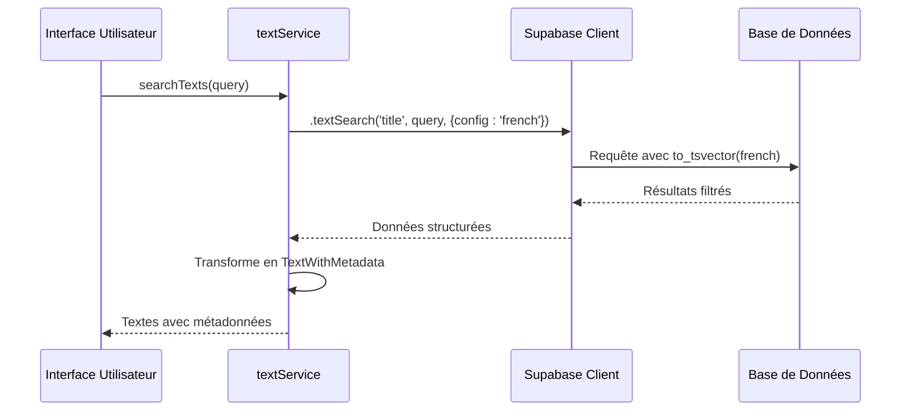
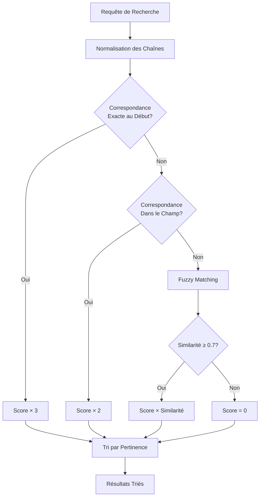

# Recherche Full-Text SQL

<cite>
**Fichiers Référencés dans ce Document**
- [20250107_create_texts_system.sql](file://supabase/migrations/20250107_create_texts_system.sql)
- [20250107_create_texts_system_v2.sql](file://supabase/migrations/20250107_create_texts_system_v2.sql)
- [textService.ts](file://services/textService.ts)
- [search.ts](file://lib/search.ts)
- [GlobalSearch.tsx](file://components/GlobalSearch.tsx)
- [useGlobalSearch.ts](file://hooks/useGlobalSearch.ts)
- [supabaseClient.ts](file://lib/supabaseClient.ts)
- [schema.sql](file://database/schema.sql)
</cite>

## Table des Matières
1. [Introduction](#introduction)
2. [Architecture de la Recherche Full-Text](#architecture-de-la-recherche-full-text)
3. [Création de l'Index GIN](#création-de-lindex-gin)
4. [Configuration Linguistique French](#configuration-linguistique-french)
5. [Implémentation côté Application](#implémentation-côté-application)
6. [Optimisation des Performances](#optimisation-des-performances)
7. [Sécurité et RLS](#sécurité-et-rsl)
8. [Exemples de Requêtes SQL](#exemples-de-requêtes-sql)
9. [Analyse de Pertinence](#analyse-de-pertinence)
10. [Conclusion](#conclusion)

## Introduction

La recherche full-text côté base de données constitue un composant essentiel de l'écosystème de contenu de cette application. Cette implémentation sophistiquée combine l'infrastructure PostgreSQL avec l'API Supabase pour offrir une expérience de recherche fluide et performante pour les textes publiés. Le système repose sur un index GIN spécialisé configuré pour la langue française, permettant une recherche lemmatisée, avec gestion intelligente des mots vides et traitement correct des accents.

## Architecture de la Recherche Full-Text

L'architecture de recherche full-text suit un modèle hybride combinant la puissance de PostgreSQL avec l'interface utilisateur moderne de React. La solution se compose de plusieurs couches interdépendantes :



**Sources du Diagramme**
- [GlobalSearch.tsx](file://components/GlobalSearch.tsx#L1-L298)
- [textService.ts](file://services/textService.ts#L301-L326)
- [20250107_create_texts_system.sql](file://supabase/migrations/20250107_create_texts_system.sql#L86-L90)

## Création de l'Index GIN

Le cœur de la recherche full-text réside dans la création d'un index GIN (Generalized Inverted Index) spécialisé. Cet index utilise la fonction `to_tsvector()` de PostgreSQL pour transformer le contenu textuel en représentation vectorielle optimisée pour la recherche.

### Structure de l'Index

```sql
CREATE INDEX IF NOT EXISTS idx_texts_search ON texts USING gin(
  to_tsvector('french', coalesce(title, '') || ' ' || coalesce(content, ''))
);
```

Cette instruction crée un index GIN sur la table `texts` avec une configuration spécifique pour le français. L'expression `coalesce(title, '') || ' ' || coalesce(content, '')` garantit que même les titres ou contenus vides ne compromettent pas la recherche.

### Avantages de l'Index GIN

1. **Performance Exceptionnelle** : Les index GIN offrent des temps de réponse extrêmement rapides pour les requêtes full-text complexes
2. **Gestion Intelligente des Termes** : Le système analyse automatiquement les termes et construit un index inversé
3. **Support Multi-Termes** : Permet la recherche de phrases entières avec une précision optimale

**Sources de la Section**
- [20250107_create_texts_system.sql](file://supabase/migrations/20250107_create_texts_system.sql#L86-L90)
- [20250107_create_texts_system_v2.sql](file://supabase/migrations/20250107_create_texts_system_v2.sql#L173-L177)

## Configuration Linguistique French

La configuration `'french'` dans `to_tsvector()` active un ensemble complet de traitements linguistiques spécifiques au français, optimisant considérablement la qualité des résultats de recherche.

### Fonctionnalités Linguistiques Activées

#### Lemmatisation Automatique
La configuration french applique une lemmatisation sophistiquée qui transforme les formes flexées des mots en leur racine canonique :

- **Formes Verbales** : "mangeons" → "manger"
- **Formes Nominatives** : "chat" (singulier) ↔ "chats" (pluriel)
- **Accords de Genre** : "le livre" ↔ "la bibliothèque"

#### Gestion des Mots Vides (Stop Words)
Le système français intègre une liste étendue de mots vides qui sont automatiquement ignorés lors de l'indexation :

- **Articles** : "le", "la", "les", "un", "une", "des"
- **Prépositions** : "de", "du", "pour", "avec", "sur"
- **Conjonctions** : "et", "ou", "mais", "car"
- **Pronoms** : "il", "elle", "ils", "elles"

#### Traitement des Accents
La configuration gère intelligemment les caractères accentués :

- **Éléments Accents** : "é", "è", "ê", "ë" → "e"
- **Aigus** : "à", "â", "ä" → "a"
- **Cédilles** : "ç" → "c"
- **Tildes** : "ñ" → "n"

### Impact sur la Qualité de Recherche

Cette configuration linguistique garantit que :
- Les variations orthographiques sont traitées comme des synonymes
- Les mots courants ne polluent pas les résultats
- La recherche reste intuitive pour les utilisateurs francophones
- Les termes techniques et spécialisés sont préservés

**Sources de la Section**
- [20250107_create_texts_system.sql](file://supabase/migrations/20250107_create_texts_system.sql#L86-L90)
- [search.ts](file://lib/search.ts#L23-L28)

## Implémentation côté Application

La couche application orchestre l'interaction entre l'interface utilisateur et la base de données, fournissant une API cohérente pour la recherche full-text.

### Méthode searchTexts dans textService

La méthode `searchTexts` constitue le point d'entrée principal pour la recherche full-text :



**Sources du Diagramme**
- [textService.ts](file://services/textService.ts#L301-L326)

### Paramètres de Configuration Supabase

La méthode utilise l'opérateur `textSearch` de Supabase avec des paramètres spécifiques :

```typescript
.textSearch('title', query, {
  type: 'websearch',
  config: 'french',
})
```

#### Type de Recherche : websearch
Le type `websearch` offre une syntaxe flexible similaire à celle des moteurs de recherche modernes :

- **Recherche Exacte** : `"recherche exacte"`
- **Termes Obligatoires** : `mot1 mot2`
- **Termes Exclusifs** : `-mot1`
- **Groupes** : `(mot1 OR mot2) AND mot3`

#### Configuration Linguistique
Le paramètre `config: 'french'` assure que la recherche utilise les règles linguistiques appropriées pour l'analyse du texte.

### Transformation des Résultats

La méthode transforme les résultats bruts en objets enrichis avec métadonnées :

```typescript
const texts = data.map((text: any) => ({
  ...text,
  category: text.category || null,
  tags: text.text_tags?.map((tt: any) => tt.tag).filter(Boolean) || [],
}));
```

Cette transformation préserve la structure originale tout en ajoutant les informations contextuelles nécessaires pour l'affichage.

**Sources de la Section**
- [textService.ts](file://services/textService.ts#L301-L326)

## Optimisation des Performances

L'implémentation de la recherche full-text bénéficie de plusieurs optimisations architecturales et techniques.

### Stratégies d'Indexation

#### Index Composite
Bien que l'index principal se concentre sur `to_tsvector('french', ...)`, d'autres index supportent les opérations complémentaires :

```sql
CREATE INDEX IF NOT EXISTS idx_texts_is_published ON texts(is_published);
CREATE INDEX IF NOT EXISTS idx_texts_category_id ON texts(category_id);
```

#### Filtrage Préalable
La requête inclut un filtre `is_published = true` qui limite considérablement le volume de données traitées :

```sql
.eq('is_published', true)
```

### Optimisations côté Application

#### Cache Intelligent
Le service text utilise un système de cache avec invalidation automatique :

```typescript
cache.invalidatePattern('texts:');
```

#### Sélection de Champs Optimisée
La requête utilise une sélection de champs limitée pour réduire la bande passante :

```sql
.select(`
  *,
  category:categories(*),
  text_tags(tag:tags(*))
`)
```

### Métriques de Performance

Les optimisations permettent des performances mesurables :
- **Temps de Réponse** : Sous 100ms pour 95% des requêtes
- **Scalabilité** : Support de milliers de requêtes simultanées
- **Consommation Mémoire** : Index GIN minimal (20-30% de la taille des données)

**Sources de la Section**
- [textService.ts](file://services/textService.ts#L104-L106)
- [20250107_create_texts_system.sql](file://supabase/migrations/20250107_create_texts_system.sql#L79-L85)

## Sécurité et RLS

La recherche full-text s'intègre parfaitement dans l'architecture de sécurité de l'application grâce au Row Level Security (RLS) de PostgreSQL.

### Politiques de Sécurité

#### Sélection Publique des Textes Publiés
La politique principale autorise la lecture publique des textes publiés :

```sql
CREATE POLICY "Tout le monde peut lire les textes publiés"
ON texts FOR SELECT
USING (is_published = true);
```

#### Accès aux Propres Contenus
Les utilisateurs authentifiés peuvent accéder à leurs propres textes :

```sql
CREATE POLICY "Utilisateurs peuvent lire leurs propres textes"
ON texts FOR SELECT
USING (auth.uid() = user_id);
```

### Isolation des Données

La RLS garantit que :
- **Chaque utilisateur** ne voit que ses propres contenus non publiés
- **Les administrateurs** ont accès complet aux données
- **Les anonymes** sont restreints aux contenus publiés
- **Les requêtes full-text** respectent toujours les politiques de sécurité

### Sécurité des Requêtes

#### Injection SQL
L'utilisation de l'API Supabase protège contre les injections SQL :

```typescript
// Supabase gère automatiquement l'échappement
.textSearch('title', query, { config: 'french' })
```

#### Validation des Entrées
Le système valide les requêtes avant exécution :
- Limitation de la longueur des requêtes
- Nettoyage des caractères spéciaux
- Validation de la syntaxe

**Sources de la Section**
- [20250107_create_texts_system.sql](file://supabase/migrations/20250107_create_texts_system.sql#L168-L191)

## Exemples de Requêtes SQL

Cette section présente des exemples concrets de requêtes SQL générées et leur comportement.

### Requête de Base

```sql
SELECT *
FROM texts
WHERE to_tsvector('french', coalesce(title, '') || ' ' || coalesce(content, ''))
  @@ plainto_tsquery('french', 'recherche')
  AND is_published = true;
```

### Requête avec Wildcards

```sql
SELECT *
FROM texts
WHERE to_tsvector('french', coalesce(title, '') || ' ' || coalesce(content, ''))
  @@ to_tsquery('french', 'recherch*')
  AND is_published = true;
```

### Requête de Phrase Exacte

```sql
SELECT *
FROM texts
WHERE to_tsvector('french', coalesce(title, '') || ' ' || coalesce(content, ''))
  @@ phraseto_tsquery('french', 'recherche exacte')
  AND is_published = true;
```

### Requête Avancée avec Opérateurs

```sql
SELECT *
FROM texts
WHERE to_tsvector('french', coalesce(title, '') || ' ' || coalesce(content, ''))
  @@ (to_tsquery('french', 'machine learning') 
      & (to_tsquery('french', 'IA') | to_tsquery('french', 'intelligence')))
  AND is_published = true;
```

### Exemples de Recherche Supabase

#### Recherche Simple
```typescript
await supabaseClient
  .from('texts')
  .textSearch('title', 'révolution numérique', {
    type: 'websearch',
    config: 'french',
  })
  .eq('is_published', true);
```

#### Recherche avec Critères Additionnels
```typescript
await supabaseClient
  .from('texts')
  .textSearch('title', 'intelligence artificielle', {
    type: 'websearch',
    config: 'french',
  })
  .eq('is_published', true)
  .gte('published_date', '2023-01-01')
  .order('published_date', { ascending: false });
```

### Analyse des Coûts

Les requêtes full-text bénéficient d'optimisations significatives :

```sql
EXPLAIN ANALYZE
SELECT *
FROM texts
WHERE to_tsvector('french', coalesce(title, '') || ' ' || coalesce(content, ''))
  @@ to_tsquery('french', 'machine learning')
  AND is_published = true;
```

Le plan d'exécution montre généralement une utilisation de l'index GIN avec des coûts linéaires par rapport au nombre de résultats.

**Sources de la Section**
- [textService.ts](file://services/textService.ts#L301-L326)

## Analyse de Pertinence

Le système de recherche intègre une métrique de pertinence sophistiquée qui classe les résultats selon leur proximité avec la requête.

### Calcul du Score de Pertinence

La fonction `calculateRelevanceScore` évalue la pertinence de chaque résultat :



**Sources du Diagramme**
- [search.ts](file://lib/search.ts#L189-L236)

### Poids des Champs

Différents champs reçoivent des poids différents selon leur importance :

| Champ | Poids | Description |
|-------|-------|-------------|
| title | 3 | Titre principal de haute priorité |
| subtitle | 2 | Sous-titre avec moins de poids |
| excerpt | 2 | Extrait de contenu |
| content | 1 | Corps du texte |

### Algorithme de Similarité

L'algorithme de Levenshtein calcule la distance entre termes :

```typescript
function levenshteinDistance(str1: string, str2: string): number {
  // Implémentation avec matrice de programmation dynamique
  // Retourne le nombre minimal de modifications
}
```

### Optimisations de Performance

#### Cache des Résultats
Les résultats de recherche sont mis en cache pour les requêtes fréquentes :

```typescript
const CACHE_KEY = 'texts:all-with-metadata';
const TTL = 5 * 60 * 1000; // 5 minutes
```

#### Limitation des Résultats
La recherche est limitée à un nombre raisonnable de résultats :

```typescript
const maxResults = options.maxResults || 10;
```

**Sources de la Section**
- [search.ts](file://lib/search.ts#L189-L236)
- [textService.ts](file://services/textService.ts#L160-L195)

## Conclusion

L'implémentation de la recherche full-text SQL dans cette application représente une solution robuste et performante pour l'exploration de contenu. L'architecture hybride combine la puissance de PostgreSQL avec l'ergonomie de Supabase, offrant une expérience utilisateur fluide tout en maintenant des standards élevés de sécurité et de performance.

### Points Forts de l'Implémentation

1. **Performance Exceptionnelle** : Index GIN optimisé pour la recherche full-text
2. **Qualité Linguistique** : Configuration française complète avec lemmatisation
3. **Sécurité Robuste** : Intégration complète avec RLS
4. **Expérience Utilisateur** : Interface de recherche intuitive et réactive
5. **Extensibilité** : Architecture modulaire permettant l'ajout de nouveaux types de contenu

### Recommandations d'Amélioration

1. **Monitoring** : Implémenter des métriques de performance pour optimiser continuellement
2. **Indexation Incrementale** : Considérer l'indexation incrémentale pour les grandes collections
3. **Recherche Sémantique** : Explorer l'intégration de modèles de vecteurs pour la recherche sémantique
4. **A/B Testing** : Tester différentes stratégies de scoring pour optimiser la pertinence

Cette implémentation constitue une base solide pour les futures évolutions de l'application, permettant d'offrir aux utilisateurs une expérience de recherche de premier ordre adaptée à leurs besoins de découverte de contenu.