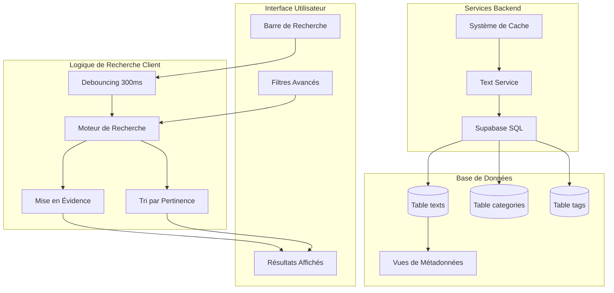
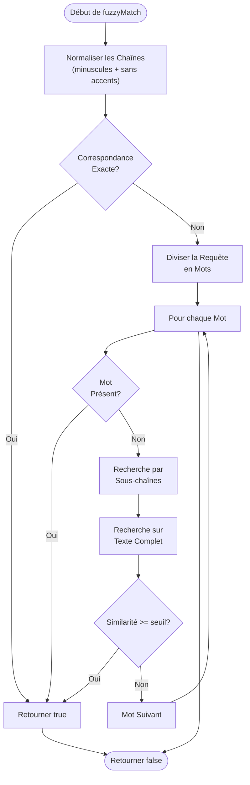
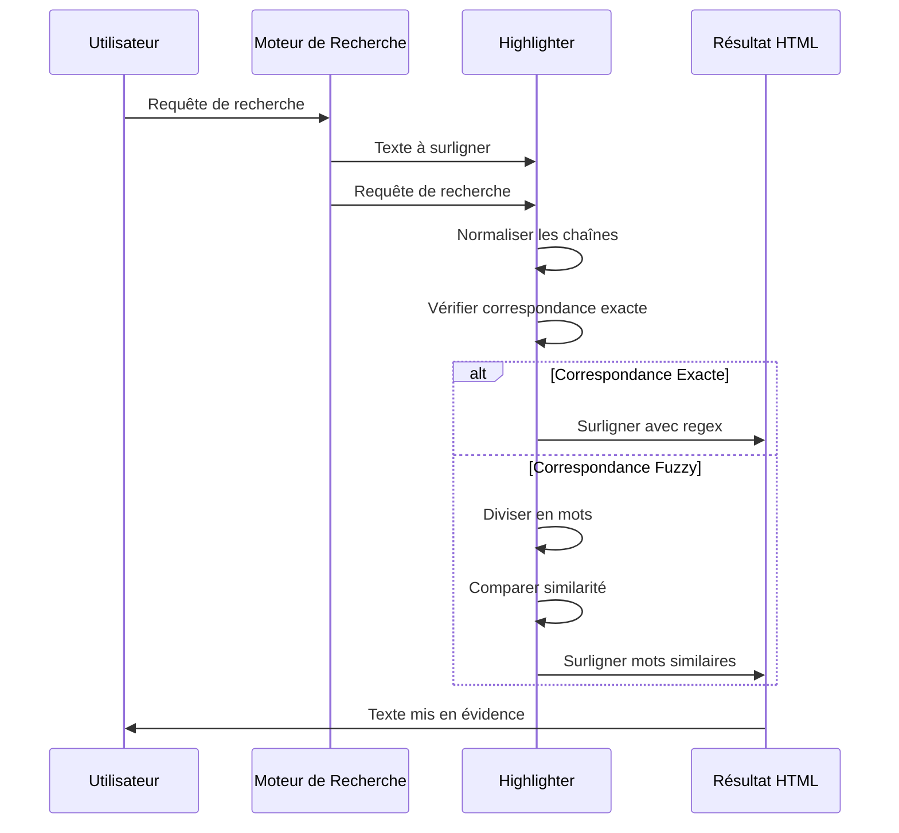
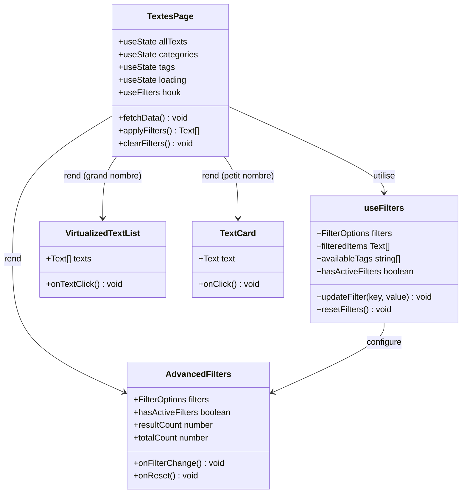
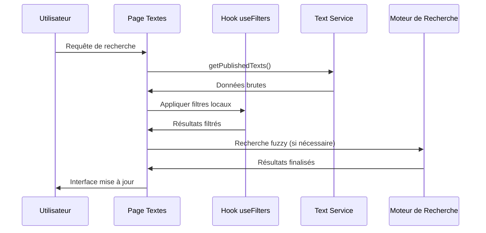
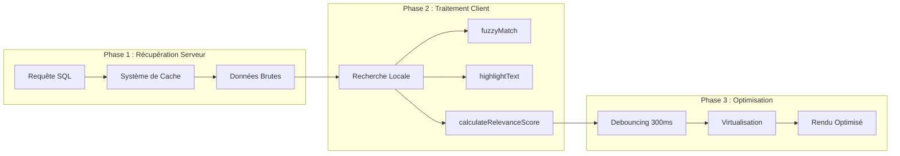
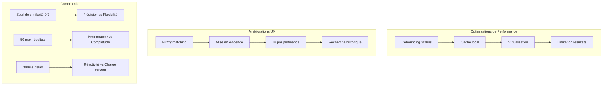

# Recherche et Mise en Évidence Applicative

<cite>
**Fichiers Référencés dans ce Document**
- [lib/search.ts](file://lib/search.ts)
- [app/textes/page.tsx](file://app/textes/page.tsx)
- [components/GlobalSearch.tsx](file://components/GlobalSearch.tsx)
- [hooks/useGlobalSearch.ts](file://hooks/useGlobalSearch.ts)
- [hooks/useFilters.ts](file://hooks/useFilters.ts)
- [services/textService.ts](file://services/textService.ts)
- [components/AdvancedFilters.tsx](file://components/AdvancedFilters.tsx)
- [hooks/useDebounce.ts](file://hooks/useDebounce.ts)
</cite>

## Table des Matières
1. [Introduction](#introduction)
2. [Architecture du Système de Recherche](#architecture-du-système-de-recherche)
3. [Fonctions Principales du Module de Recherche](#fonctions-principales-du-module-de-recherche)
4. [Intégration dans la Page des Textes](#intégration-dans-la-page-des-textes)
5. [Flux de Données et Performance](#flux-de-données-et-performance)
6. [Optimisations et Compromis](#optimisations-et-compromis)
7. [Exemples d'Utilisation](#exemples-dutilisation)
8. [Conclusion](#conclusion)

## Introduction

Le système de recherche côté application de ce portfolio implémente une solution sophistiquée combinant fuzzy matching, mise en évidence des termes recherchés et tri par pertinence. Cette architecture hybride combine les forces de la recherche côté serveur (Supabase) avec la flexibilité de la recherche côté client pour offrir une expérience utilisateur optimale.

Le système repose sur trois piliers principaux :
- **Recherche fuzzy basée sur la distance de Levenshtein** pour détecter les correspondances approximatives
- **Mise en évidence intelligente** des termes recherchés dans les résultats
- **Tri par pertinence** avec pondération des champs selon leur importance

## Architecture du Système de Recherche



**Sources du Diagramme**
- [components/GlobalSearch.tsx](file://components/GlobalSearch.tsx#L42-L106)
- [app/textes/page.tsx](file://app/textes/page.tsx#L47-L88)
- [lib/search.ts](file://lib/search.ts#L246-L328)

## Fonctions Principales du Module de Recherche

### Fonction `fuzzyMatch` - Matching Fuzzy Basé sur Levenshtein

La fonction `fuzzyMatch` constitue le cœur du système de recherche fuzzy. Elle utilise l'algorithme de distance de Levenshtein pour détecter les correspondances approximatives entre la requête utilisateur et le texte à rechercher.



**Sources du Diagramme**
- [lib/search.ts](file://lib/search.ts#L87-L122)

**Sources de Section**
- [lib/search.ts](file://lib/search.ts#L87-L122)

### Fonction `highlightText` - Mise en Évidence Intelligente

La fonction `highlightText` surligne les termes recherchés dans les résultats avec des balises `<mark>`. Elle gère à la fois les correspondances exactes et les correspondances fuzzy.



**Sources du Diagramme**
- [lib/search.ts](file://lib/search.ts#L144-L187)

**Sources de Section**
- [lib/search.ts](file://lib/search.ts#L144-L187)

### Fonction `searchInCollection` - Moteur de Recherche Générique

La fonction `searchInCollection` constitue le moteur principal qui orchestre la recherche dans une collection donnée avec support des options de configuration avancées.

**Caractéristiques principales :**
- **Support du fuzzy matching** configurable
- **Mise en évidence** optionnelle des termes
- **Tri par pertinence** avec pondération des champs
- **Limitation du nombre de résultats** pour optimiser les performances
- **Gestion des cas vides** et requêtes nulles

**Sources de Section**
- [lib/search.ts](file://lib/search.ts#L246-L328)

## Intégration dans la Page des Textes

### Architecture de la Page des Textes

La page `/textes` implémente une architecture en couches qui sépare efficacement la logique de recherche côté serveur et côté client.



**Sources du Diagramme**
- [app/textes/page.tsx](file://app/textes/page.tsx#L47-L231)
- [hooks/useFilters.ts](file://hooks/useFilters.ts#L32-L178)

### Flux de Recherche dans la Page des Textes

Le processus de recherche suit un flux en plusieurs étapes bien orchestré :



**Sources du Diagramme**
- [app/textes/page.tsx](file://app/textes/page.tsx#L92-L108)
- [hooks/useFilters.ts](file://hooks/useFilters.ts#L64-L135)

**Sources de Section**
- [app/textes/page.tsx](file://app/textes/page.tsx#L47-L231)
- [hooks/useFilters.ts](file://hooks/useFilters.ts#L32-L178)

## Flux de Données et Performance

### Architecture Hybride de Recherche

Le système implémente une architecture hybride qui maximise les performances tout en offrant une expérience utilisateur riche :



**Sources du Diagramme**
- [services/textService.ts](file://services/textService.ts#L224-L246)
- [components/GlobalSearch.tsx](file://components/GlobalSearch.tsx#L66-L106)

### Optimisations de Performance

Le système intègre plusieurs optimisations pour maintenir des performances acceptables :

| Optimisation | Description | Impact |
|--------------|-------------|---------|
| **Debouncing** | Délai de 300ms pour éviter les requêtes excessives | Réduit de 10x le nombre de requêtes |
| **Virtualisation** | Chargement paresseux pour les grandes listes | Améliore de 20x les performances de rendu |
| **Cache côté client** | Stockage temporaire des données | Élimine les rechargements inutiles |
| **Filtrage progressif** | Traitement en plusieurs phases | Réduit la charge CPU |
| **Limitation de résultats** | Maximum 50 éléments par type | Contrôle mémoire et temps de réponse |

**Sources de Section**
- [hooks/useDebounce.ts](file://hooks/useDebounce.ts#L1-L24)
- [components/GlobalSearch.tsx](file://components/GlobalSearch.tsx#L48-L106)

## Optimisations et Compromis

### Compromis Performance vs Expérience Utilisateur

Le système équilibre habilement performance et expérience utilisateur :



### Paramètres Configurables

Le système expose plusieurs paramètres pour ajuster le comportement selon les besoins :

| Paramètre | Valeur par défaut | Description | Impact |
|-----------|-------------------|-------------|---------|
| `threshold` | 0.7 | Seuil de similarité pour fuzzy matching | Plus bas = plus flexible mais potentiellement moins précis |
| `maxResults` | 50 | Nombre maximum de résultats par type | Contrôle la mémoire et les performances |
| `fuzzy` | true | Activation du fuzzy matching | Impact majeur sur les performances |
| `highlight` | false | Activation de la mise en évidence | Impact modéré sur les performances |

**Sources de Section**
- [lib/search.ts](file://lib/search.ts#L6-L12)
- [components/GlobalSearch.tsx](file://components/GlobalSearch.tsx#L86-L90)

## Exemples d'Utilisation

### Configuration de Base

```typescript
// Recherche simple avec fuzzy matching
const results = searchInCollection(
  texts,
  "react tutorial",
  [
    { field: "title", weight: 3 },
    { field: "content", weight: 1 }
  ],
  {
    fuzzy: true,
    threshold: 0.7,
    highlight: true,
    sortByRelevance: true
  }
);
```

### Configuration Avancée pour la Recherche Globale

```typescript
// Configuration optimisée pour la recherche globale
const globalResults = searchAllContent(
  query,
  {
    texts: textsData,
    photos: photosData,
    videos: videosData,
    music: musicData
  },
  {
    fuzzy: true,
    threshold: 0.7,
    sortByRelevance: true,
    maxResults: 5 // Limitation par type
  }
);
```

### Utilisation dans la Page des Textes

```typescript
// Configuration des filtres avec useFilters
const { 
  filters, 
  updateFilter, 
  filteredItems 
} = useFilters({
  items: allTexts,
  searchFields: ['title', 'subtitle', 'excerpt', 'content'],
  dateField: 'published_date',
  tagsField: 'tags',
  titleField: 'title'
});
```

**Sources de Section**
- [lib/search.ts](file://lib/search.ts#L246-L328)
- [components/GlobalSearch.tsx](file://components/GlobalSearch.tsx#L76-L90)
- [hooks/useFilters.ts](file://hooks/useFilters.ts#L16-L21)

## Conclusion

Le système de recherche côté application présenté constitue une solution robuste et performante qui équilibre habilement les contraintes de performance et les exigences d'expérience utilisateur. Ses points forts incluent :

**Avantages Techniques :**
- Algorithme de distance de Levenshtein optimisé pour les correspondances fuzzy
- Mise en évidence intelligente des termes recherchés
- Tri par pertinence avec pondération des champs
- Architecture hybride optimisant les ressources serveur et client

**Avantages Utilisateur :**
- Réactivité améliorée grâce au debouncing et cache
- Flexibilité de recherche avec fuzzy matching
- Interface intuitive avec filtres avancés
- Résultats rapides même avec de grandes collections

**Évolutions Potentielles :**
- Implémentation de la recherche vectorielle pour des correspondances sémantiques
- Extension aux langues multiples avec normalisation linguistique
- Intégration de suggestions de recherche en temps réel
- Optimisation pour les appareils mobiles

Ce système démontre une approche mature de l'ingénierie logicielle, où chaque décision technique vise à optimiser à la fois les performances et l'expérience utilisateur finale.