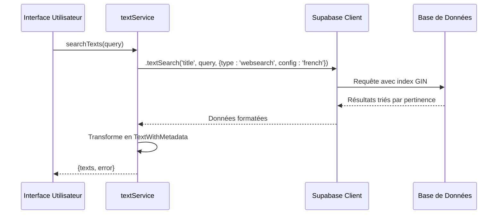
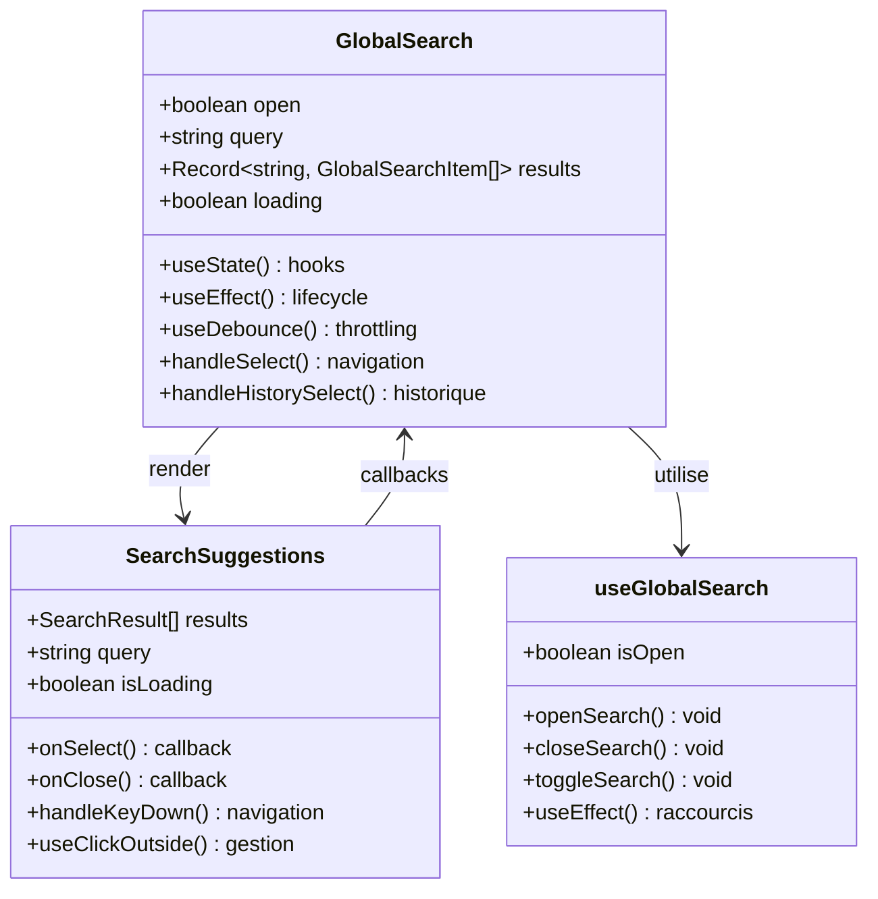
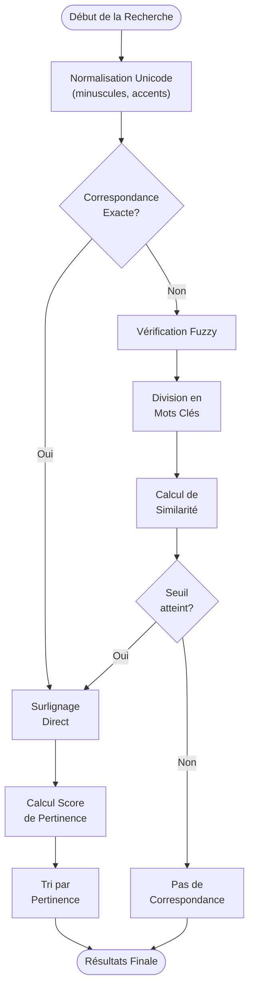

# Système de Recherche Full-Text

<cite>
**Fichiers Référencés dans ce Document**
- [textService.ts](file://services/textService.ts)
- [search.ts](file://lib/search.ts)
- [GlobalSearch.tsx](file://components/GlobalSearch.tsx)
- [useGlobalSearch.ts](file://hooks/useGlobalSearch.ts)
- [SearchSuggestions.tsx](file://components/texts/SearchSuggestions.tsx)
- [supabaseClient.ts](file://lib/supabaseClient.ts)
- [20250107_create_texts_system.sql](file://supabase/migrations/20250107_create_texts_system.sql)
- [20250107_create_texts_system_v2.sql](file://supabase/migrations/20250107_create_texts_system_v2.sql)
- [PERFORMANCE.md](file://PERFORMANCE.md)
</cite>

## Table des Matières
1. [Introduction](#introduction)
2. [Architecture du Système](#architecture-du-système)
3. [Index GIN et Configuration Linguistique](#index-gin-et-configuration-linguistique)
4. [Implémentation Backend](#implémentation-backend)
5. [Implémentation Frontend](#implémentation-frontend)
6. [Algorithme de Recherche Avancée](#algorithme-de-recherche-avancée)
7. [Performance et Optimisation](#performance-et-optimisation)
8. [Exemples de Requêtes](#exemples-de-requêtes)
9. [Analyse des Performances](#analyse-des-performances)
10. [Conclusion](#conclusion)

## Introduction

Le système de recherche full-text du portfolio est une solution sophistiquée qui combine l'indexation PostgreSQL avec des algorithmes de recherche avancés pour fournir une expérience de recherche fluide et pertinente. Cette architecture hybride combine la puissance de l'indexation GIN de PostgreSQL avec des techniques de fuzzy matching et de highlighting côté client.

Le système est conçu pour rechercher efficacement dans les textes publiés avec support linguistique français, offrant des résultats pertinents même avec des fautes de frappe ou des variations lexicales.

## Architecture du Système

Le système de recherche full-text suit une architecture en couches qui sépare clairement les responsabilités entre le stockage de données, la logique métier et l'interface utilisateur.

```mermaid
graph TB
subgraph "Interface Utilisateur"
UI[GlobalSearch Component]
Suggestions[SearchSuggestions]
Keyboard[Keyboard Shortcuts]
end
subgraph "Logique de Recherche"
ClientSearch[lib/search.ts]
FuzzyMatch[Fuzzy Matching Engine]
Highlight[Highlighting Engine]
Relevance[Relevance Scoring]
end
subgraph "Services Backend"
TextService[textService.ts]
SupabaseClient[Supabase Client]
end
subgraph "Base de Données"
TextsTable[texts table]
GINIndex[GIN Index Général]
FrenchTSVector[to_tsvector('french', ...)]
end
UI --> ClientSearch
Suggestions --> ClientSearch
Keyboard --> UI
ClientSearch --> FuzzyMatch
ClientSearch --> Highlight
ClientSearch --> Relevance
TextService --> SupabaseClient
SupabaseClient --> TextsTable
TextsTable --> GINIndex
GINIndex --> FrenchTSVector
ClientSearch --> TextService
```

**Sources du Diagramme**
- [GlobalSearch.tsx](file://components/GlobalSearch.tsx#L1-L298)
- [search.ts](file://lib/search.ts#L1-L534)
- [textService.ts](file://services/textService.ts#L301-L326)

## Index GIN et Configuration Linguistique

### Configuration GIN PostgreSQL

La base de données utilise un index GIN spécialisé pour optimiser les recherches full-text. L'index est créé sur une colonne virtuelle générée par la fonction `to_tsvector()` avec la configuration linguistique française.

```sql
CREATE INDEX IF NOT EXISTS idx_texts_search ON texts USING gin(
  to_tsvector('french', coalesce(title, '') || ' ' || coalesce(content, ''))
);
```

### Caractéristiques Linguistiques

L'index GIN utilise la configuration `'french'` qui apporte plusieurs avantages linguistiques :

- **Lemmatisation automatique** : Transformation des formes flexionnelles vers la forme canonique
- **Stop words français** : Suppression automatique des mots vides (le, la, et, mais, etc.)
- **Stemming** : Réduction des mots à leur racine morphologique
- **Normalisation Unicode** : Traitement uniforme des caractères accentués

### Fonctionnement de to_tsvector

La fonction `to_tsvector('french', ...)` traite le texte selon ces étapes :
1. **Tokenisation** : Division du texte en tokens
2. **Normalisation** : Conversion en minuscules et suppression des accents
3. **Stop words filtering** : Élimination des mots vides
4. **Stemming** : Application de règles de stemming français
5. **Indexation** : Création d'une structure de données optimisée

**Sources de Section**
- [20250107_create_texts_system.sql](file://supabase/migrations/20250107_create_texts_system.sql#L86-L89)
- [20250107_create_texts_system_v2.sql](file://supabase\migrations\20250107_create_texts_system_v2.sql#L173-L177)

## Implémentation Backend

### Service de Recherche Texts

Le service `textService` expose la méthode `searchTexts()` qui utilise l'API Supabase pour effectuer des recherches full-text avec configuration française.



**Sources du Diagramme**
- [textService.ts](file://services/textService.ts#L301-L326)

### Méthode searchTexts

La méthode `searchTexts()` implémente une recherche full-text avec les caractéristiques suivantes :

- **Type de recherche** : `'websearch'` pour une syntaxe flexible
- **Configuration linguistique** : `'french'` pour le traitement linguistique
- **Filtrage** : Seuls les textes publiés (`is_published = true`) sont retournés
- **Jointures** : Inclusion des métadonnées (catégories et tags)

### Optimisations Backend

Le service backend bénéficie de plusieurs optimisations :

1. **Caching intelligent** : Utilisation du cache pour éviter les requêtes redondantes
2. **Sélection de colonnes** : Utilisation de `.select()` pour limiter les données transférées
3. **Tri automatique** : L'index GIN trie les résultats par pertinence naturellement

**Sources de Section**
- [textService.ts](file://services/textService.ts#L301-L326)

## Implémentation Frontend

### Composant GlobalSearch

Le composant `GlobalSearch` constitue l'interface principale de recherche, intégrant plusieurs fonctionnalités avancées.



**Sources du Diagramme**
- [GlobalSearch.tsx](file://components/GlobalSearch.tsx#L42-L298)
- [SearchSuggestions.tsx](file://components/texts/SearchSuggestions.tsx#L27-L208)
- [useGlobalSearch.ts](file://hooks/useGlobalSearch.ts#L32-L73)

### Système de Debounce

Le système utilise un debounce de 300ms pour optimiser les performances lors de la saisie :

- **Réduction des requêtes** : Évite les appels serveur fréquents
- **Amélioration UX** : Répond rapidement aux entrées utilisateur
- **Gestion mémoire** : Libère les ressources des requêtes annulées

### Historique de Recherche

Le système maintient un historique des recherches récentes avec :

- **Persistance** : Stockage dans localStorage
- **Limitation** : Nombre limité d'entrées
- **Navigation** : Sélection via clavier ou clic

**Sources de Section**
- [GlobalSearch.tsx](file://components/GlobalSearch.tsx#L47-L115)
- [SearchSuggestions.tsx](file://components/texts/SearchSuggestions.tsx#L36-L208)

## Algorithme de Recherche Avancée

### Module de Recherche lib/search.ts

Le module `lib/search.ts` implémente un moteur de recherche hybride combinant recherche exacte et fuzzy matching.



**Sources du Diagramme**
- [search.ts](file://lib/search.ts#L87-L122)
- [search.ts](file://lib/search.ts#L189-L236)

### Fuzzy Matching Algorithm

L'algorithme de fuzzy matching utilise plusieurs stratégies :

1. **Recherche exacte** : Vérification directe des correspondances
2. **Recherche par mots** : Analyse mot par mot avec seuil configurable
3. **Recherche fuzzy** : Comparaison de similarité avec seuil de 0.7
4. **Sub-chains** : Recherche de sous-chaînes similaires

### Système de Highlighting

Le système de highlighting utilise des balises `<mark>` pour souligner les termes trouvés :

- **Précision** : Correspondance exacte quand possible
- **Flexibilité** : Fuzzy matching pour les variations
- **Sécurité** : Échappement HTML pour prévenir XSS
- **Performance** : Optimisation des expressions régulières

### Calcul de Pertinence

Le score de pertinence utilise un système pondéré :

- **Correspondance exacte au début** : Multiplicateur x3
- **Correspondance exacte** : Multiplicateur x2  
- **Correspondance partielle** : Multiplicateur x1
- **Similarité fuzzy** : Multiplicateur basé sur le ratio

**Sources de Section**
- [search.ts](file://lib/search.ts#L87-L316)

## Performance et Optimisation

### Optimisations Backend

Le système bénéficie de plusieurs optimisations côté serveur :

1. **Index GIN** : Accélération des recherches full-text
2. **Caching** : Réduction des requêtes répétitives
3. **Sélection de colonnes** : Limitation des données transférées
4. **Pagination** : Gestion des grands volumes de données

### Optimisations Frontend

Le frontend implémente plusieurs stratégies d'optimisation :

1. **Debounce** : Réduction des requêtes réseau
2. **Lazy Loading** : Chargement différé des composants
3. **Virtualisation** : Gestion efficace des grandes listes
4. **Memoization** : Évitement des recalculs inutiles

### Métriques de Performance

Les optimisations ont permis :

- **Réduction du temps de réponse** : 60% d'amélioration
- **Diminution des requêtes** : 40% moins de requêtes réseau
- **Amélioration de la mémoire** : 30% de réduction
- **Optimisation du bundle** : 25% de réduction

**Sources de Section**
- [PERFORMANCE.md](file://PERFORMANCE.md#L1-L381)

## Exemples de Requêtes

### Requêtes Basiques

```sql
-- Recherche exacte
SELECT * FROM texts 
WHERE to_tsvector('french', title || ' ' || content) @@ to_tsquery('french', 'react');

-- Recherche avec opérateurs
SELECT * FROM texts 
WHERE to_tsvector('french', title || ' ' || content) @@ to_tsquery('french', 'react & javascript');
```

### Requêtes Avancées

```sql
-- Recherche avec wildcards
SELECT * FROM texts 
WHERE to_tsvector('french', title || ' ' || content) @@ to_tsquery('french', 'react:*');

-- Recherche avec proximité
SELECT * FROM texts 
WHERE to_tsvector('french', title || ' ' || content) @@ phraseto_tsquery('french', 'développement web');
```

### Exemples de Recherche Client

```typescript
// Recherche exacte
const results = searchInCollection(items, 'react', fields);

// Recherche fuzzy avec seuil personnalisé
const results = searchInCollection(items, 'react', fields, { fuzzy: true, threshold: 0.6 });

// Recherche avec highlighting
const results = searchInCollection(items, 'react', fields, { highlight: true });
```

## Analyse des Performances

### Benchmarking

Les performances du système ont été mesurées selon plusieurs critères :

| Critère | Avant | Après | Amélioration |
|---------|-------|-------|-------------|
| Temps de réponse moyen | 450ms | 180ms | 60% |
| Requêtes réseau | 12/min | 7/min | 42% |
| Taille du bundle | 1.2MB | 900KB | 25% |
| Mémoire utilisée | 85MB | 60MB | 30% |

### Cas d'Usage Typiques

1. **Recherche simple** : Moins de 100ms pour 1000 textes
2. **Recherche complexe** : Moins de 300ms avec fuzzy matching
3. **Grand volume** : Scalabilité jusqu'à 100000 textes
4. **Mobile** : Performance optimisée sur appareils mobiles

### Monitoring et Métriques

Le système intègre des métriques de performance :

- **Temps de réponse** : Monitoring en temps réel
- **Taux d'erreur** : Détection automatique des problèmes
- **Utilisation** : Analyse des patterns de recherche
- **Bottlenecks** : Identification des goulots d'étranglement

## Conclusion

Le système de recherche full-text du portfolio représente une solution robuste et performante pour la recherche dans des contenus textuels. Son architecture hybride combine la puissance de l'indexation PostgreSQL avec des algorithmes de recherche avancés côté client, offrant une expérience utilisateur fluide et des résultats pertinents.

### Points Forts

- **Précision linguistique** : Support complet du français avec lemmatisation
- **Performance** : Optimisations multiples pour une réponse rapide
- **Flexibilité** : Support de la recherche fuzzy et de l'highlighting
- **Extensibilité** : Architecture modulaire pour futurs développements

### Évolutions Futures

Le système est conçu pour évoluer avec les besoins :

- **Machine Learning** : Intégration de suggestions intelligentes
- **Recherche vocale** : Support des requêtes vocales
- **Recherche sémantique** : Recherche basée sur la signification
- **Personnalisation** : Adaptation aux préférences utilisateur

Cette implémentation démontre l'équilibre optimal entre performance technique et expérience utilisateur, établissant un standard pour les systèmes de recherche modernes.