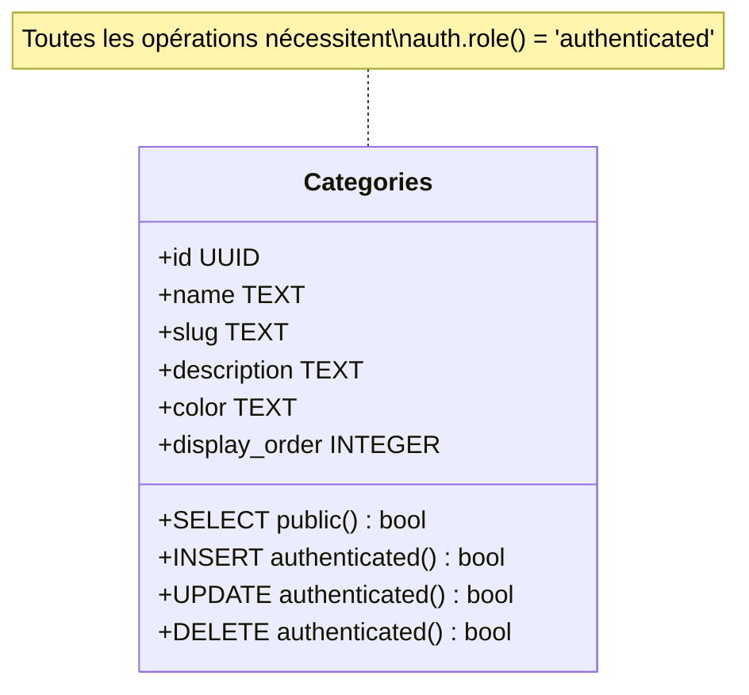
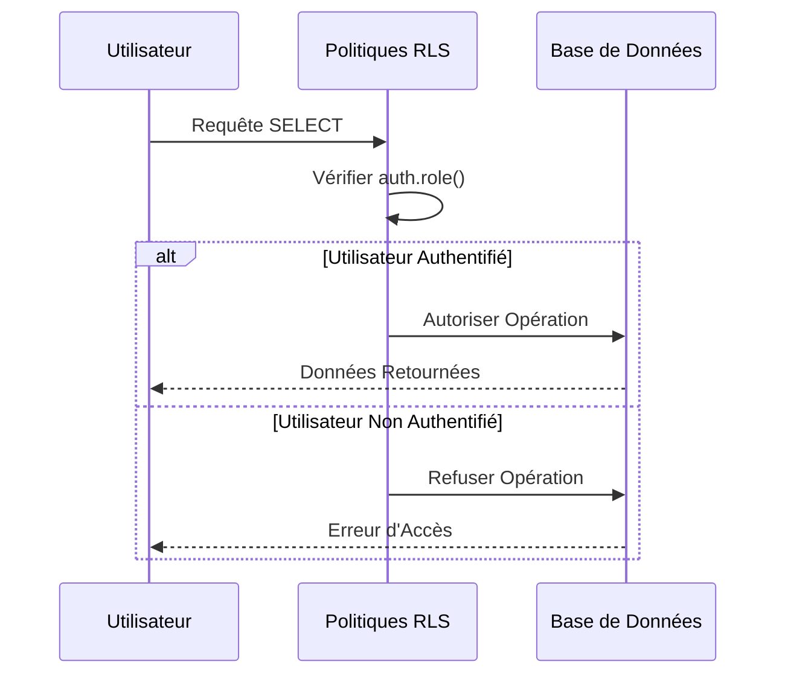
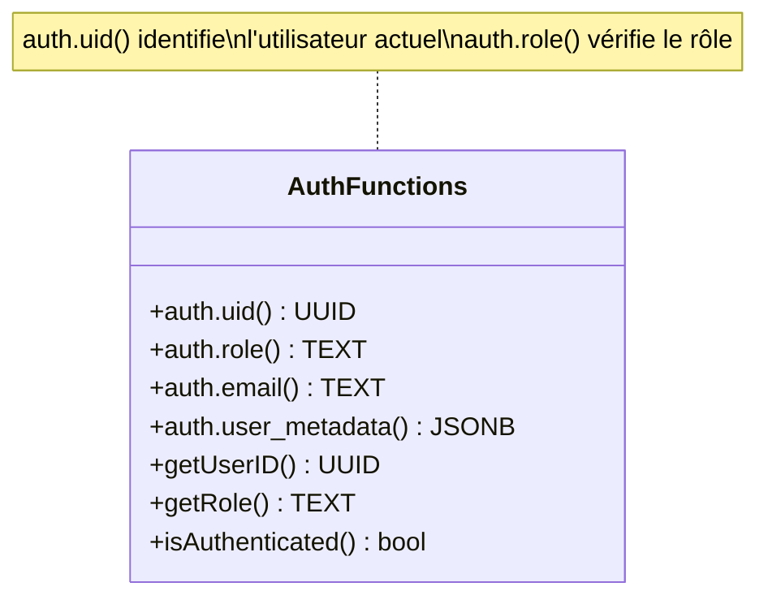
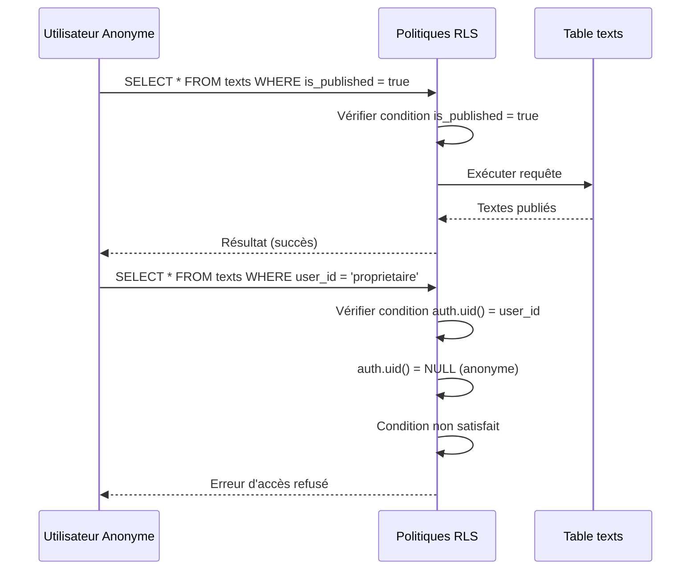
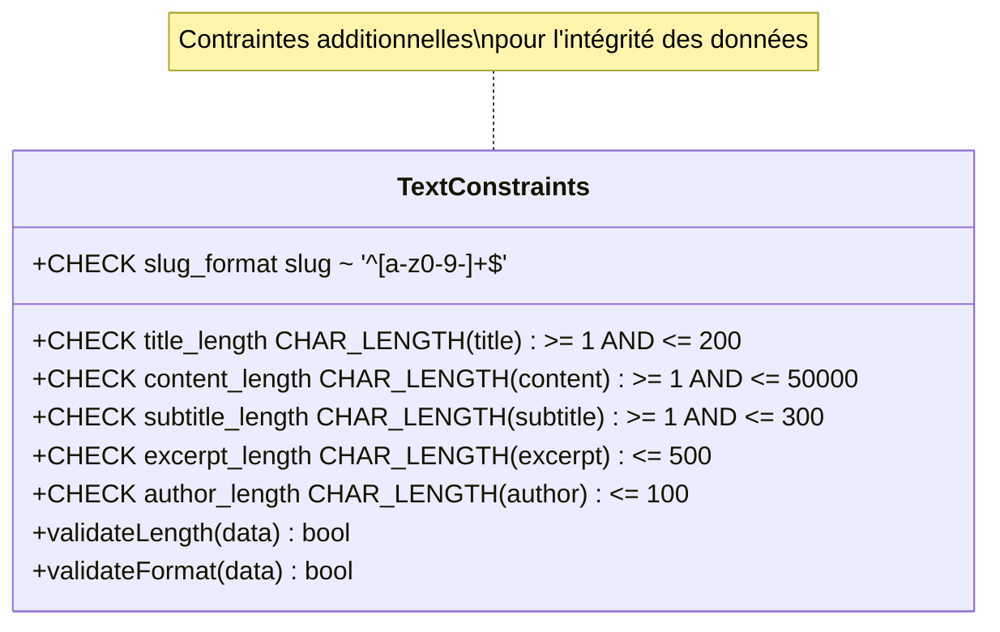
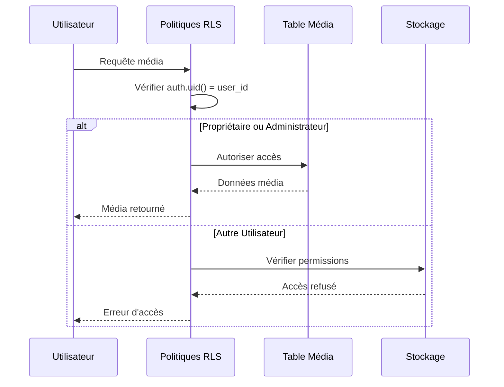
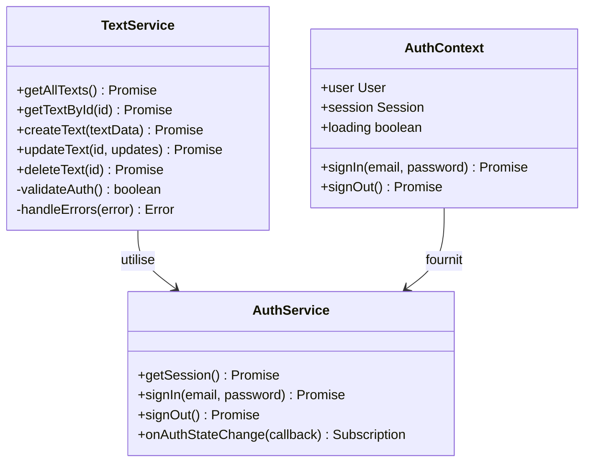

# Sécurité au Niveau Ligne (RLS)

<cite>
**Fichiers Référencés dans ce Document**
- [20250107_create_texts_system.sql](file://supabase/migrations/20250107_create_texts_system.sql)
- [20250107_create_texts_system_v2.sql](file://supabase/migrations/20250107_create_texts_system_v2.sql)
- [20250111_add_security_constraints.sql](file://supabase/migrations/20250111_add_security_constraints.sql)
- [schema.sql](file://database/schema.sql)
- [textService.ts](file://services/textService.ts)
- [TextEditModal.tsx](file://components/texts/TextEditModal.tsx)
- [TextListAdmin.tsx](file://components/texts/TextListAdmin.tsx)
- [supabaseClient.ts](file://lib/supabaseClient.ts)
- [validators.ts](file://lib/validators.ts)
- [authService.ts](file://services/authService.ts)
- [AuthContext.tsx](file://contexts/AuthContext.tsx)
</cite>

## Table des Matières
1. [Introduction](#introduction)
2. [Architecture des Politiques RLS](#architecture-des-politiques-rls)
3. [Politiques de la Table `texts`](#politiques-de-la-table-texts)
4. [Politiques de la Table `categories`](#politiques-de-la-table-categories)
5. [Politiques de la Table `tags`](#politiques-de-la-table-tags)
6. [Politiques de la Table `text_tags`](#politiques-de-la-table-text_tags)
7. [Conditions d'Accès Basées sur `auth.uid()` et `auth.role()`](#conditions-daccès-basées-sur-authuid-et-authrole)
8. [Exemples de Requêtes et Scénarios](#exemples-de-requêtes-et-scénarios)
9. [Renforcement de la Sécurité](#renforcement-de-la-sécurité)
10. [Impact sur les Applications Frontend](#impact-sur-les-applications-frontend)
11. [Conclusion](#conclusion)

## Introduction

Le système de sécurité du portfolio utilise les politiques Row Level Security (RLS) de PostgreSQL pour contrôler l'accès aux données au niveau ligne. Cette approche granulaire garantit que seules les utilisateurs autorisés peuvent accéder, modifier ou supprimer des enregistrements spécifiques, en fonction de critères stricts basés sur l'identité de l'utilisateur et le statut des données.

Les politiques RLS sont appliquées aux quatre principales tables du système : `texts`, `categories`, `tags` et `text_tags`. Chaque table bénéficie d'une stratégie de sécurité adaptée à ses besoins fonctionnels spécifiques.

## Architecture des Politiques RLS

```mermaid
graph TB
subgraph "Couche Application"
FE[Interface Utilisateur]
Services[Services Backend]
end
subgraph "Couche Base de Données"
RLS[Politiques RLS]
Tables[Tables de Données]
Views[Vues]
end
subgraph "Couche Authentification"
Auth[Supabase Auth]
UID[auth.uid()]
Role[auth.role()]
end
FE --> Services
Services --> Auth
Auth --> RLS
RLS --> Tables
RLS --> Views
UID -.-> RLS
Role -.-> RLS
```

**Sources du Diagramme**
- [20250107_create_texts_system.sql](file://supabase/migrations/20250107_create_texts_system.sql#L114-L119)
- [supabaseClient.ts](file://lib/supabaseClient.ts#L1-L20)

### Principes Fondamentaux

1. **Séparation des Rôles** : Les politiques distinguent clairement entre les utilisateurs anonymes et authentifiés
2. **Contrôle d'Accès Basé sur l'Identité** : Utilisation de `auth.uid()` pour identifier les propriétaires
3. **Contrôle d'Accès Basé sur le Rôle** : Utilisation de `auth.role()` pour les opérations administratives
4. **Principe du Moindre Privilège** : Accès minimal requis pour chaque opération

## Politiques de la Table `texts`

La table `texts` constitue le cœur du système de gestion de contenu, avec des politiques sophistiquées pour gérer les textes publiés et privés.

### Politiques de Lecture

```mermaid
flowchart TD
Request[Requête SELECT] --> Check{Condition Vérifiée}
Check --> |is_published = true| AllowPublic[Accès Public Autorisé]
Check --> |auth.uid() = user_id| AllowOwner[Accès Propriétaire Autorisé]
Check --> |Autre| Deny[Droit Refusé]
AllowPublic --> Result1[Résultat: Textes Publiés]
AllowOwner --> Result2[Résultat: Textes Personnels]
Deny --> Error[Erreur d'Accès]
```

**Sources du Diagramme**
- [20250107_create_texts_system.sql](file://supabase/migrations/20250107_create_texts_system.sql#L168-L177)

#### 1. Lecture Publique des Textes Publiés
- **Nom** : "Tout le monde peut lire les textes publiés"
- **Condition** : `is_published = true`
- **Portée** : Tous les utilisateurs (anonymes inclus)
- **Effet** : Permet la consultation publique des articles publiés

#### 2. Lecture des Textes Personnels
- **Nom** : "Utilisateurs peuvent lire leurs propres textes"
- **Condition** : `auth.uid() = user_id`
- **Portée** : Utilisateurs authentifiés uniquement
- **Effet** : Permet aux auteurs de consulter leurs propres textes, qu'ils soient publiés ou non

### Politiques d'Écriture

#### 3. Création de Textes
- **Nom** : "Utilisateurs authentifiés peuvent créer des textes"
- **Condition** : `auth.role() = 'authenticated' AND auth.uid() = user_id`
- **Portée** : Utilisateurs authentifiés
- **Effet** : Seuls les utilisateurs connectés peuvent créer des textes

#### 4. Modification et Suppression
- **Nom** : "Utilisateurs peuvent modifier/supprimer leurs propres textes"
- **Condition** : `auth.uid() = user_id`
- **Portée** : Propriétaires des textes
- **Effet** : Seuls les auteurs peuvent modifier ou supprimer leurs propres textes

**Sources de la Section**
- [20250107_create_texts_system.sql](file://supabase/migrations/20250107_create_texts_system.sql#L168-L191)
- [textService.ts](file://services/textService.ts#L39-L118)

## Politiques de la Table `categories`

Les catégories bénéficient d'une sécurité simplifiée mais efficace, permettant la consultation publique tout en restreignant les modifications.

### Politiques de Base



**Sources du Diagramme**
- [20250107_create_texts_system.sql](file://supabase/migrations/20250107_create_texts_system.sql#L124-L141)

#### 1. Lecture Publique
- **Nom** : "Tout le monde peut lire les catégories"
- **Condition** : `true`
- **Portée** : Tous les utilisateurs
- **Effet** : Consultation publique sans restriction

#### 2. Opérations d'Administration
- **Nom** : "Utilisateurs authentifiés peuvent créer/modifier/supprimer des catégories"
- **Condition** : `auth.role() = 'authenticated'`
- **Portée** : Utilisateurs authentifiés
- **Effet** : Protection contre les modifications non autorisées

**Sources de la Section**
- [20250107_create_texts_system.sql](file://supabase/migrations/20250107_create_texts_system.sql#L124-L141)

## Politiques de la Table `tags`

Les tags partagent la même stratégie de sécurité que les catégories, favorisant la consultation publique tout en protégeant les modifications.

### Stratégie de Sécurité



**Sources du Diagramme**
- [20250107_create_texts_system.sql](file://supabase/migrations/20250107_create_texts_system.sql#L146-L162)

#### 1. Lecture Publique
- **Nom** : "Tout le monde peut lire les tags"
- **Condition** : `true`
- **Portée** : Tous les utilisateurs
- **Effet** : Consultation publique complète

#### 2. Gestion des Tags
- **Nom** : "Utilisateurs authentifiés peuvent créer/modifier/supprimer des tags"
- **Condition** : `auth.role() = 'authenticated'`
- **Portée** : Utilisateurs authentifiés
- **Effet** : Protection contre les modifications non autorisées

**Sources de la Section**
- [20250107_create_texts_system.sql](file://supabase/migrations/20250107_create_texts_system.sql#L146-L162)

## Politiques de la Table `text_tags`

La table de liaison `text_tags` nécessite une sécurité plus fine, combinant la vérification de l'authentification avec la validation de propriété.

### Politiques Spécialisées

```mermaid
flowchart TD
Policy1[Lecture Publique] --> Condition1[true]
Policy2[Ajout de Tags] --> Condition2[auth.role() = 'authenticated'<br/>AND EXISTS(SELECT 1 FROM texts<br/>WHERE texts.id = text_tags.text_id<br/>AND texts.user_id = auth.uid())]
Policy3[Suppression de Tags] --> Condition3[EXISTS(SELECT 1 FROM texts<br/>WHERE texts.id = text_tags.text_id<br/>AND texts.user_id = auth.uid())]
Condition2 --> Validation[Validation de Propriété]
Condition3 --> Validation
```

**Sources du Diagramme**
- [20250107_create_texts_system.sql](file://supabase/migrations/20250107_create_texts_system.sql#L197-L222)

#### 1. Lecture Publique
- **Nom** : "Tout le monde peut lire les relations text_tags"
- **Condition** : `true`
- **Portée** : Tous les utilisateurs
- **Effet** : Consultation publique des relations

#### 2. Gestion des Relations
- **Nom** : "Utilisateurs peuvent ajouter des tags à leurs textes"
- **Condition** : 
  ```sql
  auth.role() = 'authenticated' AND
  EXISTS (
    SELECT 1 FROM texts
    WHERE texts.id = text_tags.text_id
    AND texts.user_id = auth.uid()
  )
  ```
- **Portée** : Utilisateurs authentifiés
- **Effet** : Seuls les propriétaires peuvent modifier les tags associés à leurs textes

#### 3. Suppression de Relations
- **Nom** : "Utilisateurs peuvent supprimer des tags de leurs textes"
- **Condition** :
  ```sql
  EXISTS (
    SELECT 1 FROM texts
    WHERE texts.id = text_tags.text_id
    AND texts.user_id = auth.uid()
  )
  ```
- **Portée** : Propriétaires des textes
- **Effet** : Validation de propriété avant suppression

**Sources de la Section**
- [20250107_create_texts_system.sql](file://supabase/migrations/20250107_create_texts_system.sql#L197-L222)

## Conditions d'Accès Basées sur `auth.uid()` et `auth.role()`

### Fonctions d'Authentification



**Sources du Diagramme**
- [textService.ts](file://services/textService.ts#L53-L78)
- [supabaseClient.ts](file://lib/supabaseClient.ts#L1-L20)

### Utilisation de `auth.uid()`

#### Identification du Propriétaire
- **Contexte** : Identification unique de l'utilisateur
- **Implémentation** : `auth.uid() = user_id`
- **Cas d'Usage** :
  - Lecture des textes personnels
  - Modification des propres textes
  - Gestion des tags personnels

#### Exemple d'Utilisation
```typescript
// Dans textService.ts
const { data: { user }, error: authError } = await supabaseClient.auth.getUser();
if (authError) {
  // Gestion de l'erreur d'authentification
}

// Validation de propriété lors de la création
const textWithUser = {
  ...text,
  user_id: user.id  // Attribution automatique
};
```

### Utilisation de `auth.role()`

#### Vérification de l'Authentification
- **Contexte** : Validation du statut d'authentification
- **Implémentation** : `auth.role() = 'authenticated'`
- **Cas d'Usage** :
  - Création de nouveaux textes
  - Administration des catégories et tags
  - Opérations de gestion système

#### Exemple d'Implémentation
```typescript
// Politique SQL
CREATE POLICY "Utilisateurs authentifiés peuvent créer des textes"
  ON texts FOR INSERT
  WITH CHECK (auth.role() = 'authenticated' AND auth.uid() = user_id);
```

**Sources de la Section**
- [textService.ts](file://services/textService.ts#L53-L78)
- [20250107_create_texts_system.sql](file://supabase/migrations/20250107_create_texts_system.sql#L178-L181)

## Exemples de Requêtes et Scénarios

### Scénario 1 : Utilisateur Anonyme Consulte les Textes Publiés



**Sources du Diagramme**
- [20250107_create_texts_system.sql](file://supabase/migrations/20250107_create_texts_system.sql#L168-L172)

#### Requête Succès
```sql
-- Requête autorisée pour utilisateur anonyme
SELECT * FROM texts 
WHERE is_published = true;
-- Résultat : Textes publiés accessibles publiquement
```

#### Requête Échec
```sql
-- Requête refusée pour utilisateur anonyme
SELECT * FROM texts 
WHERE user_id = 'proprietaire-id';
-- Résultat : Erreur d'accès refusé
```

### Scénario 2 : Utilisateur Authentifié Gère Ses Propres Textes

```mermaid
sequenceDiagram
participant User as Utilisateur Authentifié
participant RLS as Politiques RLS
participant Texts as Table texts
Note over User,Texts : Création d'un nouveau texte
User->>RLS : INSERT INTO texts (...)
RLS->>RLS : Vérifier auth.role() = 'authenticated'
RLS->>RLS : Vérifier auth.uid() = user_id
RLS->>Texts : Exécuter insertion
Texts-->>RLS : Texte créé
RLS-->>User : Succès
Note over User,Texts : Modification de texte personnel
User->>RLS : UPDATE texts SET title = '...'
WHERE id = 'text-id'
RLS->>RLS : Vérifier auth.uid() = user_id
RLS->>Texts : Exécuter mise à jour
Texts-->>RLS : Texte modifié
RLS-->>User : Succès
Note over User,Texts : Tentative modification texte autre
User->>RLS : UPDATE texts SET title = '...'
WHERE id = 'autre-text-id'
RLS->>RLS : Vérifier auth.uid() = user_id
RLS->>RLS : Condition non satisfait
RLS-->>User : Erreur d'accès refusé
```

**Sources du Diagramme**
- [20250107_create_texts_system.sql](file://supabase/migrations/20250107_create_texts_system.sql#L178-L191)
- [textService.ts](file://services/textService.ts#L39-L118)

#### Requête de Création Autorisée
```sql
-- Requête autorisée pour utilisateur authentifié
INSERT INTO texts (title, content, user_id, is_published)
VALUES ('Mon Premier Article', '...', 'user-uuid', false);
-- Résultat : Texte créé avec succès
```

#### Requête de Modification Autorisée
```sql
-- Requête autorisée pour propriétaire
UPDATE texts 
SET title = 'Article Mis à Jour'
WHERE id = 'text-uuid' AND user_id = 'user-uuid';
-- Résultat : Texte modifié
```

#### Requête de Modification Refusée
```sql
-- Requête refusée pour utilisateur non propriétaire
UPDATE texts 
SET title = 'Modification Interdite'
WHERE id = 'autre-text-uuid' AND user_id = 'user-uuid';
-- Résultat : Erreur d'accès refusé
```

### Scénario 3 : Administration des Catégories et Tags

```mermaid
flowchart TD
Admin[Administrateur Authentifié] --> CheckRole{auth.role() = 'authenticated'?}
CheckRole --> |Oui| CheckUID{auth.uid() = user_id?}
CheckRole --> |Non| Deny1[Accès Refusé]
CheckUID --> |Oui| AllowAdmin[Opérations Admin Autorisées]
CheckUID --> |Non| AllowAdmin
AllowAdmin --> CreateCat[Créer Catégorie]
AllowAdmin --> UpdateCat[Mettre à Jour Catégorie]
AllowAdmin --> DeleteCat[Supprimer Catégorie]
CreateCat --> Success[Succès]
UpdateCat --> Success
DeleteCat --> Success
```

**Sources du Diagramme**
- [20250107_create_texts_system.sql](file://supabase/migrations/20250107_create_texts_system.sql#L129-L141)

#### Requête d'Administration Autorisée
```sql
-- Requête autorisée pour administrateur
INSERT INTO categories (name, slug, description)
VALUES ('Nouvelle Catégorie', 'nouvelle-categorie', 'Description...');
-- Résultat : Catégorie créée avec succès

-- Requête de mise à jour
UPDATE categories 
SET name = 'Catégorie Modifiée'
WHERE id = 'category-uuid';
-- Résultat : Catégorie mise à jour
```

#### Requête d'Administration Refusée
```sql
-- Requête refusée pour utilisateur non authentifié
INSERT INTO categories (name, slug)
VALUES ('Catégorie Interdite', 'interdit');
-- Résultat : Erreur d'accès refusé
```

**Sources de la Section**
- [20250107_create_texts_system.sql](file://supabase/migrations/20250107_create_texts_system.sql#L124-L191)
- [textService.ts](file://services/textService.ts#L39-L118)

## Renforcement de la Sécurité

### Contraintes CHECK au Niveau Base de Données

Le système implémente des contraintes CHECK supplémentaires pour renforcer la sécurité et l'intégrité des données.

#### Contraintes sur la Table `texts`



**Sources du Diagramme**
- [20250111_add_security_constraints.sql](file://supabase/migrations/20250111_add_security_constraints.sql#L27-L62)

#### Implémentation des Contraintes

##### Longueur du Titre
- **Contrainte** : `CHAR_LENGTH(title) >= 1 AND CHAR_LENGTH(title) <= 200`
- **But** : Prévenir les titres vides ou excessivement longs
- **Impact** : Validation côté base de données

##### Longueur du Contenu
- **Contrainte** : `CHAR_LENGTH(content) >= 1 AND CHAR_LENGTH(content) <= 50000`
- **But** : Limiter la taille des articles
- **Impact** : Protection contre les injections et optimisation des performances

##### Format du Slug
- **Contrainte** : `slug ~ '^[a-z0-9-]+$'`
- **But** : Assurer la compatibilité URL
- **Impact** : Validation stricte des identifiants

### Amélioration des Politiques RLS

#### Sécurité Renforcée pour les Médias



**Sources du Diagramme**
- [20250111_add_security_constraints.sql](file://supabase/migrations/20250111_add_security_constraints.sql#L192-L244)

#### Politiques Améliorées pour `photos`

##### Création de Photos
```sql
CREATE POLICY "Utilisateurs authentifiés peuvent créer leurs propres photos"
  ON photos FOR INSERT
  TO authenticated
  WITH CHECK (auth.uid() = user_id);
```

##### Modification de Photos
```sql
CREATE POLICY "Utilisateurs peuvent modifier leurs propres photos"
  ON photos FOR UPDATE
  TO authenticated
  USING (auth.uid() = user_id)
  WITH CHECK (auth.uid() = user_id);
```

**Sources de la Section**
- [20250111_add_security_constraints.sql](file://supabase/migrations/20250111_add_security_constraints.sql#L27-L258)

## Impact sur les Applications Frontend

### Intégration avec les Services



**Sources du Diagramme**
- [textService.ts](file://services/textService.ts#L1-L385)
- [authService.ts](file://services/authService.ts#L1-L31)
- [AuthContext.tsx](file://contexts/AuthContext.tsx#L1-L70)

### Gestion des Erreurs d'Authentification

#### Validation de l'Authentification
```typescript
// Dans textService.ts
const { data: { user }, error: authError } = await supabaseClient.auth.getUser();
if (authError) {
  return {
    text: null,
    error: {
      message: 'Erreur d\'authentification',
      code: 'AUTH_ERROR',
      details: authError
    }
  };
}

if (!user) {
  return {
    text: null,
    error: {
      message: 'Vous devez être connecté pour ajouter un texte',
      code: 'NOT_AUTHENTICATED',
      hint: 'Connectez-vous depuis la page /login'
    }
  };
}
```

#### Gestion des Erreurs RLS
```typescript
// Traitement des erreurs de politique RLS
if (error && error.code === '42501') {
  // Erreur de politique RLS
  return {
    text: null,
    error: {
      message: 'Accès refusé - Vous n\'êtes pas autorisé à effectuer cette action',
      code: 'ACCESS_DENIED',
      details: error
    }
  };
}
```

### Optimisations Frontend

#### Cache Intelligent
```typescript
// Dans textService.ts
const CACHE_KEY = 'texts:all-with-metadata';
const TTL = 5 * 60 * 1000; // 5 minutes

// Vérification du cache avant requête
const cached = cache.get<{ texts: TextWithMetadata[]; error: null }>(CACHE_KEY);
if (cached) {
  return cached;
}

// Requête vers la base de données
const { data, error } = await supabaseClient
  .from('texts')
  .select(`
    *,
    category:categories(*),
    text_tags(tag:tags(*))
  `)
  .order('display_order', { ascending: true });

// Mise en cache du résultat
cache.set(CACHE_KEY, result, { ttl: TTL, storage: 'session' });
```

**Sources de la Section**
- [textService.ts](file://services/textService.ts#L39-L118)
- [TextEditModal.tsx](file://components/texts/TextEditModal.tsx#L1-L382)
- [AuthContext.tsx](file://contexts/AuthContext.tsx#L1-L70)

## Conclusion

Les politiques Row Level Security (RLS) mises en place dans le système de gestion de contenu offrent un niveau de sécurité robuste et granulaire. Elles garantissent :

### Avantages de la Stratégie RLS

1. **Sécurité au Niveau Ligne** : Contrôle précis de l'accès à chaque enregistrement
2. **Flexibilité** : Stratégies différentes selon le type de données
3. **Performance** : Filtrage côté base de données optimise les requêtes
4. **Intégrité** : Contraintes CHECK supplémentaires protègent l'intégrité des données

### Distinction Clé entre Textes Publiés et Privés

- **Textes Publiés** (`is_published = true`) : Accès public complet
- **Textes Privés** : Accès restreint aux propriétaires uniquement
- **Mélange Hybride** : Utilisateurs authentifiés voient leurs propres contenus

### Renforcement de la Sécurité

- **Contraintes CHECK** : Validation côté base de données
- **Politiques RLS Améliorées** : Protection renforcée pour tous les types de données
- **Gestion d'Erreurs** : Feedback clair aux utilisateurs frontend

### Impact sur l'Expérience Utilisateur

- **Transparence** : Les utilisateurs comprennent facilement les limitations
- **Simplicité** : Interface intuitive masquant la complexité technique
- **Performance** : Chargement rapide grâce au cache intelligent

Cette approche hybride combine sécurité, performance et expérience utilisateur, créant un système de gestion de contenu fiable et convivial. Les politiques RLS constituent la pierre angulaire de cette architecture sécurisée, garantissant que chaque utilisateur accède uniquement aux données appropriées selon ses droits d'accès.