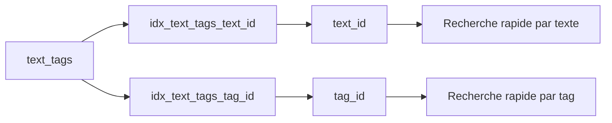
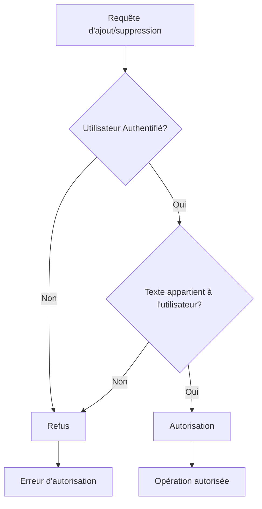
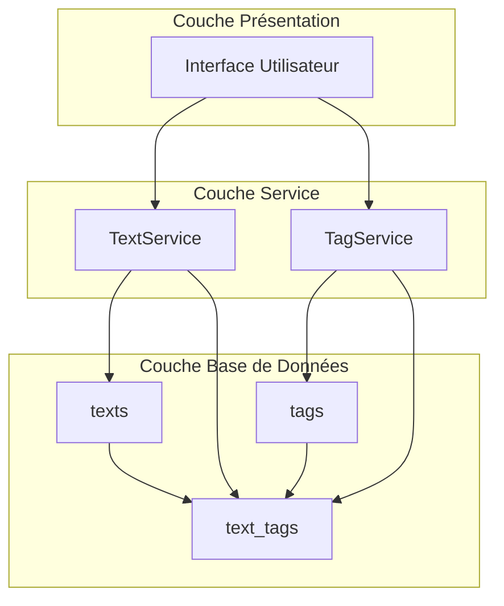

# Table de Relation Texte-Tag

<cite>
**Fichiers Référencés dans ce Document**
- [20250107_create_texts_system.sql](file://supabase/migrations/20250107_create_texts_system.sql)
- [20250107_create_texts_system_v2.sql](file://supabase/migrations/20250107_create_texts_system_v2.sql)
- [textService.ts](file://services/textService.ts)
- [tagService.ts](file://services/tagService.ts)
- [supabaseClient.ts](file://lib/supabaseClient.ts)
- [texts_with_metadata](file://supabase/migrations/20250107_create_texts_system.sql#L284-L319)
</cite>

## Table des Matières
1. [Introduction](#introduction)
2. [Structure de la Table](#structure-de-la-table)
3. [Relations et Contraintes](#relations-et-contraintes)
4. [Index et Performances](#index-et-performances)
5. [Politiques RLS](#politiques-rls)
6. [Utilisation dans le Système](#utilisation-dans-le-système)
7. [Services et APIs](#services-et-apis)
8. [Requêtes SQL Exemples](#requêtes-sql-exemples)
9. [Vue texts_with_metadata](#vue-texts_with_metadata)
10. [Conclusion](#conclusion)

## Introduction

La table `text_tags` constitue le cœur de la fonctionnalité de tagging dans le système de textes du portfolio. Elle implémente une relation many-to-many entre les tables `texts` et `tags`, permettant aux utilisateurs de catégoriser et organiser les contenus textuels de manière flexible et granulaire.

Cette table est essentielle pour la recherche, la navigation et la classification des articles, articles de blog et autres contenus textuels publiés sur la plateforme.

## Structure de la Table

### Schéma Détaillé

```mermaid
erDiagram
TEXTS {
uuid id PK
text title
text subtitle
text content
text excerpt
text author
date published_date
int display_order
uuid category_id FK
uuid user_id FK
bool is_published
int view_count
timestamp created_at
timestamp updated_at
}
TAGS {
uuid id PK
text name
text slug
text color
timestamp created_at
timestamp updated_at
}
TEXT_TAGS {
uuid text_id FK
uuid tag_id FK
timestamp created_at
primary_key (text_id, tag_id)
}
TEXTS ||--o{ TEXT_TAGS : "contient"
TAGS ||--o{ TEXT_TAGS : "appliqué à"
```

**Sources du Diagramme**
- [20250107_create_texts_system.sql](file://supabase/migrations/20250107_create_texts_system.sql#L99-L104)
- [supabaseClient.ts](file://lib/supabaseClient.ts#L79-L83)

### Colonnes Principales

| Colonne | Type | Contraintes | Description |
|---------|------|-------------|-------------|
| `text_id` | UUID | NOT NULL, FK, ON DELETE CASCADE | Identifiant du texte lié |
| `tag_id` | UUID | NOT NULL, FK, ON DELETE CASCADE | Identifiant du tag appliqué |
| `created_at` | TIMESTAMPTZ | DEFAULT now() | Date de création de la relation |

**Sources de Section**
- [20250107_create_texts_system.sql](file://supabase/migrations/20250107_create_texts_system.sql#L99-L104)

## Relations et Contraintes

### Clés Étrangères

La table `text_tags` maintient deux clés étrangères référençant les tables principales :

1. **`text_id`** : Référence la table `texts` avec suppression en cascade
2. **`tag_id`** : Référence la table `tags` avec suppression en cascade

### Clé Primaire Composite

La combinaison `(text_id, tag_id)` forme la clé primaire unique, garantissant qu'un même tag ne peut être appliqué plusieurs fois au même texte.

### Suppression en Cascade

Les contraintes d'intégrité référentielle assurent que :
- La suppression d'un texte entraîne automatiquement la suppression de toutes ses relations avec les tags
- La suppression d'un tag entraîne automatiquement la suppression de toutes ses relations avec les textes

**Sources de Section**
- [20250107_create_texts_system.sql](file://supabase/migrations/20250107_create_texts_system.sql#L99-L104)

## Index et Performances

### Index Créés



**Sources du Diagramme**
- [20250107_create_texts_system.sql](file://supabase/migrations/20250107_create_texts_system.sql#L106-L108)

### Optimisations de Performance

1. **Index sur `text_id`** : Améliore les performances des requêtes de recherche de tags par texte
2. **Index sur `tag_id`** : Améliore les performances des requêtes de recherche de textes par tag
3. **Clé primaire composite** : Garantit l'unicité des relations et optimise les jointures

**Sources de Section**
- [20250107_create_texts_system.sql](file://supabase/migrations/20250107_create_texts_system.sql#L106-L108)

## Politiques RLS

### Sécurité par Niveau de Ligne

La table `text_tags` bénéficie des politiques de sécurité Row Level Security (RLS) pour contrôler l'accès aux données :

#### Politiques de Lecture Publique
- **Tout le monde peut lire** : Accès public à toutes les relations

#### Politiques d'Écriture
- **Ajout de tags** : Autorisé aux utilisateurs authentifiés pour leurs propres textes
- **Suppression de tags** : Autorisée aux utilisateurs authentifiés pour leurs propres textes

### Logique de Sécurité



**Sources du Diagramme**
- [20250107_create_texts_system.sql](file://supabase/migrations/20250107_create_texts_system.sql#L203-L222)

**Sources de Section**
- [20250107_create_texts_system.sql](file://supabase/migrations/20250107_create_texts_system.sql#L203-L222)

## Utilisation dans le Système

### Architecture du Système



**Sources du Diagramme**
- [textService.ts](file://services/textService.ts#L1-L385)
- [tagService.ts](file://services/tagService.ts#L1-L197)

### Flux de Travail Typique

1. **Création de texte avec tags** : Le service `textService` appelle `tagService.setTagsForText()`
2. **Mise à jour de tags** : Modification dynamique des relations via `tagService`
3. **Récupération de métadonnées** : Utilisation de la vue `texts_with_metadata`
4. **Recherche par tag** : Navigation et filtrage des contenus

**Sources de Section**
- [textService.ts](file://services/textService.ts#L328-L383)
- [tagService.ts](file://services/tagService.ts#L132-L159)

## Services et APIs

### Interface TypeScript

La table est typée dans le client Supabase avec l'interface `TextTag` :

```typescript
export type TextTag = {
  text_id: string;
  tag_id: string;
  created_at: string;
};
```

### Méthodes du TagService

Le service `tagService` expose plusieurs méthodes pour manipuler les relations :

1. **`getTagsForText(textId: string)`** : Récupère tous les tags d'un texte
2. **`addTagToText(textId: string, tagId: string)`** : Ajoute un tag à un texte
3. **`removeTagFromText(textId: string, tagId: string)`** : Supprime un tag d'un texte
4. **`setTagsForText(textId: string, tagIds: string[])`** : Définit tous les tags d'un texte

### Intégration avec TextService

Le `textService` utilise `tagService.setTagsForText()` lors de la création et mise à jour de textes :

```typescript
// Dans createTextWithTags
const { error: tagsError } = await tagService.setTagsForText(text.id, tagIds);

// Dans updateTextWithTags  
const { error: tagsError } = await tagService.setTagsForText(id, tagIds);
```

**Sources de Section**
- [supabaseClient.ts](file://lib/supabaseClient.ts#L79-L83)
- [textService.ts](file://services/textService.ts#L349-L379)
- [tagService.ts](file://services/tagService.ts#L132-L159)

## Requêtes SQL Exemples

### Ajouter des Tags à un Texte

```sql
-- Ajouter un seul tag
INSERT INTO text_tags (text_id, tag_id)
VALUES ('uuid-text-id', 'uuid-tag-id');

-- Ajouter plusieurs tags en une seule opération
INSERT INTO text_tags (text_id, tag_id)
VALUES 
  ('uuid-text-id', 'uuid-tag1'),
  ('uuid-text-id', 'uuid-tag2'),
  ('uuid-text-id', 'uuid-tag3');
```

### Supprimer un Tag d'un Texte

```sql
-- Supprimer un tag spécifique
DELETE FROM text_tags
WHERE text_id = 'uuid-text-id'
  AND tag_id = 'uuid-tag-id';

-- Supprimer tous les tags d'un texte
DELETE FROM text_tags
WHERE text_id = 'uuid-text-id';
```

### Lister les Tags d'un Texte

```sql
-- Requête simple
SELECT t.*
FROM tags t
JOIN text_tags tt ON t.id = tt.tag_id
WHERE tt.text_id = 'uuid-text-id';

-- Avec informations du texte
SELECT t.*, tt.created_at
FROM tags t
JOIN text_tags tt ON t.id = tt.tag_id
WHERE tt.text_id = 'uuid-text-id'
ORDER BY tt.created_at DESC;
```

### Lister les Textes d'un Tag

```sql
-- Requête simple
SELECT t.*
FROM texts t
JOIN text_tags tt ON t.id = tt.text_id
WHERE tt.tag_id = 'uuid-tag-id';

-- Avec informations complètes
SELECT t.*, tt.created_at
FROM texts t
JOIN text_tags tt ON t.id = tt.text_id
WHERE tt.tag_id = 'uuid-tag-id'
ORDER BY t.display_order ASC;
```

### Requêtes Avancées

```sql
-- Textes avec leur nombre de tags
SELECT t.id, t.title, COUNT(tt.tag_id) as tag_count
FROM texts t
LEFT JOIN text_tags tt ON t.id = tt.text_id
GROUP BY t.id, t.title
ORDER BY tag_count DESC;

-- Tags les plus populaires
SELECT tg.id, tg.name, COUNT(tt.text_id) as text_count
FROM tags tg
JOIN text_tags tt ON tg.id = tt.tag_id
GROUP BY tg.id, tg.name
ORDER BY text_count DESC
LIMIT 20;
```

## Vue texts_with_metadata

### Structure de la Vue

La vue `texts_with_metadata` utilise la table `text_tags` pour enrichir les textes avec leurs tags associés :

```sql
CREATE OR REPLACE VIEW texts_with_metadata AS
SELECT
  t.id,
  t.title,
  t.subtitle,
  t.content,
  t.excerpt,
  t.author,
  t.published_date,
  t.display_order,
  t.is_published,
  t.view_count,
  t.user_id,
  t.created_at,
  t.updated_at,
  c.id AS category_id,
  c.name AS category_name,
  c.slug AS category_slug,
  c.color AS category_color,
  COALESCE(
    json_agg(
      json_build_object(
        'id', tg.id,
        'name', tg.name,
        'slug', tg.slug,
        'color', tg.color
      )
    ) FILTER (WHERE tg.id IS NOT NULL),
    '[]'
  ) AS tags
FROM texts t
LEFT JOIN categories c ON t.category_id = c.id
LEFT JOIN text_tags tt ON t.id = tt.text_id
LEFT JOIN tags tg ON tt.tag_id = tg.id
GROUP BY t.id, c.id, c.name, c.slug, c.color;
```

### Utilisation dans le TextService

Le `textService` utilise cette vue pour récupérer les textes avec leurs métadonnées :

```typescript
async getTextsWithMetadata() {
  const { data, error } = await supabaseClient
    .from('texts')
    .select(`
      *,
      category:categories(*),
      text_tags(tag:tags(*))
    `)
    .order('display_order', { ascending: true });
}
```

### Transformation des Données

Le service transforme les données pour fournir une structure cohérente :

```typescript
const texts = data.map((text: any) => ({
  ...text,
  category: text.category || null,
  tags: text.text_tags?.map((tt: any) => tt.tag).filter(Boolean) || [],
}));
```

**Sources de Section**
- [20250107_create_texts_system.sql](file://supabase/migrations/20250107_create_texts_system.sql#L284-L319)
- [textService.ts](file://services/textService.ts#L160-L196)

## Conclusion

La table `text_tags` représente un élément fondamental de l'architecture modulaire du système de textes. Sa conception sophistiquée avec contraintes d'intégrité, politiques de sécurité et optimisations de performance en fait un composant robuste et scalable.

### Points Clés

1. **Flexibilité du Tagging** : Permet une organisation fine des contenus textuels
2. **Intégrité des Données** : Garantie par les contraintes de clés étrangères et suppression en cascade
3. **Sécurité** : Protection des données par RLS avec contrôle d'accès basé sur l'utilisateur
4. **Performances** : Indexation stratégique pour des requêtes rapides
5. **Intégration** : Cohérence avec l'écosystème de services et vues

Cette table démontre l'approche architecturale orientée objet et relationnelle adoptée dans le projet, favorisant la réutilisabilité et la maintenabilité du code tout en offrant une expérience utilisateur fluide et performante.