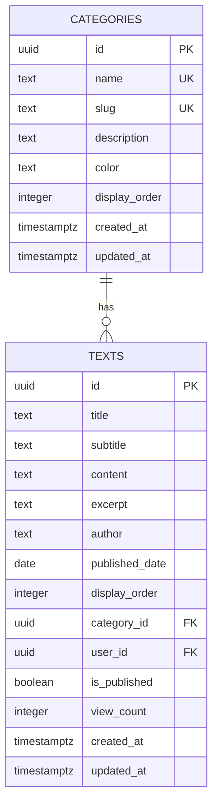
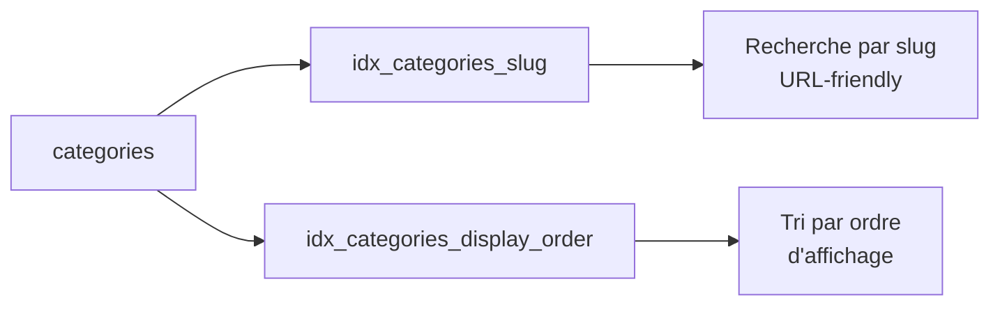
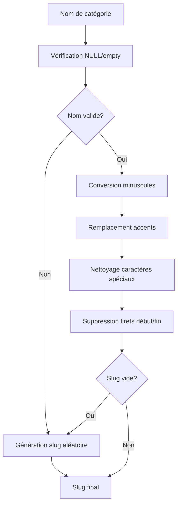
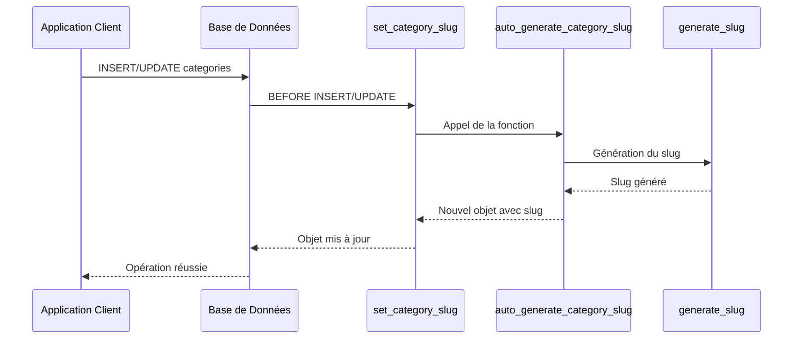
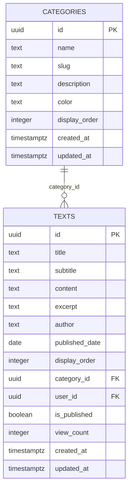
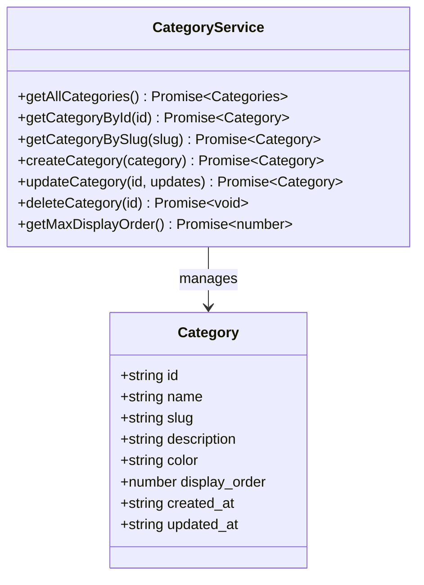

# Table des Catégories

<cite>
**Fichiers Référencés dans ce Document**
- [20250107_create_texts_system.sql](file://supabase/migrations/20250107_create_texts_system.sql)
- [20250107_create_texts_system_v2.sql](file://supabase/migrations/20250107_create_texts_system_v2.sql)
- [categoryService.ts](file://services/categoryService.ts)
- [CategoryManager.tsx](file://components/texts/CategoryManager.tsx)
- [CategoryBadge.tsx](file://components/texts/CategoryBadge.tsx)
- [supabaseClient.ts](file://lib/supabaseClient.ts)
- [validators.ts](file://lib/validators.ts)
- [TextListAdmin.tsx](file://components/texts/TextListAdmin.tsx)
- [texts_with_metadata view](file://supabase/migrations/20250107_create_texts_system.sql#L285-L330)
</cite>

## Table des Matières
1. [Introduction](#introduction)
2. [Structure de la Table](#structure-de-la-table)
3. [Colonnes et Contraintes](#colonnes-et-contraintes)
4. [Index et Performances](#index-et-performances)
5. [Fonctions et Triggers](#fonctions-et-triggers)
6. [Politiques RLS](#politiques-rls)
7. [Relations avec les Autres Tables](#relations-avec-les-autres-tables)
8. [Services et Composants](#services-et-composants)
9. [Exemples de Requêtes SQL](#exemples-de-requêtes-sql)
10. [Cas d'Usage Pratiques](#cas-dusage-pratiques)

## Introduction

La table `categories` constitue le cœur de la hiérarchie de classification des textes dans le système de gestion du portfolio. Elle permet d'organiser les contenus selon des thèmes prédéfinis, facilitant ainsi la navigation et la recherche. Cette table est étroitement intégrée avec les autres tables du système (`texts`, `tags`, `text_tags`) pour créer un écosystème de contenu structuré.

## Structure de la Table

La table `categories` est conçue selon les principes de normalisation et d'optimisation des performances. Elle utilise un UUID comme clé primaire et implémente plusieurs mécanismes automatisés pour maintenir l'intégrité des données.



**Sources du Diagramme**
- [20250107_create_texts_system.sql](file://supabase/migrations/20250107_create_texts_system.sql#L69-L80)
- [20250107_create_texts_system_v2.sql](file://supabase/migrations/20250107_create_texts_system_v2.sql#L69-L80)

## Colonnes et Contraintes

### Colonnes Principales

| Colonne | Type de Données | Contraintes | Description |
|---------|----------------|-------------|-------------|
| `id` | UUID | PRIMARY KEY, DEFAULT gen_random_uuid() | Identifiant unique généré automatiquement |
| `name` | TEXT | NOT NULL, UNIQUE | Nom de la catégorie (ex: "Développement") |
| `slug` | TEXT | NOT NULL, UNIQUE | URL-friendly version du nom |
| `description` | TEXT | NULLABLE | Description textuelle de la catégorie |
| `color` | TEXT | DEFAULT '#3b82f6' | Code couleur hexadécimal pour l'interface |
| `display_order` | INTEGER | NOT NULL, DEFAULT 0 | Ordre d'affichage dans les listes |
| `created_at` | TIMESTAMPTZ | DEFAULT now() | Timestamp de création |
| `updated_at` | TIMESTAMPTZ | DEFAULT now() | Timestamp de dernière modification |

### Contraintes Métier

- **Unicité du nom** : Empêche la création de catégories avec des noms identiques
- **Unicité du slug** : Assure l'unicité des URLs pour chaque catégorie
- **Couleur par défaut** : Fournit une valeur par défaut cohérente pour l'interface utilisateur
- **Ordre d'affichage** : Permet un tri personnalisable des catégories

**Sources de Section**
- [20250107_create_texts_system.sql](file://supabase/migrations/20250107_create_texts_system.sql#L69-L80)
- [20250107_create_texts_system_v2.sql](file://supabase/migrations/20250107_create_texts_system_v2.sql#L69-L80)

## Index et Performances

### Index Créés



**Sources du Diagramme**
- [20250107_create_texts_system.sql](file://supabase/migrations/20250107_create_texts_system.sql#L19-L21)
- [20250107_create_texts_system_v2.sql](file://supabase/migrations/20250107_create_texts_system_v2.sql#L81-L83)

### Stratégie d'Indexation

1. **Index sur `slug`** : Optimise les recherches par URL et les requêtes de routage
2. **Index sur `display_order`** : Accélère les requêtes de tri et d'affichage

Ces index sont essentiels pour les performances lors de l'affichage des listes de catégories et lors de la navigation par URL.

**Sources de Section**
- [20250107_create_texts_system.sql](file://supabase/migrations/20250107_create_texts_system.sql#L19-L21)
- [20250107_create_texts_system_v2.sql](file://supabase/migrations/20250107_create_texts_system_v2.sql#L81-L83)

## Fonctions et Triggers

### Fonction `generate_slug`

La fonction `generate_slug` est responsable de la génération automatique des slugs à partir des noms de catégories.



**Sources du Diagramme**
- [20250107_create_texts_system_v2.sql](file://supabase/migrations/20250107_create_texts_system_v2.sql#L22-L68)

### Fonction `auto_generate_category_slug`

Cette fonction trigger s'exécute avant les opérations INSERT et UPDATE pour générer automatiquement le slug si nécessaire.

### Trigger `set_category_slug`



**Sources du Diagramme**
- [20250107_create_texts_system.sql](file://supabase/migrations/20250107_create_texts_system.sql#L248-L262)
- [20250107_create_texts_system_v2.sql](file://supabase/migrations/20250107_create_texts_system_v2.sql#L91-L106)

### Trigger `update_categories_updated_at`

Ce trigger automatise la mise à jour du timestamp `updated_at` lors des modifications.

**Sources de Section**
- [20250107_create_texts_system.sql](file://supabase/migrations/20250107_create_texts_system.sql#L24-L36)
- [20250107_create_texts_system_v2.sql](file://supabase/migrations/20250107_create_texts_system_v2.sql#L57-L68)

## Politiques RLS

### Configuration de Sécurité

La table `categories` bénéficie d'une sécurité fine-grainée via les politiques de niveau ligne (RLS).

```mermaid
graph TB
A[Politiques RLS Categories] --> B[Lecture Publique]
A --> C[Création Authentifiée]
A --> D[Modification Authentifiée]
A --> E[Suppression Authentifiée]
B --> F[SELECT ANYBODY]
C --> G[INSERT auth.role() = 'authenticated']
D --> H[UPDATE auth.role() = 'authenticated']
E --> I[DELETE auth.role() = 'authenticated']
```

**Sources du Diagramme**
- [20250107_create_texts_system.sql](file://supabase/migrations/20250107_create_texts_system.sql#L114-L140)
- [20250107_create_texts_system_v2.sql](file://supabase/migrations/20250107_create_texts_system_v2.sql#L201-L211)

### Détails des Politiques

1. **Lecture Publique** : Toute personne peut lire les catégories
2. **Création Restreinte** : Seuls les utilisateurs authentifiés peuvent créer des catégories
3. **Modification Restreinte** : Seuls les utilisateurs authentifiés peuvent modifier les catégories
4. **Suppression Restreinte** : Seuls les utilisateurs authentifiés peuvent supprimer des catégories

**Sources de Section**
- [20250107_create_texts_system.sql](file://supabase/migrations/20250107_create_texts_system.sql#L114-L140)
- [20250107_create_texts_system_v2.sql](file://supabase/migrations/20250107_create_texts_system_v2.sql#L201-L211)

## Relations avec les Autres Tables

### Relation avec `texts`

La table `categories` est liée à `texts` via une clé étrangère `category_id`.



**Sources du Diagramme**
- [20250107_create_texts_system.sql](file://supabase/migrations/20250107_create_texts_system.sql#L69-L80)
- [20250107_create_texts_system.sql](file://supabase/migrations/20250107_create_texts_system.sql#L69-L80)

### Vue `texts_with_metadata`

La vue combine les informations des textes avec leurs catégories associées.

**Sources de Section**
- [20250107_create_texts_system.sql](file://supabase/migrations/20250107_create_texts_system.sql#L285-L330)
- [20250107_create_texts_system_v2.sql](file://supabase/migrations/20250107_create_texts_system_v2.sql#L239-L273)

## Services et Composants

### Service `categoryService`

Le service `categoryService` fournit une interface TypeScript pour interagir avec la table `categories`.



**Sources du Diagramme**
- [categoryService.ts](file://services/categoryService.ts#L4-L114)
- [supabaseClient.ts](file://lib/supabaseClient.ts#L42-L51)

### Composant `CategoryManager`

Interface utilisateur pour la gestion des catégories avec fonctionnalités CRUD.

### Composant `CategoryBadge`

Affichage visuel des catégories avec leur couleur associée.

**Sources de Section**
- [categoryService.ts](file://services/categoryService.ts#L4-L114)
- [CategoryManager.tsx](file://components/texts/CategoryManager.tsx#L32-L342)
- [CategoryBadge.tsx](file://components/texts/CategoryBadge.tsx#L12-L28)

## Exemples de Requêtes SQL

### Insertion de Données

```sql
-- Insertion basique
INSERT INTO categories (name, description, color, display_order)
VALUES ('Développement', 'Articles sur le développement web', '#3b82f6', 0);

-- Insertion avec génération automatique du slug
INSERT INTO categories (name, description, color)
VALUES ('Design UI/UX', 'Guide de conception', '#8b5cf6');

-- Insertion avec valeurs par défaut
INSERT INTO categories (name, display_order)
VALUES ('Tutoriels', 3);
```

### Mise à Jour de Données

```sql
-- Mise à jour complète
UPDATE categories
SET name = 'Développement Avancé',
    description = 'Articles techniques avancés',
    color = '#2563eb',
    display_order = 1
WHERE id = 'uuid-ici';

-- Mise à jour partielle
UPDATE categories
SET color = '#1d4ed8'
WHERE slug = 'developpement';

-- Incrémentation de l'ordre d'affichage
UPDATE categories
SET display_order = display_order + 1
WHERE display_order >= 2;
```

### Interrogation de Données

```sql
-- Liste complète avec tri
SELECT * FROM categories
ORDER BY display_order ASC, name ASC;

-- Recherche par slug
SELECT * FROM categories
WHERE slug = 'developpement';

-- Catégories avec texte de description
SELECT id, name, description, color
FROM categories
WHERE description IS NOT NULL
ORDER BY display_order;

-- Statistiques
SELECT 
    COUNT(*) as total_categories,
    MAX(display_order) as max_order,
    AVG(display_order) as avg_order
FROM categories;
```

### Jointures et Agrégations

```sql
-- Catégories avec nombre de textes associés
SELECT 
    c.id,
    c.name,
    c.slug,
    COUNT(t.id) as text_count
FROM categories c
LEFT JOIN texts t ON c.id = t.category_id
GROUP BY c.id, c.name, c.slug
ORDER BY text_count DESC;

-- Catégories actives (avec textes publiés)
SELECT DISTINCT c.*
FROM categories c
JOIN texts t ON c.id = t.category_id
WHERE t.is_published = true
ORDER BY c.display_order;
```

## Cas d'Usage Pratiques

### Organisation du Contenu

Les catégories permettent de structurer le contenu selon des thèmes logiques :

1. **Développement** : Articles techniques sur le développement web
2. **Design** : Contenus relatifs à l'interface utilisateur
3. **Technologie** : Nouvelles technologies et tendances
4. **Tutoriels** : Guides pratiques étape par étape
5. **Opinion** : Articles de réflexion personnelle

### Filtrage et Navigation

La structure hiérarchique facilite :

- La navigation par thèmes sur le site
- Le filtrage des contenus dans l'interface d'administration
- La génération de sitemaps et de métadonnées SEO

### Personnalisation de l'Interface

Chaque catégorie possède une couleur personnalisée qui s'applique à :

- Les badges affichant la catégorie
- Les éléments de navigation
- Les filtres de recherche
- Les graphiques et statistiques

### Gestion des Priorités

L'attribut `display_order` permet de définir l'ordre d'apparition :

- Catégories principales en premier
- Catégories secondaires ensuite
- Catégories spécialisées en dernier

**Sources de Section**
- [20250107_create_texts_system.sql](file://supabase/migrations/20250107_create_texts_system.sql#L326-L332)
- [20250107_create_texts_system_v2.sql](file://supabase/migrations/20250107_create_texts_system_v2.sql#L279-L286)
- [TextListAdmin.tsx](file://components/texts/TextListAdmin.tsx#L152-L154)