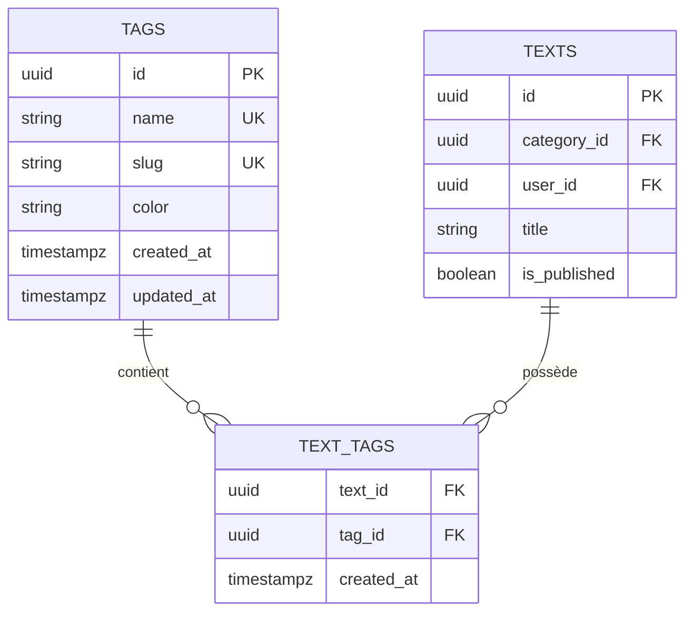
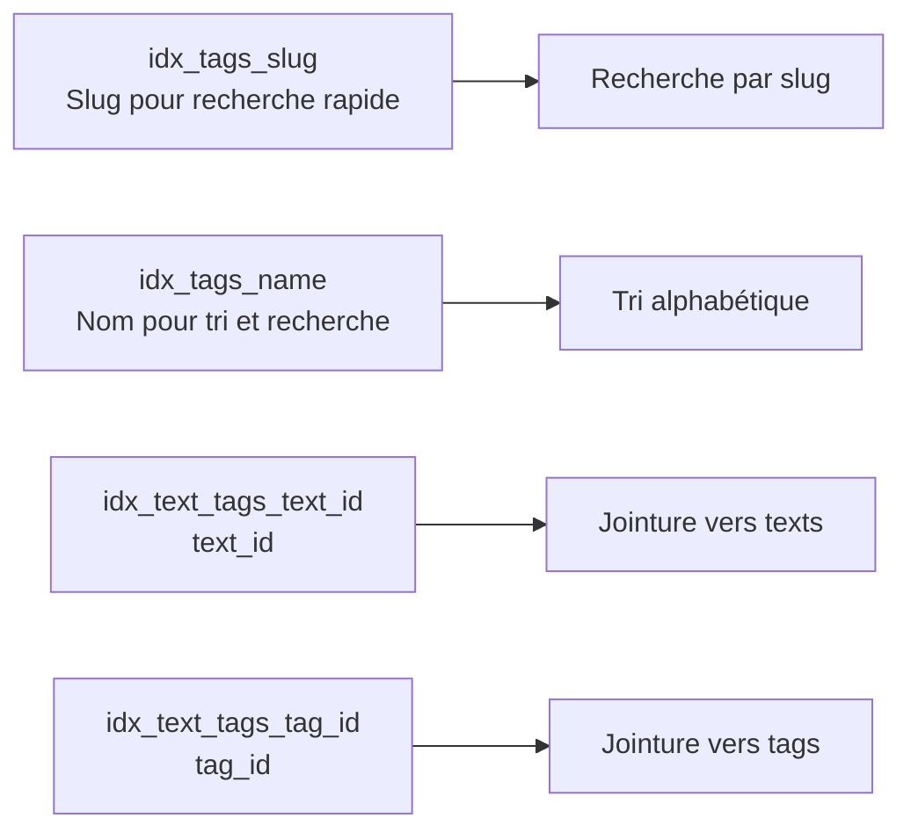
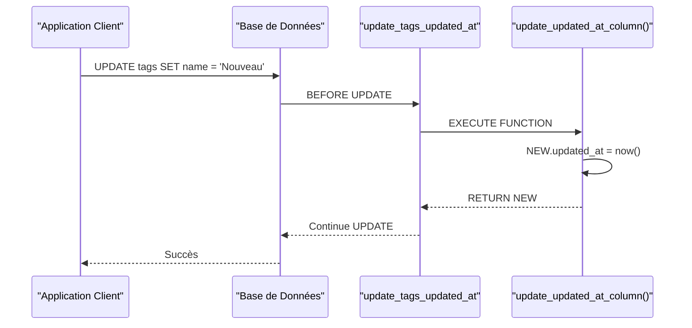
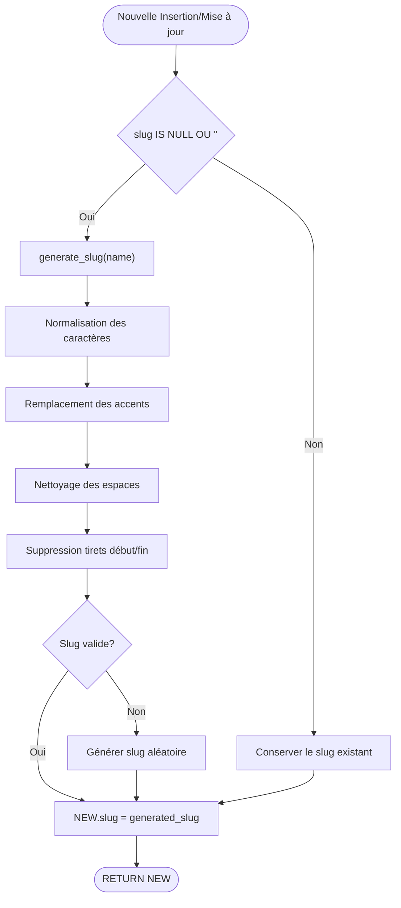
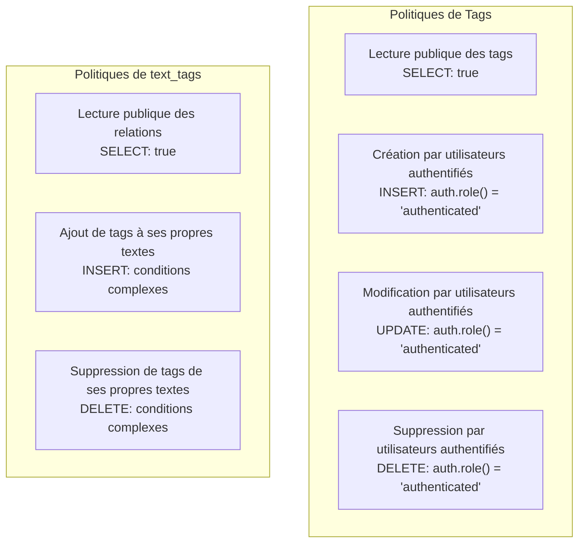
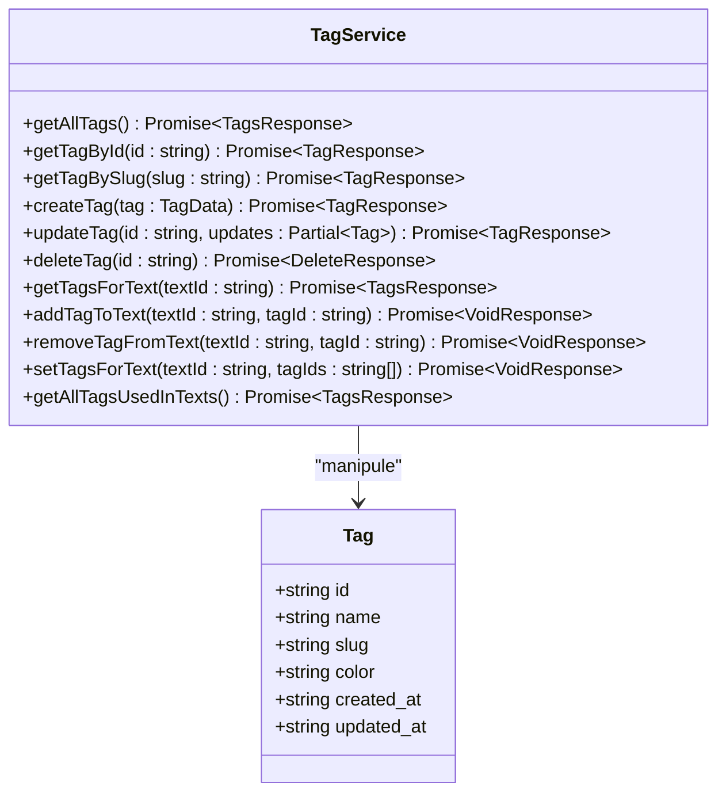
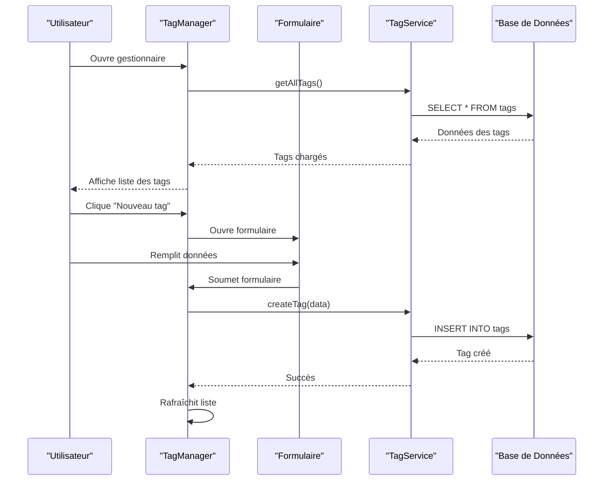

# Table des Tags

<cite>
**Fichiers Référencés dans ce Document**
- [20250107_create_texts_system.sql](file://supabase/migrations/20250107_create_texts_system.sql)
- [20250107_create_texts_system_v2.sql](file://supabase/migrations/20250107_create_texts_system_v2.sql)
- [tagService.ts](file://services/tagService.ts)
- [textService.ts](file://services/textService.ts)
- [TagManager.tsx](file://components/texts/TagManager.tsx)
- [TagBadge.tsx](file://components/texts/TagBadge.tsx)
- [validators.ts](file://lib/validators.ts)
- [supabaseClient.ts](file://lib/supabaseClient.ts)
</cite>

## Table des Matières
1. [Introduction](#introduction)
2. [Structure de la Table](#structure-de-la-table)
3. [Colonnes et Contraintes](#colonnes-et-contraintes)
4. [Index et Performances](#index-et-performances)
5. [Déclencheurs et Fonctions](#déclencheurs-et-fonctions)
6. [Relations avec Autres Tables](#relations-avec-autres-tables)
7. [Politiques RLS](#politiques-rls)
8. [Services et Utilisation](#services-et-utilisation)
9. [Interface Utilisateur](#interface-utilisateur)
10. [Exemples de Requêtes SQL](#exemples-de-requêtes-sql)
11. [Bonnes Pratiques](#bonnes-pratiques)

## Introduction

La table `tags` constitue un élément fondamental du système de gestion des textes, permettant de classifier et organiser le contenu selon des thèmes ou catégories sémantiques. Elle implémente un système de tags personnalisables avec support de couleurs, génération automatique de slugs, et intégration avec la sécurité par niveau de ligne (RLS).

## Structure de la Table

La table `tags` suit une architecture optimisée pour les performances et la maintenabilité, avec des contraintes strictes pour garantir l'intégrité des données.



**Sources du Diagramme**
- [20250107_create_texts_system.sql](file://supabase/migrations/20250107_create_texts_system.sql#L40-L47)
- [20250107_create_texts_system.sql](file://supabase/migrations/20250107_create_texts_system.sql#L98-L104)

## Colonnes et Contraintes

### Structure Détaillée des Colonnes

| Colonne | Type de Données | Contraintes | Valeur par Défaut | Description |
|---------|----------------|-------------|-------------------|-------------|
| `id` | UUID | PRIMARY KEY, NOT NULL | `gen_random_uuid()` | Identifiant unique généré automatiquement |
| `name` | TEXT | NOT NULL, UNIQUE | - | Nom du tag (obligatoire, unique) |
| `slug` | TEXT | NOT NULL, UNIQUE | - | Slug généré automatiquement pour l'URL |
| `color` | TEXT | - | `'#6366f1'` | Couleur hexadécimale pour l'affichage |
| `created_at` | TIMESTAMPTZ | DEFAULT now() | CURRENT_TIMESTAMP | Date de création automatique |
| `updated_at` | TIMESTAMPTZ | DEFAULT now() | CURRENT_TIMESTAMP | Date de dernière modification |

### Contraintes Spéciales

- **UNIQUE(name)** : Empêche les doublons de noms de tags
- **UNIQUE(slug)** : Garantit l'unicité des slugs pour éviter les conflits d'URL
- **CHECK(color)** : Valide le format des couleurs hexadécimales

**Sources de Section**
- [20250107_create_texts_system.sql](file://supabase/migrations/20250107_create_texts_system.sql#L40-L47)
- [validators.ts](file://lib/validators.ts#L27-L32)

## Index et Performances

### Index Créés



**Sources du Diagramme**
- [20250107_create_texts_system.sql](file://supabase/migrations/20250107_create_texts_system.sql#L49-L52)
- [20250107_create_texts_system.sql](file://supabase/migrations/20250107_create_texts_system.sql#L106-L108)

### Stratégie d'Indexation

- **idx_tags_slug** : Optimise les recherches par slug
- **idx_tags_name** : Améliore les tris alphabétiques
- **idx_text_tags_text_id** : Accélère les jointures depuis la table `texts`
- **idx_text_tags_tag_id** : Optimise les requêtes sur les tags

**Sources de Section**
- [20250107_create_texts_system.sql](file://supabase/migrations/20250107_create_texts_system.sql#L49-L52)
- [20250107_create_texts_system.sql](file://supabase/migrations/20250107_create_texts_system.sql#L106-L108)

## Déclencheurs et Fonctions

### Déclencheur update_tags_updated_at

Ce déclencheur automatise la mise à jour du champ `updated_at` lors des modifications.



**Sources du Diagramme**
- [20250107_create_texts_system.sql](file://supabase/migrations/20250107_create_texts_system.sql#L53-L57)
- [20250107_create_texts_system.sql](file://supabase/migrations/20250107_create_texts_system.sql#L24-L30)

### Fonction auto_generate_tag_slug

Cette fonction génère automatiquement un slug à partir du nom du tag lorsque celui-ci est NULL ou vide.



**Sources du Diagramme**
- [20250107_create_texts_system.sql](file://supabase/migrations/20250107_create_texts_system.sql#L265-L278)
- [20250107_create_texts_system.sql](file://supabase/migrations/20250107_create_texts_system.sql#L229-L246)

### Fonction generate_slug

Cette fonction de génération de slug implémente une logique robuste pour créer des URLs conviviaux.

**Caractéristiques principales :**
- Normalisation des caractères accentués
- Conversion en minuscules
- Remplacement des caractères spéciaux par des tirets
- Génération de slugs aléatoires en cas d'échec
- Gestion des cas d'erreur

**Sources de Section**
- [20250107_create_texts_system.sql](file://supabase/migrations/20250107_create_texts_system.sql#L229-L246)
- [20250107_create_texts_system_v2.sql](file://supabase/migrations/20250107_create_texts_system_v2.sql#L22-L54)

## Relations avec Autres Tables

### Relation Many-to-Many avec les Texts

La table `text_tags` établit une relation many-to-many entre les tags et les textes, permettant à un texte d'avoir plusieurs tags et à un tag d'apparaître dans plusieurs textes.

```mermaid
erDiagram
TEXT_TAGS {
uuid text_id FK
uuid tag_id FK
timestampz created_at
PRIMARY_KEY (text_id, tag_id)
}
TEXTS {
uuid id PK
string title
boolean is_published
}
TAGS {
uuid id PK
string name
string slug
string color
}
TEXTS ||--o{ TEXT_TAGS : "contient"
TAGS ||--o{ TEXT_TAGS : "possède"
```

**Sources du Diagramme**
- [20250107_create_texts_system.sql](file://supabase/migrations/20250107_create_texts_system.sql#L98-L104)

### Contraintes d'Intégrité Referentielle

- **ON DELETE CASCADE** : Supprime automatiquement les relations quand un texte ou un tag est supprimé
- **PRIMARY KEY (text_id, tag_id)** : Empêche les doublons de relations

**Sources de Section**
- [20250107_create_texts_system.sql](file://supabase/migrations/20250107_create_texts_system.sql#L98-L104)

## Politiques RLS

### Configuration de Sécurité par Niveau de Ligne

Le système implémente une sécurité fine-grainée avec des politiques RLS appliquées sur toutes les tables concernées.



**Sources du Diagramme**
- [20250107_create_texts_system.sql](file://supabase/migrations/20250107_create_texts_system.sql#L146-L162)
- [20250107_create_texts_system.sql](file://supabase/migrations/20250107_create_texts_system.sql#L197-L222)

### Détails des Politiques

#### Politiques sur la Table tags
- **SELECT** : Accès public pour tous les utilisateurs
- **INSERT** : Restreint aux utilisateurs authentifiés
- **UPDATE** : Restreint aux utilisateurs authentifiés
- **DELETE** : Restreint aux utilisateurs authentifiés

#### Politiques sur la Table text_tags
- **SELECT** : Accès public pour voir les relations
- **INSERT** : Restreint aux propriétaires de textes
- **DELETE** : Restreint aux propriétaires de textes

**Sources de Section**
- [20250107_create_texts_system.sql](file://supabase/migrations/20250107_create_texts_system.sql#L146-L162)
- [20250107_create_texts_system.sql](file://supabase/migrations/20250107_create_texts_system.sql#L197-L222)

## Services et Utilisation

### Service TagService

Le service `tagService` fournit une API TypeScript complète pour interagir avec la table `tags`.



**Sources du Diagramme**
- [tagService.ts](file://services/tagService.ts#L4-L197)
- [supabaseClient.ts](file://lib/supabaseClient.ts#L47-L53)

### Méthodes Principales

#### Opérations CRUD de Base
- **getAllTags()** : Récupération paginée avec cache
- **getTagById()** : Recherche par identifiant unique
- **getTagBySlug()** : Recherche par slug pour les URLs
- **createTag()** : Création avec génération automatique de slug
- **updateTag()** : Mise à jour avec invalidation de cache
- **deleteTag()** : Suppression avec cascade automatique

#### Gestion des Relations
- **getTagsForText()** : Récupération des tags associés à un texte
- **addTagToText()** : Association d'un tag à un texte
- **removeTagFromText()** : Dissociation d'un tag d'un texte
- **setTagsForText()** : Remplacement complet des tags d'un texte

#### Méthodes Avancées
- **getAllTagsUsedInTexts()** : Tags uniques utilisés dans les textes publiés

**Sources de Section**
- [tagService.ts](file://services/tagService.ts#L4-L197)

## Interface Utilisateur

### Composant TagManager

Le composant `TagManager` offre une interface complète de gestion des tags avec fonctionnalités avancées.



**Sources du Diagramme**
- [TagManager.tsx](file://components/texts/TagManager.tsx#L42-L197)

### Composant TagBadge

Le composant `TagBadge` affiche un tag avec sa couleur et options d'action.

**Fonctionnalités :**
- Affichage avec couleur personnalisée
- Support des variantes (default, outline, secondary)
- Actions de suppression avec confirmation
- Style hover interactif

**Sources de Section**
- [TagManager.tsx](file://components/texts/TagManager.tsx#L42-L197)
- [TagBadge.tsx](file://components/texts/TagBadge.tsx#L1-L53)

## Exemples de Requêtes SQL

### Requêtes de Base

#### Insérer un nouveau tag
```sql
INSERT INTO tags (name, color) 
VALUES ('JavaScript', '#f7df1e')
ON CONFLICT (name) DO UPDATE 
SET color = EXCLUDED.color;
```

#### Mettre à jour un tag existant
```sql
UPDATE tags 
SET name = 'TypeScript 5.0', 
    color = '#3178c6' 
WHERE id = 'uuid-du-tag';
```

#### Interroger les tags par slug
```sql
SELECT * FROM tags 
WHERE slug = 'javascript' 
AND id != 'uuid-a-exclure';
```

### Requêtes Avancées

#### Récupérer les tags avec comptage d'utilisation
```sql
SELECT t.*, COUNT(tt.text_id) as usage_count
FROM tags t
LEFT JOIN text_tags tt ON t.id = tt.tag_id
GROUP BY t.id
ORDER BY usage_count DESC, t.name;
```

#### Trouver les tags similaires
```sql
SELECT * FROM tags 
WHERE similarity(name, 'JavaScript') > 0.3
ORDER BY similarity DESC;
```

#### Tags utilisés dans des textes publiés
```sql
SELECT DISTINCT t.*
FROM tags t
JOIN text_tags tt ON t.id = tt.tag_id
JOIN texts tx ON tt.text_id = tx.id
WHERE tx.is_published = true
ORDER BY t.name;
```

### Requêtes de Maintenance

#### Nettoyer les tags orphelins
```sql
DELETE FROM tags 
WHERE id NOT IN (
    SELECT tag_id FROM text_tags
);
```

#### Regénérer les slugs manquants
```sql
UPDATE tags 
SET slug = generate_slug(name)
WHERE slug IS NULL OR slug = '';
```

## Bonnes Pratiques

### Gestion des Couleurs

Les couleurs des tags doivent respecter le format hexadécimal valide (#RRGGBB). Le système propose des couleurs prédéfinies pour assurer la cohérence visuelle.

### Optimisation des Performances

1. **Utiliser les index** : Toujours utiliser les index appropriés pour les recherches par slug et nom
2. **Cache côté client** : Implémenter un cache pour réduire les requêtes répétées
3. **Pagination** : Utiliser la pagination pour les grandes listes de tags
4. **Validation côté serveur** : Valider les données avant insertion/mise à jour

### Sécurité et Intégrité

1. **RLS activé** : Ne jamais désactiver la sécurité par niveau de ligne
2. **Validation des entrées** : Valider tous les champs côté client et serveur
3. **Contrôle d'accès** : Respecter les politiques RLS pour toutes les opérations
4. **Audit des modifications** : Surveiller les changements fréquents de tags

### Migration et Maintenance

1. **Génération automatique de slugs** : Ne pas définir manuellement les slugs
2. **Gestion des conflits** : Utiliser `ON CONFLICT` pour éviter les erreurs d'unicité
3. **Validation des couleurs** : Utiliser les schémas de validation Zod
4. **Tests de régression** : Tester les migrations avant déploiement

**Sources de Section**
- [validators.ts](file://lib/validators.ts#L27-L32)
- [20250107_create_texts_system_v2.sql](file://supabase/migrations/20250107_create_texts_system_v2.sql#L22-L54)