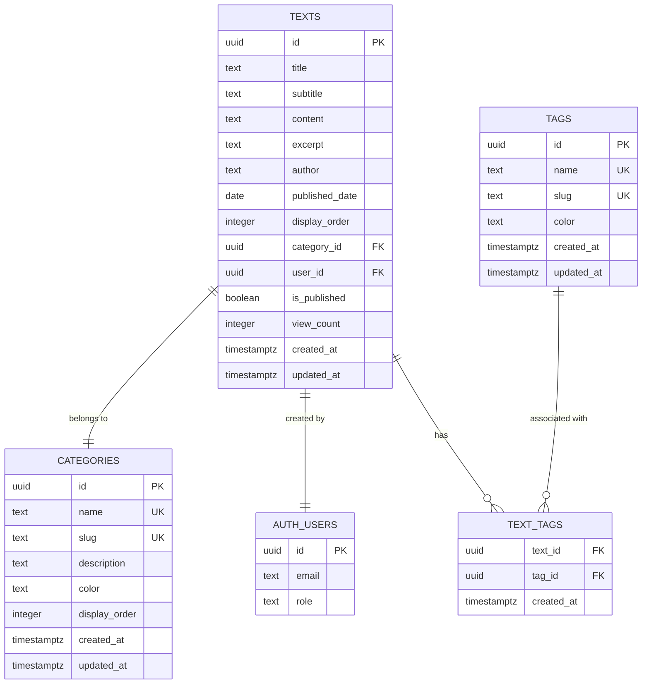
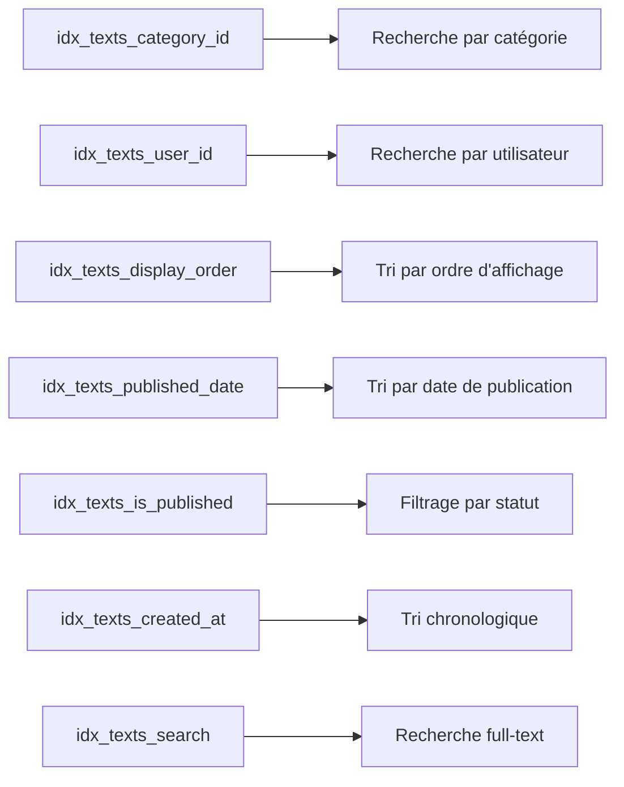
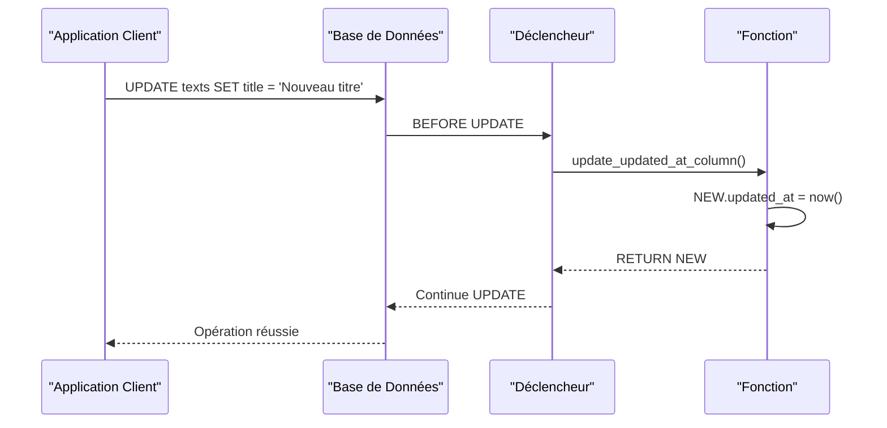
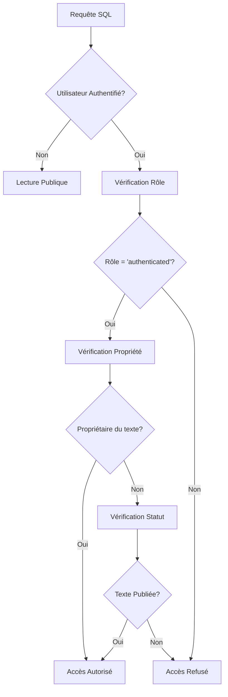
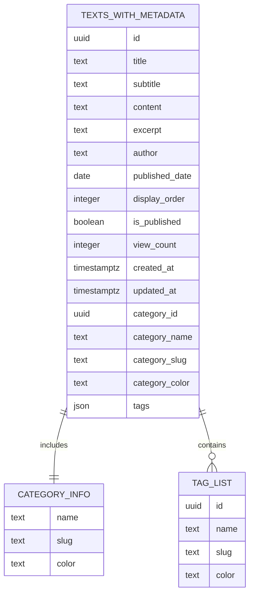
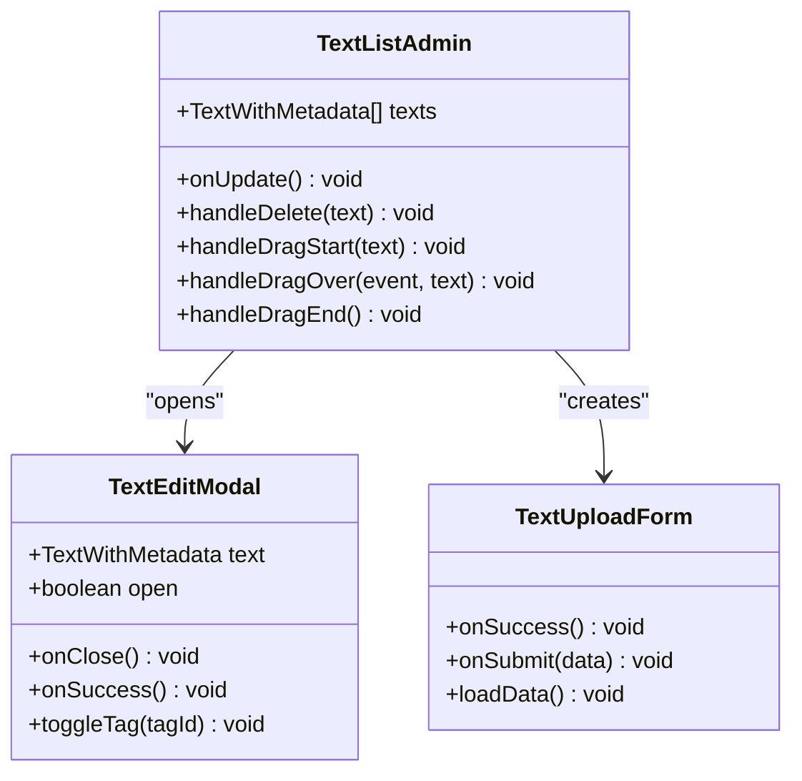
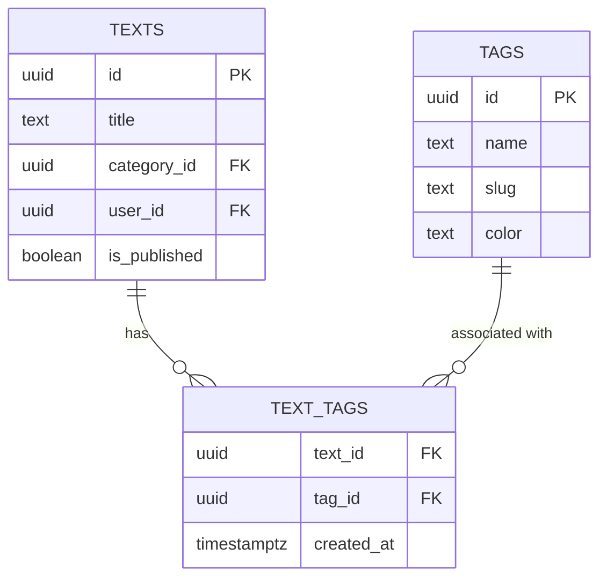

# Table des Textes

<cite>
**Fichiers Référencés dans ce Document**
- [20250107_create_texts_system.sql](file://supabase/migrations/20250107_create_texts_system.sql)
- [20250107_create_texts_system_v2.sql](file://supabase/migrations/20250107_create_texts_system_v2.sql)
- [20251105115814_create_photos_table.sql](file://supabase/migrations/20251105115814_create_photos_table.sql)
- [textService.ts](file://services/textService.ts)
- [supabaseClient.ts](file://lib/supabaseClient.ts)
- [TextListAdmin.tsx](file://components/texts/TextListAdmin.tsx)
- [TextEditModal.tsx](file://components/texts/TextEditModal.tsx)
- [TextUploadForm.tsx](file://components/texts/TextUploadForm.tsx)
- [SETUP_TEXTS.md](file://SETUP_TEXTS.md)
</cite>

## Table des Matières
1. [Introduction](#introduction)
2. [Structure de la Table](#structure-de-la-table)
3. [Colonnes et Contraintes](#colonnes-et-contraintes)
4. [Index et Performances](#index-et-performances)
5. [Déclencheurs et Fonctions](#déclencheurs-et-fonctions)
6. [Politiques RLS](#politiques-rls)
7. [Vue de Métadonnées](#vue-de-métadonnées)
8. [Services TypeScript](#services-typescript)
9. [Exemples de Requêtes SQL](#exemples-de-requêtes-sql)
10. [Intégration avec l'Interface Utilisateur](#intégration-avec-linterface-utilisateur)
11. [Gestion des Tags et Catégories](#gestion-des-tags-et-catégories)
12. [Recherche Full-Text](#recherche-full-text)

## Introduction

La table `texts` constitue le cœur du système de gestion des contenus textuels du portfolio. Elle stocke tous les articles, tutoriels et publications avec support pour la publication conditionnelle, la classification par catégories et tags, ainsi qu'une recherche full-text optimisée en français.

Cette table fait partie d'un système complet incluant des catégories, tags et relations many-to-many, permettant une organisation flexible et une navigation intuitive des contenus.

## Structure de la Table

La table `texts` utilise un schéma relationnel sophistiqué avec plusieurs contraintes et optimisations :



**Sources de diagramme**
- [20250107_create_texts_system.sql](file://supabase/migrations/20250107_create_texts_system.sql#L59-L101)
- [20250107_create_texts_system_v2.sql](file://supabase/migrations/20250107_create_texts_system_v2.sql#L146-L182)

## Colonnes et Contraintes

### Colonnes Principales

| Colonne | Type | Contraintes | Description |
|---------|------|-------------|-------------|
| `id` | UUID | PRIMARY KEY, DEFAULT gen_random_uuid() | Identifiant unique généré automatiquement |
| `title` | TEXT | NOT NULL | Titre principal du texte (obligatoire) |
| `subtitle` | TEXT | NULLABLE | Sous-titre optionnel |
| `content` | TEXT | NOT NULL | Contenu principal au format Markdown (obligatoire) |
| `excerpt` | TEXT | NULLABLE | Résumé ou extrait du contenu |
| `author` | TEXT | NULLABLE | Nom de l'auteur |
| `published_date` | DATE | NULLABLE | Date de publication |

### Colonnes de Gestion

| Colonne | Type | Valeur par Défaut | Description |
|---------|------|-------------------|-------------|
| `display_order` | INTEGER | 0 | Ordre d'affichage personnalisable |
| `category_id` | UUID | NULL | Référence vers la catégorie (peut être NULL) |
| `user_id` | UUID | NULL | Référence vers l'utilisateur créateur (cascade ON DELETE) |
| `is_published` | BOOLEAN | false | Indicateur de publication publique |
| `view_count` | INTEGER | 0 | Compteur de vues automatique |
| `created_at` | TIMESTAMPTZ | now() | Timestamp de création |
| `updated_at` | TIMESTAMPTZ | now() | Timestamp de dernière modification |

### Clés Étrangères

- **`category_id`** : Référence vers `categories(id)` avec `ON DELETE SET NULL`
- **`user_id`** : Référence vers `auth.users(id)` avec `ON DELETE CASCADE`

**Sources de section**
- [20250107_create_texts_system.sql](file://supabase/migrations/20250107_create_texts_system.sql#L61-L76)
- [20250107_create_texts_system_v2.sql](file://supabase/migrations/20250107_create_texts_system_v2.sql#L148-L162)

## Index et Performances

La table `texts` bénéficie de plusieurs index optimisés pour les requêtes courantes :

### Index Clés



**Sources de diagramme**
- [20250107_create_texts_system.sql](file://supabase/migrations/20250107_create_texts_system.sql#L78-L85)
- [20250107_create_texts_system_v2.sql](file://supabase/migrations/20250107_create_texts_system_v2.sql#L165-L172)

### Index Full-Text

L'index GIN spécialisée pour la recherche full-text en français :

```sql
CREATE INDEX IF NOT EXISTS idx_texts_search ON texts USING gin(
  to_tsvector('french', coalesce(title, '') || ' ' || coalesce(content, ''))
);
```

**Caractéristiques de l'index full-text :**
- Langue : français
- Champ combiné : `title` + `content`
- Traitement : `coalesce()` pour gérer les valeurs NULL
- Type d'index : GIN (pour les performances de recherche)

**Sources de section**
- [20250107_create_texts_system.sql](file://supabase/migrations/20250107_create_texts_system.sql#L86-L89)
- [20250107_create_texts_system_v2.sql](file://supabase/migrations/20250107_create_texts_system_v2.sql#L173-L176)

## Déclencheurs et Fonctions

### Déclencheur `update_texts_updated_at`

Un déclencheur automatique maintient la colonne `updated_at` à jour :



**Sources de diagramme**
- [20250107_create_texts_system.sql](file://supabase/migrations/20250107_create_texts_system.sql#L91-L95)
- [20250107_create_texts_system_v2.sql](file://supabase/migrations/20250107_create_texts_system_v2.sql#L178-L182)

### Fonction `update_updated_at_column`

```sql
CREATE OR REPLACE FUNCTION update_updated_at_column()
RETURNS TRIGGER AS $$
BEGIN
  NEW.updated_at = now();
  RETURN NEW;
END;
$$ LANGUAGE plpgsql;
```

**Caractéristiques :**
- Langage : PL/pgSQL
- Déclenchement : BEFORE UPDATE
- Portée : FOR EACH ROW
- Impact : Met à jour automatiquement la colonne `updated_at`

**Sources de section**
- [20250107_create_texts_system.sql](file://supabase/migrations/20250107_create_texts_system.sql#L24-L30)
- [20250107_create_texts_system_v2.sql](file://supabase/migrations/20250107_create_texts_system_v2.sql#L59-L65)

## Politiques RLS

Le système utilise Row Level Security (RLS) pour contrôler l'accès aux données selon le contexte utilisateur et le statut de publication.

### Stratégie d'Accès



**Sources de diagramme**
- [20250107_create_texts_system.sql](file://supabase/migrations/20250107_create_texts_system.sql#L168-L191)
- [20250107_create_texts_system_v2.sql](file://supabase/migrations/20250107_create_texts_system_v2.sql#L219-L225)

### Politiques Détaillées

#### Lecture Publique
- **Textes publiés** : `is_published = true` (accès public)
- **Textes privés** : Seuls les propriétaires peuvent les voir

#### Création/MODIFICATION
- **Toutes les opérations** : Réservées aux utilisateurs authentifiés
- **Contrôle de propriété** : `auth.uid() = user_id`

#### Suppression
- **Restriction stricte** : Seuls les propriétaires peuvent supprimer leurs textes

**Sources de section**
- [20250107_create_texts_system.sql](file://supabase/migrations/20250107_create_texts_system.sql#L168-L191)
- [20250107_create_texts_system_v2.sql](file://supabase/migrations/20250107_create_texts_system_v2.sql#L219-L225)

## Vue de Métadonnées

### `texts_with_metadata`

La vue `texts_with_metadata` enrichit les données brutes avec les informations de catégories et tags associés :



**Sources de diagramme**
- [20250107_create_texts_system.sql](file://supabase/migrations/20250107_create_texts_system.sql#L284-L319)
- [20250107_create_texts_system_v2.sql](file://supabase/migrations/20250107_create_texts_system_v2.sql#L237-L268)

### Structure de la Vue

La vue combine les informations de trois tables principales :

**Champs principaux** :
- Tous les champs de la table `texts`
- Informations de catégorie (nom, slug, couleur)
- Liste JSON des tags associés

**Format des tags** :
```json
[
  {
    "id": "uuid",
    "name": "Nom du tag",
    "slug": "slug-du-tag",
    "color": "#hex"
  }
]
```

**Sources de section**
- [20250107_create_texts_system.sql](file://supabase/migrations/20250107_create_texts_system.sql#L284-L319)
- [20250107_create_texts_system_v2.sql](file://supabase/migrations/20250107_create_texts_system_v2.sql#L237-L268)

## Services TypeScript

### Interface TypeScript

L'interface `Text` définit la structure des données TypeScript :

```typescript
export type Text = {
  id: string;
  title: string;
  subtitle: string | null;
  content: string;
  excerpt: string | null;
  author: string | null;
  published_date: string | null;
  display_order: number;
  category_id: string | null;
  user_id: string | null;
  is_published: boolean;
  view_count: number;
  created_at: string;
  updated_at: string;
};
```

### Services Principaux

#### textService

Le service principal offre les méthodes suivantes :

**CRUD Basique** :
- `getAllTexts()` : Récupère tous les textes (publiés)
- `getTextById(id)` : Récupère un texte spécifique
- `createText(data)` : Crée un nouveau texte
- `updateText(id, updates)` : Met à jour un texte
- `deleteText(id)` : Supprime un texte

**Fonctionnalités Avancées** :
- `getTextsWithMetadata()` : Textes avec catégories et tags
- `getPublishedTexts()` : Seulement les textes publiés
- `getTextsByCategory(categoryId)` : Textes d'une catégorie
- `getTextsByTag(tagId)` : Textes d'un tag
- `searchTexts(query)` : Recherche full-text

**Sources de section**
- [textService.ts](file://services/textService.ts#L1-L385)
- [supabaseClient.ts](file://lib/supabaseClient.ts#L62-L76)

## Exemples de Requêtes SQL

### Insertion de Base

```sql
-- Insertion simple
INSERT INTO texts (title, content, user_id, display_order)
VALUES ('Mon Premier Article', 'Contenu du texte...', 'user-uuid-here', 0);

-- Insertion avec toutes les options
INSERT INTO texts (
  title, subtitle, content, excerpt, author, 
  published_date, category_id, user_id, 
  is_published, display_order
)
VALUES (
  'Article Complet', 'Sous-titre détaillé', 
  '# Titre\nContenu en Markdown', 
  'Résumé court...', 'Auteur Nom', 
  '2025-01-07', 'category-uuid', 'user-uuid', 
  true, 0
);
```

### Mise à Jour

```sql
-- Publication d'un texte
UPDATE texts 
SET is_published = true, published_date = CURRENT_DATE
WHERE id = 'text-uuid';

-- Modification du contenu
UPDATE texts 
SET title = 'Nouveau Titre', content = 'Nouveau contenu...'
WHERE id = 'text-uuid';

-- Incrémentation du compteur de vues
UPDATE texts 
SET view_count = view_count + 1 
WHERE id = 'text-uuid';
```

### Suppression

```sql
-- Suppression d'un texte (cascade automatique sur text_tags)
DELETE FROM texts 
WHERE id = 'text-uuid';

-- Suppression par utilisateur
DELETE FROM texts 
WHERE user_id = 'user-uuid' AND id = 'text-uuid';
```

### Recherche Full-Text

```sql
-- Recherche avec configuration française
SELECT id, title, excerpt, ts_rank(to_tsvector('french', content), 
       plainto_tsquery('french', 'mot-clé')) as rank
FROM texts
WHERE to_tsvector('french', content) @@ plainto_tsquery('french', 'mot-clé')
AND is_published = true
ORDER BY rank DESC;

-- Recherche websearch
SELECT * FROM texts
WHERE to_tsvector('french', title || ' ' || content) @@
  websearch_to_tsquery('french', 'recherche avancée')
AND is_published = true;
```

### Agrégation et Statistiques

```sql
-- Nombre de textes par catégorie
SELECT c.name, COUNT(t.id) as text_count
FROM categories c
LEFT JOIN texts t ON c.id = t.category_id
GROUP BY c.id, c.name
ORDER BY text_count DESC;

-- Popularité des auteurs
SELECT author, COUNT(*) as text_count, SUM(view_count) as total_views
FROM texts
WHERE author IS NOT NULL
GROUP BY author
ORDER BY total_views DESC;

-- Statistiques temporelles
SELECT 
  DATE_TRUNC('month', published_date) as month,
  COUNT(*) as text_count,
  AVG(view_count) as avg_views
FROM texts
WHERE is_published = true
GROUP BY month
ORDER BY month DESC;
```

## Intégration avec l'Interface Utilisateur

### Composants React

#### TextListAdmin

Interface d'administration pour la gestion des textes :



**Sources de diagramme**
- [TextListAdmin.tsx](file://components/texts/TextListAdmin.tsx#L34-L226)
- [TextEditModal.tsx](file://components/texts/TextEditModal.tsx#L38-L382)
- [TextUploadForm.tsx](file://components/texts/TextUploadForm.tsx#L31-L381)

#### Fonctionnalités UI

**Ordre de Tri** :
- Drag & Drop pour réorganiser les textes
- `display_order` automatiquement mis à jour
- Sauvegarde en temps réel

**Gestion des Statuts** :
- Toggle `is_published` pour publication
- Badge "Brouillon" pour les textes non publiés
- Feedback visuel immédiat

**Édition en Ligne** :
- Éditeur Markdown avec aperçu en temps réel
- Validation en temps réel des champs requis
- Gestion des erreurs avec notifications

**Sources de section**
- [TextListAdmin.tsx](file://components/texts/TextListAdmin.tsx#L1-L226)
- [TextEditModal.tsx](file://components/texts/TextEditModal.tsx#L1-L382)

## Gestion des Tags et Catégories

### Relations Many-to-Many

La table `text_tags` gère les relations entre textes et tags :



**Sources de diagramme**
- [20250107_create_texts_system.sql](file://supabase/migrations/20250107_create_texts_system.sql#L98-L104)
- [20250107_create_texts_system_v2.sql](file://supabase/migrations/20250107_create_texts_system_v2.sql#L185-L191)

### Opérations sur les Tags

**Ajout de Tags** :
```sql
-- Ajouter un tag à un texte
INSERT INTO text_tags (text_id, tag_id) 
VALUES ('text-uuid', 'tag-uuid');

-- Ajouter plusieurs tags
INSERT INTO text_tags (text_id, tag_id)
SELECT 'text-uuid', id FROM tags WHERE name IN ('React', 'Next.js', 'TypeScript');
```

**Suppression de Tags** :
```sql
-- Retirer un tag spécifique
DELETE FROM text_tags 
WHERE text_id = 'text-uuid' AND tag_id = 'tag-uuid';

-- Retirer tous les tags d'un texte
DELETE FROM text_tags 
WHERE text_id = 'text-uuid';
```

**Consultation** :
```sql
-- Textes avec leurs tags
SELECT t.title, tg.name as tag_name
FROM texts t
JOIN text_tags tt ON t.id = tt.text_id
JOIN tags tg ON tt.tag_id = tg.id
WHERE t.id = 'text-uuid';

-- Tags d'un texte
SELECT tg.*
FROM tags tg
JOIN text_tags tt ON tg.id = tt.tag_id
WHERE tt.text_id = 'text-uuid';
```

**Sources de section**
- [20250107_create_texts_system.sql](file://supabase/migrations/20250107_create_texts_system.sql#L98-L104)
- [20250107_create_texts_system_v2.sql](file://supabase/migrations/20250107_create_texts_system_v2.sql#L185-L191)

## Recherche Full-Text

### Configuration et Optimisation

L'index full-text utilise PostgreSQL avec la langue française optimisée :

**Avantages de la Configuration** :
- **Langue française** : Analyse morphologique adaptée
- **Combinaison de champs** : Titre + contenu pour une recherche cohérente
- **Gestion des NULL** : `coalesce()` évite les valeurs nulles
- **Type GIN** : Index rapide pour les recherches complexes

### Types de Recherche

**Recherche Exacte** :
```sql
SELECT * FROM texts
WHERE to_tsvector('french', title || ' ' || content) @@
  to_tsquery('french', 'mot-clé');
```

**Recherche Websearch** :
```sql
SELECT * FROM texts
WHERE to_tsvector('french', title || ' ' || content) @@
  websearch_to_tsquery('french', 'recherche avancée');
```

**Recherche Par Phrase** :
```sql
SELECT * FROM texts
WHERE to_tsvector('french', title || ' ' || content) @@
  plainto_tsquery('french', '"phrase exacte"');
```

### Performance et Optimisation

**Indice de Pertinence** :
```sql
SELECT id, title, ts_rank(to_tsvector('french', content), 
       plainto_tsquery('french', 'mot-clé')) as rank
FROM texts
WHERE to_tsvector('french', content) @@ plainto_tsquery('french', 'mot-clé')
ORDER BY rank DESC;
```

**Sources de section**
- [20250107_create_texts_system.sql](file://supabase/migrations/20250107_create_texts_system.sql#L86-L89)
- [20250107_create_texts_system_v2.sql](file://supabase/migrations/20250107_create_texts_system_v2.sql#L173-L176)

## Conclusion

La table `texts` représente un système de gestion de contenu sophistiqué et bien structuré, offrant :

**Fonctionnalités Clés** :
- Gestion complète des textes avec métadonnées
- Publication conditionnelle et contrôle d'accès
- Organisation par catégories et tags
- Recherche full-text optimisée
- Interface utilisateur intuitive

**Optimisations** :
- Index multiples pour les performances
- Déclencheurs automatiques
- Politiques RLS robustes
- Vue de métadonnées enrichie

**Extensibilité** :
- Architecture relationnelle flexible
- Support pour les extensions futures
- Intégration native avec Supabase
- Services TypeScript type-safe

Cette solution constitue une base solide pour la gestion de contenu dynamique et interactive, parfaitement adaptée aux besoins d'un portfolio professionnel moderne.