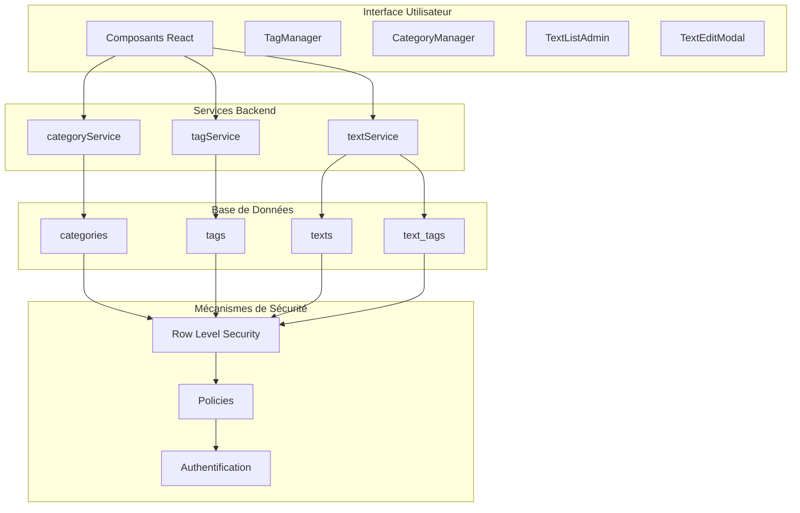
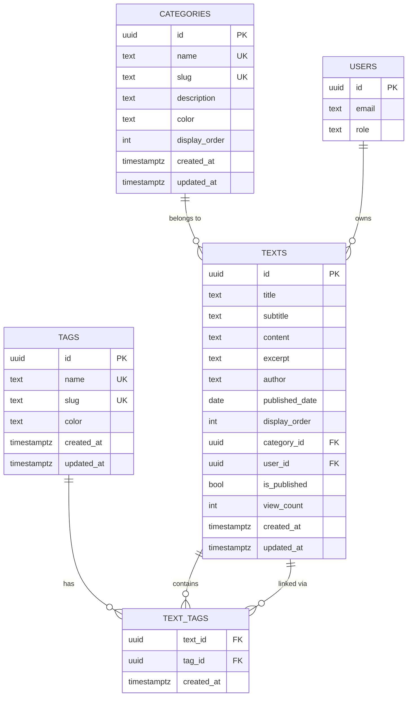

# Tables du Système de Textes

<cite>
**Fichiers Référencés dans ce Document**
- [20250107_create_texts_system.sql](file://supabase/migrations/20250107_create_texts_system.sql)
- [20250107_create_texts_system_v2.sql](file://supabase/migrations/20250107_create_texts_system_v2.sql)
- [textService.ts](file://services/textService.ts)
- [categoryService.ts](file://services/categoryService.ts)
- [tagService.ts](file://services/tagService.ts)
- [TextListAdmin.tsx](file://components/texts/TextListAdmin.tsx)
- [TextEditModal.tsx](file://components/texts/TextEditModal.tsx)
- [CategoryManager.tsx](file://components/texts/CategoryManager.tsx)
- [TagManager.tsx](file://components/texts/TagManager.tsx)
- [supabaseClient.ts](file://lib/supabaseClient.ts)
- [SETUP_TEXTS.md](file://SETUP_TEXTS.md)
</cite>

## Table des Matières
1. [Introduction](#introduction)
2. [Architecture du Système](#architecture-du-système)
3. [Structure des Tables](#structure-des-tables)
4. [Relations entre Tables](#relations-entre-tables)
5. [Fonctions et Triggers](#fonctions-et-triggers)
6. [Services Backend](#services-backend)
7. [Composants Frontend](#composants-frontend)
8. [Exemples de Requêtes SQL](#exemples-de-requêtes-sql)
9. [Politiques de Sécurité](#politiques-de-sécurité)
10. [Optimisations et Index](#optimisations-et-index)

## Introduction

Le système de textes constitue un module central de l'application portfolio, permettant la gestion de contenus structurés avec catégorisation et classification par tags. Ce système repose sur quatre tables principales : `texts`, `categories`, `tags` et `text_tags`, qui implémentent une architecture relationnelle robuste avec des mécanismes de sécurité avancés et des optimisations de performance.

## Architecture du Système

Le système suit une architecture en couches bien définie où les données sont gérées par des services backend TypeScript qui communiquent avec la base de données PostgreSQL via Supabase. L'interface utilisateur est construite avec React et utilise des composants spécialisés pour chaque aspect du système.



**Sources du Diagramme**
- [TextListAdmin.tsx](file://components/texts/TextListAdmin.tsx#L1-L226)
- [TextEditModal.tsx](file://components/texts/TextEditModal.tsx#L1-L382)
- [CategoryManager.tsx](file://components/texts/CategoryManager.tsx#L1-L342)
- [TagManager.tsx](file://components/texts/TagManager.tsx#L1-L339)

## Structure des Tables

### Table `texts` - Articles Principaux

La table `texts` stocke les articles ou contenus principaux avec toutes leurs métadonnées.

| Colonne | Type | Contraintes | Description |
|---------|------|-------------|-------------|
| `id` | UUID | PRIMARY KEY, DEFAULT gen_random_uuid() | Identifiant unique généré automatiquement |
| `title` | TEXT | NOT NULL | Titre principal du texte (obligatoire) |
| `subtitle` | TEXT | NULLABLE | Sous-titre optionnel |
| `content` | TEXT | NOT NULL | Contenu principal au format Markdown |
| `excerpt` | TEXT | NULLABLE | Résumé ou extrait du contenu |
| `author` | TEXT | NULLABLE | Nom de l'auteur |
| `published_date` | DATE | NULLABLE | Date de publication |
| `display_order` | INTEGER | NOT NULL, DEFAULT 0 | Ordre d'affichage numérique |
| `category_id` | UUID | FOREIGN KEY, ON DELETE SET NULL | Référence vers la catégorie |
| `user_id` | UUID | FOREIGN KEY, ON DELETE CASCADE | Référence vers l'utilisateur |
| `is_published` | BOOLEAN | DEFAULT false | Statut de publication |
| `view_count` | INTEGER | DEFAULT 0 | Compteur de vues |
| `created_at` | TIMESTAMPTZ | DEFAULT now() | Timestamp de création |
| `updated_at` | TIMESTAMPTZ | DEFAULT now() | Timestamp de dernière modification |

**Sources de Section**
- [20250107_create_texts_system.sql](file://supabase/migrations/20250107_create_texts_system.sql#L61-L76)
- [supabaseClient.ts](file://lib/supabaseClient.ts#L62-L77)

### Table `categories` - Catégories de Textes

La table `categories` organise les textes en catégories hiérarchiques avec des métadonnées visuelles.

| Colonne | Type | Contraintes | Description |
|---------|------|-------------|-------------|
| `id` | UUID | PRIMARY KEY, DEFAULT gen_random_uuid() | Identifiant unique |
| `name` | TEXT | NOT NULL, UNIQUE | Nom de la catégorie (unicité garantie) |
| `slug` | TEXT | NOT NULL, UNIQUE | Slug URL-friendly généré automatiquement |
| `description` | TEXT | NULLABLE | Description textuelle de la catégorie |
| `color` | TEXT | DEFAULT '#3b82f6' | Couleur hex pour l'interface utilisateur |
| `display_order` | INTEGER | NOT NULL, DEFAULT 0 | Ordre d'affichage numérique |
| `created_at` | TIMESTAMPTZ | DEFAULT now() | Timestamp de création |
| `updated_at` | TIMESTAMPTZ | DEFAULT now() | Timestamp de modification |

**Sources de Section**
- [20250107_create_texts_system.sql](file://supabase/migrations/20250107_create_texts_system.sql#L8-L21)
- [supabaseClient.ts](file://lib/supabaseClient.ts#L42-L51)

### Table `tags` - Tags de Classification

La table `tags` permet la classification fine des textes avec des étiquettes multiples.

| Colonne | Type | Contraintes | Description |
|---------|------|-------------|-------------|
| `id` | UUID | PRIMARY KEY, DEFAULT gen_random_uuid() | Identifiant unique |
| `name` | TEXT | NOT NULL, UNIQUE | Nom du tag (unicité garantie) |
| `slug` | TEXT | NOT NULL, UNIQUE | Slug URL-friendly généré automatiquement |
| `color` | TEXT | DEFAULT '#6366f1' | Couleur hex pour l'interface utilisateur |
| `created_at` | TIMESTAMPTZ | DEFAULT now() | Timestamp de création |
| `updated_at` | TIMESTAMPTZ | DEFAULT now() | Timestamp de modification |

**Sources de Section**
- [20250107_create_texts_system.sql](file://supabase/migrations/20250107_create_texts_system.sql#L39-L47)
- [supabaseClient.ts](file://lib/supabaseClient.ts#L53-L60)

### Table `text_tags` - Relation Many-to-Many

La table `text_tags` implémente la relation many-to-many entre textes et tags.

| Colonne | Type | Contraintes | Description |
|---------|------|-------------|-------------|
| `text_id` | UUID | NOT NULL, FOREIGN KEY | Clé étrangère vers texts |
| `tag_id` | UUID | NOT NULL, FOREIGN KEY | Clé étrangère vers tags |
| `created_at` | TIMESTAMPTZ | DEFAULT now() | Timestamp de création de la relation |

**Sources de Section**
- [20250107_create_texts_system.sql](file://supabase/migrations/20250107_create_texts_system.sql#L99-L104)
- [supabaseClient.ts](file://lib/supabaseClient.ts#L79-L83)

## Relations entre Tables

Le système implémente plusieurs types de relations complexes entre les tables :



**Sources du Diagramme**
- [20250107_create_texts_system.sql](file://supabase/migrations/20250107_create_texts_system.sql#L69-L104)
- [supabaseClient.ts](file://lib/supabaseClient.ts#L42-L83)

### Relations Clés

1. **Unidirectionnelle** : `texts.category_id` → `categories.id` (ON DELETE SET NULL)
2. **Bidirectionnelle** : `texts.user_id` → `auth.users.id` (ON DELETE CASCADE)
3. **Many-to-Many** : `text_tags` ↔ `tags` (ON DELETE CASCADE)
4. **Many-to-Many** : `text_tags` ↔ `texts` (ON DELETE CASCADE)

## Fonctions et Triggers

### Fonction `update_updated_at_column`

Cette fonction générique met à jour automatiquement le champ `updated_at` lors des modifications.

```sql
CREATE OR REPLACE FUNCTION update_updated_at_column()
RETURNS TRIGGER AS $$
BEGIN
  NEW.updated_at = now();
  RETURN NEW;
END;
$$ LANGUAGE plpgsql;
```

**Triggers associés :**
- `update_categories_updated_at` : Sur la table `categories`
- `update_tags_updated_at` : Sur la table `tags`
- `update_texts_updated_at` : Sur la table `texts`

### Fonction `generate_slug`

Cette fonction génère automatiquement des slugs URL-friendly à partir des noms.

```sql
CREATE OR REPLACE FUNCTION generate_slug(input_name TEXT)
RETURNS TEXT AS $$
DECLARE
  slug TEXT;
BEGIN
  -- Logique de génération optimisée avec gestion des cas limites
  -- ...
  RETURN slug;
END;
$$ LANGUAGE plpgsql IMMUTABLE;
```

### Fonctions de Génération Automatique

- `auto_generate_category_slug()` : Pour les catégories
- `auto_generate_tag_slug()` : Pour les tags

**Sources de Section**
- [20250107_create_texts_system.sql](file://supabase/migrations/20250107_create_texts_system.sql#L24-L262)
- [20250107_create_texts_system_v2.sql](file://supabase/migrations/20250107_create_texts_system_v2.sql#L59-L144)

## Services Backend

### Service `textService`

Le service `textService` gère toutes les opérations CRUD sur les textes avec métadonnées.

**Méthodes principales :**
- `getAllTexts()` : Récupération de tous les textes
- `getTextById(id)` : Récupération par identifiant
- `createText(data)` : Création avec validation
- `updateText(id, updates)` : Mise à jour
- `deleteText(id)` : Suppression
- `getTextsWithMetadata()` : Textes avec catégories et tags
- `getPublishedTexts()` : Textes publiés uniquement
- `searchTexts(query)` : Recherche full-text

**Sources de Section**
- [textService.ts](file://services/textService.ts#L1-L385)

### Service `categoryService`

Gestion des catégories avec ordonnancement et cache.

**Méthodes principales :**
- `getAllCategories()` : Liste toutes les catégories
- `createCategory(data)` : Création avec validation
- `updateCategory(id, updates)` : Mise à jour
- `deleteCategory(id)` : Suppression
- `getMaxDisplayOrder()` : Ordre maximum

**Sources de Section**
- [categoryService.ts](file://services/categoryService.ts#L1-L115)

### Service `tagService`

Gestion des tags avec relations textes.

**Méthodes principales :**
- `getAllTags()` : Liste tous les tags
- `createTag(data)` : Création
- `updateTag(id, updates)` : Mise à jour
- `deleteTag(id)` : Suppression
- `setTagsForText(textId, tagIds)` : Attribution de tags
- `getAllTagsUsedInTexts()` : Tags utilisés dans les textes publiés

**Sources de Section**
- [tagService.ts](file://services/tagService.ts#L1-L197)

## Composants Frontend

### TextListAdmin

Interface d'administration pour la gestion des textes avec fonctionnalités de tri et édition.

**Fonctionnalités :**
- Affichage en grille responsive
- Tri par glisser-déposer
- Édition rapide
- Suppression avec confirmation
- Métadonnées visibles (auteur, date, catégorie, tags)

**Sources de Section**
- [TextListAdmin.tsx](file://components/texts/TextListAdmin.tsx#L1-L226)

### TextEditModal

Modal d'édition avancée avec éditeur Markdown intégré.

**Caractéristiques :**
- Éditeur Markdown avec aperçu en temps réel
- Gestion des tags multiples
- Sélection de catégorie
- Publication/brouillon
- Validation en temps réel

**Sources de Section**
- [TextEditModal.tsx](file://components/texts/TextEditModal.tsx#L1-L382)

### CategoryManager

Interface de gestion des catégories avec ordonnancement.

**Fonctionnalités :**
- Création/modification de catégories
- Sélection de couleur
- Ordre d'affichage configurable
- Validation des données

**Sources de Section**
- [CategoryManager.tsx](file://components/texts/CategoryManager.tsx#L1-L342)

### TagManager

Interface de gestion des tags avec préréglages de couleurs.

**Caractéristiques :**
- Création/modification de tags
- Sélecteur de couleur
- Préréglages de couleurs populaires
- Gestion des tags utilisés

**Sources de Section**
- [TagManager.tsx](file://components/texts/TagManager.tsx#L1-L339)

## Exemples de Requêtes SQL

### Insertion de Base

```sql
-- Insérer une nouvelle catégorie
INSERT INTO categories (name, description, color, display_order)
VALUES ('Développement', 'Articles sur le développement', '#3b82f6', 0);

-- Insérer un nouveau tag
INSERT INTO tags (name, color)
VALUES ('JavaScript', '#f7df1e');

-- Insérer un nouveau texte
INSERT INTO texts (title, content, user_id, is_published)
VALUES ('Mon premier article', '# Contenu Markdown', 'user-id-here', true);

-- Relier un texte à un tag
INSERT INTO text_tags (text_id, tag_id)
VALUES ('text-id-here', 'tag-id-here');
```

### Mise à Jour Avancée

```sql
-- Mettre à jour un texte avec nouvelles métadonnées
UPDATE texts
SET title = 'Nouveau titre',
    subtitle = 'Nouveau sous-titre',
    category_id = 'new-category-id',
    is_published = true,
    updated_at = now()
WHERE id = 'text-id-here';

-- Modifier un tag
UPDATE tags
SET name = 'Nouveau nom',
    color = '#ffffff'
WHERE id = 'tag-id-here';
```

### Requêtes de Consultation

```sql
-- Textes avec métadonnées complètes
SELECT 
    t.id,
    t.title,
    t.content,
    c.name as category_name,
    c.color as category_color,
    json_agg(
        json_build_object(
            'id', tg.id,
            'name', tg.name,
            'color', tg.color
        )
    ) as tags
FROM texts t
LEFT JOIN categories c ON t.category_id = c.id
LEFT JOIN text_tags tt ON t.id = tt.text_id
LEFT JOIN tags tg ON tt.tag_id = tg.id
WHERE t.is_published = true
GROUP BY t.id, c.id;

-- Recherche full-text
SELECT *
FROM texts
WHERE to_tsvector('french', title || ' ' || content) @@ to_tsquery('french', 'mot-clé');

-- Textes par catégorie
SELECT t.*
FROM texts t
JOIN categories c ON t.category_id = c.id
WHERE c.slug = 'developpement'
AND t.is_published = true
ORDER BY t.display_order;
```

### Jointures Complexes

```sql
-- Textes avec filtres avancés
SELECT 
    t.id,
    t.title,
    t.excerpt,
    c.name as category_name,
    array_agg(tg.name) as tag_names
FROM texts t
LEFT JOIN categories c ON t.category_id = c.id
LEFT JOIN text_tags tt ON t.id = tt.text_id
LEFT JOIN tags tg ON tt.tag_id = tg.id
WHERE t.is_published = true
AND (c.slug = 'developpement' OR tg.slug = 'javascript')
GROUP BY t.id, c.id
ORDER BY t.created_at DESC;
```

## Politiques de Sécurité

### Row Level Security (RLS)

Toutes les tables ont RLS activé avec des politiques granulaires :

#### Politiques pour `categories` et `tags`
- **Lecture publique** : Tous les utilisateurs peuvent lire
- **Création** : Utilisateurs authentifiés uniquement
- **Modification** : Utilisateurs authentifiés uniquement
- **Suppression** : Utilisateurs authentifiés uniquement

#### Politiques pour `texts`
- **Lecture publique** : Seuls les textes publiés (`is_published = true`)
- **Lecture privée** : Propriétaires des textes non publiés
- **Création** : Utilisateurs authentifiés avec validation user_id
- **Modification** : Propriétaires uniquement
- **Suppression** : Propriétaires uniquement

#### Politiques pour `text_tags`
- **Lecture publique** : Tous les utilisateurs
- **Création** : Utilisateurs authentifiés avec validation de propriété
- **Suppression** : Propriétaires uniquement

**Sources de Section**
- [20250107_create_texts_system.sql](file://supabase/migrations/20250107_create_texts_system.sql#L111-L223)

## Optimisations et Index

### Index Clés

Chaque table bénéficie d'index stratégiques pour optimiser les performances :

#### Index sur `texts`
- `idx_texts_category_id` : Pour les requêtes par catégorie
- `idx_texts_user_id` : Pour les requêtes par utilisateur
- `idx_texts_display_order` : Pour l'ordonnancement
- `idx_texts_published_date` : Pour les archives
- `idx_texts_is_published` : Pour les filtres de publication
- `idx_texts_created_at` : Pour les chronologies
- `idx_texts_search` : Full-text search optimisé

#### Index sur `categories` et `tags`
- `idx_categories_slug` : Recherche par slug
- `idx_categories_display_order` : Ordonnancement
- `idx_tags_slug` : Recherche par slug
- `idx_tags_name` : Recherche par nom

#### Index sur `text_tags`
- `idx_text_tags_text_id` : Jointures efficaces
- `idx_text_tags_tag_id` : Requêtes par tag

### Vue Optimisée

```sql
CREATE OR REPLACE VIEW texts_with_metadata AS
SELECT
    t.id,
    t.title,
    t.subtitle,
    t.content,
    t.excerpt,
    t.author,
    t.published_date,
    t.display_order,
    t.is_published,
    t.view_count,
    t.user_id,
    t.created_at,
    t.updated_at,
    c.id AS category_id,
    c.name AS category_name,
    c.slug AS category_slug,
    c.color AS category_color,
    COALESCE(
        json_agg(
            json_build_object(
                'id', tg.id,
                'name', tg.name,
                'slug', tg.slug,
                'color', tg.color
            )
        ) FILTER (WHERE tg.id IS NOT NULL),
        '[]'
    ) AS tags
FROM texts t
LEFT JOIN categories c ON t.category_id = c.id
LEFT JOIN text_tags tt ON t.id = tt.text_id
LEFT JOIN tags tg ON tt.tag_id = tg.id
GROUP BY t.id, c.id, c.name, c.slug, c.color;
```

**Sources de Section**
- [20250107_create_texts_system.sql](file://supabase/migrations/20250107_create_texts_system.sql#L78-L109)
- [20250107_create_texts_system.sql](file://supabase/migrations/20250107_create_texts_system.sql#L284-L319)

## Conclusion

Le système de textes représente une architecture robuste et scalable pour la gestion de contenu structuré. Il combine efficacement les capacités de base de données relationnelle avec les fonctionnalités modernes de recherche, sécurité et interface utilisateur. Les mécanismes de cache, les triggers automatisés et les politiques de sécurité assurent une performance optimale tout en maintenant la sécurité des données.

L'utilisation de Supabase comme plateforme backend simplifie grandement le déploiement et la maintenance, tandis que l'architecture en couches permet une évolutivité facile pour les futurs développements.