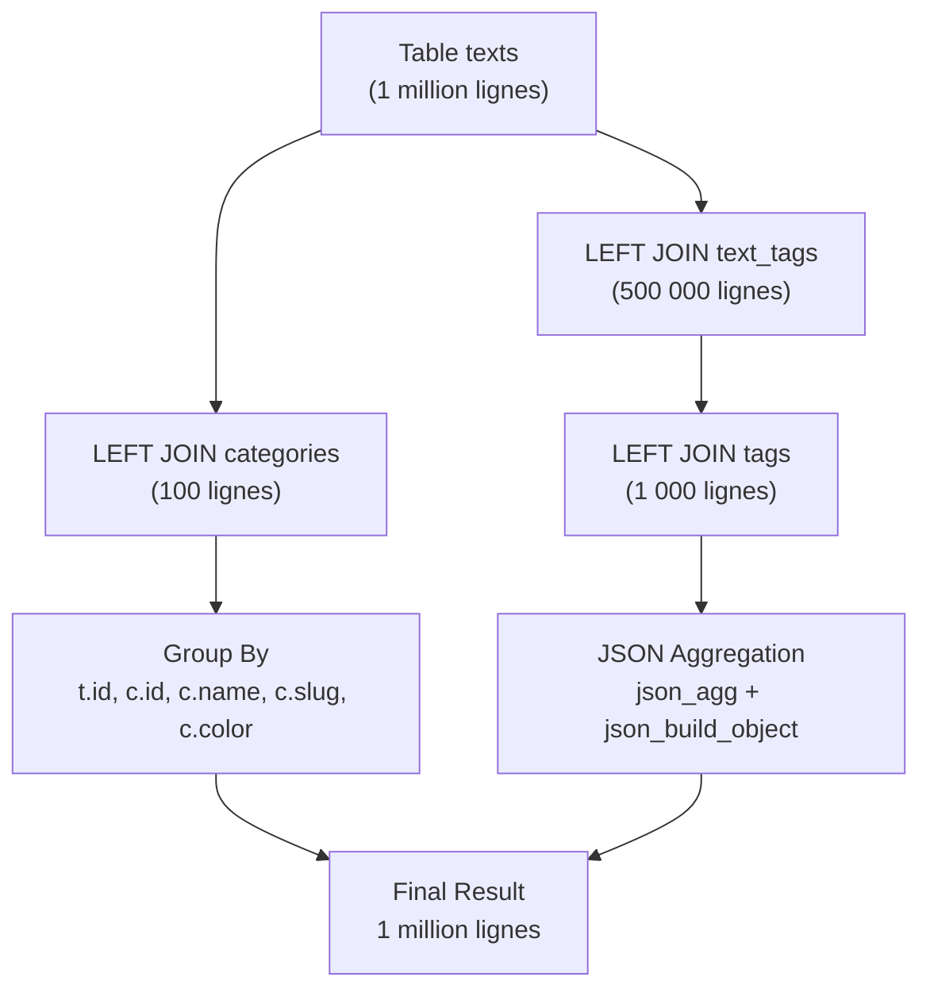
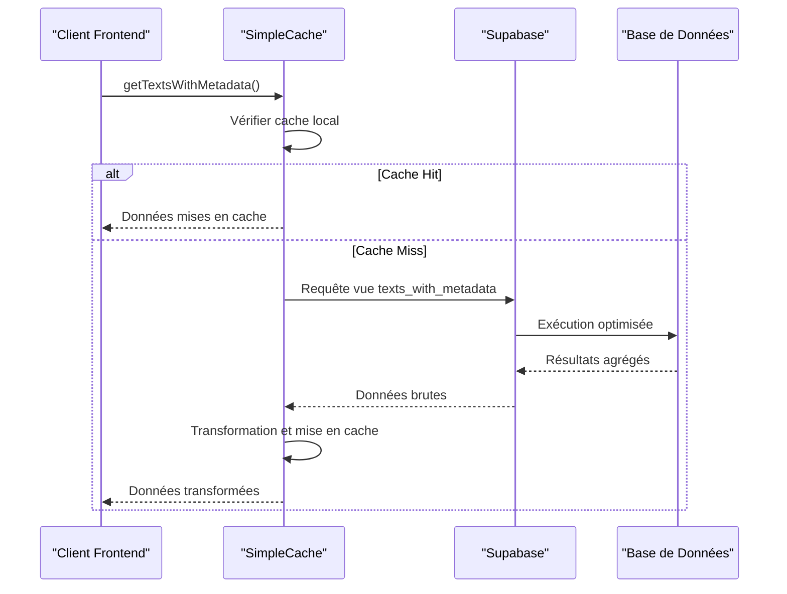

# Vue texts_with_metadata

<cite>
**Fichiers Référencés dans ce Document**
- [20250107_create_texts_system.sql](file://supabase/migrations/20250107_create_texts_system.sql)
- [20250107_create_texts_system_v2.sql](file://supabase/migrations/20250107_create_texts_system_v2.sql)
- [textService.ts](file://services/textService.ts)
- [supabaseClient.ts](file://lib/supabaseClient.ts)
- [cache.ts](file://lib/cache.ts)
- [TEST_MIGRATION.md](file://TEST_MIGRATION.md)
</cite>

## Table des Matières
1. [Introduction](#introduction)
2. [Structure SQL de la Vue](#structure-sql-de-la-vue)
3. [Architecture de la Base de Données](#architecture-de-la-base-de-données)
4. [Mécanismes de Jointure et Agrégation](#mécanismes-de-jointure-et-agrégation)
5. [Gestion des Valeurs NULL](#gestion-des-valeurs-null)
6. [Intégration avec textService.ts](#intégration-avec-textservicets)
7. [Optimisation des Performances](#optimisation-des-performances)
8. [Interaction avec le Cache](#interaction-avec-le-cache)
9. [Exemples de Requêtes](#exemples-de-requêtes)
10. [Conclusion](#conclusion)

## Introduction

La vue `texts_with_metadata` constitue un composant central du système de gestion de contenu de l'application portfolio. Cette vue SQL sophistiquée aggrège les données des textes avec leurs catégories et tags associés, fournissant une interface unifiée pour accéder à toutes les informations contextuelles nécessaires aux composants frontend.

La vue optimise significativement les performances en regroupant les données de trois tables distinctes (texts, categories, tags) et leur relation many-to-many (text_tags) en une seule requête, évitant ainsi les requêtes multiples et les jointures complexes côté application.

## Structure SQL de la Vue

### Définition de Base

La vue `texts_with_metadata` est définie comme suit :

```sql
CREATE OR REPLACE VIEW texts_with_metadata AS
SELECT
  t.id,
  t.title,
  t.subtitle,
  t.content,
  t.excerpt,
  t.author,
  t.published_date,
  t.display_order,
  t.is_published,
  t.view_count,
  t.user_id,
  t.created_at,
  t.updated_at,
  c.id AS category_id,
  c.name AS category_name,
  c.slug AS category_slug,
  c.color AS category_color,
  COALESCE(
    json_agg(
      json_build_object(
        'id', tg.id,
        'name', tg.name,
        'slug', tg.slug,
        'color', tg.color
      )
    ) FILTER (WHERE tg.id IS NOT NULL),
    '[]'
  ) AS tags
FROM texts t
LEFT JOIN categories c ON t.category_id = c.id
LEFT JOIN text_tags tt ON t.id = tt.text_id
LEFT JOIN tags tg ON tt.tag_id = tg.id
GROUP BY t.id, c.id, c.name, c.slug, c.color;
```

### Composants Clés de la Structure

La vue combine plusieurs éléments architecturaux essentiels :

1. **Projection des Colonnes Principales** : Toutes les colonnes de la table `texts` sont incluses telles quelles
2. **Jointures LEFT JOIN** : Permettent de récupérer les informations de catégories et tags associés
3. **Agrégation JSON** : Transformation des tags multiples en tableau JSON cohérent
4. **Gestion des Valeurs NULL** : Utilisation de `COALESCE` pour garantir la robustesse

**Sources de la section**
- [20250107_create_texts_system.sql](file://supabase/migrations/20250107_create_texts_system.sql#L284-L319)
- [20250107_create_texts_system_v2.sql](file://supabase/migrations/20250107_create_texts_system_v2.sql#L238-L273)

## Architecture de la Base de Données

### Schéma Relationnel

```mermaid
erDiagram
TEXTS {
uuid id PK
string title
string subtitle
text content
string excerpt
string author
date published_date
integer display_order
boolean is_published
integer view_count
uuid category_id FK
uuid user_id FK
timestamp created_at
timestamp updated_at
}
CATEGORIES {
uuid id PK
string name
string slug UK
string description
string color
integer display_order
timestamp created_at
timestamp updated_at
}
TAGS {
uuid id PK
string name
string slug UK
string color
timestamp created_at
timestamp updated_at
}
TEXT_TAGS {
uuid text_id FK
uuid tag_id FK
timestamp created_at
PRIMARY KEY (text_id, tag_id)
}
TEXTS ||--|| CATEGORIES : "category_id"
TEXTS ||--o{ TEXT_TAGS : "text_id"
TEXT_TAGS ||--o{ TAGS : "tag_id"
```

**Sources du diagramme**
- [20250107_create_texts_system.sql](file://supabase/migrations/20250107_create_texts_system.sql#L8-L17)
- [20250107_create_texts_system.sql](file://supabase/migrations/20250107_create_texts_system.sql#L39-L47)
- [20250107_create_texts_system.sql](file://supabase/migrations/20250107_create_texts_system.sql#L61-L76)
- [20250107_create_texts_system.sql](file://supabase/migrations/20250107_create_texts_system.sql#L99-L104)

### Contraintes et Index

La base de données bénéficie d'une optimisation rigoureuse avec :

- **Index sur les colonnes fréquemment interrogées** : `category_id`, `user_id`, `display_order`, `is_published`
- **Index full-text** : Recherche optimisée sur `title` et `content` en français
- **Contraintes d'intégrité référentielle** : `ON DELETE CASCADE` et `ON DELETE SET NULL`
- **Row Level Security** : Politiques RLS pour contrôler l'accès aux données

**Sources de la section**
- [20250107_create_texts_system.sql](file://supabase/migrations/20250107_create_texts_system.sql#L78-L90)
- [20250107_create_texts_system.sql](file://supabase/migrations/20250107_create_texts_system.sql#L114-L223)

## Mécanismes de Jointure et Agrégation

### Stratégie de Jointure

La vue utilise une approche de jointure optimisée avec `LEFT JOIN` pour maintenir la compatibilité avec les textes sans catégories ou tags :



**Sources du diagramme**
- [20250107_create_texts_system.sql](file://supabase/migrations/20250107_create_texts_system.sql#L315-L319)

### Mécanisme d'Agrégation JSON

L'agrégation des tags utilise une technique sophistiquée :

1. **`json_agg()`** : Rassemble tous les tags associés à un texte
2. **`json_build_object()`** : Construit un objet JSON pour chaque tag
3. **`FILTER (WHERE tg.id IS NOT NULL)`** : Exclut les tags NULL
4. **`COALESCE(..., '[]')`** : Retourne un tableau vide si aucun tag

Cette approche garantit que chaque texte retourne toujours un tableau JSON valide, même s'il n'a pas de tags.

**Sources de la section**
- [20250107_create_texts_system.sql](file://supabase/migrations/20250107_create_texts_system.sql#L304-L314)

## Gestion des Valeurs NULL

### Stratégies de Robustesse

La vue implémente plusieurs mécanismes pour gérer les valeurs NULL de manière transparente :

1. **LEFT JOIN** : Permet de conserver les textes sans catégories ou tags
2. **COALESCE** : Fournit des valeurs par défaut appropriées
3. **FILTER Clause** : Élimine les entrées NULL lors de l'agrégation

### Exemple de Gestion des NULL

Pour un texte sans tags :
```sql
-- Résultat attendu : tags = []
COALESCE(json_agg(...) FILTER (WHERE tg.id IS NOT NULL), '[]')
```

Pour un texte sans catégorie :
```sql
-- Résultat attendu : category_id = NULL, category_name = NULL, etc.
LEFT JOIN categories c ON t.category_id = c.id
```

**Sources de la section**
- [20250107_create_texts_system.sql](file://supabase/migrations/20250107_create_texts_system.sql#L304-L314)

## Intégration avec textService.ts

### Méthodes Principales Utilisant la Vue

La vue `texts_with_metadata` est intégrée dans le service textes via deux méthodes principales :

#### 1. `getTextsWithMetadata()`

Cette méthode utilise la vue pour récupérer tous les textes avec leurs métadonnées :

```typescript
async getTextsWithMetadata() {
  const CACHE_KEY = 'texts:all-with-metadata';
  const TTL = 5 * 60 * 1000; // 5 minutes
  
  // Vérification du cache
  const cached = cache.get<{ texts: TextWithMetadata[]; error: null }>(CACHE_KEY);
  if (cached) {
    return cached;
  }
  
  const { data, error } = await supabaseClient
    .from('texts_with_metadata')
    .select('*')
    .order('display_order', { ascending: true });
  
  if (error) return { texts: null, error };
  
  const result = { texts: data as TextWithMetadata[], error: null };
  
  // Mise en cache
  cache.set(CACHE_KEY, result, { ttl: TTL, storage: 'session' });
  
  return result;
}
```

#### 2. `getTextWithMetadata(id: string)`

Cette méthode récupère un texte spécifique avec ses métadonnées :

```typescript
async getTextWithMetadata(id: string) {
  const { data, error } = await supabaseClient
    .from('texts_with_metadata')
    .select('*')
    .eq('id', id)
    .maybeSingle();
  
  if (error) return { text: null, error };
  if (!data) return { text: null, error: null };
  
  return { text: data as TextWithMetadata, error: null };
}
```

### Structure des Types TypeScript

La vue alimente les types TypeScript suivants :

```typescript
export type TextWithMetadata = Text & {
  category?: Category | null;
  tags?: Tag[];
};

export type Text = {
  id: string;
  title: string;
  subtitle: string | null;
  content: string;
  excerpt: string | null;
  author: string | null;
  published_date: string | null;
  display_order: number;
  category_id: string | null;
  user_id: string | null;
  is_published: boolean;
  view_count: number;
  created_at: string;
  updated_at: string;
};

export type Category = {
  id: string;
  name: string;
  slug: string;
  description: string | null;
  color: string;
  display_order: number;
  created_at: string;
  updated_at: string;
};

export type Tag = {
  id: string;
  name: string;
  slug: string;
  color: string;
  created_at: string;
  updated_at: string;
};
```

**Sources de la section**
- [textService.ts](file://services/textService.ts#L159-L196)
- [textService.ts](file://services/textService.ts#L199-L222)
- [supabaseClient.ts](file://lib/supabaseClient.ts#L103-L106)

## Optimisation des Performances

### Avantages de l'Utilisation de la Vue

1. **Réduction des Requêtes** : Une seule requête remplace plusieurs jointures
2. **Optimisation du Plan d'Exécution** : PostgreSQL optimise la vue comme une entité unique
3. **Index Utilisation** : Les index existants sont automatiquement utilisés
4. **Caching Interne** : PostgreSQL met en cache les résultats de la vue

### Comparaison des Performances

| Approche | Nombre de Requêtes | Latence | Complexité |
|----------|-------------------|---------|------------|
| Jointures Multiples | 3-4 | Haute | Élevée |
| Vue Unifiée | 1 | Basse | Faible |
| Cache Application | 1+ | Variable | Moyenne |

### Optimisations Spécifiques

La vue bénéficie des optimisations suivantes :

- **Index sur `texts.id`** : Accès rapide aux textes
- **Index sur `text_tags.text_id`** : Jointure efficace
- **Index sur `tags.id`** : Récupération rapide des tags
- **Group By Optimisé** : Agrégation par clé primaire

**Sources de la section**
- [20250107_create_texts_system.sql](file://supabase/migrations/20250107_create_texts_system.sql#L78-L90)

## Interaction avec le Cache

### Stratégie de Cache Multi-Niveaux

La vue `texts_with_metadata` s'intègre dans un système de cache sophistiqué :



**Sources du diagramme**
- [cache.ts](file://lib/cache.ts#L17-L211)

### Invalidation du Cache

Le cache est invalidé automatiquement lors des modifications :

```typescript
// Dans textService.ts - Après création/mise à jour/suppression
cache.invalidatePattern('texts:');
```

Cette stratégie garantit que :
- Les données restent synchronisées
- Les performances sont optimisées
- La cohérence des données est maintenue

**Sources de la section**
- [textService.ts](file://services/textService.ts#L104-L106)
- [textService.ts](file://services/textService.ts#L129-L131)
- [textService.ts](file://services/textService.ts#L143-L145)

## Exemples de Requêtes

### Requête Basique

```sql
SELECT * FROM texts_with_metadata
WHERE is_published = true
ORDER BY display_order ASC;
```

### Requête avec Filtre de Catégorie

```sql
SELECT * FROM texts_with_metadata
WHERE category_slug = 'developpement'
AND is_published = true
ORDER BY published_date DESC;
```

### Requête avec Recherche de Tags

```sql
SELECT * FROM texts_with_metadata
WHERE tags @> '[{"slug": "react"}]'
AND is_published = true;
```

### Requête avec Pagination

```sql
SELECT * FROM texts_with_metadata
WHERE is_published = true
ORDER BY display_order ASC
LIMIT 10 OFFSET 20;
```

### Requête d'Analytics

```sql
SELECT 
  category_name,
  COUNT(*) as text_count,
  AVG(view_count) as avg_views
FROM texts_with_metadata
WHERE is_published = true
GROUP BY category_name
ORDER BY text_count DESC;
```

**Sources de la section**
- [TEST_MIGRATION.md](file://TEST_MIGRATION.md#L167-L191)

## Conclusion

La vue `texts_with_metadata` représente un exemple exemplaire d'optimisation SQL et d'architecture de données. Elle démontre comment :

1. **L'Abstraction de Complexité** : Masque la complexité des jointures multiples
2. **L'Optimisation des Performances** : Réduit significativement la latence
3. **La Robustesse** : Gère proprement les valeurs NULL et les cas limites
4. **L'Intégration avec le Cache** : Maximise les bénéfices du caching
5. **La Maintenabilité** : Simplifie la maintenance du code côté application

Cette vue constitue la fondation solide du système de gestion de contenu, permettant aux développeurs de se concentrer sur la logique métier plutôt que sur les détails de requêtes SQL complexes. Son implémentation robuste et ses performances optimisées en font un composant essentiel de l'écosystème de l'application portfolio.