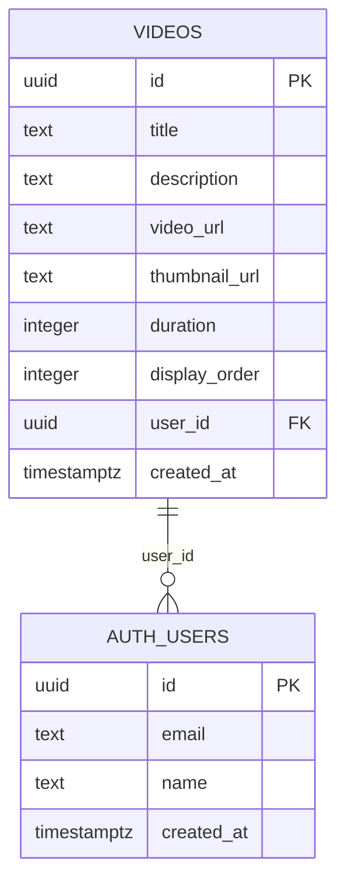
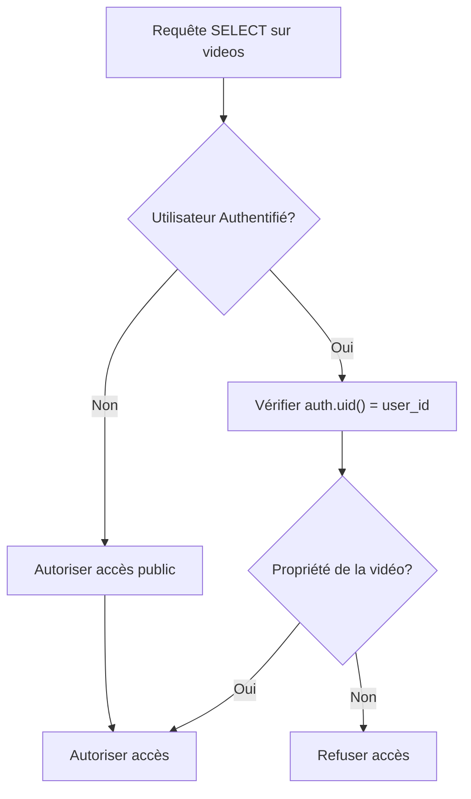
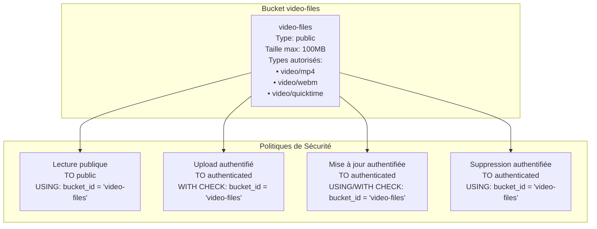
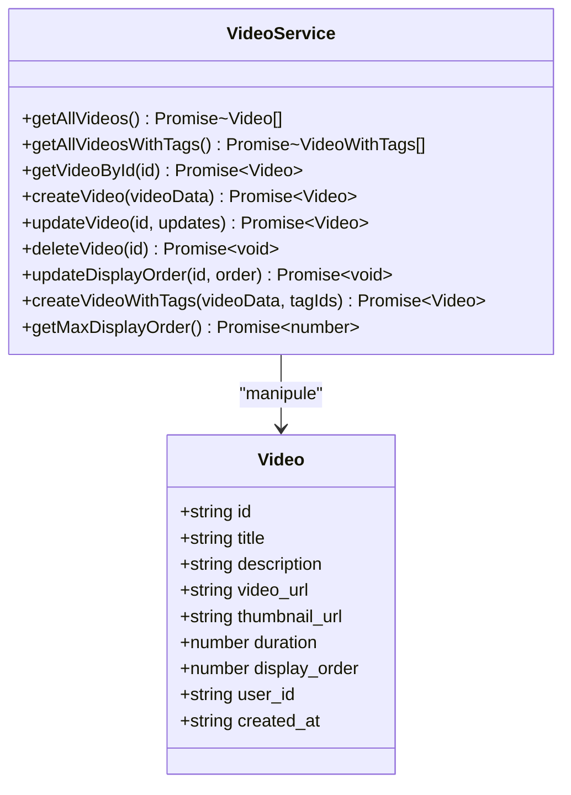

# Schéma des Vidéos

<cite>
**Fichiers Référencés dans ce Document**
- [20251108071024_create_videos_system.sql](file://supabase/migrations/20251108071024_create_videos_system.sql)
- [videoService.ts](file://services/videoService.ts)
- [VideoListAdmin.tsx](file://components/videos/VideoListAdmin.tsx)
- [VideoUploadForm.tsx](file://components/videos/VideoUploadForm.tsx)
- [storageService.ts](file://services/storageService.ts)
- [supabaseClient.ts](file://lib/supabaseClient.ts)
- [20250111_add_security_constraints.sql](file://supabase/migrations/20250111_add_security_constraints.sql)
</cite>

## Table des Matières
1. [Introduction](#introduction)
2. [Structure de la Table Videos](#structure-de-la-table-videos)
3. [Relations et Contraintes](#relations-et-contraintes)
4. [Politiques de Sécurité RLS](#politiques-de-sécurité-rls)
5. [Index de Performance](#index-de-performance)
6. [Bucket de Stockage Video-Files](#bucket-de-stockage-video-files)
7. [Services et Composants](#services-et-composants)
8. [Exemples de Requêtes](#exemples-de-requêtes)
9. [Considérations de Performance](#considérations-de-performance)
10. [Guide de Dépannage](#guide-de-dépannage)

## Introduction

Le système de gestion des vidéos constitue un composant central de l'application portfolio, permettant la gestion complète des médias vidéo. Ce système repose sur une table PostgreSQL optimisée avec des politiques de sécurité Row Level Security (RLS) strictes et un bucket de stockage dédié pour héberger les fichiers vidéo.

## Structure de la Table Videos

La table `videos` définit la structure de données pour stocker les informations relatives aux vidéos dans le système.

### Colonnes et Types de Données

```mermaid
erDiagram
VIDEOS {
uuid id PK
text title NOT_NULL
text description
text video_url NOT_NULL
text thumbnail_url
integer duration
integer display_order NOT_NULL DEFAULT 0
uuid user_id FK
timestamptz created_at DEFAULT now()
}
AUTH_USERS {
uuid id PK
text email
text name
timestamptz created_at
}
VIDEOS ||--o{ AUTH_USERS : "user_id"
```

**Sources du Diagramme**
- [20251108071024_create_videos_system.sql](file://supabase/migrations/20251108071024_create_videos_system.sql#L36-L45)
- [supabaseClient.ts](file://lib/supabaseClient.ts#L204-L214)

#### Détail des Colonnes

| Colonne | Type | Contraintes | Description |
|---------|------|-------------|-------------|
| `id` | UUID | PRIMARY KEY, DEFAULT gen_random_uuid() | Identifiant unique généré automatiquement pour chaque vidéo |
| `title` | TEXT | NOT NULL | Titre de la vidéo, avec validation de longueur (1-200 caractères) |
| `description` | TEXT | NULLABLE | Description optionnelle de la vidéo (max 1000 caractères) |
| `video_url` | TEXT | NOT NULL | URL du fichier vidéo dans le bucket Supabase Storage |
| `thumbnail_url` | TEXT | NULLABLE | URL de l'image miniature associée à la vidéo |
| `duration` | INTEGER | NULLABLE | Durée de la vidéo en secondes (validation : ≥ 0) |
| `display_order` | INTEGER | NOT NULL, DEFAULT 0 | Ordre d'affichage des vidéos (tri croissant) |
| `user_id` | UUID | FOREIGN KEY, NULLABLE | Référence à l'utilisateur ayant ajouté la vidéo |
| `created_at` | TIMESTAMPTZ | DEFAULT now() | Timestamp de création automatique |

**Sources de Section**
- [20251108071024_create_videos_system.sql](file://supabase/migrations/20251108071024_create_videos_system.sql#L36-L45)
- [supabaseClient.ts](file://lib/supabaseClient.ts#L204-L214)

## Relations et Contraintes

### Relation avec la Table Auth.Users

La colonne `user_id` établit une relation avec la table `auth.users` pour suivre l'auteur de chaque vidéo.



**Sources du Diagramme**
- [20251108071024_create_videos_system.sql](file://supabase/migrations/20251108071024_create_videos_system.sql#L43-L44)

### Comportement ON DELETE

Le comportement de suppression CASCADE est configuré comme suit :
- **ON DELETE SET NULL** : Lorsqu'un utilisateur est supprimé, la colonne `user_id` des vidéos associées est définie à NULL
- **Permet la migration** : Cette approche maintient l'intégrité des données tout en facilitant la migration de données existantes

### Contraintes de Validation

Le système implémente plusieurs contraintes de validation pour assurer la qualité des données :

| Contrainte | Expression | But |
|------------|------------|-----|
| `videos_title_length_check` | `char_length(title) BETWEEN 1 AND 200` | Limite la longueur du titre |
| `videos_description_length_check` | `description IS NULL OR char_length(description) <= 1000` | Restreint la taille de la description |
| `videos_video_url_format_check` | `video_url ~ '^https?://'` | Valide le format des URLs vidéo |
| `videos_thumbnail_url_format_check` | `thumbnail_url IS NULL OR thumbnail_url ~ '^https?://'` | Valide le format des URLs de miniatures |
| `videos_duration_check` | `duration IS NULL OR duration >= 0` | Assure que la durée est positive |

**Sources de Section**
- [20250111_add_security_constraints.sql](file://supabase/migrations/20250111_add_security_constraints.sql#L162-L189)

## Politiques de Sécurité RLS

Le système utilise Row Level Security (RLS) pour contrôler l'accès aux données de manière granulaire.

### Politiques de Lecture Publique



**Sources du Diagramme**
- [20251108071024_create_videos_system.sql](file://supabase/migrations/20251108071024_create_videos_system.sql#L52-L55)

#### Politique SELECT : Accès Public
- **Nom** : "Videos are viewable by everyone"
- **Cible** : Toutes les requêtes SELECT
- **Privilèges** : TO public
- **Condition** : `true` (accès illimité)

#### Politique INSERT : Réservée aux Utilisateurs Authentifiés
- **Nom** : "Authenticated users can insert videos"
- **Cible** : Requêtes INSERT
- **Privilèges** : TO authenticated
- **Conditions** : `auth.uid() = user_id` (vérifie la propriété)

#### Politique UPDATE : Vérification de Propriété
- **Nom** : "Authenticated users can update videos"
- **Cible** : Requêtes UPDATE
- **Privilèges** : TO authenticated
- **Conditions** : 
  - `USING`: `auth.uid() = user_id` (lecture)
  - `WITH CHECK`: `auth.uid() = user_id` (écriture)

#### Politique DELETE : Réservée aux Propriétaires
- **Nom** : "Authenticated users can delete videos"
- **Cible** : Requêtes DELETE
- **Privilèges** : TO authenticated
- **Condition** : `auth.uid() = user_id` (propriété exclusive)

**Sources de Section**
- [20251108071024_create_videos_system.sql](file://supabase/migrations/20251108071024_create_videos_system.sql#L52-L74)

## Index de Performance

Trois index sont créés pour optimiser les performances des requêtes courantes.

### Index sur display_order

```sql
CREATE INDEX IF NOT EXISTS idx_videos_display_order ON videos(display_order);
```

**Objectif** : Optimiser les requêtes de tri par ordre d'affichage
- **Type** : Index standard
- **Colonnes** : `display_order`
- **Utilisation** : Tri ascendant (`ORDER BY display_order ASC`)
- **Performance** : O(log n) pour les recherches et tris

### Index sur user_id

```sql
CREATE INDEX IF NOT EXISTS idx_videos_user_id ON videos(user_id);
```

**Objectif** : Optimiser les requêtes par propriétaire
- **Type** : Index standard
- **Colonnes** : `user_id`
- **Utilisation** : Filtrage par utilisateur (`WHERE user_id = ?`)
- **Performance** : O(log n) pour les recherches par utilisateur

### Index sur created_at

```sql
CREATE INDEX IF NOT EXISTS idx_videos_created_at ON videos(created_at DESC);
```

**Objectif** : Optimiser les requêtes de chronologie
- **Type** : Index avec tri descendant
- **Colonnes** : `created_at DESC`
- **Utilisation** : Historique récent (`ORDER BY created_at DESC`)
- **Performance** : O(log n) pour les tris récents

**Sources de Section**
- [20251108071024_create_videos_system.sql](file://supabase/migrations/20251108071024_create_videos_system.sql#L76-L83)

## Bucket de Stockage Video-Files

Le système utilise un bucket de stockage dédié pour héberger les fichiers vidéo avec des politiques de sécurité spécifiques.

### Configuration du Bucket



**Sources du Diagramme**
- [20251108071024_create_videos_system.sql](file://supabase/migrations/20251108071024_create_videos_system.sql#L85-L89)
- [20251108071024_create_videos_system.sql](file://supabase/migrations/20251108071024_create_videos_system.sql#L98-L153)

### Politiques de Sécurité Distinctes

#### Politique de Lecture Publique
- **Nom** : "Public read access for video files"
- **Cible** : Requêtes SELECT sur `storage.objects`
- **Privilèges** : TO public
- **Condition** : `bucket_id = 'video-files'`
- **Impact** : Tous les utilisateurs peuvent accéder aux fichiers vidéo

#### Politiques d'Écriture
- **Upload** : Seuls les utilisateurs authentifiés peuvent ajouter des fichiers
- **Mise à jour** : Seuls les propriétaires peuvent modifier leurs fichiers
- **Suppression** : Seuls les propriétaires peuvent supprimer leurs fichiers

### Limitations de Fichier

| Paramètre | Valeur | But |
|-----------|--------|-----|
| Taille maximale | 100 MB | Évite les uploads excessifs |
| Types MIME autorisés | video/mp4, video/webm, video/quicktime | Formats compatibles |
| Cache Control | 3600 secondes | Mise en cache du CDN |

**Sources de Section**
- [20251108071024_create_videos_system.sql](file://supabase/migrations/20251108071024_create_videos_system.sql#L85-L89)
- [20251108071024_create_videos_system.sql](file://supabase/migrations/20251108071024_create_videos_system.sql#L98-L153)

## Services et Composants

### Service VideoService

Le service `videoService` fournit une interface TypeScript pour interagir avec la table `videos`.



**Sources du Diagramme**
- [videoService.ts](file://services/videoService.ts#L6-L268)
- [supabaseClient.ts](file://lib/supabaseClient.ts#L204-L214)

### Composant VideoUploadForm

Le formulaire d'upload permet aux utilisateurs authentifiés d'ajouter de nouvelles vidéos avec validation complète.

#### Fonctionnalités Clés
- **Validation client-side** : Contrôle de la taille et du format des fichiers
- **Génération automatique** : Calcul automatique de la durée de la vidéo
- **Gestion des tags** : Association avec des tags existants
- **Ordre d'affichage** : Attribution automatique du prochain positionnement

### Composant VideoListAdmin

Interface d'administration pour gérer les vidéos existantes.

#### Fonctionnalités
- **Réorganisation** : Glisser-déposer pour changer l'ordre d'affichage
- **Édition** : Modification des métadonnées des vidéos
- **Suppression** : Suppression avec nettoyage des fichiers associés
- **Visualisation** : Affichage des miniatures et informations détaillées

**Sources de Section**
- [videoService.ts](file://services/videoService.ts#L6-L268)
- [VideoUploadForm.tsx](file://components/videos/VideoUploadForm.tsx#L1-L498)
- [VideoListAdmin.tsx](file://components/videos/VideoListAdmin.tsx#L1-L261)

## Exemples de Requêtes

### Requêtes de Listage

#### Liste des Vidéos par Ordre d'Affichage
```sql
SELECT id, title, description, video_url, thumbnail_url, duration, display_order
FROM videos
ORDER BY display_order ASC;
```

**Objectif** : Récupération des vidéos dans l'ordre défini par l'utilisateur

#### Liste des Vidéos par Propriétaire
```sql
SELECT id, title, description, video_url, created_at
FROM videos
WHERE user_id = 'specific-user-id'
ORDER BY created_at DESC;
```

**Objectif** : Accès aux vidéos d'un utilisateur spécifique

### Requêtes de Métadonnées

#### Récupération de la Durée Maximale
```sql
SELECT COALESCE(MAX(display_order), -1) AS max_order
FROM videos;
```

**Objectif** : Obtenir la valeur maximale pour l'attribution d'un nouvel ordre

#### Compte de Vidéos par Utilisateur
```sql
SELECT COUNT(*) as video_count
FROM videos
WHERE user_id = 'user-id';
```

**Objectif** : Statistiques d'utilisation par utilisateur

### Requêtes de Gestion

#### Mise à Jour de l'Ordre d'Affichage
```sql
UPDATE videos
SET display_order = 5
WHERE id = 'video-id';
```

**Objectif** : Modification de la position d'une vidéo spécifique

#### Suppression de Vidéos Orphelines
```sql
DELETE FROM videos
WHERE id NOT IN (
    SELECT DISTINCT video_id FROM video_tags
);
```

**Objectif** : Nettoyage des vidéos sans tags associés

**Sources de Section**
- [videoService.ts](file://services/videoService.ts#L7-L55)
- [videoService.ts](file://services/videoService.ts#L231-L238)

## Considérations de Performance

### Optimisations Implémentées

#### Index Stratégiques
- **Tri par display_order** : O(log n) pour les requêtes de tri
- **Filtrage par user_id** : O(log n) pour les requêtes par utilisateur
- **Chronologie par created_at** : O(log n) pour les historiques récents

#### Contraintes de Validation
- **Longueur des titres** : Évite les entrées excessive
- **Formats d'URL** : Validation préventive des URLs
- **Durées positives** : Intégrité des données temporelles

### Recommandations de Performance

#### Pour les Requêtes Fréquentes
1. **Utiliser les index** : Toujours filtrer par `user_id` ou trier par `display_order`
2. **Pagination** : Implémenter LIMIT/OFFSET pour les grandes collections
3. **Cache côté client** : Mettre en cache les métadonnées des vidéos

#### Pour les Opérations d'Upload
1. **Compression client-side** : Réduire la taille des fichiers avant upload
2. **Validation préalable** : Vérifier la taille et le format côté client
3. **Progressive upload** : Implémenter des uploads par chunks pour les gros fichiers

## Guide de Dépannage

### Problèmes Courants

#### Erreurs d'Authentification
**Symptôme** : "Not authenticated" lors des opérations CRUD
**Solution** : Vérifier que l'utilisateur est connecté et que `auth.uid()` est disponible

#### Violations de RLS
**Symptôme** : "Permission denied" lors des requêtes
**Solution** : Vérifier que l'utilisateur possède bien la vidéo (`auth.uid() = user_id`)

#### Upload de Fichiers Échoué
**Symptôme** : Erreur lors de l'upload de vidéo
**Solution** :
1. Vérifier la taille (< 100MB)
2. Valider le format (MP4, WebM, MOV)
3. Contrôler les permissions du bucket

#### Performance Dégradée
**Symptôme** : Requêtes lentes sur grandes collections
**Solution** :
1. Vérifier l'utilisation des index
2. Implémenter la pagination
3. Optimiser les requêtes avec EXPLAIN ANALYZE

### Debugging

#### Vérification des Index
```sql
EXPLAIN SELECT * FROM videos 
WHERE user_id = 'user-id' 
ORDER BY display_order ASC;
```

#### Audit des Permissions
```sql
SELECT * FROM pg_policies 
WHERE tablename = 'videos';
```

#### Monitoring des Uploads
Observer les logs du service storage pour détecter les erreurs d'upload.

**Sources de Section**
- [videoService.ts](file://services/videoService.ts#L67-L168)
- [VideoUploadForm.tsx](file://components/videos/VideoUploadForm.tsx#L181-L318)