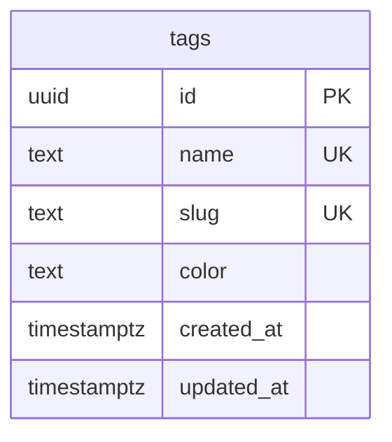
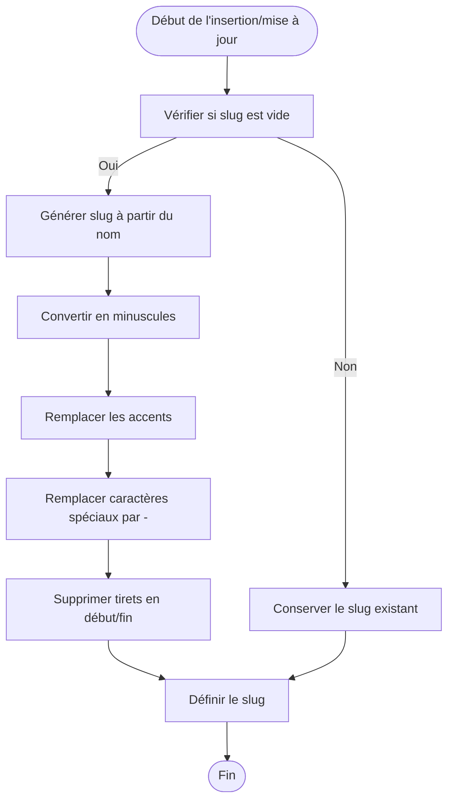
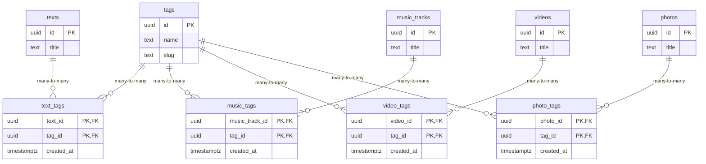

# Système de Tags

<cite>
**Fichiers référencés dans ce document**  
- [20250107_create_texts_system_v2.sql](file://supabase/migrations/20250107_create_texts_system_v2.sql)
- [002_add_media_tags.sql](file://supabase/migrations/002_add_media_tags.sql)
- [tagService.ts](file://services/tagService.ts)
- [musicTagService.ts](file://services/musicTagService.ts)
- [photoTagService.ts](file://services/photoTagService.ts)
- [videoTagService.ts](file://services/videoTagService.ts)
- [textService.ts](file://services/textService.ts)
- [TagManager.tsx](file://components/texts/TagManager.tsx)
</cite>

## Table des matières
1. [Introduction](#introduction)
2. [Table Principale des Tags](#table-principale-des-tags)
3. [Génération Automatique des Slugs](#génération-automatique-des-slugs)
4. [Tables de Jointure](#tables-de-jointure)
5. [Accès et Sécurité (RLS)](#accès-et-sécurité-rls)
6. [Services d'Application](#services-dapplication)
7. [Exemples de Requêtes](#exemples-de-requêtes)
8. [Interface Utilisateur](#interface-utilisateur)

## Introduction
Le système de tags de l'application permet une classification uniforme et cohérente de tous les types de contenu (textes, musique, vidéos, photos). Ce document décrit en détail la structure de la table `tags`, les mécanismes de génération automatique des slugs, les tables de jointure pour chaque type de contenu, les politiques de sécurité, et les services applicatifs qui permettent de gérer ce système.

## Table Principale des Tags

La table `tags` est au cœur du système de classification de l'application. Elle stocke les informations fondamentales sur chaque tag utilisé dans le système.

**Structure de la table `tags` :**
- `id` (UUID) : clé primaire, généré automatiquement
- `name` (TEXT) : nom du tag, requis et unique
- `slug` (TEXT) : identifiant URL-friendly, requis et unique
- `color` (TEXT) : couleur hexadécimale pour l'affichage, valeur par défaut `#6366f1`
- `created_at` (TIMESTAMPTZ) : date de création, valeur par défaut `now()`
- `updated_at` (TIMESTAMPTZ) : date de mise à jour, valeur par défaut `now()`

La table dispose de contraintes d'unicité sur les colonnes `name` et `slug`, garantissant qu'aucun doublon ne peut exister. Un index est également créé sur la colonne `slug` pour optimiser les recherches basées sur cet identifiant.



**Sources du diagramme**  
- [20250107_create_texts_system_v2.sql](file://supabase/migrations/20250107_create_texts_system_v2.sql#L105-L148)

**Sources de la section**  
- [20250107_create_texts_system_v2.sql](file://supabase/migrations/20250107_create_texts_system_v2.sql#L105-L148)

## Génération Automatique des Slugs

Le système inclut une fonctionnalité de génération automatique des slugs pour garantir que chaque tag dispose d'un identifiant URL-friendly unique et cohérent.

La fonction `auto_generate_tag_slug` est un déclencheur PostgreSQL qui s'exécute avant chaque insertion ou mise à jour dans la table `tags`. Si le champ `slug` est null ou vide, la fonction génère automatiquement un slug basé sur le nom du tag.

Le processus de génération suit ces étapes :
1. Convertit le nom en minuscules
2. Remplace les caractères accentués par leurs équivalents non accentués (ex: é → e, à → a)
3. Remplace les espaces et caractères spéciaux par des tirets
4. Supprime les tirets en début et fin de chaîne

Cette fonction est activée par un déclencheur `set_tag_slug` qui garantit que tous les tags ont un slug valide, même si l'utilisateur ne le fournit pas explicitement.



**Sources du diagramme**  
- [20250107_create_texts_system_v2.sql](file://supabase/migrations/20250107_create_texts_system_v2.sql#L105-L148)
- [20250107_create_texts_system.sql](file://supabase/migrations/20250107_create_texts_system.sql#L196-L242)

**Sources de la section**  
- [20250107_create_texts_system_v2.sql](file://supabase/migrations/20250107_create_texts_system_v2.sql#L105-L148)
- [20250107_create_texts_system.sql](file://supabase/migrations/20250107_create_texts_system.sql#L196-L242)

## Tables de Jointure

Le système utilise un modèle de relation many-to-many entre les tags et chaque type de contenu, implémenté via des tables de jointure spécifiques.

### Structure Commune
Toutes les tables de jointure partagent une structure identique :
- Clé composite primaire composée de l'ID du contenu et de l'ID du tag
- Références vers la table de contenu avec suppression en cascade
- Référence vers la table `tags` avec suppression en cascade
- Champ `created_at` pour le suivi temporel

### Liste des Tables de Jointure
- `text_tags` : relation entre textes et tags
- `music_tags` : relation entre morceaux de musique et tags
- `video_tags` : relation entre vidéos et tags
- `photo_tags` : relation entre photos et tags

Chaque table dispose d'index sur les deux colonnes de la clé composite pour optimiser les performances de recherche.



**Sources du diagramme**  
- [20250107_create_texts_system_v2.sql](file://supabase/migrations/20250107_create_texts_system_v2.sql#L105-L148)
- [002_add_media_tags.sql](file://supabase/migrations/002_add_media_tags.sql#L7-L46)

**Sources de la section**  
- [20250107_create_texts_system_v2.sql](file://supabase/migrations/20250107_create_texts_system_v2.sql#L105-L148)
- [002_add_media_tags.sql](file://supabase/migrations/002_add_media_tags.sql#L7-L46)

## Accès et Sécurité (RLS)

Le système met en œuvre des politiques de sécurité au niveau des lignes (Row Level Security - RLS) pour contrôler l'accès aux données.

### Politiques pour la Table `tags`
- **Lecture publique** : tous les utilisateurs (authentifiés ou anonymes) peuvent lire les tags
- **Modification authentifiée** : seuls les utilisateurs authentifiés peuvent créer, modifier ou supprimer des tags

Cette configuration permet une lecture ouverte des tags pour tous les visiteurs du site, tout en réservant la gestion des tags aux utilisateurs authentifiés, typiquement les administrateurs.

### Politiques pour les Tables de Jointure
Chaque table de jointure a des politiques RLS spécifiques :
- **Lecture publique** : tous les utilisateurs peuvent voir les relations tags-contenu
- **Modification authentifiée** : seuls les utilisateurs authentifiés peuvent gérer les tags de leur propre contenu

Par exemple, pour la table `text_tags`, un utilisateur ne peut ajouter ou supprimer des tags que pour des textes qu'il a lui-même créés.

**Sources de la section**  
- [20250107_create_texts_system_v2.sql](file://supabase/migrations/20250107_create_texts_system_v2.sql#L105-L148)
- [002_add_media_tags.sql](file://supabase/migrations/002_add_media_tags.sql#L7-L46)
- [20250107_create_texts_system.sql](file://supabase/migrations/20250107_create_texts_system.sql#L196-L242)

## Services d'Application

Le système inclut plusieurs services côté application pour faciliter l'interaction avec les tags.

### Service Principal `tagService`
Le service `tagService` fournit des méthodes pour gérer les tags eux-mêmes :
- `getAllTags()` : récupère tous les tags triés par nom
- `getTagById()` et `getTagBySlug()` : récupère un tag spécifique
- `createTag()`, `updateTag()`, `deleteTag()` : gestion complète des tags
- Mise en cache intégrée pour améliorer les performances

### Services de Jointure
Des services spécialisés gèrent les relations entre les tags et chaque type de contenu :
- `musicTagService` : gestion des tags pour la musique
- `photoTagService` : gestion des tags pour les photos
- `videoTagService` : gestion des tags pour les vidéos
- `textService` : gestion des tags pour les textes

Ces services offrent des méthodes cohérentes :
- `getTagsFor[Content]()` : récupère tous les tags d'un contenu spécifique
- `addTagTo[Content]()` et `removeTagFrom[Content]()` : gestion individuelle des tags
- `setTagsFor[Content]()` : remplace tous les tags d'un contenu (utile pour les mises à jour)

Les services gèrent également la suppression en cascade et l'invalidation du cache pour maintenir la cohérence des données.

```mermaid
classDiagram
class tagService {
+getAllTags() Promise~{tags : Tag[], error : null}~
+getTagById(id : string) Promise~{tag : Tag, error : null}~
+getTagBySlug(slug : string) Promise~{tag : Tag, error : null}~
+createTag(tag : {name, slug?, color?}) Promise~{tag : Tag, error : null}~
+updateTag(id : string, updates : Partial~Tag~) Promise~{tag : Tag, error : null}~
+deleteTag(id : string) Promise~{error : null}~
+getTagsForText(textId : string) Promise~{tags : Tag[], error : null}~
+setTagsForText(textId : string, tagIds : string[]) Promise~{error : null}~
}
class musicTagService {
+getTagsForMusicTrack(musicTrackId : string) Promise~{tags : Tag[], error : null}~
+addTagToMusicTrack(musicTrackId : string, tagId : string) Promise~{error : null}~
+removeTagFromMusicTrack(musicTrackId : string, tagId : string) Promise~{error : null}~
+setTagsForMusicTrack(musicTrackId : string, tagIds : string[]) Promise~{error : null}~
+getAllTagsUsedInMusicTracks() Promise~{tags : Tag[], error : null}~
}
class photoTagService {
+getTagsForPhoto(photoId : string) Promise~{tags : Tag[], error : null}~
+addTagToPhoto(photoId : string, tagId : string) Promise~{error : null}~
+removeTagFromPhoto(photoId : string, tagId : string) Promise~{error : null}~
+setTagsForPhoto(photoId : string, tagIds : string[]) Promise~{error : null}~
+getAllTagsUsedInPhotos() Promise~{tags : Tag[], error : null}~
}
class videoTagService {
+getTagsForVideo(videoId : string) Promise~{tags : Tag[], error : null}~
+addTagToVideo(videoId : string, tagId : string) Promise~{error : null}~
+removeTagFromVideo(videoId : string, tagId : string) Promise~{error : null}~
+setTagsForVideo(videoId : string, tagIds : string[]) Promise~{error : null}~
+getAllTagsUsedInVideos() Promise~{tags : Tag[], error : null}~
}
tagService --> textService : "utilisé par"
musicTagService --> tagService : "utilisé par"
photoTagService --> tagService : "utilisé par"
videoTagService --> tagService : "utilisé par"
```

**Sources du diagramme**  
- [tagService.ts](file://services/tagService.ts#L1-L196)
- [musicTagService.ts](file://services/musicTagService.ts#L1-L106)
- [photoTagService.ts](file://services/photoTagService.ts#L1-L106)
- [videoTagService.ts](file://services/videoTagService.ts#L1-L106)
- [textService.ts](file://services/textService.ts#L1-L385)

**Sources de la section**  
- [tagService.ts](file://services/tagService.ts#L1-L196)
- [musicTagService.ts](file://services/musicTagService.ts#L1-L106)
- [photoTagService.ts](file://services/photoTagService.ts#L1-L106)
- [videoTagService.ts](file://services/videoTagService.ts#L1-L106)
- [textService.ts](file://services/textService.ts#L1-L385)

## Exemples de Requêtes

Voici quelques exemples de requêtes SQL pour interagir avec le système de tags.

### Récupérer tous les tags d'un type de contenu spécifique
```sql
-- Récupérer tous les tags d'un morceau de musique
SELECT t.*
FROM tags t
JOIN music_tags mt ON t.id = mt.tag_id
WHERE mt.music_track_id = 'UUID_DU_MORCEAU';

-- Récupérer tous les tags d'une vidéo
SELECT t.*
FROM tags t
JOIN video_tags vt ON t.id = vt.tag_id
WHERE vt.video_id = 'UUID_DE_LA_VIDEO';

-- Récupérer tous les tags d'une photo
SELECT t.*
FROM tags t
JOIN photo_tags pt ON t.id = pt.tag_id
WHERE pt.photo_id = 'UUID_DE_LA_PHOTO';
```

### Trouver du contenu par tags
```sql
-- Trouver tous les textes avec le tag "React"
SELECT tx.*
FROM texts tx
JOIN text_tags tt ON tx.id = tt.text_id
JOIN tags t ON tt.tag_id = t.id
WHERE t.slug = 'react';

-- Trouver toutes les vidéos avec le tag "tutoriel"
SELECT v.*
FROM videos v
JOIN video_tags vt ON v.id = vt.video_id
JOIN tags t ON vt.tag_id = t.id
WHERE t.slug = 'tutoriel';

-- Trouver tous les morceaux de musique avec le tag "rock"
SELECT m.*
FROM music_tracks m
JOIN music_tags mt ON m.id = mt.music_track_id
JOIN tags t ON mt.tag_id = t.id
WHERE t.slug = 'rock';
```

### Compter l'utilisation des tags
```sql
-- Compter combien de fois chaque tag est utilisé dans les textes
SELECT t.name, COUNT(tt.text_id) as usage_count
FROM tags t
LEFT JOIN text_tags tt ON t.id = tt.tag_id
GROUP BY t.id, t.name
ORDER BY usage_count DESC;

-- Trouver tous les tags utilisés dans au moins un type de contenu
SELECT DISTINCT t.*
FROM tags t
WHERE EXISTS (
  SELECT 1 FROM text_tags tt WHERE tt.tag_id = t.id
) OR EXISTS (
  SELECT 1 FROM music_tags mt WHERE mt.tag_id = t.id
) OR EXISTS (
  SELECT 1 FROM video_tags vt WHERE vt.tag_id = t.id
) OR EXISTS (
  SELECT 1 FROM photo_tags pt WHERE pt.tag_id = t.id
);
```

**Sources de la section**  
- [textService.ts](file://services/textService.ts#L273-L299)
- [musicTagService.ts](file://services/musicTagService.ts#L7-L17)
- [photoTagService.ts](file://services/photoTagService.ts#L7-L17)
- [videoTagService.ts](file://services/videoTagService.ts#L7-L17)

## Interface Utilisateur

L'interface utilisateur permet aux administrateurs de gérer les tags via un composant `TagManager`.

Le composant `TagManager` offre les fonctionnalités suivantes :
- Affichage de tous les tags existants avec leur couleur
- Création de nouveaux tags avec sélection de couleur
- Modification des tags existants
- Suppression des tags (avec confirmation)
- Sélecteur de couleur avec palettes prédéfinies et sélecteur personnalisé

Les tags sont affichés sous forme de badges colorés, permettant une identification visuelle rapide. Le composant gère également la validation des formulaires et l'affichage des messages d'erreur.

Le composant `TagBadge` est utilisé pour afficher les tags dans toute l'application, avec un style cohérent basé sur la couleur du tag.

**Sources de la section**  
- [TagManager.tsx](file://components/texts/TagManager.tsx#L1-L339)
- [TagBadge.tsx](file://components/texts/TagBadge.tsx#L1-L53)