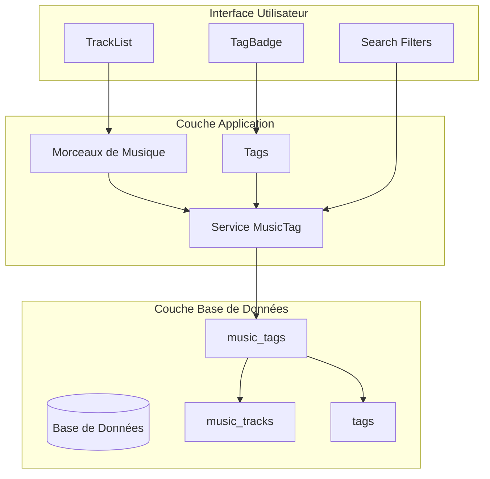
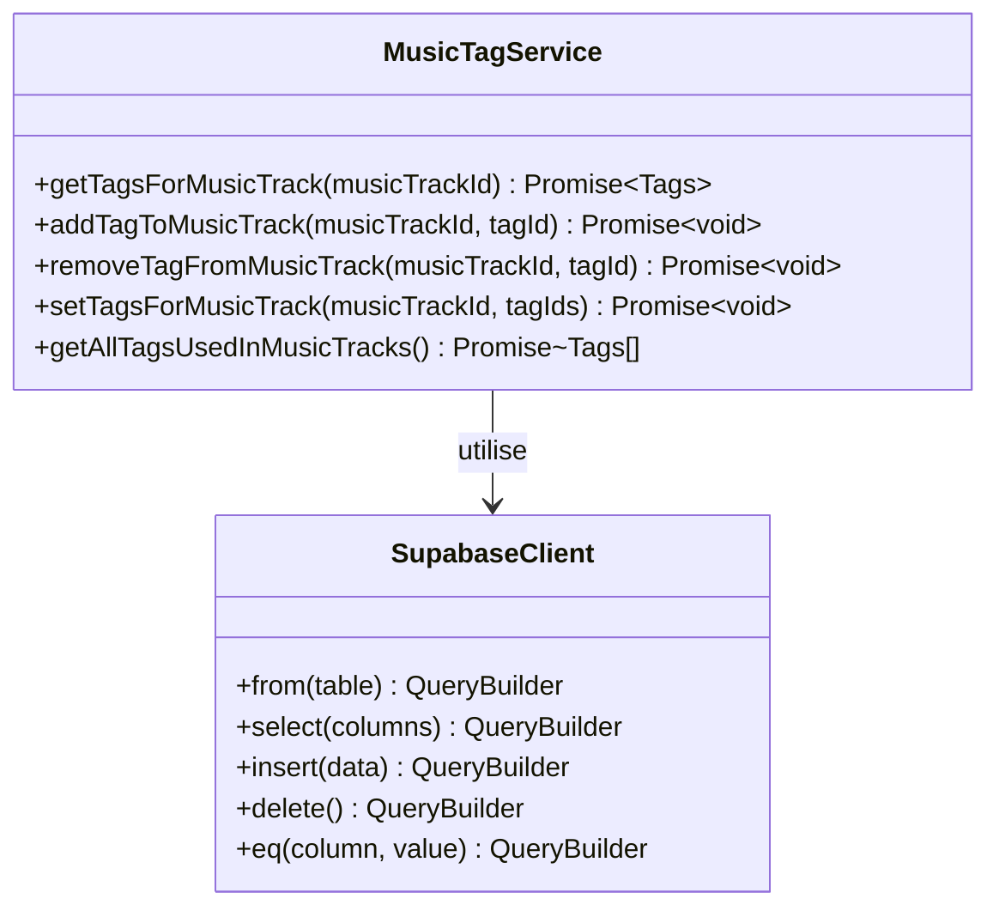
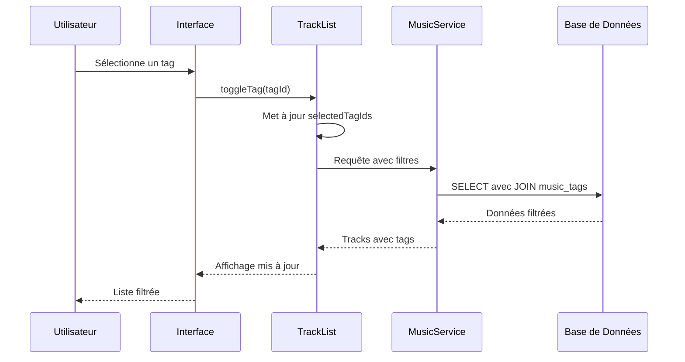
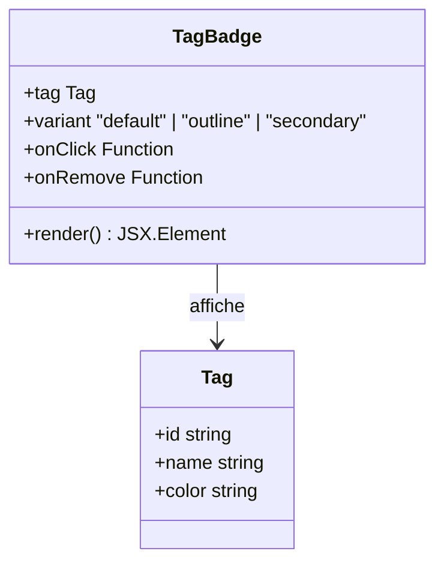

# Tags pour la Musique

<cite>
**Fichiers Référencés dans ce Document**
- [002_add_media_tags.sql](file://supabase/migrations/002_add_media_tags.sql)
- [musicTagService.ts](file://services/musicTagService.ts)
- [musicService.ts](file://services/musicService.ts)
- [Trackfile://components/music/TrackList.tsx)
- [page.tsx](file://app/musique/page.tsx)
- [TagBadge.tsx](file://components/texts/TagBadge.tsx)
- [supabaseClient.ts](file://lib/supabaseClient.ts)
</cite>

## Table des Matières
1. [Introduction](#introduction)
2. [Structure de la Table music_tags](#structure-de-la-table-music_tags)
3. [Architecture de la Relation Many-to-Many](#architecture-de-la-relation-many-to-many)
4. [Services et Opérations CRUD](#services-et-opérations-crud)
5. [Interface Utilisateur et Filtrage](#interface-utilisateur-et-filtrage)
6. [Optimisations de Performance](#optimisations-de-performance)
7. [Gestion des Erreurs et Résilience](#gestion-des-erreurs-et-résilience)
8. [Exemples Pratiques de Requêtes](#exemples-pratiques-de-requêtes)
9. [Conclusion](#conclusion)

## Introduction

La table `music_tags` constitue le cœur du système de classification des morceaux de musique dans cette application. Elle implémente une relation many-to-many (plusieurs à plusieurs) entre les morceaux de musique (`music_tracks`) et les tags, permettant une organisation flexible et granulaire des contenus audio. Cette structure de données sophistiquée facilite la recherche, le filtrage et la découverte de contenu musical grâce à un système de balisage avancé.

Le système de tags offre une approche modulaire pour organiser la bibliothèque musicale, permettant aux utilisateurs de catégoriser les morceaux selon différents critères comme le genre, l'époque, l'humeur ou tout autre attribut pertinent. Cette architecture extensible supporte l'évolution future du système sans nécessiter de modifications structurelles majeures.

## Structure de la Table music_tags

### Colonnes et Contraintes

La table `music_tags` possède une structure optimisée conçue pour garantir l'intégrité référentielle et les performances de requête :

```mermaid
erDiagram
MUSIC_TRACKS {
uuid id PK
string title
string artist
string album
string audio_url
string cover_image_url
integer duration
integer display_order
uuid user_id FK
timestamp created_at
}
TAGS {
uuid id PK
string name
string slug
string color
timestamp created_at
timestamp updated_at
}
MUSIC_TAGS {
uuid music_track_id FK
uuid tag_id FK
timestamp created_at
primary_key music_track_id, tag_id
}
MUSIC_TRACKS ||--o{ MUSIC_TAGS : "contient"
TAGS ||--o{ MUSIC_TAGS : "associé à"
```

**Sources du Diagramme**
- [002_add_media_tags.sql](file://supabase/migrations/002_add_media_tags.sql#L7-L11)
- [supabaseClient.ts](file://lib/supabaseClient.ts#L85-L89)

### Clé Primaire Composite

La clé primaire composite `(music_track_id, tag_id)` garantit que :
- Un même tag ne peut être associé qu'une seule fois au même morceau
- L'unicité des associations est maintenue au niveau de la base de données
- La structure empêche les doublons d'enregistrements

### Relations et Contraintes d'Intégrité

Chaque colonne de la table respecte les contraintes suivantes :

| Colonne | Type | Contraintes | Description |
|---------|------|-------------|-------------|
| `music_track_id` | UUID | NOT NULL, FOREIGN KEY | Référence à `music_tracks.id` avec suppression en cascade |
| `tag_id` | UUID | NOT NULL, FOREIGN KEY | Référence à `tags.id` avec suppression en cascade |
| `created_at` | TIMESTAMPTZ | NOT NULL, DEFAULT NOW() | Horodatage automatique de création |

**Sources de Section**
- [002_add_media_tags.sql](file://supabase/migrations/002_add_media_tags.sql#L7-L11)

## Architecture de la Relation Many-to-Many

### Modèle Conceptuel

La relation many-to-many entre morceaux de musique et tags suit un modèle de conception robuste qui sépare les préoccupations tout en maintenant l'intégrité des données :



**Sources du Diagramme**
- [musicTagService.ts](file://services/musicTagService.ts#L1-L106)
- [TrackList.tsx](file://components/music/TrackList.tsx#L1-L294)

### Avantages Architecturaux

Cette architecture présente plusieurs avantages significatifs :

1. **Flexibilité** : Un morceau peut avoir plusieurs tags, et un tag peut être associé à plusieurs morceaux
2. **Extensibilité** : Nouveaux tags peuvent être ajoutés sans modifier la structure existante
3. **Performance** : Séparation claire des responsabilités optimise les requêtes
4. **Maintenabilité** : Modifications indépendantes des entités principales

**Sources de Section**
- [musicTagService.ts](file://services/musicTagService.ts#L1-L106)

## Services et Opérations CRUD

### Service musicTagService

Le service `musicTagService` encapsule toutes les opérations de gestion des tags musicaux, offrant une interface cohérente et sécurisée :



**Sources du Diagramme**
- [musicTagService.ts](file://services/musicTagService.ts#L3-L106)

### Opérations CRUD Détaillées

#### 1. Récupération des Tags

**Récupérer tous les tags d'un morceau** :
- Requête : `SELECT tag_id, tags(*) FROM music_tags WHERE music_track_id = ?`
- Jointure : Automatique avec la table `tags`
- Tri : Par nom du tag

**Récupérer tous les tags utilisés** :
- Requête : `SELECT DISTINCT tag_id, tags(*) FROM music_tags ORDER BY tags(name)`
- Optimisation : Élimination des doublons
- Tri : Alphabetique par nom

#### 2. Création et Modification

**Ajouter un tag** :
- Requête : `INSERT INTO music_tags (music_track_id, tag_id) VALUES (?, ?)`
- Validation : Vérification de l'existence des identifiants
- Contrainte : Clé primaire composite

**Supprimer un tag** :
- Requête : `DELETE FROM music_tags WHERE music_track_id = ? AND tag_id = ?`
- Cascade : Suppression automatique des enregistrements dépendants

**Définir tous les tags** (remplacement complet) :
- Processus : Suppression + Insertion multiple
- Transaction : Gestion atomique des opérations
- Optimisation : Traitement en lot pour les performances

#### 3. Gestion des Erreurs

Le service implémente une gestion robuste des erreurs :

- **Erreurs de validation** : Identifiées et signalées
- **Erreurs de contrainte** : Gestion spécifique des violations
- **Erreurs réseau** : Tentatives de reconnexion
- **Erreurs de base de données** : Logging et reporting

**Sources de Section**
- [musicTagService.ts](file://services/musicTagService.ts#L1-L106)

## Interface Utilisateur et Filtrage

### Composant TrackList

Le composant `TrackList` intègre nativement le système de tags pour fournir une expérience utilisateur fluide :



**Sources du Diagramme**
- [TrackList.tsx](file://components/music/TrackList.tsx#L1-L294)
- [page.tsx](file://app/musique/page.tsx#L243-L292)

### Système de Filtrage par Tags

Le filtrage par tags utilise une logique AND (ET) : un morceau doit posséder TOUS les tags sélectionnés pour apparaître dans les résultats.

#### Fonctionnalités de Filtrage

1. **Filtrage en temps réel** : Mise à jour immédiate lors de la sélection/désélection
2. **Indicateurs visuels** : Badges colorés pour les tags actifs
3. **Réinitialisation** : Bouton pour effacer tous les filtres
4. **Persiste des préférences** : Sauvegarde des choix de l'utilisateur

#### Algorithme de Filtrage

```typescript
// Logique de filtrage dans page.tsx
const applyFilters = useMemo(() => {
  let result = [...allTracks];
  
  // Filtre par tags (logique AND)
  if (selectedTagIds.length > 0) {
    result = result.filter((track) =>
      selectedTagIds.every((tagId) =>
        track.tags?.some((tag) => tag.id === tagId)
      )
    );
  }
  
  return result;
}, [allTracks, selectedTagIds]);
```

### Composant TagBadge

Le composant `TagBadge` offre une interface interactive pour la sélection de tags :



**Sources du Diagramme**
- [TagBadge.tsx](file://components/texts/TagBadge.tsx#L1-L53)

**Sources de Section**
- [page.tsx](file://app/musique/page.tsx#L170-L216)
- [TrackList.tsx](file://components/music/TrackList.tsx#L243-L292)

## Optimisations de Performance

### Index de Recherche

La table `music_tags` bénéficie de deux index stratégiquement placés pour optimiser les performances :

```sql
-- Index sur music_track_id pour les requêtes par morceau
CREATE INDEX IF NOT EXISTS idx_music_tags_music_track_id 
ON music_tags(music_track_id);

-- Index sur tag_id pour les requêtes par tag
CREATE INDEX IF NOT EXISTS idx_music_tags_tag_id 
ON music_tags(tag_id);
```

### Stratégies d'Optimisation

#### 1. Indexation Multi-Colonnes

Les index permettent des optimisations spécifiques :
- **Recherche par morceau** : `EXPLAIN SELECT * FROM music_tags WHERE music_track_id = ?`
- **Recherche par tag** : `EXPLAIN SELECT * FROM music_tags WHERE tag_id = ?`
- **Jointures efficaces** : Optimisation des requêtes complexes

#### 2. Cache de Données

Le service `musicService` implémente un système de cache pour réduire la charge sur la base de données :

```typescript
// Cache avec TTL de 5 minutes
const CACHE_KEY = 'music:all-with-tags';
const TTL = 5 * 60 * 1000;

const cached = cache.get<{ tracks: MusicTrackWithTags[]; error: null }>(CACHE_KEY);
if (cached) {
  return cached;
}
```

#### 3. Chargement Paresseux

Le système charge les tags seulement lorsque nécessaire :
- **Chargement conditionnel** : Seulement si la table existe
- **Fallback automatique** : Mode sans tags en cas d'erreur
- **Lazy loading** : Tags chargés après les morceaux principaux

**Sources de Section**
- [002_add_media_tags.sql](file://supabase/migrations/002_add_media_tags.sql#L15-L16)
- [musicService.ts](file://services/musicService.ts#L14-L25)

## Gestion des Erreurs et Résilience

### Stratégies de Résilience

Le système implémente plusieurs couches de résilience pour garantir une expérience utilisateur continue :

#### 1. Détection et Gestion des Erreurs

```typescript
// Gestion des erreurs de table manquante
if (tracksError.code === 'PGRST205' || tracksError.message?.includes('Could not find the table')) {
  console.warn('[MUSIC PAGE] Table music_tags does not exist - loading tracks without tags');
  setTagsAvailable(false);
  // Fallback vers mode sans tags
  const { tracks: tracksWithoutTags } = await musicService.getAllTracks();
  setAllTracks(tracksWithoutTags || []);
}
```

#### 2. Modes de Fallback

Le système propose plusieurs modes de fonctionnement selon la disponibilité des ressources :

| Situation | Mode de Fallback | Comportement |
|-----------|------------------|--------------|
| Table manquante | Mode sans tags | Chargement des morceaux seulement |
| Erreur de connexion | Cache local | Utilisation des données mises en cache |
| Base de données lente | Timeout rapide | Interface responsive avec état de chargement |

#### 3. Logging et Monitoring

Toutes les erreurs sont loggées avec des informations contextuelles :
- Codes d'erreur spécifiques (PGRST205 pour table manquante)
- Messages de diagnostic détaillés
- Traçabilité des opérations échouées

**Sources de Section**
- [page.tsx](file://app/musique/page.tsx#L225-L235)

## Exemples Pratiques de Requêtes

### Requêtes SQL Standard

#### 1. Listage de tous les tags d'un morceau

```sql
SELECT 
    mt.tag_id,
    t.name AS tag_name,
    t.color AS tag_color
FROM 
    music_tags mt
JOIN 
    tags t ON mt.tag_id = t.id
WHERE 
    mt.music_track_id = 'uuid-morceau-specifique'
ORDER BY 
    t.name ASC;
```

#### 2. Trouver tous les morceaux avec un tag donné

```sql
SELECT 
    mt.music_track_id,
    mt.created_at,
    tt.title,
    tt.artist,
    tt.album
FROM 
    music_tags mt
JOIN 
    music_tracks tt ON mt.music_track_id = tt.id
WHERE 
    mt.tag_id = 'uuid-tag-specifique'
ORDER BY 
    mt.created_at DESC;
```

#### 3. Morceaux avec plusieurs tags (logique AND)

```sql
SELECT 
    mt1.music_track_id,
    COUNT(DISTINCT mt1.tag_id) as tags_count
FROM 
    music_tags mt1
WHERE 
    mt1.tag_id IN ('uuid-tag1', 'uuid-tag2', 'uuid-tag3')
GROUP BY 
    mt1.music_track_id
HAVING 
    COUNT(DISTINCT mt1.tag_id) = 3;
```

### Requêtes via le Service TypeScript

#### 1. Récupération des Tags d'un Morceau

```typescript
// Exemple d'utilisation du service
const { tags, error } = await musicTagService.getTagsFor-morceau');
if (error) {
  console.error('Erreur lors de la récupération des tags:', error);
} else {
  console.log('Tags trouvés:', tags);
}
```

#### 2. Ajout d'un Tag à un Morceau

```typescript
// Ajout d'un nouveau tag
const { error } = await musicTagService.addTagToMusicTrack(
  'uuid-morceau', 
  'uuid-nouveau-tag'
);
if (error) {
  console.error('Erreur lors de l\'ajout du tag:', error);
}
```

#### 3. Gestion des Tags Multiples

```typescript
// Définition complète des tags (remplacement)
const { error } = await musicTagService.setTagsForMusicTrack(
  'uuid-morceau',
  ['uuid-tag1', 'uuid-tag2', 'uuid-tag3']
);
```

**Sources de Section**
- [musicTagService.ts](file://services/musicTagService.ts#L7-L106)

## Conclusion

La table `music_tags` représente un élément fondamental de l'architecture modulaire de cette application musicale. Son implémentation sophistiquée combine performance, flexibilité et résilience pour offrir une expérience utilisateur riche et réactive.

### Points Clés

1. **Architecture Robuste** : Relation many-to-many bien conçue avec intégrité référentielle
2. **Performance Optimisée** : Index stratégiques et cache intelligent
3. **Expérience Utilisateur** : Interface intuitive avec filtrage en temps réel
4. **Résilience** : Gestion proche des erreurs et modes de fallback
5. **Extensibilité** : Structure modulaire facilitant l'évolution future

### Avantages pour l'Application

- **Découverte Améliorée** : Filtrage précis par tags multiples
- **Organisation Flexible** : Classification modulaire des morceaux
- **Performance Maintenue** : Requêtes optimisées même avec de grandes collections
- **Expérience Continue** : Fonctionnement robuste malgré les erreurs

Cette implémentation démontre une approche mature de la gestion de données relationnelles dans une application moderne, équilibrant efficacité technique et expérience utilisateur optimale.