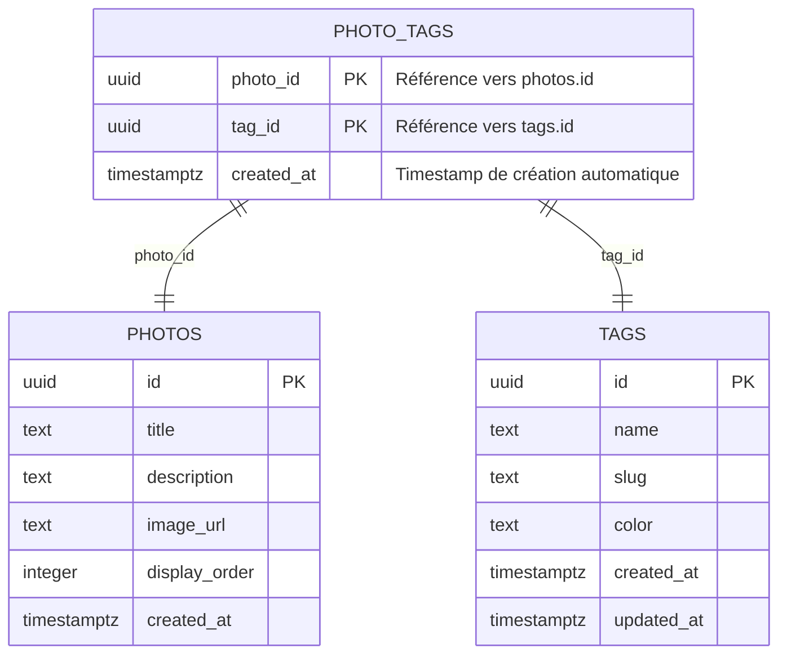
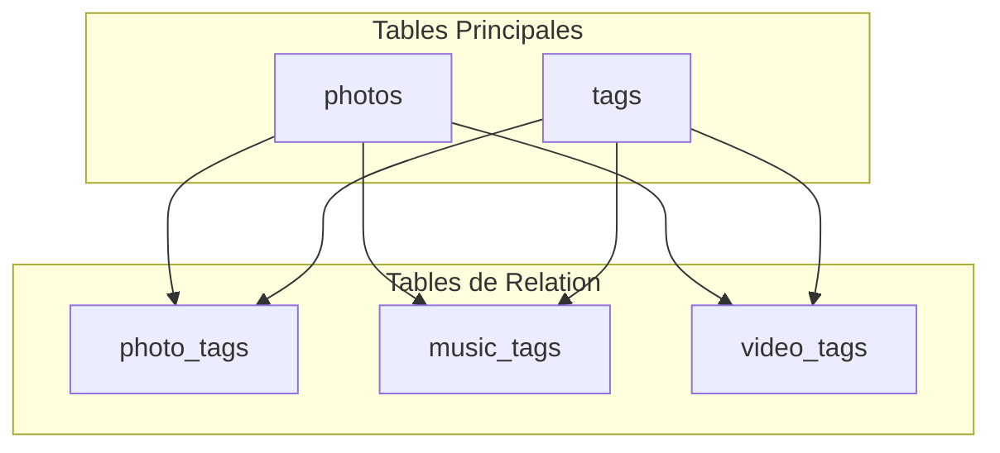
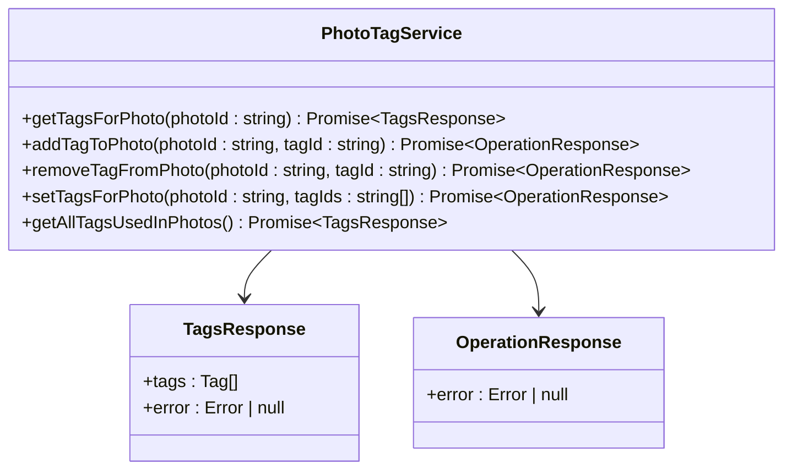
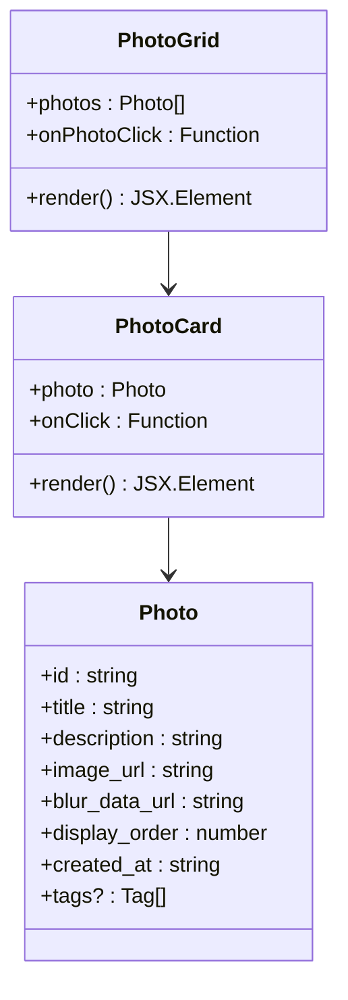
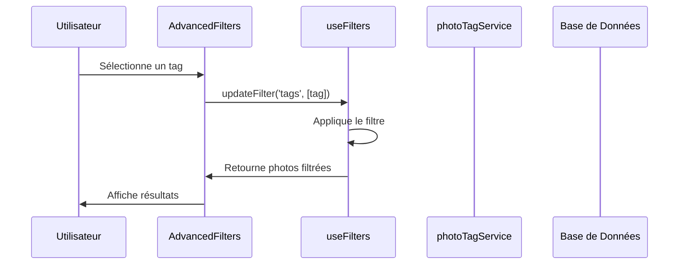
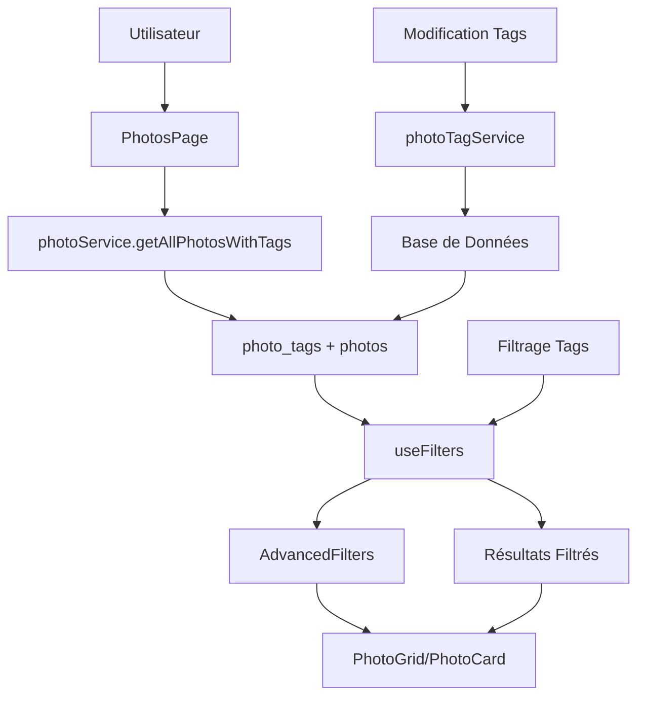

# Tags pour les Photos

<cite>
**Fichiers Référencés dans ce Document**
- [002_add_media_tags.sql](file://supabase/migrations/002_add_media_tags.sql)
- [schema.sql](file://database/schema.sql)
- [photoTagService.ts](file://services/photoTagService.ts)
- [supabaseClient.ts](file://lib/supabaseClient.ts)
- [PhotoGrid.tsx](file://components/photos/PhotoGrid.tsx)
- [PhotoCard.tsx](file://components/photos/PhotoCard.tsx)
- [AdvancedFilters.tsx](file://components/AdvancedFilters.tsx)
- [useFilters.ts](file://hooks/useFilters.ts)
- [page.tsx](file://app/photos/page.tsx)
- [photoService.ts](file://services/photoService.ts)
</cite>

## Table des Matières
1. [Introduction](#introduction)
2. [Structure de la Table photo_tags](#structure-de-la-table-photo_tags)
3. [Schéma de Base de Données](#schéma-de-base-de-données)
4. [Services et Opérations](#services-et-opérations)
5. [Composants React](#composants-react)
6. [Filtrage et Recherche](#filtrage-et-recherche)
7. [Performances et Index](#performances-et-index)
8. [Exemples de Requêtes](#exemples-de-requêtes)
9. [Architecture Globale](#architecture-globale)
10. [Conclusion](#conclusion)

## Introduction

La table `photo_tags` constitue le cœur du système de classification des photos dans cette application portfolio. Elle implémente une relation many-to-many entre les photos et les tags, permettant une organisation flexible et puissante des médias. Cette table de liaison facilite le filtrage, la recherche et la navigation dans la galerie photo grâce à un système de tags sophistiqué.

## Structure de la Table photo_tags

### Colonnes Principales

La table `photo_tags` possède une structure optimisée pour gérer les relations entre photos et tags :



**Sources du Diagramme**
- [002_add_media_tags.sql](file://supabase/migrations/002_add_media_tags.sql#L31-L36)
- [supabaseClient.ts](file://lib/supabaseClient.ts#L97-L101)

### Clé Primaire Composite

La table utilise une clé primaire composite formée des colonnes `photo_id` et `tag_id`. Cette conception garantit que :
- Une photo ne peut avoir qu'un seul tag spécifique
- Les doublons sont automatiquement évités
- La structure reste cohérente et intègre

### Contraintes et Relations

- **Référence Photos** : `photo_id` référence `photos(id)` avec suppression en cascade
- **Référence Tags** : `tag_id` référence `tags(id)` avec suppression en cascade  
- **Timestamp** : `created_at` enregistre automatiquement la date de création

**Sources de la Section**
- [002_add_media_tags.sql](file://supabase/migrations/002_add_media_tags.sql#L32-L33)
- [schema.sql](file://database/schema.sql#L31-L38)

## Schéma de Base de Données

### Tables Associées

Le schéma complet inclut plusieurs tables interconnectées :



**Sources du Diagramme**
- [002_add_media_tags.sql](file://supabase/migrations/002_add_media_tags.sql#L30-L40)
- [schema.sql](file://database/schema.sql#L31-L38)

### Types TypeScript

Les types TypeScript définissent la structure des données :

| Propriété | Type | Description |
|-----------|------|-------------|
| `photo_id` | `string` | Identifiant unique de la photo |
| `tag_id` | `string` | Identifiant unique du tag |
| `created_at` | `string` | Timestamp de création |

**Sources de la Section**
- [supabaseClient.ts](file://lib/supabaseClient.ts#L97-L101)

## Services et Opérations

### photoTagService

Le service `photoTagService` fournit toutes les opérations CRUD pour la gestion des tags de photos :



**Sources du Diagramme**
- [photoTagService.ts](file://services/photoTagService.ts#L3-L106)

### Opérations Principales

#### Récupération des Tags d'une Photo
La fonction `getTagsForPhoto` permet d'obtenir tous les tags associés à une photo spécifique :

**Sources de la Section**
- [photoTagService.ts](file://services/photoTagService.ts#L7-L16)

#### Gestion des Tags
- **Ajout** : `addTagToPhoto` - Associe un nouveau tag à une photo
- **Suppression** : `removeTagFromPhoto` - Retire un tag spécifique
- **Remplacement** : `setTagsForPhoto` - Définit l'ensemble complet des tags

**Sources de la Section**
- [photoTagService.ts](file://services/photoTagService.ts#L22-L41)
- [photoTagService.ts](file://services/photoTagService.ts#L47-L71)

#### Liste des Tags Disponibles
La fonction `getAllTagsUsedInPhotos` récupère tous les tags utilisés dans la base de données, triés par nom.

**Sources de la Section**
- [photoTagService.ts](file://services/photoTagService.ts#L77-L104)

## Composants React

### PhotoGrid et PhotoCard

Le composant `PhotoGrid` affiche les photos dans une grille responsive :



**Sources du Diagramme**
- [PhotoGrid.tsx](file://components/photos/PhotoGrid.tsx#L8-L12)
- [PhotoCard.tsx](file://components/photos/PhotoCard.tsx#L9-L12)
- [supabaseClient.ts](file://lib/supabaseClient.ts#L18-L27)

### Intégration avec les Tags

Les photos enrichies incluent leurs tags dans la propriété `tags` :

**Sources de la Section**
- [PhotoGrid.tsx](file://components/photos/PhotoGrid.tsx#L1-L40)
- [PhotoCard.tsx](file://components/photos/PhotoCard.tsx#L1-L60)

## Filtrage et Recherche

### AdvancedFilters

Le composant `AdvancedFilters` permet de filtrer les photos par tags :



**Sources du Diagramme**
- [AdvancedFilters.tsx](file://components/AdvancedFilters.tsx#L66-L78)
- [useFilters.ts](file://hooks/useFilters.ts#L47-L52)

### Logique de Filtrage

Le hook `useFilters` implémente une logique de filtrage sophistiquée :

**Sources de la Section**
- [AdvancedFilters.tsx](file://components/AdvancedFilters.tsx#L1-L301)
- [useFilters.ts](file://hooks/useFilters.ts#L1-L178)

#### Critères de Filtrage
- **Recherche textuelle** : Sur les champs `title` et `description`
- **Filtrage par tags** : Avec support de la multi-sélection
- **Tri** : Par date (desc/asc) et titre (A-Z/Z-A)

**Sources de la Section**
- [useFilters.ts](file://hooks/useFilters.ts#L68-L92)

### Page des Photos

La page principale `PhotosPage` orchestre l'affichage et la gestion des filtres :

**Sources de la Section**
- [page.tsx](file://app/photos/page.tsx#L1-L171)

## Performances et Index

### Index Optimisés

La migration crée deux index pour améliorer les performances :

| Index | Colonne | But |
|-------|---------|-----|
| `idx_photo_tags_photo_id` | `photo_id` | Requêtes par photo rapide |
| `idx_photo_tags_tag_id` | `tag_id` | Requêtes par tag rapide |

**Sources de la Section**
- [002_add_media_tags.sql](file://supabase/migrations/002_add_media_tags.sql#L39-L40)

### Optimisations de Requête

Les requêtes utilisent des jointures efficaces :

```sql
SELECT * FROM photo_tags
JOIN tags ON photo_tags.tag_id = tags.id
WHERE photo_tags.photo_id = ?
```

**Sources de la Section**
- [photoTagService.ts](file://services/photoTagService.ts#L7-L11)

## Exemples de Requêtes

### Obtenir tous les tags d'une photo

```typescript
// Exemple d'utilisation du service
const { tags, error } = await photoTagService.getTagsForPhoto('photo-id-uuid');
```

**Sources de la Section**
- [photoTagService.ts](file://services/photoTagService.ts#L7-L16)

### Listage des photos par tag

```typescript
// Le filtrage se fait via le hook useFilters
const { filteredItems: photosParTag } = useFilters({
  items: toutesLesPhotos,
  tagsField: 'tags',
  tags: ['nature', 'voyage']
});
```

**Sources de la Section**
- [useFilters.ts](file://hooks/useFilters.ts#L58-L62)

### Gestion des Opérations

#### Ajout d'un tag
```typescript
await photoTagService.addTagToPhoto('photo-id', 'tag-id');
```

#### Suppression d'un tag
```typescript
await photoTagService.removeTagFromPhoto('photo-id', 'tag-id');
```

#### Définition d'ensemble de tags
```typescript
await photoTagService.setTagsForPhoto('photo-id', ['tag1-id', 'tag2-id']);
```

**Sources de la Section**
- [photoTagService.ts](file://services/photoTagService.ts#L22-L41)
- [photoTagService.ts](file://services/photoTagService.ts#L47-L71)

## Architecture Globale

### Flux de Données



**Sources du Diagramme**
- [page.tsx](file://app/photos/page.tsx#L40-L171)
- [photoService.ts](file://services/photoService.ts#L1-L45)

### Intégration avec le Système de Galerie

Le système de tags s'intègre parfaitement avec l'architecture existante :

**Sources de la Section**
- [page.tsx](file://app/photos/page.tsx#L47-L63)
- [photoService.ts](file://services/photoService.ts#L18-L45)

## Conclusion

La table `photo_tags` constitue un élément fondamental de l'architecture de cette application portfolio. Elle offre :

- **Flexibilité** : Organisation par tags extensible
- **Performance** : Index optimisés pour les requêtes fréquentes
- **Intégrité** : Contraintes référentielles garantissant la cohérence
- **Expérience utilisateur** : Filtrage intuitif et recherche avancée

Cette implémentation démontre une approche moderne et scalable pour la gestion de contenu média, particulièrement adaptée aux besoins d'une galerie photo professionnelle. Le système de tags facilite non seulement l'organisation interne mais aussi l'exploration et la découverte des contenus pour les visiteurs du site.