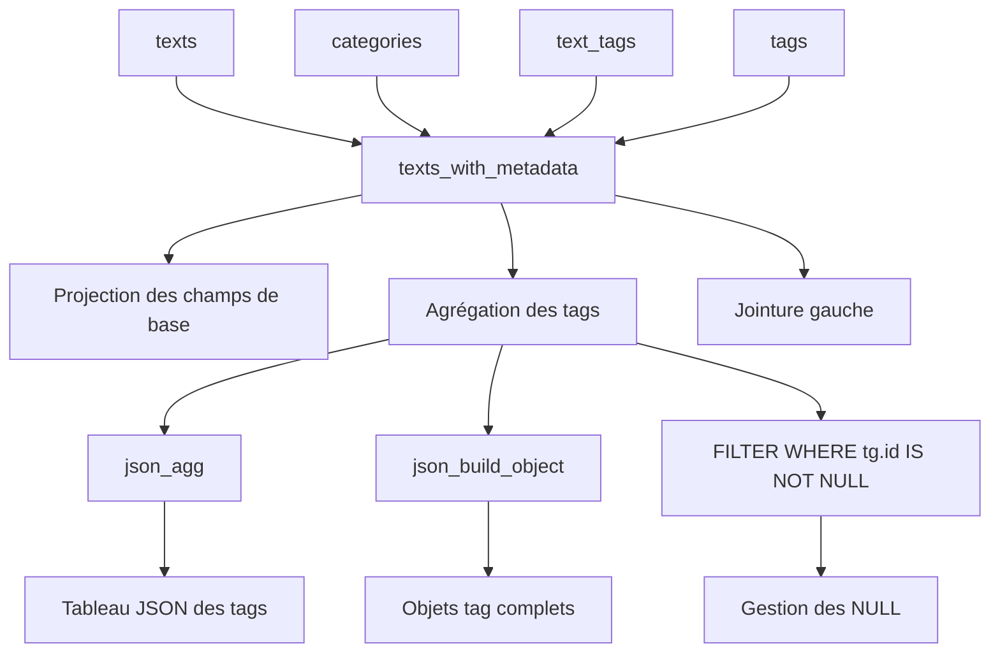
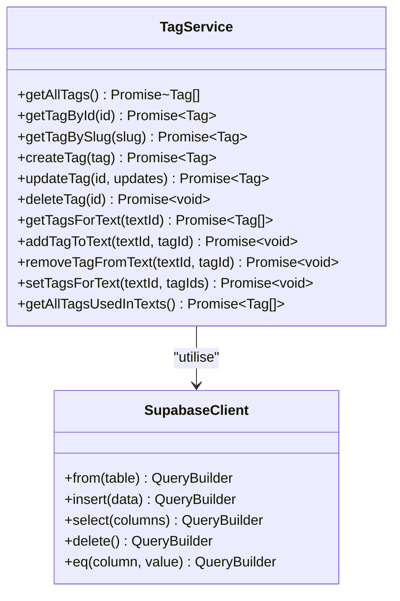
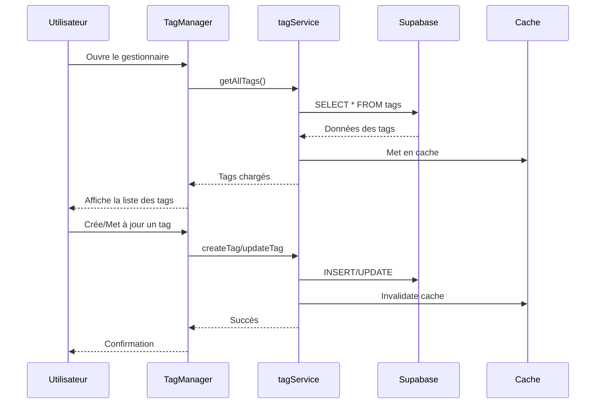
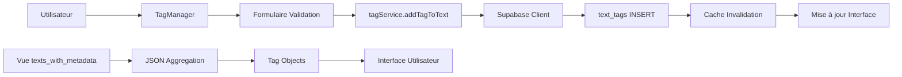
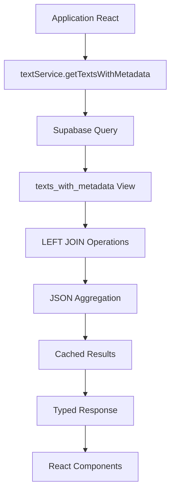

# Tags pour les Textes

<cite>
**Fichiers Référencés dans ce Document**
- [20250107_create_texts_system.sql](file://supabase/migrations/20250107_create_texts_system.sql)
- [20250107_create_texts_system_v2.sql](file://supabase/migrations/20250107_create_texts_system_v2.sql)
- [tagService.ts](file://services/tagService.ts)
- [TagManager.tsx](file://components/texts/TagManager.tsx)
- [supabaseClient.ts](file://lib/supabaseClient.ts)
- [texts_with_metadata](file://supabase/migrations/20250107_create_texts_system.sql#L285-L319)
- [textService.ts](file://services/textService.ts)
</cite>

## Table des Matières
1. [Introduction](#introduction)
2. [Structure de la Table text_tags](#structure-de-la-table-text_tags)
3. [Index et Performances](#index-et-performances)
4. [Vue texts_with_metadata](#vue-texts_with_metadata)
5. [Intégration avec le Service tagService](#intégration-avec-le-service-tagservice)
6. [Composant React TagManager](#composant-react-tagmanager)
7. [Exemples de Requêtes](#exemples-de-requêtes)
8. [Politiques de Sécurité RLS](#politiques-de-sécurité-rls)
9. [Architecture et Flux de Données](#architecture-et-flux-de-données)
10. [Conclusion](#conclusion)

## Introduction

La table `text_tags` constitue le cœur du système de classification des textes dans cette application. Elle implémente une relation many-to-many entre les entités `texts` et `tags`, permettant aux utilisateurs d'associer plusieurs tags à chaque texte et de regrouper les contenus selon différents thèmes ou catégories conceptuelles.

Cette architecture flexible permet une organisation dynamique des contenus sans contraintes de hiérarchie stricte, offrant une expérience utilisateur riche pour la navigation et la découverte de contenu.

## Structure de la Table text_tags

### Clés Primaires Composées

La table `text_tags` utilise une clé primaire composée formée des deux colonnes suivantes :

```mermaid
erDiagram
text_tags {
uuid text_id PK FK
uuid tag_id PK FK
timestamptz created_at
}
texts {
uuid id PK
text title
text content
uuid category_id FK
uuid user_id FK
boolean is_published
}
tags {
uuid id PK
text name
text slug
text color
}
text_tags ||--|| texts : "text_id"
text_tags ||--|| tags : "tag_id"
```

**Sources du diagramme**
- [20250107_create_texts_system.sql](file://supabase/migrations/20250107_create_texts_system.sql#L99-L104)
- [20250107_create_texts_system_v2.sql](file://supabase/migrations/20250107_create_texts_system_v2.sql#L187-L191)

### Contraintes de Référence

La table `text_tags` maintient des contraintes d'intégrité référentielle strictes :

- **text_id** : Référence vers `texts(id)` avec suppression en cascade (`ON DELETE CASCADE`)
- **tag_id** : Référence vers `tags(id)` avec suppression en cascade (`ON DELETE CASCADE`)

Ces contraintes garantissent que :
- Lorsqu'un texte est supprimé, toutes ses associations avec les tags sont automatiquement supprimées
- Lorsqu'un tag est supprimé, toutes les relations avec les textes sont également supprimées
- Les relations restent cohérentes même en cas de modifications simultanées

### Champ created_at

Le champ `created_at` enregistre automatiquement la date et heure de création de chaque association. Ce champ utilise le type `TIMESTAMPTZ` pour :
- Préserver la précision temporelle
- Gérer les fuseaux horaires automatiquement
- Faciliter les requêtes chronologiques

**Sources de la section**
- [20250107_create_texts_system.sql](file://supabase/migrations/20250107_create_texts_system.sql#L99-L104)
- [20250107_create_texts_system_v2.sql](file://supabase/migrations/20250107_create_texts_system_v2.sql#L187-L191)

## Index et Performances

### Index Primaire

L'index primaire composite sur `(text_id, tag_id)` optimise les opérations de recherche et de vérification d'existence :

```sql
PRIMARY KEY (text_id, tag_id)
```

### Index Secondaires

Deux index séparés améliorent les performances des requêtes fréquentes :

```sql
CREATE INDEX IF NOT EXISTS idx_text_tags_text_id ON text_tags(text_id);
CREATE INDEX IF NOT EXISTS idx_text_tags_tag_id ON text_tags(tag_id);
```

**Avantages des index :**
- **Recherche par texte** : Optimise les requêtes pour récupérer tous les tags d'un texte spécifique
- **Recherche par tag** : Améliore les performances des requêtes pour trouver tous les textes associés à un tag donné
- **Jointures** : Accélère les jointures avec les tables `texts` et `tags`

**Sources de la section**
- [20250107_create_texts_system.sql](file://supabase/migrations/20250107_create_texts_system.sql#L106-L108)
- [20250107_create_texts_system_v2.sql](file://supabase/migrations/20250107_create_texts_system_v2.sql#L194-L196)

## Vue texts_with_metadata

### Architecture de la Vue

La vue `texts_with_metadata` constitue le point central d'accès aux données des textes avec leurs métadonnées associées, incluant les tags sous forme de JSON.



**Sources du diagramme**
- [20250107_create_texts_system.sql](file://supabase/migrations/20250107_create_texts_system.sql#L285-L319)

### Agrégation des Tags

La vue utilise une agrégation sophistiquée pour transformer les relations multiples en un tableau JSON structuré :

```sql
COALESCE(
  json_agg(
    json_build_object(
      'id', tg.id,
      'name', tg.name,
      'slug', tg.slug,
      'color', tg.color
    )
  ) FILTER (WHERE tg.id IS NOT NULL),
  '[]'
) AS tags
```

**Caractéristiques de l'agrégation :**
- **json_agg** : Rassemble tous les tags associés en un tableau JSON
- **json_build_object** : Construit des objets tag avec propriétés structurées
- **FILTER WHERE** : Exclut les valeurs NULL pour éviter les entrées vides
- **COALESCE** : Retourne un tableau vide `'[]'` plutôt qu'un NULL quand aucun tag n'existe

### Requête de la Vue

La requête de la vue effectue des jointures gauche pour maintenir tous les textes, même ceux sans tags :

```sql
FROM texts t
LEFT JOIN categories c ON t.category_id = c.id
LEFT JOIN text_tags tt ON t.id = tt.text_id
LEFT JOIN tags tg ON tt.tag_id = tg.id
GROUP BY t.id, c.id, c.name, c.slug, c.color;
```

**Sources de la section**
- [20250107_create_texts_system.sql](file://supabase/migrations/20250107_create_texts_system.sql#L285-L319)
- [20250107_create_texts_system_v2.sql](file://supabase/migrations/20250107_create_texts_system_v2.sql#L239-L273)

## Intégration avec le Service tagService

### Architecture du Service

Le service `tagService` fournit une interface TypeScript-type-safe pour interagir avec la table `text_tags` et ses fonctionnalités associées.



**Sources du diagramme**
- [tagService.ts](file://services/tagService.ts#L1-L197)

### Méthodes Principales

#### Gestion des Tags pour Textes

Les méthodes principales permettent de manipuler les relations entre textes et tags :

- **getTagsForText(textId)** : Récupère tous les tags associés à un texte spécifique
- **addTagToText(textId, tagId)** : Ajoute un tag à un texte existant
- **removeTagFromText(textId, tagId)** : Supprime un tag d'un texte
- **setTagsForText(textId, tagIds)** : Remplace tous les tags d'un texte par une nouvelle liste

#### Logique de Validation

Le service implémente une logique de validation pour garantir que :
- Seuls les propriétaires peuvent modifier les tags des textes qu'ils possèdent
- Les opérations respectent les politiques de sécurité définies

**Sources de la section**
- [tagService.ts](file://services/tagService.ts#L101-L160)

## Composant React TagManager

### Architecture du Composant

Le composant `TagManager` offre une interface utilisateur complète pour la gestion des tags dans l'administration des textes.



**Sources du diagramme**
- [TagManager.tsx](file://components/texts/TagManager.tsx#L1-L339)

### Fonctionnalités du Composant

#### Interface de Gestion

Le composant propose :
- **Liste des tags existants** avec boutons d'édition et suppression
- **Formulaire de création/mise à jour** avec validation Zod
- **Sélecteur de couleurs** avec palette prédéfinie et sélection personnalisée
- **Gestion des erreurs** avec notifications Sonner

#### Gestion du Cache

Le composant intègre une stratégie de cache intelligente :
- **Cache session** pour les tags avec TTL de 10 minutes
- **Invalidation automatique** lors des modifications
- **Chargement conditionnel** basé sur le cache

**Sources de la section**
- [TagManager.tsx](file://components/texts/TagManager.tsx#L42-L339)

## Exemples de Requêtes

### Ajouter un Tag à un Texte

```sql
-- 1. Récupérer les IDs nécessaires
SELECT id FROM texts WHERE title = 'Titre du texte';
SELECT id FROM tags WHERE name = 'Nom du tag';

-- 2. Créer la relation
INSERT INTO text_tags (text_id, tag_id) 
VALUES ('UUID_DU_TEXTE', 'UUID_DU_TAG');

-- 3. Vérification
SELECT t.title, tg.name 
FROM texts t
JOIN text_tags tt ON t.id = tt.text_id
JOIN tags tg ON tt.tag_id = tg.id
WHERE t.id = 'UUID_DU_TEXTE';
```

### Récupérer Tous les Textes d'un Tag Spécifique

```sql
-- Méthode 1 : Via la vue texts_with_metadata
SELECT title, content, tags 
FROM texts_with_metadata
WHERE tags @> '[{"id": "UUID_DU_TAG"}]';

-- Méthode 2 : Requête directe
SELECT t.id, t.title, t.content 
FROM texts t
JOIN text_tags tt ON t.id = tt.text_id
WHERE tt.tag_id = 'UUID_DU_TAG'
AND t.is_published = true;
```

### Supprimer un Tag d'un Texte

```sql
-- Supprimer une relation spécifique
DELETE FROM text_tags 
WHERE text_id = 'UUID_DU_TEXTE' 
AND tag_id = 'UUID_DU_TAG';

-- Vérification de la suppression
SELECT count(*) 
FROM text_tags 
WHERE text_id = 'UUID_DU_TEXTE';
```

### Requête Avancée avec Agrégation

```sql
-- Trouver les tags les plus populaires
SELECT tg.id, tg.name, tg.slug, count(tt.text_id) as text_count
FROM tags tg
LEFT JOIN text_tags tt ON tg.id = tt.tag_id
GROUP BY tg.id, tg.name, tg.slug
ORDER BY text_count DESC;
```

**Sources de la section**
- [TEST_MIGRATION.md](file://TEST_MIGRATION.md#L152-L182)

## Politiques de Sécurité RLS

### Configuration RLS

La table `text_tags` bénéficie des mêmes politiques de sécurité que les autres tables du système :

```sql
ALTER TABLE text_tags ENABLE ROW LEVEL SECURITY;
```

### Politiques d'Accès

#### Lecture Publique
```sql
CREATE POLICY "Lecture publique des relations text_tags"
ON text_tags FOR SELECT USING (true);
```

#### Ajout de Tags
```sql
CREATE POLICY "Ajout de tags à ses propres textes"
ON text_tags FOR INSERT WITH CHECK (
  auth.role() = 'authenticated' AND
  EXISTS (
    SELECT 1 FROM texts 
    WHERE texts.id = text_tags.text_id 
    AND texts.user_id = auth.uid()
  )
);
```

#### Suppression de Tags
```sql
CREATE POLICY "Suppression de tags de ses propres textes"
ON text_tags FOR DELETE USING (
  EXISTS (
    SELECT 1 FROM texts 
    WHERE texts.id = text_tags.text_id 
    AND texts.user_id = auth.uid()
  )
);
```

### Fonctionnement de la Sécurité

1. **Authentification** : Seuls les utilisateurs authentifiés peuvent créer ou supprimer des relations
2. **Propriété** : Les utilisateurs ne peuvent modifier que les tags de leurs propres textes
3. **Audit** : Chaque opération est liée à l'utilisateur actuel via `auth.uid()`

**Sources de la section**
- [20250107_create_texts_system.sql](file://supabase/migrations/20250107_create_texts_system.sql#L197-L222)
- [20250107_create_texts_system_v2.sql](file://supabase/migrations/20250107_create_texts_system_v2.sql#L226-L234)

## Architecture et Flux de Données

### Flux de Création d'une Relation



### Flux de Récupération des Données



### Stratégie de Cache

Le système implémente une stratégie de cache en deux niveaux :
- **Cache Session** : Pour les tags avec TTL de 10 minutes
- **Cache Application** : Pour les données de textes avec TTL de 5 minutes

Cette approche optimise les performances tout en maintenant la cohérence des données.

**Sources de la section**
- [tagService.ts](file://services/tagService.ts#L1-L197)
- [textService.ts](file://services/textService.ts#L137-L187)

## Conclusion

La table `text_tags` représente un élément fondamental de l'architecture de classification des textes. Son implémentation sophistiquée combine :

- **Flexibilité** : Relation many-to-many permettant une organisation dynamique
- **Performance** : Index optimisés et agrégation JSON efficace
- **Sécurité** : Politiques RLS strictes avec validation de propriété
- **Expérience** : Interface utilisateur intuitive avec gestion de cache intelligente

Cette architecture soutient efficacement les besoins de navigation et de recherche dans un système de contenu riche, tout en maintenant la scalabilité et la maintenabilité du code.