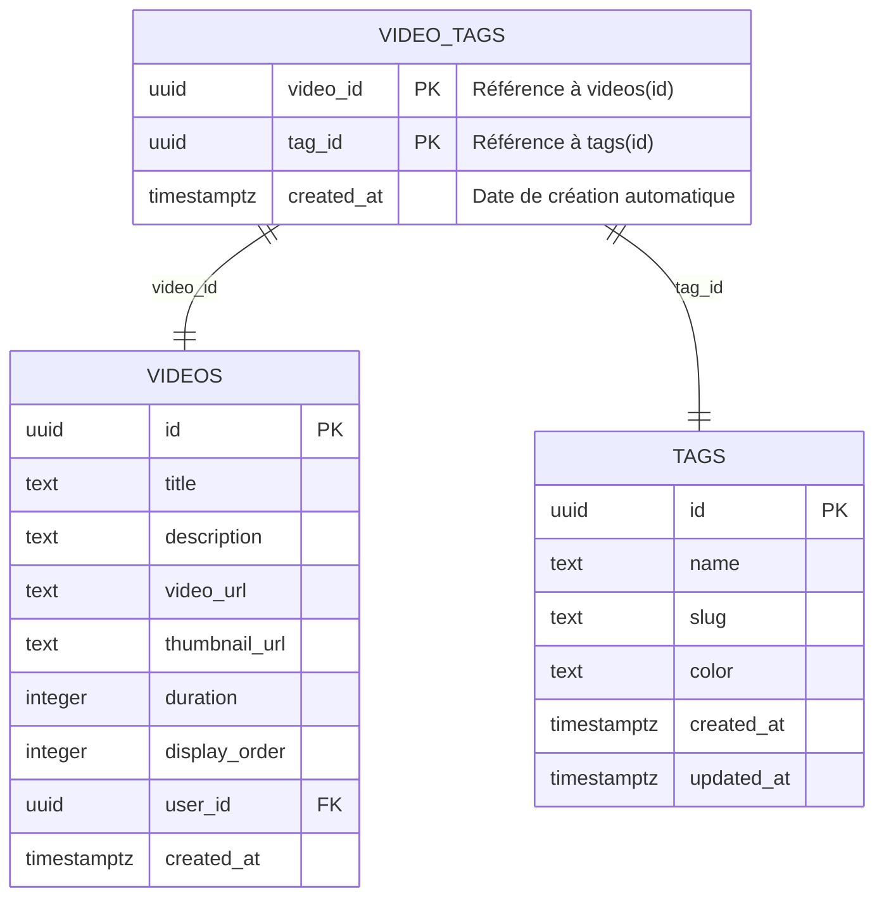
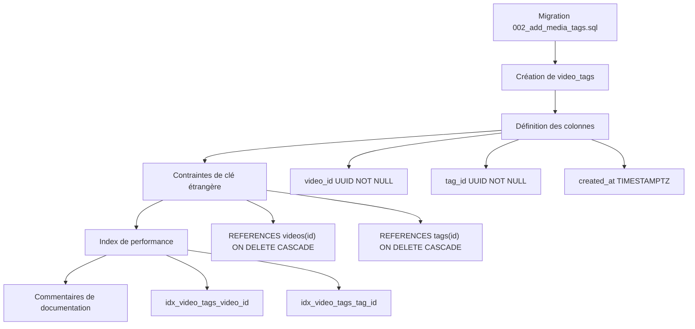
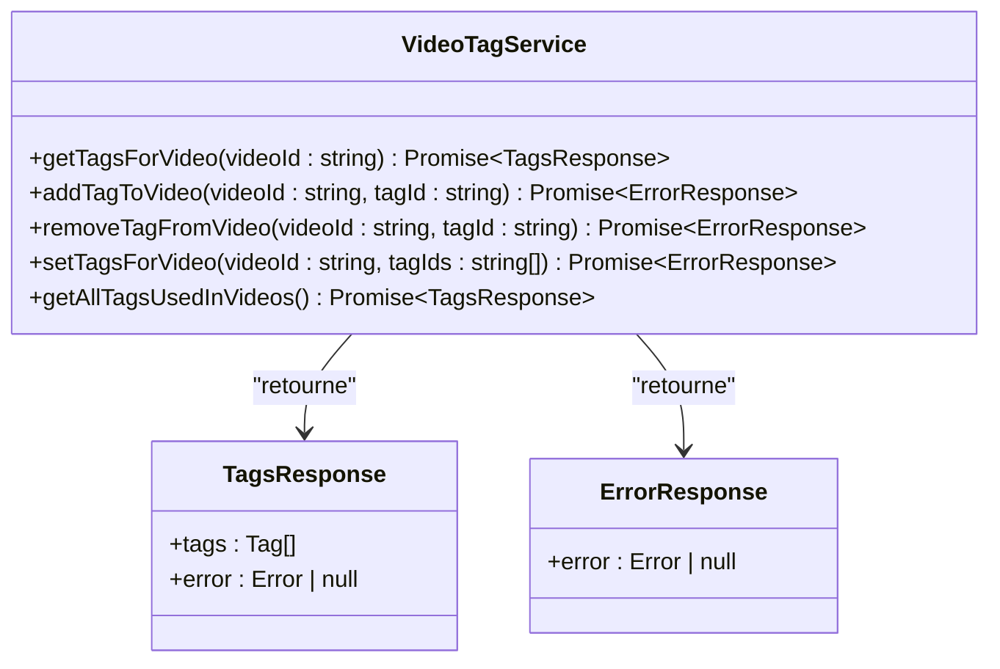
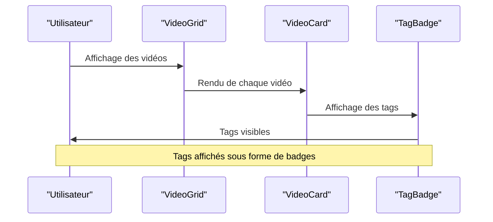
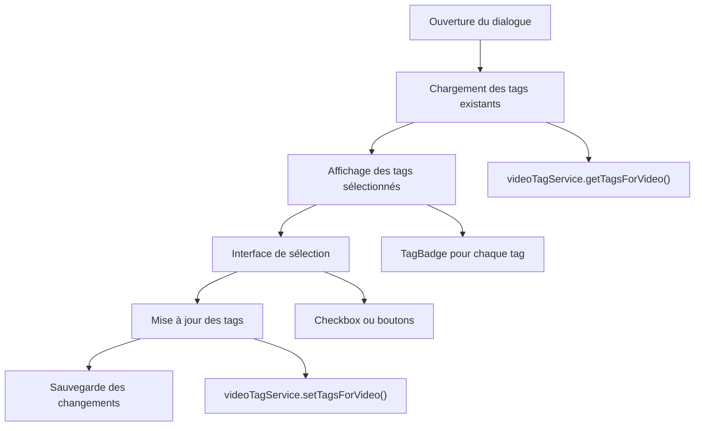
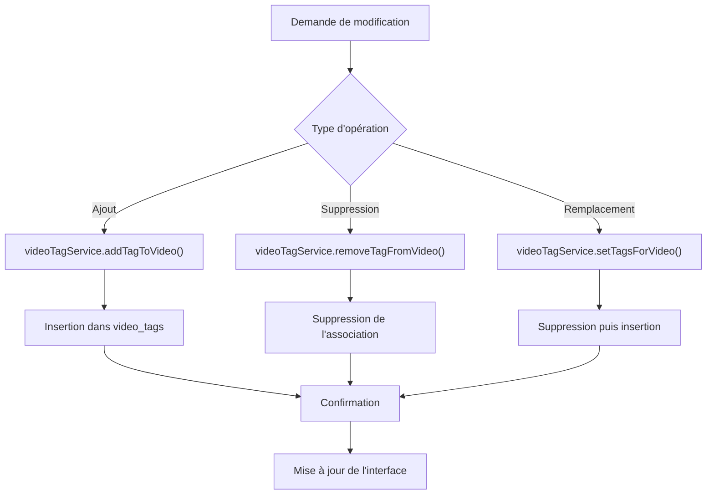

# Tags pour les Vidéos

<cite>
**Fichiers Référencés dans ce Document**
- [20251108071024_create_videos_system.sql](file://supabase/migrations/20251108071024_create_videos_system.sql)
- [002_add_media_tags.sql](file://supabase/migrations/002_add_media_tags.sql)
- [videoTagService.ts](file://services/videoTagService.ts)
- [videoService.ts](file://services/videoService.ts)
- [VideoGrid.tsx](file://components/videos/VideoGrid.tsx)
- [VideoCard.tsx](file://components/videos/VideoCard.tsx)
- [VideoEditDialog.tsx](file://components/videos/VideoEditDialog.tsx)
- [TagBadge.tsx](file://components/texts/TagBadge.tsx)
- [supabaseClient.ts](file://lib/supabaseClient.ts)
</cite>

## Table des Matières
1. [Introduction](#introduction)
2. [Structure de la Table](#structure-de-la-table)
3. [Schéma de la Base de Données](#schéma-de-la-base-de-données)
4. [Services Backend](#services-backend)
5. [Intégration Frontale](#intégration-frontale)
6. [Requêtes et Filtrage](#requêtes-et-filtrage)
7. [Gestion des Associations](#gestion-des-associations)
8. [Optimisations et Index](#optimisations-et-index)
9. [Exemples Pratiques](#exemples-pratiques)
10. [Conclusion](#conclusion)

## Introduction

La table `video_tags` constitue un système de relations many-to-many essentiel dans le portfolio pour organiser et catégoriser les vidéos. Cette table établit une liaison flexible entre les vidéos et les tags, permettant aux utilisateurs de classer et de rechercher du contenu vidéo selon différents critères thématiques.

Le système de tags offre plusieurs avantages :
- **Flexibilité** : Une vidéo peut avoir plusieurs tags, et un tag peut être associé à plusieurs vidéos
- **Recherche** : Permet de filtrer et de découvrir du contenu similaire
- **Organisation** : Facilite la navigation et la découverte de contenu
- **Scalabilité** : Évolue avec la collection de vidéos sans nécessiter de modifications structurelles

## Structure de la Table

### Colonnes Principales

La table `video_tags` possède trois colonnes principales qui définissent sa structure et ses contraintes :



**Sources de Diagramme**
- [002_add_media_tags.sql](file://supabase/migrations/002_add_media_tags.sql#L18-L24)
- [supabaseClient.ts](file://lib/supabaseClient.ts#L91-L95)

### Contraintes de Clé Étrangère

Chaque colonne de la table `video_tags` dispose de contraintes de référence strictes :

| Colonne | Type | Contrainte | Description |
|---------|------|------------|-------------|
| `video_id` | UUID | `NOT NULL` | Référence obligatoire vers `videos(id)` |
| `tag_id` | UUID | `NOT NULL` | Référence obligatoire vers `tags(id)` |
| `created_at` | TIMESTAMPTZ | `NOT NULL DEFAULT NOW()` | Timestamp automatique de création |

### Suppression en Cascade

La contrainte `ON DELETE CASCADE` garantit la cohérence des données :
- **Suppression d'une vidéo** : Toutes les entrées `video_tags` associées sont automatiquement supprimées
- **Suppression d'un tag** : Toutes les associations avec des vidéos sont également supprimées

**Sources de Section**
- [002_add_media_tags.sql](file://supabase/migrations/002_add_media_tags.sql#L20-L21)
- [002_add_media_tags.sql](file://supabase/migrations/002_add_media_tags.sql#L30-L31)

## Schéma de la Base de Données

### Création de la Table

La table `video_tags` est créée via la migration `002_add_media_tags.sql` avec les spécifications suivantes :



**Sources de Diagramme**
- [002_add_media_tags.sql](file://supabase/migrations/002_add_media_tags.sql#L18-L28)

### Structure TypeScript

La table est typée dans le client Supabase avec l'interface `VideoTag` :

**Sources de Section**
- [supabaseClient.ts](file://lib/supabaseClient.ts#L91-L95)

## Services Backend

### Service videoTagService

Le service `videoTagService` fournit toutes les opérations CRUD pour la gestion des tags de vidéos :



**Sources de Diagramme**
- [videoTagService.ts](file://services/videoTagService.ts#L3-L106)

### Opérations Principales

#### 1. Récupération des Tags d'une Vidéo

La fonction `getTagsForVideo` permet de récupérer tous les tags associés à une vidéo spécifique :

**Sources de Section**
- [videoTagService.ts](file://services/videoTagService.ts#L7-L16)

#### 2. Gestion des Associations

Les fonctions `addTagToVideo`, `removeTagFromVideo` et `setTagsForVideo` permettent de manipuler les associations :

**Sources de Section**
- [videoTagService.ts](file://services/videoTagService.ts#L22-L68)

#### 3. Liste des Tags Utilisés

La fonction `getAllTagsUsedInVideos` retourne tous les tags uniques utilisés dans les vidéos :

**Sources de Section**
- [videoTagService.ts](file://services/videoTagService.ts#L75-L104)

**Sources de Section**
- [videoTagService.ts](file://services/videoTagService.ts#L1-L106)

## Intégration Frontale

### Composant VideoGrid

Le composant `VideoGrid` affiche une grille de vidéos avec intégration des tags :



**Sources de Diagramme**
- [VideoGrid.tsx](file://components/videos/VideoGrid.tsx#L24-L32)
- [VideoCard.tsx](file://components/videos/VideoCard.tsx#L1-L75)

### Composant VideoEditDialog

Le dialogue d'édition de vidéo intègre la gestion des tags :



**Sources de Diagramme**
- [VideoEditDialog.tsx](file://components/videos/VideoEditDialog.tsx#L41-L91)

### Composant TagBadge

Le composant `TagBadge` affiche les tags avec leur couleur :

**Sources de Section**
- [TagBadge.tsx](file://components/texts/TagBadge.tsx#L15-L52)

**Sources de Section**
- [VideoGrid.tsx](file://components/videos/VideoGrid.tsx#L1-L43)
- [VideoEditDialog.tsx](file://components/videos/VideoEditDialog.tsx#L41-L91)
- [TagBadge.tsx](file://components/texts/TagBadge.tsx#L1-L53)

## Requêtes et Filtrage

### Requêtes de Base

#### Récupération des Tags d'une Vidéo

```typescript
// Exemple d'utilisation du service
const { tags, error } = await videoTagService.getTagsForVideo('video-id-uuid');
```

#### Requête SQL Directe

```sql
SELECT tag_id, tags.*
FROM video_tags
JOIN tags ON video_tags.tag_id = tags.id
WHERE video_id = 'video-id-uuid';
```

### Filtrage par Tags

#### Liste des Vidéos par Tag

```typescript
// Via le service
const { videos, error } = await videoService.getAllVideosWithTags();
const filteredVideos = videos.filter(video => 
  video.tags.some(tag => tag.id === 'tag-id-uuid')
);
```

#### Requête SQL pour Filtrage

```sql
SELECT v.*
FROM videos v
JOIN video_tags vt ON v.id = vt.video_id
WHERE vt.tag_id = 'tag-id-uuid'
ORDER BY v.display_order ASC;
```

### Requêtes Avancées

#### Tags Utilisés dans les Vidéos

```typescript
// Récupération de tous les tags utilisés
const { tags } = await videoTagService.getAllTagsUsedInVideos();
```

#### Requête SQL pour Tags Uniques

```sql
SELECT DISTINCT t.*
FROM tags t
JOIN video_tags vt ON t.id = vt.tag_id
ORDER BY t.name ASC;
```

**Sources de Section**
- [videoTagService.ts](file://services/videoTagService.ts#L7-L16)
- [videoTagService.ts](file://services/videoTagService.ts#L75-L104)
- [videoService.ts](file://services/videoService.ts#L21-L47)

## Gestion des Associations

### Création d'Associations

#### Ajout Simple d'un Tag

```typescript
// Ajout d'un seul tag
await videoTagService.addTagToVideo(videoId, tagId);
```

#### Remplacement Complexe

```typescript
// Remplacement de tous les tags
await videoTagService.setTagsForVideo(videoId, ['tag1', 'tag2', 'tag3']);
```

### Suppression d'Associations

#### Suppression d'un Tag Unique

```typescript
// Suppression d'un tag spécifique
await videoTagService.removeTagFromVideo(videoId, tagId);
```

#### Nettoyage Complet

```typescript
// Suppression de tous les tags existants
await videoTagService.setTagsForVideo(videoId, []);
```

### Flux de Gestion



**Sources de Diagramme**
- [videoTagService.ts](file://services/videoTagService.ts#L22-L68)

**Sources de Section**
- [videoTagService.ts](file://services/videoTagService.ts#L22-L68)

## Optimisations et Index

### Index de Performance

La table `video_tags` bénéficie de deux index clés pour optimiser les requêtes :

| Index | Colonne | But |
|-------|---------|-----|
| `idx_video_tags_video_id` | `video_id` | Optimise les requêtes par vidéo |
| `idx_video_tags_tag_id` | `tag_id` | Optimise les requêtes par tag |

### Stratégies d'Optimisation

#### 1. Index Composites

Bien que l'index composite `(video_id, tag_id)` soit défini comme clé primaire, les index séparés permettent :
- Requêtes efficaces par vidéo seule
- Requêtes efficaces par tag seul
- Amélioration des performances de jointure

#### 2. Jointures Optimisées

```sql
-- Requête optimisée grâce aux index
EXPLAIN ANALYZE
SELECT v.*, t.*
FROM videos v
JOIN video_tags vt ON v.id = vt.video_id
JOIN tags t ON vt.tag_id = t.id
WHERE v.id = 'video-id-uuid';
```

#### 3. Cache des Résultats

Le service implémente une logique de cache pour éviter les requêtes répétitives :

**Sources de Section**
- [002_add_media_tags.sql](file://supabase/migrations/002_add_media_tags.sql#L26-L27)

## Exemples Pratiques

### Scénario 1 : Ajout de Tags à une Vidéo

```typescript
// Étape 1 : Récupération des tags existants
const { tags: existingTags } = await videoTagService.getTagsForVideo(videoId);

// Étape 2 : Ajout de nouveaux tags
const newTags = ['tag1', 'tag2'];
for (const tagId of newTags) {
  await videoTagService.addTagToVideo(videoId, tagId);
}

// Étape 3 : Mise à jour de l'interface
const { tags: updatedTags } = await videoTagService.getTagsForVideo(videoId);
```

### Scénario 2 : Filtrage de Vidéos par Tag

```typescript
// Récupération de toutes les vidéos avec leurs tags
const { videos } = await videoService.getAllVideosWithTags();

// Filtrage par tag spécifique
const filteredVideos = videos.filter(video => 
  video.tags.some(tag => tag.name === 'JavaScript')
);
```

### Scénario 3 : Gestion des Tags dans l'Édition

```typescript
// Chargement des données existantes
async function loadVideoData(videoId: string) {
  const { tags } = await videoTagService.getTagsForVideo(videoId);
  const selectedTagIds = tags.map(tag => tag.id);
  
  // Préparation des données pour le formulaire
  return { selectedTagIds, allTags };
}

// Sauvegarde des modifications
async function saveVideoTags(videoId: string, tagIds: string[]) {
  await videoTagService.setTagsForVideo(videoId, tagIds);
}
```

### Scénario 4 : Analytics des Tags

```typescript
// Analyse de popularité des tags
const { tags } = await videoTagService.getAllTagsUsedInVideos();
const tagPopularity = tags.map(tag => ({
  name: tag.name,
  count: videos.filter(v => v.tags.some(t => t.id === tag.id)).length
}));
```

**Sources de Section**
- [videoTagService.ts](file://services/videoTagService.ts#L22-L68)
- [videoService.ts](file://services/videoService.ts#L21-L47)

## Conclusion

La table `video_tags` représente un élément fondamental de l'architecture du système de gestion des vidéos. Elle offre :

### Avantages Clés

1. **Flexibilité** : Modélisation many-to-many permettant une organisation riche
2. **Performance** : Index optimisés pour les requêtes fréquentes
3. **Cohérence** : Contraintes référentielles garantissant l'intégrité des données
4. **Extensibilité** : Architecture modulaire facilitant l'évolution future

### Bonnes Pratiques

- Toujours utiliser le service `videoTagService` pour les opérations
- Implémenter la gestion d'erreurs appropriée
- Utiliser les index pour les requêtes complexes
- Maintenir la synchronisation entre backend et frontend

### Perspectives d'Évolution

Le système peut facilement être étendu pour inclure :
- Tags hiérarchiques
- Métadonnées supplémentaires sur les associations
- Système de recommandations basé sur les tags
- Analytics avancés sur les tendances de tagging

Cette architecture robuste constitue une base solide pour la gestion de contenu vidéo structurée et découvrable.