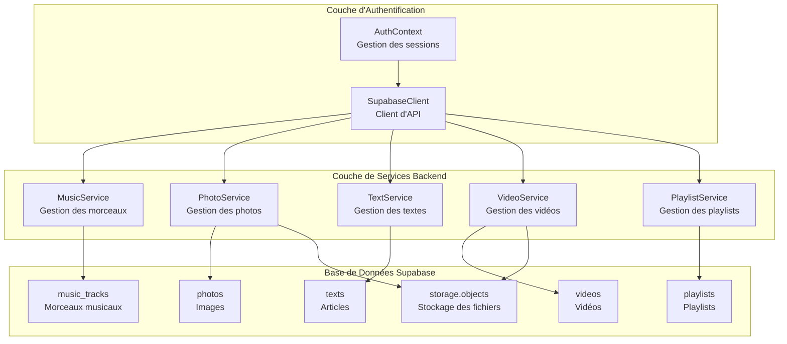
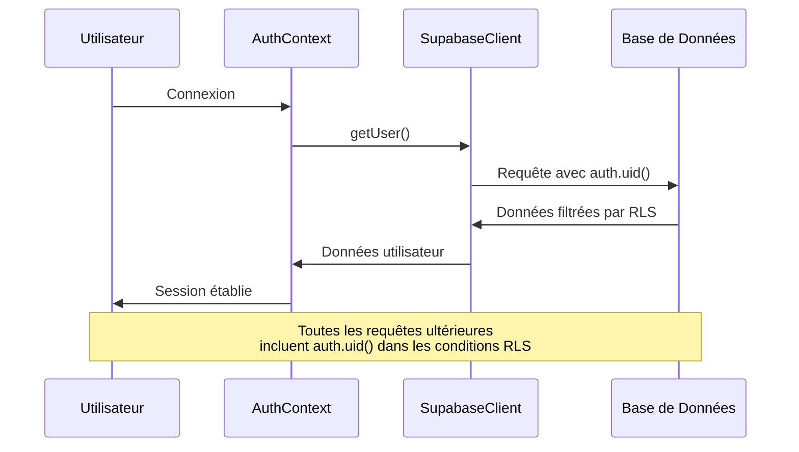
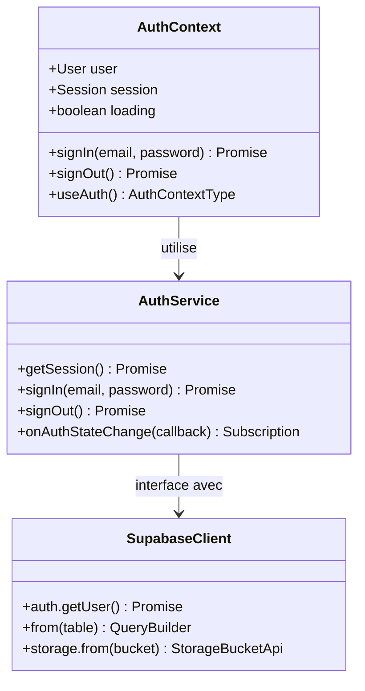
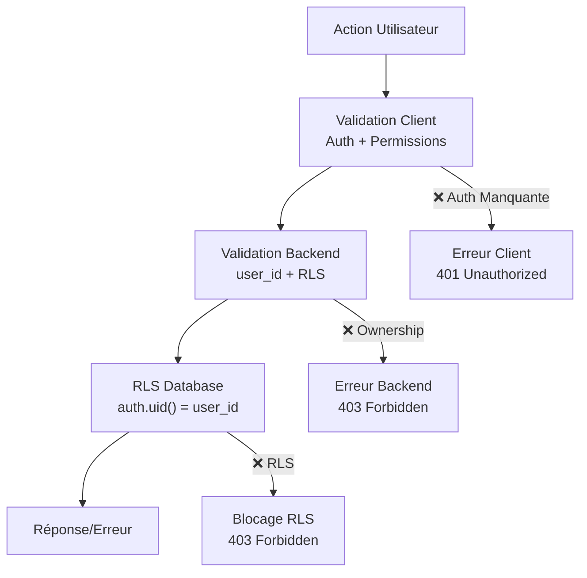

# Sécurité RLS (Row Level Security)

<cite>
**Fichiers Référencés dans ce Document**
- [20250111_add_security_constraints.sql](file://supabase/migrations/20250111_add_security_constraints.sql)
- [20250107_create_texts_system.sql](file://supabase/migrations/20250107_create_texts_system.sql)
- [20251108071024_create_videos_system.sql](file://supabase/migrations/20251108071024_create_videos_system.sql)
- [20251111050910_create_playlists_system.sql](file://supabase/migrations/20251111050910_create_playlists_system.sql)
- [AuthContext.tsx](file://contexts/AuthContext.tsx)
- [supabaseClient.ts](file://lib/supabaseClient.ts)
- [musicService.ts](file://services/musicService.ts)
- [photoService.ts](file://services/photoService.ts)
- [textService.ts](file://services/textService.ts)
- [videoService.ts](file://services/videoService.ts)
- [playlistService.ts](file://services/playlistService.ts)
</cite>

## Table des Matières
1. [Introduction](#introduction)
2. [Architecture de Sécurité RLS](#architecture-de-sécurité-rls)
3. [Politiques RLS par Table](#politiques-rls-par-table)
4. [Intégration avec l'Authentification](#intégration-avec-lauthentification)
5. [Scénarios de Sécurité](#scénarios-de-sécurité)
6. [Services Backend et RLS](#services-backend-et-rls)
7. [Dépannage et Erreurs Courantes](#dépannage-et-erreurs-courantes)
8. [Bonnes Pratiques](#bonnes-pratiques)

## Introduction

La sécurité Row Level Security (RLS) dans Supabase constitue le mécanisme principal de contrôle d'accès aux données dans cette application portfolio. Cette documentation détaille les politiques de sécurité mises en place pour protéger l'accès aux différentes ressources (photos, musiques, textes, vidéos, playlists) tout en maintenant une expérience utilisateur fluide.

Les politiques RLS sont conçues selon le principe de "privilège minimal" : chaque utilisateur ne peut accéder ou modifier que les données qui lui appartiennent ou qui sont explicitement rendues publiques par les propriétaires.

## Architecture de Sécurité RLS

### Composants Principaux



**Sources du Diagramme**
- [AuthContext.tsx](file://contexts/AuthContext.tsx#L1-L71)
- [supabaseClient.ts](file://lib/supabaseClient.ts#L1-L344)

### Flux d'Authentification et RLS



**Sources du Diagramme**
- [AuthContext.tsx](file://contexts/AuthContext.tsx#L22-L37)
- [supabaseClient.ts](file://lib/supabaseClient.ts#L10-L16)

**Sources de Section**
- [AuthContext.tsx](file://contexts/AuthContext.tsx#L1-L71)
- [supabaseClient.ts](file://lib/supabaseClient.ts#L1-L344)

## Politiques RLS par Table

### Table `photos`

Les politiques RLS pour la table `photos` garantissent que seuls les utilisateurs authentifiés peuvent gérer leurs propres images.

| Opération | Condition d'Accès | Rôle Concerné | Logique de Sécurité |
|-----------|------------------|---------------|-------------------|
| SELECT | `auth.uid() = user_id` ou `true` | public | Lecture publique des photos publiées + accès personnel |
| INSERT | `auth.uid() = user_id` | authenticated | Création réservée aux propriétaires |
| UPDATE | `auth.uid() = user_id` | authenticated | Modification réservée aux propriétaires |
| DELETE | `auth.uid() = user_id` | authenticated | Suppression réservée aux propriétaires |

**Exemples de Scénarios :**
- ✅ **Autorisé** : Utilisateur 123 consulte sa propre photo
- ✅ **Autorisé** : Utilisateur 123 modifie sa propre photo
- ❌ **Bloqué** : Utilisateur 456 essaie de modifier la photo de l'utilisateur 123
- ✅ **Autorisé** : Utilisateur non-authentifié lit les photos publiées

**Sources de Section**
- [20250111_add_security_constraints.sql](file://supabase/migrations/20250111_add_security_constraints.sql#L191-L219)
- [photoService.ts](file://services/photoService.ts#L106-L115)

### Table `music_tracks`

Les politiques pour `music_tracks` suivent le même modèle de sécurité que `photos`, avec gestion des métadonnées audio.

| Opération | Condition d'Accès | Rôle Concerné | Logique de Sécurité |
|-----------|------------------|---------------|-------------------|
| SELECT | `auth.uid() = user_id` | authenticated | Accès aux morceaux personnels |
| INSERT | `auth.uid() = user_id` | authenticated | Création de morceaux personnels |
| UPDATE | `auth.uid() = user_id` | authenticated | Modification de morceaux personnels |
| DELETE | `auth.uid() = user_id` | authenticated | Suppression de morceaux personnels |

**Sources de Section**
- [20250111_add_security_constraints.sql](file://supabase/migrations/20250111_add_security_constraints.sql#L219-L248)
- [musicService.ts](file://services/musicService.ts#L99-L132)

### Table `texts`

Les politiques pour `texts` sont plus sophistiquées, distinguant entre contenu publié et privé.

| Opération | Condition d'Accès | Rôle Concerné | Logique de Sécurité |
|-----------|------------------|---------------|-------------------|
| SELECT | `is_published = true` ou `auth.uid() = user_id` | public/authenticated | Lecture publique + accès personnel |
| INSERT | `auth.uid() = user_id` | authenticated | Création de textes personnels |
| UPDATE | `auth.uid() = user_id` | authenticated | Modification de textes personnels |
| DELETE | `auth.uid() = user_id` | authenticated | Suppression de textes personnels |

**Scénarios Avancés :**
- ✅ **Publié** : Tout le monde peut lire les articles publiés
- ✅ **Privé** : Propriétaire peut lire ses propres articles non publiés
- ❌ **Non-propriétaire** : Utilisateur différent ne peut pas lire article privé
- ✅ **Modification** : Propriétaire peut modifier son propre article

**Sources de Section**
- [20250107_create_texts_system.sql](file://supabase/migrations/20250107_create_texts_system.sql#L166-L192)
- [textService.ts](file://services/textService.ts#L52-L86)

### Table `videos`

Politiques similaires à `photos`, adaptées au contenu vidéo.

| Opération | Condition d'Accès | Rôle Concerné | Logique de Sécurité |
|-----------|------------------|---------------|-------------------|
| SELECT | `true` | public | Lecture publique totale |
| INSERT | `auth.uid() = user_id` | authenticated | Création de vidéos personnelles |
| UPDATE | `auth.uid() = user_id` | authenticated | Modification de vidéos personnelles |
| DELETE | `auth.uid() = user_id` | authenticated | Suppression de vidéos personnelles |

**Sources de Section**
- [20251108071024_create_videos_system.sql](file://supabase/migrations/20251108071024_create_videos_system.sql#L51-L74)
- [videoService.ts](file://services/videoService.ts#L82-L113)

### Table `playlists`

Politiques avancées pour la gestion des playlists musicales.

| Opération | Condition d'Accès | Rôle Concerné | Logique de Sécurité |
|-----------|------------------|---------------|-------------------|
| SELECT | `is_public = true OR user_id = auth.uid()` | public/authenticated | Public + accès personnel |
| INSERT | `user_id = auth.uid()` | authenticated | Création de playlists personnelles |
| UPDATE | `user_id = auth.uid()` | authenticated | Modification de playlists personnelles |
| DELETE | `user_id = auth.uid()` | authenticated | Suppression de playlists personnelles |

**Sources de Section**
- [20251111050910_create_playlists_system.sql](file://supabase/migrations/20251111050910_create_playlists_system.sql#L56-L89)
- [playlistService.ts](file://services/playlistService.ts#L15-L50)

### Tables de Relations (text_tags, music_tags, video_tags, photo_tags)

Tables de liaison avec contrôles d'accès basés sur les propriétés des entités parentes.

**Sources de Section**
- [20250107_create_texts_system.sql](file://supabase/migrations/20250107_create_texts_system.sql#L202-L222)

## Intégration avec l'Authentification

### Contexte d'Authentification

Le système utilise `AuthContext` pour gérer l'état d'authentification global et fournir l'accès aux informations utilisateur à travers toute l'application.



**Sources du Diagramme**
- [AuthContext.tsx](file://contexts/AuthContext.tsx#L7-L13)
- [supabaseClient.ts](file://lib/supabaseClient.ts#L10-L16)

### Mécanisme d'Authentification

L'authentification fonctionne via `auth.uid()` injecté automatiquement dans les politiques RLS :

1. **Connexion** : L'utilisateur s'authentifie via `AuthContext`
2. **Token JWT** : Supabase génère un token contenant `user_id`
3. **Injection RLS** : Chaque requête inclut `auth.uid()` dans les conditions
4. **Filtrage** : Les politiques RLS filtrent les résultats selon `user_id`

**Sources de Section**
- [AuthContext.tsx](file://contexts/AuthContext.tsx#L1-L71)
- [supabaseClient.ts](file://lib/supabaseClient.ts#L1-L344)

## Scénarios de Sécurité

### Accès Public en Lecture

**Cas d'Usage** : Publication de contenu pour un public large.

```sql
-- Exemple de politique pour les textes publiés
CREATE POLICY "Tout le monde peut lire les textes publiés"
  ON texts FOR SELECT
  USING (is_published = true);
```

**Implémentation** :
- **Authorized** : Tout visiteur peut lire les articles publiés
- **Unauthorized** : Contenu privé restreint aux propriétaires
- **Cache** : Les contenus publics peuvent être mis en cache

### Accès Privé en Écriture

**Cas d'Usage** : Gestion de contenu personnel.

```sql
-- Exemple de politique pour les morceaux personnels
CREATE POLICY "Utilisateurs peuvent modifier leurs propres morceaux"
  ON music_tracks FOR UPDATE
  USING (auth.uid() = user_id);
```

**Implémentation** :
- **Authorized** : Propriétaire peut créer, modifier, supprimer ses données
- **Unauthorized** : Autres utilisateurs reçoivent des erreurs d'autorisation
- **Validation** : Les services backend valident également l'ownership

### Gestion des Contenus Publiés vs Non Publiés

**Stratégie Hybride** :
- **Contenu Public** : Visible par tous (`is_published = true`)
- **Contenu Privé** : Restreint aux propriétaires (`user_id = auth.uid()`)
- **Transitions** : Possibilité de basculer entre statuts

**Sources de Section**
- [20250107_create_texts_system.sql](file://supabase/migrations/20250107_create_texts_system.sql#L168-L176)

## Services Backend et RLS

### Validation côté Client

Chaque service backend valide l'authentification avant d'envoyer des requêtes vers Supabase :

```typescript
// Exemple de validation dans musicService.ts
const { data: { user }, error: authError } = await supabaseClient.auth.getUser();
if (authError || !user) {
  return {
    track: null,
    error: {
      message: 'Vous devez être connecté pour ajouter un morceau',
      code: 'NOT_AUTHENTICATED',
    }
  };
}
```

### Injection automatique du user_id

Les services backend injectent automatiquement `user_id` lors de la création :

```typescript
// Injection automatique dans photoService.ts
const photoWithUser = {
  ...photo,
  user_id: userId, // userId peut être fourni ou récupéré depuis auth
};
```

### Flux de Validation Multi-niveaux



**Sources du Diagramme**
- [musicService.ts](file://services/musicService.ts#L99-L132)
- [photoService.ts](file://services/photoService.ts#L106-L115)

**Sources de Section**
- [musicService.ts](file://services/musicService.ts#L99-L132)
- [photoService.ts](file://services/photoService.ts#L106-L115)
- [textService.ts](file://services/textService.ts#L52-L86)

## Dépannage et Erreurs Courantes

### Erreurs de Permission Communes

| Code d'Erreur | Cause | Solution |
|---------------|-------|----------|
| `401` | Utilisateur non authentifié | Rediriger vers `/login` |
| `403` | Violation RLS (ownership) | Vérifier l'ownership avant action |
| `42501` | Policy RLS refusée | Vérifier les conditions de politique |
| `400` | Données invalides | Valider les contraintes avant insertion |

### Diagnostic des Problèmes

**Étapes de Dépannage** :

1. **Vérifier l'Authentification** :
   ```typescript
   const { data: { user } } = await supabaseClient.auth.getUser();
   console.log('Utilisateur connecté:', user);
   ```

2. **Tester les Politiques** :
   ```sql
   -- Tester SELECT
   SELECT * FROM music_tracks WHERE id = 'some-id';
   
   -- Tester UPDATE
   UPDATE music_tracks SET title = 'new-title' WHERE id = 'some-id';
   ```

3. **Vérifier les Conditions RLS** :
   ```sql
   -- Voir les politiques actives
   SELECT * FROM pg_policies WHERE tablename = 'music_tracks';
   ```

### Messages d'Erreur Personnalisés

```typescript
// Exemple de gestion d'erreur dans les services
if (error?.code === '42501') {
  return {
    error: {
      message: 'Vous n\'avez pas la permission d\'effectuer cette action',
      hint: 'Seul le propriétaire peut modifier cette ressource'
    }
  };
}
```

**Sources de Section**
- [musicService.ts](file://services/musicService.ts#L167-L172)
- [photoService.ts](file://services/photoService.ts#L118-L123)

## Bonnes Pratiques

### Conception des Politiques RLS

1. **Principe de Moindre Privilège** : Ne donner accès qu'au strict nécessaire
2. **Validation Multi-niveaux** : Valider côté client et serveur
3. **Auditabilité** : Logguer les tentatives d'accès
4. **Testabilité** : Tester toutes les combinaisons d'utilisateurs

### Optimisation des Performances

1. **Index appropriés** : Créer des index sur `user_id`
2. **Cache intelligent** : Mettre en cache les données publiques
3. **Requêtes optimisées** : Limiter les jointures complexes
4. **Pagination** : Implémenter la pagination pour éviter les requêtes volumineuses

### Maintenance et Monitoring

1. **Surveillance des Erreurs** : Monitorer les violations RLS
2. **Tests Automatisés** : Valider les politiques régulièrement
3. **Documentation** : Maintenir la documentation des politiques
4. **Audits de Sécurité** : Revue périodique des politiques

### Exemples de Politiques Robustes

```sql
-- Politique robuste avec validation supplémentaire
CREATE POLICY "Utilisateurs peuvent gérer leurs playlists"
  ON playlists
  FOR ALL
  USING (
    user_id = auth.uid()
    AND created_at > now() - interval '1 hour' -- Limite temporelle
    AND (is_public = false OR auth.uid() = ANY(public_access_users)) -- Accès public
  )
  WITH CHECK (
    user_id = auth.uid()
    AND NOT is_locked -- État verrouillé
  );
```

Cette approche garantit une sécurité robuste tout en maintenant une expérience utilisateur fluide, constituant la fondation de la sécurité de l'application portfolio.