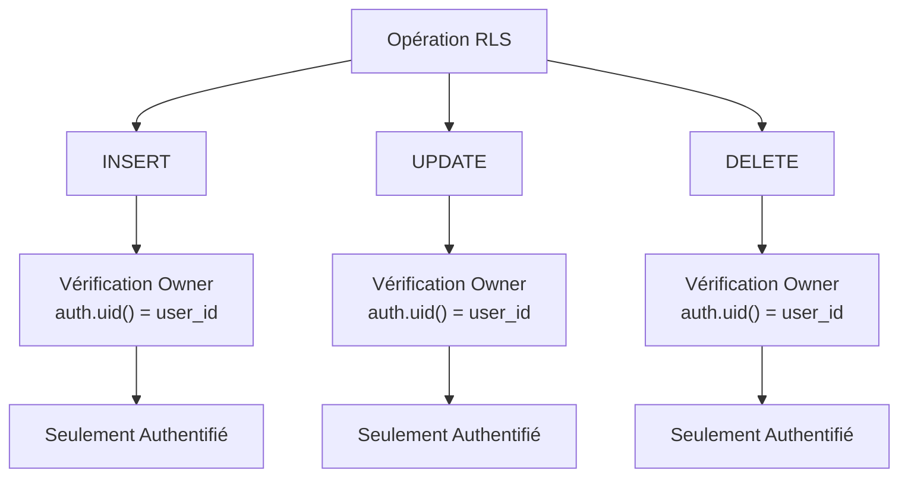
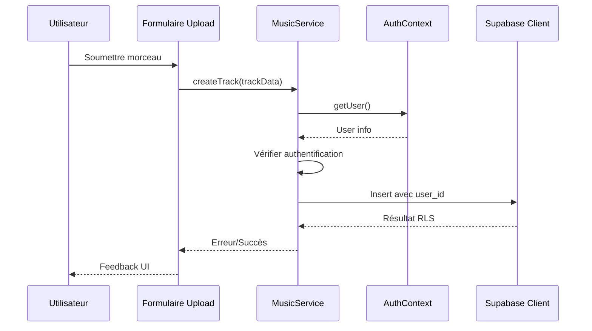
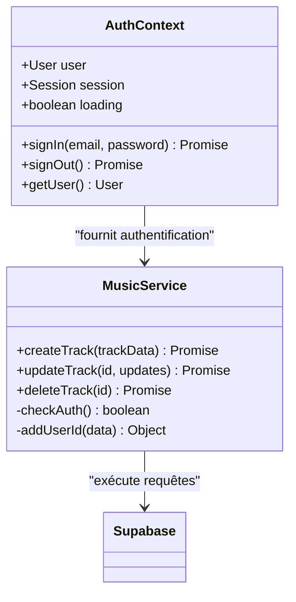
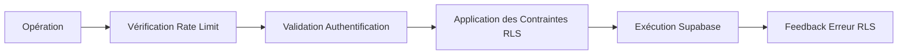
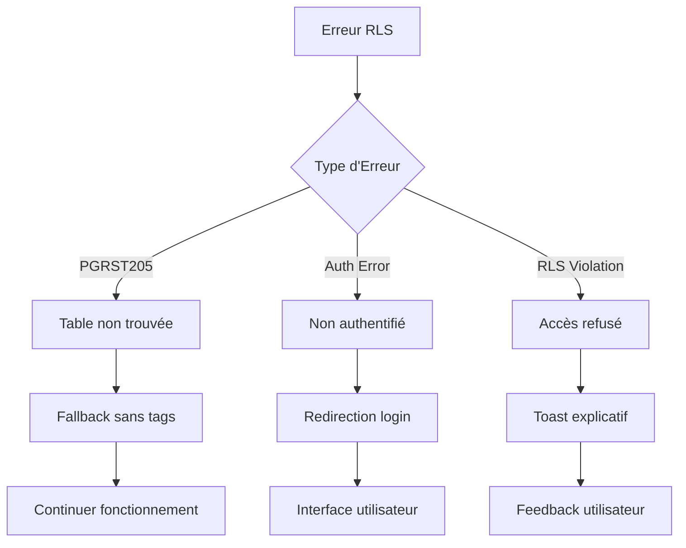

# Sécurité RLS - Table Music Tracks

<cite>
**Fichiers Référencés dans ce Document**
- [20251106095111_create_music_tracks_table.sql](file://supabase/migrations/20251106095111_create_music_tracks_table.sql)
- [20250111_add_security_constraints.sql](file://supabase/migrations/20250111_add_security_constraints.sql)
- [musicService.ts](file://services/musicService.ts)
- [AuthContext.tsx](file://contexts/AuthContext.tsx)
- [MusicUploadForm.tsx](file://components/music/MusicUploadForm.tsx)
- [TrackEditDialog.tsx](file://components/music/TrackEditDialog.tsx)
- [TrackListAdmin.tsx](file://components/music/TrackListAdmin.tsx)
- [use-toast.ts](file://hooks/use-toast.ts)
- [supabaseClient.ts](file://lib/supabaseClient.ts)
- [page.tsx](file://app/musique/page.tsx)
</cite>

## Table des Matières
1. [Introduction](#introduction)
2. [Politiques RLS de la Table Music Tracks](#politiques-rls-de-la-table-music-tracks)
3. [Architecture de Sécurité](#architecture-de-sécurité)
4. [Service MusicService et Contraintes RLS](#service-musicservice-et-contraintes-rls)
5. [Gestion des Erreurs RLS](#gestion-des-erreurs-rls)
6. [Scénarios d'Accès](#scénarios-daccès)
7. [Bonnes Pratiques UI](#bonnes-pratiques-ui)
8. [Conclusion](#conclusion)

## Introduction

La table `music_tracks` constitue un composant critique du système de gestion musicale, implémentant une architecture de sécurité robuste basée sur la Sécurité au Niveau des Lignes (RLS). Cette documentation analyse en détail les politiques de sécurité appliquées, leur impact sur les opérations CRUD, et les mécanismes d'interaction entre le frontend et la couche de sécurité.

## Politiques RLS de la Table Music Tracks

### Analyse des Politiques Existantes

La table `music_tracks` bénéficie de trois politiques RLS distinctes, chacune ciblant un type d'opération spécifique :



**Sources du Diagramme**
- [20251106095111_create_music_tracks_table.sql](file://supabase/migrations/20251106095111_create_music_tracks_table.sql#L58-L75)

### Uniformité Critique de la Sécurité

L'uniformité de la politique `auth.uid() = user_id` pour toutes les opérations (INSERT, UPDATE, DELETE) garantit :

1. **Cohérence Systématique** : Toutes les opérations respectent la même logique de propriété
2. **Prédiction Prévisible** : Les développeurs peuvent anticiper le comportement de sécurité
3. **Maintenance Simplifiée** : Une seule règle de sécurité à maintenir
4. **Réduction des Risques** : Élimination des vulnérabilités potentielles

**Sources de la Section**
- [20251106095111_create_music_tracks_table.sql](file://supabase/migrations/20251106095111_create_music_tracks_table.sql#L58-L75)

## Architecture de Sécurité

### Couche de Validation Frontend



**Sources du Diagramme**
- [MusicUploadForm.tsx](file://components/music/MusicUploadForm.tsx#L194-L250)
- [musicService.ts](file://services/musicService.ts#L99-L132)

### Interaction avec AuthContext

Le contexte d'authentification fournit une couche de validation supplémentaire :



**Sources du Diagramme**
- [AuthContext.tsx](file://contexts/AuthContext.tsx#L7-L13)
- [musicService.ts](file://services/musicService.ts#L99-L132)

**Sources de la Section**
- [AuthContext.tsx](file://contexts/AuthContext.tsx#L17-L71)
- [musicService.ts](file://services/musicService.ts#L73-L132)

## Service MusicService et Contraintes RLS

### Mécanisme d'Injection du User ID

Le service `musicService` implémente une logique de sécurité intégrée :

```typescript
// Extrait pertinent du code de musicService.ts
const { data: { user }, error: authError } = await supabaseClient.auth.getUser();

if (authError) {
  return {
    track: null,
    error: {
      message: 'Erreur d\'authentification',
      code: 'AUTH_ERROR'
    }
  };
}

if (!user) {
  return {
    track: null,
    error: {
      message: 'Vous devez être connecté pour ajouter un morceau',
      code: 'NOT_AUTHENTICATED'
    }
  };
}

// Injection automatique du user_id
const trackWithUser = {
  ...track,
  user_id: user.id
};
```

### Validation des Opérations

Chaque opération métier respecte les contraintes RLS :



**Sources du Diagramme**
- [musicService.ts](file://services/musicService.ts#L73-L132)
- [musicService.ts](file://services/musicService.ts#L193-L247)

**Sources de la Section**
- [musicService.ts](file://services/musicService.ts#L73-L132)
- [musicService.ts](file://services/musicService.ts#L193-L247)

## Gestion des Erreurs RLS

### Stratégie de Gestion d'Erreurs

L'application implémente une gestion sophistiquée des erreurs RLS via le système de notifications :



**Sources du Diagramme**
- [page.tsx](file://app/musique/page.tsx#L225-L235)
- [MusicUploadForm.tsx](file://components/music/MusicUploadForm.tsx#L252-L276)

### Implémentation Sonner pour les Toasts

Le système utilise `sonner` pour une expérience utilisateur améliorée :

```typescript
// Exemple de gestion d'erreur dans MusicUploadForm
if (insertError) {
  toast.error('Erreur lors de l\'insertion en base', {
    description: `${errorCode}: ${errorMessage}\n${errorHint}\n${errorDetails}`,
  });
  return;
}
```

**Sources de la Section**
- [MusicUploadForm.tsx](file://components/music/MusicUploadForm.tsx#L252-L276)
- [use-toast.ts](file://hooks/use-toast.ts#L142-L192)

## Scénarios d'Accès

### Scénario 1 : Upload d'un Nouveau Morceau (Succès)

**Conditions** :
- Utilisateur authentifié
- Fichiers audio et image valides
- Pas de violation RLS

**Flux d'exécution** :
1. Formulaire soumis avec données valides
2. Validation frontend réussie
3. Service récupère `user.id` via AuthContext
4. Insertion automatique avec `user_id`
5. Politique RLS accepte l'opération
6. Succès retourné à l'UI

### Scénario 2 : Modification d'un Track Existant (Échec)

**Conditions** :
- Utilisateur authentifié
- Track appartient à un autre utilisateur

**Résultat** :
- Erreur RLS détectée côté serveur
- Message d'erreur transmis à l'interface
- Toast informatif affiché à l'utilisateur

### Scénario 3 : Accès Non Authentifié

**Conditions** :
- Utilisateur non connecté
- Tentative d'opérations CRUD

**Résultat** :
- Erreur d'authentification immédiate
- Redirection vers la page de connexion
- Message explicatif fourni

**Sources de la Section**
- [MusicUploadForm.tsx](file://components/music/MusicUploadForm.tsx#L194-L250)
- [musicService.ts](file://services/musicService.ts#L99-L132)

## Bonnes Pratiques UI

### Affichage de Toasts Explicatifs

```typescript
// Pattern recommandé pour les erreurs RLS
const handleError = (error: any) => {
  const errorMessage = error.message || 'Erreur inconnue';
  const errorCode = error.code || 'NO_CODE';
  const errorDetails = error.details || 'Pas de détails';
  
  toast.error('Erreur de sécurité', {
    description: `${errorCode}: ${errorMessage}\n${errorDetails}`,
  });
};
```

### Gestion des États de Chargement

```typescript
// Pattern pour les opérations sensibles
const [loading, setLoading] = useState(false);
const [error, setError] = useState<Error | null>(null);

const handleSubmit = async () => {
  setLoading(true);
  setError(null);
  
  try {
    const result = await musicService.createTrack(trackData);
    if (result.error) {
      setError(result.error);
      toast.error('Erreur', { description: result.error.message });
    }
  } catch (err) {
    setError(err as Error);
  } finally {
    setLoading(false);
  }
};
```

### Interaction avec le Contexte d'Authentification

```typescript
// Utilisation recommandée du AuthContext
const { user, loading } = useAuth();

if (loading) {
  return <Loader />;
}

if (!user) {
  return (
    <div>
      <p>Vous devez être connecté pour accéder à cette fonctionnalité</p>
      <Button onClick={() => router.push('/login')}>
        Se connecter
      </Button>
    </div>
  );
}
```

**Sources de la Section**
- [MusicUploadForm.tsx](file://components/music/MusicUploadForm.tsx#L252-L276)
- [TrackEditDialog.tsx](file://components/music/TrackEditDialog.tsx#L160-L191)
- [AuthContext.tsx](file://contexts/AuthContext.tsx#L64-L71)

## Conclusion

L'implémentation de la sécurité RLS pour la table `music_tracks` démontre une approche architecturale robuste et cohérente. La uniformité des politiques `auth.uid() = user_id` pour toutes les opérations garantit une sécurité prévisible et maintenable. L'intégration avec le contexte d'authentification et le système de notifications fournit une expérience utilisateur fluide tout en maintenant des contrôles de sécurité stricts.

Les mécanismes de gestion d'erreurs sophistiqués permettent de fournir des feedbacks précis aux utilisateurs, facilitant la compréhension des limitations de sécurité tout en maintenant la fluidité de l'expérience utilisateur. Cette architecture sert de modèle exemplaire pour l'implémentation de la sécurité dans les applications modernes utilisant Supabase.