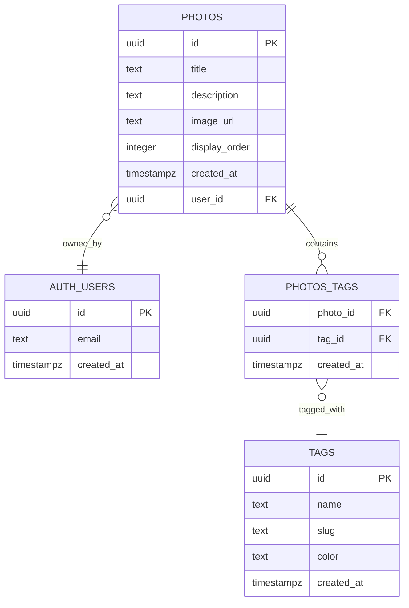
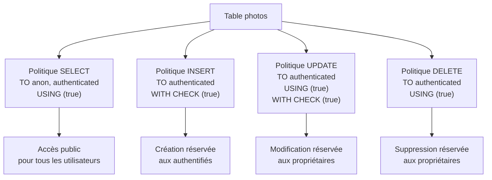
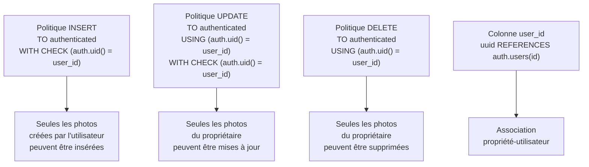
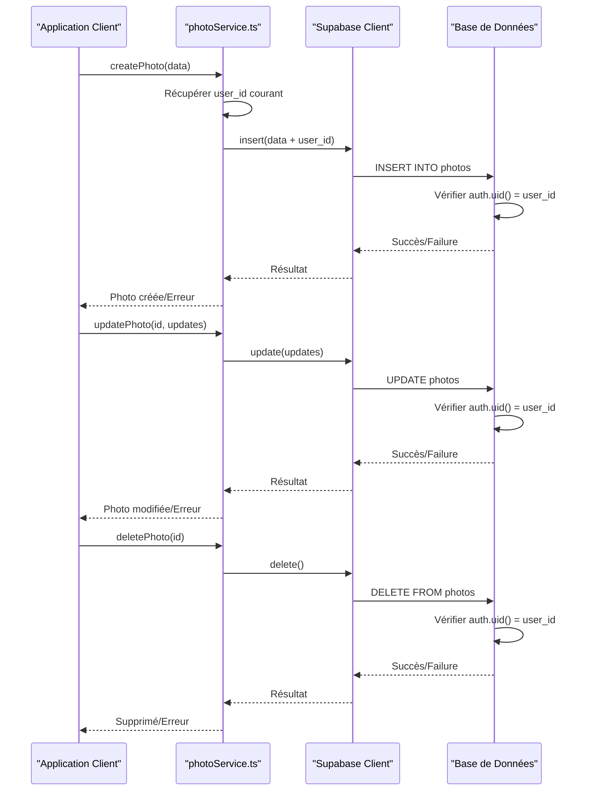
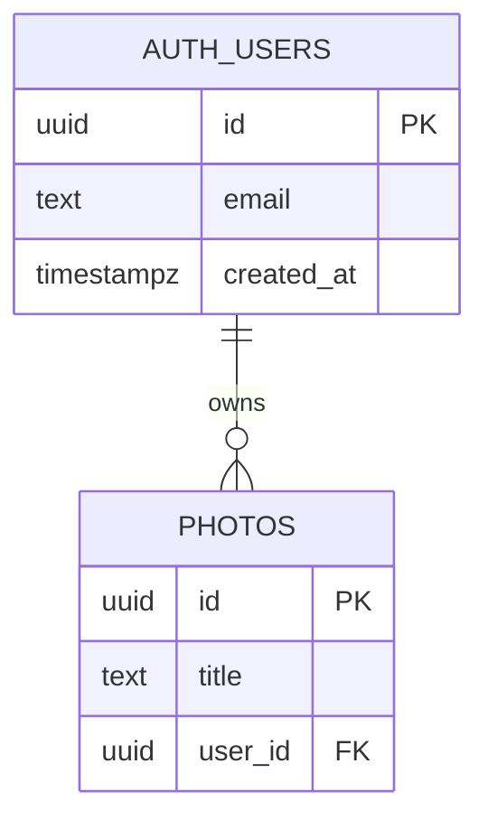

# Sécurité RLS - Table Photos

<cite>
**Fichiers Référencés dans ce Document**
- [photoService.ts](file://services/photoService.ts)
- [20251105115814_create_photos_table.sql](file://supabase/migrations/20251105115814_create_photos_table.sql)
- [20250111_add_security_constraints.sql](file://supabase/migrations/20250111_add_security_constraints.sql)
- [supabaseClient.ts](file://lib/supabaseClient.ts)
- [PhotoUploadForm.tsx](file://components/photos/PhotoUploadForm.tsx)
- [PhotoEditDialog.tsx](file://components/photos/PhotoEditDialog.tsx)
- [page.tsx](file://app/photos/page.tsx)
</cite>

## Table des Matières
1. [Introduction](#introduction)
2. [Structure de la Table Photos](#structure-de-la-table-photos)
3. [Politiques RLS Initiales](#politiques-rls-initiales)
4. [Amélioration des Politiques RLS](#amélioration-des-politiques-rls)
5. [Intégration avec photoService.ts](#intégration-avec-photoservice)
6. [Exemples Concrets d'Opérations](#exemples-concrets-dopérations)
7. [Importance de la Colonne user_id](#importance-de-la-colonne-user_id)
8. [Dépannage des Erreurs RLS](#dépannage-des-erreurs-rls)
9. [Conclusion](#conclusion)

## Introduction

Le système de sécurité RLS (Row Level Security) de Supabase joue un rôle crucial dans la protection des données de la galerie photo. Cette documentation détaille les politiques de sécurité appliquées à la table `photos`, explique leur fonctionnement avec le service photoService.ts, et fournit des conseils pratiques pour le dépannage.

Les politiques RLS assurent que chaque utilisateur ne peut accéder qu'à ses propres photos tout en maintenant une sécurité robuste contre les accès non autorisés.

## Structure de la Table Photos

La table `photos` est conçue pour stocker les métadonnées des photographies avec une sécurité intégrée via RLS.



**Sources du Diagramme**
- [supabaseClient.ts](file://lib/supabaseClient.ts#L18-L26)
- [20251105115814_create_photos_table.sql](file://supabase/migrations/20251105115814_create_photos_table.sql#L25-L32)

**Sources de Section**
- [supabaseClient.ts](file://lib/supabaseClient.ts#L18-L26)
- [20251105115814_create_photos_table.sql](file://supabase/migrations/20251105115814_create_photos_table.sql#L25-L32)

## Politiques RLS Initiales

Avant l'amélioration de sécurité, la table `photos` disposait de politiques de base qui autorisaient toutes les opérations aux utilisateurs authentifiés.

### Politiques Initiales



**Sources du Diagramme**
- [20251105115814_create_photos_table.sql](file://supabase/migrations/20251105115814_create_photos_table.sql#L36-L62)

### Fonctionnement des Politiques Initiales

1. **SELECT (Lecture)** : Tous les utilisateurs, authentifiés ou non, peuvent lire les photos
2. **INSERT (Création)** : Seuls les utilisateurs authentifiés peuvent ajouter des photos
3. **UPDATE (Modification)** : Tous les utilisateurs authentifiés peuvent modifier n'importe quelle photo
4. **DELETE (Suppression)** : Tous les utilisateurs authentifiés peuvent supprimer n'importe quelle photo

Cette approche initiale offrait une sécurité basique mais permettait des violations potentielles de l'intégrité des données.

**Sources de Section**
- [20251105115814_create_photos_table.sql](file://supabase/migrations/20251105115814_create_photos_table.sql#L36-L62)

## Amélioration des Politiques RLS

La migration de sécurité a introduit des politiques plus strictes basées sur la propriété des ressources.

### Politiques Améliorées



**Sources du Diagramme**
- [20250111_add_security_constraints.sql](file://supabase/migrations/20250111_add_security_constraints.sql#L199-L216)

### Détail des Politiques Améliorées

#### 1. Politique INSERT avec Vérification de Propriété

**Nom de la politique** : "Utilisateurs authentifiés peuvent créer leurs propres photos"

**Conditions** :
- **TO authenticated** : Seuls les utilisateurs authentifiés
- **WITH CHECK (auth.uid() = user_id)** : Le user_id doit correspondre à l'UID de l'utilisateur authentifié

#### 2. Politique UPDATE avec Vérification USING et WITH CHECK

**Nom de la politique** : "Utilisateurs peuvent modifier leurs propres photos"

**Conditions** :
- **TO authenticated** : Seuls les utilisateurs authentifiés
- **USING (auth.uid() = user_id)** : Vérification lors de la lecture
- **WITH CHECK (auth.uid() = user_id)** : Vérification lors de l'écriture

#### 3. Politique DELETE avec Vérification USING

**Nom de la politique** : "Utilisateurs peuvent supprimer leurs propres photos"

**Conditions** :
- **TO authenticated** : Seuls les utilisateurs authentifiés
- **USING (auth.uid() = user_id)** : Vérification lors de la lecture

**Sources de Section**
- [20250111_add_security_constraints.sql](file://supabase/migrations/20250111_add_security_constraints.sql#L199-L216)

## Intégration avec photoService.ts

Le service photoService.ts implémente les opérations CRUD tout en respectant les politiques RLS.

### Flux d'Opérations avec RLS



**Sources du Diagramme**
- [photoService.ts](file://services/photoService.ts#L73-L221)

### Implémentation des Opérations

#### Création de Photo (createPhoto)

Le service récupère automatiquement l'ID utilisateur courant et l'ajoute à la photo :

```typescript
// Récupération automatique de l'user_id
const { data: { user } } = await supabaseClient.auth.getUser();
const userId = photo.user_id ?? user?.id ?? null;

// Insertion avec user_id automatique
const { data, error } = await supabaseClient
  .from('photos')
  .insert({
    ...photo,
    user_id: userId,
  })
```

#### Modification de Photo (updatePhoto)

La politique RLS vérifie que l'utilisateur authentifié est bien le propriétaire :

```typescript
const { data, error } = await supabaseClient
  .from('photos')
  .update(updates)
  .eq('id', id)
  .select()
  .single();
```

#### Suppression de Photo (deletePhoto)

La politique RLS garantit que seul le propriétaire peut supprimer :

```typescript
const { error } = await supabaseClient
  .from('photos')
  .delete()
  .eq('id', id);
```

**Sources de Section**
- [photoService.ts](file://services/photoService.ts#L73-L221)

## Exemples Concrets d'Opérations

### Requêtes Autorisées (Utilisateur Propriétaire)

#### Cas de Succès - Création de Photo

**Requête** :
```sql
INSERT INTO photos (title, description, image_url, display_order, user_id)
VALUES ('Mon Voyage', 'Une belle journée', 'https://...', 1, 'user-id-courant')
```

**Résultat** : Succès car `auth.uid() = user_id` (l'utilisateur courant est le propriétaire)

#### Cas de Succès - Modification de Photo

**Requête** :
```sql
UPDATE photos
SET title = 'Mon Voyage Modifié'
WHERE id = 'photo-id' AND user_id = 'user-id-courant'
```

**Résultat** : Succès car l'utilisateur courant possède la photo

#### Cas de Succès - Suppression de Photo

**Requête** :
```sql
DELETE FROM photos
WHERE id = 'photo-id' AND user_id = 'user-id-courant'
```

**Résultat** : Succès car l'utilisateur courant possède la photo

### Requêtes Bloquées (Accès Non Autorisé)

#### Échec - Tentative de Modifier une Photo d'un Autre Utilisateur

**Requête** :
```sql
UPDATE photos
SET title = 'Hacking Attempt'
WHERE id = 'photo-id-autre-user' AND user_id = 'user-id-courant'
```

**Résultat** : Échec avec erreur 403 Forbidden car `auth.uid() != user_id`

#### Échec - Tentative de Supprimer une Photo d'un Autre Utilisateur

**Requête** :
```sql
DELETE FROM photos
WHERE id = 'photo-id-autre-user' AND user_id = 'user-id-courant'
```

**Résultat** : Échec avec erreur 403 Forbidden car `auth.uid() != user_id`

### Frontend - Exemples d'Utilisation

#### Formulaire de Téléversement (PhotoUploadForm)

Le composant gère automatiquement la sécurité côté client :

```typescript
// Validation côté client (optionnelle)
const { maxOrder } = await photoService.getMaxDisplayOrder();
const nextOrder = maxOrder + 1;

// Upload et création de photo
const { error: insertError } = await photoService.createPhotoWithTags({
  title: title.trim(),
  description: description.trim() || null,
  image_url: publicUrl,
  blur_data_url: blurDataUrl,
  display_order: nextOrder,
}, selectedTagIds);
```

#### Dialogue d'Édition (PhotoEditDialog)

Le dialogue permet la modification sécurisée :

```typescript
// Mise à jour sécurisée
const { error: updateError } = await photoService.updatePhoto(photo.id, {
  title: title.trim(),
  description: description.trim() || null,
});
```

**Sources de Section**
- [PhotoUploadForm.tsx](file://components/photos/PhotoUploadForm.tsx#L148-L165)
- [PhotoEditDialog.tsx](file://components/photos/PhotoEditDialog.tsx#L110-L118)

## Importance de la Colonne user_id

### Migration et Ajout Automatique

La colonne `user_id` est ajoutée automatiquement via une migration conditionnelle :

```sql
DO $$
BEGIN
  IF NOT EXISTS (
    SELECT 1 FROM information_schema.columns 
    WHERE table_name = 'photos' AND column_name = 'user_id'
  ) THEN
    ALTER TABLE photos ADD COLUMN user_id uuid REFERENCES auth.users(id) ON DELETE SET NULL;
    CREATE INDEX IF NOT EXISTS idx_photos_user_id ON photos(user_id);
  END IF;
END $$;
```

### Rôle Critique dans l'Application des Politiques

#### 1. Association Propriété-Utilisateur

La colonne `user_id` établit la relation propriétaire/utilisateur :



**Sources du Diagramme**
- [20250111_add_security_constraints.sql](file://supabase/migrations/20250111_add_security_constraints.sql#L12-L21)

#### 2. Vérification de l'Authenticité

Chaque opération RLS vérifie que l'utilisateur authentifié correspond au propriétaire :

- **INSERT** : `auth.uid() = user_id` dans les données insérées
- **UPDATE** : `auth.uid() = user_id` pour chaque ligne modifiée
- **DELETE** : `auth.uid() = user_id` pour chaque ligne supprimée

#### 3. Indexation pour Performances

Un index est créé sur `user_id` pour optimiser les requêtes :

```sql
CREATE INDEX IF NOT EXISTS idx_photos_user_id ON photos(user_id);
```

### Impact sur les Opérations

#### Avantages de la Colonne user_id

1. **Sécurité Renforcée** : Protection contre les accès non autorisés
2. **Auditabilité** : Traçabilité des propriétaires
3. **Performance** : Requêtes optimisées avec index
4. **Intégrité** : Contraintes référentielles

#### Considérations Techniques

- **Migration Transparente** : La colonne est ajoutée seulement si nécessaire
- **Références** : Contrainte de clé étrangère vers `auth.users`
- **Suppression** : `ON DELETE SET NULL` pour maintenir la cohérence

**Sources de Section**
- [20250111_add_security_constraints.sql](file://supabase/migrations/20250111_add_security_constraints.sql#L12-L21)

## Dépannage des Erreurs RLS

### Erreurs 403 Forbidden

#### Causes Communes

1. **Accès Non Autorisé** : Tentative de modifier/supprimer une photo d'un autre utilisateur
2. **Utilisateur Non Authentifié** : Opération requérant un utilisateur authentifié
3. **Problèmes de Synchronisation** : Disparité entre session et base de données

#### Diagnostic et Solutions

##### Erreur : "permission denied for table photos"

**Cause** : Utilisateur non authentifié pour une opération requérant authentification

**Solution** :
```typescript
// Vérifier l'état d'authentification
const { data: { user } } = await supabaseClient.auth.getUser();
if (!user) {
  // Rediriger vers la page de connexion
  router.push('/login');
}
```

##### Erreur : "new row violates row level security policy"

**Cause** : Violation de la politique RLS (tentative d'accès non autorisé)

**Solution** :
```typescript
// Vérifier la propriété avant l'opération
const { data: photo } = await supabaseClient
  .from('photos')
  .select('user_id')
  .eq('id', photoId)
  .maybeSingle();

if (photo?.user_id !== currentUser.id) {
  throw new Error('Accès non autorisé');
}
```

### Erreurs 404 Not Found

#### Causes et Solutions

##### Photo Introuvable

**Cause** : La photo n'existe pas ou appartient à un autre utilisateur

**Diagnostic** :
```typescript
const { data: photo, error } = await supabaseClient
  .from('photos')
  .select('*')
  .eq('id', photoId)
  .maybeSingle();

if (!photo) {
  console.log('Photo non trouvée ou accès refusé');
}
```

##### Table photo_tags Manquante

**Cause** : Migration incomplète concernant les tags

**Solution** :
```typescript
try {
  const { photos } = await photoService.getAllPhotosWithTags();
} catch (error) {
  if (error.code === 'PGRST205') {
    // Table photo_tags n'existe pas
    const { photos } = await photoService.getAllPhotos();
  }
}
```

### Outils de Débogage

#### Logging des Erreurs RLS

```typescript
// Wrapper pour capturer les erreurs RLS
async function safePhotoOperation(operation: () => Promise<any>) {
  try {
    return await operation();
  } catch (error) {
    if (error.message.includes('permission denied') || 
        error.message.includes('violates row level security')) {
      console.error('Erreur RLS détectée:', error);
      return { error: 'Accès non autorisé' };
    }
    throw error;
  }
}
```

#### Vérification des Permissions

```typescript
// Fonction utilitaire pour vérifier les permissions
async function checkPhotoPermissions(photoId: string): Promise<boolean> {
  const { data: photo, error } = await supabaseClient
    .from('photos')
    .select('id')
    .eq('id', photoId)
    .maybeSingle();
  
  return !!photo;
}
```

### Bonnes Pratiques de Développement

1. **Vérification Préventive** : Toujours vérifier les permissions avant les opérations
2. **Gestion d'Erreurs Robuste** : Capturer et traiter spécifiquement les erreurs RLS
3. **Feedback Utilisateur** : Informer l'utilisateur de manière appropriée
4. **Logging** : Enregistrer les tentatives d'accès non autorisés
5. **Tests** : Tester les scénarios de sécurité

**Sources de Section**
- [page.tsx](file://app/photos/page.tsx#L76-L82)
- [PhotoEditDialog.tsx](file://components/photos/PhotoEditDialog.tsx#L158-L188)

## Conclusion

Les politiques de sécurité RLS appliquées à la table `photos` constituent un système de protection robuste et granulaire. L'évolution des politiques de base vers des politiques basées sur la propriété offre une sécurité significativement améliorée tout en maintenant la fonctionnalité souhaitée.

### Points Clés à Retenir

1. **Sécurité Renforcée** : Les politiques actuelles garantissent que seuls les propriétaires peuvent modifier/supprimer leurs photos
2. **Intégration Transparente** : Le service photoService.ts gère automatiquement la sécurité
3. **Migration Transparente** : La colonne `user_id` est ajoutée automatiquement si nécessaire
4. **Performances Optimisées** : Indexation appropriée pour les requêtes de sécurité
5. **Débogage Facilité** : Mécanismes de diagnostic et gestion d'erreurs

### Recommandations

- **Surveillance Continue** : Surveiller les logs d'erreurs RLS
- **Tests Réguliers** : Valider la sécurité avec des tests automatisés
- **Documentation** : Maintenir la documentation des politiques RLS
- **Formation** : Former l'équipe au bon usage des politiques de sécurité

Cette implémentation RLS garantit la confidentialité et l'intégrité des données utilisateur tout en offrant une expérience développeur fluide et intuitive.