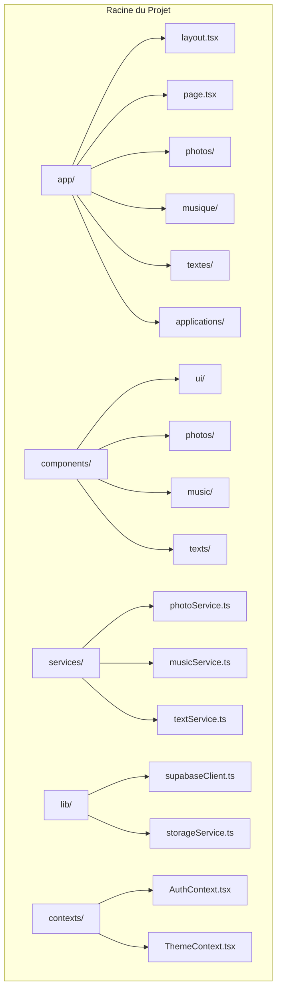

# Configuration et Installation

<cite>
**Fichiers Référencés dans ce Document**
- [README.md](file://README.md)
- [package.json](file://package.json)
- [.env.example](file://.env.example)
- [SETUP_SUPABASE.md](file://SETUP_SUPABASE.md)
- [SETUP_PHOTOS.md](file://SETUP_PHOTOS.md)
- [SETUP_TEXTS.md](file://SETUP_TEXTS.md)
- [lib/supabaseClient.ts](file://lib/supabaseClient.ts)
- [next.config.js](file://next.config.js)
- [supabase/migrations/20251105115814_create_photos_table.sql](file://supabase/migrations/20251105115814_create_photos_table.sql)
- [supabase/migrations/20251106095111_create_music_tracks_table.sql](file://supabase/migrations/20251106095111_create_music_tracks_table.sql)
- [supabase/migrations/20250107_create_texts_system.sql](file://supabase/migrations/20250107_create_texts_system.sql)
</cite>

## Table des Matières
1. [Introduction](#introduction)
2. [Prérequis Système](#prérequis-système)
3. [Installation du Projet](#installation-du-projet)
4. [Configuration Supabase](#configuration-supabase)
5. [Configuration des Modules Optionnels](#configuration-des-modules-optionnels)
6. [Structure du Projet](#structure-du-projet)
7. [Commandes Disponibles](#commandes-disponibles)
8. [Dépannage](#dépannage)
9. [Optimisations et Bonnes Pratiques](#optimisations-et-bonnes-pratiques)

## Introduction

Portfolio est un site web moderne construit avec Next.js 13, présentant des créations artistiques et professionnelles avec un système de double thème (clair/sombre + couleurs personnalisables). Le projet utilise Supabase comme backend pour la gestion des données, l'authentification et le stockage de fichiers.

### Fonctionnalités Principales
- Export statique Next.js (déployable partout)
- Double système de thèmes (clair/sombre + couleurs personnalisables)
- Galerie photos avec upload et gestion
- Lecteur de musique avec gestion de playlists
- Galerie vidéos
- Créations textuelles avec système de catégories et tags
- Portfolio d'applications
- Authentification via Supabase
- Synchronisation en temps réel

## Prérequis Système

Avant de commencer l'installation, assurez-vous que votre environnement répond aux exigences suivantes :

### Logiciels Requis
- **Node.js** : Version 18 ou supérieure
- **npm** ou **yarn** : Gestionnaire de paquets
- **Git** : Pour cloner le dépôt (si applicable)
- **Un compte Supabase** : Gratuit et facile à créer

### Vérification des Prérequis
```bash
# Vérifier Node.js
node --version  # Doit afficher v18.x.x ou supérieur

# Vérifier npm
npm --version   # Doit afficher une version valide

# Vérifier Git (optionnel)
git --version   # Doit afficher une version valide
```

**Sources de section**
- [README.md](file://README.md#L7-L11)
- [package.json](file://package.json#L17-L83)

## Installation du Projet

Suivez ces étapes pour installer et configurer le projet Portfolio localement.

### Étape 1 : Clonage du Dépôt

Si vous travaillez avec un dépôt existant, commencez par cloner le projet :

```bash
# Cloner le dépôt (remplacer par l'URL réelle)
git clone <url-du-repo>
cd portfolio

# Si vous travaillez avec un fork local
cd chemin-vers-votre-fork
```

### Étape 2 : Installation des Dépendances

Installez toutes les dépendances nécessaires en utilisant npm ou yarn :

```bash
# Avec npm
npm install

# Avec yarn
yarn install
```

Cette commande téléchargera et installera toutes les bibliothèques et frameworks nécessaires au projet.

### Étape 3 : Configuration des Variables d'Environnement

Copiez le fichier exemple de configuration et configurez vos variables d'environnement :

```bash
# Copier le fichier d'exemple
cp .env.example .env.local

# Éditer le fichier .env.local avec votre éditeur préféré
# Par exemple :
nano .env.local  # Linux/macOS
code .env.local  # VS Code
notepad .env.local  # Windows
```

Dans le fichier `.env.local`, configurez les variables suivantes :

```env
NEXT_PUBLIC_SUPABASE_URL=https://votre-projet.supabase.co
NEXT_PUBLIC_SUPABASE_ANON_KEY=votre-clé-anon
```

### Étape 4 : Lancement du Serveur de Développement

Démarrez le serveur de développement pour vérifier que tout fonctionne correctement :

```bash
# Lancer le serveur de développement
npm run dev

# Le serveur sera accessible à l'adresse :
# http://localhost:3000
```

**Sources de section**
- [README.md](file://README.md#L15-L46)
- [package.json](file://package.json#L5-L16)

## Configuration Supabase

Supabase est la base de données et le backend principal du projet. Suivez ce guide détaillé pour configurer votre instance Supabase.

### Création d'un Projet Supabase

1. **Accédez au tableau de bord Supabase** : [https://app.supabase.com](https://app.supabase.com)
2. **Créez un compte** : Si vous n'avez pas encore de compte Supabase
3. **Nouveau projet** : Cliquez sur "New Project"
4. **Configuration du projet** :
   - **Name** : portfolio (ou le nom de votre choix)
   - **Database Password** : Choisissez un mot de passe sécurisé
   - **Region** : Sélectionnez la région la plus proche de vous
   - **Pricing Plan** : Free tier suffit pour commencer

### Obtention des Clés API

1. **Accédez aux paramètres** : Settings > API
2. **Copiez les valeurs** :
   - **Project URL** : `https://xxxxx.supabase.co`
   - **anon/public key** : Une longue chaîne commençant par `eyJ...`

### Configuration des Tables et Policies

Le projet utilise plusieurs tables principales qui doivent être créées dans Supabase :

#### Table `photos`

La table `photos` gère la galerie d'images :

```sql
CREATE TABLE photos (
  id UUID PRIMARY KEY DEFAULT uuid_generate_v4(),
  title TEXT NOT NULL,
  description TEXT,
  image_url TEXT NOT NULL,
  display_order INTEGER NOT NULL DEFAULT 0,
  created_at TIMESTAMP WITH TIME ZONE DEFAULT NOW()
);

-- Index pour améliorer les performances
CREATE INDEX photos_display_order_idx ON photos(display_order);
CREATE INDEX photos_created_at_idx ON photos(created_at DESC);

-- RLS (Row Level Security)
ALTER TABLE photos ENABLE ROW LEVEL SECURITY;

-- Policy : Tout le monde peut lire
CREATE POLICY "Lecture publique des photos"
  ON photos FOR SELECT
  TO anon, authenticated
  USING (true);

-- Policy : Seuls les utilisateurs authentifiés peuvent créer/modifier
CREATE POLICY "Insertion réservée aux authentifiés"
  ON photos FOR INSERT
  TO authenticated
  WITH CHECK (true);
```

#### Table `music_tracks`

La table `music_tracks` gère la collection musicale :

```sql
CREATE TABLE music_tracks (
  id UUID PRIMARY KEY DEFAULT gen_random_uuid(),
  title TEXT NOT NULL,
  artist TEXT DEFAULT '',
  album TEXT DEFAULT '',
  audio_url TEXT NOT NULL,
  cover_image_url TEXT DEFAULT '',
  duration INTEGER DEFAULT 0,
  display_order INTEGER NOT NULL DEFAULT 0,
  user_id UUID REFERENCES auth.users(id) ON DELETE SET NULL,
  created_at TIMESTAMP WITH TIME ZONE DEFAULT NOW()
);

-- Index pour améliorer les performances
CREATE INDEX idx_music_tracks_display_order ON music_tracks(display_order);

-- RLS (Row Level Security)
ALTER TABLE music_tracks ENABLE ROW LEVEL SECURITY;

-- Policy : Tous les utilisateurs peuvent voir les morceaux
CREATE POLICY "Tous peuvent voir les morceaux"
  ON music_tracks FOR SELECT
  USING (true);
```

### Configuration du Storage (Optionnel)

Si vous souhaitez uploader des fichiers :

1. **Allez dans Storage** dans votre projet Supabase
2. **Créez deux buckets** :
   - `photo-files` (public)
   - `audio-files` (public)

3. **Configurez les policies** pour permettre l'upload :

```sql
-- Policy pour le bucket photo-files
CREATE POLICY "Public Access to photos"
  ON storage.objects FOR SELECT
  USING (bucket_id = 'photo-files');

CREATE POLICY "Authenticated users can upload photos"
  ON storage.objects FOR INSERT
  WITH CHECK (bucket_id = 'photo-files' AND auth.role() = 'authenticated');
```

### Vérification de la Configuration

Après avoir configuré Supabase, redémarrez votre serveur de développement :

```bash
# Arrêtez le serveur (Ctrl+C) puis relancez
npm run dev
```

Vous devriez voir :
- ✓ Ready in X.Xs
- Pas d'erreur "Variables d'environnement Supabase manquantes"

**Sources de section**
- [SETUP_SUPABASE.md](file://SETUP_SUPABASE.md#L1-L208)
- [lib/supabaseClient.ts](file://lib/supabaseClient.ts#L1-L344)

## Configuration des Modules Optionnels

Le projet propose plusieurs modules optionnels qui peuvent être configurés selon vos besoins.

### Module Photos

Le module de galerie photos nécessite une configuration supplémentaire :

#### Configuration du Bucket de Stockage

1. **Créez le bucket** `photo-files` dans Supabase Storage
2. **Configurez les politiques** comme indiqué dans [SETUP_PHOTOS.md](file://SETUP_PHOTOS.md#L26-L67)

#### Création d'un Utilisateur Admin

Vous pouvez créer un utilisateur admin via le dashboard Supabase ou SQL :

```sql
-- Via SQL (remplacer les valeurs)
INSERT INTO auth.users (
  id,
  email,
  encrypted_password,
  email_confirmed_at,
  created_at,
  updated_at,
  raw_user_meta_data,
  role
)
VALUES (
  gen_random_uuid(),
  'admin@monsite.com',
  crypt('MonMotDePasseSecurise123', gen_salt('bf')),
  now(),
  now(),
  now(),
  '{}',
  'authenticated'
);
```

### Module Textes

Le module de textes nécessite une migration spécifique :

#### Exécution de la Migration

```bash
# Depuis le dashboard Supabase
# SQL Editor > New query > Collez le contenu du fichier :
supabase/migrations/20250107_create_texts_system.sql
```

Ou via la CLI Supabase :

```bash
supabase db push --file supabase/migrations/20250107_create_texts_system.sql
```

#### Structure des Tables

Le système de textes comprend quatre tables principales :
- `categories` : Catégories de textes
- `tags` : Tags pour classifier les textes
- `texts` : Textes/articles principaux
- `text_tags` : Relation many-to-many entre texts et tags

**Sources de section**
- [SETUP_PHOTOS.md](file://SETUP_PHOTOS.md#L1-L211)
- [SETUP_TEXTS.md](file://SETUP_TEXTS.md#L1-L325)

## Structure du Projet

Comprenez l'organisation du projet pour naviguer efficacement dans le code.



**Sources de section**
- [README.md](file://README.md#L47-L80)

## Commandes Disponibles

Le projet fournit plusieurs commandes utiles pour le développement et la production.

### Scripts de Développement

```bash
# Serveur de développement (port 3000)
npm run dev

# Build de production (export statique)
npm run build

# Serveur de production
npm start

# Vérification du code (ESLint)
npm run lint

# Vérification des types TypeScript
npm run typecheck
```

### Scripts Avancés

```bash
# Analyse du bundle
npm run analyze

# Vérification de la taille du bundle
npm run check-bundle

# Génération de LQIP pour images existantes
npm run generate-lqip
```

### Configuration Webpack

Le projet utilise une configuration webpack optimisée pour :
- Splitting des chunks pour les bibliothèques majeures
- Optimisation des imports dynamiques
- Bundle analyzer pour l'analyse des tailles

**Sources de section**
- [README.md](file://README.md#L81-L90)
- [next.config.js](file://next.config.js#L1-L111)

## Dépannage

Résolvez les problèmes courants rencontrés lors de l'installation et de l'utilisation du projet.

### Erreurs de Connexion Supabase

**Problème** : "Variables d'environnement Supabase manquantes"

**Solutions** :
1. Vérifiez que le fichier `.env.local` existe à la racine du projet
2. Vérifiez que les variables commencent par `NEXT_PUBLIC_`
3. Redémarrez le serveur de développement
4. Vérifiez que les valeurs de `NEXT_PUBLIC_SUPABASE_URL` et `NEXT_PUBLIC_SUPABASE_ANON_KEY` sont correctes

### Erreur de Build

**Problème** : Erreur lors du build de production

**Solutions** :
1. Vérifiez que toutes les variables d'environnement sont configurées
2. Exécutez `npm run typecheck` pour vérifier les erreurs TypeScript
3. Vérifiez que le projet Supabase est actif
4. Nettoyez le cache : `rm -rf .next && npm run build`

### Problèmes de Performance

**Problème** : Application lente ou ralentissement

**Solutions** :
1. Vérifiez la taille des images (max 5MB)
2. Activez l'analyseur de bundle : `ANALYZE=true npm run build`
3. Vérifiez les politiques RLS de votre base de données
4. Optimisez les requêtes SQL dans les services

### Erreurs d'Authentification

**Problème** : Impossible de se connecter

**Solutions** :
1. Vérifiez que l'utilisateur existe dans Supabase Auth
2. Vérifiez que l'email est confirmé (`email_confirmed_at` non null)
3. Vérifiez les politiques RLS des tables concernées
4. Redémarrez le serveur de développement

### Problèmes de Stockage

**Problème** : Impossible d'uploader des fichiers

**Solutions** :
1. Vérifiez que le bucket de stockage est configuré en public
2. Vérifiez les politiques du bucket de stockage
3. Vérifiez la taille du fichier (max 5MB)
4. Vérifiez le format du fichier (JPEG, PNG, WebP, GIF uniquement)

**Sources de section**
- [SETUP_SUPABASE.md](file://SETUP_SUPABASE.md#L184-L208)
- [README.md](file://README.md#L166-L172)

## Optimisations et Bonnes Pratiques

Améliorez les performances et maintenez la qualité du code.

### Optimisations de Performance

1. **Lazy Loading** : Les composants sont chargés de manière lazy automatiquement
2. **Image Optimization** : Utilisation de Next.js Image Optimization
3. **Bundle Splitting** : Configuration webpack optimisée pour les grandes applications
4. **Cache** : Utilisation du cache HTTP et du cache côté client

### Bonnes Pratiques de Développement

1. **Tests** : Exécutez `npm run typecheck` et `npm run lint` régulièrement
2. **Responsive Design** : Testez sur différents appareils et tailles d'écran
3. **Double Thème** : Vérifiez que les deux thèmes (clair/sombre + couleurs) fonctionnent
4. **Accessibilité** : Respectez les standards WCAG pour l'accessibilité

### Déploiement

Le projet est configuré en export statique et peut être déployé sur :
- **Vercel** (recommandé pour Next.js)
- **Netlify**
- **GitHub Pages**
- **Tout hébergeur statique**

Pour le déploiement en production :

```bash
# Build pour production
npm run build

# Les fichiers statiques seront générés dans le dossier `out/`
```

Configurez les variables d'environnement sur votre plateforme de déploiement :
- `NEXT_PUBLIC_SUPABASE_URL`
- `NEXT_PUBLIC_SUPABASE_ANON_KEY`

### Maintenance

1. **Mises à jour** : Maintenez les dépendances à jour
2. **Monitoring** : Surveillez les performances et les erreurs
3. **Sécurité** : Vérifiez régulièrement les politiques RLS
4. **Backup** : Sauvegardez régulièrement vos données