# Documentation de Référence

<cite>
**Fichiers Référencés dans ce Document**
- [README.md](file://README.md)
- [CLAUDE.md](file://CLAUDE.md)
- [AGENTS.md](file://AGENTS.md)
- [AI_TOOLS.md](file://AI_TOOLS.md)
- [WARP.md](file://WARP.md)
- [package.json](file://package.json)
- [next.config.js](file://next.config.js)
- [tsconfig.json](file://tsconfig.json)
- [tailwind.config.ts](file://tailwind.config.ts)
- [components.json](file://components.json)
- [lib/supabaseClient.ts](file://lib/supabaseClient.ts)
- [contexts/ThemeContext.tsx](file://contexts/ThemeContext.tsx)
</cite>

## Table des Matières
1. [Introduction](#introduction)
2. [Vue d'Ensemble du Projet](#vue-densemble-du-projet)
3. [Architecture Technique](#architecture-technique)
4. [Configuration et Déploiement](#configuration-et-déploiement)
5. [Système de Thèmes](#système-de-thèmes)
6. [Couche Service et Données](#couche-service-et-données)
7. [Composants et UI](#composants-et-ui)
8. [Patterns de Développement](#patterns-de-développement)
9. [Outils d'Intelligence Artificielle](#outils-dintelligence-artificielle)
10. [Guide de Contribution](#guide-de-contribution)
11. [Référence des Routes](#référence-des-routes)
12. [Optimisations et Performance](#optimisations-et-performance)
13. [Sécurité et Validation](#sécurité-et-validation)
14. [Maintenance et Outils](#maintenance-et-outils)

## Introduction

Portfolio est un site web personnel construit avec Next.js 13, présentant des créations artistiques et professionnelles avec un système de double thème (clair/sombre + couleurs personnalisables). Le projet utilise l'App Router avec export statique, garantissant une expérience de navigation rapide et une facilité de déploiement sur n'importe quelle plateforme statique.

### Caractéristiques Principales

- **Export Statique Next.js** : Déployable partout grâce à l'export statique
- **Double Système de Thèmes** : Mode clair/sombre/système + 4 thèmes de couleurs prédéfinis
- **Design Responsive** : Adapté à tous les appareils
- **Authentification** : Via Supabase (email/password)
- **Gestion Multi-Média** : Galeries photos, musique, vidéos et créations textuelles
- **Synchronisation Temps Réel** : Via Supabase
- **Accessibilité** : Conforme WCAG AA avec support clavier complet

## Vue d'Ensemble du Projet

### Technologies Utilisées

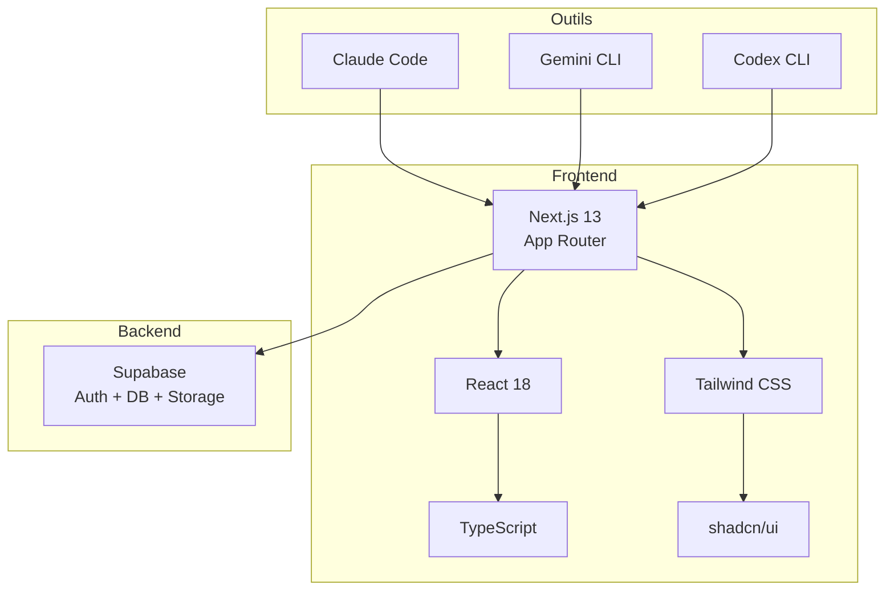

**Sources du Diagramme**
- [package.json](file://package.json#L18-L84)
- [next.config.js](file://next.config.js#L1-L63)

### Structure du Projet

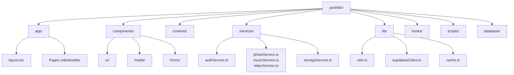

**Sources du Diagramme**
- [README.md](file://README.md#L47-L80)

**Sources de Section**
- [README.md](file://README.md#L1-L172)
- [package.json](file://package.json#L1-L91)

## Architecture Technique

### Configuration Next.js

Le projet utilise Next.js 13 avec l'App Router et est configuré en export statique :

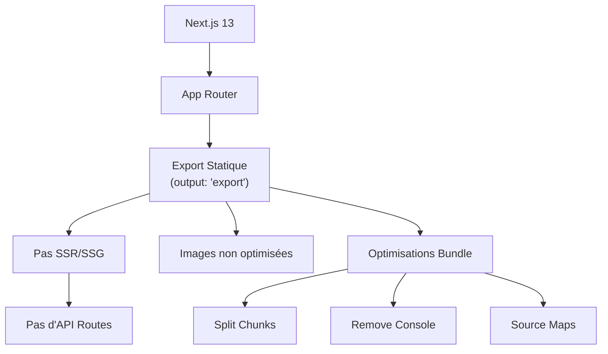

**Sources du Diagramme**
- [next.config.js](file://next.config.js#L7-L15)
- [next.config.js](file://next.config.js#L33-L57)

### Configuration TypeScript

La configuration TypeScript est strictement typée avec résolution de module "bundler" :

| Option | Valeur | Description |
|--------|--------|-------------|
| `strict` | `true` | Activation de tous les checks de type stricts |
| `moduleResolution` | `"bundler"` | Résolution de module moderne |
| `jsx` | `"react-jsx"` | Compilation JSX pour React |
| `paths` | `@/*` → `./` | Alias de chemin racine |

**Sources de Section**
- [next.config.js](file://next.config.js#L1-L63)
- [tsconfig.json](file://tsconfig.json#L1-L42)

## Configuration et Déploiement

### Variables d'Environnement

Le projet nécessite les variables Supabase suivantes :

| Variable | Description | Obligatoire |
|----------|-------------|-------------|
| `NEXT_PUBLIC_SUPABASE_URL` | URL du projet Supabase | Oui |
| `NEXT_PUBLIC_SUPABASE_ANON_KEY` | Clé anonyme Supabase | Oui |

### Commandes de Développement

```bash
# Démarrage du serveur de développement
npm run dev

# Build de production (export statique)
npm run build

# Lancement du serveur en production
npm start

# Vérification du code (ESLint)
npm run lint

# Vérification des types TypeScript
npm run typecheck

# Analyse de la taille du bundle
npm run analyze
```

### Déploiement

Le projet peut être déployé sur :
- **Vercel** (recommandé)
- **Netlify**
- **GitHub Pages**
- **Tout hébergeur statique**

**Sources de Section**
- [README.md](file://README.md#L81-L143)
- [package.json](file://package.json#L5-L16)

## Système de Thèmes

### Double Système de Thèmes

Le projet implémente deux systèmes de thèmes indépendants :

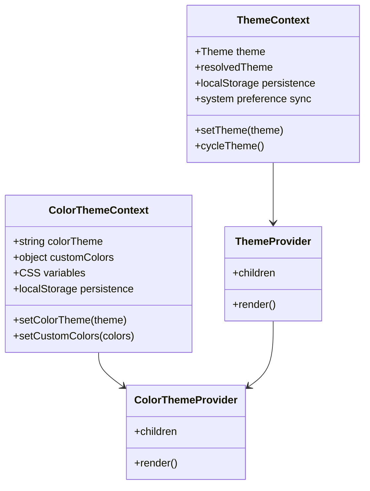

**Sources du Diagramme**
- [contexts/ThemeContext.tsx](file://contexts/ThemeContext.tsx#L1-L96)

### Thèmes de Couleur Disponibles

| Thème | Nom CSS | Description |
|-------|---------|-------------|
| Ocean | `ocean` | Bleu profond et frais |
| Forest | `forest` | Vert naturel et terreux |
| Sun | `sun` | Jaune chaud et énergique |
| Rose | `rose` | Rose doux et romantique |
| Custom | `custom` | Couleurs personnalisées |

### Persistance et Synchronisation

- **localStorage** : `theme`, `colorTheme`, `customColors`
- **Synchronisation** : Événements `storage` entre onglets
- **Préférences Système** : Auto-détection du thème système

**Sources de Section**
- [contexts/ThemeContext.tsx](file://contexts/ThemeContext.tsx#L1-L96)
- [CLAUDE.md](file://CLAUDE.md#L116-L137)

## Couche Service et Données

### Architecture Service Layer

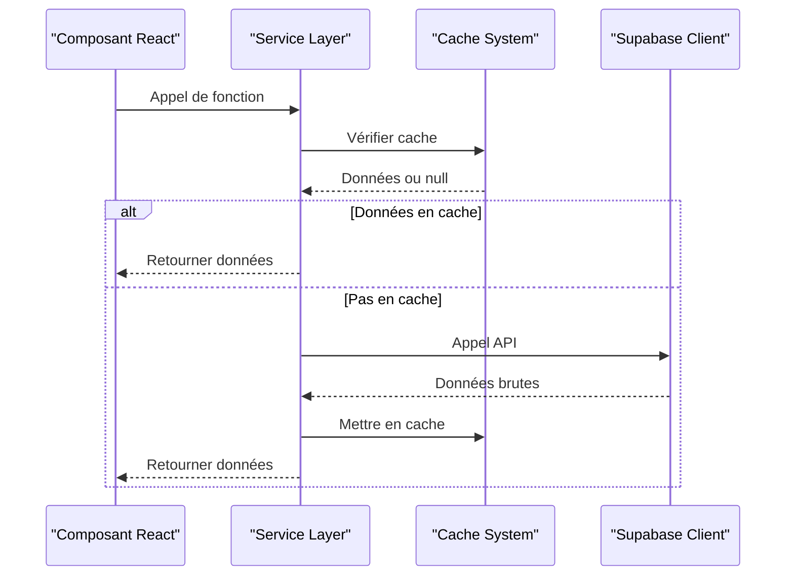

**Sources du Diagramme**
- [CLAUDE.md](file://CLAUDE.md#L167-L191)

### Services Principaux

| Service | Fonctionnalités | Cache | Gestion d'Erreurs |
|---------|----------------|-------|-------------------|
| `authService` | Authentification email/password | Non | `{ data, error }` |
| `photoService` | CRUD + tri d'affichage | Oui (TTL) | `{ data, error }` |
| `musicService` | CRUD + playlists | Oui (TTL) | `{ data, error }` |
| `videoService` | CRUD + validation URL | Oui (TTL) | `{ data, error }` |
| `textService` | CRUD + Markdown | Oui (TTL) | `{ data, error }` |
| `storageService` | Upload/Suppression fichiers | Non | `{ data, error }` |

### Types de Données Supabase

Le projet utilise TypeScript strict avec des types générés automatiquement :

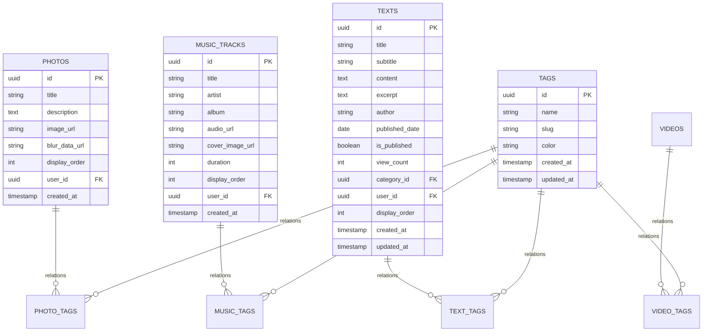

**Sources du Diagramme**
- [lib/supabaseClient.ts](file://lib/supabaseClient.ts#L18-L344)

**Sources de Section**
- [CLAUDE.md](file://CLAUDE.md#L167-L191)
- [lib/supabaseClient.ts](file://lib/supabaseClient.ts#L1-L344)

## Composants et UI

### Bibliothèque shadcn/ui

Le projet utilise shadcn/ui comme base pour tous les composants UI :

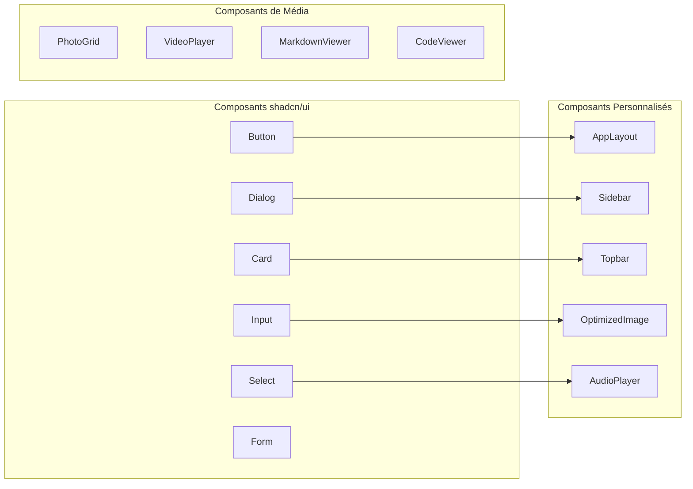

**Sources du Diagramme**
- [components.json](file://components.json#L1-L21)

### Composants de Performance

| Composant | Fonctionnalité | Optimisations |
|-----------|----------------|---------------|
| `OptimizedImage` | Lazy loading + LQIP | Intersection Observer, srcset, fallback SVG |
| `VirtualizedPhotoGrid` | Virtualisation | @tanstack/react-virtual |
| `PrefetchData` | Préchargement | Intelligent loading |
| `WebVitals` | Monitoring | Core Web Vitals |

### Composants d'Interaction

- **BookmarkButton** : Marquer des contenus favoris
- **ShareButton** : Partager du contenu
- **RefreshButton** : Rafraîchir les données
- **ProtectedRoute** : Routage administrateur

**Sources de Section**
- [components.json](file://components.json#L1-L21)
- [CLAUDE.md](file://CLAUDE.md#L138-L145)

## Patterns de Développement

### Client vs Server Components

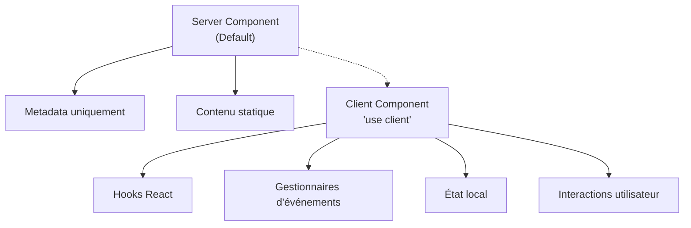

### Gestion d'État et Effets

**Pattern useState** :
```typescript
const [items, setItems] = useState<Item[]>([]);
const [loading, setLoading] = useState(false);
const [error, setError] = useState<Error | null>(null);
```

**Pattern useEffect** :
```typescript
useEffect(() => {
  let isMounted = true;
  
  const fetchData = async () => {
    const data = await api.getData();
    if (isMounted) {
      setData(data);
    }
  };
  
  fetchData();
  
  return () => {
    isMounted = false;
  };
}, [dependencies]);
```

### Gestion d'Erreurs

**Dans les services** :
```typescript
try {
  const result = await operation();
  return { data: result, error: null };
} catch (error) {
  logger.error('Operation failed', error as Error, { context });
  return { data: null, error: error as Error };
}
```

**Dans les composants** :
```typescript
const handleAction = async () => {
  setLoading(true);
  setError(null);
  
  try {
    const { data, error } = await service.operation();
    
    if (error) {
      setError(error);
      toast.error('Erreur', { description: error.message });
      return;
    }
    
    toast.success('Succès', { description: 'Opération réussie' });
    setData(data);
  } catch (error) {
    logger.error('Unexpected error', error as Error);
    toast.error('Erreur', { description: 'Une erreur inattendue s\'est produite' });
  } finally {
    setLoading(false);
  }
};
```

**Sources de Section**
- [AGENTS.md](file://AGENTS.md#L362-L430)
- [CLAUDE.md](file://CLAUDE.md#L162-L170)

## Outils d'Intelligence Artificielle

### Support Multi-Outils

Le projet est configuré pour fonctionner avec trois outils d'IA :

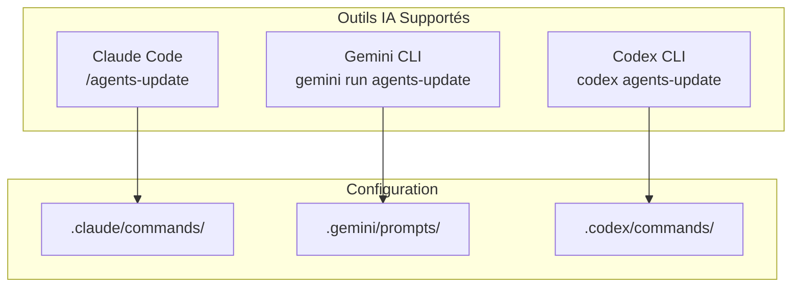

**Sources du Diagramme**
- [AI_TOOLS.md](file://AI_TOOLS.md#L1-L196)

### Commande `agents-update`

Cette commande met à jour automatiquement la documentation :

| Action | Description |
|--------|-------------|
| Lecture | CLAUDE.md et AGENTS.md actuels |
| Analyse | Projet complet (routes, services, composants) |
| Identification | Changements non documentés |
| Mise à jour | Fichiers de documentation |
| Résumé | Modifications identifiées |

### Configuration par Outil

| Outil | Commande | Dossier | Format |
|-------|----------|---------|--------|
| Claude Code | `/agents-update` | `.claude/commands/` | Markdown |
| Gemini CLI | `gemini run agents-update` | `.gemini/prompts/` | YAML |
| Codex CLI | `codex agents-update` | `.codex/commands/` | Markdown |

**Sources de Section**
- [AI_TOOLS.md](file://AI_TOOLS.md#L1-L196)
- [WARP.md](file://WARP.md#L1-L399)

## Guide de Contribution

### Conventions de Code

**Nommage** :
- **Fichiers** : `PascalCase.tsx` pour composants, `camelCase.ts` pour services
- **Variables/Fonctions** : `camelCase`
- **Constantes** : `UPPER_SNAKE_CASE`
- **Types/Interfaces** : `PascalCase`

**Langue** :
- **Code** : Anglais
- **Commentaires** : Français
- **Messages utilisateur** : Français
- **Logs** : Français (messages), anglais (clés)

### Templates de Développement

**Template de Composant React** :
```tsx
'use client';

import { useState, useEffect } from 'react';
import { Button } from '@/components/ui/button';
import { useTheme } from '@/contexts/ThemeContext';
import { serviceLogger } from '@/lib/logger';

const logger = serviceLogger.child('component-name');

interface ComponentNameProps {
  title: string;
  onAction?: () => void;
  className?: string;
}

export function ComponentName({
  title,
  onAction,
  className
}: ComponentNameProps) {
  const [loading, setLoading] = useState(false);

  useEffect(() => {
    logger.debug('Component mounted');
    return () => {
      logger.debug('Component unmounted');
    };
  }, []);

  const handleClick = async () => {
    setLoading(true);
    try {
      logger.info('Action triggered');
      await onAction?.();
    } catch (error) {
      logger.error('Action failed', error as Error);
    } finally {
      setLoading(false);
    }
  };

  return (
    <div className={className}>
      <h2>{title}</h2>
      <Button onClick={handleClick} disabled={loading}>
        {loading ? 'Chargement...' : 'Action'}
      </Button>
    </div>
  );
}
```

### Workflows Spécifiques

**Ajouter une nouvelle page** :
1. Créer `app/nouvelle-route/page.tsx`
2. Utiliser `'use client'` si interactivité
3. Ajouter la route dans CLAUDE.md
4. Utiliser `ProtectedRoute` si authentification requise

**Ajouter un nouveau service** :
1. Créer `services/newService.ts`
2. Suivre le template de service
3. Implémenter pattern `{ data, error }`
4. Utiliser le cache pour les lectures
5. Invalider le cache sur mutations

**Sources de Section**
- [AGENTS.md](file://AGENTS.md#L1-L681)

## Référence des Routes

### Pages Publiques

| Route | Description | Authentification |
|-------|-------------|------------------|
| `/` | Page d'accueil | Non |
| `/photos` | Galerie photos | Non |
| `/musique` | Créations musicales | Non |
| `/videos` | Galerie vidéos | Non |
| `/textes` | Créations textuelles | Non |
| `/applications` | Portfolio d'applications | Non |
| `/favoris` | Contenus favoris | Non |
| `/a-propos` | Page à propos | Non |
| `/contact` | Page de contact | Non |
| `/parametres` | Paramètres d'apparence | Non |

### Pages Administratives

| Route | Description | Authentification |
|-------|-------------|------------------|
| `/login` | Authentification | Non |
| `/admin/photos` | Administration galerie photos | Oui |
| `/admin/music` | Administration bibliothèque musicale | Oui |
| `/admin/videos` | Administration galerie vidéos | Oui |
| `/admin/textes` | Administration créations textuelles | Oui |
| `/admin/applications` | Administration portfolio applications | Oui |
| `/admin/migrate-lqip` | Migration LQIP images | Oui |

### Protection des Routes

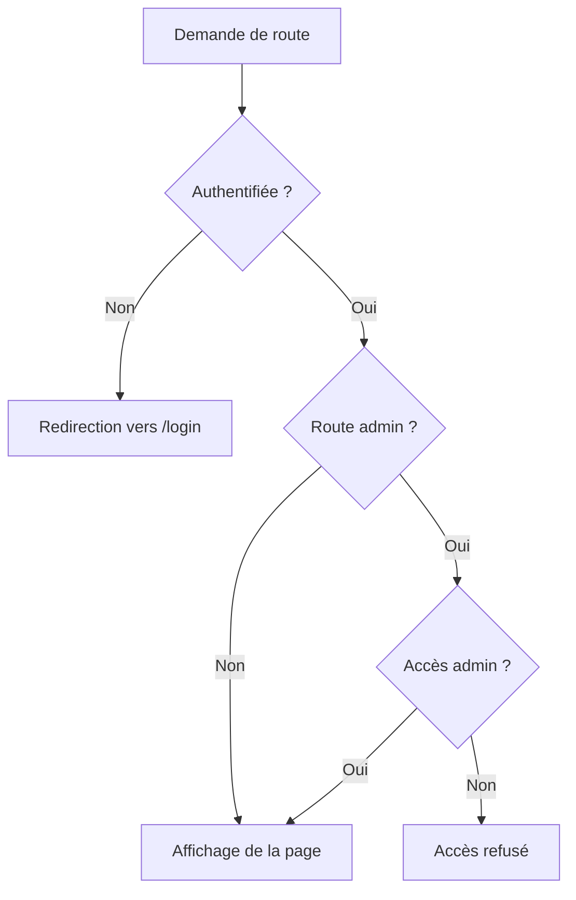

**Sources de Section**
- [WARP.md](file://WARP.md#L227-L254)
- [CLAUDE.md](file://CLAUDE.md#L65-L90)

## Optimisations et Performance

### Stratégies de Performance

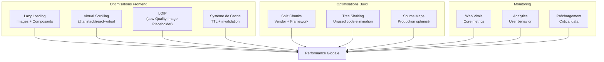

**Sources du Diagramme**
- [next.config.js](file://next.config.js#L33-L57)
- [WARP.md](file://WARP.md#L316-L333)

### Métriques de Performance

| Métrique | Objectif | Outils |
|----------|----------|--------|
| LCP | < 2.5s | WebVitals component |
| FID | < 100ms | WebVitals component |
| CLS | < 0.1 | WebVitals component |
| TTFB | < 500ms | Supabase CDN |
| Bundle Size | < 500KB | Bundle analyzer |

### Optimisations Spécifiques

**Images** :
- `OptimizedImage` : Lazy loading, LQIP, srcset, fallback SVG
- Compression côté client : browser-image-compression
- LQIP : Amélioration du LCP

**Listes** :
- Virtualisation : @tanstack/react-virtual
- Préchargement : PrefetchData

**Cache** :
- TTL configurable : lib/cache.ts
- Invalidation par pattern
- localStorage pour UI state

**Sources de Section**
- [WARP.md](file://WARP.md#L316-L333)
- [CLAUDE.md](file://CLAUDE.md#L227-L241)

## Sécurité et Validation

### Stratégies de Sécurité

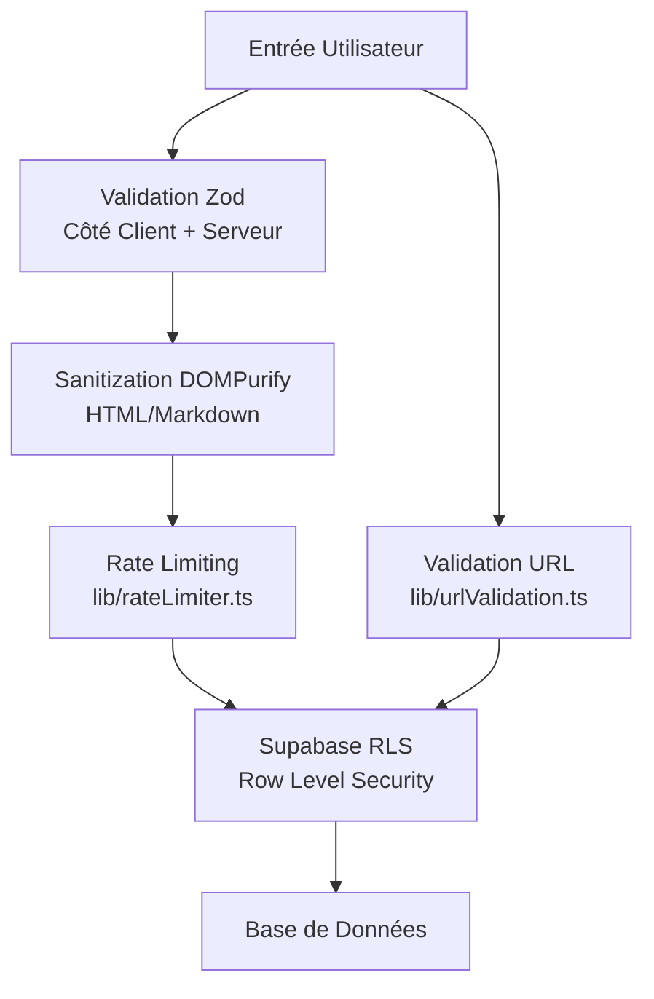

**Sources du Diagramme**
- [AGENTS.md](file://AGENTS.md#L585-L610)

### Validation et Sanitization

**Validation Zod** :
```typescript
export const photoSchema = z.object({
  title: z.string().min(1).max(200).trim(),
  description: z.string().max(1000).trim().optional().nullable(),
  image_url: z.string().url('URL invalide').min(1),
  display_order: z.number().int().nonnegative().default(0),
});
```

**Sanitization** :
```typescript
import DOMPurify from 'isomorphic-dompurify';

// Pour du contenu HTML
const cleanHTML = DOMPurify.sanitize(userInput);

// Pour du Markdown (déjà sanitizé par react-markdown)
<ReactMarkdown remarkPlugins={[remarkGfm]}>
  {content}
</ReactMarkdown>
```

### Politiques de Sécurité

| Aspect | Implémentation | Description |
|--------|----------------|-------------|
| CORS | Supabase | Configuration automatique |
| CSRF | Supabase Auth | Géré automatiquement |
| XSS | DOMPurify | Sanitization côté client |
| Rate limiting | Client-side | lib/rateLimiter.ts |
| RLS | Supabase | Policies strictes |

### Bonnes Pratiques

**Validation côté client** :
- Toujours utiliser Zod
- Valider avant les appels API
- Messages d'erreur utilisateur en français

**Validation côté serveur** :
- Répéter la validation Supabase
- Gérer les erreurs de validation
- Logger les tentatives d'injection

**Sources de Section**
- [AGENTS.md](file://AGENTS.md#L585-L610)
- [WARP.md](file://WARP.md#L353-L359)

## Maintenance et Outils

### Scripts de Maintenance

```bash
# Audit de sécurité
npm run audit
npm run audit:fix

# Analyse de performance
npm run analyze
npm run check-bundle

# Génération LQIP
npm run generate-lqip  # Visiter /admin/migrate-lqip

# Vérification qualité
npm run lint
npm run typecheck
```

### Outils de Monitoring

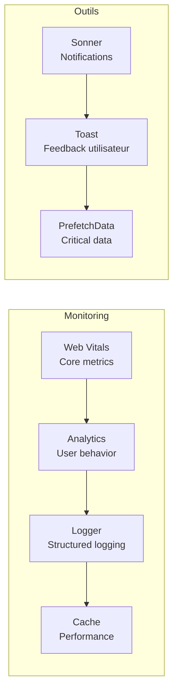

**Sources du Diagramme**
- [WARP.md](file://WARP.md#L316-L333)

### Configuration des Environnements

**Développement** :
- Variables d'environnement dans `.env.local`
- Supabase en mode développement
- Source maps activées

**Production** :
- Variables d'environnement de déploiement
- Source maps désactivées
- Console.log supprimés (sauf error/warn)
- Bundle analyzer activé (optionnel)

### Mise à Jour de la Documentation

Utilisez la commande `agents-update` pour maintenir la documentation à jour :

```bash
# Claude Code
/agents-update

# Gemini CLI
gemini run agents-update

# Codex CLI
codex agents-update
```

**Sources de Section**
- [package.json](file://package.json#L5-L16)
- [WARP.md](file://WARP.md#L34-L51)
- [AI_TOOLS.md](file://AI_TOOLS.md#L82-L115)