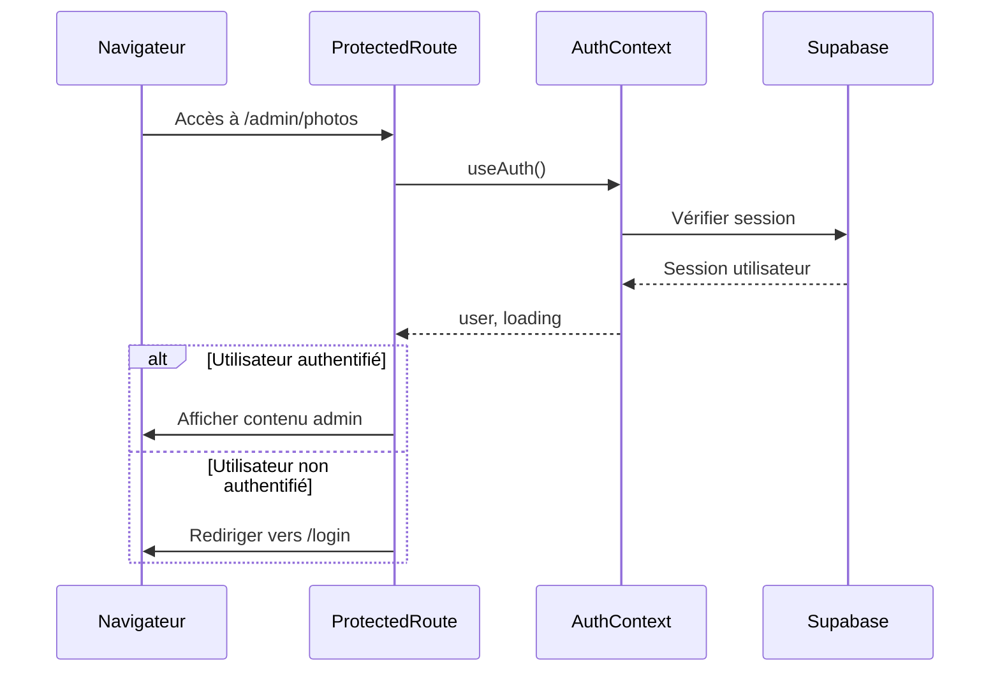
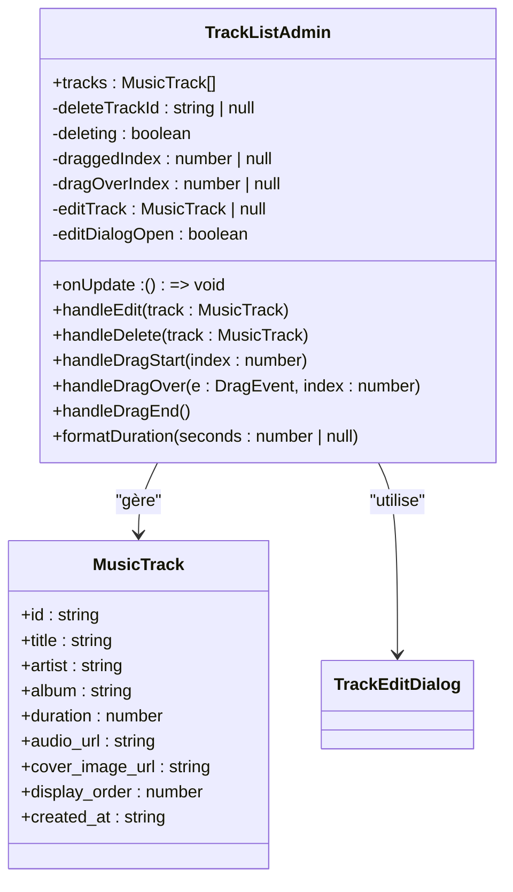
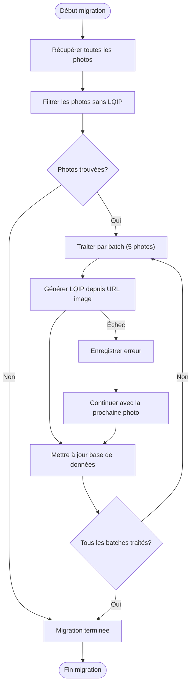
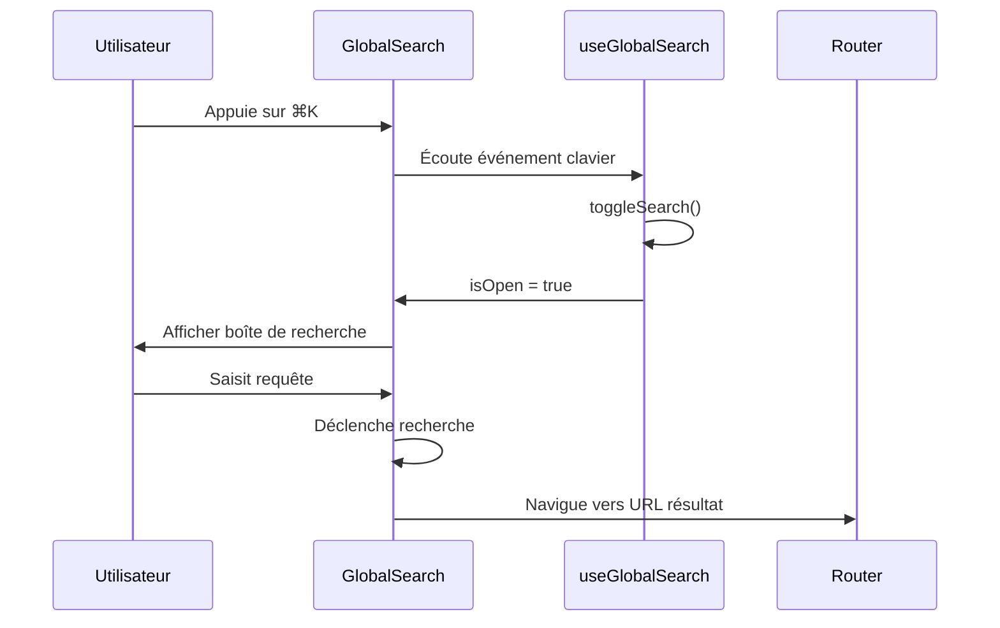
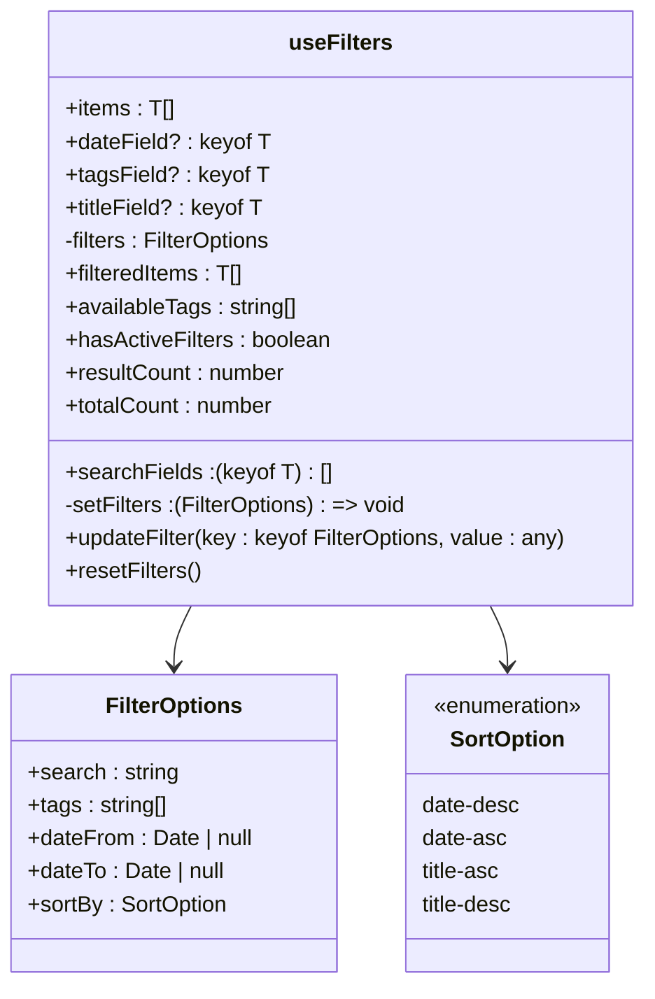

# Administration

<cite>
**Fichiers référencés dans ce document**  
- [ProtectedRoute.tsx](file://components/ProtectedRoute.tsx)
- [AuthContext.tsx](file://contexts/AuthContext.tsx)
- [photos/page.tsx](file://app/admin/photos/page.tsx)
- [music/page.tsx](file://app/admin/music/page.tsx)
- [texts/page.tsx](file://app/admin/texts/page.tsx)
- [videos/page.tsx](file://app/admin/videos/page.tsx)
- [applications/page.tsx](file://app/admin/applications/page.tsx)
- [migrate-lqip/page.tsx](file://app/admin/migrate-lqip/page.tsx)
- [generate-lqip-for-existing.ts](file://scripts/generate-lqip-for-existing.ts)
- [GlobalSearch.tsx](file://components/GlobalSearch.tsx)
- [useGlobalSearch.ts](file://hooks/useGlobalSearch.ts)
- [AdvancedFilters.tsx](file://components/AdvancedFilters.tsx)
- [useFilters.ts](file://hooks/useFilters.ts)
- [TrackListAdmin.tsx](file://components/music/TrackListAdmin.tsx)
- [VideoListAdmin.tsx](file://components/videos/VideoListAdmin.tsx)
- [TextListAdmin.tsx](file://components/texts/TextListAdmin.tsx)
- [PhotoListAdmin.tsx](file://components/photos/PhotoListAdmin.tsx)
- [RepositoryListAdmin.tsx](file://components/repositories/RepositoryListAdmin.tsx)
</cite>

## Table des matières
1. [Introduction](#introduction)
2. [Accès sécurisé et authentification](#accès-sécurisé-et-authentification)
3. [Interfaces d'administration spécifiques](#interfaces-dadministration-spécifiques)
4. [Outil de migration LQIP](#outil-de-migration-lqip)
5. [Système de recherche globale](#système-de-recherche-globale)
6. [Filtres avancés](#filtres-avancés)
7. [Implémentation d'un nouveau module d'administration](#implémentation-dun-nouveau-module-dadministration)
8. [Sécurité et rôles utilisateur dans Supabase](#sécurité-et-rôles-utilisateur-dans-supabase)

## Introduction

Ce document présente le système d'administration du portfolio, couvrant les aspects clés de sécurité, de gestion de contenu, d'optimisation et de recherche. Le système permet une gestion centralisée des différents types de médias (photos, musique, textes, vidéos, applications) avec des fonctionnalités avancées comme la recherche globale, les filtres complexes et l'optimisation des performances via LQIP.

## Accès sécurisé et authentification

Le système d'administration repose sur un mécanisme d'authentification sécurisé implémenté via `AuthContext.tsx` et `ProtectedRoute.tsx`. Ce système garantit que seuls les utilisateurs authentifiés peuvent accéder aux interfaces d'administration.

### Contexte d'authentification

Le contexte d'authentification, défini dans `AuthContext.tsx`, fournit un état global pour gérer l'état de connexion de l'utilisateur. Il expose les fonctionnalités suivantes :

- **Gestion de session** : Stockage et mise à jour de la session utilisateur
- **Connexion/Déconnexion** : Méthodes pour s'authentifier et se déconnecter
- **Observation d'état** : Abonnement aux changements d'état d'authentification

Le contexte utilise `authService` pour interagir avec Supabase, le fournisseur d'authentification backend.

**Section sources**
- [AuthContext.tsx](file://contexts/AuthContext.tsx#L1-L71)

### Routes protégées

Le composant `ProtectedRoute.tsx` assure la protection des pages d'administration en vérifiant l'état d'authentification avant d'autoriser l'accès. Son fonctionnement est le suivant :

1. Il utilise le hook `useAuth()` pour accéder à l'état d'authentification
2. Pendant le chargement, il affiche un indicateur de chargement
3. Si l'utilisateur n'est pas authentifié, il redirige vers la page de connexion
4. Une fois authentifié, il rend le contenu protégé

Ce mécanisme est appliqué à toutes les pages d'administration en les enveloppant dans le composant `ProtectedRoute`.



**Diagram sources**
- [ProtectedRoute.tsx](file://components/ProtectedRoute.tsx#L1-L35)
- [AuthContext.tsx](file://contexts/AuthContext.tsx#L1-L71)

**Section sources**
- [ProtectedRoute.tsx](file://components/ProtectedRoute.tsx#L1-L35)

## Interfaces d'administration spécifiques

Le système d'administration propose des interfaces dédiées pour chaque type de contenu, chacune implémentant des fonctionnalités de gestion spécifiques.

### Administration des photos

L'interface d'administration des photos (`admin/photos/page.tsx`) permet de gérer la galerie de photos avec les fonctionnalités suivantes :

- Téléversement de nouvelles photos
- Gestion des métadonnées (titre, description, tags)
- Réorganisation par glisser-déposer
- Suppression de photos
- Gestion des tags

L'interface utilise `PhotoListAdmin.tsx` pour afficher et gérer la liste des photos, avec un système de drag-and-drop pour modifier l'ordre d'affichage.

**Section sources**
- [photos/page.tsx](file://app/admin/photos/page.tsx#L1-L172)
- [PhotoListAdmin.tsx](file://components/photos/PhotoListAdmin.tsx)

### Administration de la musique

L'interface d'administration musicale (`admin/music/page.tsx`) permet de gérer la bibliothèque musicale avec des fonctionnalités spécifiques :

- Téléversement de morceaux audio
- Gestion des métadonnées (titre, artiste, album, durée)
- Attribution de pochettes d'album
- Réorganisation de la playlist
- Gestion des tags

Le composant `TrackListAdmin.tsx` implémente une interface de gestion avancée avec des fonctionnalités de modification et de suppression sécurisées.



**Diagram sources**
- [music/page.tsx](file://app/admin/music/page.tsx#L1-L172)
- [TrackListAdmin.tsx](file://components/music/TrackListAdmin.tsx#L1-L264)

**Section sources**
- [music/page.tsx](file://app/admin/music/page.tsx#L1-L172)
- [TrackListAdmin.tsx](file://components/music/TrackListAdmin.tsx#L1-L264)

### Administration des textes

L'interface d'administration des textes (`admin/texts/page.tsx`) permet de gérer les contenus rédactionnels avec des fonctionnalités avancées :

- Rédaction en Markdown
- Gestion des catégories et tags
- Publication/dépublication
- Organisation par ordre de priorité
- Aperçu des métadonnées

Le composant `TextListAdmin.tsx` offre une interface de gestion complète avec des badges de catégorie et de tags, et un système de drag-and-drop pour réorganiser les textes.

**Section sources**
- [texts/page.tsx](file://app/admin/texts/page.tsx#L1-L173)
- [TextListAdmin.tsx](file://components/texts/TextListAdmin.tsx#L1-L226)

### Administration des vidéos

L'interface d'administration des vidéos (`admin/videos/page.tsx`) permet de gérer la bibliothèque vidéo avec des fonctionnalités spécifiques :

- Téléversement de fichiers vidéo
- Gestion des miniatures
- Attribution de métadonnées (titre, description, durée)
- Réorganisation de la liste
- Gestion des tags

Le composant `VideoListAdmin.tsx` implémente une interface similaire à `TrackListAdmin` mais adaptée aux vidéos, avec des fonctionnalités de modification et de suppression sécurisées.

**Section sources**
- [videos/page.tsx](file://app/admin/videos/page.tsx)
- [VideoListAdmin.tsx](file://components/videos/VideoListAdmin.tsx#L1-L261)

### Administration des applications

L'interface d'administration des applications (`admin/applications/page.tsx`) permet de gérer les projets et applications présentés dans le portfolio. Elle inclut des fonctionnalités de gestion des métadonnées, des captures d'écran et des liens associés.

**Section sources**
- [applications/page.tsx](file://app/admin/applications/page.tsx)

## Outil de migration LQIP

L'outil de migration LQIP permet d'optimiser les performances du site en générant des placeholders flous (Low-Quality Image Placeholders) pour les images existantes.

### Interface d'administration

La page `migrate-lqip/page.tsx` fournit une interface utilisateur pour exécuter la migration LQIP. Elle permet :

- D'analyser les photos existantes sans LQIP
- De générer des LQIP par batch pour éviter la surcharge
- De mettre à jour la base de données avec les LQIP générés
- De suivre la progression de la migration

L'interface affiche un rapport de migration avec le nombre de photos traitées et les erreurs éventuelles.

**Section sources**
- [migrate-lqip/page.tsx](file://app/admin/migrate-lqip/page.tsx#L1-L196)

### Script de migration

Le script `generate-lqip-for-existing.ts` contient la logique de génération des LQIP. Il fonctionne de la manière suivante :

1. Récupère toutes les photos sans LQIP
2. Pour chaque photo, génère un LQIP en utilisant l'API Canvas
3. Met à jour la base de données avec le LQIP généré
4. Gère les erreurs et continue le traitement

Le script est conçu pour fonctionner dans le navigateur car il utilise l'API Canvas, mais peut également être exécuté côté serveur avec la bibliothèque 'canvas'.



**Diagram sources**
- [migrate-lqip/page.tsx](file://app/admin/migrate-lqip/page.tsx#L1-L196)
- [generate-lqip-for-existing.ts](file://scripts/generate-lqip-for-existing.ts#L1-L104)

**Section sources**
- [generate-lqip-for-existing.ts](file://scripts/generate-lqip-for-existing.ts#L1-L104)

## Système de recherche globale

Le système de recherche globale permet de trouver rapidement du contenu dans l'ensemble du site, indépendamment du type de média.

### Composant GlobalSearch

Le composant `GlobalSearch.tsx` implémente une interface de recherche inspirée des command palettes. Il permet :

- La recherche textuelle dans tous les types de contenu
- L'accès rapide via le raccourci ⌘K / Ctrl+K
- L'affichage des résultats par catégorie
- L'historique des recherches récentes
- La navigation directe vers les résultats

L'interface utilise le composant `CommandDialog` de Radix UI pour une expérience utilisateur fluide.

**Section sources**
- [GlobalSearch.tsx](file://components/GlobalSearch.tsx#L1-L298)

### Hook useGlobalSearch

Le hook `useGlobalSearch.ts` gère l'état de la recherche globale avec les fonctionnalités suivantes :

- Gestion de l'état ouvert/fermé
- Raccourci clavier ⌘K / Ctrl+K
- Navigation automatique vers les résultats
- Journalisation des interactions

Le hook utilise `useRouter` pour la navigation et `useEffect` pour écouter les événements clavier.



**Diagram sources**
- [GlobalSearch.tsx](file://components/GlobalSearch.tsx#L1-L298)
- [useGlobalSearch.ts](file://hooks/useGlobalSearch.ts#L1-L73)

**Section sources**
- [useGlobalSearch.ts](file://hooks/useGlobalSearch.ts#L1-L73)

## Filtres avancés

Le système de filtres avancés permet d'affiner les résultats de recherche ou de navigation selon différents critères.

### Composant AdvancedFilters

Le composant `AdvancedFilters.tsx` fournit une interface de filtrage réutilisable avec les fonctionnalités suivantes :

- Recherche textuelle
- Filtrage par tags (multi-sélection)
- Filtrage par plage de dates
- Tri par date ou titre
- Indicateur de résultats
- Réinitialisation des filtres

L'interface est pliable pour économiser l'espace et affiche un badge indiquant le nombre de filtres actifs.

**Section sources**
- [AdvancedFilters.tsx](file://components/AdvancedFilters.tsx#L1-L301)

### Hook useFilters

Le hook `useFilters.ts` implémente la logique de filtrage et de tri. Il prend en charge :

- Le filtrage par recherche textuelle sur des champs spécifiés
- Le filtrage par tags avec correspondance exacte
- Le filtrage par plage de dates
- Le tri par date (asc/desc) ou par titre (A-Z/Z-A)
- L'extraction des tags disponibles à partir des données

Le hook utilise `useMemo` pour optimiser les performances en mémorisant les résultats filtrés.



**Diagram sources**
- [useFilters.ts](file://hooks/useFilters.ts#L1-L178)
- [AdvancedFilters.tsx](file://components/AdvancedFilters.tsx#L1-L301)

**Section sources**
- [useFilters.ts](file://hooks/useFilters.ts#L1-L178)

## Implémentation d'un nouveau module d'administration

Pour implémenter un nouveau module d'administration, suivez les étapes suivantes :

### Structure de base

Créez une nouvelle page dans `app/admin/nom-module/page.tsx` avec la structure suivante :

```tsx
'use client';

import { useState, useEffect } from 'react';
import { ProtectedRoute } from '@/components/ProtectedRoute';
import { Card, CardContent, CardDescription, CardHeader, CardTitle } from '@/components/ui/card';
import { Tabs, TabsContent, TabsList, TabsTrigger } from '@/components/ui/tabs';

function AdminModuleContent() {
  const [items, setItems] = useState<ItemType[]>([]);
  const [loading, setLoading] = useState(true);

  useEffect(() => {
    fetchItems();
  }, []);

  const fetchItems = async () => {
    setLoading(true);
    try {
      // Récupérer les données via le service approprié
      const { items: data, error } = await moduleService.getAllItems();
      if (error) throw error;
      setItems(data || []);
    } catch (error) {
      console.error('Error fetching items:', error);
    } finally {
      setLoading(false);
    }
  };

  return (
    <div className="space-y-6">
      <div className="flex items-center justify-between">
        <div>
          <h1 className="text-3xl font-bold mb-2">Administration du Module</h1>
          <p className="text-muted-foreground">Gérez votre contenu</p>
        </div>
      </div>

      <Tabs defaultValue="module" className="space-y-6">
        <TabsList className="grid w-full grid-cols-1 lg:w-auto">
          <TabsTrigger value="module" className="gap-2">
            <Upload className="h-4 w-4" />
            Module
          </TabsTrigger>
        </TabsList>

        <TabsContent value="module" className="space-y-6">
          {/* Contenu de gestion */}
        </TabsContent>
      </Tabs>
    </div>
  );
}

export default function AdminModulePage() {
  return (
    <ProtectedRoute>
      <AdminModuleContent />
    </ProtectedRoute>
  );
}
```

### Composant de liste d'administration

Créez un composant de gestion dans `components/module/ItemListAdmin.tsx` :

```tsx
'use client';

import { useState } from 'react';
import { ItemType } from '@/lib/supabaseClient';
import { moduleService } from '@/services/moduleService';
import { Button } from '@/components/ui/button';
import { Card, CardContent } from '@/components/ui/card';
import { Trash2, GripVertical, Edit2 } from 'lucide-react';
import { toast } from 'sonner';

interface ItemListAdminProps {
  items: ItemType[];
  onUpdate: () => void;
}

export function ItemListAdmin({ items, onUpdate }: ItemListAdminProps) {
  const [deleteItemId, setDeleteItemId] = useState<string | null>(null);
  const [deleting, setDeleting] = useState(false);
  const [draggedIndex, setDraggedIndex] = useState<number | null>(null);
  const [dragOverIndex, setDragOverIndex] = useState<number | null>(null);
  const [editItem, setEditItem] = useState<ItemType | null>(null);
  const [editDialogOpen, setEditDialogOpen] = useState(false);

  const handleDelete = async (item: ItemType) => {
    setDeleting(true);
    try {
      // Supprimer les fichiers associés si nécessaire
      if (item.file_url) {
        const fileName = storageService.extractFileNameFromUrl(item.file_url);
        await storageService.deleteFile(fileName);
      }

      const { error: dbError } = await moduleService.deleteItem(item.id);
      if (dbError) throw dbError;

      toast.success('Élément supprimé', {
        description: `"${item.title}" a été supprimé`,
      });

      onUpdate();
    } catch (error) {
      console.error('Error deleting item:', error);
      toast.error('Erreur', {
        description: 'Impossible de supprimer l\'élément',
      });
    } finally {
      setDeleting(false);
      setDeleteItemId(null);
    }
  };

  const handleDragEnd = async () => {
    if (draggedIndex === null || dragOverIndex === null || draggedIndex === dragOverIndex) {
      setDraggedIndex(null);
      setDragOverIndex(null);
      return;
    }

    const reorderedItems = [...items];
    const [movedItem] = reorderedItems.splice(draggedIndex, 1);
    reorderedItems.splice(dragOverIndex, 0, movedItem);

    try {
      for (const [index, item] of reorderedItems.entries()) {
        const { error } = await moduleService.updateDisplayOrder(item.id, index);
        if (error) throw error;
      }

      toast.success('Ordre mis à jour', {
        description: 'L\'ordre des éléments a été modifié',
      });

      onUpdate();
    } catch (error) {
      console.error('Error updating order:', error);
      toast.error('Erreur', {
        description: 'Impossible de réorganiser les éléments',
      });
    } finally {
      setDraggedIndex(null);
      setDragOverIndex(null);
    }
  };

  if (items.length === 0) {
    return (
      <div className="text-center py-12 text-muted-foreground">
        Aucun élément pour le moment
      </div>
    );
  }

  return (
    <>
      <div className="space-y-3">
        {items.map((item, index) => (
          <Card
            key={item.id}
            draggable
            onDragStart={() => setDraggedIndex(index)}
            onDragOver={(e) => handleDragOver(e, index)}
            onDragEnd={handleDragEnd}
            className="cursor-move hover:shadow-md transition-shadow"
          >
            <CardContent className="p-4">
              <div className="flex items-center gap-4">
                <div className="cursor-move">
                  <GripVertical className="h-5 w-5 text-muted-foreground" />
                </div>
                <div className="flex-1 min-w-0">
                  <h4 className="font-semibold truncate">{item.title}</h4>
                  {item.description && (
                    <p className="text-sm text-muted-foreground truncate">
                      {item.description}
                    </p>
                  )}
                </div>
                <div className="flex gap-2">
                  <Button
                    variant="outline"
                    size="icon"
                    onClick={() => setEditItem(item)}
                  >
                    <Edit2 className="h-4 w-4" />
                  </Button>
                  <Button
                    variant="destructive"
                    size="icon"
                    onClick={() => setDeleteItemId(item.id)}
                    disabled={deleting}
                  >
                    <Trash2 className="h-4 w-4" />
                  </Button>
                </div>
              </div>
            </CardContent>
          </Card>
        ))}
      </div>
    </>
  );
}
```

**Section sources**
- [photos/page.tsx](file://app/admin/photos/page.tsx#L1-L172)
- [music/page.tsx](file://app/admin/music/page.tsx#L1-L172)
- [TrackListAdmin.tsx](file://components/music/TrackListAdmin.tsx#L1-L264)

## Sécurité et rôles utilisateur dans Supabase

Le système d'administration met en œuvre des mesures de sécurité robustes via Supabase pour contrôler l'accès aux fonctionnalités.

### Contrôles d'accès

Les migrations Supabase (`supabase/migrations/`) incluent des contraintes de sécurité pour protéger les données :

- **Contraintes de rôle** : Définition des permissions par rôle utilisateur
- **Policies RLS** : Row Level Security pour contrôler l'accès aux données
- **Validation des entrées** : Contraintes sur les champs sensibles

Les fichiers de migration comme `20251111050910_create_playlists_system.sql` implémentent ces contrôles au niveau de la base de données.

### Gestion des sessions

Le système utilise l'authentification JWT de Supabase avec :

- **Sessions persistantes** : Conservation de l'état de connexion
- **Rafraîchissement automatique** : Maintien de la session active
- **Déconnexion sécurisée** : Nettoyage complet de la session

Le service `authService.ts` encapsule ces fonctionnalités avec une interface propre.

### Sécurité côté client

Les composants d'administration implémentent plusieurs couches de sécurité :

- **Vérification côté client** : Double vérification de l'état d'authentification
- **Gestion des erreurs** : Journalisation sécurisée sans exposition de détails sensibles
- **Protection CSRF** : Utilisation des mécanismes intégrés de Supabase

Le contexte `AuthContext` et le composant `ProtectedRoute` forment la première ligne de défense contre les accès non autorisés.

**Section sources**
- [supabase/migrations/](file://supabase/migrations/)
- [services/authService.ts](file://services/authService.ts)
- [contexts/AuthContext.tsx](file://contexts/AuthContext.tsx#L1-L71)
- [components/ProtectedRoute.tsx](file://components/ProtectedRoute.tsx#L1-L35)